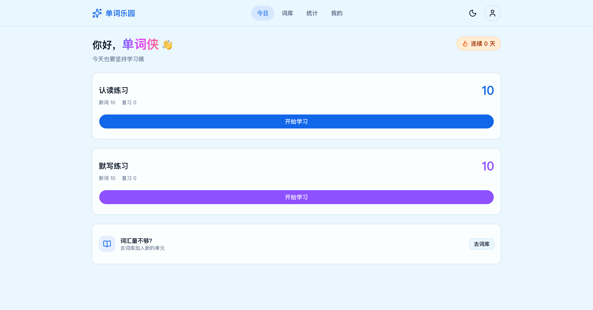
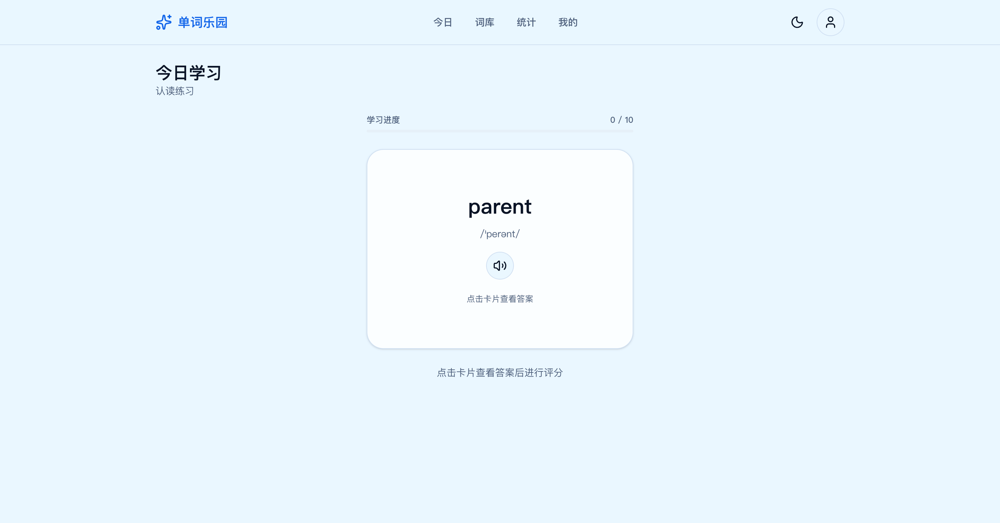
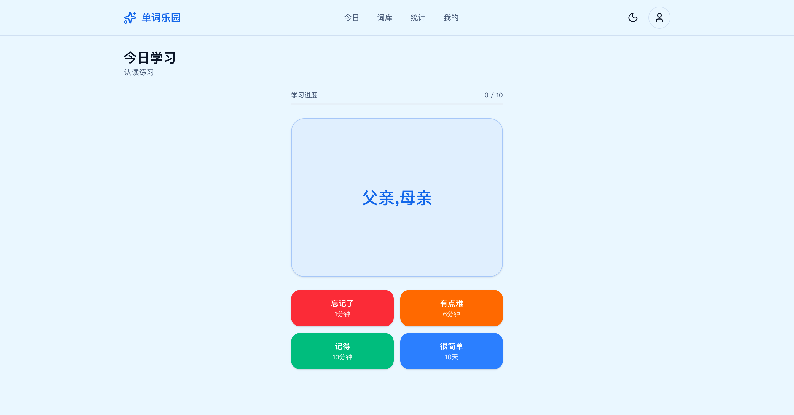
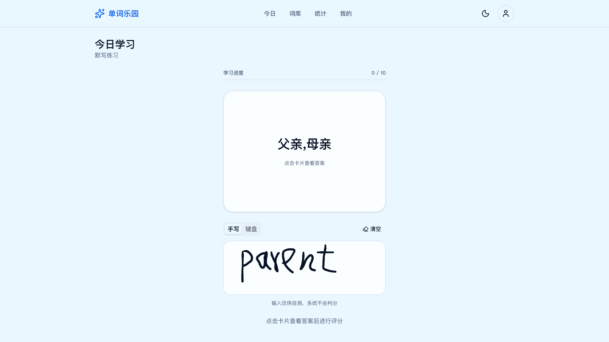
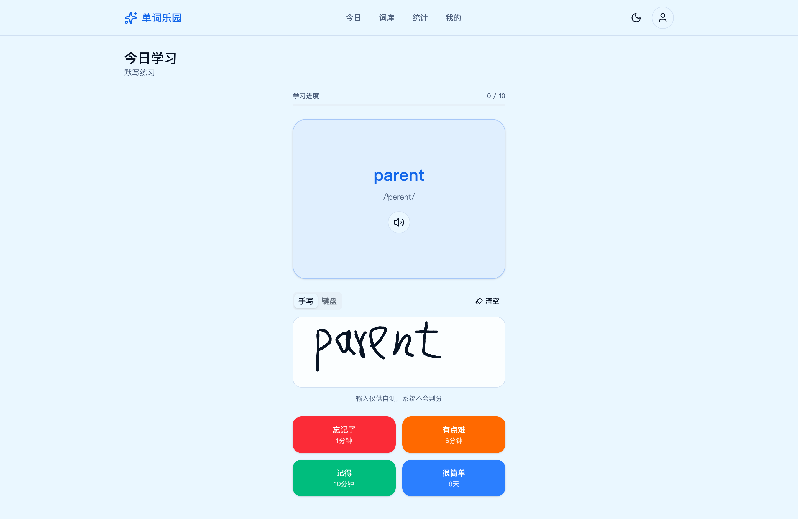

<template>
  

    

      
      
单词乐园

    

    

      
基于 FSRS 间隔重复算法，把单词记得更牢

      

        <a class="cta-button" href="https://words.cp3hnu.com" target="_blank" rel="noopener noreferrer">
          Let's go
          →
        </a>
      

    

    

      

        
首页

        
      

    

    

      

        
认读练习

        
      

    

    

      

        
认读练习，查看答案，评分

        
      

    

    

      

        
默写练习

        
      

    

     

      

        
默写练习，查看答案，评分

        
      

    

  

</template>

