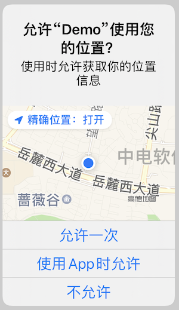
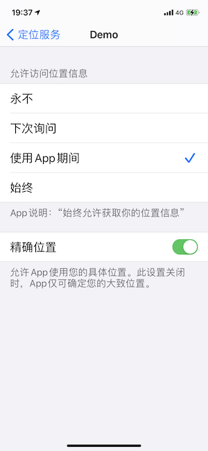

# 实现后台位置更新

实现后台位置更新涉及两个方面：

1. 后台服务（Background Modes）
2. 请求定位服务权限（`whenInUse` or `always`）

## 后台服务

App 一般都是在前台使用定位服务，如果 app 想要在后台接收位置更新，就需要配置 Background Modes 为 `Location updates`，同时也要设置 `CLLocationManager` 的 [`allowsBackgroundLocationUpdates`](dash-apple-api://load?request_key=ls/documentation/corelocation/cllocationmanager/1620568-allowsbackgroundlocationupdates) 属性为 true

[startUpdatingLocation()](https://developer.apple.com/documentation/corelocation/cllocationmanager/1423750-startupdatinglocation) 方法也说了，如果想要在后台收位置更新，需要设置 Background Modes 为 `Location updates`

> If you start this service and your app is suspended, the system stops the delivery of events until your app starts running again (either in the foreground or background). If your app is terminated, the delivery of new location events stops altogether. Therefore, if your app needs to receive location events while in the background, it must include the `UIBackgroundModes` key (with the `location` value) in its `Info.plist` file.
>

 `Location updates` 不仅能让 app 在后台接收到位置更新，某些定位服务还能在 app 挂起或者终止（包括用户主动杀死 app）时，重新启动 app。

下面是能重启 app 的定位服务，详情请参考 [Handling Location Events in the Background](https://developer.apple.com/documentation/corelocation/getting_the_user_s_location/handling_location_events_in_the_background)

| Service                             | Launches app |
| :---------------------------------- | :----------- |
| Standard location service           | No           |
| Significant-change location service | Yes          |
| Visits service                      | Yes          |
| Region monitoring                   | Yes          |
| iBeacon ranging                     | No           |
| Heading service                     | No           |

## `whenInUse` 和 `always` 的区别

要使用定位服务，首先需要请求用户授权， `CLLocationManager` 提供两个方法

1. [requestWhenInUseAuthorization()](https://developer.apple.com/documentation/corelocation/cllocationmanager/1620562-requestwheninuseauthorization) 方法，请求 `whenInUse` 权限
2. [requestAlwaysAuthorization()](https://developer.apple.com/documentation/corelocation/cllocationmanager/1620551-requestalwaysauthorization) 方法，请求 `always` 权限

那这两个权限有什么区别呢？ [Choosing the Location Services Authorization to Request](https://developer.apple.com/documentation/corelocation/choosing_the_location_services_authorization_to_request) 文档写道：

> When In Use
>
> Your app can use all location services and receive events while the app is in use. In general, iOS apps are considered in use when they're in the foreground or running in the background with the background location usage indicator enabled.
>
> Always
>
> Your app can use all location services and receive events even if the user is not aware that your app is running. If your app isn’t running, the system launches your app and delivers the event.

 `whenInUse` 应用于使用 app 时(app in use)使用定位服务，什么是使用 app，**这里有个误区**，以为只有 app 在前台运行的时候，才是使用 app，其实不是，在后台也可以使用 app，但是需要设置 `Location updates` 的后台服务。

 `always` 应用于任何情况下使用定位服务，即使 app 没有在运行，且用户无感知 app 是否在运行。同时一些后台定位服务需要 `always` 权限才能运行，比如 Significant-change location service、Visits service、Region monitoring，而且这些定位服务在 app 没有运行时会重启 app。

但是 `always` 并不是意味只要用户授权了 `always` 权限就能在后台使用定位服务, app 能否在后台使用定位服务完全取决于 Background Modes 是否设置为 `Location updates` 。只是 Significant-change location service、Visits service、Region monitoring 这些定位服务要想在后台运行，即要求 `Location updates` 的后台服务，也要  `always`  权限，**这是另一个误区**。

详情请参考 [Choosing the Location Services Authorization to Request](https://developer.apple.com/documentation/corelocation/choosing_the_location_services_authorization_to_request).

## 怎样请求 `always` 权限

在 iOS 13 之后，定位授权发生了一些变化，新增了 "允许一次"的授权， `always` 的授权流程也发生了变化，取消了"始终允许"的选项。

请求 `always` 权限分以下两种

### Request Always Authorization After Getting When In Use

在定位授权状态是  `notDetermined ` 的时候，我们先调用 `requestWhenInUseAuthorization` 方法获取 `authorizedWhenInUse` 权限。这个时候系统以 info.plist 的 `Privacy - Location When In Use Usage Description`，提示用户授权

  
  
图1：When In Use 授权提示

然后紧接着调用 `requestAlwaysAuthorization` 方法，请求 `authorizedAlways` 权限，这个时候系统以 info.plist 的 `Privacy - Location Always and When In Use Usage Description`，提示用户授权

  
  
图2：Always 授权提示

以下情况将不能获取 `authorizedAlways` 权限
1. 在图1中，如果用户选择"允许一次"或者"不允许"。"允许一次"只是临时授权，下次再请求定位权限时，还能提示用户授权 `authorizedWhenInUse` ，然后接着提示用户授权 `authorizedAlways` 。
2. 在图2中，选择"保持仅使用期间"。当用户选择了这个之后，再调用`requestAlwaysAuthorization` 方法，将不再提示用户修改权限。

### Request Always Authorization Directly

在定位授权状态是  `notDetermined ` 的时候，直接调用 `requestAlwaysAuthorization` 方法，请求 `authorizedAlways` 权限。这个时候系统依然提示用户"使用App时允许"，而不是"始终允许"

但是如果用户选择"使用App时允许"，将授予 app **临时 always** 权限，`authorizationStatus` 返回  `authorizedAlways` ，但是去 Setting 里看 app 定位服务还是 "使用App时允许"。

至于什么时候再提示用户授权永久的 `always` 权限，文档是这么写的

> The second prompt displays when Core Location prepares to deliver an event to your app requiring `CLAuthorizationStatus.authorizedAlways`. 
>
> Core Location will typically display the second prompt when your app isn’t running.
>

应该是说到了需要  `always` 权限的时候，系统会自动提示用户。如果你没有开启后台定位服务，系统将永远不会自动提示用户。

Core Location 一般会在 app 没有运行时提示用户。经测试一般会在 app 进入后台，且在后台继续请求定位服务的时候提示用户，且只提示一次。

## 实现后台位置更新

讲了这么多，回到我们的正题，怎样实现后台位置更新？

1. 设置 Background Modes 为 `Location updates` 
2. 请求 `whenInUse` 的定位服务权限；或者请求 `always` 的定位服务权限，可以设置 `showsBackgroundLocationIndicator = true`

## showsBackgroundLocationIndicator

看文档经常提到 the background location usage indicator，这是  `CLLocationManager` 的一个属性 [showsBackgroundLocationIndicator](https://developer.apple.com/documentation/corelocation/cllocationmanager/2923541-showsbackgroundlocationindicator#)，控制是否通过改变 status bar 的样式（在左上角有一个蓝色的小块），表示 app 正在后台使用定位服务。

[Choosing the Location Services Authorization to Request](https://developer.apple.com/documentation/corelocation/choosing_the_location_services_authorization_to_request) 文档在 When In Use 中写道：

> In general, iOS apps are considered in use when they're in the foreground or running in the background with the background location usage indicator enabled.

仿佛只要设置 ` showsBackgroundLocationIndicator ` 为 true，app 就能在后台运行定位服务。其实不是，而是需要设置  `Location updates` 后台服务。

[showsBackgroundLocationIndicator](https://developer.apple.com/documentation/corelocation/cllocationmanager/2923541-showsbackgroundlocationindicator#) 属性文档写道

> This property affects only apps that received Always authorization. When such an app moves to the background, the system uses this property to determine whether to change the status bar appearance to indicate that location services are in use. Set this value to `true` to maintain transparency with the user.
>
> For apps with When In Use authorization, the system changes the appearance of the status bar when the app uses location services in the background.

这里写道  ` showsBackgroundLocationIndicator ` 只在 `always` 权限有用，通过这个值控制是否改变状态栏，以表明 app 正在使用定位服务。

当在  `whenInUse` 权限时，忽略这个值，系统会自动改变 status bar 的样式，表示 app 正在后台使用定位服务，但是需要 app 能在后台使用定位服务（通过设置  `Location updates` ）。

## Reference

- [Handling Location Events in the Background](https://developer.apple.com/documentation/corelocation/getting_the_user_s_location/handling_location_events_in_the_background)
- [Choosing the Location Services Authorization to Request](https://developer.apple.com/documentation/corelocation/choosing_the_location_services_authorization_to_request)
- [Understanding New Location Permission Changes in iOS 13](https://betterprogramming.pub/understanding-new-location-permission-changes-in-ios-13-6c34dc5f54da)

