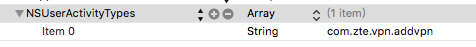

# NSUserActivity 的用处

*NSUserActivity* 是 iOS 里一个表示 App 某个瞬间状态的类，App 很多功能都需要用到它，包括 Handoff, App Search, Universal Links, SiriKit 以及 State Restoration.

## Handoff

### Prerequisites

-   以相同的 iCloud 账号登录
-   蓝牙 LE 4.0 以上
-   iOS 8.0+
-   相同的 Developer Team ID
-   支持指定的 Activity Type

### Add Activity Type

在 **info.plist** 文件里添加 **NSUserActivityTypes**，如



### Originating App

#### 1. Start User Activity

``` swift
func startUserActivity() { 
  let activity = NSUserActivity(activityType: "com.myCompany.myApp.xxx")
  activity.title = "Title"
  activity.userInfo = [key: value]
  self.userActivity = activity     // self.userActivity 定义在 UIResponder 类中
  self.userActivity?.becomeCurrent()
}
```

#### 2. Update User Activity

``` swift
func textFieldTextDidChanged(notification: NSNotification) {
	self.userActivity?.needsSave = true
}
```

``` swift
// Defined in UIResponder
// 当设置 needsSave = true 时，这个方法会在一个合适的时间被调用
// 当 UIResponder 管理的 NSUserActivity 被更新时, NSUserActivity 的 userInfo 是空的，
// 在这个方法里更新 userInfo
override func updateUserActivityState(_ userActivity: NSUserActivity) {
	activity.addUserInfoEntriesFromDictionary([key: value])
	super.updateUserActivityState(activity)
}
```

#### 3. Stop User Activity

``` swift
func stopUserActivity() {
	self.userActivity?.resignCurrent()
  // or 
  self.userActivity?.invalidate()
}
```

#### 4. Versioning (Optional)

``` swift
func application(_ application: UIApplication, didUpdate userActivity: NSUserActivity) {
  userActivity.addUserInfoEntriesFromDictionary([versionKey: versionValue])
}
```

### Continuing App

#### 1. Receive User Activity

``` swift
func application(_ application: UIApplication, willContinueUserActivityWithType userActivityType: String) -> Bool {
  return true
}

func application(_ application: UIApplication, continue userActivity: NSUserActivity, restorationHandler: @escaping ([UIUserActivityRestoring]?) -> Void) -> Bool {
  let controller = ...
  // 1. 自己主动执行
  controller.restoreUserActivityState(userActivity)
  // 2. 依赖系统，推送到 controller， 然后执行 controller 的 restoreUserActivityState 方法
  restorationHandler(controller)
  return true
}

func application(_ application: UIApplication, didFailToContinueUserActivityWithType userActivityType: String, error: Error) {
    if error.code != NSUserCancelledError {
        let alert = ...
        alert.show()
    }
}
```

#### 2. Restore User Activity

``` swift
// 定义在 UIUserActivityRestoring 协议中
// UIResponder 实现了 UIUserActivityRestoring 协议
override func restoreUserActivityState(_ userActivity: NSUserActivity) {
	// padding
  self.textField.text = activity.userInfo[key] as? String
}
```

### References

*   [NSUserActivity Class Reference](https://developer.apple.com/library/ios/documentation/Foundation/Reference/NSUserActivity_Class/index.html#//apple_ref/doc/uid/TP40014322)
*   [NSUserActivityDelegate Protocol Reference](https://developer.apple.com/library/ios/documentation/AppKit/Reference/NSUserActivityDelegate_Protocol/index.html#//apple_ref/doc/uid/TP40014337)
*   [UIApplicationDelegate Protocol Reference](https://developer.apple.com/library/ios/documentation/UIKit/Reference/UIApplicationDelegate_Protocol/index.html#//apple_ref/doc/uid/TP40006786)
*   [Handoff Programming Guide](https://developer.apple.com/library/ios/documentation/UserExperience/Conceptual/Handoff/HandoffFundamentals/HandoffFundamentals.html#//apple_ref/doc/uid/TP40014338)

## App Search

App search 包括两种类型：

- **A private on-device index.** Each device contains a private index whose information is never shared with Apple or synced between devices. When you make an item available in a user’s on-device index, only that user can view the item in search results.
- **Apple’s server-side index.** The server-side index stores only publicly available data that you’ve marked appropriately on your website.

技术上 iOS 提供了三种 API 实现 app search

- NSUserActivity
- Core Spotlight framework
- Web markup

这里主要讲今天的主角—**NSUserActivity**，其它的如果感兴趣，可以查看文档 [App Search Programming Guide](https://developer.apple.com/library/archive/documentation/General/Conceptual/AppSearch/index.html)，这里面也讲到了 [Universal links](https://developer.apple.com/library/archive/documentation/General/Conceptual/AppSearch/UniversalLinks.html#//apple_ref/doc/uid/TP40016308-CH12-SW1) 和 [Smart App Banners](https://developer.apple.com/library/archive/documentation/AppleApplications/Reference/SafariWebContent/PromotingAppswithAppBanners/PromotingAppswithAppBanners.html#//apple_ref/doc/uid/TP40002051-CH6).

### Private On-Device Index

```swift
let activity = NSUserActivity(activityType: "com.myCompany.myApp.xxx")
activity.title = "Title"
activity.userInfo = [key: value]

// 展示在 Spotlight 里的元数据，比如 title, thumbnailData, contentDescription
activity.contentAttributeSet = CSSearchableItemAttributeSet()
 
// 添加到 private on-device index.
activity.eligibleForSearch = true
```

此外，调用 ` becomeCurrent()`, 将 `activity` 自动添加到 `private on-device index`.

### Apple’s Server-Side Index

#### Related API

```swift
var isEligibleForPublicIndexing: Bool
var webpageURL: URL?
var requiredUserInfoKeys: Set<String>?
```

NSUserActivity 默认是添加 private on-device index. 通过设置 `isEligibleForPublicIndexing = true`，系统标记这个 activity 为公开的，但是这个不是实现 Apple’s Server-Side Index， 而是当用户搜索 `activity` 内容时，向 Apple 表明你 web 上的内容很受欢迎，通过这个能提高你网站的排名，从而能够把你的内容推广给其它的用户。

设置 `isEligibleForPublicIndexing` 后，也应该设置 `webpageURL` 避免重复，同时 `webpageURL` 还有一个作用就是如果你的另一台设备上没有安装 app, 可以用 safari 打开 `webpageURL`  (`webpageURL` 的 scheme 必须是http或者https) 。

设置  `webpageURL` ，也应该设置 `requiredUserInfoKeys`, 否则恢复的时候 `userInfo` 为空。

#### Continuing Activities Chosen in Search Results

和 Handoff 处理逻辑一样

### References

- [App Search Programming Guide](https://developer.apple.com/library/archive/documentation/General/Conceptual/AppSearch/index.html)

## Universal Links

```swift
func application(_ application: UIApplication, continue userActivity: NSUserActivity, restorationHandler: @escaping ([UIUserActivityRestoring]?) -> Void) -> Bool {
  // 表示 Universal Links
  if userActivity.activityType == NSUserActivityTypeBrowsingWeb {
    // The webpageURL property contains the URL that the user is accessing
    let webpageURL = userActivity.webpageURL
  }
  return true
}
```

### References

- [Support Universal Links](https://developer.apple.com/library/archive/documentation/General/Conceptual/AppSearch/UniversalLinks.html#//apple_ref/doc/uid/TP40016308-CH12-SW1) 

## State Restoration

iOS 13 引入了 **Scene** 来支持多窗口， 在这种方式下，iOS 使用 NSUserActivity 来实现 state restoration. 如果你对以前的 state restoration 感兴趣，请查看文档 [Preserving Your App's UI Across Launches](https://developer.apple.com/documentation/uikit/view_controllers/preserving_your_app_s_ui_across_launches)

### Add Activity Type

和 Handoff 一样，先在 **info.plist** 文件里添加支持的 **NSUserActivityTypes**

### Create User Activity

```swift
let activity = NSUserActivity(activityType: "com.myCompany.myApp.xxx")
activity.title = "Title"
activity.userInfo = [key: value]
scene.userActivity = activity
```

### Preserve User Activity

```swift
class SceneDelegate: UIResponder, UIWindowSceneDelegate {
  // 在这个方法被调用之后，在归档 NSUserActivity 对象并保存到 disk 之前，如果这个 NSUserActivity 对象是 responder 对象的 userActivity 属性，则会调用 responder 对象的 updateUserActivityState(_:) 方法
  func stateRestorationActivity(for scene: UIScene) -> NSUserActivity? {
    return scene.userActivity
  }
}
```

### State Restoration

```swift
class SceneDelegate: UIResponder, UIWindowSceneDelegate {
  func scene(_ scene: UIScene, willConnectTo session: UISceneSession, options connectionOptions: UIScene.ConnectionOptions) {
    if let userActivity = connectionOptions.userActivities.first ?? scene.session.stateRestorationActivity {
      // Restore the user interface from the state restoration activity.
      setupScene(with userActivity: userActivity)
    }
  }
}
```

### References

- [Restoring Your App’s State](https://developer.apple.com/documentation/uikit/uiviewcontroller/restoring_your_app_s_state)
- [UISceneDelegate Protocol Reference ](https://developer.apple.com/documentation/uikit/uiscenedelegate)

## SiriKit

未完待续...