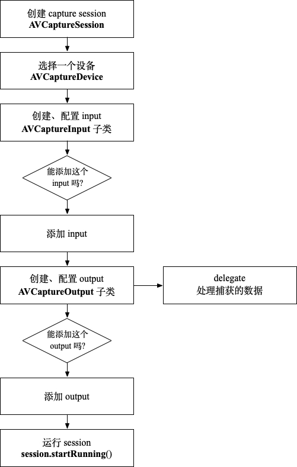

# iOS Cameras and Media Capture

Cameras and Media Capture（下面简写 Capture 系统） 是 AVFoundation 库的一个子系统，提供 photo、video、audio 捕获（capture）功能，可以用于自定义相机、扫码、更高层次的图片/视频/语音处理等。

Capture 架构主要由 session、input 和 output 组成，如下图


[`AVCaptureSession`](https://developer.apple.com/documentation/avfoundation/avcapturesession?language=objc#) 将 input 设备捕获的数据，传递给 output 进行处理。`AVCaptureSession` 作为 input 和 output 之间的桥梁。

## 建立 Capture Session

不管 capture 要实现什么样的功能，建立 capture session 的过程是一样的：首先创建一个 `AVCaptureSession` 实例，然后添加 input 和 output，最后运行 session。通过 output 的 `delegate` 处理捕获的数据。

### 流程图



### Code

```swift
private let captureSession = AVCaptureSession()
private func configureSession() {
  // input
  guard let captureDevice = selectCaptureDevice() else { return }
  guard let deviceInput = try? AVCaptureDeviceInput(device: captureDevice) else { return }
  guard captureSession.canAddInput(deviceInput) else { return }
  captureSession.addInput(deviceInput)
  
  // output
 	let videoOutput = AVCaptureVideoDataOutput()
  videoOutput.setSampleBufferDelegate(self, queue: DispatchQueue(label: "sample buffer"))
  guard captureSession.canAddOutput(videoOutput) else { return }
  captureSession.addOutput(videoOutput)
  
  // 运行
  captureSession.startRunning()
}
```

## 选择 Capture Device

[`AVCaptureDevice`](https://developer.apple.com/documentation/avfoundation/avcapturedevice) 类表示一个真实的物理设备及相关的配置，如摄像头、麦克风等。有以下类型的设备

> 不是每个iPhone手机都有这些设备

| 枚举名称               | 解释                                                         |
| ---------------------- | ------------------------------------------------------------ |
| builtInMicrophone      | 内置麦克风                                                   |
| builtInWideAngleCamera | 内置广角相机                                                 |
| builtInTelephotoCamera | 内置摄像头设备的焦距比广角摄像头更长(长焦摄像头)             |
| builtInUltraWideCamera | 内置摄像头设备的焦距比广角摄像头短(超广角摄像头)             |
| builtInDualCamera      | WideAngle和Telephoto的组合                                   |
| builtInDualWideCamera  | WideAngle和UltraWide的组合                                   |
| builtInTripleCamera    | WideAngle、UltraWide和Telephoto的组合                        |
| builtInTrueDepthCamera | 相机和其他传感器的组合，能够进行照片、视频和深度捕捉(带FaceID的iPhone有这个设备) |

有两种方式选择 capture 设备

第一种是使用 [`AVCaptureDevice`](https://developer.apple.com/documentation/avfoundation/avcapturedevice) 类，根据设备类型和所在的位置，选择默认设备

```swift
// 选择后置摄像头
private func selectBackCaptureDevice() -> AVCaptureDevice? {
  if let device = AVCaptureDevice.default(.builtInWideAngleCamera, for: .video, position: .back) {
    return device
  }
  return nil 
}
```

第二种是使用 [`AVCaptureDevice.DiscoverySession`](https://developer.apple.com/documentation/avfoundation/avcapturedevice/discoverysession) 类，根据设备类型排序、过滤设备，然后在 [`devices`](https://developer.apple.com/documentation/avfoundation/avcapturedevice/discoverysession/2361002-devices) 里找到满足你需求的设备。

```swift
// 选择前置摄像头
private func selectFrontCaptureDevice() -> AVCaptureDevice? {
  let deviceTypes: [AVCaptureDevice.DeviceType] = [
    .builtInWideAngleCamera,
    .builtInTrueDepthCamera,
    .builtInTelephotoCamera,
    .builtInUltraWideCamera,
    .builtInDualCamera,
    .builtInDualWideCamera,
    .builtInTripleCamera
  ]
  let discoverySession = AVCaptureDevice.DiscoverySession(deviceTypes: deviceTypes, mediaType: .video, position: .front)
  return discoverySession.devices.first
}
```

## AVCaptureOutput

使用不同的 [`AVCaptureOutput`](https://developer.apple.com/documentation/avfoundation/avcaptureoutput?language=objc#) 子类，可以实现不同的功能。`AVCaptureOutput` 有以下这些子类

| AVCaptureOutput 的子类                                       | 功能                                             |
| ------------------------------------------------------------ | ------------------------------------------------ |
| [`AVCapturePhotoOutput`](https://developer.apple.com/documentation/avfoundation/avcapturephotooutput) | 捕获照片、Live Photo                             |
| [`AVCaptureDepthDataOutput`](https://developer.apple.com/documentation/avfoundation/avcapturedepthdataoutput) | 捕获场景深度信息                                 |
| [`AVCaptureVideoDataOutput`](https://developer.apple.com/documentation/avfoundation/avcapturevideodataoutput) | 捕获视频，处理视频每一帧的数据                   |
| [`AVCaptureMovieFileOutput`](https://developer.apple.com/documentation/avfoundation/avcapturemoviefileoutput) | 捕获视频和音频，输出到 QuickTime 电影文件        |
| [`AVCaptureAudioFileOutput`](https://developer.apple.com/documentation/avfoundation/avcaptureaudiofileoutput) | 捕获音频，输出到音频文件文件                     |
| [`AVCaptureAudioDataOutput`](https://developer.apple.com/documentation/avfoundation/avcaptureaudiodataoutput) | 捕获音频，处理音频采样缓存数据                   |
| [`AVCaptureMetadataOutput`](https://developer.apple.com/documentation/avfoundation/avcapturemetadataoutput) | 捕获定时元数据，例如条形码、二维码、body、face等 |
| [`AVCaptureAudioPreviewOutput`](https://developer.apple.com/documentation/avfoundation/avcaptureaudiopreviewoutput) | 回放捕获的音频                                   |

## AVCaptureVideoPreviewLayer

一个 ***CALayer*** 的子类，展示 `AVCaptureSession` 捕获的视频。可以将 [`AVCaptureVideoPreviewLayer`](https://developer.apple.com/documentation/avfoundation/avcapturevideopreviewlayer?language=objc#) 加入到 `sublayers`，也可以封装成一个 `UIView` 的子类。

```swift
import UIKit
import AVFoundation

class CapturePreviewView: UIView {
  override class var layerClass: AnyClass {
    return AVCaptureVideoPreviewLayer.self
  }
  
  var videoPreviewLayer: AVCaptureVideoPreviewLayer {
    return layer as! AVCaptureVideoPreviewLayer
  }
    
  var session: AVCaptureSession? {
    get {
      return videoPreviewLayer.session
    }
    set {
      videoPreviewLayer.session = newValue
    }
  }
}
```

## Camera 权限

因为 Capture 系统需要用到设备的相机，所以使用前需要请求相机权限，这里有一个用 Rxswift 封装的请求 iOS 各种隐私权限的库 [RxPrivacyManager](https://github.com/cp3hnu/RxPrivacyManager)，大大简化了判断和请求 iOS 隐私权限的流程。

## 实战

### 扫码

我们可以使用 [`AVCaptureMetadataOutput`](https://developer.apple.com/documentation/avfoundation/avcapturemetadataoutput) 来实现扫码功能。

#### 建立 capture session

```swift
class ViewControlller: UIViewController {
  private let captureSession = AVCaptureSession()
  private let metadataOutput = AVCaptureMetadataOutput()
  private func configureSession() {
    // 添加后置摄像头
    guard let device = selectBackCaptureDevice() else { return }
    guard let deviceInput = try? AVCaptureDeviceInput(device: device) else { return }
    guard captureSession.canAddInput(deviceInput) else { return }
    captureSession.addInput(deviceInput)
	
    // 添加 metadata output
    guard captureSession.canAddOutput(metadataOutput) else { return }
    captureSession.addOutput(metadataOutput)
    metadataOutput.setMetadataObjectsDelegate(self, queue: DispatchQueue(label: "qrcode"))
    metadataOutput.metadataObjectTypes = [.qr, .ean8, ean13]
    
    // 添加 video layer
    previewLayer = AVCaptureVideoPreviewLayer(session: captureSession)
    previewLayer.frame = view.layer.bounds
    previewLayer.videoGravity = AVLayerVideoGravity.resizeAspectFill
    view.layer.insertSublayer(previewLayer, at: 0)
  }
}
```

#### 设置 `rectOfInterest`

看现在的 app 里的扫码功能，基本上都是中间有一个矩形框，只扫这个框里面的码，而排除外面的。这个就是通过设置 [`rectOfInterest`](https://developer.apple.com/documentation/avfoundation/avcapturemetadataoutput/1616291-rectofinterest#) 来限制视频元数据（metadata）的搜索区域，顶点是左上角，默认值是(0.0,0.0,1.0,1.0)。

但是直接设置不起作用，因为手机屏幕的分辨率和捕获的视频分辨率是不一致的，所有需要通过 [`metadataOutputRectConverted`](https://developer.apple.com/documentation/avfoundation/avcapturevideopreviewlayer/1623495-metadataoutputrectconverted#) 将手机屏幕坐标系的矩形框转化为 `metadataOutput` 坐标系的矩形框。下面是 Stack Overflow 的[解决方案](https://stackoverflow.com/questions/32401364/how-do-i-use-the-metadataoutputrectofinterestforrect-method-and-rectofinterest-p)。 [`AVCaptureInputPortFormatDescriptionDidChange`](https://developer.apple.com/documentation/foundation/nsnotification/name/1390288-avcaptureinputportformatdescript#) 监听输入端口 format 的变化，当输入端口 format 改变时需要重新设置 `rectOfInterest`。

```swift
NotificationCenter.default.addObserver(forName: .AVCaptureInputPortFormatDescriptionDidChange, object: nil, queue: nil) { [weak self] (noti) in                                                                                                                                          	 guard let self = self else { return }
  metadataOutput.rectOfInterest = self.previewLayer.metadataOutputRectConverted(fromLayerRect: frameRect)
}
```

#### 处理数据

实现 [`AVCaptureMetadataOutputObjectsDelegate`](https://developer.apple.com/documentation/avfoundation/avcapturemetadataoutputobjectsdelegate#) 代理方法

```swift
extension ViewControlller: AVCaptureMetadataOutputObjectsDelegate {
  func metadataOutput(_ output: AVCaptureMetadataOutput, didOutput metadataObjects: [AVMetadataObject], from connection: AVCaptureConnection) {
    guard let metadataObject = metadataObjects.first else { return }    
    AudioServicesPlaySystemSound(SystemSoundID(kSystemSoundID_Vibrate))
    guard let readableObject = metadataObject as? AVMetadataMachineReadableCodeObject, let code = readableObject.stringValue else { return }
    print(code)
  }
}
```

### 提取视频帧

进行活体检测、人脸识别时，首先需要提取视频的每一帧图片，这个时候我们可以使用 [`AVCaptureVideoDataOutput`](https://developer.apple.com/documentation/avfoundation/avcapturevideodataoutput) 来取得视频每一帧帧的图片数据。

#### 建立 capture session

```swift
class ViewControlller: UIViewController {
  private let captureSession = AVCaptureSession()
  private let sessionQueue = DispatchQueue(label: "session queue")
  private let context = CIContext()
  
  override func viewDidLoad() {
    super.viewDidLoad()
    // 建立 capture session，然后运行
    sessionQueue.async { [unowned self] in
     	self.configureSession()
      self.captureSession.startRunning()
    }
  }
  
  private func configureSession() {
    // 选择视频质量
    captureSession.sessionPreset = .medium
    // 选择前置摄像头
    guard let captureDevice = selectFrontCaptureDevice() else { return }
    guard let captureDeviceInput = try? AVCaptureDeviceInput(device: captureDevice) else { return }
    guard captureSession.canAddInput(captureDeviceInput) else { return }
    captureSession.addInput(captureDeviceInput)
    
    // 视频帧输出
    let videoOutput = AVCaptureVideoDataOutput()
    videoOutput.setSampleBufferDelegate(self, queue: DispatchQueue(label: "sample buffer"))
    guard captureSession.canAddOutput(videoOutput) else { return }
    captureSession.addOutput(videoOutput)
    
    guard let connection = videoOutput.connection(with: AVMediaType.video) else { return }
    if connection.isVideoOrientationSupported {
      connection.videoOrientation = .portrait
    }
    if connection.isVideoMirroringSupported {
      // 设置像照镜子一样
    	connection.isVideoMirrored = true
    }
  }
}
```

#### 处理数据

实现 [`AVCaptureVideoDataOutputSampleBufferDelegate`](https://developer.apple.com/documentation/avfoundation/avcapturevideodataoutputsamplebufferdelegate#) 代理方法

```swift
// MARK: AVCaptureVideoDataOutputSampleBufferDelegate
extension ViewController: AVCaptureVideoDataOutputSampleBufferDelegate {
	// 处理每一帧的数据
  func captureOutput(_ output: AVCaptureOutput, didOutput sampleBuffer: CMSampleBuffer, from connection: AVCaptureConnection) {
    // 生成 UIImage
    guard let uiImage = imageFromSampleBuffer(sampleBuffer: sampleBuffer) else { return }
    // 处理 UIImage
    DispatchQueue.main.async {
      self.imageView.image = uiImage
    }
  }
  // 掉帧
  func captureOutput(_ output: AVCaptureOutput, didDrop sampleBuffer: CMSampleBuffer, from connection: AVCaptureConnection) {
      print("drop frame")
  }
}
```

如果在捕获一下帧之前还没有处理完帧数据，就会出现掉帧现象。

#### 生成图片

```swift
extension ViewController {
  private func imageFromSampleBuffer(sampleBuffer: CMSampleBuffer) -> UIImage? {
    guard let imageBuffer = CMSampleBufferGetImageBuffer(sampleBuffer) else { return nil }
    let ciImage = CIImage(cvPixelBuffer: imageBuffer)
    guard let cgImage = context.createCGImage(ciImage, from: ciImage.extent) else { return nil }
    return UIImage(cgImage: cgImage)
  }
}
```

## References

- [Cameras and Media Capture](https://developer.apple.com/documentation/avfoundation/cameras_and_media_capture)
- [Setting Up a Capture Session](https://developer.apple.com/documentation/avfoundation/cameras_and_media_capture/setting_up_a_capture_session)
- [iOS — Camera Frames Extraction](https://medium.com/ios-os-x-development/ios-camera-frames-extraction-d2c0f80ed05a)

## Demo

[MediaCaptureTutorial](https://github.com/cp3hnu/MediaCaptureTutorial)

