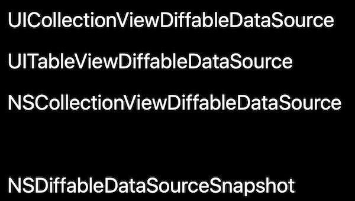

# Diffable Data Source

## Data Source 使用现状

在 iOS 开发中，我们经常使用 `UITableView` 和 `UICollectionView` 组件，在过去我们通常使用 Data Source 来配置数据源。在简单的业务中我们可以愉快的实现各种需求，可是一旦业务复杂起来，比如数据源实时的增删改，我们经常一不小心就遇到 `NSInternalInconsistencyException`（数据源和当前 UI 状态不一致）的问题，那怎么解决这个问题呢？

以前有两个解决方法，第一个解决方法是简单粗暴的调用 `reloadData` 方法，但是这个方案有两个问题，1、影响性能，数据源可能只有一处发生了变化，而 `reloadData` 刷新了整个列表数据；2、没有动画效果，用户不能很好地感知列表中哪里发生了变化。

第二个解决方法是，手动局部刷新，例如下面删除某一行的代码

```swift
tableView.beginUpdates()
data.remove(indexPath.row)
tableView.deleteRows(at: [indexPath], with: .fade)
tableView.endUpdates()
```

尽管如上代码满足需求，但是我们不得不计算需要插入或者删除的的 indexPaths ，而且稍有不慎我们将会遇到下面这个熟悉的异常😱

```sh
*** Terminating app due to uncaught exception

'NSInternalInconsistencyException',

reason: 'Invalid update: invalid number of sections. The number of sections contained in the tableView view after the update (1) must be equal to the number of sections contained in the tableView view before the update (1), plus or minus the number of sections inserted or deleted (0 inserted, 1 deleted).'

***
```

为此 iOS 13 提出了新的解决方案，**Diffable Data Source**

## New APIs



**Diffable Data Source** ，让开发者可以更简单高效的实现 `UITableView`、`UICollectionView` 的局部数据刷新。其核心思想就是记录变化前和变化后的数据快照，内部计算两次快照的差异，然后更新 UI。

> Note：在软件开发中 Diff 是一个很重要的概念，有很多应用场景，如 git 版本管理中文件变更应用；React中虚拟DOM 用 Diff算法更新 UI 状态；IGListKit 通过 IGListDiff 自动计算前后两次数据源的差值，实现局部数据刷新。

笔者以 `UITableViewDiffableDataSource` 作为切入点进行讲解，其它两个用法类似

```swift
class UITableViewDiffableDataSource<SectionIdentifierType, ItemIdentifierType> : NSObject, UITableViewDataSource where SectionIdentifierType : Hashable, ItemIdentifierType : Hashable
```

我们看到 `UITableViewDiffableDataSource` 类实现了 `UITableViewDataSource` 协议,  用来维护  table view 的数据源，Section 和 Item 遵循 `IdentifierType`，从而确保每条数据的唯一性，初始化方法如下：

```swift
init(tableView: UITableView, cellProvider: @escaping UITableViewDiffableDataSource<SectionIdentifierType, ItemIdentifierType>.CellProvider)

typealias UITableViewDiffableDataSource<SectionIdentifierType, ItemIdentifierType>.CellProvider = (UITableView, IndexPath, ItemIdentifierType) -> UITableViewCell?
```

使用过 RxCocoa 的可能对 CellProvider 很眼熟，没错以后我们可以在初始化方法中配置 Cell，在我们配置好 `UITableViewDiffableDataSource` 后，使用 `apply`  snapshot 对 table view 进行刷新

```swift
func apply(_ snapshot: NSDiffableDataSourceSnapshot<SectionIdentifierType, ItemIdentifierType>, animatingDifferences: Bool = true, completion: (() -> Void)? = nil)
```

通过使用 `apply` 我们无需计算变更的 `indexPaths`，也无需调用 `reloadData`方法，即可安全在在主线程或**后台线程**更新 UI，仅仅只需要将变更后的数据通过 `NSDiffableDataSourceSnapshot` 计算出来，`NSDiffableDataSourceSnapshot` 的定义如下：

```swift
class NSDiffableDataSourceSnapshot<SectionIdentifierType, ItemIdentifierType> where SectionIdentifierType : Hashable, ItemIdentifierType : Hashable
```

创建 snapshot 有两种方法

- 创建一个空的 snapshot， 然后通过  `append` 方法添加数据。
- 通过 diffable data source 的 `snapshot()` 方法获取当前的 snapshot， 然后通过  `append` , `delete`, `move`, `insert` 方法修改数据。

介绍到在这里 **Diffable Data Source** 关键概念差不多介绍完了，这里整理一下流程

1. `UITableViewDiffableDataSource` 负责当前数据源配置，比如配置 cell

2. `NSDiffableDataSourceSnapshot` 负责数据源的变更

3. `UITableViewDiffableDataSource`  通过调用 `apply` 方法将 `NSDiffableDataSourceSnapshot`  变更后的数据更新同步到 `UITableView`。值得注意的是为了确保 Diff 生效，所以数据必须具有唯一 Identifier，且遵循 `Hashable` 协议

## Demo

以 [Implementing Modern Collection Views](https://developer.apple.com/documentation/uikit/views_and_controls/collection_views/implementing_modern_collection_views) 中的 Wifi Setting 为例


1. 定义 `UITableViewDiffableDataSource`，配置 cell

```swift
 self.dataSource = UITableViewDiffableDataSource<Section, Item>(tableView: tableView) { [weak self]
                (tableView: UITableView, indexPath: IndexPath, item: Item) -> UITableViewCell? in
  
  let cell = tableView.dequeueReusableCell(
    withIdentifier: WiFiSettingsViewController.reuseIdentifier,
    for: indexPath)
  // 配置 cell
  ...
  return cell
}
self.dataSource.defaultRowAnimation = .fade
```
关于 Section, Item 的定义，关键一点是要遵从  `Hashable` 协议
```swift
// 没有 associated 值的枚举类型自动遵从 Hashable 协议
enum Section: CaseIterable {
  case config, networks
}

struct Item: Hashable {
  let title: String
  let type: ItemType
  let network: WiFiController.Network?
  private let identifier: UUID

  // 实现 Hashable 协议
  func hash(into hasher: inout Hasher) {
    hasher.combine(self.identifier)
  }
}
```


2. 定义 `NSDiffableDataSourceSnapshot`，负责数据源的变更

```swift
let configItems = configurationItems.filter { !($0.type == .currentNetwork && !controller.wifiEnabled) }
currentSnapshot = NSDiffableDataSourceSnapshot<Section, Item>()
currentSnapshot.appendSections([.config])
currentSnapshot.appendItems(configItems, toSection: .config)

if controller.wifiEnabled {
  let sortedNetworks = controller.availableNetworks.sorted { $0.name < $1.name }
  let networkItems = sortedNetworks.map { Item(network: $0) }
  currentSnapshot.appendSections([.networks])
  currentSnapshot.appendItems(networkItems, toSection: .networks)
}
```

3. 调用 `apply` 方法将 `NSDiffableDataSourceSnapshot`  变更后的数据更新同步到 `UITableView`

```
 self.dataSource.apply(currentSnapshot, animatingDifferences: animated)
```

## 其它方面

1. 使用 `apply` 方法，不要再使用老就 `performBatchUpdates` , `insertItems`

2. 新的 APIs，不会在用的 indexPath，但是以前的 APIs 可能还需要它，怎么办？`NSDiffableDataSourceSnapshot` 提供了很多转换方法
3. `apply` 方法运行很快，时间复杂度是O(N)
4. `apply` 方法可以在后台线程里安全的运行，当数据很多很多时，可以在后台线程里运行 `apply` 方法
5. Share Sheet 已经采用新的 APIs

## 参考阅读

- Sample Code

[Implementing Modern Collection Views](https://developer.apple.com/documentation/uikit/views_and_controls/collection_views/implementing_modern_collection_views)

- WWDC 2019 Session 220

[Advances in UI Data Sources](https://developer.apple.com/videos/play/wwdc2019/220/)


