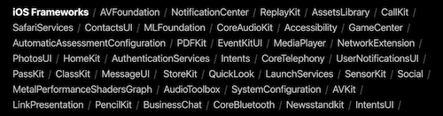
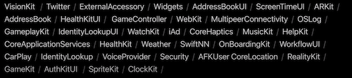
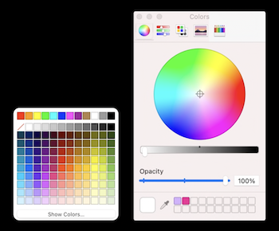
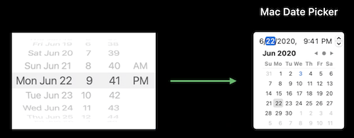
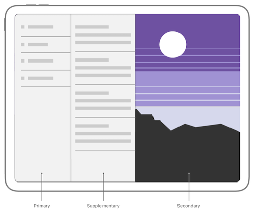
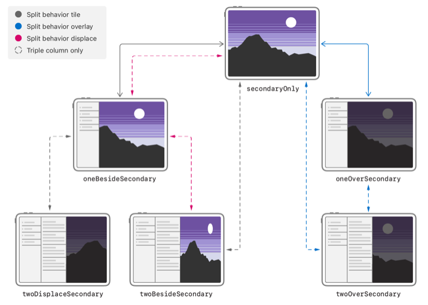
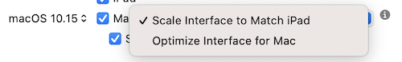

# What's new in Mac Catalyst

## Framework

越来越多的 iOS framework 现在支持 Mac Catalyst



但是还是有很多的 framework 还不支持 Mac Catalyst



不过针对这些 framework，开发者可以不再使用 `targetEnvironment` 来区分使用，而是通过 Mac Catalyst 14.0 新增的 [supported](https://developer.apple.com/documentation/arkit/arconfiguration/2923553-issupported) 属性进行运行时判断的方式来让代码更具有可移植性

例如：ARKit

```swift
// 之前
#if !targetEnvironment(macCatalyst)
import ARKit
#endif

...

#if !targetEnvironment(macCatalyst)
let config = ARWorldTrackingConfiguration()
if config.supported {
  sceneView.session.run(config)
}
#endif

// 现在
import ARKit

...

let config = ARWorldTrackingConfiguration()
if config.supported {
  sceneView.session.run(config)
}
```

## New APIs

### Support for handling physical keyboard event

通过实现 `pressesBegan`/`pressesEnd` 方法来支持键盘事件，[UIPress](https://developer.apple.com/documentation/uikit/uipress) 类在Mac Catalyst 13.4 支持了 [key](https://developer.apple.com/documentation/uikit/uipress/3526315-key) 这个属性，让我们可以在响应者链中处理来自键盘的 press 事件

### Focus engine APIs from tvOS

在 tvOS 被广泛使用的 [Focus Engine](https://developer.apple.com/library/archive/documentation/General/Conceptual/AppleTV_PG/WorkingwiththeAppleTVRemote.html), 现在在 Mac Catalyst 中也可以被使用，使用 Focus Engine 可以更好的辅助用户用键盘操作基于 Mac Catalyst 的 App

Set focus group identifiers on views

```swift
/// In UIView
/// The identifier of the focus group that this view belongs to. If this is nil, subviews inherit their superview's focus group.
var focusGroupIdentifier: String? { get set }
```

### Allows the selection to follow the keyboard focus

在 Mac 上按下上下箭头键时，只是高亮 cell row，再按下 space 键或者 enter 键选中 cell row

当 `selectionFollowsFocus= true` 时，按下上下箭头键在 table view/collection view 上移动时，自动选中 cell row

```swift
/// In UITableView/UICollectionView
/// When enabled, the table view ensures that selection is automatically triggered when focus moves to a cell.
var selectionFollowsFocus: Bool { get set }
```

### Window creation behavior

通过 `UISceneCollectionJoinBehaviorallows` 开发者可以控制怎样创建 window, 是作为新的 tab，还是新的单独的 window

```swift
// A set of behaviors that specify how a new scene joins a scene collection.
public enum UISceneCollectionJoinBehavior: Int {
  // Uses the system preferences for joining collections.
  case automatic = 0
  
  // Adds the new scene to the requesting scene’s collection and activate it, or attempts to join a compatible collection.
  case preferred = 1
  
  // Creates a new collection for the new scene, ignoring system preferences.
  case disallowed = 2
  
  // Adds the new scene to the requesting scene’s collection without activating it, or attempts to join a compatible collection.
  case preferredWithoutActivating = 3
}
```

### NSCursor

通过 `NSCursor` 类，能够隐藏/显示光标以及展示各种光标样式

### UIColorWell and UIColorPickerViewController



### UIDatePicker



### Menu Buttons

UIButton 现在支持 pull-down menus

```swift
convenience init(type buttonType: UIButton.ButtonType = .system, primaryAction: UIAction?)
convenience init(frame: CGRect, primaryAction: UIAction?)
```

##### 详情参见 [Design With iOS Pickers, Menus, and Action](https://wwdc.io/share/wwdc20/10205)

### Sheet & Model View Controller

弹出的 sheet 和 modalViewController 都将会以独立的 window 形式存在，这些 window 在 macOS 是可以单独被拉伸缩放的

### Popover

Popover presentations 以 [NSPopover](https://developer.apple.com/documentation/appkit/nspopover#) 的方式弹出，它的 window 可以拓展到主 window 之外

### UISplitViewController

支持三列，首列支持 sidebar

```swift
let splitViewController = UISplitViewController(style: .tripleColumn)
```



##### Display Mode



### Sidebar

左侧 app-leverl 导航

[Human Interface Guidelines-Sidebar](https://developer.apple.com/design/human-interface-guidelines/ios/bars/sidebars/)

[Mac Catalyst Tutorials-Creating a Sidebar](https://developer.apple.com/tutorials/mac-catalyst/creating-a-sidebar)

使用 split view 创建 sidebar

```swift
let splitViewController = UISplitViewController(style: .tripleColumn)
splitViewController.primaryBackgroundStyle = .sidebar
splitViewController.preferredDisplayMode = .twoBesideSecondary
splitViewController.setViewController(sidebarViewController, for: .primary)
splitViewController.setViewController(listViewController, for: .supplementary)
splitViewController.setViewController(detailViewController, for: .secondary)
```

### Optimized for Mac

Optimized for Mac 可以让基于 Mac Catalyst 技术的 App 在类似文字大小、排版布局、控件映射等方面更贴近 macOS



详情参见 [Optimize the interface of your Mac Catalyst app](https://wwdc.io/share/wwdc20/10056)

### SwiftUI

SwiftUI 现在支持设置菜单栏、toolbar等，详情参见

[What's new in SwiftUI](https://wwdc.io/share/wwdc20/10041)

### Application Lifecycle

像 iOS 一样的生命周期，但是进入后台的场景会更多

### Extensions

支持 Photo-editing extension、Widget

[Meet WidgetKit](https://wwdc.io/share/wwdc20/10028)

### Universal Purchase

购买实现 iOS 和 Mac 同步，也可以不同步，通过不勾选 ”Use iOS Bundle Idnetifier“

如果你没有 Catalyst App，而又想要支持 Universal Purchase，详情参见

[Offering Universal Purchase](https://developer.apple.com/support/universal-purchase/)

### Mac Catalyst New Look for macOS

#### Toolbar Styles

通过 `UITitlebarToolbarStyle` 配置 toolbar 的样式

```swift
public enum UITitlebarToolbarStyle : Int {
  // The default value. The style will be determined by the window's given configuration
  case automatic = 0

  // The toolbar will appear below the window title
  case expanded = 1

  // The toolbar will appear below the window title and the items in the toolbar will attempt to have equal widths when possible
  case preference = 2

  // The window title will appear inline with the toolbar when visible
  case unified = 3

  // Same as NSWindowToolbarStyleUnified, but with reduced margins in the toolbar allowing more focus to be on the contents of the window
  case unifiedCompact = 4
}
```

还可以为每个 window 设置 toolbar 样式，详情参见

[Adopt the new look of macOS](https://wwdc.io/share/wwdc20/10104)

#### Separator Items

通过 `NSToolbarItem.Identifier` 控制怎样放置 toolbar items

```swift
func toolbarDefaultItemIdentifiers(_ toolbar: NSToolbar) -> [NSToolbarItem.Identifier]
```

### Accent Colors

自定义 App 主题颜色，App 将设置这个颜色为默认的 tint color

## Reference

WWDC 2020 Session 10143

[What's new in Mac Catalyst](https://wwdc.io/share/wwdc20/10143)

