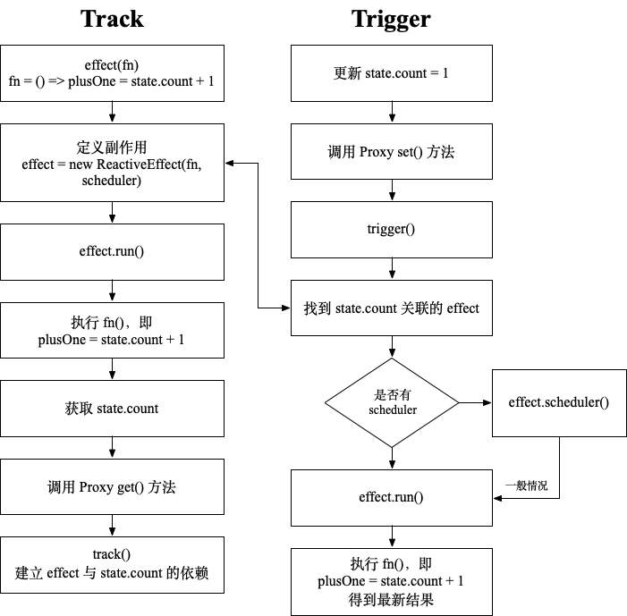

# Vue 3 响应性原理

在介绍 Vue 3 响应性原理之前，先回顾一下 Vue 2 响应性原理，Vue 2 响应性原理的核心是

1. 当把一个普通的 JavaScript 对象传入 Vue 实例作为 `data` 选项时，Vue 将遍历此对象所有的 property，并使用 [`Object.defineProperty`](https://developer.mozilla.org/en-US/docs/Web/JavaScript/Reference/Global_Objects/Object/defineProperty)) 把这些 property 全部转为 [getter/setter](https://developer.mozilla.org/en-US/docs/Web/JavaScript/Guide/Working_with_Objects#defining_getters_and_setters)；

2. 每个组件实例都对应一个 **watcher** 实例，它会在组件渲染的过程中把“接触”过的数据 property 记录为依赖。之后当依赖项的 setter 触发时，会通知 watcher，从而使它关联的组件重新渲染。

Vue 3 响应性的关键是使用 ES6 **[Proxy](https://developer.mozilla.org/en-US/docs/Web/JavaScript/Reference/Global_Objects/Proxy)** 代替 `Object.defineProperty`

## 什么是响应性

```js
let val1 = 2
let val2 = 3
let sum = val1 + val2
console.log(sum) // 5
val1 = 3
console.log(sum) // 期待得到6，实际是5
```

实现响应性，我们需要做到以下几点：

1. **当一个值被读取时进行追踪**，例如 `val1 + val2` 会同时读取 `val1` 和 `val2`。
2. **当某个值改变时进行检测**，例如，当我们赋值 `val1 = 3`。
3. **重新运行代码来读取原始值**，例如，再次运行 `sum = val1 + val2` 来更新 `sum` 的值。

## 副作用 *effect*

为了能够在数值变化时，随时运行我们的总和，我们首先要做的是将其包裹在一个函数中。

```js
const updateSum = () => {
  sum = val1 + val2
}
```

但我们如何告知 Vue 这个函数呢？

Vue 通过一个**副作用 (effect)** 来跟踪当前正在运行的函数(称之为**响应函数**)。副作用是一个函数的包裹器，在函数被调用之前就启动跟踪，然后当参数改变时再次执行它。

```js
let activeEffect = null;

function createEffect(fn) {
  activeEffect = fn;
  activeEffect();
  activeEffect = null;
}

// 创建副作用，执行响应函数 fn
createEffect(() => sum = val1 + val2);

// 当 val1 和 val2 改变时
// 再次执行 activeEffect
activeEffect();
```

## Vue 如何跟踪变化—Proxy

Proxy 是一个对象，它包装了另一个对象(目标对象)，并允许你拦截对该对象的任何交互。

```js
const dinner = {
  meal: 'tacos'
}

const handler = {
  get(target, property, receiver) {
    console.log('intercepted!')
    return target[property]
  }
}

const proxy = new Proxy(dinner, handler)
console.log(proxy.meal)
// intercepted!
// tacos
```

这里我们截获了读取目标对象 property 的举动。像这样的处理函数也称为一个 **捕捉器 (trap)**，Proxy 定义了多个捕捉器。

使用 Proxy 的一个难点是 `this` 绑定，我们希望任何方法都绑定到这个 Proxy，而不是目标对象，这样我们可以拦截它们。ES6 引入了另一个名为 [Reflect](http://developer.mozilla.org/en-US/docs/Web/JavaScript/Reference/Global_Objects/Reflect) 的新特性，它允许我们以最小的代价消除了这个问题。

```js
const dinner = {
  meal: 'tacos'
}
const handler = {
  get(target, property, receiver) {
    return Reflect.get(...arguments)
  }
}
const proxy = new Proxy(dinner, handler)
console.log(proxy.meal)
// tacos
```

Vue 3 响应性 `reactive()` 的中心思想大致如下:

```js {7,11}
const dinner = {
  meal: 'tacos'
}

const handler = {
  get(target, property, receiver) {
    track(target, property)
    return Reflect.get(...arguments)
  },
  set(target, property, value, receiver) {
    trigger(target, property)
    return Reflect.set(...arguments)
  }
}

const proxy = new Proxy(dinner, handler)
console.log(proxy.meal)
```

上述代码的执行步骤：

1. **当一个值被读取时进行追踪**：proxy 的 `get` 处理函数中 `track` 函数记录了该 property 和当前副作用。
2. **当某个值改变时进行检测**：在 proxy 上调用 `set` 处理函数。
3. **重新运行代码来读取原始值**：`trigger` 函数查找哪些副作用依赖于该 property 并执行它们。

由此可见，响应性由两个部分组成，追踪依赖(`track`)和当依赖变化时执行副作用(`trigger`)

### track

`track()` 将依赖于某个属性的 effect  保存起来。

一个系统里有很多的响应对象，一个响应对象有很多的属性，每个属性又有很多的副作用函数依赖于自己，怎样把这些 effect 都记录下来呢？

Vue 3 使用下面的数据结构存储 effect。

| 名称      | 类型    | key      | 值      | 描述   |
| --------- | ------- | -------- | ------- | ------ |
| targetMap | WeakMap | object   | depsMap | 对象   |
| depsMap   | Map     | property | dep     | 属性   |
| dep       | Set     |          | effect  | 副作用 |

下面是 Vue 3 的 [源码](https://github.com/vuejs/vue-next/blob/2d4f4554349db6b07027d0c626f56c48d0233f67/packages/reactivity/src/effect.ts#L212)，版本号 3.2.23
> 删除了一些调试相关的代码，只保留主体
```typescript {20,25,31}
// 存储 effect 的数据结构
type Dep = Set<ReactiveEffect> & TrackedMarkers
type KeyToDepMap = Map<any, Dep>
const targetMap = new WeakMap<any, KeyToDepMap>()

export function track(target: object, type: TrackOpTypes, key: unknown) {
  // 是否需要追踪，不是所有的操作都需要追踪的，比如 console.log() 就不需要响应性
  if (!isTracking()) {
    return
  }
  let depsMap = targetMap.get(target)
  if (!depsMap) {
    targetMap.set(target, (depsMap = new Map()))
  }
  let dep = depsMap.get(key)
  if (!dep) {
    depsMap.set(key, (dep = createDep()))
  }
  // 添加 effect
  trackEffects(dep)
}

export function trackEffects(dep: Dep) {
  // 添加 effect
  dep.add(activeEffect!)
  activeEffect!.deps.push(dep)
}

export function isTracking() {
  // 是否追踪取决于 activeEffect 是否有值
  return shouldTrack && activeEffect !== undefined
}
```

`track()` 函数使用上面提到的数据结构，保存 effect 。但是 `track()` 是否运行取决于 `activeEffect` 是否有值，那 `activeEffect` 什么时候赋值呢？我们继续往下看


```js {6-7,33,35}
// effect 函数类似上面所讲的 createEffect 函数
export function effect<T = any>(
  fn: () => T, // 响应函数
  options?: ReactiveEffectOptions
): ReactiveEffectRunner {
  const _effect = new ReactiveEffect(fn)
  _effect.run()
}

// effect 数组
const effectStack: ReactiveEffect[] = []
// 当前的副作用
let activeEffect: ReactiveEffect | undefined
export class ReactiveEffect<T = any> {
  active = true
  deps: Dep[] = []

  constructor(
    public fn: () => T, // 响应函数
    public scheduler: EffectScheduler | null = null,
    scope?: EffectScope | null
  ) {
    recordEffectScope(this, scope)
  }

  run() {
    if (!this.active) {
      return this.fn()
    }
    if (!effectStack.includes(this)) {
      try {
        // activeEffect = this 副作用赋值
        effectStack.push((activeEffect = this))
        // 执行响应函数，读取依赖属性，触发 get() -> track()，这个时候 activeEffect 有值
        return this.fn()
      } finally {
        // 依赖追踪完成之后，清除 activeEffect
        effectStack.pop()
        const n = effectStack.length
        // 为什么不直接 undefined 呢？对象嵌套
        activeEffect = n > 0 ? effectStack[n - 1] : undefined
      }
    }
  }
}
```

`effect()` 函数就是上面所讲的副作用函数，创建 `ReactiveEffect` 实例封装响应函数，并调用 `ReactiveEffect` 实例的 `run()` 函数，这个函数主要做两件事：

- `activeEffect = this`，将自己( `ReactiveEffect` 实例)赋值给 `activeEffect` 
- 执行响应函数 `fn()`, 读取依赖的属性值，从而触发 `track()`，将 `effect()`创建的 `ReactiveEffect` 实例保存起来

除 `effect` 函数之外，Vue 还提供了这些[副作用函数](#副作用-api)。Vue 的[渲染函数](https://v3.cn.vuejs.org/guide/render-function.html)其实也是被封装在副作用函数中的。

### trigger

`trigger()` 函数就是找到之前 `track()` 保存的 `effect`，执行响应函数 `fn` ，得到更新的结果。

```typescript {19,28,44}
export function trigger(
  target: object,
  type: TriggerOpTypes,
  key?: unknown,
  newValue?: unknown,
  oldValue?: unknown,
  oldTarget?: Map<unknown, unknown> | Set<unknown>
) {
  const depsMap = targetMap.get(target)
  if (!depsMap) {
    return
  }

  let deps: (Dep | undefined)[] = []
  deps.push(depsMap.get(key))
 
  if (deps.length === 1) {
    if (deps[0]) {
      triggerEffects(deps[0])
    }
  } else {
    const effects: ReactiveEffect[] = []
    for (const dep of deps) {
      if (dep) {
        effects.push(...dep)
      }
    }
     triggerEffects(createDep(effects))
  }
}

export function triggerEffects(
  dep: Dep | ReactiveEffect[]
) {
  for (const effect of isArray(dep) ? dep : [...dep]) {
    if (effect !== activeEffect || effect.allowRecurse) {
      // 控制刷新时机
      // computed，watch、watchEffect 函数会用到，见下文
      if (effect.scheduler) {
        effect.scheduler()
      } else {
        // 执行响应函数 fn，得到最新结果
        // effect.run() 不会再次添加依赖，因为 track() 通过 wasTracked、newTracked 标志位进行控制
        effect.run()
      }
    }
  }
}
```

### 流程图



## 响应性 API

为了实现响应性，Vue 3 提供了下面这些响应性 API，让我们来看看这些 API 是怎样实现的。

> 对比 Vue 2，对于没有在 data 中定义的 propterty，后面想追加响应性，只能使用 `vue.$set` 函数，而在 Vue 3 中添加响应性property 更加灵活。

### 声明响应式状态: reactive()

要为 JavaScript 对象创建响应式状态，可以使用 [reactive()](https://v3.cn.vuejs.org/guide/reactivity-fundamentals.html#%E5%A3%B0%E6%98%8E%E5%93%8D%E5%BA%94%E5%BC%8F%E7%8A%B6%E6%80%81) 函数。

```js
import { reactive } from 'vue'

// 响应式状态
const state = reactive({
  count: 0
})
```

这就是 Vue 响应性系统的本质。当从组件中的 `data()` 返回一个对象时，它在内部交由 `reactive()` 使其成为响应式对象。模板会被编译成能够使用这些响应式 property 的 [渲染函数](https://v3.cn.vuejs.org/guide/render-function.html)。

原理前面已经介绍了，这里不再赘述。

### 原始值变成响应式: ref()

`reactive()` 只适用于对象，对于原始值(number, string, boolean)，怎么使其具有响应性呢？Vue 提供了 [ref()](https://v3.cn.vuejs.org/guide/reactivity-fundamentals.html#%E5%88%9B%E5%BB%BA%E7%8B%AC%E7%AB%8B%E7%9A%84%E5%93%8D%E5%BA%94%E5%BC%8F%E5%80%BC%E4%BD%9C%E4%B8%BA-refs) 函数。

`ref()` 函数将原始值包裹成一个可变的响应式对象，该对象只包含一个名为 `value` 的 property。

```js
import { ref } from 'vue'

const count = ref(0)
console.log(count.value) // 0

count.value++
console.log(count.value) // 1
```

那 Vue 是怎样实现 `ref()` 的呢？

```typescript {15,25,36,43}
export function ref(value?: unknown) {
  return new RefImpl(rawValue)
}

class RefImpl<T> {
  constructor(value: T, public readonly _shallow: boolean) {
    // 如果 value 是 reactive, 返回 reactive 代理的原始对象
    this._rawValue = toRaw(value)
    // 下面有介绍
    this._value = toReactive(value)
  }

  get value() {
    // 1. track
    trackRefValue(this)
    return this._value
  }

  set value(newVal) {
    newVal = toRaw(newVal)
    if (hasChanged(newVal, this._rawValue)) {
      this._rawValue = newVal
      this._value = toReactive(newVal)
      // 2. trigger
      triggerRefValue(this, newVal)
    }
  }
}

export function trackRefValue(ref: RefBase<any>) {
  if (isTracking()) {
    ref = toRaw(ref)
    if (!ref.dep) {
      ref.dep = createDep()
    }
    trackEffects(ref.dep)
  }
}

export function triggerRefValue(ref: RefBase<any>, newVal?: any) {
  ref = toRaw(ref)
  if (ref.dep) {
    triggerEffects(ref.dep)
  }
}
```

从上面的源代码可以看出，`ref()` 用 `RefImpl` 类封装 `value` 值，重写 `value` 的 `get` 和 `set` 方法，`get` 方法里面调用 `track()` 追踪依赖，`set` 方法里面调用 `trigger()` 执行副作用。

#### `reactive()` 与 `ref()` 的区别

`reactive()` 只能用于 Object 类型，而 `ref()` 常用于原始值(number, string, boolean)，当然也能用于 Object 类型，当  `ref()` 用于 Object 时，其 `value` 是被封装成 reactive。

在上面的源码中我们发现有个 `toReactive()` 函数，作用就是用来封装对象的

```typescript
// 判断 value 是否是 Object，如果是 Object 用 reactive() 进行封装
export const toReactive = <T extends unknown>(value: T): T =>
  isObject(value) ? reactive(value) : value
```

例如下面这个例子

```js
const refState = ref({
   count: 0
})
```


### 响应式状态解构: toRefs()

当我们想使用大型响应式对象的一些 property 时，可能很想使用 [ES6 解构](https://developer.mozilla.org/en-US/docs/Web/JavaScript/Reference/Operators/Destructuring_assignment) 来获取我们想要的 property：

```js
import { reactive } from 'vue'

const book = reactive({
  author: 'Vue Team',
  year: '2020',
  title: 'Vue 3 Guide',
  description: 'You are reading this book right now ;)',
  price: 'free'
})

let { author, title } = book
```

遗憾的是，使用解构的两个 property 的响应性都会丢失。对于这种情况，我们通过 [toRefs()](https://v3.cn.vuejs.org/guide/reactivity-fundamentals.html#%E5%93%8D%E5%BA%94%E5%BC%8F%E7%8A%B6%E6%80%81%E8%A7%A3%E6%9E%84) 使其保留与源对象的响应式关联：

```js
import { reactive, toRefs } from 'vue'

const book = reactive({
  author: 'Vue Team',
  year: '2020',
  title: 'Vue 3 Guide',
  description: 'You are reading this book right now ;)',
  price: 'free'
})

let { author, title } = toRefs(book)

title.value = 'Vue 3 Detailed Guide' // 我们需要使用 .value 作为标题，现在是 ref
console.log(book.title) // 'Vue 3 Detailed Guide'
```

那 Vue 是怎样实现 `toRefs()` 的呢？

```typescript {4-5,13,20-22,25-27}
export function toRefs<T extends object>(object: T): ToRefs<T> {
  const ret: any = isArray(object) ? new Array(object.length) : {}
  // 对目标对象的每个属性进行封装
  for (const key in object) {
    ret[key] = toRef(object, key)
  }
  return ret
}

export function toRef<T extends object, K extends keyof T>(object: T, key: K): ToRef<T[K]> {
  const val = object[key]
  // 判断属性是否是 reactive，如果是直接返回，如果不是用 ObjectRefImpl 类型封装
  return isRef(val) ? val : (new ObjectRefImpl(object, key) as any)
}

class ObjectRefImpl<T extends object, K extends keyof T> {
  constructor(private readonly _object: T, private readonly _key: K) {}

  // 访问时调用目标对象的 get 方法，触发 track
  get value() {
    return this._object[this._key]
  }

  // 赋值时调用目标对象的 set 方法，触发 trigger
  set value(newVal) {
    this._object[this._key] = newVal
  }
}
```

从上面的代码，我们可以看出，`toRefs()` 迭代目标响应对象的每个属性，然后使用 `toRef()` 函数将每个非 reactive 属性(reactive 属性已经具有响应性，直接返回)封装成 `ObjectRefImpl` 类型(一种 ref 类型)，里面也只有一个 `value` 属性。

`value` 的 `get` 方法调用目标对象对应属性的的 `get` 方法，从而触发 `track()`，同样 `value` 的 `set` 方法调用目标对象对应属性的的 `set` 方法，从而触发 `trigger()`。

### 可选的 property 解构: toRef()

从上面的代码可以看出，如果传入的 `book` 中没有 `title` ，那么在这种情况下，`toRefs()` 将不会为 `title` 创建一个 ref 。

```typescript
export function toRefs<T extends object>(object: T): ToRefs<T> {
  const ret: any = isArray(object) ? new Array(object.length) : {}
  // 如果 object 没有 title，就没有 ret['title']
  for (const key in object) {
    ret[key] = toRef(object, key)
  }
  return ret
}
```

这个时候你需要使用 [toRef()](https://v3.cn.vuejs.org/api/refs-api.html#toref)。其实就是脱离 object 迭代，直接调用 `toRef()` 函数。

```js
import { toRef } from 'vue'

const book = reactive({
  author: 'Vue Team',
  year: '2020',
  title: 'Vue 3 Guide',
  description: 'You are reading this book right now ;)',
  price: 'free'
})

let title = toRef(book, 'title')

title.value = 'Vue 3 Detailed Guide' 
console.log(book.title) // 'Vue 3 Detailed Guide'
```

## 副作用 API

我们知道 Vue 组件里有[计算属性](https://v3.cn.vuejs.org/guide/computed.html#计算属性)、 [侦听器](https://v3.cn.vuejs.org/guide/computed.html#侦听器)，这些就是封装好的副作用函数，Vue 3 将它们提取出来，供开发者使用。我们来看看都有哪些API，以及怎么实现的。

> 一个组件的模板被编译成一个 [`render`](https://v3.cn.vuejs.org/guide/render-function.html) 函数，它被包裹在一个副作用中，允许 Vue 在运行时跟踪被“触达”的 property。如果这些 property 中的任何一个随后发生了变化，它将触发副作用再次运行，重新运行 `render` 函数以生成新的 VNodes。

### computed()

[computed()](https://v3.cn.vuejs.org/guide/reactivity-computed-watchers.html#%E8%AE%A1%E7%AE%97%E5%80%BC) 函数类似于组件的[计算属性](https://v3.cn.vuejs.org/guide/computed.html#计算属性)。它接受 getter 函数并为 getter 返回的值返回一个不可变的响应式 [ref](https://v3.cn.vuejs.org/guide/reactivity-fundamentals.html#创建独立的响应式值作为-refs) 对象

```js
const state = reactive({
  count: 0
})
const plusOne = computed(() => state.count + 1)

console.log(plusOne.value) // 1
state.count = 1
console.log(plusOne.value) // 2
```

它可以使用一个带有 `get` 和 `set` 函数的对象来创建一个可写的 ref 对象。

```js
const state = reactive({
  count: 0
})
const plusOne = computed({
  get: () => state.value + 1,
  set: val => {
    state.value = val - 1
  }
})

plusOne.value = 2
console.log(state.count) // 1
```

那 Vue 是怎样实现 `computed()` 的呢？让我们来看看源代码。

```typescript {18,36-41,48,54}
export function computed<T>(
  getterOrOptions: ComputedGetter<T> | WritableComputedOptions<T>,
  debugOptions?: DebuggerOptions
) {
  let getter: ComputedGetter<T>
  let setter: ComputedSetter<T>

  // 获取 get 和 set 函数
  const onlyGetter = isFunction(getterOrOptions)
  if (onlyGetter) {
    getter = getterOrOptions
  } else {
    getter = getterOrOptions.get
    setter = getterOrOptions.set
  }
	
  // 用 ComputedRefImpl 对 get 和 set 函数进行封装
  const cRef = new ComputedRefImpl(getter, setter, onlyGetter || !setter)
  return cRef as any
}

class ComputedRefImpl<T> {
  public dep?: Dep = undefined

  private _value!: T
  private _dirty = true
  public readonly effect: ReactiveEffect<T>

  constructor(
    getter: ComputedGetter<T>,
    private readonly _setter: ComputedSetter<T>,
    isReadonly: boolean
  ) {
    // 实例化 ReactiveEffect 对象，get 作为响应函数，computed 作为副作用函数
    // 后面的箭头函数作为 effect 的 scheduler，触发依赖于 computed 属性的副作用函数
    this.effect = new ReactiveEffect(getter, () => {
      if (!this._dirty) {
        this._dirty = true
        // 触发依赖于 computed 属性的副作用函数
        triggerRefValue(this)
      }
    })
  }

  get value() {
    const self = toRaw(this)
    // 追踪依赖于自己的副作用
    trackRefValue(self)
    // self._dirty 就是 Vue 官方文档的计算属性缓存
    // 依赖的属性值没有变化，直接返回结果，不执行get方法
    if (self._dirty) {
      self._dirty = false
      // 执行响应函数(get)，收集自己的依赖，并等到结果
      self._value = self.effect.run()!
    }
    return self._value
  }

  set value(newValue: T) {
    this._setter(newValue)
  }
}
```

要理解上面的代码，有第一点很重要，那就是 `computed()` 具有特殊性，它即是副作用函数，同时又具有响应性。

`computed()` 返回 `ComputedRefImpl` 类型(一种 ref 类型)，里面只有一个属性 `value` 里面。通过 `value` 的 `get ` 方法，追踪依赖于自己的副作用 `trackRefValue(self)`，同时作为副作用函数追踪自己的依赖 `effect.run()`。

当  `computed()` 依赖的属性发生变化时，例如 `state.count = 1`，触发 `state` 的 `trigger`，然后调用 `scheduler -> triggerRefValue`，继而触发依赖于  `computed()` 的副作用函数。

同时我们可以看到 `computed()`  里的值是懒加载的，即改变 `state.count` 的值不会立即更新内部 `_value`，只是等访问 `value` 属性的时候才重新获取。

`computed()` 的 `set` 很简单，单纯的执行参数中的 `set` 函数。

#### 流程图


### watchEffect()

为了根据响应式状态自动应用和重新应用副作用，Vue 提供了 [watchEffect()](https://v3.cn.vuejs.org/guide/reactivity-computed-watchers.html#watcheffect) 函数。它立即执行传入的一个函数，同时响应式追踪其依赖，并在其依赖变更时重新运行该函数。 `watchEffect()` 函数是一个纯粹的副作用函数

```js
const count = ref(0)

watchEffect(() => console.log(count.value))
// -> logs 0

setTimeout(() => {
  count.value++
  // -> logs 1
}, 100)
```

`watchEffect()` 的源码和 `watch()` 是一起的，都是调用 `doWatch()` 方法，所以和  `watch()` 一起解析。

### watch()

`watch()` 函数完全等同于组件的[侦听器](https://v3.cn.vuejs.org/guide/computed.html#侦听器)。[watch()](https://v3.cn.vuejs.org/guide/reactivity-computed-watchers.html#watch) 需要侦听特定的数据源，并在回调函数中执行副作用。默认情况下，它也是惰性的，即只有当被侦听的源发生变化时才执行回调。

与 `watchEffect()` 相比，`watch()` 允许我们：
- 懒执行副作用；
- 更具体地说明什么状态应该触发侦听器重新运行；
- 访问侦听状态变化前后的值;
- 参数的类型更多，`watchEffect()` 的参数只能是函数。

例如，侦听器数据源可以是返回值的 `getter` 函数，也可以直接是 ref：

```js
// 侦听一个 getter
const state = reactive({ count: 0 })
watch(
  () => state.count,
  (count, prevCount) => {
    /* ... */
  }
)

// 直接侦听ref
const count = ref(0)
watch(count, (count, prevCount) => {
  /* ... */
})
```

Vue 怎么实现 `watch()` 方法呢？

`watch()` 的代码比较复杂，涉及[停止侦听](https://v3.cn.vuejs.org/guide/reactivity-computed-watchers.html#%E5%81%9C%E6%AD%A2%E4%BE%A6%E5%90%AC)、[清除副作用](https://v3.cn.vuejs.org/guide/reactivity-computed-watchers.html#%E6%B8%85%E9%99%A4%E5%89%AF%E4%BD%9C%E7%94%A8)、[副作用刷新时机](https://v3.cn.vuejs.org/guide/reactivity-computed-watchers.html#%E5%89%AF%E4%BD%9C%E7%94%A8%E5%88%B7%E6%96%B0%E6%97%B6%E6%9C%BA)等，这里只截取和响应性相关的部分

`watch()` ，`watchEffect()` 函数跟前面讲到的 `effect()` 函数类似，原理是一样的，只是多了很多其它的处理

```typescript {19,23,27-36,39,45,54,57,62,68-69,72,78,81,84}
/**
 * watch 和 watchEffect 都是调用这个函数
 * @param source 监听源，包含 ref, reactive, 数组，函数，watchEffect 只有函数
 * @param cb 回调，返回状态变化前后的值，watchEffect中这个值为null
 * @param immediate 对应于侦听器里的 immediate
 * @param deep 对应于侦听器里的 deep
 * @param flush pre(默认值)、post、sync，副作用刷新时机
 */
function doWatch(
  source: WatchSource | WatchSource[] | WatchEffect | object,
  cb: WatchCallback | null,
  { immediate, deep, flush, onTrack, onTrigger }: WatchOptions = EMPTY_OBJ
): WatchStopHandle {
  let getter: () => any

  // getter 函数对应于 effect 函数的 fn
  if (isRef(source)) {
    // ref
    getter = () => source.value
    forceTrigger = !!source._shallow
  } else if (isReactive(source)) {
    // reactive 时，自动设置 deep = true
    getter = () => source
    deep = true
  } else if (isArray(source)) {
    // 数组（简化）
    getter = () =>
      source.map(s => {
        if (isRef(s)) {
          return s.value
        } else if (isReactive(s)) {
          return traverse(s)
        } else if (isFunction(s)) {
          return source()
        }
      })
  } else if (isFunction(source)) {
    // 函数（简化）
    getter = () => { source() }
  }

  // 如果设置了 deep，遍历对象所有的属性，即 watch 对象所有属性
  if (cb && deep) {
    const baseGetter = getter
    getter = () => traverse(baseGetter())
  }

  let oldValue = ...
  
  // 可以理解为对副作用的封装（简化）
  const job: SchedulerJob = () => {
    if (cb) {
      // 运行副作用
      const newValue = effect.run()
      if (cb) {
        // watch 回调返回状态变化前后的值
        cb(newValue, oldValue)
        oldValue = newValue
      }
    } else {
      // 不需要状态变化前后的值的回调时，直接运行副作用
      effect.run()
    }
  }

  // effect 的 scheduler，依赖值更新时，会调用这个方法
  // 这里确定副作用刷新时机(简化)
  let scheduler: EffectScheduler
  scheduler = () => { job() }

  // 封装 ReactiveEffect，getter 函数用于追踪依赖，scheduler 执行副作用
  const effect = new ReactiveEffect(getter, scheduler)

  // 首次运行，追踪依赖(简化)
  if (cb) {
    if (immediate) {
      // 如果设置了 immediate，以当前值为 newValue，undefined 为 oldValue 回调
      job()
    } else {
      // 没有设置 immediate，以当前值作为 oldValue
      oldValue = effect.run()
    }
  } else {
    effect.run()
  }

  // 返回函数用于手动停止监听（省略）
  return () => {
    ...
  }
}
```

从代码可以看出，`doWatch()` 主要做两件事

- 根据参数封装 `getter` 函数， `getter` 函数负责追踪依赖

- 封装 `scheduler`，确定副作用 `effect.run()` 的运行时机

## References

- [Vue 3 深入响应性原理](https://v3.cn.vuejs.org/guide/reactivity.html#%E4%BB%80%E4%B9%88%E6%98%AF%E5%93%8D%E5%BA%94%E6%80%A7)
- [响应式原理及实现](https://github.com/natee/build-your-own-vue-next/blob/master/course/chapter4/1.REACTIVITY.md)

