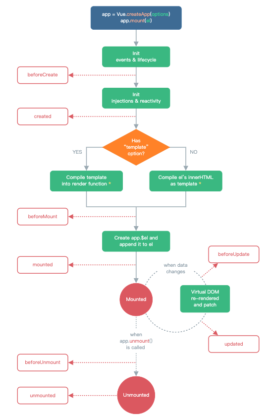
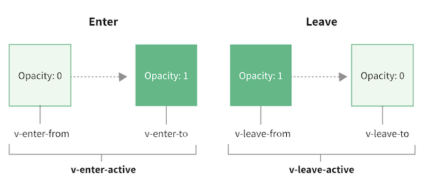

# Vue 3 新特性

Vue 3 最大的变化是改变了底层响应性机制和新增了组合式 API。

Vue 3 响应性原理请点 **[这里](./2021-04-05-vue3-reactive-theory/)**

## 组合式 API

**逻辑关注点**拆分，代码复用的新方式，这是 Vue 3 新增的最大一个新特性，这里的内容比较多，直接看 **[官方文档](https://v3.cn.vuejs.org/guide/composition-api-introduction.html)**

## 应用实例(app)

每个 Vue 应用都是通过用 `createApp` 函数创建一个新的 **应用实例** 开始

```javascript
const app = Vue.createApp({
  /* 选项 */
})
```

该 **应用实例** 是用来在应用中注册"全局"组件、"全局"方法、"全局"指令、"全局"插件等，取代 Vue 2 的全局函数

```js
const app = Vue.createApp({})
app.component('SearchInput', SearchInputComponent)
app.config.globalProperties.$http = () => {}
app.directive('focus', FocusDirective)
app.use(LocalePlugin)
```

Vue2 全局 API 和 Vue3 应用实例 API的对比

| 2.x 全局 API               | 3.x 实例 API (`app`)                       |
| -------------------------- | ------------------------------------------ |
| Vue.config                 | app.config                                 |
| Vue.config.productionTip   | **移除**                                   |
| Vue.config.ignoredElements | app.config.compilerOptions.isCustomElement |
| Vue.component              | app.component                              |
| Vue.directive              | app.directive                              |
| Vue.mixin                  | app.mixin                                  |
| Vue.use                    | app.use                                    |
| Vue.prototype              | app.config.globalProperties                |
| Vue.extend                 | **移除**                                   |
| Vue.filter                 | **移除**                                   |

**应用实例** 暴露的大多数方法都会返回该同一实例，允许链式：

```js
Vue.createApp({})
  .component('SearchInput', SearchInputComponent)
  .directive('focus', FocusDirective)
  .use(LocalePlugin)
```

传递给 `createApp` 的选项用于配置 **根组件**。当我们 **挂载** 应用时，该组件被用作渲染的起点。

```js
const RootComponent = { 
  /* 选项 */ 
}
const app = Vue.createApp(RootComponent)
const vm = app.mount('#app')
```

与大多数应用方法不同的是，`mount` 不返回应用本身。相反，它返回的是根组件实例

> 应用中的所有组件实例将共享同一个应用实例

## 生命周期钩子

`destroyed` 生命周期选项被重命名为 `unmounted`; `beforeDestroy` 生命周期选项被重命名为 `beforeUnmount`



## Data 现在只能是一个函数

组件的 `data` 选项是一个函数，不能是一个对象了。Vue 在创建新组件实例的过程中调用此函数。它应该返回一个对象，然后 Vue 会通过响应性系统将其包裹起来，并以 `$data` 的形式存储在组件实例中。为方便起见，该对象的任何顶级 property 也直接通过组件实例暴露出来。

```js
const app = Vue.createApp({
  data() {
    return { count: 4 }
  }
})

const vm = app.mount('#app')

console.log(vm.$data.count) // => 4
console.log(vm.count)       // => 4
```

##  表单输入绑定

`v-model` 在内部为不同的输入元素使用不同的 property 并抛出不同的事件：

- text 和 textarea 元素使用 `value` property 和 `input` 事件
- checkbox 和 radio 使用 `checked` property 和 `change` 事件
- select 字段将 `value` 作为 prop 并将 `change` 作为事件

例如

```html
<input v-model="text" />
```

等价于：

```html
<input :value="text" @input="text = $event.target.value" />
```

### 组件 `v-model` 

而自定义组件使用 `modelValue` prop 和 `update:modelValue` 事件，像这样

```html
<custom-input
  :model-value="searchText"
  @update:model-value="searchText = $event"
></custom-input>
```

我们可以通过向 `v-model` 传递参数来修改这些名称，例如

```html
<my-component v-model:title="bookTitle"></my-component>
```

在本例中，子组件将需要一个 `title` prop 并发出 `update:title` 要同步的事件

```js
app.component('my-component', {
  props: {
    title: String
  },
  emits: ['update:title'],
  template: `
    <input
      type="text"
      :value="title"
      @input="$emit('update:title', $event.target.value)">
  `
})
```

通过这个方法，可以实现在一个组件绑定多个 `v-model`

```html
<user-name
  v-model:first-name="firstName"
  v-model:last-name="lastName"
></user-name>
```

从  `v-model` 新的语法糖中可以看出， Vue 2 中 `.sync` 语法已经没用了，所以  ~~`.sync` 被 Vue 3 删除了~~

```html
// vue 2
<dialog
  visible.sync="visible"
></dialog>

// vue 3
<dialog
  v-model:visible="visible"
></dialog>
```

### 自定义 `v-model` 修饰符

当我们学习表单输入绑定时，我们看到 `v-model` 有[内置修饰符](https://v3.cn.vuejs.org/guide/forms.html#修饰符)——`.trim`、`.number` 和 `.lazy`。但是，在某些情况下，你可能还需要添加自己的自定义修饰符。

让我们创建一个示例自定义修饰符 `capitalize`，它将 `v-model` 绑定提供的字符串的第一个字母大写

```html
<my-component v-model.capitalize="myText"></my-component>
```

添加到组件 `v-model` 的修饰符将通过 `modelModifiers` prop 提供给组件

```js
app.component('my-component', {
  props: {
    modelValue: String,
    modelModifiers: {
      default: () => ({})
    }
  },
  emits: ['update:modelValue'],
  methods: {
    emitValue(e) {
      let value = e.target.value
      if (this.modelModifiers.capitalize) {
        value = value.charAt(0).toUpperCase() + value.slice(1)
      }
      this.$emit('update:modelValue', value)
    }
  },
  template: `<input
    type="text"
    :value="modelValue"
    @input="emitValue">`
})
```

对于带参数的 `v-model` 绑定，生成的 prop 名称将为 `arg + "Modifiers"`，例如

```html
<my-component v-model:description.capitalize="myText"></my-component>
```

生成的 prop 名称将为 `descriptionModifiers`


```js
app.component('my-component', {
  props: ['description', 'descriptionModifiers'],
  emits: ['update:description'],
  template: `
    <input type="text"
      :value="description"
      @input="$emit('update:description', $event.target.value)">
  `,
  created() {
    console.log(this.descriptionModifiers) // { capitalize: true }
  }
})
```

## 自定义事件

### 声明自定义事件

组件可以通过 `emits` 选项声明该组件要发出的事件。

```js
app.component('custom-form', {
  emits: ['inFocus', 'submit']
})
```

当在 `emits` 选项中定义了原生事件 (如 `click`) 时，将使用组件中的事件**替代**原生事件侦听器。

> 建议声明所有发出的事件，以便更好地记录组件应该如何工作
>
> ~~`.native` 事件修饰符被删除~~，因为对于子组件中**未**被定义为组件触发的所有事件监听器，Vue 3 现在将把它们作为原生事件监听器添加到子组件的根元素中 (除非在子组件的选项中设置了 `inheritAttrs: false`)

### 验证抛出的事件

与 prop 类型验证类似，如果使用对象语法而不是数组语法定义发出的事件，则可以验证它。

```js
app.component('custom-form', {
  emits: {
    // 没有验证
    click: null,

    // 验证submit 事件
    submit: ({ email, password }) => {
      if (email && password) {
        return true
      } else {
        console.warn('Invalid submit event payload!')
        return false
      }
    }
  },
  methods: {
    submitForm(email, password) {
      this.$emit('submit', { email, password })
    }
  }
})
```

## Provide / Inject

用来解决深度嵌套组件数据传递的问题

### 基础数据

provide 是一个对象

```js
app.component('todo-list', {
  data() {
    return {
      todos: ['Feed a cat', 'Buy tickets']
    }
  },
  provide: {
    user: 'John Doe'
  }
})

app.component('todo-list-statistics', {
  inject: ['user'],
  created() {
    console.log(`Injected property: ${this.user}`) // > 注入 property: John Doe
  }
})
```

### 组件实例 property

要访问组件实例 property，我们需要将 `provide` 转换为返回对象的函数

```js
app.component('todo-list', {
  data() {
    return {
      todos: ['Feed a cat', 'Buy tickets']
    }
  },
  provide() {
    return {
      todoLength: this.todos.length
    }
  }
})
```

### 处理响应性

默认情况下，`provide/inject` 绑定 **并不是** 响应式的。我们可以通过传递一个 `ref` property 或 `reactive` 对象给 `provide` 来改变这种行为。

在我们的例子中，如果我们想对祖先组件中的更改做出响应，我们需要为 provide 的 `todoLength` 分配一个组合式 API `computed` property

```js
app.component('todo-list', {
  // ...
  provide() {
    return {
      todoLength: Vue.computed(() => this.todos.length)
    }
  }
})

app.component('todo-list-statistics', {
  inject: ['todoLength'],
  created() {
    console.log(`Injected property: ${this.todoLength.value}`) // > Injected property: 5
  }
})
```

## 异步组件

Vue 3 使用  `defineAsyncComponent` 方法，定义异步组件。 此方法接受返回 `Promise` 的工厂函数

```js
import { defineAsyncComponent } from 'vue'

const AsyncComp = defineAsyncComponent(() =>
  import('./components/AsyncComponent.vue')
)

app.component('async-component', AsyncComp)

// Vue 2.x
// 这个动态导入会返回一个 `Promise` 对象。
const AsyncComp = () => import('./my-async-component')
```

带选项的异步组件

```js
const asyncModalWithOptions = defineAsyncComponent({
  loader: () => import('./components/AsyncComponent.vue'),
  delay: 200,
  timeout: 3000,
  errorComponent: ErrorComponent,
  loadingComponent: LoadingComponent
})
```

> Vue Router 支持一个类似的机制来异步加载路由组件，也就是俗称的*懒加载*。尽管类似，但是这个功能和 Vue 所支持的异步组件是不同的。当用 Vue Router 配置路由组件时，你**不**应该使用 `defineAsyncComponent`。你可以在 Vue Router 文档的[懒加载路由](https://next.router.vuejs.org/guide/advanced/lazy-loading.html)章节阅读更多相关内容。

## 自定义指令

自定义指令改变了钩子函数名称，跟组件的生命周期钩子函数名称保持一致

### 钩子函数

- `created`：在绑定元素的 attribute 或事件监听器被应用之前调用。这在指令需要附加事件监听器的情况下很有用，这些事件监听器必须在正常的v-on事件监听器之前调用。
- `beforeMount`：当指令第一次绑定到元素并且在挂载父组件之前调用。
- `mounted`：在绑定元素的父组件被挂载后调用。
- `beforeUpdate`：在更新包含组件的 VNode 之前调用。

- `updated`：在包含组件的 VNode **及其子组件的 VNode** 更新后调用。
- `beforeUnmount`：在卸载绑定元素的父组件之前调用。
- `unmounted`：当指令与元素解除绑定且父组件已卸载时，只调用一次。

## Teleport

Teleport 指定组件中的 DOM 挂在在哪个 DOM 下，非常适用于模态框

```vue
app.component('modal-button', {
  template: `
    <button @click="modalOpen = true">
        Open full screen modal! (With teleport!)
    </button>

    <teleport to="body">
      <div v-if="modalOpen" class="modal">
        <div>
          I'm a teleported modal! 
          (My parent is "body")
          <button @click="modalOpen = false">
            Close
          </button>
        </div>
      </div>
    </teleport>
  `,
  data() {
    return { 
      modalOpen: false
    }
  }
})
```

`to` 必须是有效的查询选择器或 HTMLElement (如果在浏览器环境中使用)。指定将在其中移动 `<teleport>` 内容的目标元素。

如果 `<teleport>` 包含 Vue 组件，则它仍将是 `<teleport>` 父组件的逻辑子组件，可以接受 `props`

## 片段

Vue 3 现在正式支持了多根节点的组件，也就是 **片段**。但是要求开发者显式定义 attribute 应该分布在哪里。

```html
<!-- Layout.vue -->
<template>
  <header>...</header>
  <main v-bind="$attrs">...</main>
  <footer>...</footer>
</template>
```

## 单文件组件样式特性 

### 深度选择器

由 `/deep/` 变成 `::v-deep` 现在又变成了 `deep()`

>  `deep()` 是 `::v-deep()` 的简写 

```vue
<style scoped>
.a :deep(.b) {
  /* ... */
}
</style>

// 编译成
.a[data-v-f3f3eg9] .b {
  /* ... */
}
```

### 插槽选择器

默认情况下，作用域样式不会影响到 `<slot/>` 渲染出来的内容，因为它们被认为是父组件所持有并传递进来的。使用 `:slotted` 伪类以确切地将插槽内容作为选择器的目标

>  `slotted()` 是 `::v-slotted()` 的简写 

```vue
<style scoped>
:slotted(div) {
  color: red;
}
</style>
```

### 全局选择器

>  `global()` 是 `::v-global()` 的简写

如果想让其中一个样式规则应用到全局，比起另外创建一个 `<style>`，可以使用 `:global` 伪类来实现

```vue
<style scoped>
:global(.red) {
  color: red;
}
</style>
```

###  CSS Modules

 `<style module> ` 标签会被编译为 [CSS Modules](https://github.com/css-modules/css-modules) 并且将生成的 CSS 类作为 $style 对象的键暴露给组件

```vue
<template>
  <p :class="$style.red">
    This should be red
  </p>
</template>

<style module>
.red {
  color: red;
}
</style>
```

#### 自定义注入名称

通过给 `module` attribute 一个值，自定义注入的类对象的名称

```vue
<template>
  <p :class="classes.red">red</p>
</template>

<style module="classes">
.red {
  color: red;
}
</style>
```

#### 与组合式 API 一同使用

注入的类可以通过 [`useCssModule`](https://v3.cn.vuejs.org/api/global-api.html#usecssmodule) API 在 `setup()` 和 `<script setup>` 中使用。对于使用了自定义注入名称的 `<style module>` 模块，`useCssModule` 接收一个对应的 `module` attribute 值作为第一个参数。

```js
// 默认, 返回 <style module> 中的类
useCssModule()

// 命名, 返回 <style module="classes"> 中的类
useCssModule('classes')
```

### 状态驱动的动态 CSS

单文件组件的 `<style>` 标签可以通过 `v-bind` 这一 CSS 函数将 CSS 的值关联到动态的组件状态上

```vue
<template>
  <div class="text">hello</div>
</template>

<script>
export default {
  data() {
    return {
      color: 'red'
    }
  }
}
</script>

<style>
.text {
  color: v-bind(color);
}
</style>
```

这个语法同样也适用于 `<script setup>`，且支持 JavaScript 表达式 (需要用引号包裹起来)

```vue
<script setup>
const theme = {
  color: 'red'
}
</script>

<template>
  <p>hello</p>
</template>

<style scoped>
p {
  color: v-bind('theme.color');
}
</style>
```

## API Treeshaking

在 Vue 3 中，全局和内部 API 都经过了重构，并考虑到了 tree-shaking 的支持。因此，对于 ES 模块构建版本来说，全局 API 现在通过具名导出进行访问。例如 `nextTick` 函数

```js
import { nextTick } from 'vue'

nextTick(() => {
  // 一些和 DOM 有关的东西
})
```

## v-bind 合并行为

在一个元素上同时使用 `v-bind="object"` 语法和独立 attribute时，后面的覆盖前面的，例如

```html
<!-- 模板 -->
<div id="red" v-bind="{ id: 'blue' }"></div>
<!-- 结果 -->
<div id="blue"></div>

<!-- 模板 -->
<div v-bind="{ id: 'blue' }" id="red"></div>
<!-- 结果 -->
<div id="red"></div>
```

## v-for 中的 Ref 数组

在 Vue 2 中，在 `v-for` 中使用的 `ref` attribute 会用 ref 数组填充相应的 `$refs` property。当存在嵌套的 `v-for` 时，这种行为会变得不明确且效率低下。

在 Vue 3 中，此类用法将不再自动创建 `$ref` 数组。要从单个绑定获取多个 ref，请将 `ref` 绑定到一个更灵活的函数上 (这是一个新特性)：

```html
<div v-for="item in list" :ref="setItemRef"></div>
```

选项式 API:

```js
export default {
  data() {
    return {
      itemRefs: []
    }
  },
  methods: {
    setItemRef(el) {
      if (el) {
        this.itemRefs.push(el)
      }
    }
  },
  beforeUpdate() {
    this.itemRefs = []
  },
  updated() {
    console.log(this.itemRefs)
  }
}
```

组合式 API:

```js
import { onBeforeUpdate, onUpdated } from 'vue'

export default {
  setup() {
    let itemRefs = []
    const setItemRef = el => {
      if (el) {
        itemRefs.push(el)
      }
    }
    onBeforeUpdate(() => {
      itemRefs = []
    })
    onUpdated(() => {
      console.log(itemRefs)
    })
    return {
      setItemRef
    }
  }
}
```

## 过渡

过渡类名 `v-enter` 修改为 `v-enter-from`、过渡类名 `v-leave` 修改为 `v-leave-from`



## 其它

- 当 `v-if` 与 `v-for` 一起使用时，`v-if` 具有比 `v-for` 更高的优先级，与 Vue 2 刚好相反

- 对于 `v-if`/`v-else`/`v-else-if` 的各分支项 `key` 将不再是必须的，因为现在 Vue 会自动生成唯一的 `key`

- `<template v-for>` 的 `key` 应该设置在 `<template>` 标签上 (而不是设置在它的子节点上)

- 函数式组件的性能提升可以忽略不计，Vue 官方建议只使用有状态的组件

- ~~`$scopedSlots` property 已移除~~，所有插槽都通过 `$slots` 作为函数暴露

- ~~`$listeners` 被移除~~，被合并到 `$attrs`

- `$attrs` 现在包含 `class` 和 `style` attribute

- 为了支持自定义元素(例如 Web Components API)，Vue 3 中特殊的 `is` attribute 的使用被严格限制在被保留的 `<component>` 标签中

- 在 prop 的默认函数中不能访问 `this` 上下文

- 来自 mixin 的 `data` 选项现在为浅合并

- 如果值为布尔值 `false`，则不再移除 attribute。取而代之的是，它将被设置为 attr="false"。若要移除 attribute，应该使用 `null` 或者 `undefined`

- 当侦听一个数组时，只有当数组被替换时才会触发回调。如果你需要在数组被改变时触发回调，必须指定 `deep` 选项

  ```js
  watch: {
    bookList: {
      handler(val, oldVal) {
        console.log('book list changed')
      },
      deep: true
    }
  }
  ```

- 没有特殊指令的标记 (`v-if/else-if/else`、`v-for` 或 `v-slot`) 的 `<template>` 现在被视为普通元素，并将渲染为原生的 `<template>` 元素，而不是渲染其内部内容

- 生命周期的 `hook:` 事件前缀改为 `vnode-`

  ```vue
  <template>
    <child-component @vnode-updated="onUpdated">
  </template>
  
  // vue 2
  <template>
    <child-component @hook:updated="onUpdated">
  </template>
  ```

- ~~`keyCode` 作为 `v-on` 修饰符被删除~~，使用按键的名字

- ~~$on、$off 和 $once 实例方法被删除~~，使用外部的、实现了事件触发器接口的库，例如 [mitt](https://github.com/developit/mitt) 或 [tiny-emitter](https://github.com/scottcorgan/tiny-emitter)

- ~~过滤器 (filter)被删除~~，使用计算属性、方法调用。(其实这个功能挺好用的，尤其是对于数据格式化，希望能加回来)

- ~~`$children` 实例 property被删除~~，使用$refs

- ~~全局函数 `set` 和 `delete` 以及实例方法 `$set` 和 `$delete`被删除~~。基于代理的变化检测已经不再需要它们了

