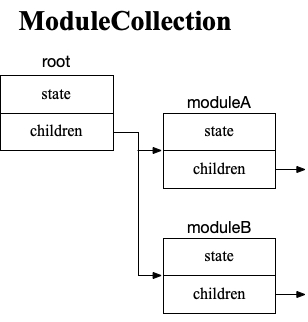
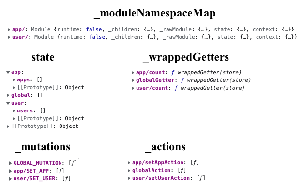

# Vuex 4.x 实现原理

Vuex 4.x 对应于 Vue 3.x，采用 Vue 3.x 的响应性原理，同时增加了组合式函数，详细的变更请看官方文档的[迁移指南](https://next.vuex.vuejs.org/zh/guide/migrating-to-4-0-from-3-x.html)。分析 Vuex 4.x 实现原理之前先简单回顾一下 Vuex 是怎样使用的。

## Vuex 的使用

我们先简单看一下在 Vue 的项目里是怎样使用 Vuex 的，详细介绍参见 [官方文档](https://next.vuex.vuejs.org/zh/guide/)。

```js
import { createApp } from 'vue'
import { createStore } from 'vuex'

// 创建一个新的 store 实例
const store = createStore({
  state () {
    return {
      count: 0
    }
  },
  mutations: {
    increment (state) {
      state.count++
    }
  }
})

const app = createApp({ /* 根组件 */ })

// 将 store 实例作为插件安装
app.use(store)
```

 在 Vue 组件中， 可以通过 `this.$store` 访问 store 实例。

```js
methods: {
  increment() {
    this.$store.commit('increment')
    console.log(this.$store.state.count) // -> 1
  }
}
```

这里我们不禁要问了

1. store 是怎么注入到 Vue 组件中的？
2. 为什么 store.state 具有响应性？

下面一起通过学习 Vuex 4 的 [源码](https://github.com/vuejs/vuex) 来解答这两个问题

> 下面展示的代码是 Vuex V4.0.2

## store 是怎么注入到 Vue 组件中的

通过 Vue 的 [官方文档-插件](https://v3.cn.vuejs.org/guide/plugins.html#%E7%BC%96%E5%86%99%E6%8F%92%E4%BB%B6)，我们知道插件的入口是插件对象的 `install` 方法，下面 Vuex `Store` 的 `install` 方法

```js
install (app, injectKey) {
  app.provide(injectKey || 'store', this)
  app.config.globalProperties.$store = this
}
```

`install` 方法通过 `app.config.globalProperties`，定义全局变量 `$store`.

此外还通过 `provide` 将 store 注入到 app，因此组件也可以通过 `inject` 获取，这也实现了[组合式 API](https://next.vuex.vuejs.org/zh/guide/composition-api.html) 的方式。

`this` 就是 `createStore` 方法创建的 `Store` 实例

```js
export function createStore(options) {
  return new Store(options)
}
```

## 为什么 store.state 具有响应性

我们知道 Vuex 3 通过创建一个 Vue 实例，并将 `state` 传入 `data` 函数，从而让 `state` 具有响应性。Vue 3 改变了[响应性原理](./2021-04-05-vue3-reactive-theory)，所以我们猜测 Vuex 4 将使用 `reactive` 让 `state` 具有响应性，下面是 Store 的构造函数

```js
export class Store {
  // options 即通过 createStore 传入的对象
  constructor (options = {}) {
    // 1. 对 options.modules 进行模块化(封装成 Module 实例)，并链接在一起
    this._modules = new ModuleCollection(options)
    
    const state = this._modules.root.state
    // 2. 提取所有 module 的 state，组合在顶层 state 上，封装并打平存储所有 module 的 getter、mutation、action 方法
    installModule(this, state, [], this._modules.root)
	
    // 3. 对 state、getter 添加响应性
    resetStoreState(this, state)
  }
}
```

### ModuleCollection

`ModuleCollection` 对 `options.modules` 进行模块化(封装成 `Module` 实例)，并链接在一起

```js {11,15}
export default class ModuleCollection {
  // rawRootModule 即通过 createStore 传入的对象
  constructor (rawRootModule) {
    this.register([], rawRootModule)
  }
  
  register (path, rawModule) {
    const newModule = new Module(rawModule)
    if (path.length === 0) {
      // 顶层对象作为 root
      this.root = newModule
    } else {
      // 添加子 module
      const parent = this.get(path.slice(0, -1))
      parent.addChild(path[path.length - 1], newModule)
    }

    // 处理嵌套
    if (rawModule.modules) {
      forEachValue(rawModule.modules, (rawChildModule, key) => {
        this.register(path.concat(key), rawChildModule)
      })
    }
  }
}
```

`options` 的顶层对象作为 `ModuleCollection` 的 `root` module（`Module` 实例）。`options.modules` 的各个 module，先用 `Module` 封装，然后存储在 `root` 的 `children ` 里(支持嵌套)。 `options` 和 module 里的 `state` 对象作为 `Module` 实例的 `state` 。结构如下，其中每个块都是一个 `Module` 实例。



### installModule

`installModule` 方法提取所有 module 的 state，组合在顶层 state 上，封装并打平存储所有 module 的 getter、mutation、action 方法

```js {17}
export function installModule (store, rootState, path, module) {
  const isRoot = !path.length
  // module 的命名空间
  const namespace = store._modules.getNamespace(path)

  // 打平存储 module
  if (module.namespaced) {
    store._modulesNamespaceMap[namespace] = module
  }

  // 提取各模块的 state
  // module.state => root.state.module.state
  if (!isRoot) {
    const parentState = getNestedState(rootState, path.slice(0, -1))
    const moduleName = path[path.length - 1]
    store._withCommit(() => {
      parentState[moduleName] = module.state
    })
  }

  const local = module.context = makeLocalContext(store, namespace, path)
 
  // 打平存储 mutation
  // module.mutations.mutation => store._mutations['module/mutation']
  module.forEachMutation((mutation, key) => {
    const namespacedType = namespace + key
    registerMutation(store, namespacedType, mutation, local)
  })

  // 打平存储 action
  // module.actions.action => store._actions['module/action']
  module.forEachAction((action, key) => {
    const type = action.root ? key : namespace + key
    const handler = action.handler || action
    registerAction(store, type, handler, local)
  })

  // 打平存储 getter
  // module.getters.getter => store._wrappedGetters['module/getter']
  module.forEachGetter((getter, key) => {
    const namespacedType = namespace + key
    registerGetter(store, namespacedType, getter, local)
  })

  // 处理嵌套
  module.forEachChild((child, key) => {
    installModule(store, rootState, path.concat(key), child)
  })
}
```

`installModule` 将各模块的 state 添加到 `root` 模块 `state` 下，比如模块 `app` 的 `state`，变成了 `root.state.app.state`。这样就把所有模块的 state 聚集在一起了。同时 `installModule` 将 module 及里面的 getters、mutations 和 actions，封装并打平存储，key 为模块相应的 namespace。处理之后的结构如下：

> 该 store 有两个模块 app、user



### resetStoreState

`resetStoreState` 方法对 state、getter 添加响应性

```js {18-22,26-28}
// 经过 installModule 函数的处理
// 顶层 state 和各模块的 state 都在参数 state 中
export function resetStoreState (store, state) {
  const oldState = store._state
  store.getters = {}
  
  // 经过 installModule 函数的处理
  // _wrappedGetters 保存所有模块的 getters
  const wrappedGetters = store._wrappedGetters
  const computedObj = {}
  const computedCache = {}
  forEachValue(wrappedGetters, (fn, key) => {
    // use computed to leverage its lazy-caching mechanism
    // direct inline function use will lead to closure preserving oldState.
    // using partial to return function with only arguments preserved in closure environment.
    // 下面两行为什么不直接 computed(() => fn(store))？
    computedObj[key] = partial(fn, store)
    computedCache[key] = computed(() => computedObj[key]())
    Object.defineProperty(store.getters, key, {
      get: () => computedCache[key].value,
      enumerable: true // for local getters
    })
  }

  // 用 reactive 封装 state，这个时候 state 就具有响应性了
  store._state = reactive({
    data: state
  })
}

export function partial (fn, arg) {
  return function () {
    return fn(arg)
  }
}

get state () {
  return this._state.data
}
```

和我们猜到的一样，用 `reactive` 封装了 `state`，从而让 `state` 具有了响应性。

对 store 的 `getter` 的处理复杂一些，将所有模块的 `getter` 方法，通过 `Object.defineProperty` 定义到 `store.getters ` 对象上，key 为模块的 namespace。像 Vue 计算属性选项一样，对 `getter` 用 `computed` 进行封装。

通过 `Object.defineProperty` 定义为计算属性是为了懒加载(取值的时候才开始计算)，同时也避免了获取旧的 `state` 值。为什么用 `computedObj` + `partial` 封装呢？防止 `fn` 被释放？这里不是很理解。

## Mutation & Action

讲完了 state 和 getter，现在我们来讲 mutation 和 action。mutation 对应的操作是 `store.commit`，action 对应的操作是 `store.dispath`。Vuex 对 mutation 的处理和对 action 的处理类似，因为对 action 处理要复杂一些，所以这里我们以 action 为例进行讲解。

### Dispatch

Vuex 通过 `dispatch` 方法分发 action

```js
store.dispatch('module/action')
```

那 Vuex 是怎么做的呢？

```js {9}
dispatch (_type, _payload)  (_type, _payload) {
  // 处理参数，因为 dispatch 支持两种分发方式
  // 1、以载荷形式分发 ('action', { payload })
  // 2、以对象形式分发 ({ type: 'action', payload: payload })
  const { type, payload } = unifyObjectStyle(_type, _payload)

  // 从 _actions 取得封装的 action 方法，
  // 注意这里是一个数组
  const entry = this._actions[type]
  const result = entry.length > 1
    ? Promise.all(entry.map(handler => handler(payload)))
    : entry[0](payload)

  return new Promise((resolve, reject) => {
    result.then(res => {
      resolve(res)
    }, error => {
      reject(error)
    })
  })
}
```

`dispatch` 方法很简单，从打平存储的 `_actions` 中，取得 `type` 对应的方法数组(为什么是数组，后面有讲到)，返回 promise。

那模块的 action 方法是怎样封装存储在 `_actions` 中的呢？

### Action 方法封装

我们再回头再来看看 `installModule` 方法

```js
export function installModule (store, rootState, path, module) {
  // module 的命名空间
  const namespace = store._modules.getNamespace(path)

  const local = module.context = makeLocalContext(store, namespace, path)
 
  // 打平存储 action
  // module.actions.action => store._actions['module/action']
  module.forEachAction((action, key) => {
    // 若需要在带命名空间的模块注册全局 action，添加 root: true，并将这个 action 的定义放在函数 handler 中
    // https://next.vuex.vuejs.org/zh/guide/modules.html#在带命名空间的模块注册全局-action
    const type = action.root ? key : namespace + key
    const handler = action.handler || action
    registerAction(store, type, handler, local)
  })

  // 处理嵌套
  module.forEachChild((child, key) => {
    installModule(store, rootState, path.concat(key), child)
  })
}
```

`installModule` 获取模块的 namespace，然后通过 `registerAction` 方法将 module 里的 action，存储到 `_actions` 中。同时 `installModule` 也处理在带命名空间的模块注册全局 action(见代码注释)。接下来我们来看看 `registerAction` 方法。

```js
// type: 带命名空间的函数名称
// handler: action 函数
// local: 等下讲
function registerAction (store, type, handler, local) {
  const entry = store._actions[type] || (store._actions[type] = [])
  entry.push(function wrappedActionHandler (payload) {
    let res = handler.call(store, {
      dispatch: local.dispatch,
      commit: local.commit,
      getters: local.getters,
      state: local.state,
      rootGetters: store.getters,
      rootState: store.state
    }, payload)
    if (!isPromise(res)) {
      res = Promise.resolve(res)
    }
    return res
  })
}
```

`registerAction` 方法也很简单，主要做两件事

1. 封装 action 方法，以 `type` 为 key，以封装函数的数组为 value，保存在 `store._actions` 中，这里为什么要用数组呢？我推测Vuex 支持多个全局 action 方法。
2. 通过 `store` 和 `local` 给 action 方法传参，所以 module 中的 action 方法的声明应该是这样的

```js
{
  actions: {
    increment ({dispatch, commit, getters, state, rootState, rootGetters}, payload) {
      commit('increment')
    }
  }
}
```

### Module.context

前面讲到 `registerAction` 方法，通过 `store` 和 `local` 给 action 方法传参，那 `local` 是什么呢？`local ` 就是 module 的 `context` 对象， 具有与 store 实例相同方法和属性。

```js
function makeLocalContext (store, namespace, path) {
  // 是否带有命名空间
  const noNamespace = namespace === ''

  const local = {
    // dispatch
    dispatch: noNamespace ? store.dispatch : (_type, _payload, _options) => {
      // 处理两种分发方式
      const args = unifyObjectStyle(_type, _payload, _options)
      const { payload, options } = args
      let { type } = args

      // `root = true` 属性以访问根 dispatch 或 commit
      if (!options || !options.root) {
        type = namespace + type
      }

      return store.dispatch(type, payload)
    },
		// commit
    commit: noNamespace ? store.commit : (_type, _payload, _options) => {
      // 与 dispatch 一样
    }
  }
  // getters and state object must be gotten lazily
  // because they will be changed by state update
  Object.defineProperties(local, {
   	// getters
    getters: {
      get: noNamespace
        ? () => store.getters
        : () => makeLocalGetters(store, namespace)
    },
    // state
    state: {
      get: () => getNestedState(store.state, path)
    }
  })

  return local
}
```

`context` 对象与 store 不同的是， `context` 对象与 module 绑定

- context.state 获取 module 的 state
- context.getters 获取 module 的 getters
- context.commit 根据 `options` 的 `root` 属性，决定是否添加 module namespace，然后调用 store.commit
- context.dispatch 根据 `options` 的 `root` 属性，决定是否添加 module namespace，然后调用 store.dispatch

## Map

我们再来看看 Vuex 辅助函数怎样实现的？以 `mapState` 为例

### 用法

```js
// 对象方式
mapState({
  // 箭头函数可使代码更简练
  count: state => state.count,

  // 传字符串参数 'count' 等同于 `state => state.count`
  countAlias: 'count',

  // 为了能够使用 `this` 获取局部状态，必须使用常规函数
  countPlusLocalState(state) {
    return state.count + this.localCount
  }
})

// 数组方式
mapState([
  // 映射 this.count 为 store.state.count
  'count'
])
```

### 实现

```js
export const mapState = normalizeNamespace((namespace, states) => {
  const res = {}
  normalizeMap(states).forEach(({ key, val }) => {
    res[key] = function mappedState () {
      let state = this.$store.state
      let getters = this.$store.getters
      // 1. 通过 namespace，在 store._modulesNamespaceMap 中找到 module
      if (namespace) {
        const module = getModuleByNamespace(this.$store, 'mapState', namespace)
        if (!module) {
          return
        }
       	// 2. 取得 module 内的 state 和 getters
        state = module.context.state
        getters = module.context.getters
      }
      // 3. 做映射
      return typeof val === 'function'
        ? val.call(this, state, getters)
        : state[val]
    }
  })
  return res
})
```

`normalizeNamespace` 处理参数是否带命名空间

`normalizeMap` 将数组方式解析成对象方式，然后，

1. 通过 namespace，在 `_modulesNamespaceMap` 中找到 module
2. 取得 module 内的 state 和 getters
3. 做映射

### createNamespacedHelpers 辅助函数

```js
export const createNamespacedHelpers = (namespace) => ({
  mapState: mapState.bind(null, namespace),
  mapGetters: mapGetters.bind(null, namespace),
  mapMutations: mapMutations.bind(null, namespace),
  mapActions: mapActions.bind(null, namespace)
})
```

通过  `bind` 函数，提前提供 namespace 参数给 `mapState` 等函数。

## 组合 API

`useStore` 方法很简单，就是通过 `inject` 获取 store

```js
export function useStore (key = null) {
  return inject(key !== null ? key : storeKey)
}
```
