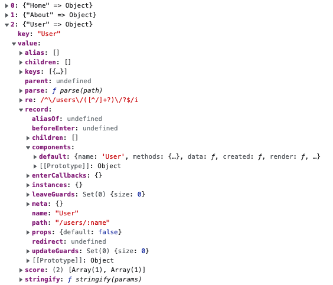
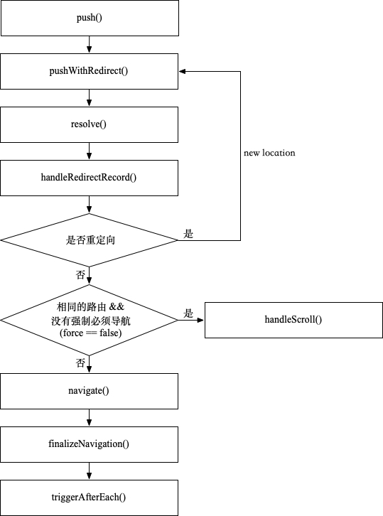
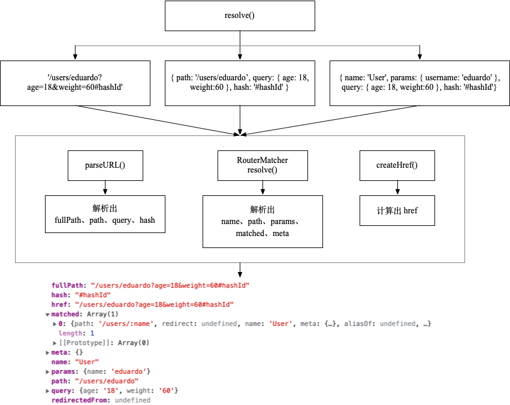
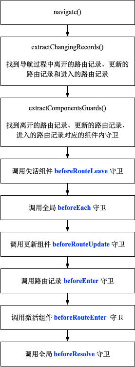
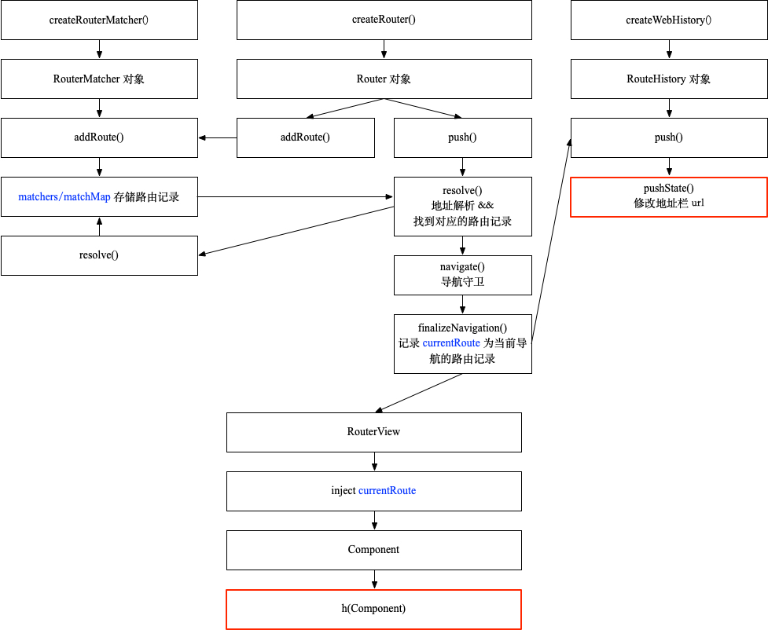

# Vue Router 4.x 实现原理

Vue Router 4.x 对应于 Vue 3.x，增加了组合式函数，详细的变更请看官方文档的[迁移指南](https://next.router.vuejs.org/zh/guide/migration/index.html)。分析 Vue Router 4.x 实现原理之前先简单回顾一下 Vue Router 是怎样使用的。下面是[官方文档](https://next.router.vuejs.org/zh/guide/#html)的介绍。

## Vue Router 的介绍

### Router

```js
import { createRouter, createWebHistory } from 'vue-router'

const Home = { template: '<div>Home</div>' }
const About = { template: '<div>About</div>' }

const routes = [
  { path: '/', name: 'Home', component: Home },
  { path: '/about', name: 'Abount', component: About },
  { path: '/users/:username', name: 'User', component: User }
]

const router = createRouter({
  history: createWebHistory(process.env.BASE_URL),
  routes
})

const app = Vue.createApp({})
app.use(router)

app.mount('#app')
```

### 通过 router-link 导航

```vue
<div id="app">
  <h1>Hello App!</h1>
  <p>
    <!--使用 router-link 组件进行导航 -->
    <!--通过传递 `to` 来指定链接 -->
    <!--`<router-link>` 将呈现一个带有正确 `href` 属性的 `<a>` 标签-->
    <router-link to="/">Go to Home</router-link>
    <router-link to="/about">Go to About</router-link>
  </p>
  <!-- 路由出口 -->
  <!-- 路由匹配到的组件将渲染在这里 -->
  <router-view></router-view>
</div>
```

### 通过 API 导航

```js
this.$router.push('/')
this.$router.push('/about')
```

这里我们就有疑问了，Vue Router 是怎样修改浏览器地址栏的？又是怎样把组件渲染到  `<router-view>`的？带着这两个疑问，我们通过 Vue Router 的[源代码](https://github.com/vuejs/vue-router-next)来分析它是怎么实现的。

> Vue Router 是用 TypeScript 语言写的
>
> 版本号 4.0.12

## createRouter 方法

在 Vue 的工程中，通过 `createRouter` 方法创建路由。`createRouter` 方法创建并返回一个 `Router` 类型的对象，Vue Router 绝大部分功能都是通过这个 `Router` 对象里实现的，我们后面会介绍。 `Router` 主要方法如下：

- Vue 插件入口： `install`

- 路由记录相关方法： `addRoute`、`removeRoute`、`getRoutes`、`resolve`、`hasRoute`
- 导航相关的方法： `push`、`replace`、`go`、`forward`、`back`
- 导航守卫方法： `beforeEach`、 `beforeResolve`、`afterEach`

## install 方法

Vue 插件的入口就是其 `install` 方法

`Router` 对象的 `install` 方法的主要功能：

1. 注册 `RouterLink`， `RouterView` 全局组件
2. 定义 `$router` 和 `$route` app 全局属性。`$route` 只能读不能写，是非响应性对象（ `unref` )
3. 进行首次导航，导航到浏览器当前地址。
4. 通过 `provide` 注入 `router` 、`currentRoute`，以及响应性的 `currentRoute`（见下面的注释）
5. 改写 app 的 `unmount `方法，进行数据清理，移除事件监听器

```typescript
install(app: App) {
  const router = this
  // 1.
  app.component('RouterLink', RouterLink)
  app.component('RouterView', RouterView)

  // 2.
  app.config.globalProperties.$router = router
  Object.defineProperty(app.config.globalProperties, '$route', {
    enumerable: true,
    get: () => unref(currentRoute),
  })

  // 3.
  // this initial navigation is only necessary on client, on server it doesn't
  // make sense because it will create an extra unnecessary navigation and could
  // lead to problems
  if (
    isBrowser &&
    // used for the initial navigation client side to avoid pushing
    // multiple times when the router is used in multiple apps
    !started &&
    currentRoute.value === START_LOCATION_NORMALIZED
  ) {
    // see above
    started = true
    // `routerHistory` 是 `createRouter(options)` 的 `options.history`，例如 `createWebHistory()`
    // `routerHistory.location` 为浏览器当前地址
    push(routerHistory.location)
  }

  // 4.
  const reactiveRoute = {}
  for (const key in START_LOCATION_NORMALIZED) {
    reactiveRoute[key] = computed(() => currentRoute.value[key])
  }
  app.provide(routerKey, router)
  // 因为 `currentRoute` 是 `shallowRef`，通过 `computed` 使 `params`、`query` 等其它属性对象具有响应性
  // RouterLink `inject` 这个对象
  // 组合式 useRoute 也是 `inject` 这个对象
  app.provide(routeLocationKey, reactive(reactiveRoute))
  // 当前路由记录，RouterView `inject` 这个对象
  app.provide(routerViewLocationKey, currentRoute)

  // 5.
  const unmountApp = app.unmount
  installedApps.add(app)
  app.unmount = function () {
    installedApps.delete(app)
    // the router is not attached to an app anymore
    if (installedApps.size < 1) {
      // invalidate the current navigation
      pendingLocation = START_LOCATION_NORMALIZED
      removeHistoryListener && removeHistoryListener()
      currentRoute.value = START_LOCATION_NORMALIZED
      started = false
      ready = false
    }
    unmountApp()
  }
}
```

`currentRoute` 是 [`shallowRef`](https://v3.cn.vuejs.org/api/refs-api.html#shallowref) 类型

```typescript
 const currentRoute = shallowRef<RouteLocationNormalizedLoaded>(
    START_LOCATION_NORMALIZED
  )
  START_LOCATION_NORMALIZED = {
    path: '/',
    name: undefined,
    params: {},
    query: {},
    hash: '',
    fullPath: '/',
    matched: [],
    meta: {},
    redirectedFrom: undefined,
  }
```

## 添加路由记录

在 `createRouter` 方法中通过 `createRouterMatcher` 方法添加用户配置的 `routes`。

```typescript
function createRouter(options: RouterOptions): Router {
  const matcher = createRouterMatcher(options.routes, options)
}
```

`createRouterMatcher` 方法返回 `RouterMatcher` 对象，`Router` 对象中的跟路由记录相关方法，比如 `addRoute`，都是通过`RouterMatcher` 对象实现的。

```typescript
function createRouterMatcher(
  routes: RouteRecordRaw[],
  globalOptions: PathParserOptions
): RouterMatcher {
  // normalized ordered array of matchers
  const matchers: RouteRecordMatcher[] = []
  const matcherMap = new Map<RouteRecordName, RouteRecordMatcher>()
 
  // add initial routes
  routes.forEach(route => addRoute(route))
  
  // RouterMatcher 对象
  return { addRoute, resolve, removeRoute, getRoutes, getRecordMatcher }
}
```

`createRouterMatcher` 方法首先定义了 `matchers` 数组和 `matcherMap` map，用来存储 routes。然后对传入 `createRouter` 方法的每个 route 调用 `addRoute` 方法加入到 `matchers` 数组和 `matcherMap` map。

`matcherMap` 中的 key 是 `RouteRecordName` 类型，value 是 `RouteRecordMatcher` 类型。

```typescript
export type RouteRecordName = string | symbol

export interface RouteRecordMatcher extends PathParser {
  record: RouteRecord
  parent: RouteRecordMatcher | undefined
  children: RouteRecordMatcher[]
  // aliases that must be removed when removing this record
  alias: RouteRecordMatcher[]
}
```

从 `RouteRecordMatcher` 的定义可以看出，Vue Router 支持路由嵌套，RouteRecord 就是路由记录的[标准化版本](https://next.router.vuejs.org/zh/api/#routerecordnormalized)。

### addRoute 方法

`addRoute` 方法功能其实很简单，但是因为添加的路由记录可能是别的路由记录的 alias，自己也有 alias 路由记录，导致代码比较复杂。这里我们先去掉对 alias 的处理，只关注路由记录本身。下面是 `addRoute` 方法的功能：

1. 通过 `normalizeRouteRecord` 方法，将 [RouteRecordRaw](https://next.router.vuejs.org/zh/api/#routerecordraw) 类型的路由记录转化为标准化版本 [RouteRecordNormalized](https://next.router.vuejs.org/zh/api/#routerecordnormalized)。
2. 对路由记录的 `path` 进行标准化处理：把相对地址转化为绝对地址
3. 创建 `RouteRecordMatcher` 对象
4. 循环添加路由记录的子路由
5. 将路由记录添加到 `matchers` 数组和 `matcherMap` map 中
6. `addRoute` 方法返回一个函数，用于移除添加的路由记录

```typescript
function addRoute(
  record: RouteRecordRaw,
  parent?: RouteRecordMatcher
) {  
  // 1.  
  const mainNormalizedRecord = normalizeRouteRecord(record)
  const normalizedRecords = [
    mainNormalizedRecord,
  ]

  let matcher: RouteRecordMatcher
  let originalMatcher: RouteRecordMatcher | undefined

  for (const normalizedRecord of normalizedRecords) {
    const { path } = normalizedRecord
    // 2.
    // Build up the path for nested routes if the child isn't an absolute
    // route. Only add the / delimiter if the child path isn't empty and if the
    // parent path doesn't have a trailing slash
    if (parent && path[0] !== '/') {
      const parentPath = parent.record.path
      const connectingSlash =
        parentPath[parentPath.length - 1] === '/' ? '' : '/'
      normalizedRecord.path =
        parent.record.path + (path && connectingSlash + path)
    }

    // 3.
    // create the object before hand so it can be passed to children
    matcher = createRouteRecordMatcher(normalizedRecord, parent, options)

    // 4.
    if ('children' in mainNormalizedRecord) {
      const children = mainNormalizedRecord.children
      for (let i = 0; i < children.length; i++) {
        addRoute(
          children[i],
          matcher,
          originalRecord && originalRecord.children[i]
        )
      }
    }
		
    // 5. 
    insertMatcher(matcher)
  }

  // 6.
  return originalMatcher
    ? () => {
        removeRoute(originalMatcher!)
      }
    : noop
}
```

`insertMatcher` 方法将路由记录添加到 `matchers` 数组和 `matcherMap` map 中

```typescript
function insertMatcher(matcher: RouteRecordMatcher) {
  let i = 0
  while (
    i < matchers.length &&
    comparePathParserScore(matcher, matchers[i]) >= 0
  )
    i++
  matchers.splice(i, 0, matcher)
  // only add the original record to the name map
  if (matcher.record.name && !isAliasRecord(matcher))
    matcherMap.set(matcher.record.name, matcher)
}
```

下面是 `matcherMap` map 中保存的路由记录



现在有了路由记录，我们接下来看 Vue Router是怎么导航的。Vue Router 通过 `push`、`replace ` 方法进行[编程式导航](https://next.router.vuejs.org/zh/guide/essentials/navigation.html)。

## 编程式导航

### push 方法

`push` 方法接受 [RouteLocationRaw](https://next.router.vuejs.org/zh/api/#routelocationraw) 和 [RouteLocation](https://next.router.vuejs.org/zh/api/#routelocation) 类型的参数，返回一个 promise。

```typescript
function push(to: RouteLocationRaw | RouteLocation) {
  return pushWithRedirect(to)
}

function pushWithRedirect(
    to: RouteLocationRaw | RouteLocation,
    redirectedFrom?: RouteLocation
  ): Promise<NavigationFailure | void | undefined> {}
```

`push` 方法大致支持以下三种方式：

```js
// 字符串路径
router.push('/users/eduardo')

// 带有路径的对象
router.push({ path: '/users/eduardo' })

// 带有 name 的对象
router.push({ name: 'user', params: { username: 'eduardo' } })
```

这里是 `push` 方法的流程图



现在我们来看看各个方法的具体功能，为了更直观的描述，我们以下面这个为例

```js
// route
{ path: '/users/:name', name: 'User', component: User }

// 导航
router.push('/users/eduardo?age=18&weight=60#hashId')
router.push({ path: '/users/eduardo', query: {age: 18, weight: 60}, hash: '#hashId'})
router.push({ name: 'User', params: { name: 'eduardo' }, query: {age: 18, weight: 60}, hash: '#hashId'})
```

#### resolve 方法

`resolve` 方法将不同的导航方式，即将 `push` 方法不同的参数统一标准化为 [RouteLocation](https://next.router.vuejs.org/zh/api/#routelocation) 对象，下面是 `resolve`  方法的流程图



这里需要说明的是这个 `mathed` 属性，保存的是与当前路径匹配的所有路由记录 [RouteRecordNormalized](https://next.router.vuejs.org/zh/api/#routerecordnormalized)，包括父记录（嵌套路由），父记录在前，当前记录在最后。

`herf` 与 `fullPath` 的区别在于，`herf` 包含 [`base`](https://next.router.vuejs.org/zh/api/#createwebhistory) ，即 [`publicPath`](https://cli.vuejs.org/zh/config/#publicpath)

`RouterMatcher` 的 `resolve` 方法的功能是找到对应的路由记录，它有两种方式

1. 通过 `path` 从 `matchers` 数组中找到对应的路由记录
2. 通过 `name` 从 `matcherMap` map 中找到对应的路由记录

从这里我们可以看出，如果路由记录比较多，通过 `name` 比通过 `path` 找到对应的路由记录要快。

#### navigate 方法

`navigate` 方法调用[导航守卫](https://next.router.vuejs.org/zh/guide/advanced/navigation-guards.html)，进行导航之前的确认，下面是 `navigate`  方法的流程图



#### finalizeNavigation 方法

经过 `navigate` 方法之后，导航被确定。`finalizeNavigation` 方法执行导航。

1. 如果是 `replace: true` 或者是第一次导航（ 在 [install](#install%20方法) 方法中执行的），执行 `routerHistory.replace`，否则执行 `routerHistory.push`
2. `currentRoute` 记录目的地路由记录
3. `handleScroll` 处理滑动
3. `markAsReady` 建立 `popstate` 事件处理，详情见[Vue Router 4.x 导航实现](/2021/06/18/vue-router-navigate/)

```typescript
function finalizeNavigation(
  toLocation: RouteLocationNormalizedLoaded,
  from: RouteLocationNormalizedLoaded,
  isPush: boolean,
  replace?: boolean,
  data?: HistoryState
): NavigationFailure | void {
  // only consider as push if it's not the first navigation
  const isFirstNavigation = from === START_LOCATION_NORMALIZED
  const state = !isBrowser ? {} : history.state

  // change URL only if the user did a push/replace and if it's not the initial navigation because
  // it's just reflecting the url
  // 1.
  if (isPush) {
    if (replace || isFirstNavigation)
      routerHistory.replace(
        toLocation.fullPath,
        assign(
          {
            scroll: isFirstNavigation && state && state.scroll,
          },
          data
        )
      )
    else routerHistory.push(toLocation.fullPath, data)
  }

  // accept current navigation
  // 2.
  currentRoute.value = toLocation
  // 3.
  handleScroll(toLocation, from, isPush, isFirstNavigation)
  // 4.
  markAsReady()
}
```

`finalizeNavigation` 方法主要是调用 `routerHistory` 的 `push` 或者 `replace` 方法。那这个 `routerHistory` 是什么呢？ `routerHistory` 就是你传给 createRouter 方法的 [history](https://next.router.vuejs.org/zh/api/#history) 参数。我们这里以 [createWebHistory](https://next.router.vuejs.org/zh/api/#createwebhistory) 为例说明。

#### RouterHistory 的 `push` 方法

RouterHistory 的 `push` 方法通过 `changeLocation` 方法修改 `history.state` 属性，最后 `currentLocation` 记录当前的路由地址。

```typescript
function push(to: HistoryLocation, data?: HistoryState) {
  // Add to current entry the information of where we are going
  // as well as saving the current position
  const currentState = assign(
    {},
    // use current history state to gracefully handle a wrong call to
    // history.replaceState
    // https://github.com/vuejs/vue-router-next/issues/366
    historyState.value,
    history.state as Partial<StateEntry> | null,
    {
      forward: to,
      scroll: computeScrollPosition(),
    }
  )

  changeLocation(currentState.current, currentState, true)

  const state = assign(
    {},
    {
      back: currentLocation.value，
      current: to,
      forward: null,
      replaced: false，
      scroll： null
    },
    { 
      position: currentState.position + 1 
    },
    data
   )

  changeLocation(to, state, false)
  currentLocation.value = to
}
```

#####  `changeLocation` 方法

我们知道，浏览器页面跳转是通过 [Location](http://developer.mozilla.org/en-US/docs/Web/API/Location) 或者 [History](http://developer.mozilla.org/en-US/docs/Web/API/Location) API实现的，正所谓万变不离其宗，Vue Router 里面也是通过这个方式实现浏览器地址栏 url 的变化。 [History](http://developer.mozilla.org/en-US/docs/Web/API/Location) 的 `pushState` 或者 `replaceState` 虽然可以改变地址栏，但是不会加载页面，而 [Location](http://developer.mozilla.org/en-US/docs/Web/API/Location) 的 `assign` 或者 `replace` 会重新加载页面，所以 [History](http://developer.mozilla.org/en-US/docs/Web/API/Location) API 更符合 Vue Router 的设计。

```typescript {16,25}
function changeLocation(
  to: HistoryLocation,
  state: StateEntry,
  replace: boolean
): void {
  const hashIndex = base.indexOf('#')
  const url =
    hashIndex > -1
      ? (location.host && document.querySelector('base')
          ? base
          : base.slice(hashIndex)) + to
      : createBaseLocation() + base + to 
  try {
    // BROWSER QUIRK
    // NOTE: Safari throws a SecurityError when calling this function 100 times in 30 seconds
    history[replace ? 'replaceState' : 'pushState'](state, '', url)
    historyState.value = state
  } catch (err) {
    // Force the navigation, this also resets the call count
    location[replace ? 'replace' : 'assign'](url)
  }
}

let createBaseLocation = () => location.protocol + '//' + location.host
```

RouterHistory 的 `replace` 方法与 `push` 方法类似，只是最后在 `changeLocation` 方法中使用 `replaceState   ` 代替  `pushState`。

#### triggerAfterEach 方法

最后是 `triggerAfterEach` 方法，执行全局的 `afterEach ` 导航守卫

至此导航完成，导航过程中的信息已经保存（currentRoute、currentLocation），url地址栏也发生了变化，接下来我们看看怎么把路由记录里的组件渲染出来。

## RouterView 组件

Vue Router 通过 RouterView 组件渲染路由记录对应的组件。下面是 RouterView 组件的功能

1. 存储路由记录对应的组件实例
1. 执行组件内 `beforeRouteEnter` 导航守卫的 [`next`](https://next.router.vuejs.org/zh/guide/advanced/navigation-guards.html#%E7%BB%84%E4%BB%B6%E5%86%85%E7%9A%84%E5%AE%88%E5%8D%AB) 回调方法，在这里可以访问 `this`
1.  找到对应的命名组件
1.  [组件传参](https://next.router.vuejs.org/zh/guide/essentials/passing-props.html)
1. 渲染路由记录对应的组件
1. [RouterView `v-slot` API](https://next.router.vuejs.org/zh/api/#router-view-%E7%9A%84-v-slot)

```typescript
export const RouterViewImpl = defineComponent({
  name: 'RouterView',
  // #674 we manually inherit them
  inheritAttrs: false,
  props: {
    name: {
      type: String as PropType<string>,
      default: 'default',
    },
    route: Object as PropType<RouteLocationNormalizedLoaded>,
  },

  setup(props, { attrs, slots }) {
    // 当前路由记录 `currentRoute`，包含嵌套的
    const injectedRoute = inject(routerViewLocationKey)!
    const routeToDisplay = computed(() => props.route || injectedRoute.value)
    // 嵌套路由的深度
    const depth = inject(viewDepthKey, 0)
    // 获取当前页面的路由记录
    const matchedRouteRef = computed<RouteLocationMatched | undefined>(
      () => routeToDisplay.value.matched[depth]
    )

    // 嵌套深度+1
    provide(viewDepthKey, depth + 1)
    // 注入当前页面的路由记录
    provide(matchedRouteKey, matchedRouteRef)
    // 注入当前路由记录
    provide(routerViewLocationKey, routeToDisplay)

    // 绑定组件实例
    const viewRef = ref<ComponentPublicInstance>()

    // 1. 存储路由记录对应的组件实例
    // watch at the same time the component instance, the route record we are
    // rendering, and the name
    watch(
      () => [viewRef.value, matchedRouteRef.value, props.name] as const,
      ([instance, to, name], [oldInstance, from, oldName]) => {
        // copy reused instances
        if (to) {
          // this will update the instance for new instances as well as reused
          // instances when navigating to a new route
          to.instances[name] = instance
          // the component instance is reused for a different route or name so
          // we copy any saved update or leave guards. With async setup, the
          // mounting component will mount before the matchedRoute changes,
          // making instance === oldInstance, so we check if guards have been
          // added before. This works because we remove guards when
          // unmounting/deactivating components
          if (from && from !== to && instance && instance === oldInstance) {
            if (!to.leaveGuards.size) {
              to.leaveGuards = from.leaveGuards
            }
            if (!to.updateGuards.size) {
              to.updateGuards = from.updateGuards
            }
          }
        }

      	// 2. 执行 `beforeRouteEnter` 导航守卫的 `next` 回调方法，在这里可以访问 `this`
        // trigger beforeRouteEnter next callbacks
        if (
          instance &&
          to &&
          // if there is no instance but to and from are the same this might be
          // the first visit
          (!from || !isSameRouteRecord(to, from) || !oldInstance)
        ) {
          ;(to.enterCallbacks[name] || []).forEach(callback =>
            callback(instance)
          )
        }
      },
      { flush: 'post' }
    )

    // 渲染函数
    return () => {
      const route = routeToDisplay.value
      const matchedRoute = matchedRouteRef.value
      // 3. 找到对应的命名组件
      const ViewComponent = matchedRoute && matchedRoute.components[props.name]
      // we need the value at the time we render because when we unmount, we
      // navigated to a different location so the value is different
      const currentName = props.name

      if (!ViewComponent) {
        return normalizeSlot(slots.default, { Component: ViewComponent, route })
      }

      // 4. 组件路由传参数
      // props from route configuration
      const routePropsOption = matchedRoute!.props[props.name]
      const routeProps = routePropsOption
        ? routePropsOption === true
          ? route.params
          : typeof routePropsOption === 'function'
          ? routePropsOption(route)
          : routePropsOption
        : null

      // 虚拟 node 的 `unmounted` 钩子方法
      const onVnodeUnmounted: VNodeProps['onVnodeUnmounted'] = vnode => {
        // remove the instance reference to prevent leak
        if (vnode.component!.isUnmounted) {
          matchedRoute!.instances[currentName] = null
        }
      }

      // 5. 渲染路由记录对应的组件 
      const component = h(
        ViewComponent,
        assign({}, routeProps, attrs, {
          onVnodeUnmounted,
          ref: viewRef,
        })
      )
	
      return (
        // pass the vnode to the slot as a prop.
        // h and <component :is="..."> both accept vnodes
        // 6. v-slot API
        normalizeSlot(slots.default, { Component: component, route }) ||
        component
      )
    }
  }
})
```

## 总结

我们现在可以回答之前的两个问题

1. Vue Router 是怎样修改浏览器地址栏？

   Vue Router 的 `push` 或者 `replace` 方法通过 [History API](https://developer.mozilla.org/en-US/docs/Web/API/History) `pushState` 或 `replaceState` 修改浏览器地址栏

2. Vue Router 是怎样把组件渲染到  `<router-view>`？

   Vue Router 找到当前路由记录对应的组件，通过 Vue 的 `h` 渲染函数渲染到 `<router-view>`

下面是 Vue Router 整体流程图



   


