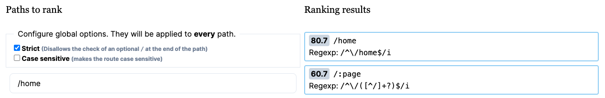
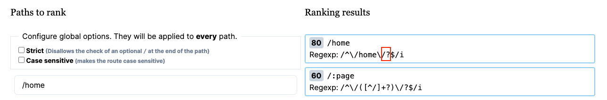

# Vue Router 4.x strict 模式

我在看 Vue Router 4.x 的源代码时发现一个问题，就是对于嵌套路由在计算相对 path 的时候，计算出来的 path 是”错误“的。下面是 Vue Router 4.0.12 的源代码。关键点在第 9 行，`let position = fromSegments.length - 1`，删除了 path 最后一节。

```typescript {9}
export function resolveRelativePath(to: string, from: string): string {
  if (to.startsWith('/')) return to

  if (!to) return from

  const fromSegments = from.split('/')
  const toSegments = to.split('/')

  let position = fromSegments.length - 1
  let toPosition: number
  let segment: string

  for (toPosition = 0; toPosition < toSegments.length; toPosition++) {
    segment = toSegments[toPosition]
    // can't go below zero
    if (position === 1 || segment === '.') continue
    if (segment === '..') position--
    // found something that is not relative path
    else break
  }

  return (
    fromSegments.slice(0, position).join('/') +
    '/' +
    toSegments
      .slice(toPosition - (toPosition === toSegments.length ? 1 : 0))
      .join('/')
  )
}
```

然后我就用在线编辑器 [replit](https://replit.com/ ) 试了一下这个函数，输入 `to:'profile'`，`from:'/user/cp3hnu'`，我们想要的相对地址应该是 `/user/cp3hnu/profile`，但是输出结果是 `/user/profile`。这不是我们想要的相对地址。然后我建了一个工程来测试一下，是不是 Vue Router 有什么细节处理这一块。

下面是 routes

```js
{
  path: "/user/:username",
  name: "User",
  component: User,
  children: [
    {
      path: "",
      name: "UserDefault",
      component: UserDefault
    },
    {
      path: "profile",
      name: "UserProfile",
      component: UserProfile
    }
  ]
}
```

然后在 User 组件里执行导航

```js
this.$router.push('profile'); 
// 或者
this.$router.push({ path: 'profile' });

// 注意带有 name 的对象导航是正确的，因为它不是通过 `resolveRelativePath` 计算相对地址的
this.$router.push({ name: 'UserProfile' });
```

果然地址变成了 `/user/profile`，导致路由错误。然后我 google 了一下没找到答案，于是我去 Vue Router 的 GitHub 仓库提了一个 [issue](https://github.com/vuejs/router/issues/1283)，他们告诉我

> This is correct behavior. You need the trailing slash and the strict option to make it work

就像下面这样

```js {3,6}
export const router = createRouter({
  history: createWebHistory(),
  strict: true, // 默认是false
  routes: [
    {
      path: '/user/:username/',
      name: 'User',
      component: User,
      children: [
        {
          path: '',
          name: 'UserDefault',
          component: UserDefault,
        },
        {
          path: 'profile',
          name: 'UserProfile',
          component: UserProfile,
        }
      ]
    }
  ]
})
```

导航到 user 页面，注意最后一定要加上反斜杠("/")，否则找不到路由记录

```js
this.$router.push('/user/cp3hnu/');
```

 然后再跳转到 profile 页面

```js
this.$router.push('profile'); 
```

如果 profile 路由记录下面还有子路由，profile 路由的 path 和导航时，最后也要记得加反斜杠(''/")。

## strict 模式

那我们来看看什么是 strict 模式，strict 模式其实就是路径全匹配，主要是针对末尾的反斜杠("/")。当 strict 为 true 时，路由记录的 path 和地址栏里的 path 末尾的反斜杠("/")一定要对应上，否则当做不匹配。当 strict 为 false 时，则不需要。

下面是源码，当 strict 为 false 时，正在表达式后面添加了`'/?'`

```js
 if (!options.strict) pattern += '/?'
```

我们可以用 [Path Ranker](https://paths.esm.dev/?p=ABMMIPQgYAEL9lNgQAECUgPgDIFiDgCg#) 测试一下

当 strict = true



当 strict = false，路径匹配的正则表达式后面多了一个"/?"



除了在 `createRouter` 函数中定义全局 strict 模式之外，每条路由记录也可以定义 strict 模式，并且路由记录会覆盖全局的 strict 模式，像这样

```js {3,8}
export const router = createRouter({
  history: createWebHistory(),
  strict: false,
  routes: [
    {
      path: '/user/:username/',
      name: 'User',
      strict: true,
      component: User,
      children: [
        {
          path: '',
          name: 'UserDefault',
          component: UserDefault,
        },
        {
          path: 'profile',
          name: 'UserProfile',
          component: UserProfile,
        }
      ]
    }
  ]
})
```

### 子路由相对路径跳转

其实一开始所说的子路由相对路径跳转的问题跟 strict 模式没有直接关系。我们再回头看看 `resolveRelativePath` 方法，如果 from 末尾带了反斜杠("/")，那么计算出来的相对地址是正确的，例如输入 `to:'profile'`，`from:'/user/cp3hnu/'`，输出的相对地址是 `/user/cp3hnu/profile`。只是我们以前习惯于路由记录末尾不带反斜杠("/")。所以只要保证路由记录的 path 末尾有反斜杠("/")，然后导航到根路由时也记得末尾带上反斜杠("/")，那么子路由相对路径跳转就没有问题，跟是不是 strict 模式没有关系，即

```js
export const router = createRouter({
  history: createWebHistory(),
  strict: false,
  routes: [
    {
      path: '/user/:username/',
      name: 'User',
      component: User,
      children: [
        {
          path: '',
          name: 'UserDefault',
          component: UserDefault,
        },
        {
          path: 'profile',
          name: 'UserProfile',
          component: UserProfile,
        }
      ]
    }
  ]
})
```

导航到 user 页面，注意最后一定要加上反斜杠("/")

```js
this.$router.push('/user/cp3hnu/');
```

 然后再跳转到 profile 页面

```js
this.$router.push('profile'); 
```

**但是**这样导航到 user 页面可能会忘记最后加反斜杠("/")，或者用户人为去掉地址栏后面的反斜杠("/")，从而导致跳转到 profile 页面出错，所以建议**以 name 或者绝对路径进行导航**，这样路由记录末尾有没有反斜杠("/")都没有问题。

```js
this.$router.push({ name: 'UserProfile' });
```

## sensitive 模式

路径匹配时是否大小写敏感（case-sensitive），默认不敏感（ false ），即 `/home` 与 `/HOME` 是匹配的。如果 sensitive = true， `/home` 与 `/HOME` 就不匹配了。

```js
const re = new RegExp(pattern, options.sensitive ? '' : 'i')
```


