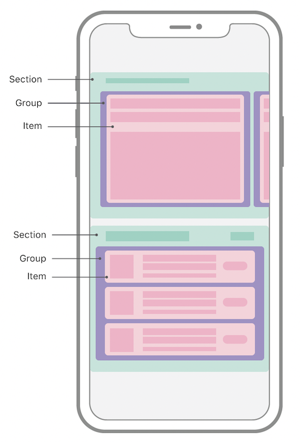
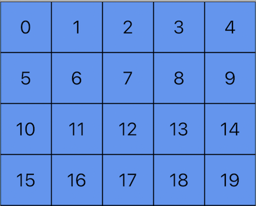
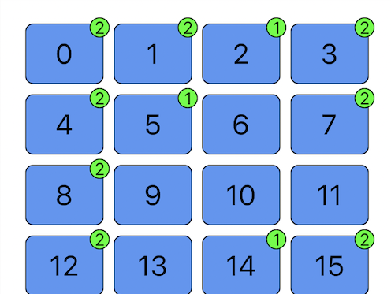
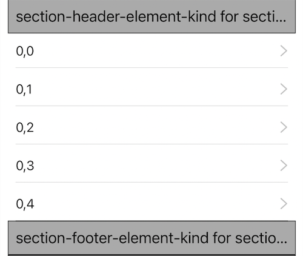
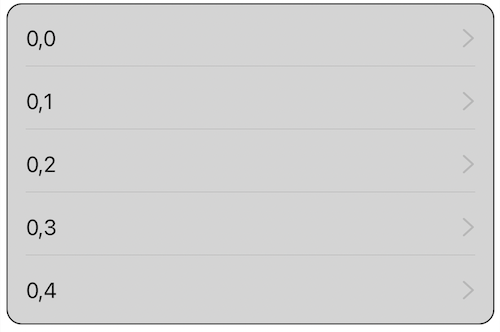
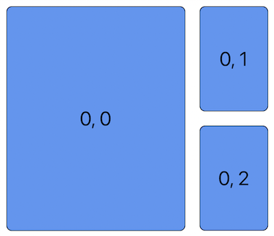

# Collection View Compositional Layout

iOS 6 引入了 [UICollectionView](https://developer.apple.com/documentation/uikit/uicollectionview#)，那个时候 collection view 的布局比较简单，基本上都是基于行列的(line-based)，称为 flow 布局 [UICollectionViewFlowLayout](https://developer.apple.com/documentation/uikit/uicollectionviewflowlayout#)，这能满足大部分的应用场景，但是随着布局越来越复杂(例如 iOS 13 更新之后的 App Store)，这个时候该怎么办呢？

一个解决方案是自定义布局(custom layout)，但是自定义布局要面临几个的挑战

- Boilerplate code
- Performance considerations
- Supplementary and decoration view challenges
- Self-sizing challenges

因此 iOS 13 提出了新的解决方案 **Compositional Layout:** [UICollectionViewCompositionalLayout](https://developer.apple.com/documentation/uikit/uicollectionviewcompositionallayout)

macOS 对应的是 [NSCollectionViewCompositionalLayout](https://developer.apple.com/documentation/appkit/nscollectionviewcompositionallayout)

## Compositional Layout

Compositional Layout 是一种组合的(composable)、灵活性的(flexible)、快速的(fast)布局方式，将开发者从自定义布局中释放出来

组合布局顾名思义，是将很多个小的布局组合在一起，形成一个完整的大布局，用组合的方式代替自定义布局，由以下四个部分组成：Item -> Group -> Section -> Layout



##### Demo—创建 Grid Layout

```swift
func createGridLayout() -> UICollectionViewLayout {
  // Item
  let itemSize = NSCollectionLayoutSize(widthDimension: .fractionalWidth(0.2),
                                         heightDimension: .fractionalHeight(1.0))
  let item = NSCollectionLayoutItem(layoutSize: itemSize)
  
  // Group
  let groupSize = NSCollectionLayoutSize(widthDimension: .fractionalWidth(1.0),
                                         heightDimension: .fractionalWidth(0.2))
  let group = NSCollectionLayoutGroup.horizontal(layoutSize: groupSize,
                                                 subitems: [item])
  // Section
  let section = NSCollectionLayoutSection(group: group)
  
  // Layout
  let layout = UICollectionViewCompositionalLayout(section: section)
  return layout
}
```



## New APIs

### [NSCollectionLayoutDimension](https://developer.apple.com/documentation/uikit/nscollectionlayoutdimension) & [NSCollectionLayoutSize](https://developer.apple.com/documentation/uikit/nscollectionlayoutsize)

定义 collection view item 的 width 和 height，有三种方式

##### absolute

固定值，以 point 为单位

```swift
let absoluteSize = NSCollectionLayoutSize(widthDimension: .absolute(44),
                                         heightDimension: .absolute(44))
```

##### estimated

预估值，用于内容大小可能会发生变化的，比如字体大小发生变化，可以用于 Self-Sizing?

```swift
let estimatedSize = NSCollectionLayoutSize(widthDimension: .estimated(200),
                                          heightDimension: .estimated(100))
```

##### fractional

定义相对于容器的比例，有 `fractionalWidth` 和 `fractionalHeight` 两种

```swift
let fractionalSize = NSCollectionLayoutSize(widthDimension: .fractionalWidth(0.2),
                                           heightDimension: .fractionalHeight(0.2))
```

### [NSCollectionLayoutItem](https://developer.apple.com/documentation/uikit/nscollectionlayoutitem)

定义单个 collection view item 的大小

```swift
 class NSCollectionLayoutItem {
   convenience init(layoutSize: NSCollectionLayoutSize)
}
```

##### contentInsets

定义 item 的 inset

##### edgeSpacing

定义 item 与别的 item 的间距

##### supplementaryItems

Item 的附属 items

### [NSCollectionLayoutGroup](https://developer.apple.com/documentation/uikit/nscollectionlayoutgroup)

Group 由一个或者多个 item 组成，有三种布局方式水平、垂直、自定义，通过 `NSCollectionLayoutSize` 确定这个 group 的大小

```swift
class NSCollectionLayoutGroup: NSCollectionLayoutItem {
   class func horizontal(layoutSize: NSCollectionLayoutSize,
   											 subitems: [NSCollectionLayoutItem]) -> Self
   class func vertical(layoutSize: NSCollectionLayoutSize,
                       subitems: [NSCollectionLayoutItem]) -> Self
   class func custom(layoutSize: NSCollectionLayoutSize,
                     itemProvider: NSCollectionLayoutGroupCustomItemProvider) -> Self
}
```

`NSCollectionLayoutGroup` 继承自 `NSCollectionLayoutItem`，因此拥有 `NSCollectionLayoutItem` 所有的属性(`layoutSize`、`contentInsets`、`edgeSpacing`、`supplementaryItems`)，同时支持 group 嵌套

`interItemSpacing` 确定同一个 group 中 item 之间的间距，支持两种方式

- fixed
- flexible

### [NSCollectionLayoutSection](https://developer.apple.com/documentation/uikit/nscollectionlayoutsection)

Section 由一个或者多个 group (因为 group 可以嵌套)组成

```swift
class NSCollectionLayoutSection {
	convenience init(layoutGroup: NSCollectionLayoutGroup)
}
```

##### orthogonalScrollingBehavior

定义 section 相对于 collection view 的滚动行为

- none，不允许正交滚动
- continuous
- continuousGroupLeadingBoudary，滚动结束时，在 group 的 leading 边缘停下
- paging
- groupPaging
- groupPagingCenter

##### interGroupSpacing

定义 group 的间距

##### contentInsets

定义 section 的 inset

#####  boundarySupplementaryItems

section 的附属 items

##### decorationItems

section 的装饰 items

### [UICollectionViewCompositionalLayout](https://developer.apple.com/documentation/uikit/uicollectionviewcompositionallayout)

Layout 由一个或者多个 section 组成，每个 section 的布局可以不一样

```swift
class UICollectionViewCompositionalLayout: UICollectionViewLayout {
	// 单个 section
  init(section: NSCollectionLayoutSection, 
       configuration: UICollectionViewCompositionalLayoutConfiguration)
  // 多个 sections
  init(sectionProvider: @escaping UICollectionViewCompositionalLayoutSectionProvider, 
       configuration: UICollectionViewCompositionalLayoutConfiguration)
}
```

#### [UICollectionViewCompositionalLayoutConfiguration](https://developer.apple.com/documentation/uikit/uicollectionviewcompositionallayoutconfiguration#)

配置 Compositional Layout

##### scrollDirection

定义 滚动方向

- vertical
- horizontal

##### interSectionSpacing

定义 section 的间距

##### boundarySupplementaryItems

layout 的附属 items

## Advanced Layouts

从前面的 API 中发现，item、group、section、layout 都能定义自己的附属 items，附属 items 可以是

- Badges
- Headers
- Footers

section 还可以定义装饰 items

### [NSCollectionLayoutSupplementaryItem](https://developer.apple.com/documentation/uikit/nscollectionlayoutsupplementaryitem)

这类附属 item，用于 item 和 group，通过 `NSCollectionLayoutSize ` 确定其大小

通过 `NSCollectionLayoutAnchor` 确定其位置

- itemAnchor，相对于 item 本身的位置
- containerAnchor，相对于容器的位置

```swift
class NSCollectionLayoutSupplementaryItem : NSCollectionLayoutItem {
  init(layoutSize: NSCollectionLayoutSize, elementKind: String, containerAnchor: NSCollectionLayoutAnchor)
 	init(layoutSize: NSCollectionLayoutSize, elementKind: String, containerAnchor: NSCollectionLayoutAnchor, itemAnchor: NSCollectionLayoutAnchor)
}
```

##### 例如设置 item 的 badge

```swift
let badgeAnchor = NSCollectionLayoutAnchor(edges: [.top, .trailing],
                                           fractionalOffset: CGPoint(x: 0.3, y: -0.3))
let badgeSize = NSCollectionLayoutSize(widthDimension: .absolute(20),
                                       heightDimension: .absolute(20))
let badge = NSCollectionLayoutSupplementaryItem(layoutSize: badgeSize,
                                                elementKind: "badge",
                                                containerAnchor: badgeAnchor)
let item = NSCollectionLayoutItem(layoutSize: itemSize, supplementaryItems: [badge])
```



### [NSCollectionLayoutBoundarySupplementaryItem](https://developer.apple.com/documentation/uikit/nscollectionlayoutboundarysupplementaryitem)

这类附属 item，用于 section 和 layout

```swift
class NSCollectionLayoutBoundarySupplementaryItem : NSCollectionLayoutSupplementaryItem {
  init(layoutSize: NSCollectionLayoutSize, elementKind: String, alignment: NSRectAlignment)
  init(layoutSize: NSCollectionLayoutSize, elementKind: String, alignment: NSRectAlignment, absoluteOffset: CGPoint)
}
```

##### pinToVisibleBounds

附属 item 是否跟着 collection view 一起滚动(false，默认值)还是一直可见

##### 例如设置 section 的 header 和 footer

```swift
let header = NSCollectionLayoutBoundarySupplementaryItem(layoutSize: headerSize,
                                                         elementKind: "header",
                                                         alignment: .top)
let footer = NSCollectionLayoutBoundarySupplementaryItem(layoutSize: footerSize,
                                                         elementKind: "footer",
                                                         alignment: .bottom)
header.pinToVisibleBounds = true
section.boundarySupplementaryItems = [header, footer]
```




### [NSCollectionLayoutDecorationItem](https://developer.apple.com/documentation/uikit/nscollectionlayoutdecorationitem)

装饰 items 用于 section，目前只有一个方法就是设置 section 的背景

```swift
class NSCollectionLayoutDecorationItem : NSCollectionLayoutItem {
  class func background(elementKind: String) -> Self
}
```

##### 例如设置 section 的背景图

```swift
let sectionBackground = NSCollectionLayoutDecorationItem.background(
  elementKind: "background")
section.decorationItems = [sectionBackground]

// 注册 decoration view
let layout = UICollectionViewCompositionalLayout(section: section)
layout.register(
    SectionBackgroundDecorationView.self,
    forDecorationViewOfKind: "background"
)
```



### Nested Group

话不多说上代码

```swift
func createLayout() -> UICollectionViewLayout {
  let layout = UICollectionViewCompositionalLayout { (sectionIndex: Int, layoutEnvironment: NSCollectionLayoutEnvironment) -> NSCollectionLayoutSection? in                                                                                          
    let leadingSize = NSCollectionLayoutSize(widthDimension: .fractionalWidth(0.7),
                                      heightDimension: .fractionalHeight(1.0))
    let leadingItem = NSCollectionLayoutItem(layoutSize: leadingSize)
    leadingItem.contentInsets = NSDirectionalEdgeInsets(top: 10, leading: 10, bottom: 10, trailing: 10)

    let trailingSize = NSCollectionLayoutSize(widthDimension: .fractionalWidth(1.0),
                                             heightDimension: .fractionalHeight(0.3))                                                  
    let trailingItem = NSCollectionLayoutItem(layoutSize: trailingSize)
    trailingItem.contentInsets = NSDirectionalEdgeInsets(top: 10, leading: 10, bottom: 10, trailing: 10)

    let trailingGroup = NSCollectionLayoutGroup.vertical(
                  layoutSize: NSCollectionLayoutSize(widthDimension: .fractionalWidth(0.3),
                                                    heightDimension: .fractionalHeight(1.0)),
                  subitem: trailingItem, count: 2)

    // nested group
    let nestedGroup = NSCollectionLayoutGroup.horizontal(
                  layoutSize: NSCollectionLayoutSize(widthDimension: .fractionalWidth(1.0),
                                                    heightDimension: .fractionalHeight(0.4)),
                  subitems: [leadingItem, trailingGroup])
    let section = NSCollectionLayoutSection(group: nestedGroup)
    return section
  }
  return layout
}
```



## Reference

- Sample Code

[Implementing Modern Collection Views](https://developer.apple.com/documentation/uikit/views_and_controls/collection_views/implementing_modern_collection_views)

- WWDC 2019 Session 215

[Advances in Collection View Layout](https://wwdc.io/share/wwdc19/215)

