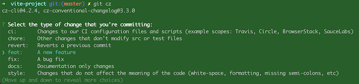
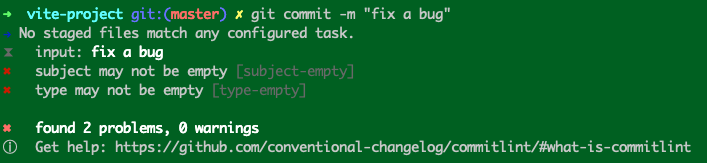
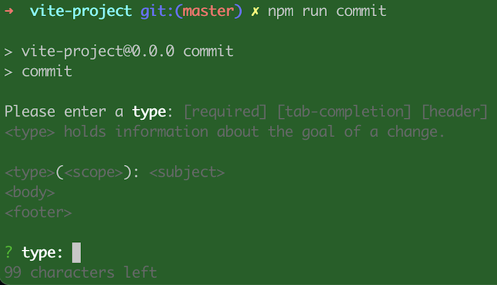

# 规范化 Commit Message

我们知道，git 每次提交代码，都要写 commit message，否则就不允许提交。例如

```sh
$ git commit -m "hello world"
```

如果一行不够，可以只执行`git commit`，就会跳出文本编辑器，让你写多行。

```sh
$ git commit
```

基本上，你写什么都行。但是在一个多人协作的项目中，我们还是需要规范化我们的 commit message。

## Commit message 的作用

规范化的 commit message，有什么好处呢？

1. 提供更多的历史信息，方便快速浏览

例如，运行下面的命令显示上次发布后的变动，每个 commit 占据一行，你只看行首，就知道某次 commit 的目的。

```sh
$ git log <last tag> HEAD --pretty=format:%s
```

2. 以过滤某些 commit，便于快速查找信息

例如，下面的命令仅仅显示本次发布新增加的功能。

```bash
$ git log <last release> HEAD --grep feature
```

3. 可以直接从 commit 生成 change log

Change log 是发布新版本时，用来说明与上一个版本差异的文档。下面会详细介绍

## Commit message 的格式

根据 [Conventional Commits](https://www.conventionalcommits.org/en/v1.0.0/)，commit message 有三个部分组成，header, body 和 footer(s)

```sh
<type>[optional scope]: <description>
// 空一行
[optional body]
// 空一行
[optional footer(s)]
```

这里只有 header 是必选的，body 和 footer 是可选的，footer 可以有多个。

### Message Header

Header 部分只有一行，包括三个字段：`type`、`scope` 和 `description`，其中 `scope` 是可选的。

#### Type

**必须**，`type` 用于说明 commit 的类别， [Conventional Commits ](https://www.conventionalcommits.org/en/v1.0.0/) 主要定义了两种类型，对应于版本好的管理 [Semantic Versioning](https://semver.org/)。

- **feat**: 增加新功能，对应 **MINOR**
- **fix**: 修复 bug，对应 **PATCH**

其它类型可以根据自己的项目，自由添加

[Angular Commit Message Guidelines](https://github.com/angular/angular/blob/22b96b9/CONTRIBUTING.md#-commit-message-guidelines) 定义了下面十种 type

- **feat**: 增加新功能
- **fix**: 修复 bug
- **build**: 更改构建系统或外部依赖(例如：gulp, broccoli, npm)
- **ci**: 更改CI配置文件和脚本(例如：Travis, Circle, BrowserStack, SauceLabs)
- **docs**: 更改文档
- **perf**: 提高性能的修改
- **refactor**: 重构，但是即不是新增功能，也不是修复 bug
- **style**: 修改格式或样式，但是不会影响代码的运行(例如：删除空白、添加分号等)
- **test**: 添加测试
- **chore**:  其它不修改 src 或测试文件的更改

#### Scope

**可选**，用于说明 commit 影响的范围，比如数据层、控制层、视图层等等，视项目不同而不同

#### Description

**必须**，是 commit 目的的简短描述

在 Angular 规范中，这一部分定义为 `subject` ，有以下规则

- 以动词开头，使用第一人称现在时，比如 `change`，而不是 `changed` 或 `changes`
- 第一个字母小写
- 结尾不加句号（`.`）

### Message Body

**可选**，是对本次 commit 的详细描述，可以分成多行

- 使用第一人称现在时，比如使用 `change` 而不是 `changed` 或 `changes`。

- 应该说明代码变动的动机，以及与以前行为的对比。

### Message Footer

**可选**，可以存在多个。有两种类型的 footer

#### BREAKING CHANGE

不兼容的变动，对应 [Semantic Versioning](https://semver.org/) 的 **MAJOR**，例如

```
BREAKING CHANGE: `extends` key in config file is now used for extending other config files
```

对应不兼容的变动，也可以通过在 type(scope) 后面添加一个 `!` 进行表示，适用于任意 type。例如

```
feat(api)!: send an email to the customer when a product is shipped
```

#### 其它

其它的 footer 视项目情况而定，其规范类似于 [git trailer format](https://git-scm.com/docs/git-interpret-trailers)，一般格式如下：

```
<word token>: <descrption>
# 或者
<word token># <descrption>
```

`word token` 多个单词中间用连词符，比如 `Acked-by`

`descrption `可以有多行

下面是 footer 的例子

```
Reviewed-by: Z
Refs: #123
```

#### 关闭 issues

Angular 规范还定义了一种footer，就是关闭 issues，使用 `Closes` 关键字，例如

```
Closes #123, #245, #992
```

### revert

还有一种特殊情况，如果当前 commit 用于撤销以前的 commit，则必须以 `revert:` 开头，后面跟着被撤销 commit 的 header。body 部分的格式是固定的，必须写成 `This reverts commit <hash>.`，其中的 `hash` 被撤销 commit 的 SHA 标识符。例如

```
revert: feat(pencil): add 'graphiteWidth' option

This reverts commit 667ecc1654a317a13331b17617d973392f415f02.
```

如果当前 commit 与被撤销的 commit，在同一个发布（release）里面，那么它们都不会出现在 change log 里面。如果两者在不同的发布，那么当前 commit，会出现在 change log 的 `Reverts` 小标题下面。

### Specification

更加详细的规范与建议可以参考 Conventional Commits 的 [Specification](https://www.conventionalcommits.org/en/v1.0.0/#specification) 与 [FAQ](https://www.conventionalcommits.org/en/v1.0.0/#faq)

## Commitizen

[Commitizen](https://github.com/commitizen/cz-cli) 是一个引导我们提交规范化 commit message 的工具。Commitizen 采用 [Angular Commit Message Guidelines](https://github.com/angular/angular/blob/22b96b9/CONTRIBUTING.md#-commit-message-guidelines).

### 安装

首先全局安装 Commitizen CLI 工具

```sh
$ npm install -g commitizen
```

然后，在项目里，运行下面的命令安装 [cz-conventional-changelog](https://github.com/commitizen/cz-conventional-changelog)，使其支持 [Angular Commit Message Guidelines](https://github.com/angular/angular/blob/22b96b9/CONTRIBUTING.md#-commit-message-guidelines).

```bash
$ commitizen init cz-conventional-changelog --save-dev --save-exact

# yarn install
$ commitizen init cz-conventional-changelog --yarn --dev --exact
```

这个命名除了安装 `cz-conventional-changelog` 依赖以外，也在  `package.json` 文件里添加了 `config.commitizen` 配置项

```json
"config": {
  "commitizen": {
    "path": "./node_modules/cz-conventional-changelog"
  }
}
```

这个配置项也可以写在一个 `.czrc` 文件里，详细的配置可以参考 [cz-conventional-changelog](https://github.com/commitizen/cz-conventional-changelog).

### 全局使用

在提交 commit 的时候用 `git cz` 代替 `git commit`，它就会一步一步引导你输入规范化 commit message。



### 本地使用

本地使用的好处是保证团队所有的开发者运行相同版本的 Commitizen. 

首先本地安装 Commitizen CLI 工具

```bash
$ npm install commitizen -D
```

然后，本地安装 [cz-conventional-changelog](https://github.com/commitizen/cz-conventional-changelog)

```bash
$ npx commitizen init cz-conventional-changelog --save-dev --save-exact
```

最后在 `package.json` 文件里添加 npm 脚本

```json
"scripts": {
  "cz": "cz"
}
```

或者使用下面的命令添加

```bash
$ npm set-script cz cz
```

现在提交 commit 的时候用 `npx run cz` 代替 `git commit`

### 配合 husky 使用

上面的方法对于不了解 Commitizen 的开发者并不友好，他们可能不知道用 `npx run cz` 代替 `git commit`。最好的方式是当他们使用 `git commit` 就能调用Commitizen，出现引导页。这个可以通过 [husky](https://www.npmjs.com/package/husky) 来实现。

> 前提条件是在本地安装 Commitizen CLI 工具

首先安装 [husky](https://www.npmjs.com/package/husky)

```bash
$ npm install husky -D
```

然后运行 hasky

``` bash
$ npx husky install
# 或者
$ npm set-script prepare "husky install"
$ npm run prepare
```

最后配置 Commitizen

```bash
$ npx husky add .husky/prepare-commit-msg "exec < /dev/tty && npx cz --hook || true"
```

当我们运行 `git commit` 就会弹出引导页

### Adapter

除了 [cz-conventional-changelog](https://www.npmjs.com/package/cz-conventional-changelog) 还有很多第三方的引导[适配器](https://github.com/commitizen/cz-cli#adapters)，比如 [cz-emoji](https://github.com/ngryman/cz-emoji)，有兴趣地可以去试试看。

## commitlint

[Commitizen](https://github.com/commitizen/cz-cli) 是引导开发者提交规范化 commit message，而 [commitlint](https://github.com/conventional-changelog/commitlint) 则是校验 commit message 是否规范化。

`commitlint ` 支持多个 scope，可以用 `"/"`、`"\"`、 `"," ` 进行分隔。

### 安装

```bash
$ npm install -D @commitlint/cli @commitlint/config-conventional

$ echo "module.exports = {extends: ['@commitlint/config-conventional']}" > commitlint.config.js
```

`@commitlint/cli` 就是 [commitlint](https://github.com/conventional-changelog/commitlint) 校验工具，[`@commitlint/config-conventional`](https://github.com/conventional-changelog/commitlint/tree/master/%40commitlint/config-conventional) 定义了默认的验证规则。除了这个还有很多的 [共享配置](https://github.com/conventional-changelog/commitlint#shared-configuration)。

`commitlint.config.js` 是 commitlint 的配置文件，使用 `@commitlint/config-conventional` 定义的默认配置，但是用户可以修改。

### 配置 husky

`husky` 安装和上面 [配合 husky 使用](#配合-husky-使用) 一样，然后配置 `husky` `commit-msg`

```bash
$ npx husky add .husky/commit-msg 'npx --no -- commitlint --edit $1'
```

### 使用

当我们提交不规范的 commit message 的时候，`commitlint` 就会拒绝我们的提交。



### 引导

`commitlint` 也提供了类似于 `Commitizen` 的引导功能，有两种方式

#### @commitlint/prompt-cli

[@commitlint/prompt-cli](https://github.com/conventional-changelog/commitlint/tree/master/%40commitlint/prompt-cli) 是一个 cli 工具，提供了类似 `Commitizen` 的引导功能。

```bash 
# 安装
$ npm install --save-dev @commitlint/prompt-cli

# 添加 script
$ npm set-script commit commit

# 运行
npm run commit
```

运行效果图



从上面这个图，我们可以看到这个效果是不如 `Commitizen` 的

#### Commitizen 适配器

`commitlint` 提供了两个适配器用来替换 [cz-conventional-changelog](https://github.com/commitizen/cz-conventional-changelog)

- [`@commitlint/prompt`](https://github.com/conventional-changelog/commitlint/tree/master/@commitlint/prompt) 提供类似于 `@commitlint/prompt-cli` 的功能
- [`@commitlint/cz-commitlint`](https://github.com/conventional-changelog/commitlint/tree/master/@commitlint/cz-commitlint) 类似于 `cz-conventional-changelog`

### 自定义配置

`commitlint` 可以通过修改 `commitlint.config.js` 进行自定义的配置，包括 [Shareable configuration](https://commitlint.js.org/#/concepts-shareable-config)、[Rules](https://commitlint.js.org/#/reference-rules) 和 [Plugins](https://commitlint.js.org/#/reference-plugins)

### CI 设置

通过上面的配置，可以能保障在项目里提交 commit 的时候，通过 `commitlint` 拒绝不规范的 message，但是如果不在项目里提交呢，比如在源码托管服务里提交 commit 呢？这个时候就需要进行 [CI 设置](https://commitlint.js.org/#/guides-ci-setup).

## 生成 Change Log

[conventional-changelog-cli](https://github.com/conventional-changelog/conventional-changelog/tree/master/packages/conventional-changelog-cli) 是一个根据你的 commit messag 自动生成 change log 的工具

### 安装

```bash
$ npm install -g conventional-changelog-cli
```

### 使用

生成自上次 tag 之后的 change log，包括 "Feature", "Fix", "Performance Improvement" 和 "Breaking Changes".

```bash
# 全局安装，也可以本地安装
$ conventional-changelog -p angular -i CHANGELOG.md -s
```

第一次使用，生成所有的 change log

```bash
$ conventional-changelog -p angular -i CHANGELOG.md -s -r 0
```

查看所有参数

```bash
$ conventional-changelog --help
```

- -p 指定预设的名称，必须是这些 angular, atom, codemirror, conventionalcommits, ember, eslint, express, jquery 或者 jshint
- -i 输入的文件名
- -s 输入和输出同名
- -r 生成最新多少版本的变更日志（默认值：1），如果是0，则生成整个变更日志，并覆盖输出文件。

### 推荐的工作流程

1. 修改代码
2. commit
3. bump `package.json` 的版本号
4. 运行 conventional-changelog 生成变更日志
5. commit  `package.json` 和 `CHANGELOG.md`
6. tag
7. push

#### 使用  `npm version`

使用  `npm version`，可以简化流程，首页添加下面脚本

```json
{
  "scripts": {
    "version": "conventional-changelog -p angular -i CHANGELOG.md -s && git add CHANGELOG.md"
  }
}
```

然后执行下面的流程

1. 修改代码
2. commit
3. pull 所有的 tags
4. 运行 [`npm version [patch|minor|major]`](https://docs.npmjs.com/cli/version)
5. push

最后还可以通过设置  `.npmrc` 文件，自动化你的提交消息，并设置 tag 前缀

```
tag-version-prefix=""
message="chore(release): %s :tada:"
```

## standard-version

[standard-version](https://github.com/conventional-changelog/standard-version) 是一个自动修改版本号（bump version）、生成 tag 以及生成 change log 的工具，可以替换 [`npm version`](https://docs.npmjs.com/cli/version)

`standard-version` 使用预设的 [conventionalcommits](https://github.com/conventional-changelog/conventional-changelog/tree/master/packages/conventional-changelog-conventionalcommits)，遵循 [conventionalcommits.org](https://www.conventionalcommits.org/) 规范，可配，具体配置选项请参考 [conventional-changelog-config-spec](https://github.com/conventional-changelog/conventional-changelog-config-spec)。

### 安装

```bash
# 本地安装
$ npm install standard-version -D
# 添加一个脚本
$ npm set-script release standard-version
```

### 使用

1. 修改代码
2. commit
3. 运行 `standard-version`

```bash
$ npm run release
```

剩下的事 `standard-version` 全帮你做完了

1. bump `package.json` 和 `package-lock.json`  的版本号
2. 生成了变更日志 `CHANGELOG.md`
3. commit  `package.json` 、`package-lock.json`  和 `CHANGELOG.md`。commit message 格式是 `chore(release): #version`
4. 生成了新的 tag，默认前缀是 "#"，可以通过 `-t` 进行修改

第一次 release，运行下面的命令

```bash
npm run release -- --first-release
```

更多的操作，可以运行 `standard-version --help` 或者参考 [官方文档](https://github.com/conventional-changelog/standard-version)。

## semantic-release

[semantic-release](https://github.com/semantic-release/semantic-release) 和 [standard-version](https://github.com/conventional-changelog/standard-version) 一样，是一个自动修改版本号（bump version）、生成 tag 以及生成 change log 的工具。此外它还能 publish release 包等 [其它功能](https://github.com/semantic-release/semantic-release#highlights)。要搭配 CI 一起使用。

这部分内容等我学习完 CI 再回过头来写。

## References

- [Conventional Commits](https://www.conventionalcommits.org/en/v1.0.0/)
- [Angular Commit Message Guidelines](https://github.com/angular/angular/blob/22b96b9/CONTRIBUTING.md#-commit-message-guidelines)
- [`commitizen/cz-cli`](https://github.com/commitizen/cz-cli)
- [`conventional-changelog/commitlint`](https://github.com/conventional-changelog/commitlint)
- [`conventional-changelo/conventional-changelog`](https://github.com/conventional-changelog/conventional-changelog) 
- [`conventional-changelog/standard-version`](https://github.com/conventional-changelog/standard-version)
- [`semantic-release/semantic-release`](https://github.com/semantic-release/semantic-release)
- [Commit message 和 Change log 编写指南](https://www.ruanyifeng.com/blog/2016/01/commit_message_change_log.html)
- [Gitmoji Commit Workflow 完全指南](https://www.yuque.com/arvinxx-fe/workflow/gitmoji-commit-workflow)
- [`ngryman/cz-emoji`](https://github.com/ngryman/cz-emoji)
- [`carloscuesta/gitmoji`](https://github.com/carloscuesta/gitmoji)