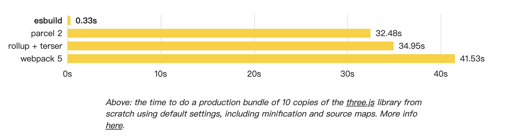

# 使用 Vite 搭建 Web 项目

[Vite](https://cn.vitejs.dev/) 是 Vue 团队最新推出的新型前端构建工具，能够显著提升前端开发体验。它主要由两部分组成：

- 一个开发服务器，它基于 [原生 ES 模块](https://developer.mozilla.org/en-US/docs/Web/JavaScript/Guide/Modules) 提供了 [丰富的内建功能](https://cn.vitejs.dev/guide/features.html)，如速度快到惊人的 [模块热更新（HMR）](https://cn.vitejs.dev/guide/features.html#hot-module-replacement)。
- 一套构建指令，它使用 [Rollup](https://rollupjs.org/) 打包你的代码，并且它是预配置的，可输出用于生产环境的高度优化过的静态资源。

想要了解更多详情请看 [Vite官网](https://cn.vitejs.dev/)

Vite 给我的直观感受就是开发时的快速构建，它使用了 [esbuild](https://esbuild.github.io/) [预构建依赖](https://cn.vitejs.dev/guide/dep-pre-bundling.html)，因此比 [webpack](https://webpack.js.org/) 快很多很多。

下面是从 [esbuild官网](https://esbuild.github.io/) 上截取的图

Vite 和 Vue-CLI 都是 Vue 团队开发的，只是 Vite 使用 esbuild + Rollup，而 Vue-CLI 使用 webpack。因此里面的很多配置是相似的，比如说 [环境变量和模式](https://cn.vitejs.dev/guide/env-and-mode.html)。我之前也写过一篇 [Vue-CLI 搭建 Web 框架配置工具](./2020-12-15-vue-cli-tools)，里面很多的工具也适用于 Vite 工程， 大家有兴趣可以去看看。

## 创建项目

