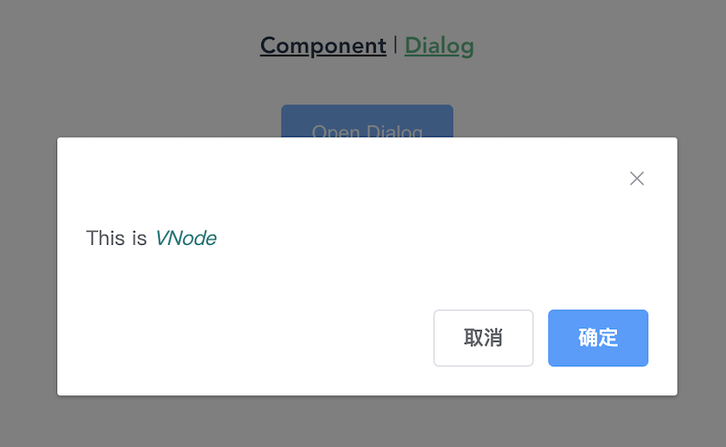

# ElementUI 以函数的方式打开 Dialog

我们知道 [ElementUI](https://element.eleme.cn/#/zh-CN) 有一个 [MessageBox](https://element.eleme.cn/#/zh-CN/component/message-box) 的组件，提供了[全局方法](https://element.eleme.cn/#/zh-CN/component/message-box#quan-ju-fang-fa)打开消息弹框，但是 [Dialog](https://element.eleme.cn/#/zh-CN/component/dialog) 却没有提供这样的方法，这篇文章我们来研究一下怎样以函数的方式打开对话框。

> Vue 2.6.14 + ElementUI 2.15.14

## 现状

一般我们都是这样使用 dialog：首先新建一个文件，自定义 dialog，然后在页面代码里引入这个自定义 dialog，通过 `visible ` 属性控制打开或者关闭 dialog，可能还需要定义处理 `confirm` 或者 `cancel` 的方法。

自定义 dialog

```vue
<!-- CustomDialog.vue -->
<template>
  <el-dialog title="提示" :visible.sync="dialogVisible" width="30%">
    <span>这是一段信息</span>
    <span slot="footer" class="dialog-footer">
      <el-button @click="cancel">取 消</el-button>
      <el-button type="primary" @click="confirm">确 定</el-button>
    </span>
  </el-dialog>
</template>

<script>
export default {
  props: {
    visible: {
      type: Boolean,
      default: false,
    },
  },
  computed: {
    dialogVisible: {
      get() {
        return this.visible;
      },
      set(newVal) {
        this.$emit("update:visible", newVal);
      },
    },
  },
  methods: {
    cancel() {
      this.$emit("cancel");
    },
    confirm() {
      this.$emit("confirm");
    },
  },
};
</script>
```

使用 dialog

```vue
<template>
  <div class="Dialog">
    <el-button type="primary" size="default" @click="openDialog">Open Dialog</el-button>
    <CustomDialog
      :visible.sync="visible"
      @confirm="handleConfirm"
      @cancel="handleCancel"></CustomDialog>
  </div>
</template>

<script>
import CustomDialog from "@/components/CustomDialog.vue";
export default {
  components: {
    CustomDialog,
  },
  data() {
    return {
      visible: false,
    };
  },
  methods: {
    openDialog() {
      this.visible = true;
    },
    handleConfirm() {
      // 处理确认事件
      this.visible = false;
    },
    handleCancel() {
      // 处理取消事件
      this.visible = false;
    },
  },
};
</script>
```

从上面的代码我们可以看到，一个 dialog，相应地有一个 `visible` 属性和 `handleConfirm`、`handleCancel` 两个方法，随着 dialog 越来越多，这个页面的代码就越来越不好阅读希望像 `this.$confirm` 一样以函数的方式打开 dialog，以 Promise 的方式来处理 `confirm/cancel`，像下面这样：

```js
this.$showDialog(options).then().catch()
```

这样展示 dialog 和处理 dialog 的逻辑在同一个地方，业务逻辑比较清晰，且无需额外定义控制属性和处理方法。

## 组件

平常我们都是通过 Vue 模板创建组件的，其实 Vue 还提供了很多种方式来创建组件，下面我们来看看

###  Vue 模板

这个是我们常用创建组件的方式

```vue
<template>
  <div>
    <div>Vue 模板组件</div>
    <el-button type="primary" @click="increase"> You clicked me {{ count }} times. </el-button>
  </div>
</template>

<script>
export default {
  name: "FileCounter",
  data() {
    return {
      count: 0,
    };
  },
  methods: {
    increase() {
      this.count += 1;
    },
  },
};
</script>
```

### Template 字符串

通过 Template 字符串也可以创建组件，Vue 官网上大部分例子都是通过 Template 字符串来创建组件的

```js
export default {
  data() {
    return {
      count: 0,
    };
  },
  methods: {
    increase() {
      this.count += 1;
    },
  },
  template:
    '<div><div>Template字符串组件</div><el-button type="primary" @click="increase">You clicked me {{ count }} times.</el-button></div>',
};
```

> 也可以使用 ID 选择器来指向一个元素，例如：`template: '#my-template-element'`

### `render` 函数 

在实际应用中基本上不会使用 Template 字符串来创建组件，因为代码不好阅读、不好调试、不好维护，除了 Vue 模板创建组件外，另一种常用的方式就是使用 `render` 函数，让你拥有 JavaScript 的完全编程的能力。

`render` 函数通过 `createElement` 来创建 **VNode**，其实不管是 Vue 模版还是 Template 字符串最终都会被编译为 `createElement`，最后创建 **VNode**

```js
export default {
  data() {
    return {
      count: 0,
    };
  },
  methods: {
    increase() {
      this.count += 1;
    },
  },
  render(createElement) {
    return createElement("div", [
      createElement("div", "Render函数组件"),
      createElement(
        "el-button",
        {
          props: {
            type: "primary",
          },
          on: {
            click: this.increase,
          },
        },
        `You clicked me ${this.count} times.`,
      ),
    ]);
  },
};
```

### JSX

从上面的例子中，我们看到 `createElement` API 比较繁琐，如果你既想拥有 JavaScript 的完全编程的能力，又想代码简洁，可以使用 JSX，类似于 React。[Vue-CLI](https://cli.vuejs.org/zh/) 提供了开箱即用的 JSX 支持，如果你使用的是别的工具，比如 Webpack，则需要安装一个 [Babel 插件](https://github.com/vuejs/jsx)。

```jsx
export default {
  data() {
    return {
      count: 0,
    };
  },
  methods: {
    increase() {
      this.count += 1;
    },
  },
  render() {
    return (
      <div>
        <div>JSX组件</div>
        <el-button type="primary" onClick={this.increase}>
          You clicked me {this.count} times.
        </el-button>
      </div>
    );
  },
};
```

可以看出代码如 Vue 模板一样简洁，有点类似 React Class 组件

## 手动创建组件实例

以函数的方式打开对话框需要手动创建组件实例，有两种方式：

1. `new Vue()`

```js
const instance = new Vue({
  render: h => h(Component),
})
```

2. `Vue.extend()`

```js
const CustomDialogConstructor = Vue.extend(CustomDialog);
const instance = new CustomDialogConstructor();
```

因为第二种方式更加简洁，所以这里使用第二种方式

## 实现

首先我们定义个通用的 dialog，可以自定义标题、内容、底部按钮

```vue
<!-- CommonDialog.vue -->
<template>
  <el-dialog :title="title" :visible.sync="dialogVisible" width="30%" destroy-on-close>
    <slot></slot>
    <span slot="footer" class="dialog-footer">
      <el-button
        v-for="button in buttons"
        :key="button.action"
        :type="button.type"
        @click="click(button)">
        {{ button.text }}
      </el-button>
    </span>
  </el-dialog>
</template>

<script>
export default {
  props: {
    visible: {
      type: Boolean,
      default: false,
    },
    // 标题
    title: {
      type: String,
      default: "",
    },
    // 是否自动关闭
    autoClose: {
      type: Boolean,
      default: true,
    },
    // 点击按钮的回调
    callback: {
      type: Function,
    },
    // 底部按钮数组
    buttons: {
      type: Array,
      default() {
        return [
          {
            action: "cancel",
            text: "取消",
            type: "default",
          },
          {
            action: "confirm",
            text: "确定",
            type: "primary",
          },
        ];
      },
    },
  },
  computed: {
    dialogVisible: {
      get() {
        return this.visible;
      },
      set(newVal) {
        this.$emit("update:visible", newVal);
      },
    },
  },
  methods: {
    click(button) {
      if (this.autoClose) {
        this.close();
      }
      this.callback?.({
        action: button.action,
      });
    },
    close() {
      this.dialogVisible = false;
    },
  },
};
</script>
```

然后定义函数来打开 dialog

```js
import CommonDialog from "@/components/CommonDialog";
import Vue from "vue";

export const showDialog = (options, vnode) => {
  const CommonDialogConstructor = Vue.extend(CommonDialog);
  let instance = new CommonDialogConstructor();
  for (const prop in options) {
    if (Object.hasOwn(options, prop)) {
      instance.prop = options[prop];
    }
  }
  if (vnode) {
    instance.$slots.default = [vnode];
  }
  instance.$mount();
  document.body.appendChild(instance.$el);
  instance.$once("update:visible", newVal => {
    if (!newVal) {
      instance.$destroy();
      document.body.removeChild(instance.$el);
      instance = null;
    }
  });
  Vue.nextTick(() => {
    instance.visible = true;
  });
  return new Promise((resolve, reject) => {
    instance.callback = res => {
      if (res.action !== "cancel") {
        resolve({
          ...res,
          instance,
        });
      } else {
        reject({
          ...res,
          instance,
        });
      }
    };
  });
};
```

添加为全局方法

```js
import { showDialog } from "@/utils";
Vue.prototype.$showDialog = showDialog;
```

最后我来看看使用效果

```js
async openDialog() {
  try {
    const h = this.$createElement;
    const res = await this.$showDialog({ autoClose: true }, [
      h("span", "This is "),
      h("i", { style: "color: teal" }, "VNode"),
    ]);
    console.log(res.action);
  } catch (res) {
    console.log(res.action);
  }
}
```



## Demo

[elementui-dialog-demo](https://gitee.com/cp3hnu/web-demo/tree/master/elementui-dialog-demo)

## References

- [ElementUI](https://element.eleme.cn/#/zh-CN)
- [渲染函数 & JSX](https://v2.cn.vuejs.org/v2/guide/render-function.html)
- [`jsx-vue2`](https://github.com/vuejs/jsx-vue2)
- [Message-Box 源码](https://github.com/ElemeFE/element/blob/dev/packages/message-box/src/main.js)
- [封装一个函数式调用的el-dialog弹窗组件](https://blog.csdn.net/weixin_48502947/article/details/135352961)
- [更优雅的方式使用element的el-dialog](https://juejin.cn/post/6980916501314289678)


