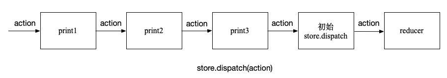

# Redux 学习笔记

Redux 是 JavaScript 应用的状态容器，提供可预测的状态管理。一般用于 React 项目中，用于实现全局状态管理。

## Redux Core

首先我们介绍 Redux 的核心概念

### 安装

```sh
# NPM
$ npm install redux

# Yarn
$ yarn add redux
```

### 使用 Redux

下面是使用 Redux 的基本流程

```js
// 1. 创建 Reducer
const bankReducer = (state = 0, action) => {
  switch (action.type) {
    case 'deposit':
      return state + action.payload
    case 'withdraw':
      return state - action.payload
    default:
      return state
  }
}

// 2. 创建 Store
import { createStore } from 'redux'
const store = createStore(bankReducer)

// 3. Dispatch，相当于向 Store 发送一个事件
button.addEventListener('click', () => {
  store.dispatch({ type: 'deposit', payload: 10 })
})

// 4. 订阅状态变化
store.subscribe(() => {
  // 5. 获取 state，修改元素值
  const state = store.getState()
  label.innerHTML = store.getState().toString()
})
```

### 数据流

一张图胜过千言万语


### 核心概念

#### Reducer

**reducer** 是一个函数，接收当前的 `state` 和一个 `action` 对象，然后返回新状态。函数签名是：`(state, action) => newState`。 **你可以将 reducer 视为一个事件监听器，它根据接收到的 action 类型处理事件。**

```js
const bankReducer = (state = 0, action) => {
  switch (action.type) {
    case 'deposit':
      return state + action.payload
    case 'withdraw':
      return state - action.payload
    default:
      return state
  }
}
```

#### Action

**action** 是一个具有 `type` 字段的普通 JavaScript 对象。**你可以将 action 视为描述应用程序中发生了什么的事件**。

`type` 字段是一个字符串，给这个 action 一个描述性的名字，action 对象可以有其它字段，其中包含有关发生的事情的附加信息。例如，我们将该信息放在名为 `payload` 的字段中。action 对象采用 [Flux Standard](https://redux.js.org/tutorials/fundamentals/part-7-standard-patterns#flux-standard-actions)。

```js
{ type: 'deposit', payload: 10 }
```

#### Store

当前 Redux 应用的状态存在于一个名为 **Store** 的对象中，通过传入一个 reducer 来创建的 store。

```js
const store = createStore(bankReducer)
```

**Store** 对象有三个方法：

#### `getState`

获取当前的 state

```js
store.getState()
```

#### `dispatch`

**更新 state 的唯一方法是调用 `dispatch()` 并传入一个 action 对象**。 store 将执行 reducer 函数并计算出更新后的 state. 

```js
store.dispatch({ type: 'deposit', payload: 10 })
```

**dispatch 一个 action 可以形象的理解为 "触发一个事件"**。

#### `subscribe`

通过 `subscribe` 添加一个监听器，当 state 发生变化时，会触发这个监听器。你可以在监听器里调用 `getState()` 获取当前 state。在 React 项目中可以执行 `render` 来重绘组件。

```js
store.subscribe(() => {
  const state = store.getState()
})
```

#### Action Creator

**action creator** 是一个创建并返回一个 action 对象的函数。它的作用是让你不必每次都手动编写 action 对象：

```js
const addTodo = text => {
  return {
    type: 'todos/todoAdded',
    payload: text
  }
}
```

#### Selector

**Selector** 函数可以从 store 状态树中提取指定的片段。随着应用变得越来越大，会遇到应用程序的不同部分需要读取相同的数据，selector 可以避免重复这样的读取逻辑。

```js
const todoList = state => state.todos
```

### Combining Reducers

当一个 Redux 项目越来越大时，需要根据 state 树中不同的部分将 reducer 分割成很多个小的 reducer。每个小的 reducer 负责更新 state 树中的一部分内容。然后通过 [**`combineReducers`**](https://redux.js.org/api/combinereducers) 合并成  root reducer。

作为对比下面是没有使用  `combineReducers` 的代码

```js
import todosReducer from './features/todos/todosSlice'
import filtersReducer from './features/filters/filtersSlice'

export default function rootReducer(state = {}, action) {
  // always return a new object for the root state
  return {
    // the value of `state.todos` is whatever the todos reducer returns
    todos: todosReducer(state.todos, action),
    // For both reducers, we only pass in their slice of the state
    filters: filtersReducer(state.filters, action)
  }
}

const store = createStore(rootReducer)
```

使用  **`combineReducers`**  大大减少了样板代码

```js
import { combineReducers } from 'redux'

import todosReducer from './features/todos/todosSlice'
import filtersReducer from './features/filters/filtersSlice'

const rootReducer = combineReducers({
  todos: todosReducer,
  filters: filtersReducer
})

const store = createStore(rootReducer)
```

### Enhancers

增强器，通过替换 Store 对象的 `dispatch`、`getState` 和 `subscribe` 方法，对 Store 进行一些额外的操作，比如想在每次 dispatch 时，输出 action 日志

>  增强器的函数签名是： `(createStore) => (rootReducer, preloadedState, enhancers) => new Store`

```js
const logOnDispatch = (createStore) => (rootReducer, preloadedState, enhancers) => {
  const store = createStore(rootReducer, preloadedState, enhancers)

  function newDispatch(action) {
    const result = store.dispatch(action)
    console.log(action)
    return result
  }

  return { ...store, dispatch: newDispatch }
}

// 然后在创建 Store 时，将 enhancer 传入第三个参数上
const store = createStore(rootReducer, undefined, logOnDispatch)
// 如果没有初始值 `preloadedState`，可以将 enhancer 传入第二个参数上
const store = createStore(rootReducer, logOnDispatch)
```

或者每次获取 state 时，添加额外的属性 `meaningOfLife`

```js
const includeMeaningOfLife = (createStore) => (rootReducer, preloadedState, enhancers) => {
  const store = createStore(rootReducer, preloadedState, enhancers)

  function newGetState() {
    return {
      ...store.getState(),
      meaningOfLife: 42,
    }
  }

  return { ...store, getState: newGetState }
}
```

#### `compose`

如果同时添加多个 enhancer 怎么办呢？Redux 提供了 [**`compose`**](https://redux.js.org/api/compose) 方法

```js
import { compose } from 'redux'

const composedEnhancer = compose(logOnDispatch, includeMeaningOfLife)
const store = createStore(rootReducer, undefined, composedEnhancer)
```

### Middleware

Redux middleware 在 dispatch action 和 action 到达 reducer 之间提供了一个第三方扩展。我们可以使用 Redux middleware 进行日志记录、崩溃报告、异步 API 请求、路由等。和 reducer 不一样，middleware 可以有 [side effects](https://redux.js.org/tutorials/fundamentals/part-6-async-logic#redux-middleware-and-side-effects)。

#### `applyMiddleware`

Redux 通过 [`applyMiddleware`](https://redux.js.org/api/applymiddleware) 将多个 middleware 合成一个 enhancer

**定义 middleware**

```js
export const print1 = (storeAPI) => (next) => (action) => {
  console.log('1')
  return next(action)
}

export const print2 = (storeAPI) => (next) => (action) => {
  console.log('2')
  return next(action)
}

export const print3 = (storeAPI) => (next) => (action) => {
  console.log('3')
  return next(action)
}
```
**使用 middleware**

```js {4}
import { applyMiddleware } from 'redux'
import { print1, print2, print3 } from './middleware'

const middlewareEnhancer = applyMiddleware(print1, print2, print3)
const store = createStore(rootReducer, middlewareEnhancer)

store.dispatch({ type: 'todos/todoAdded', payload: 'Learn about actions' })
// log: '1'
// log: '2'
// log: '3'
```

#### pipeline

Redux middleware 围绕 `store.dispath` 方法形成一个 pipeline.



#### 怎么写 middleware？

Redux middleware 的函数签名：`(storeAPI) => (next) => (action) => {}`

```js
const exampleMiddleware = storeAPI => next => action => {
  // pass the action onwards with next(action),
  // or restart the pipeline with storeAPI.dispatch(action)
  return next(action)
}
```

middleware 解析：

- `storeAPI`: 一个包含 Store `dispatch` 和 `getState` 方法的对象，即 { dispatch, getState }，**非 Store 对象**
- `next`：下一个 middleware 或者是初始的 `store.dispath` 方法
- 调用 `next(action)` 将 action 传给下一个 middleware 或者初始的 `store.dispath` 方法
- 调用 `storeAPI.dispatch` 重启 pipeline
-  应用 middleware 之后，`store.dispath` 返回的是第一个middleware 返回的值，初始的 `store.dispath` 方法返回 action 对象

### React Devtools

为了让 [Redux DevTools](https://github.com/reduxjs/redux-devtools/tree/main/extension) 能调试我们的 Store，我们需要添加 `redux-devtools-extension`

#### 安装

```sh
npm install --save @redux-devtools/extension
```

#### 配置

使用 `composeWithDevTools`  代替之前的 Redux 的 `compose` 方法

```js
import { composeWithDevTools } from 'redux-devtools-extension'

const composedEnhancer = composeWithDevTools(
  // 这里可以添加任意 middleware
  applyMiddleware(print1, print2, print3)
  // 这里可以添加任意 enhancer
)

const store = createStore(rootReducer, composedEnhancer)
```

### Thunk

Redux 使用 middleware 来处理异步逻辑，比如网络请求

我们首先写一个异步函数 middleware

```js
const asyncFunctionMiddleware = storeAPI => next => action => {
  if (typeof action === 'function') {
    // 如果 action 是函数，则直接调用 action 函数，参数是 dispatch 和 getState 方法
    return action(storeAPI.dispatch, storeAPI.getState)
  }

  // 否则传给下一个 middleware
  return next(action)
}
```

然后我们可以这样使用这个 middleware

```js
const middlewareEnhancer = applyMiddleware(asyncFunctionMiddleware)
const store = createStore(rootReducer, middlewareEnhancer)

// Write a function that has `dispatch` and `getState` as arguments
const fetchSomeData = (dispatch, getState) => {
  // Make an async HTTP request
  client.get('todos').then(todos => {
    // Dispatch an action with the todos we received
    dispatch({ type: 'todos/todosLoaded', payload: todos })
    // Check the updated store state after dispatching
    const allTodos = getState().todos
    console.log('Number of todos after loading: ', allTodos.length)
  })
}

// 这里的 action 是函数，即 thunk
store.dispatch(fetchSomeData)
```

加入异步逻辑之后，Redux 的数据流是这样的

 

### Redux Thunk

为了简化异步函数 middleware 的创建，Redux 提供了官方的 thunk 库 - [Redux Thunk](https://github.com/reduxjs/redux-thunk) 

#### 安装

```sh
$ npm install redux-thunk
```

#### 配置

```js
import thunkMiddleware from 'redux-thunk'

const composedEnhancer = composeWithDevTools(applyMiddleware(thunkMiddleware))
const store = createStore(rootReducer, composedEnhancer)
```

有了 redux-thunk，我们就可以写 Thunk 函数了。Thunk 函数可以包含任何我们想要的异步逻辑

```js
function thunkFunction = (dispatch, getState) => {
  // 可以 dispatch action
  // 还可以 get state
}
```

上面的 `fetchSomeData`就是一个典型的 Thunk 函数

> The word "thunk" is a programming term that means ["a piece of code that does some delayed work"](https://en.wikipedia.org/wiki/Thunk). For more details on how to use thunks, see the thunk usage guide page:
>
> - [Using Redux: Writing Logic with Thunks](https://redux.js.org/usage/writing-logic-thunks)
>
> as well as these posts:
>
> - [What the heck is a thunk?](https://daveceddia.com/what-is-a-thunk/)
> - [Thunks in Redux: the basics](https://medium.com/fullstack-academy/thunks-in-redux-the-basics-85e538a3fe60)

### Memoized Selectors

如果使用下面的 selector 从 state 挑选需要的数据，因为 `array.map()` 总是返回一个新的数组，在每次 dispatch 时， 都会运行 React-Redux `useSelector` hook，返回的新数组将导致组件重新渲染（即使数组的值没有变化），影响性能

```js
const selectTodoIds = state => state.todos.map(todo => todo.id)
```

为了解决这个问题，可以使用 [Reselect](https://github.com/reduxjs/reselect) 库提供的 `createSelector` 方法

#### 安装

```sh
$ npm install reselect
```

#### 使用

```js
import { createSelector } from 'reselect'
import { useSelector } from 'react-redux'

export const selectTodoIds = createSelector(
  state => state.todos,
  todos => todos.map(todo => todo.id)
)

const todoIds = useSelector(selectTodoIds)
```

`createSelector` 接收多个 input 函数和一个 output 函数，input 函数的返回值作为 output 函数的参数，当 input 函数的返回值没有变化时，output 函数不会运行，重用上一次 output 函数的返回值。

### Normalized State

出于 [性能考虑](https://redux.js.org/tutorials/essentials/part-6-performance-normalization#investigating-the-posts-list)， Redux 项目一般采用 [normalized state](https://redux.js.org/tutorials/essentials/part-6-performance-normalization#normalizing-data) 存储数据，什么是 normalized state？

- 我们 state 中的每个特定数据只有一个副本，不存在重复。
- 数据保存在查找表中，其中项目 ID 是键，项本身是值。
- 也可能有一个特定项用于保存所有 ID 的数组。

下面这个就是 normalized state

```js
{
  users: {
    ids: ["user1", "user2", "user3"],
    entities: {
      "user1": {id: "user1", firstName, lastName},
      "user2": {id: "user2", firstName, lastName},
      "user3": {id: "user3", firstName, lastName},
    }
  }
}
```

## Redux Toolkit

Redux 推荐使用 Redux Toolkit 来简化 Redux 操作、减少样板代码。

- 集成了 [Redux Thunk](https://github.com/reduxjs/redux-thunk)、[Reselect](https://github.com/reduxjs/reselect) 和 [Redux Devtools Extension](https://github.com/reduxjs/redux-devtools/tree/main/extension)，简化了对 Store 的配置
- 使用 [Immer](https://immerjs.github.io/immer/)，简化了 reducer 更新 state 的操作
- `createAsyncThunk()`，简化异步请求
-  `createEntityAdapter()` 实现 Normalized State

### 安装

```sh
npm install @reduxjs/toolkit
```

### `configureStore()`

使用 `configureStore()` 简化 store 的配置流程

```js
import { configureStore } from '@reduxjs/toolkit'

import todosReducer from './features/todos/todosSlice'
import filtersReducer from './features/filters/filtersSlice'

const store = configureStore({
  reducer: {
    // Define a top-level state field named `todos`, handled by `todosReducer`
    todos: todosReducer,
    filters: filtersReducer
  }
})

```

对比 Redux 的 `createStore()`， `configureStore()` 做了下面这些事情

- 将多个小的 reducers 组合成一个 roote reducer，而 `createStore()` 需要使用 `combineReducers()` 来组合 reducers
- 自动添加了 Thunk middleware
- 自动建立了 Redux DevTools Extension 连接
- 自动添加了更多的 middleware 来检查常见错误，比如意外改变 state

### `createSlice()`

使用 `createSlice()` 简化 reducer。

- 使用函数替换 `switch/case` 语句
- 内部使用了 [Immer](https://immerjs.github.io/immer/)，可以直接修改 state
- 自动生成 action creators

```js
import { createSlice } from '@reduxjs/toolkit'

const initialState = []

const todosSlice = createSlice({
  name: 'todos', // action type 的前缀
  initialState,  // 初始值
  reducers: {
    todoAdded(state, action) {
      // 可以直接修改 state
      state.push(action.payload)
    }，
    todoToggled(state, action) {
      const todo = state.find(todo => todo.id === action.payload)
      todo.completed = !todo.completed
    },
  }
})

// 自动生成 action creators
export const { todoAdded, todoToggled } = todosSlice.actions
// 导出 reducer
export default todosSlice.reducer
```

自动生成的 action creators 是什么样的呢？

```js
console.log(todoToggled(42))
// {type: 'todos/todoToggled', payload: 42}
```

`action.type` 是 slice 的 name + 方法名，而 `action.payload` 是函数参数

### `createAsyncThunk()`

Redux Toolkit 集成了 [Redux Thunk](https://github.com/reduxjs/redux-thunk)，我们可以直接通过 Thunk 函数书写异步逻辑，同时 Redux Toolkit 提供了 `createAsyncThunk()` 方法简化了异步请求。因为一般的异步请求可以概括为三个状态

- 请求中：pending
- 请求成功：fulfilled
- 请求失败：rejected

```js
import { createAsyncThunk } from '@reduxjs/toolkit'

export const fetchTodos = createAsyncThunk('todos/fetchTodos', async () => {
  const response = await client.get('/fakeApi/todos')
  return response.todos
})
```

`createAsyncThunk()` 方法接收两个参数

- 生成的 action type 的前缀（todos/fetchTodos）
- 一个回调函数执行网络请求，要求返回一个 Promise，一般我们使用 async function。这个函数有两个参数
  - 第一个是 `createAsyncThunk()`  返回的函数传入的参数。
  - 第二个是 `{getState, dispatch}`

`createAsyncThunk()` 返回 thunk 函数的 creator.

```js
store.dispatch(fetchTodos())
```

`createAsyncThunk()` 自动生成三个 action types.

- `fetchTodos.pending`: `todos/fetchTodos/pending`
- `fetchTodos.fulfilled`: `todos/fetchTodos/fulfilled`
- `fetchTodos.rejected`: `todos/fetchTodos/rejected`

因为生成的 ation creators 不在 `createSlice` 里，因此需要通过在 **`extraReducers`** option 使用 `builder.addCase(actionCreator, caseReducer)`，监听这些 action types。

```js
const todosSlice = createSlice({
  name: 'todos',
  initialState,
  reducers: {
    // omit reducer cases
  },
  extraReducers: builder => {
    builder
      .addCase(fetchTodos.pending, (state, action) => {
        state.status = 'loading'
      })
      .addCase(fetchTodos.fulfilled, (state, action) => {
        state.entities = action.payload
        state.status = 'succeeded'
      })
    	.addCase(fetchTodos.rejected, (state, action) => {
        state.status = 'failed'
        state.error = action.error.message
      })
  }
})
```

 `builder` 对象提供了一些方法，让我们可以定义额外的 case reducer，这些 reducer 将响应在 slice 之外定义的 action：

- `builder.addCase(actionCreator, reducer)`：定义一个 case reducer，它响应 RTK action creator 生成或者普通字符串定义的 action。
- `builder.addMatcher(matcher, reducer)`：定义一个 case reducer，它可以响应任何 `matcher` 函数返回 `true` 的 action.
- `builder.addDefaultCase(reducer)`：定义一个 case reducer，如果没有其他 case reducer 被执行，这个 action 就会运行。

您可以将这些链接在一起，例如`builder.addCase().addCase().addMatcher().addDefaultCase()`。 如果多个匹配器匹配操作，它们将按照定义的顺序运行。

### `createEntityAdapter()`

Redux Toolkit 提供 `createEntityAdapter()` 方法实现 Normalized State，它获取集合并将它们放入 `{ ids: [], entities: {} }` 的结构中。

`createEntityAdapter()` 返回一个 **adapter** 对象，这个对象包含多个预置函数，用来处理一些常见的情况，这些函数可以用于 reducer 函数。

- `addOne` / `addMany`: 添加一个或多个 items
- `updateOne` / `updateMany`: 更新一个或多个 items
- `upsertOne` / `upsertMany`: 添加或更新一个或多个 items
- `removeOne` / `removeMany`: 根据 ids 删除一个或多个 items
- `setAll`: 替换所有的数据

此外 **adapter** 对象还有两个函数

- `getInitialState`: 返回对象 `{ ids: [], entities: {} }`，可以传入参数，将参数组合到这个对象里
- `getSelectors`: 生成标准的 selector 函数
  - selectAll：返回所有的 items
  - selectById：返回 id 对应的 item
  - selectIds：返回所有的 ids

#### Demo

```js
import { createEntityAdapter } from '@reduxjs/toolkit'

// `createEntityAdapter` 接收一个比较函数，用于数组排序
const postsAdapter = createEntityAdapter({
  sortComparer: (a, b) => b.date.localeCompare(a.date)
})

// 返回 { ids: [], entities: {}, status: 'idle', error: null }
const initialState = postsAdapter.getInitialState({
  status: 'idle',
  error: null
})

const postsSlice = createSlice({
  name: 'posts',
  initialState,
  reducers: {
    // omit reducer cases
  },
  extraReducers(builder) {
    // omit other reducers
    builder
      .addCase(fetchPosts.fulfilled, (state, action) => {
        state.status = 'succeeded'
        // 使用 postsAdapter.upsertMany 添加或更新多个 items
        postsAdapter.upsertMany(state, action.payload)
      })
      // 使用 postsAdapter.addOne 添加一个 item
      .addCase(addNewPost.fulfilled, postsAdapter.addOne)
  }
})

export const {
  selectAll: selectAllPosts,
  selectById: selectPostById,
  selectIds: selectPostIds
} = postsAdapter.getSelectors(state => state.posts)
```

## React Redux

[React Redux](https://react-redux.js.org/) 是官方的 React UI 绑定层。它允许 React 组件从 Redux store 读取数据、dispatch action 去更新 state。

### 安装

```sh
$ npm install react-redux
```

### 注入 Store

React Redux 要求组件不能引入 store 对象，而是通过 `Provider` 组件注入到整个应用中，这样在组件里就可以使用 React Redux 提供的 hooks 访问 store 了。

```react {11}
// in src/index.js
import React from 'react'
import ReactDOM from 'react-dom'
import { Provider } from 'react-redux'

import App from './App'
import store from './store'

ReactDOM.render(
  <React.StrictMode>
    <Provider store={store}>
      <App />
    </Provider>
  </React.StrictMode>, 
  document.getElementById('root')
)
```

### `useSelector()`

React Redux 使用 `useSelector()` 获取所需的 state 数据，`useSelector()` 接收 selector，返回 state 数据。

```react {8}
import React from 'react'
import { useSelector } from 'react-redux'
import TodoListItem from './TodoListItem'

const selectTodos = state => state.todos

const TodoList = () => {
  const todos = useSelector(selectTodos)
  const renderedListItems = todos.map(todo => {
    return <TodoListItem key={todo.id} todo={todo} />
  })

  return <ul className="todo-list">{renderedListItems}</ul>
}

export default TodoList
```

每次 dispatch action 时，`useSelector()` 将重新执行，如果返回的值发生变化，则强制 React 组件重新绘制。`useSelector()` 使用 `===` 进行 reference 标记，如果 `useSelector()` 返回不同的 reference，将影响性能，例如

```js
const todoIds = useSelector(state => state.todos.map(todo => todo.id))
```

一个解决办法是使用 Redux 提供的 `shallowEqual()` 方法，比较数组内容是否发送变化。

```react {8}
import React from 'react'
import { useSelector, shallowEqual } from 'react-redux'
import TodoListItem from './TodoListItem'

const selectTodoIds = state => state.todos.map(todo => todo.id)

const TodoList = () => {
  const todoIds = useSelector(selectTodoIds, shallowEqual)

  const renderedListItems = todoIds.map(todoId => {
    return <TodoListItem key={todoId} id={todoId} />
  })

  return <ul className="todo-list">{renderedListItems}</ul>
}
```

另一个解决办法是使用 [Memoized Selectors](#memoized-selectors)

### `useDispatch()`

React Redux 使用 `useDispatch()` dispatch action

```react
import React from 'react'
import { useDispatch } from 'react-redux'

const Header = () => {
  const dispatch = useDispatch()
  const onClick = () => {
    dispatch({ type: 'todos/add', payload: 10 })
  }

  return (
    <button onClick={onClick}>Dispath</button>
  )
}

export default Header
```

## References

- [Redux](https://redux.js.org/)
- [Redux Toolkit](https://redux-toolkit.js.org/)
- [React Redux](https://react-redux.js.org/)
- [Redux Thunk](https://github.com/reduxjs/redux-thunk)
- [Reselect](https://github.com/reduxjs/reselect)
- [Redux Devtools](https://github.com/reduxjs/redux-devtools/tree/main/extension)
- [Immer](https://immerjs.github.io/immer/)

