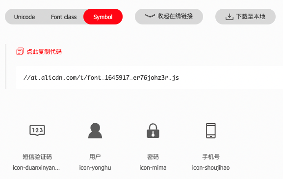
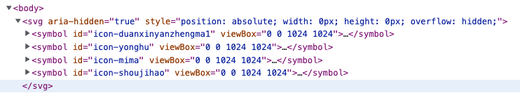
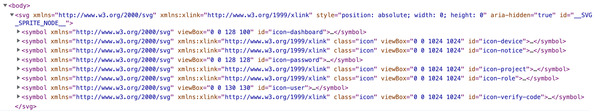

# SVG Sprite

SVG Sprite 技术类似于 CSS 中的 Sprite 技术，将图标和图形整合在一起，实际呈现的时候准确显示特定图标。

## symbol

SVG Sprite 使用 `symbol` 元素。`symbol` 元素是什么呢？ 我们可以把 SVG 看成一个舞台，`symbol` 则是舞台上一个一个组装好的元件，这些元件就是我们即将使用的 SVG 图标。

对于一个集合了三个图标的 SVG 元素的结构是这样：

```xml
<svg>
    <symbol>
        <!-- 第1个图标路径形状之类代码 -->
    </symbol>
    <symbol>
        <!-- 第2个图标路径形状之类代码 -->
    </symbol>
    <symbol>
        <!-- 第3个图标路径形状之类代码 -->
    </symbol>
</svg>
```

每一个 `symbol` 就是一个图标元件，但是，只有上面的代码，是无法显示图标的。这是因为，舞台上只是放置了图标，如果你不使用(use)，是看不见的。因此，还差一个“使用”，这就是 SVG 中的 `<use>` 元素。

## use

[use 元素](http://tutorials.jenkov.com/svg/use-element.html) 可以显示 SVG 文档定义的形状。 它有两大特点：

- 可重复调用

- 跨 SVG 调用

这样我们只要在页面的某处载入一个充满 ` symbol` 的 SVG 文件，然后在页面的任何角落，使用 `use` 就能绘制图标：

```html
<svg>
	<symbol id="shape">
    <rect x="50" y="50" width="50" height="50" />
    <circle cx="50" cy="50" r="50" />
  </symbol>
  <symbol id="shape1">
  </symbol>
  <symbol id="shape2">
  </symbol>
</svg>

<svg class="icon">
	<use xlink:href="#shape" />
</svg>
<svg class="icon">
	<use xlink:href="#shape" />
</svg>
```

`use` 元素通过 `xlink:href` 属性，寻找要使用的元素的。`#shape` 对应的就是 `id` 为 `shape` 的 `symbol` 元素。可以设置图标尺寸（width、height）、颜色（color）等。

总结：**symbol + use => SVG Sprite**

## iconfont

现在问题来了，去哪里找一个充满 ` symbol` 的 SVG 文件呢？[iconfont.cn](http://iconfont.cn/) 就提供了这样的图标库，此外还有国外的 [icomoon.io](http://icomoon.io/) 和 [font-awesome](http://www.bootcss.com/p/font-awesome/)。

登录 [iconfont.cn](http://iconfont.cn/)，创建项目，选择要添加的图标，iconfont 就会为你生成 SVG 文件。



使用方式有两种：

##### 1. 在线链接

在 index.html 里添加

```html
<script src="//at.alicdn.com/t/font_1645917_er76johz3r.js"></script>
```

##### 2. 下载 js 文件到本地

选择“下载至本地”，然后把 iconfont.js 加入到项目中，并引入进项目里

在 index.js 中

```js
import './iconfont.js'
```

> 下载的文件夹里面有很多文件，用 symbol 的方式使用图标只需要加入 iconfont.js 即可

不论是在线的 `font_1645917_er76johz3r.js` 或者下载的 `iconfont.js` ，都是为你生成包含多个 ` symbol` 的 SVG 文件，并挂载到 DOM 上。



这样就可以通过 `use` 元素使用 iconfont 的图标了

```html
<svg className="icon" aria-hidden="true">
	<use xlink:href="#icon-duanxinyanzhengma1" />
</svg>
```

```css
/* index.css */
.icon {
  width: 1em; 
  height: 1em;
  vertical-align: -0.15em;
  fill: currentColor;
  overflow: hidden;
}
```

当然最好的方式是创建一个组件封装  iconfont 的使用逻辑。

## svg-sprite-loader

如果用的不是 iconfont，而是设计师给的一个一个 svg 图片怎么办呢？可以使用 [svg-sprite-loader](https://github.com/JetBrains/svg-sprite-loader)

### 安装

```sh
npm i svg-sprite-loader -D
```

### Vue

> 样例代码在 [这里](https://gitee.com/cp3hnu/web-demo/tree/master/svg-sprite-loader-demo)

#### 配置

##### Vue-CLI（5.0.4）

```js
module.exports = {
  chainWebpack(config) {
    // 从 Vue-CLI 内置的 svg rule 中移除 src/icons 目录
    config.module
      .rule('svg')
      .exclude
      .add(resolve('src/icons'))
      .end()
	
    // 定义一条新的 svg rule
    // 用 svg-sprite-loader 处理 src/icons 目录下的 svg 文件
    // symbolId 为 "icon-[name]"
    config.module
      .rule('icons')
      .test(/\.svg$/)
      .include
      .add(resolve('src/icons'))
      .end()
      .use('svg-sprite-loader')
      .loader('svg-sprite-loader')
      .options({
        symbolId: 'icon-[name]'
      })
      .end()
  }
}
```

使用下面的命令可以检查生成的 webpack 配置文件

```sh
vue inspect > output.js
```

output.js 修改如下：

```js
/* config.module.rule('svg') */
{
  test: /\.(svg)(\?.*)?$/,
  type: 'asset/resource',
  generator: {
    filename: 'img/[name].[hash:8][ext]'
  },
  exclude: [
    '/xxx/src/icons'
  ]
},
/* config.module.rule('icons') */
{
  test: /\.svg$/,
  include: [
    '/xxx/src/icons'
  ],
  use: [
    /* config.module.rule('icons').use('svg-sprite-loader') */
    {
      loader: 'svg-sprite-loader',
      options: {
        symbolId: 'icon-[name]'
      }
    }
  ]
}
```

#### 使用

1. 首先把 svg 文件全部放在 `src/icons` 目录下，加载所有的 svg 文件

```js
// /src/icons/index.js
const ctx = require.context("./svg", false, /\.svg$/);
ctx.keys().forEach(ctx);

// /src/main.js
import "./icons";
```

2. 封装加载 svg 文件的组件

```vue
<!-- /src/components/SvgIcon.vue -->
<template>
  <svg :class="svgClass" aria-hidden="true">
    <use :xlink:href="iconName" />
  </svg>
</template>

<script>
export default {
  name: "SvgIcon",
  props: {
    icon: {
      type: String,
      required: true
    },
    className: {
      type: String
    }
  },
  computed: {
    iconName() {
      return `#icon-${this.icon}`;
    },
    svgClass() {
      if (this.className) {
        return "svg-icon " + this.className;
      } else {
        return "svg-icon";
      }
    }
  }
};
</script>

<style scoped>
.svg-icon {
  width: 1em;
  height: 1em;
  vertical-align: -0.15em;
  fill: currentColor;
  overflow: hidden;
}
</style>
```

定义全局组件

```js
import SvgIcon from "@/components/SvgIcon"; 
const app = createApp(App)
app.component("SvgIcon", SvgIcon);
app.use(store).use(router).mount("#app");
```

3. 准备工作布置完毕，现在可以使用 svg sprite 了

```vue
<SvgIcon icon="dashboard"></SvgIcon>
```

**`svg-sprite-loader`** 的实现原理同样是将 `src/icons` 目录下的所有 svg 文件，转换成包含多个 ` symbol` 的 SVG 文件。



### React

> 样例代码在 [这里](https://gitee.com/cp3hnu/web-demo/tree/master/antd-demo)

#### 配置

##### Create React App（5.0.1）

因为  [react-app-rewired](https://github.com/timarney/react-app-rewired)、[customize-cra](https://github.com/arackaf/customize-cra)、[craco](https://github.com/gsoft-inc/craco) 都没有跟上 Create React App 的更新节奏，这里使用 `eject` 方式配置 `svg-sprite-loader`。

使用 `svg-sprite-loader` 替换原有的 `svgr`。

```js
// webpack.config.js
{
  test: /\.svg$/,
  use: [
    {
      loader: "svg-sprite-loader",
      options: {
        symbolId: "icon-[name]",
      },
    },
    // {
    //   loader: require.resolve('@svgr/webpack'),
    //   options: {
    //     prettier: false,
    //     svgo: false,
    //     svgoConfig: {
    //       plugins: [{ removeViewBox: false }],
    //     },
    //     titleProp: true,
    //     ref: true,
    //   },
    // },
    // {
    //   loader: require.resolve('file-loader'),
    //   options: {
    //     name: 'static/media/[name].[hash].[ext]',
    //   },
    // },
  ],
  issuer: {
    and: [/\.(ts|tsx|js|jsx|md|mdx)$/],
  }
}
```

使用和 Vue 一样，这里省略之。

## 扩展阅读

### SVGR

[SVGR](https://react-svgr.com/docs/what-is-svgr/) 是将 SVG 文件转换为 React 组件的工具，提供了 [Playground](https://react-svgr.com/playground/) 和 [CLI](https://react-svgr.com/docs/cli/) 工具，当然最好的使用方式是搭配 [Webpack](https://react-svgr.com/docs/webpack/) 一起使用。

#### 安装

```sh
npm install --save-dev @svgr/webpack
```

#### 配置

```js
// webpack.config.js
module.exports = {
  module: {
    rules: [
      {
        test: /\.svg$/i,
        issuer: /\.[jt]sx?$/,
        use: ['@svgr/webpack'],
      },
    ],
  },
}
```

#### 使用

```react
import Star from './star.svg'

const Example = () => (
  <div>
    <Star className="svg-icon" />
  </div>
)
```

#### Create React App

如果我们是用 CRA 创建的应用，内部已经集成了 `SVGR`，配置参考 [options](https://react-svgr.com/docs/options/).

```js
{
  test: /\.svg$/,
  use: [
    {
      loader: require.resolve("@svgr/webpack"),
      options: {
        prettier: false,
        svgo: false,
        svgoConfig: {
          plugins: [{ removeViewBox: false }],
        },
        titleProp: true,
        ref: true,
      },
    },
    {
      loader: require.resolve("file-loader"),
      options: {
        name: "static/media/[name].[hash].[ext]",
      },
    },
  ],
  issuer: {
    and: [/\.(ts|tsx|js|jsx|md|mdx)$/],
  }  
}
```

因为 CRA 同时还用到了 `file-loader`，所以使用方式有点不同

```react
import starUrl, { ReactComponent as Star } from './star.svg'

const App = () => (
  <div>
    <Star />
  </div>
)
```

默认导出是 svg 的文件 url，React 组件通过具名 `ReactComponent` 导出。

### SVGO

[SVGO](https://github.com/svg/svgo) 是一个基于node .js的工具，用于优化 SVG 文件。SVGO 除了 CLI 之外，提供了 [很多的方式 ](https://github.com/svg/svgo#other-ways-to-use-svgo)来优化 SVG 文件。

## References

- [未来必热：SVG Sprites 技术介绍](https://www.zhangxinxu.com/wordpress/2014/07/introduce-svg-sprite-technology/)
- [symbol](https://developer.mozilla.org/en-US/docs/Web/SVG/Element/symbol)
- [SVG use Element](https://jenkov.com/tutorials/svg/use-element.html)
- [svg-sprite-loader](https://github.com/JetBrains/svg-sprite-loader)
- [svgr](https://github.com/gregberge/svgr)
- [svgo](https://github.com/svg/svgo)
- [demo 仓库](https://gitee.com/cp3hnu/web-demo)

