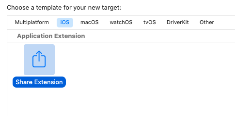
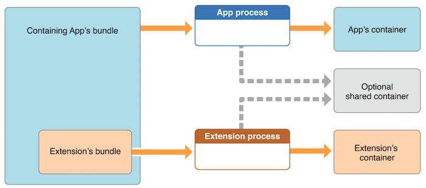
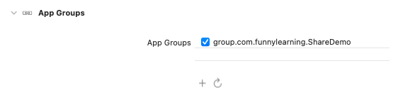
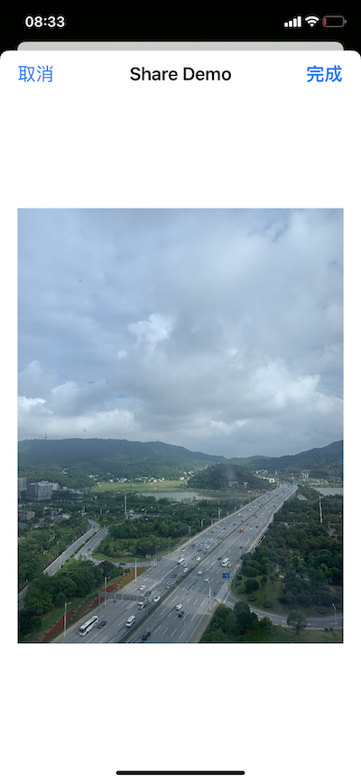

# Share Extension

Share Extension 是 iOS 8 推出的一项扩展服务，为用户提供了一种方便的共享内容的方式，最常见的就是分享相册里的相片。

> 本文的样例代码在 [这里](https://gitee.com/cp3hnu/share-demo)


## 创建

在工程里添加一个 targets，选择 Share Extension，点击 "next"，一个 Share Extension 就创建好了



Xcode 自动创建了 3 个文件

##### ShareViewController

主视图控制器，继承自 [SLComposeServiceViewController](https://developer.apple.com/documentation/social/slcomposeserviceviewcontroller#)，提供了默认 UI：textView、取消按钮、发布按钮和图片预览 view。我们可以自定义 UI，这个将在后面介绍。


##### MainInterface.storyboard

主 Storyboard

##### Info.plist

对 Extension 进行配置，下节进行详细讲解

## 配置

这里主要介绍与 Share Extention 相关的 property list key，详情请参考 [App Extension Keys](https://developer.apple.com/library/archive/documentation/General/Reference/InfoPlistKeyReference/Articles/AppExtensionKeys.html).

NSExtension

-  NSExtensionAttributes

   - NSExtensionActivationRule 见下文
   - NSExtensionActivationDictionaryVersion - 确定怎样匹配 host 提供的 asset 类型和 extension 能处理的 asset 类型，1：只有 当 extension 能处理 host 提供的所有 asset 类型时，extension 才能被选中，2：只要 extension 能处理 host 提供的其中一种 asset 类型，extension 就能被选中
   - NSExtensionActivationUsesStrictMatching - 严格（true）还是模糊（false）匹配 extension 能处理的 asset 类型
-  NSExtensionMainStoryboard - 指定 extension 的 storeboard 的文件名
-  NSExtensionPointIdentifier - 指定 extension 支持的扩展点，对应 Share Extention 是 `com.apple.share-services`
-  NSExtensionPrincipalClass - 指定实现 extension 主要功能的自定义类的名称，与 `NSExtensionMainStoryboard` 互斥

### NSExtensionActivationRule

确定 extension 能处理的 asset 类型和数量，Dictionary 或者 String 类型

| Key                                                    | Description                    |
| :----------------------------------------------------- | :----------------------------- |
| `NSExtensionActivationSupportsAttachmentsWithMaxCount` | 支持的 attachment 数量的最大值 |
| `NSExtensionActivationSupportsAttachmentsWithMinCount` | 支持的 attachment 数量的最小值 |
| `NSExtensionActivationSupportsFileWithMaxCount`        | 支持的 file 数量的最大值       |
| `NSExtensionActivationSupportsImageWithMaxCount`       | 支持的 image 数量的最大值      |
| `NSExtensionActivationSupportsMovieWithMaxCount`       | 支持的 video 数量的最大值      |
| `NSExtensionActivationSupportsText`                    | 是否支持 text                  |
| `NSExtensionActivationSupportsWebURLWithMaxCount`      | 支持的 web url 数量的最大值    |
| `NSExtensionActivationSupportsWebPageWithMaxCount`     | 支持的 web page 数量的最大值   |

`NSExtensionActivationRule` 除了可以设置这些预置的 key 之外，也可以设置字符串，详情请参考 [Declaring Supported Data Types for a Share or Action Extension](https://developer.apple.com/library/archive/documentation/General/Conceptual/ExtensibilityPG/ExtensionScenarios.html#//apple_ref/doc/uid/TP40014214-CH21-SW8)。

`NSExtensionActivationRule` 的默认值是 `TRUEPREDICATE`，表示支持数量和类型没有限制，上架之前必须修改。


## 获取数据

Share Extension 使用 [`extensionContext`](https://developer.apple.com/documentation/uikit/uiviewcontroller/1621411-extensioncontext#) 来获取数据

```swift
let attachments = (self.extensionContext?.inputItems.first as? NSExtensionItem)?.attachments ?? []
for let provider in attachments {
  let contentType = UTType.data.identifier
  if provider.hasItemConformingToTypeIdentifier(contentType) {
  provider.loadItem(forTypeIdentifier: contentType, options: nil) { [unowned self] (data, error) in
  	guard error == nil else { return }
    guard let url = data as? URL else { return } 
    let data = try? Data(contentsOf: url)
    return data                                                               
  }
}
```

## 文件类型判断

如果要指定 Share Extension 只能处理 PDF、Word 类型的文件，要怎么做呢？最好的方法是通过设置 `NSExtensionActivationRule` 指定 Share Extension 支持的文件类型，比如下面申明 Share Extension 只支持一个 PDF 文件

```swift
SUBQUERY (
    extensionItems,
    $extensionItem,
    SUBQUERY (
        $extensionItem.attachments,
        $attachment,
        ANY $attachment.registeredTypeIdentifiers UTI-CONFORMS-TO "com.adobe.pdf"
    ).@count == $extensionItem.attachments.@count
).@count == 1
```

但是这个语法太生涩了，而且如果处理的类型太多，这个字符串也很长。还有一种办法是通过 [`NSItemProvider`](https://developer.apple.com/documentation/foundation/nsitemprovider) 的 [`hasItemConformingToTypeIdentifier`(_:)](https://developer.apple.com/documentation/foundation/nsitemprovider/1403921-hasitemconformingtotypeidentifie#) 判断是否是自己需要的文件类型。比如下面指定 Share Extension 只能处理 图片、PDF 和 Word 类型的文件。

> `com.microsoft.word.doc` 是 .doc Word 文件
>
> `org.openxmlformats.wordprocessingml.document` 是 .docx Word 文件
>
> 要想指定文件的 Type Id 请参考 [Uniform Type Identifiers](https://escapetech.eu/manuals/qdrop/uti.html)
>
> 如果在 [Uniform Type Identifiers](https://escapetech.eu/manuals/qdrop/uti.html) 还没有找到，可以打印 `NSItemProvider` 的 [`registeredTypeIdentifiers`](https://developer.apple.com/documentation/foundation/nsitemprovider/1403923-registeredtypeidentifiers) 查看
>
> 比如 [Markdown](https://daringfireball.net/linked/2011/08/05/markdown-uti) 文件的 Type Id 是 `net.daringfireball.markdown`

```swift
private func hasItemConformingToTypeIds(provider: NSItemProvider) -> Bool {
  let ids = [UTType.image, UTType.pdf, UTType("com.microsoft.word.doc"), UTType("org.openxmlformats.wordprocessingml.document")].compactMap { $0 }
 for id in ids {
    if !provider.hasItemConformingToTypeIdentifier(id.identifier) {
      return false
    }
  }
  return true
}
```

## 数据共享

虽然 Extension 嵌套在 Containing app 中，但是他们不能直接访问彼此的容器，为了 Extension 和 Containing app 能共享数据，需要创建特殊的共享容器。



### App Groups

首先我们需要创建 App Groups。在 Extension 和 Containing app 中添加 `Capabilities` -> `App Groups`



然后就可以使用 UserDefaults、FileManager 、Core Data、SQLite、[NSFileCoordinator](https://developer.apple.com/documentation/foundation/nsfilecoordinator) 访问共享容器。这里我们介绍前面两种方式。

### UserDefaults

使用 UserDefaults 有文件大小的限制，在我的手机（iPhoneXR 15.5）提示不能超过 4M.

> Attempting to store >= 4194304 bytes of data in CFPreferences/NSUserDefaults on this platform is invalid. This is a bug in ImageShare or a library it uses.

#### Extension

保存数据

```swift
let appGroupName = "group.com.funnylearning.ShareDemo"
let userDefaults = UserDefaults(suiteName: appGroupName)
userDefaults?.set(imageData, forKey: "imageData")
```

#### Containing app

读取数据

```swift
let appGroupName = "group.com.funnylearning.ShareDemo"
let userDefaults = UserDefaults(suiteName: appGroupName)
let imageData = userDefaults?.data(forKey: "imageData")
```

### FileManager

#### Extension

保存数据

```swift
let appGroupName = "group.com.funnylearning.ShareDemo"
let documentsDirectory = FileManager.default.containerURL(forSecurityApplicationGroupIdentifier: appGroupName)
if let archiveURL = documentsDirectory?.appendingPathComponent("file.data") {
  do {
    try imageData.write(to: archiveURL)
  } catch {
    print("Write data error =", error)
 	}
}
```

更好的方式是使用 [copyItem(at:to:)](https://developer.apple.com/documentation/foundation/filemanager/1412957-copyitem#)

```swift
let fileManager = FileManager.default
guard let url = data as? URL else { return }
guard let documentsDirectory = fileManager.containerURL(forSecurityApplicationGroupIdentifier: appGroupName) else { return }
                    
do {
    let archiveURL = documentsDirectory.appendingPathComponent("file.data")
    if fileManager.fileExists(atPath: archiveURL.path) {
        try fileManager.removeItem(at: archiveURL)
    }
    try fileManager.copyItem(at: url, to: archiveURL)
} catch {
    print("FileManager Error = ", error)
}
```

#### Containing App

读取数据

```swift
let appGroupName = "group.com.funnylearning.ShareDemo"
let documentsDirectory = FileManager.default.containerURL(forSecurityApplicationGroupIdentifier: appGroupName)
if let archiveURL = documentsDirectory?.appendingPathComponent("file.data") {
  if FileManager.default.fileExists(atPath: archiveURL.path) {
    if let imageData = try? Data(contentsOf: archiveURL) {
    	return imageData
		}
  }
}
```

## 打开 Containing App

iOS 只有 Today extension 和  iMessage app extension 通过 [NSExtensionContext](https://developer.apple.com/documentation/foundation/nsextensioncontext) 的  [open(_:completionHandler:)](https://developer.apple.com/documentation/foundation/nsextensioncontext/1416791-open#) 打开 Containing app，在 [Stack Overflow](https://stackoverflow.com/questions/27506413/share-extension-to-open-containing-app#44499222) 上找到一个方法使别的 Extension 也能打开 Containing app.

> 在我的手机（iPhoneXR 15.5）上测试可行

```swift
self.openURL(URL(string: "myapp://com.myapp.share")!)

@objc func openURL(_ url: URL) -> Bool {
  var responder: UIResponder? = self
  while responder != nil {
    if let application = responder as? UIApplication {
      return application.perform(#selector(openURL(_:)), with: url) != nil
    }
    responder = responder?.next
  }
  return false
}
```

## 自定义 UI

如果不满意系统默认的 UI，我们可以自定义 UI。

删除 Xcode 自动创建的 ShareViewController，创建一个新的 CustomViewController，设置 view。

```swift
import Foundation
import UIKit
import UniformTypeIdentifiers

final class CustomViewController: UIViewController {
  private let imgView = UIImageView()
  // MARK: - Init
  override func viewDidLoad() {
    super.viewDidLoad()
    view.backgroundColor = UIColor.white
    setupNaviBar()
    setupView()
  }
}

// MARK: - Setup
private extension CustomViewController {
  func setupNaviBar() {
    self.navigationItem.title = "Share Demo"
        
    let itemCancel = UIBarButtonItem(barButtonSystemItem: .cancel, target: self, action: #selector(cancelAction))
    self.navigationItem.setLeftBarButton(itemCancel, animated: false)
        
    let itemDone = UIBarButtonItem(barButtonSystemItem: .done, target: self, action: #selector(doneAction))
    self.navigationItem.setRightBarButton(itemDone, animated: false)
  }
    
  func setupView() {
    imgView.contentMode = .scaleAspectFit
    view.addSubview(imgView)   
    imgView.translatesAutoresizingMaskIntoConstraints = false
    
    imgView.topAnchor.constraint(equalTo: view.safeAreaLayoutGuide.topAnchor, constant: 20).isActive = true
    imgView.leftAnchor.constraint(equalTo: view.safeAreaLayoutGuide.leftAnchor, constant: 20).isActive = true
    imgView.rightAnchor.constraint(equalTo: view.safeAreaLayoutGuide.rightAnchor, constant: -20).isActive = true
    imgView.bottomAnchor.constraint(equalTo: view.safeAreaLayoutGuide.bottomAnchor, constant: -20).isActive = true
    loadImageData()
  }
    
  @objc private func cancelAction () {
    let error = NSError(domain: "some.bundle.identifier", code: 0, userInfo: [NSLocalizedDescriptionKey: "An error description"])
    extensionContext?.cancelRequest(withError: error)
  }
    
  @objc private func doneAction() {
    extensionContext?.completeRequest(returningItems: [], completionHandler: nil)
  }
}

// MARK: - Private
private extension CustomViewController {
  func loadImageData() {
    let attachments = (self.extensionContext?.inputItems.first as? NSExtensionItem)?.attachments ?? []
    guard let provider = attachments.first else { return }
    let contentType = UTType.image.identifier
    guard provider.hasItemConformingToTypeIdentifier(contentType) else { return }
       
    provider.loadItem(forTypeIdentifier: contentType,
                          options: [NSItemProviderPreferredImageSizeKey: CGSize(width: 200, height: 200)]) { 
    [unowned self] (data, error) in
      guard let url = data as? URL else { return }   
      do {
        let imageData = try Data(contentsOf: url)
        let image = UIImage(data: imageData)
        DispatchQueue.main.async {
          self.imgView.image = image
        }
      } catch {
        print("Read data error =", error)
      }
    }
  }
}
```

然后修改 MainInterface.storyboard 文件，添加 Navigation Controller，设置其 `rootViewController` 为 CustomViewController。运行效果如下：



> [Design the UI](https://developer.apple.com/library/archive/documentation/General/Conceptual/ExtensibilityPG/Share.html#//apple_ref/doc/uid/TP40014214-CH12-SW5) 文档上说可以通过 `Auto Layout constraints` 或者 [`preferredContentSize`](https://developer.apple.com/documentation/uikit/uiviewcontroller/1621476-preferredcontentsize) 调整 view 的高度，经测试（iPhoneXR 15.5） Share Extension 的自定义 UI 高度不可调。 

## References

- [Share Extension](https://developer.apple.com/library/archive/documentation/General/Conceptual/ExtensibilityPG/Share.html#//apple_ref/doc/uid/TP40014214-CH12-SW1)
- [App Extension Keys](https://developer.apple.com/library/archive/documentation/General/Reference/InfoPlistKeyReference/Articles/AppExtensionKeys.html) 
- [Uniform Type Identifiers](https://escapetech.eu/manuals/qdrop/uti.html)
- [iOS Share extension — Swift 5.1](https://medium.com/macoclock/ios-share-extension-swift-5-1-1606263746b)
- [StackOverflow - Share Extension to open containing app](https://stackoverflow.com/questions/27506413/share-extension-to-open-containing-app#44499222)
- [Design the UI](https://developer.apple.com/library/archive/documentation/General/Conceptual/ExtensibilityPG/Share.html#//apple_ref/doc/uid/TP40014214-CH12-SW5)
- [Custom UI for Share Extensions](https://diamantidis.github.io/2020/01/11/share-extension-custom-ui)
- [Wormhole](https://github.com/nixzhu/Wormhole)
