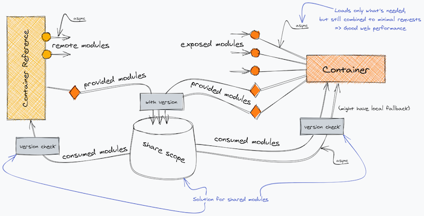
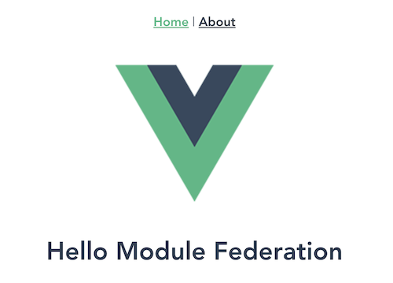
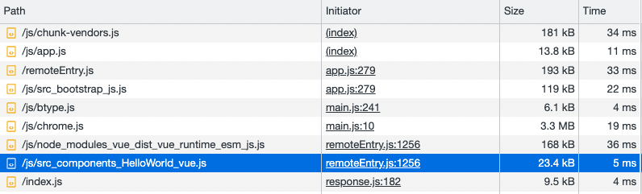
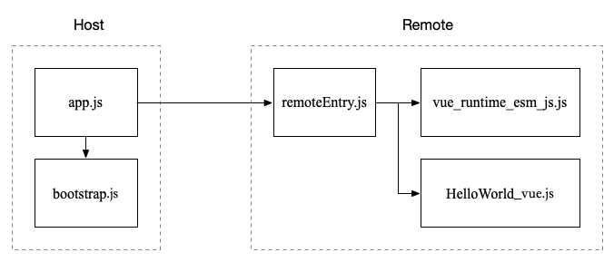

# Module Federation

Module Federation 实现多个应用（app）或者构建（build）在 **运行时** 共享模块。这些应用（app）或者构建（build）可以单独开发、单独部署。

可以把 Module Federation 看作是实现微前端的一种方式。

## 优势

1. 技术栈无关
2. 独立仓库、独立开发、独立部署
3. 增量升级
4. 模块按需加载

## 总览



Container(Remote) 暴露 modules 供 Container Reference(Host) 运行时加载使用。

Container Reference 和 Container 通过 `share scope` 共享他们依赖的模块，使用时需要判断共享模块的版本，只有符合版本要求时才能使用。

模块通过异步加载，只有在使用的时候才会加载对应的模块，在未加载时只存储对应的模块信息。

## 名称解释

**Remote**

一个 Webpack 构建，提供运行时共享模块。

**Host**

一个 Webpack 构建，使用 Remote 提供的共享模块。

**Container**

每个构建都是一个容器，每个容器都可以加载其它容器暴露出来的模块。

**Bidirectional - Host**

一个 Webpack 构建即可以是 Host 也可以是 Remote。

## 配置

我这里用的是 Vue-CLI 5.0+ 和 Vue 2.0+

### Remote

```js
const { defineConfig } = require('@vue/cli-service')
const ModuleFederationPlugin = require('webpack').container.ModuleFederationPlugin

module.exports = defineConfig({
  publicPath: 'auto',
  configureWebpack: {
    optimization: {
      splitChunks: false
    },
    plugins: [
      new ModuleFederationPlugin({
        name: 'remote',
        filename: 'remoteEntry.js',
        exposes: {
          './HelloWorld': './src/components/HelloWorld.vue',
          './AboutView': './src/components/AboutView.vue'
        },
        shared: {
          vue: {
            singleton: true
          }
        }
      })
    ]
  }
})
```

> 关于 splitChunks 的配置请看下文

### Host

```js
const { defineConfig } = require('@vue/cli-service')
const ModuleFederationPlugin = require('webpack').container.ModuleFederationPlugin

module.exports = defineConfig({
  configureWebpack: {
    plugins: [
      new ModuleFederationPlugin({
        name: 'host',
        filename: 'remoteEntry.js',
        remotes: {
          remote: 'remote@http://localhost:9001/remoteEntry.js',
        },
        shared: {
          vue: {
            singleton: true
          }
        }
      })
    ]
  }
})
```

## 使用

首先在 Host 中正常使用 Modele Federation，我们需要修改入口文件，参考 [官方文档](https://webpack.docschina.org/concepts/module-federation/#troubleshooting)

创建 bootstrap.js 文件，并将入口文件的内容放到里面，然后将 bootstrap 引入到入口文件中

**bootstrap.js**

```js
import Vue from 'vue'
import App from './App.vue'
import router from './router'
import store from './store'

Vue.config.productionTip = false

new Vue({
  router,
  store,
  render: h => h(App)
}).$mount('#app')
```

**main.js**

```js
import('./bootstrap');
```

然后使用 Remote exposed 的模块

```vue
<template>
  <div class="home">
    
    <HelloWorld msg="Hello Module Federation" />
  </div>
</template>

<script>
export default {
  name: 'HomeView',
  components: {
    HelloWorld: () => import('remote/HelloWorld')
  }
}
</script>
```

如果想处理加载状态，可以使用下面这种 [方式](https://cn.vuejs.org/v2/guide/components-dynamic-async.html#%E5%A4%84%E7%90%86%E5%8A%A0%E8%BD%BD%E7%8A%B6%E6%80%81)

```js
const AsyncComponent = () => ({
  // 需要加载的组件 (应该是一个 `Promise` 对象)
  component: import('./MyComponent.vue'),
  // 异步组件加载时使用的组件
  loading: LoadingComponent,
  // 加载失败时使用的组件
  error: ErrorComponent,
  // 展示加载时组件的延时时间。默认值是 200 (毫秒)
  delay: 200,
  // 如果提供了超时时间且组件加载也超时了，
  // 则使用加载失败时使用的组件。默认值是：`Infinity`
  timeout: 3000
})
```

运行效果：



## 加载过程

打开 chrome 的调试，可以查看 Host 加载 exposed 模块的过程



Module Federation 的加载过程如下：



这里比较奇怪的是加载 `vue_runtime_esm_js.js`（即 shared library）是从 remote 中加载的。为此我还特意问了作者原因，[issue#2065](https://github.com/module-federation/module-federation-examples/issues/2065)，作者是这么说的

> Zack Jackson: Its loaded based on semver rules and whoever has the best version to serve the needs of the apps.
>
> Webpack decides, its not always the host that loads the shared dep and usually has no perf hit since either way its an async chunk that needs to be loaded, either from host build or another build. But its a network request either way.

## Vue In React

相同框架使用 Remote exposed 的组件比较简单，但是如果跨不同的框架就比较麻烦了，比如在 React 中使用 Vue，因为在 React 不识别 Vue 的组件，所以就无法挂载 Vue 的组件，解决办法就是在 Remote (Vue) 的工程里，封装挂载  Vue 组件的方法。

### Remote (Vue)

```js
// src/components/Mount.js
import Vue from "vue";
export { default as HelloWorld } from "./HelloWorld";

export const mount = (component, props, el) => {
  const app = new Vue({
    render: h =>
      h(component, {
        props: props
      })
  }).$mount(el);
  return () => {
    app.$destroy();
  };
};
```

创建一个 Vue 实例，并挂载在 `el` 上，返回一个函数，执行这个函数卸载新建的 Vue 实例。最后修改 `exposes`。

```js
exposes: {
  "./ComponentMount": "./src/components/Mount.js"
}
```

### Host (React)

加载 Remote 的 `mount` 方法，封装一个高阶组件

```jsx {9-12}
// src/components/ComponentMount.js
import { mount } from "remote/RemoteMount";
import React, { useRef, useEffect } from "react";

const VueComponent = component => props => {
  const ref = useRef(null);

  useEffect(() => {
    const destroy = mount(component, props, ref.current);
    return () => {
      destroy();
    };
  }, []);

  return (
    <div className="vue-component-container">
      <div ref={ref}></div>
    </div>
  );
};

export default VueComponent;
```

在 React 组件挂载时，调用 Vue 的 `mount` 方法，挂载 Vue 组件；在 React 组件卸载时，调用 Vue 的 `destroy` 方法，卸载 Vue 组件。

最后在 Host (React) 工程里使用这个 VueComponent 组件

```jsx
import { HelloWorld } from "remote/RemoteMount";
const HelloWorldComponent = VueComponent(HelloWorld);

const App = () => {
  return (
    <div className="app">
      <HelloWorldComponent />
    </div>
  )
}
```

还有一点需要注意的是事件，Vue 通过 `emit` 发送事件，但是 React 不支持，所以要想 React 接收到 Vue 事件，需要通过 props 传递事件函数。

## React in Vue

参考官方 [react-in-vue example](https://github.com/module-federation/module-federation-examples/tree/master/react-in-vue)

## 共享路由

共享路由是很多架构实现微前端的方式，使用 Module Federation 有两种方式来共享路由。第一种方式共享路由组件，然后在 Host 定义路由，例如

```js {5}
const routes = [
  {
    path: '/about',
    name: 'about',
    component: () => import('remote/AboutView.vue'),
  },
];
```

第二种方式共享路由数组，然后加入 Host 路由中，例如

##### Remote

```js
// src/router/shareRoutes.js
const routes = [
  {
    path: '/about',
    name: 'about',
    component: () => import('../views/AboutView.vue')
  }
]

export default routes
```

```js {6}
// vue.config.js
new webpack.container.ModuleFederationPlugin({
  name: 'remote',
  filename: 'remoteEntry.js',
  exposes: {
    './RemoteRoutes': './src/router/shareRoutes.js'
  },
  shared: {
    vue: {
      singleton: true
    }
  }
})
```

##### Host

```js {15}
// src/router/index.js
import Vue from 'vue'
import VueRouter from 'vue-router'

Vue.use(VueRouter)

const routes = [
  ...
]

const router = new VueRouter({
  routes
})

import('remote/RemoteRoutes').then(res => {
  router.addRoutes(res.default)
})

export default router
```

## Remote 配置问题

### publicPath

publicPath 必须设置为 `auto`，或者 URL 绝对地址，例如 `http://localhost:9001`。否则加载不到组件

> [Vue warn]: Failed to resolve async component: () => __webpack_require__.e(/*! import() */ "webpack_container_remote_remote_HelloWorld").then(__webpack_require__.t.bind(__webpack_require__, /*! remote/HelloWorld */ "webpack/container/remote/remote/HelloWorld", 23))
> Reason: ChunkLoadError: Loading chunk src_components_HelloWorld_vue failed.
> (error: http://localhost:9000/js/src_components_HelloWorld_vue.js)
> while loading "./HelloWorld" from webpack/container/reference/remote

从错误信息中，我们可以看出如果不设置 Remote 的 `publicPath`，Module Federation 将从 Host 域里去加载 HelloWorld 组件，当然是找不到的。

### optimization.splitChunks

用 Vue-CLI 脚手架搭建的项目，需要修改 `optimization.splitChunks`，否则报错

> [Vue warn]: Failed to resolve async component: () => __webpack_require__.e(/*! import() */ "webpack_container_remote_remote_HelloWorld").then(__webpack_require__.t.bind(__webpack_require__, /*! remote/HelloWorld */ "webpack/container/remote/remote/HelloWorld", 23))
> Reason: ScriptExternalLoadError: Loading script failed.
> (missing: http://localhost:9001/remoteEntry.js)
> while loading "./HelloWorld" from webpack/container/reference/remote

个人推测 Module Federation 与 Vue-CLI 的 `optimization.splitChunks` 配置有冲突。

下面是 Vue-CLI 的 `optimization.splitChunks` 配置

> 使用命令 `vue inspect > output.js`

```js
optimization: {
  splitChunks: {
    cacheGroups: {
      defaultVendors: {
        name: 'chunk-vendors',
        test: /[\\/]node_modules[\\/]/,
        priority: -10,
        chunks: 'initial'
      },
      common: {
        name: 'chunk-common',
        minChunks: 2,
        priority: -20,
        chunks: 'initial',
        reuseExistingChunk: true
      }
    }
  }
}
```

解决办法

方法一：禁止 `splitChunks`

```js
optimization: {
  splitChunks: false
}
```

此方式导致 build 出两个包含 Vue 的 chunk。

方法二：删除  Vue-CLI  `splitChunks` 的配置

```js
chainWebpack: config => {
  config.optimization.delete('splitChunks')
}
```

这将使用 webpack 的 [splitChunks 默认配置](https://webpack.docschina.org/plugins/split-chunks-plugin/#splitchunkscachegroups)。

```js
optimization: {
  splitChunks: {
    chunks: 'async',
    minSize: 20000,
    minRemainingSize: 0,
    minChunks: 1,
    maxAsyncRequests: 30,
    maxInitialRequests: 30,
    enforceSizeThreshold: 50000,
    cacheGroups: {
      defaultVendors: {
        test: /[\\/]node_modules[\\/]/,
        priority: -10,
        reuseExistingChunk: true,
      },
      default: {
        minChunks: 2,
        priority: -20,
        reuseExistingChunk: true,
      },
    },
  },
}
```

方法三：将 Vue-CLI  `splitChunks` 的配置里的 `chunks: 'initial'` 改为 `chunks: 'async'`

```js
optimization: {
  splitChunks: {
    cacheGroups: {
      defaultVendors: {
        name: 'chunk-vendors',
        test: /[\\/]node_modules[\\/]/,
        priority: -10,
        chunks: 'async'
      },
      common: {
        name: 'chunk-common',
        minChunks: 2,
        priority: -20,
        chunks: 'async',
        reuseExistingChunk: true
      }
    }
  }
}
```

难道 Module Federation 依赖 async chunk? 关于 `all`、`initial`、`async` 的区别请参考 [stackoverflow](https://stackoverflow.com/questions/50127185/webpack-what-is-the-difference-between-all-and-initial-options-in-optimizat#answer-55415178)。

### optimization.runtimeChunk

同样 `runtimeChunk` 也不能用，或者说如果使用了，需要额外的操作，比如手动加载 remote 的 runtime chunk，可以参考这篇文章 [Module Federation with Webpacker/Rails host resulting in ScriptLoadError #1116](https://github.com/module-federation/module-federation-examples/issues/1116)，但是具体怎么做不得而知，因为 build 的 runtime chunk 文件名是不确定的 。

> Zack Jackson: You'd have to load the runtime chunk & the remote entry since setting it to single removes all the shared runtime code from the remote file.

## 注意事项

共享的模块因为是运行在 Host 环境，所以 **不能** 访问 Remote 的全局变量或函数、全局组件、Vuex store、全局样式等涉及 app 全局的东西。相反共享的模块访问的是 Host 的全局变量或函数、全局组件、Vuex store、全局样式等。

注意跨域问题，共享的模块运行在 Host 环境，接口请求是从 Host 环境发出的。接口的服务器要添加 Host 所在的域名。

共享的模块可以访问 Host 的 localStorage 和 sessionStorage。

## 遗留问题

### optimization.runtimeChunk

Module Federation 怎么兼容 `optimization.runtimeChunk: "single"` ? 

我想到同时设置 `optimization.runtimeChunk: "single"` 和 ModuleFederationPlugin 的 `runtime: false` 。经测试这样设置运行没有问题，build 生成了 runtime-xxxx.js 文件，同时 remoteEntry.js 也包含了运行时代码，确保能加载 exposed 模块。 但是这样设置 runtimeChunk 是否起作用？为此我还特意问了作者这个问题 [issue#1116](https://github.com/module-federation/module-federation-examples/issues/1116#issuecomment-1180093995)，作者回答说不起作用。

> Zack Jackson: RuntimeChunk single doesn’t work. You’d want to make it false or undefined

另外官方的 [例子](https://webpack.docschina.org/plugins/module-federation-plugin/) 运行失败。

```js
const { ModuleFederationPlugin } = require('webpack').container;
module.exports = {
  plugins: [
    new ModuleFederationPlugin({
      runtime: 'my-runtime-name',
    }),
  ],
};
```

[concat-runtime](https://github.com/module-federation/concat-runtime) 说是能解决这个问题，但是我试了一下好像不起作用。

### 为什么从 Remote 中加载共享库?

从加载过程来看，Module Federation 从 Remote 环境加载共享库（Vue），我理解应该从 Host 环境加载共享库，只有当 Host 没有 Remote 使用的共享库时，才从 Remote 环境加载，这样才能获得更好的性能。为此我还特意问了作者原因 [issue#2065](https://github.com/module-federation/module-federation-examples/issues/2065)，作者是这么说的

> Zack Jackson: Its loaded based on semver rules and whoever has the best version to serve the needs of the apps.
>
> Webpack decides, its not always the host that loads the shared dep and usually has no perf hit since either way its an async chunk that needs to be loaded, either from host build or another build. But its a network request either way.

意思是从哪里加载无所谓，反正都是加载 chunk 的异步网络请求。

## References

- [Module Federation](https://module-federation.github.io/)
- [Webpack - Module Federation](https://webpack.js.org/concepts/module-federation/)
- [ModuleFederationPlugin](https://webpack.js.org/plugins/module-federation-plugin/)
- [Webpack 5 Module Federation: A game-changer in JavaScript architecture](https://medium.com/swlh/webpack-5-module-federation-a-game-changer-to-javascript-architecture-bcdd30e02669)
- [Webpack 5 and Module Federation - A Microfrontend Revolution](https://dev.to/marais/webpack-5-and-module-federation-4j1i)
- https://github.com/webpack/webpack/issues/10352
- [Webpack5 跨应用代码共享 - Module Federation](https://segmentfault.com/a/1190000024449390)
- [How to add Vue (or another framework) to your React Micro Frontend](https://indepth.dev/tutorials/react/add-vue-to-react-micro-frontend)
- [React-Vue Micro-Frontend Application using Webpack 5 Module Federation](https://nabeel-shakeel.medium.com/react-vue-micro-frontend-application-using-webpack-5-module-federation-7646c8043359)
- [一文通透讲解webpack5 module federation](https://juejin.cn/post/7048125682861703181)
- [module-federation-examples](https://github.com/module-federation/module-federation-examples)
- [mfe-react-vue-module-federation-example](https://github.com/esplito/mfe-react-vue-module-federation-example)

## Module Federation splitChunks issues

[Module Federation with Webpacker/Rails host resulting in ScriptLoadError #1116](https://github.com/module-federation/module-federation-examples/issues/1116)

[@vue/cli v5.0.0-alpha.5 don't support module federation which is a feature in webpack 5 #6318](https://github.com/vuejs/vue-cli/issues/6318)

[Initialization of sharing external failed: ScriptExternalLoadError: Loading script failed. #692](https://github.com/module-federation/module-federation-examples/issues/692)

## Demo

[module-federation-demo](https://gitee.com/cp3hnu/module-federation-demo)

