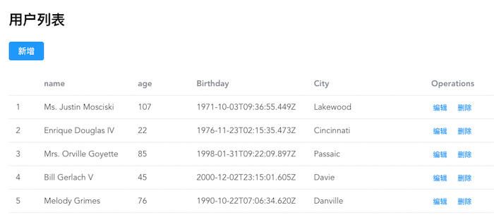

# Mock

Mock 通过提供假数据来模拟后台接口返回，除此之外 mock 还能提供一些特殊数据，来进行边界测试。本文将介绍 3 个 mock 库，并对比他们的优缺点。

## Mock Service Worker（MSW）

[Mock Service Worker](https://mswjs.io/docs/) 使用 [Service Worker API](https://developer.mozilla.org/en-US/docs/Web/API/Service_Worker_API) 拦截实际的请求，因此它不需要启动额外的网络服务。MSW 具有文档友好、配置简单、 不需要改动代码来兼容 mock、支持 Node / Browser、支持 REST / GraphQL、可以使用 localStorage、sessiongStorage、IndexDB 持久化数据等优点。

### 安装

```sh
$ npm install msw --save-dev
```

### 配置

首先需要在 `public` 目录下创建 `mockServiceWorker.js`，这个文件用于注册 [Service Worker](https://developers.google.com/web/fundamentals/primers/service-workers)。MSW 提供了一个 CLI 工具方便我们创建  `mockServiceWorker.js`。

```sh
$ npx msw init public/ --save
```

### 定义 Mock

```js
// src/mocks/index.js
import { rest, setupWorker } from 'msw'
// 定义需要 mock 拦截的请求和对应的响应
const handlers = [
  rest.post('/login', (req, res, ctx) => {
    // 可以使用 sessionStorage 来存储数据
    sessionStorage.setItem('is-authenticated', 'true')
    return res(
      // 状态码
      ctx.status(200),
      // 返回 response
      ctx.json({
        id: 1000,
        name: "cp3hnu"
      })
    )
  })
]

// 配置 worker
export const worker = setupWorker(...handlers);
```

### 启动 Worker

```js
// src/index.js
if (process.env.NODE_ENV === 'development') {
  const { worker } = require('./mocks/index.js')
  worker.start()
}
```

然后我们就可以使用 `axios`、`fetch`、`XMLHttpRequest` 请求数据了。

### Request Handler

MSW 提供了一组方便 mock REST API 请求的 [Request handler](https://mswjs.io/docs/basics/request-handler)，对应不同的 request method：

- `rest.get()`
- `rest.post()`
- `rest.put()`
- `rest.patch()`
- `rest.delete()`
- `rest.options()`

#### Request URL

这些函数的第一个参数是 [Request URL](https://mswjs.io/docs/basics/request-matching#request-url)，有三种选项：

-  完整 URL，例如 `https://api.backend.dev/users`
- Path，例如 `/login`，支持通配符 `/users/*`，这种方式请求的完整 URL 是 `location.origin + path`
- 正则表达式，例如 `/\/posts\//`

请求 URL 也支持参数

```js
rest.post('https://api.backend.dev/user/:userId', (req, res, ctx) => {
    // `userId` value becomes "abc-123"
    const { userId } = req.params
  }),
```

MSW 的 request URL 匹配请参考 [Request matching](https://mswjs.io/docs/basics/request-matching)。

#### Response Resolver

第二个参数 `(req, res, ctx) => {}`，MSW 称为 [Response resolver](https://mswjs.io/docs/basics/response-resolver)，它有三个参数：

- req：[Request](https://mswjs.io/docs/api/request)，是拦截的 request 请求信息
- res：[Response](https://mswjs.io/docs/api/response)，是一个函数，函数的参数是响应转换函数（[response transformers](https://mswjs.io/docs/basics/response-transformer)）数组，调用这个函数返回 mock response
- ctx：[Context](https://mswjs.io/docs/api/context)，提供一组方便的响应转换函数，用于 Response 函数中，常用的有
  - `ctx.status()`，设置 response 的状态码
  - `ctx.json()`，设置 response json 数据
  - `ctx.delay()`，延时返回 response，模拟真实的网络请求环境
  - 更多函数请参考 [Context](https://mswjs.io/docs/api/context)

除了 [Context](https://mswjs.io/docs/api/context) 提供的默认转换函数，MSW 也支持 [自定义转换函数](https://mswjs.io/docs/basics/response-transformer#custom-transformer) 和 [组合转换函数](https://mswjs.io/docs/basics/response-transformer#composing-standard-transformers)

##### 自定义转换函数

转换函数的作用就是修改 mock response 的属性值，比如 `status`，`body` 等，例如

```js
function redirect(destination, statusCode) {
  return (res) => {
    res.status = statusCode
    res.headers.set('Location', destination)
    return res
  }
}

rest.get('/user', (req, res, ctx) => {
  return res(redirect('/v2/user', 301))
})
```

##### 组合转换函数

从 [MSW 官方文档](https://mswjs.io/docs/)中，我总结出三种组合转换函数的方式

##### `compose`

```js
import { compose, context } from 'msw'
export function redirect(destination, statusCode) {
  return compose(
    context.status(statusCode),
    context.set('Location', destination),
  )
}

rest.get('/user', (req, res, ctx) => {
  return res(redirect('/v2/user', 301))
})
```

#### `response`

```js
import { response, context } from 'msw'
export function res(...transformers) {
  // 一个自定义响应组合链，在每个 `res` 调用中嵌入一个随机的真实服务器响应延迟。
  return response(...transformers, context.delay())
}

rest.get('/user', (req, _, ctx) => {
  // 注意这里使用的是自定义的 `res` 函数
  return res(ctx.json({ firstName: 'John', lastName: 'Maverick' }))
})
```

#### `createResponseComposition` 

```js
import { createResponseComposition, context } from 'msw'
export const delayedResponse = createResponseComposition(null, [
  context.delay('real')
])

rest.get('/user', (req, res, ctx) => {
  // 模拟实际网络请求的响应时间。
  return delayedResponse(
    ctx.json({
      firstName: 'John',
      lastName: 'Maverick',
    }),
  )
})
```

这个函数的第一个参数是 [response properties](https://mswjs.io/docs/api/response#properties) 的对象，用于覆盖每个模拟响应。第二个参数是 [response transformers](https://mswjs.io/docs/basics/response-transformer) 数组

### Data

MSW 拦截 request 并提供 mock response，但是 response 的数据都是硬编码的，我们还需要使用 [`@mswjs/data`](https://github.com/mswjs/data) 和 [`@faker-js/faker`](https://github.com/faker-js/faker) 产生 mock 数据。

- [@mswjs/data](https://github.com/mswjs/data) 提供创建数据模型、建立数据模型之间的关系以及类似于数据库的数据查询功能。

- [@faker-js/faker](https://github.com/faker-js/faker) 产生模型随机数据。

#### 安装

```sh
$ npm install @mswjs/data @faker-js/faker -D
```

#### Demo

> 样例代码地址 [msw-demo](https://gitee.com/cp3hnu/web-demo/tree/master/msw-demo)

使用 `@mswjs/data` 定义 User 模型，使用 `@faker-js/faker` 自动生成 User 对象的各个属性的值。

```js
import { factory, primaryKey } from "@mswjs/data";
import { faker } from "@faker-js/faker";

// 创建 User 模型
export const db = factory({
  user: {
    id: primaryKey(faker.datatype.uuid),
    name: faker.name.findName,
    age: () => faker.datatype.number({ min: 18, max: 120 }),
    city: faker.address.cityName,
    birthday: faker.date.birthdate
  }
});

// 生成 5 名 user 数据
Array.from({ length: 5 }).forEach(() => {
  db.user.create();
});

const handlers = [
  // 用户列表
  rest.get("/users", (_, res) => {
    return res(db.user.getAll());
  }),
  // 详情
  rest.get("/users/:id", (req, res) => {
    const id = req.params.id;
    const user = db.user.findFirst({
      where: {
        id: {
          equals: id
        }
      }
    });
    return res(user);
  }),
  // 新增
  rest.post("/users", (req, res) => {
    const body = req.body;
    return res(db.user.create(body));
  }),
  // 编辑
  rest.put("/users/:id", (req, res) => {
    const body = req.body;
    const id = req.params.id;
    const user = db.user.update({
      where: {
        id: {
          equals: id
        }
      },
      data: body
    });
    return res(user);
  }),
  // 删除
  rest.delete("/users/:id", (req, res) => {
    const id = req.params.userId;
    const user = db.user.delete({
      where: {
        id: {
          equals: id
        }
      }
    });
    return res(user);
  })
];
```

`@mswjs/data` 的 CURD 功能很符合实际的应用，例如用户的增删改查功能



此外 `@mswjs/data` 还支持分页、排序、自动生成适用于 MSW 的 [Request handlers](https://github.com/mswjs/data#generate-rest-api) [`toHandlers`](https://github.com/mswjs/data#toHandlers)。

### Feature Request

`@mswjs/data` 目前不具备

- 持久化数据，`@mswjs/data` 建立的是内存数据库，当页面刷新时，创建的数据就会被清除，可以关注这个 [issue](https://github.com/mswjs/data/issues/49)，作者有这个想法但是没有时间去做

- [`toHandlers`](https://github.com/mswjs/data#toHandlers) 方法不支持 [response transformers](https://mswjs.io/docs/basics/response-transformer)，`toHandlers` 生成的 [Response resolver](https://mswjs.io/docs/basics/response-resolver) 只返回模型数据，真实的网络请求 response 一般会再封装一层，比如：

  ```js
  {
    code: 200,
    data: user, // model
    message: "success"
  }
  ```
  关注这个 [issue](https://github.com/mswjs/data/issues/227)，当然我们可以自己封装一个

- `create` 不能自动生成关联对象，关注这个 [issue](https://github.com/mswjs/data/issues/232)

- 缺少 `createList` 创建多个数据，关注这个 [pull request](https://github.com/mswjs/data/pull/33)

- [`factory`](https://github.com/mswjs/data#factory) 不支持动态添加 model

- 期待 `findFirst` 有更简便的写法，就像 [Mirage](https://miragejs.com/)

  ```js
  const userId = ...
  const user = db.user.findByPrimaryKey(userId)
  ```
  因为大部分情况下都是通过 `primaryKey` 找到所需数据，可以自己封装一个。

## Mirage

[Mirage](https://miragejs.com/) 通过 "stub" 系统的 `fetch` 和 `XMLHttpRequest` 来实现 mock，这个 "stub" 我理解为：

`Mirage` 重写了系统的 `fetch` 和 `XMLHttpRequest` 相关的方法，我们程序在使用 `fetch` 和 `XMLHttpRequest` 做网络请求的时候其实调用的是  `Mirage` 重写的方法，这样  `Mirage` 就能拦截 request，提供 mock response。这样也解释了在使用  `Mirage` 的时候，我们在 `Network` 面板里看不到发出的网络请求。

`Mirage` 强调数据模型和数据之间的关系，并提供了丰富的工具来实现数据建模。

### 安装

```sh
$ npm install --save-dev miragejs
```

### 使用

创建 `Mirage` server

```js
// src/mocks/index.js
import { createServer } from "miragejs"

export default function () {
  createServer({
    models: {},
    seeds(server) {},
    factories: {},
    routes() {}
  	serializers: {},
  })
}
```

在入口文件中按需引入

```js
// src/main.js
if (process.env.NODE_ENV === "development") {
  const makeServer = require("./mocks/index.js").default;
  makeServer();
}
```

### Models

`Models` 定义模型和模型之间关系，例如下面定义 `user` 和 `organization` 两个模型，其中  `user` 有一个 `organization` 属性指向  `organization` 模型

```js
import { createServer, Model, belongsTo } from "miragejs"

createServer({
  models: {
    user: Model.extend({
      organization: belongsTo(),
    }),
    organization: Model
  }
})
```

除了 `belongsTo()` 一对一的关系外，还有一对多的关系 `hasMany()`。

```js
import { createServer, Model, hasMany } from "miragejs"

createServer({
  models: {
    user: Model.extend({
      organizations: hasMany(),
    }),
    organization: Model
  }
})
```

### Seeds

初始化数据，例如

```js
import { createServer, Model } from "miragejs"

createServer({
  models: {
    user: Model,
  },

  seeds(server) {
    server.create("user", { name: "Chris Paul" })
    server.create("user", { name: "Tim Duncan" })
    server.create("user", { name: "Yao Ming" })
  }
})

server.db.users.all()
/*
[
	{ "id": 1, "name": "Chris Paul" },
  { "id": 2, "name": "Tim Duncan" },
  { "id": 3, "name": "Yao Ming" },
]
*/
```

### Factories

`Factories` 简化产生初始化数据的过程

```js
import { createServer, Model, Factory } from "miragejs";
import { faker } from "@faker-js/faker";

createServer({
  models: {
    user: Model
  },
  factories: {
    user: Factory.extend({
      name: faker.name.findName,
      age: () => faker.datatype.number({ min: 18, max: 120 }),
      city: faker.address.cityName,
      birthday: faker.date.birthdate
    })
  },
  seeds(server) {
    // 产生 5 个 user 数据 
    server.createList("user", 5);
  }
})
```

### Routes

请求路由，定义要拦截的请求，并返回 mock 数据，`Mirage` 提供下面的方法来模拟真实的网络请求

```js
this.get('/users', () => { ... });
this.post('/users', () => { ... });
this.patch('/users/:id', () => { ... });
this.put('/users/:id', () => { ... });
this.del('/users/:id', () => { ... });
this.options('/users', () => { ... });
```

第二个参数，是一个函数，返回 mock 数据，例如

```js
import { createServer, Model, Factory } from "miragejs";
createServer({
  routes() {
    this.get('/users', () => {
      return [{
        id: 1,
        name: "Chris Paul"
      }]
    });
  }
})
```

结合 Models，返回 fake 数据，避免硬编码数据。

```js
import { createServer, Model, Factory } from "miragejs";
createServer({
  routes() {
    this.get('/users', (schema) => {
      return schema.users.all()
    });
  }
})
```

设置 path 前缀，url 前缀，模拟响应时间

```js
import { createServer, Model, Factory } from "miragejs";
createServer({
  routes() {
    // path 前缀，即 `/api/users`
    this.namespace = "api";
    
    // 全局响应时间
    this.timing = 2000;
    
    // url 前缀，即 `http://localhost:3000/api/users`
    this.urlPrefix = 'http://localhost:3000';
    
    // 延时 4s 返回 mock 数据
    this.get('/users', (schema) => {
      return schema.users.all()
    }, { timing: 4000 });
    
    // 让其它的请求穿过
    this.passthrough();
  }
})
```

### Serializers

`Mirage` 默认的返回的数据格式是：

```json
{
  id: 1,
  name: "cp3hnu",
  age: 18
}
```

有时候这种数据格式与我们真实后台API返回的数据格式不一致，比如我们要求的格式是这样的：

```json
{
  code: 200,
  data: ...
  message: "success"
}
```

这个时候我们就需要对 model 数据格式化一下

```js
import { createServer, Serializer } from "miragejs";
const ApplicationSerializer = Serializer.extend({
  serialize() {
    let json = Serializer.prototype.serialize.apply(this, arguments);
    return {
      code: 200,
      data: Object.values(json)[0],
      message: "success"
    };
  }
});


createServer({
  serializers: {
    application: ApplicationSerializer
  }
}
```

### Demo

> 样例代码地址 [mirage-demo](https://gitee.com/cp3hnu/web-demo/tree/master/mirage-demo)

```js
import { createServer, Model, Factory, Serializer } from "miragejs";
import { faker } from "@faker-js/faker";

export default function () {
  createServer({
    models: {
      user: Model
    },
    factories: {
      user: Factory.extend({
        name: faker.name.findName,
        age: () => faker.datatype.number({ min: 18, max: 120 }),
        city: faker.address.cityName,
        birthday: faker.date.birthdate
      })
    },
    seeds(server) {
      server.createList("user", 5);
    },
    routes() {
      this.get("/users", (schema) => {
        return schema.users.all();
      });
      this.post("/users", (schema, request) => {
        const attrs = JSON.parse(request.requestBody);
        return schema.users.create(attrs);
      });
      this.get("/users/:id", (schema, request) => {
        const id = request.params.id;
        return schema.users.find(id);
      });
      this.put("/users/:id", (schema, request) => {
        const id = request.params.id;
        const user = schema.users.find(id);
        const attrs = JSON.parse(request.requestBody);
        return user.update(attrs);
      });
      this.delete("/users/:id", (schema, request) => {
        const id = request.params.id;
        const user = schema.users.find(id);
        user.destroy();
        return user;
      });
    }
  });
}
```

## JSON Server

[JSON Server](https://github.com/typicode/json-server) 与 [Mock Service Worker](https://mswjs.io/docs/) 不同，它使用 `Express` 开启一个 HTTP Server，来响应 Mock 请求，只支持 REST。它支持两种方式

-  JSON/JS 数据
- Module

### JSON/JS

#### 全局安装

```sh
$ npm install -g json-server
```

#### 使用

最简单的使用方式是定义 `JSON` 数据，然后开启服务

1. 创建 `db.json` 文件

```json
{
  "posts": [
    { "id": 1, "title": "json-server", "author": "typicode" }
  ],
  "profile": { "name": "typicode" }
}
```

2. 开启服务

```sh
$ json-server --watch db.json ---port 3000
```

`JSON Server` 自动为你生成多个请求路由，如果数据类型是数组：

```
GET    /posts     // post 列表
GET    /posts/1   // post 详情
POST   /posts     // 新增
PUT    /posts/1   // 全量替换
PATCH  /posts/1   // 局部更新
DELETE /posts/1   // 删除
```

现在访问 http://localhost:3000/posts/1, 就能得到

```json
{ "id": 1, "title": "json-server", "author": "typicode" }
```

`JSON Server` 还支持排序、过滤、分页、搜索等功能。

`JSON` 的数据是硬编码的，为了产生随机数据 `JSON Server` 也支持 `JS` 文件

```js
// db.js
module.exports = () => {
  const data = { users: [] }
  // Create 1000 users
  for (let i = 0; i < 1000; i++) {
    data.users.push({ id: i, name: `user${i}` })
  }
  return data
}
```

开启服务

```sh
$ json-server --watch db.js ---port 3000
```

### Module

`JSON Server` 可以作为 module 使用，`jsonServer.create()` 创建一个 express server.

#### 本地安装

```sh
$ npm install json-server --save-dev
```

#### 创建 `server.js`

> 样例代码地址 [json-server-demo](https://gitee.com/cp3hnu/web-demo/tree/master/json-server-demo)

```js
const jsonServer = require("json-server");
const server = jsonServer.create();
const middlewares = jsonServer.defaults({ bodyParser: true });
const faker = require("@faker-js/faker").faker;
server.use(middlewares);

function createRandomUser() {
  return {
    id: faker.datatype.uuid(),
    name: faker.name.findName(),
    age: faker.datatype.number({ min: 18, max: 120 }),
    city: faker.address.cityName(),
    birthday: faker.date.birthdate()
  };
}

const users = [];
Array.from({ length: 5 }).forEach(() => {
  users.push(createRandomUser());
});

server.post("/users", (req, res) => {
  const body = req.body;
  const id = faker.datatype.uuid();
  const user = {
    id: id,
    ...body
  };
  users.push(user);
  res.send({
    code: 200,
    data: user,
    message: "success"
  });
});
server.get("/users", (req, res) => {
  res.send({
    code: 200,
    data: users,
    message: "success"
  });
});

server.listen(3000, () => {
  console.log("JSON Server is running");
});
```

这种方式可以使用 `faker` 创建假数据，可以随意自定义请求路由和响应。

#### 启动服务

```sh
$ node server.js
```

## 对比

### Mock Service Worker

**优点：**

1. 真实的网络请求，可以在 `Network` 面板上看到发出的网络请求
2. 可以自定义模型的主键
3. 查询数据的方式很灵活
4. 支持查询、分页、排序
5. 支持热更新，不支持浏览器调试
6. 支持 Browser / Node、支持 REST / GraphQL

**缺点：**

1. 查询数据的方式很灵活，但是通过主键查询数据的代码有些啰嗦，可以提供一个简便的方法
2. 缺少全局转换响应数据
3. 缺少 `baseUrl`，详情请看 [issue](https://github.com/mswjs/msw/issues/397#issuecomment-751230924)

### Mirage

**优点：**

1. 提供了丰富的工具来定义数据模型和数据之间的关系
2. 生成和处理数据很方便
3. 支持热更新，不支持浏览器调试

**缺点：**

1. 在 `Network` 面板上**看不到**发出的网络请求，只能通过 `Console` 面板查看 request、response
2. 模型的主键只支持 `id`

### JSON Server

#### JSON/JS

**优点：**

1. 简单，自动生成了一套请求路由
2. 适合非 web 应用，比如原生的 iOS、Android 应用
3. 支持过滤、分页、排序
4. 支持热更新

**缺点：**

1. 自动生成的请求路由可能不匹配后台 API
2. 返回的数据格式可能不匹配后台 API
3. 模型的主键只支持 `id`
4. 数据硬编码

#### Module

**优点：**

1. 可以自定义请求路由
2. 可以自定义返回数据
3. 生成假数据方便

**缺点：**

1. 新增、修改、删除需要自己同步数据
2. 不支持热更新，添加请求路由之后需要重启服务，可以使用 **nodemon** 工具实现热更新
3. 不支持浏览器调试

## References

- [Mock Service Worker](https://mswjs.io/)
- [Service Worker API](https://developer.mozilla.org/en-US/docs/Web/API/Service_Worker_API)
- [Service worker overview](https://developer.chrome.com/docs/workbox/service-worker-overview/)
- [@mswjs/data](https://github.com/mswjs/data)
- [@faker-js/faker](https://github.com/faker-js/faker)
- [Mirage](https://miragejs.com/)
- [JSON Server](https://github.com/typicode/json-server)
- [lowdb](https://github.com/typicode/lowdb)
- [Mock.js](http://mockjs.com/)
- [axios-mock-adapter](https://github.com/ctimmerm/axios-mock-adapter)
- [pretender](https://github.com/pretenderjs/pretender)
- [nanoid](https://github.com/ai/nanoid)
- [txtgen](https://github.com/ndaidong/txtgen)
- [seedrandom](https://github.com/davidbau/seedrandom)
- [Chance](https://github.com/victorquinn/chancejs)
- [json:api](https://jsonapi.org/)
- [JSON Schema](https://json-schema.org/)

## Demo

- [msw-demo](https://gitee.com/cp3hnu/web-demo/tree/master/msw-demo)
- [mirage-demo](https://gitee.com/cp3hnu/web-demo/tree/master/mirage-demo)
- [json-server-demo](https://gitee.com/cp3hnu/web-demo/tree/master/json-server-demo)
