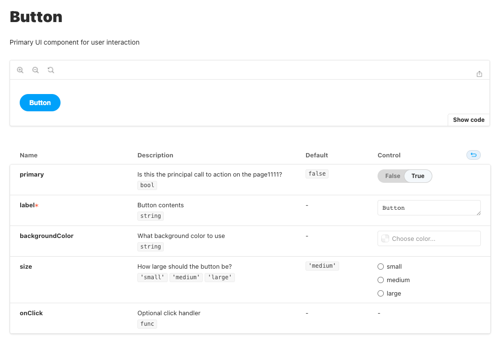

# Storybook

现在前端开发越来越复杂，组件越来越多，成熟的项目可能包含上百个组件，而每个组件又有很多不同的变化，调试这些组件将是非常繁重的任务。


Storybook 定义每个组件的不同状态为 story。Storybook render 这些 story，并提供很多的 [addons](https://storybook.js.org/docs/react/essentials/introduction) 帮助你调试组件、撰写组件文档以及测试组件。

## 安装

在已有的工程里使用下面的命令安装 Storybook

```sh
$ npx storybook init
```

Storybook 会根据你的工程依赖（比如你用的是 React 还是 Vue），提供最优的配置。

这个命令主要做四件事：

- 安装依赖包，比如 `@storybook/addon-essentials`
- 添加 script 命令，比如 `"storybook": "start-storybook -p 6006"`
- 创建配置文件，在 `.storybook` 目录下，有两个文件 `main.js` 和 `preview.js`
- 创建示例，在 `src/stories` 目录下

##### 升级

```sh
$ npx storybook upgrade
```

运行上面的命令升级 Storybook 相关的包至最新版本，同时检查是否有机会运行自动更新配置

##### 自动更新配置

```sh
$ npx storybook@next automigrate
```

## Stories

Story 是一个函数，根据不同的 props 返回组件不同的 render 状态。一个组件可以定义多个 story，表示组件的多种 render 状态。 Storybook 通过 [Component Story Format](https://storybook.js.org/docs/react/api/csf) (CSF) 定义 story，其关键要素是 story 文件的默认导出描述组件，命名导出描述 story。定义 story 最简单的方式是使用 [args](https://storybook.js.org/docs/react/writing-stories/args)。

```js
// src/stories/Button.stories.jsx
import React from "react";
import { Button } from "./Button";

export default {
  title: "Example/Button",
  component: Button
};

// More on component templates: https://storybook.js.org/docs/react/writing-stories/introduction#using-args
const Template = args => <Button {...args} />;

export const Primary = Template.bind({});
Primary.args = {
  primary: true,
  label: "Primary"
};

export const Secondary = Template.bind({});
Secondary.args = {
  label: "Secondary"
};

export const Large = Template.bind({});
Large.args = {
  size: "large",
  label: "Large"
};

export const Small = Template.bind({});
Small.args = {
  size: "small",
  label: "Small"
};
```

[Controls addon](https://storybook.js.org/docs/react/essentials/controls) 通过 args 可以让你很方便地修改组件的参数，从而方便地调试组件不同的状态


### Decorators

Decorator 包装 story 进行额外的渲染，比如提供全局的 [Context](https://zh-hans.reactjs.org/docs/context.html). 

```js
// .storybook/previews.js
import { ThemeContext, themes } from './theme-context';
export const decorators = [
  Story => (
    <ThemeContext.Provider value={themes.dark}>
      <Story />
    </ThemeContext.Provider>
  )
];
```

可以定义全局、组件、story 的 decorator。层级结构是全局 -> 组件 -> story，而且 decorators 数组中后面定义的 decorator 在前面定义的 decorator 上层。

### ArgTypes

Storybook 自动从组件的代码中推断出组件参数的信息，包括参数类型、描述、默认值。

Storebook 的 addons 可以使用这些信息，比如 [Controls](https://storybook.js.org/docs/react/essentials/controls) 根据不同的参数类型，提供不同的控制组件。

组件的参数信息可以通过 [ArgTypes](https://storybook.js.org/docs/react/api/argtypes) 重写，例如

```js
// Button.stories.js|jsx|ts|tsx
export default {
  title: 'Button',
  component: Button,
  argTypes: {
    label: {
      name: 'label',
      type: {
        name: 'string',
        required: true
      },
      description: 'overwritten description',
      defaultValue: 'Button',
      table: {
        type: { 
          summary: 'something short', 
          detail: 'something really really long' 
        },
        defaultValue: {
          summary: 'something short default value', 
          detail: 'something really really long default value' 
        }
      },
      control: {
        type: 'string'
      }
    }
  }
};
```

其中 `table` 应用有 ArgsTable，详情请参考 [ArgsTable Customizing](https://storybook.js.org/docs/react/writing-docs/doc-block-argstable#customizing)。

`control` 应用于 Controls，详情请参考 [Controls Annotation](https://storybook.js.org/docs/react/essentials/controls#annotation)。

## Documents

Storybook 支持两种撰写文档的方法：[DocsPage](https://storybook.js.org/docs/react/writing-docs/docs-page) 和 [MDX](https://storybook.js.org/docs/react/writing-docs/mdx)。

### DocsPage

DocsPage 是开箱即用的零配置默认文档。它将 story、文本描述、组件中的 docgen 注释、参数表和代码示例聚合在一起，生成关于组件的文档



#### Overriding description

```js
Primary.parameters = {
  docs: {
    description: {
      component: 'Component **markdown** description',
      story: 'Story **markdown** description',
    }
  }
};
```

### MDX

Storybook 默认使用 DocsPage 文档，但是当你想要自定义文档格式或者创建更加详细的文档时，可以使用 MDX。

MDX 是一个 [标准文件格式](https://mdxjs.com/)，它结合了 Markdown 和 JSX。

可以在 MDX 中使用 `Doc Blocks` 来快速构建文档和定义 story。

```markdown
<!-- Checkbox.stories.mdx -->
import { Canvas, Meta, Story } from '@storybook/addon-docs';
import { Checkbox } from './Checkbox';

<Meta title="MDX/Checkbox" component={Checkbox} />
export const Template = (args) => <Checkbox {...args} />;

# Checkbox
With `MDX`, we can define a story for `Checkbox` right in the middle of our
Markdown documentation.

<!-- Stories -->
<Canvas>
  <Story 
    name="Unchecked"
    args={{ 
      label: 'Unchecked',
    }}>
    {Template.bind({})}
  </Story>
	<Story 
    name="Checked"
    args={{ 
      label: 'Unchecked', 
      checked: true,
    }}>
    {Template.bind({})}
  </Story>
	<Story 
    name="Secondary"
    args={{
      label: 'Secondary', 
      checked: true, 
      appearance: 'secondary',
    }}>
    {Template.bind({})}
  </Story>
</Canvas>
```


#### Documentation-only MDX

- 当 MDX 文件中没有定义 `<Meta>` 时，该 MDX 文件可以作为别的 component、story 的文档，详情请参考 [CSF Stories with arbitrary MDX](https://github.com/storybookjs/storybook/blob/master/addons/docs/docs/recipes.md#csf-stories-with-arbitrary-mdx)

```js {7-9}
// Button.stories.mdx 
import CustomMDXDocumentation from './Custom-MDX-Documentation.mdx';
export default {
  title: 'Button',
  component: Button,
  parameters: {
    docs: {
      page: CustomMDXDocumentation
    }
  }
};
```

- 当 MDX 文件中定义了 `<Meta>`，但是没有定义 stories 时，可以作为该组件的一个文档节点

#### Embedding stories

```markdown {6}
<!-- MyComponent.stories.mdx -->
import { Story } from '@storybook/addon-docs';
# Some header
And Markdown here

<Story id="some--id" />
```

#### Linking to other stories and pages

```markdown
[Go to specific story canvas](?path=/story/some--id)
[Go to specific documentation page](?path=/docs/some--id)
```

#### Syntax Highlighting

Storybook 的 MDX 自带 Javascript, Markdown, CSS, HTML, Typescript, GraphQL 语言的语法高亮，但是要支持其它语言的语法高亮，需要自己进行扩展，比如使用 [react-syntax-highlighter](https://github.com/react-syntax-highlighter/react-syntax-highlighter).

```js
// .storybook/preview.js
import { PrismLight as SyntaxHighlighter } from 'react-syntax-highlighter';
import scss from 'react-syntax-highlighter/dist/esm/languages/prism/scss';

// Registers and enables scss language support
SyntaxHighlighter.registerLanguage('scss', scss);
```

也可以进行 [单文件配置](https://storybook.js.org/docs/react/writing-docs/mdx#syntax-highlighting)

### Preview and build docs

在 `package.json` 文件中添加下面两个 script 来 preview 和 build 文档

```json
{
  "scripts": {
    "storybook-docs": "start-storybook --docs --no-manager-cache",
    "build-storybook-docs": "build-storybook --docs",
  }
}
```

Build 生成的文件放在 `storybook-static` 文件夹里

### Docs configuration summary


| 选项             | 说明                                                         |
| ---------------- | ------------------------------------------------------------ |
| page             | DocsPage 中自定义文档，可以是 mdx 或者一个返回 React 组件的函数 |
| inlineStories    | 渲染 story 的方式：`true `(inline) / `false` (iframe)        |
| prepareForInline | 一个函数，将 story 的内容从给定的框架转换为 React 可以渲染的内容 |
| component        | DocsPage 中覆盖组件的描述                                    |
| story            | DocsPage 中覆盖 story 的描述                                 |
| disable          | 禁止 story 出现在 Docs 中                                    |
| theme            | 文档主题色，详情请参考 [Theming](https://storybook.js.org/docs/react/configure/theming) |
| source           | 用于 Source Doc Block，详情请参考 [Source](https://storybook.js.org/docs/react/writing-docs/doc-block-source) |

## Configuration

Storybook 的配置文件在 `.storybook` 文件夹里，主要包括下面这些配置文件。

### `main.js`

`main.js` 控制 Storybook 服务器的行为，当你修改这个文件之后，必须重启服务。主要包括下面这些配置：

```js
// .storybook/main.js
module.exports = {
  stories: ['../src/**/*.stories.mdx', '../src/**/*.stories.@(js|jsx|ts|tsx)'],
  addons: ['@storybook/addon-essentials'],
  framework: '@storybook/react',
  core: {
    builder: "@storybook/builder-webpack5",
    disableTelemetry: false, // https://storybook.js.org/docs/react/configure/telemetry#how-to-opt-out
    enableCrashReports: true
  },
  staticDirs: ["../public"],
  webpackFinal: async (config, { configType }) => {
    // Make whatever fine-grained changes you need
    // Return the altered config
    return config;
  },
  viteFinal: viteFinal(config) {},
  babel: async (options) => ({
    // Update your babel configuration here
    ...options,
  }),
  typescript: {},
  features: {},
  refs: {},
  env: (config) => ({...config, EXAMPLE_VAR: 'Example var' })，
  logLevel: 'debug'
};
```

| 选项         | 说明                                                         |
| ------------ | ------------------------------------------------------------ |
| stories      | 确定哪些文件为 story 文件，文件的匹配使用 [picomatch](https://github.com/micromatch/picomatch) 支持的语法，详情请参考 [Configure story loading]( https://storybook.js.org/docs/react/configure/overview#configure-story-loading) |
| addons       | 设置 Storybook 加载的 [addons](https://storybook.js.org/addons/) 列表 |
| framework    | 基于项目使用的框架来配置 Storybook。安装 Storybook 时，它是自动推断出工程使用的框架，目前 Storybook 主要支持这些 [框架](https://storybook.js.org/docs/react/api/frameworks-feature-support) |
| core         | 配置 Storybook 的内部特性，比如使用哪个构建工具，`{ builder: "@storybook/builder-webpack5" }` |
| staticDirs   | 设置 Storybook 要加载的静态文件的目录列表，详情请参考 [Images, fonts, and assets](https://storybook.js.org/docs/react/configure/images-and-assets#serving-static-files-via-storybook-configuration) |
| webpackFinal | 定制 Webpack 的配置，详情请参考 [Webpack](https://storybook.js.org/docs/react/builders/webpack) |
| viteFinal    | 定制 Vite 的配置，详情请参考 [Vite](https://storybook.js.org/docs/react/builders/vite) |
| babel        | 定制 Babel 的配置，详情请参考 [Babel](https://storybook.js.org/docs/react/configure/babel) |
| typescript   | 定制 Typescript 的配置，详情请参考 [TypeScript](https://storybook.js.org/docs/react/configure/typescript) |
| features     | 启用 Storybook 额外的一些配置，详情请参考 [Feature flags](https://storybook.js.org/docs/react/configure/overview#feature-flags) |
| refs         | 配置 [Storybook composition](https://storybook.js.org/docs/react/sharing/storybook-composition) |
| env          | 自定义 Storybook 环境变量，详情请参考 [Environment variables](https://storybook.js.org/docs/react/configure/environment-variables) |
| logLevel     | 控制日志输出，有这些选项：`silly`, `verbose`, `info` (默认), `warn`, `error`, `silent` |

### `preview.js`

`preview.js` 通过命名导出，来控制 story 怎样被渲染。也可以把它当做 Storybook 的入口文件，一些全局样式，可以通过这个文件进行全局导入。

它主要包含下面这些命名导出。

#### parameters

[Parameters](https://storybook.js.org/docs/react/writing-stories/parameters) 是一组关于 story 的静态元数据，通常用于控制 Storybook 特性和 addon 的行为。下面是 [Essential addons](https://storybook.js.org/docs/react/essentials/introduction) 的一些配置

```js
// .storybook/preview.js
import { INITIAL_VIEWPORTS } from "@storybook/addon-viewport";
import CustomMDXDocumentation from './Custom-MDX-Documentation.mdx';

export const parameters = {
  // https://storybook.js.org/docs/react/essentials/controls
  controls: {
    expanded: true,
    matchers: {
      color: /(background|color)$/i,
      date: /Date$/
    },
    presetColors: [
      { color: "#ff4785", title: "Coral" },
      "rgba(0, 159, 183, 1)",
      "#fe4a49"
    ]
  },
  // https://storybook.js.org/docs/react/essentials/actions#automatically-matching-args
  actions: { argTypesRegex: "^on[A-Z].*" },
  // https://storybook.js.org/docs/react/essentials/viewport#configuration
  viewport: {
    viewports: INITIAL_VIEWPORTS
  },
  // https://storybook.js.org/docs/react/essentials/backgrounds#configuration
  backgrounds: {
    values: [
      { name: "red", value: "#f00" },
      { name: "green", value: "#0f0" },
      { name: "blue", value: "#00f" }
    ]
  },
  // https://storybook.js.org/docs/react/writing-docs/docs-page#with-mdx-documentation
  docs: {
    page: CustomMDXDocumentation
  },
  // https://storybook.js.org/docs/react/configure/story-layout
  layout: "fullscreen" // "centered", "fullscreen", "padded"(默认)
};
```

#### decorators

[Decorators](https://storybook.js.org/docs/react/writing-stories/decorators) 是一种用额外的“渲染”功能包装 story 的方法，全局的 decorators 配置将会应用到所有的 story.

```js
// .storybook/preview.js
export const decorators = [
  (Story, Context) => (
    <div style={{ margin: '3em' }}>
      <Story />
    </div>
  )
];
```

Decorators 的第二个参数是 [story context](https://storybook.js.org/docs/react/writing-stories/decorators#context-for-mocking).

#### globalTypes

[Globals](https://storybook.js.org/docs/react/essentials/toolbars-and-globals#globals) 是 Storybook 的全局输入，不特定于任何 story。它的一个用途是用于配置额外的 toolbar menus，例如下面创建一个 theme menu:

```js
// .storybook/preview.js
export const globalTypes = {
  theme: {
    name: 'Theme',
    description: 'Global theme for components',
    defaultValue: 'light',
    toolbar: {
      icon: 'circlehollow',
      // Array of plain string values or MenuItem shape (see below)
      items: ['light', 'dark'],
      // Property that specifies if the name of the item will be displayed
      showName: true,
      // Change title based on selected value
      dynamicTitle: true,
    }
  }
};
```

#### loaders

[Loaders](https://storybook.js.org/docs/react/writing-stories/loaders) 是为 story 和 decorator 加载数据的异步函数。Story 的 loaders 在 story 渲染之前运行，加载的数据通过 story 的 render context 注入到 story 中。下面的例子加载 `currentUser`， 然后通过 `loaded.currentUser` 注入到所有的 story。

```js
// .storybook/preview.js
import fetch from 'node-fetch';
export const loaders = [
  async () => ({
    currentUser: await (await fetch('https://jsonplaceholder.typicode.com/users/1')).json(),
  }),
];
```

### `preview-head.html` & `preview-body.html` 

在 Storybook 中，story 是在特定 "preview iframe" 中呈现，如果你想要在 "preview iframe" head 或者 body 中添加额外的元素，比如样式表，可以通过 `preview-head.html` / `preview-body.html`。

```js
// font
<link rel=”preload” href=”your/font” />

//js
<script src="xxx.js"></script>

// stylesheets
<link href="xx.css" rel="stylesheet" type="text/css">
<style>
  #app {}
<style>
```

### `manager.js`

`manager.js` 控制 Storybook 的 UI，详情请参考 [Features and behavior](https://storybook.js.org/docs/react/configure/features-and-behavior)。比如我们可以修改 Storybook UI 的 theme.

首先创建 `YourTheme.js` 文件

```js
// .storybook/YourTheme.js

import { create } from '@storybook/theming';

export default create({
  base: 'light',
  brandTitle: 'My custom storybook',
  brandUrl: 'https://example.com',
  brandImage: 'https://place-hold.it/350x150',
  brandTarget: '_blank',
});
```

然后在  `manager.js` 引入这个 theme

```js
// .storybook/manager.js

import { addons } from '@storybook/addons';
import yourTheme from './YourTheme';

addons.setConfig({
  theme: yourTheme,
});
```

## Testing

Comming soon

## Publishing

Comming soon

## Existing problems

- ArgTypes 没有 Array 数据类型，在 Controls addon 设置值时，默认给的值是 `{}`，导致 Storybook crash。
- Source 自动生成的代码还是存在很多问题

## References

- [Storybook](https://storybook.js.org/)
- [Component Story Format](https://www.componentdriven.org/)
- [JSDoc](https://jsdoc.app/)
- [MDX](https://mdxjs.com/)
- [Chromatic](https://www.chromatic.com/)
- [CSF Stories with arbitrary MDX](https://github.com/storybookjs/storybook/blob/master/addons/docs/docs/recipes.md#csf-stories-with-arbitrary-mdx)
- [Jest](https://jestjs.io/)
- [Test-Library](https://testing-library.com/)
- [picomatch](https://github.com/micromatch/picomatch)
- [react-syntax-highlighter](https://github.com/react-syntax-highlighter/react-syntax-highlighter)