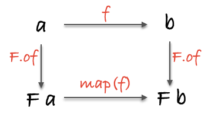
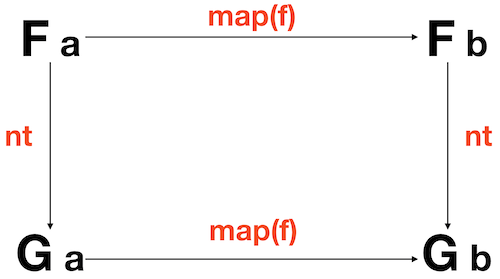

# Javascript 函数式编程

## 纯函数

### 什么是纯函数

纯函数是这样一种函数，即相同的输入，永远会得到相同的输出，例如

```js
const add = (x, y) => x + y;
```

任何时候调用 `add(1,2)` 得到的结果永远是 `3`

### 什么是副作用

副作用是在计算结果的过程中，系统状态的一种变化，或者与外部世界进行的可观察的交互。

副作用包含，但不限于：

- 更改文件系统
- 往数据库插入记录
- 发送一个 http 请求
- 可变数据
- 打印 log
- 获取用户输入
- DOM 查询
- 访问系统状态

概括来讲，只要是跟函数外部环境发生的交互就都是副作用。函数式编程的哲学就是假定副作用是造成不正当行为的主要原因。

### 纯函数的作用

#### 可缓存性

纯函数总能够根据输入来做缓存，实现缓存的一种典型方式是 memoize 技术

```js
var squareNumber  = memoize(function(x){ return x*x; });

squareNumber(4);
//=> 16

squareNumber(4); // 从缓存中读取输入值为 4 的结果
//=> 16
```

#### 自文档化

纯函数的依赖很明确，因此更易于观察和理解—没有偷偷摸摸的小动作

#### 可移植性

可移植性可以意味着把函数序列化（serializing）并通过 socket 发送，也意味着代码能够在 web workers 中运行

#### 可测试性

纯函数让测试更加容易，只需简单地给函数一个输入，然后断言输出就好了

#### 合理性

由于纯函数总是能够根据相同的输入返回相同的输出，所以它们就能够保证总是返回同一个结果，这也就保证了引用透明性。我们可以使用一种叫做 **等式推导** 的技术来分析代码。

#### 并行性

纯函数也不会因副作用而进入竞争态

## 柯里化 Curry

只传递给函数一部分参数来调用它，让它返回一个函数去处理剩下的参数。

```js
function curry(fn) {
  const arity = fn.length;

  return function $curry(...args) {
    if (args.length < arity) {
      return $curry.bind(null, ...args);
    }

    return fn.call(null, ...args);
  };
}
```

Curry 的应用非常广泛，例如

```js
const match = curry((what, s) => s.match(what));

const hasSpaces = match(/\s+/g);
// function(x) { return x.match(/\s+/g) }

hasSpaces("hello world");
// [ ' ' ]
```

## 组合 Compose

将多个函数组合，产生一个崭新的函数

```js
const compose = (...fns) => (...args) => fns.reduceRight((res, fn) => [fn.call(null, ...res)], args)[0];
```

Compose 满足结合律

```js
compose(f, compose(g, h)) == compose(compose(f, g), h);
```

就像搭积木一样，可以随心所欲地组合函数

```js
const loudLastUpper = compose(exclaim, toUpperCase, head, reverse);
const last = compose(head, reverse);
const angry = compose(exclaim, toUpperCase);
const loudLastUpper = compose(angry, last);
```

### Pointfree

**Pointfree** 模式指的是函数无须提及将要操作的数据是什么样的（即不需要指明参数）。一等公民的函数、柯里化以及组合协作起来非常有助于实现这种模式。

```js
// 非 pointfree，因为提到了数据：word
const snakeCase = word => word.toLowerCase().replace(/\s+/ig, '_');

// pointfree
const snakeCase = compose(replace(/\s+/ig, '_'), toLowerCase);
```

### Debug

使用组合时，如果组合的函数很多，可能会导致错误（主要是传递的参数类型和函数想要的参数类型不一致），可以使用不纯的 `trace` 函数来追踪代码的执行情况。

```js
const trace = curry(function(tag, x){
  console.log(tag, x);
  return x;
});
```

来看一个例子

```js
const dasherize = compose(
  intercalate('-'),
  toLower,
  split(' '),
  replace(/\s{2,}/ig, ' '),
);

dasherize('The world is a vampire');
// TypeError: Cannot read property 'apply' of undefined
```

报错了，来 `trace` 一下

```js
const dasherize = compose(
  intercalate('-'),
  toLower,
  trace('after split'),
  split(' '),
  replace(/\s{2,}/ig, ' '),
);

dasherize('The world is a vampire');
// after split [ 'The', 'world', 'is', 'a', 'vampire' ]
```

哦，`toLower` 的参数是一个数组，所以需要先用 `map` 一下

```js
const dasherize = compose(
  intercalate('-'),
  map(toLower),
  split(' '),
  replace(/\s{2,}/ig, ' '),
);

dasherize('The world is a vampire'); 
// 'the-world-is-a-vampire'
```

### 范畴学

在范畴学中，有一个概念叫做...范畴。有着以下这些组件（component）的搜集（collection）就构成了一个范畴：

- 对象的搜集
- 态射的搜集
- 态射的组合
- identity 这个独特的态射

#### 对象的搜集

对象就是数据类型，例如 `String`、`Boolean`、`Number` 和 `Object` 等

#### 态射的搜集

态射是标准的、普通的纯函数。

#### 态射的组合

就是 `compose`

#### identity 这个独特的态射

```js
const id = x => x;
```

`id` 函数跟组合一起使用简直完美。下面这个特性对所有的一元函数（接收一个参数的函数） `f` 都成立

```js
// 结合律和同一律
compose(id, f) == compose(f, id) == f;
```

## 示例应用

### 声明式 vs 命令式

- **命令式编程（Imperative）**：详细的命令机器怎么（How）去处理一件事情以达到你想要的结果（What）；
- **声明式编程（ Declarative）**：只告诉你想要的结果（What），机器自己摸索过程（How）

**声明式编程**意味着我们要写表达式，而不是一步一步的指示。通过下面的列子，我们来体会一下**声明式编程**和**命令式编程**不同之处。

```js
// imperative
const authenticate = (form) => {
  const user = toUser(form);
  return logIn(user);
};

// declarative
const authenticate = compose(logIn, toUser);
```

### 函数式 Flickr 应用

Flickr 应用将做 4 件事：

1. 根据特定搜索关键字构造 url
2. 向 flickr 发送 api 请求
3. 把返回的 json 转为 html 图片
4. 把图片显示在屏幕上

下面是 Flickr 应用源代码，感受一下函数式编程

```js
// 封装不纯的函数
const Impure = {
  getJSON: curry((callback, url) => $.getJSON(url, callback)),
  setHtml: curry((sel, html) => $(sel).html(html)),
  trace: curry((tag, x) => { console.log(tag, x); return x; }),
};

// 构造 flickr url
const host = 'api.flickr.com';
const path = '/services/feeds/photos_public.gne';
const query = t => `?tags=${t}&format=json&jsoncallback=?`;
const url = t => `https://${host}${path}${query(t)}`;

const prop = curry((property, object) => object[property]);

const img = src => $('', { src });                   // image link ->  tag
const mediaUrl = compose(prop('m'), prop('media'));         // 解析 json response
const mediaToImg = compose(img, mediaUrl);                  // 组合
const images = compose(map(mediaToImg), prop('items'));     // json response ->  tag

const render = compose(Impure.setHtml('#js-main'), images); // json response -> 显示图片
const app = compose(Impure.getJSON(render), url);           // url -> json response

app('cats');
```

## Hindley-Milner 类型签名

函数的类型签名，是很好的文档，同时通过函数的类型签名，能推测出这个函数的作用。下面是 *ramdajs* 的 [`filter`](https://ramdajs.com/docs/#filter) 的函数签名。

```js
filter :: Filterable f => (a → Boolean) → f a → f a
const filter = curry((f, xs) => xs.filter(f))
```

## 容器 Container

### 函子 Functor

**Functor** 是实现了 `map` 函数并遵守一些特定规则的对象

### Identity

**Identity** 可以装载任意类型的值，然后通过 `map  ` 来处理封装的值

```js
class Identity {
  constructor(x) {
    this.$value = x;
  }
  
  static of(x) {
    return new Container(x);
  }
  
  map(fn) {
    return constructor.of(fn(this.$value));
  }
}
```

**Example**

```js
Identity.of(2).map(two => two + 2});
//=> Identity(4)
```

### Maybe

**Maybe** 是另一种容器，调用  `map  ` 的时候会先判断值是不是 `null` 或者 `undefined`

```js
class Maybe {
  constructor(x) {
    this.$value = x;
  }
  
  static of(x) {
    return new Maybe(x);
  }

  get isNothing() {
    return this.$value === null || this.$value === undefined;
  }

  map(fn) {
    return this.isNothing ? this : Maybe.of(fn(this.$value));
  }
}
```

**Example**

```js
// safeHead :: [a] -> Maybe(a)
const safeHead = xs => Maybe.of(xs[0]);

// streetName :: Object -> Maybe String
const streetName = compose(map(prop('street')), safeHead, prop('addresses'));

streetName({ addresses: [] });
// Nothing

streetName({ addresses: [{ street: 'Shady Ln.', number: 4201 }] });
// Just('Shady Ln.')
```

#### 释放容器里的值

如果我们想从 Maybe 容器返回一个自定义的值，然后还能继续执行后面的代码，可以借助一个帮助函数 `maybe`

```js
//  maybe :: b -> (a -> b) -> Maybe a -> b
const maybe = curry(function(v, f, m) {
  return m.isNothing() ? v : f(m.__value);
});
```

`maybe` 可以帮助我们避免普通命令式的 `if/else` 语句：`if(x !== null) { return f(x) }`

**Example**

```js
// withdraw :: Number -> Account -> Maybe(Account)
const withdraw = curry((amount, { balance }) =>
  Maybe.of(balance >= amount ? { balance: balance - amount } : null));

// remainingBalance :: Account -> String
const remainingBalance = ({ balance }) => `Your balance is $${balance}`;

// getTwenty :: Account -> String
const getTwenty = compose(maybe('You are broke!', remainingBalance), withdraw(20));

getTwenty({ balance: 200.00 }); 
// 'Your balance is $180.00'

getTwenty({ balance: 10.00 }); 
// 'You are broke!'
```

### Either

使用 **Either** 代替 `throw/catch`，以一种平静温和的方式处理错误

```js
class Either {
  constructor(x) {
    this.$value = x;
  }
  
  static of(x) {
    return new Right(x);
  }
}

class Left extends Either {
  map(f) {
    return this;
  }
}

class Right extends Either {
  map(f) {
    return Either.of(f(this.$value));
  }
}

const left = x => new Left(x);

// either :: (a -> c) -> (b -> c) -> Either a b -> c
const either = curry((f, g, e) => {
  return e.isLeft ? f(e.$value) : g(e.$value);
});
```

**Example**

```js
Either.of('rain').map(str => `b${str}`); 
// Right('brain')

left('rain').map(str => `It's gonna ${str}, better bring your umbrella!`); 
// Left('rain')

Either.of({ host: 'localhost', port: 80 }).map(prop('host'));
// Right('localhost')

left('rolls eyes...').map(prop('host'));
// Left('rolls eyes...')
```

### IO

**IO** 把非纯执行动作捕获到包裹函数里，目的是延迟执行这个非纯动作。这样做的目的是由用户决定什么时候执行这个非纯的动作。

```js
class IO {
  constructor(fn) {
    this.unsafePerformIO = fn;
  }
  
  static of(x) {
    return new IO(() => x);
  }

  map(fn) {
    return new IO(compose(fn, this.unsafePerformIO));
  }
}
```

**Example**

```js
// $ :: String -> IO [DOM]
const $ = selector => new IO(() => document.querySelectorAll(selector));

$('#myDiv').map(head).map(div => div.innerHTML).unsafePerformIO();
// I am some inner html
```

### Task

**Task** 处理异步任务

```js
class Task {
  constructor(fork) {
    this.fork = fork;
  }
  
  static of(x) {
    return new Task((_, resolve) => resolve(x));
  }

  static rejected(x) {
    return new Task((reject, _) => reject(x));
  }

  map(fn) {
    return new Task((reject, resolve) => this.fork(reject, compose(resolve, fn)));
  }
}
```

**Example**

```js
// -- Pure application -------------------------------------------------
// blogPage :: Posts -> HTML
const blogPage = Handlebars.compile(blogTemplate);

// renderPage :: Posts -> HTML
const renderPage = compose(blogPage, sortBy(prop('date')));

// blog :: Params -> Task Error HTML
const blog = compose(map(renderPage), getJSON('/posts'));


// -- Impure calling code ----------------------------------------------
blog({}).fork(
  error => $('#error').html(error.message),
  page => $('#main').html(page),
);
```

### Compose

组合多个 Functor

```js
const createCompose = curry((F, G) => class Compose {
  constructor(x) {
    this.$value = x;
  }
  
  static of(x) {
    return new Compose(F(G(x)));
  }
  
  map(fn) {
    return new Compose(this.$value.map(x => x.map(fn)));
  }
});
```

**Example**

```js
const TaskMaybe = createCompose(Task.of, Maybe.of); 
const sayHi = R.compose(R.map(R.concat('Hello ')), TaskMaybe.of);
sayHi('cp3hnu');
// Task(Maybe('Hello cp3hnu'))
```

### 定律

#### 同一律 identity

```js
map(id) === id;
```

#### 组合 composition

```js
compose(map(f), map(g)) === map(compose(f, g));
```

#### 其它

```js
compose(P.of, f) === compose(map(f), P.of);
```




## 单子 Monad

### 指向函子 Pointed Functor

**Pointed Functor** 是实现了 `of` 方法的 **Functor**

### 单子 Monad

**Monad** 是可以变扁（flatten）的 **Pointed Functor**

**Monad** 是拥有 `of` 和 `chain` 函数的 **Functor**

### `join`

将相同类型的双层嵌套容器变扁，返回单层容器。

`join` 的实现很简单，我们用 Maybe 举例说明一下

```js
Maybe.prototype.join = () => this.isNothing() ? Maybe.of(null) : this.$value;

// join :: Monad m => m (m a) -> m a
const join = mma => mma.join();
```

### `chain`

和 `map` 类似，对容器里的数据进行转换。但是转换后的数据类型是容器类型，`map` 将行成双层嵌套容器，而 `chain` 会将双层嵌套容器变扁返回单层容器。`chain` 在很多语言里叫做 `flatMap`，比如 Swift.

> 这种方式只适用于两个相同类型的嵌套容器

可以使用 `map/join` 来实现 `chain` 

```js
Maybe.prototype.chain = (fn) => this.map(fn).join();

// chain :: Monad m => (a -> m b) -> m a -> m b
const chain = curry((f, m) => m.map(f).join());

// or

// chain :: Monad m => (a -> m b) -> m a -> m b
const chain = f => compose(join, map(f));
```

### 各容器 `join`、 `chain` 的实现

[传送门](https://github.com/MostlyAdequate/mostly-adequate-guide/blob/master/appendix_b.md)

### 定律

#### 结合律 associativity

```js
 compose(join, map(join)) == compose(join, join)
```


#### 同一律 identity

```js
compose(join, M.of) === compose(join, map(M.of)) === id;
```


#### 其它

```js
const mcompose = (f, g) => compose(chain(f), g);

// left identity
// chain(M.of) === id 
mcompose(M.of, f) === f;

// right identity
// compose(chain(f), M.of) === f;
mcompose(f, M.of) === f;

// associativity
mcompose(mcompose(f, g), h) === mcompose(f, mcompose(g, h));
```

## 应用函子 Applicative Functor

### 应用函子 Applicative Functor

**Applicative Functor** 是实现了 `ap` 方法的 **Pointed Functor**

 `ap` 方法的目的是让两个容器相互应用，比如两个容器进行计算

```js
add(Identity.of(2), Identity.of(3));
// NAN
```

要想实现这种运算可以使用 `ap` 方法

```js
Identity.of(2).map(add).ap(Identity.of(3));
// Identity(5)

// or
map(add, Identity.of(2)).ap(Identity.of(3));
// Identity(5)
```

 `ap` 方法的实现

```js
Identity.prototype.ap = otherIdentity => otherIdentity.map(this.$value);
```

`ap` 方法遵循下面的规律

```js
F.of(x).map(f) == F.of(f).ap(F.of(x))
```

因此上面的运算也可以这样实现

```js
Identity.of(add).ap(Identity.of(2)).ap(Identity.of(3));
// Identity(5)
```

### 举个栗子

假设我们要创建一个旅游网站，既需要获取游客目的地的列表，还需要获取地方事件的列表。这两个请求就是相互独立的 api 调用

```js
// Http.get :: String -> Task Error HTML

var renderPage = curry(function(destinations, events) { /* render page */  });

Task.of(renderPage).ap(Http.get('/destinations')).ap(Http.get('/events'))
```

两个请求将会同时立即执行，当两者的响应都返回之后，`renderPage` 就会被调用，类似于 `Promise.all`

### Lift

以一种 Pointfree 的方式调用 Applicative Functor

```js
const liftA2 = curry((g, f1, f2) => f1.map(g).ap(f2));

const liftA3 = curry((g, f1, f2, f3) => f1.map(g).ap(f2).ap(f3));

// liftA4, etc

// exmaple
liftA2(add, Identity.of(2), Identity.of(3));
```

### 各容器 `ap` 的实现

[传送门](https://github.com/MostlyAdequate/mostly-adequate-guide/blob/master/appendix_b.md)

### 定律

#### 同一律 identity

```js
A.of(id).ap(v) == v
```

#### 同态 homomorphism

```js
A.of(f).ap(A.of(x)) == A.of(f(x))
```

#### 互换 interchange

```js
v.ap(A.of(x)) === A.of(f => f(x)).ap(v);
```

#### 组合 composition

```js
A.of(compose).ap(u).ap(v).ap(w) === u.ap(v.ap(w));
```

## 自然变换 Natural Transformations

**Natural Transformations** 实现类型转换，解决多种不同类型容器嵌套的问题。例如下面的场景

```js
// getValue :: Selector -> Task Error (Maybe String)
// validate :: String -> Either ValidationError String
// postComment :: String -> Task Error Comment

// saveComment :: () -> Task Error (Maybe (Either ValidationError (Task Error Comment)))
const saveComment = compose(
  map(map(map(postComment))),
  map(map(validate)),
  getValue('#comment'),
);
```

多种类型容器嵌套，同时转换数据时要使用多个嵌套 `map` 方法

### 有原则的类型转换

```js
// idToMaybe :: Identity a -> Maybe a
const idToMaybe = x => Maybe.of(x.$value);

// idToIO :: Identity a -> IO a
const idToIO = x => IO.of(x.$value);

// eitherToTask :: Either a b -> Task a b
const eitherToTask = either(Task.rejected, Task.of);

// ioToTask :: IO a -> Task () a
const ioToTask = x => new Task((reject, resolve) => resolve(x.unsafePerform()));

// maybeToTask :: Maybe a -> Task () a
const maybeToTask = x => (x.isNothing ? Task.rejected() : Task.of(x.$value));

// arrayToMaybe :: [a] -> Maybe a
const arrayToMaybe = x => Maybe.of(x[0]);
```

> 在 JavaScript 里，并不能把异步变到同步，所以无法实现 `taskToIO` 方法，那是个"超自然"变换

### 同构 Isomorphic

当把一个值前后怎么转换都不会丢失任何数据时，可称之为**同构**，Promise 和 Task 就是同构

```js
// promiseToTask :: Promise a b -> Task a b
const promiseToTask = x => new Task((reject, resolve) => x.then(resolve).catch(reject));

// taskToPromise :: Task a b -> Promise a b
const taskToPromise = x => new Promise((resolve, reject) => x.fork(reject, resolve));

const x = Promise.resolve('ring');
taskToPromise(promiseToTask(x)) === x;

const y = Task.of('rabbit');
promiseToTask(taskToPromise(y)) === y;
```

### 解决问题

```js
// getValue :: Selector -> Task Error (Maybe String)
// validate :: String -> Either ValidationError String
// postComment :: String -> Task Error Comment

// saveComment :: () -> Task Error Comment
const saveComment = compose(
  chain(postComment),
  chain(eitherToTask),
  map(validate),
  chain(maybeToTask),
  getValue('#comment'),
);
```

### 定律

```js
// nt :: (Functor f, Functor g) => f a -> g a
compose(map(f), nt) === compose(nt, map(f));
```




## 遍历 Traversing

将嵌套的容器类型翻转

### 抛出问题

第一个问题

```js
// readFile :: FileName -> Task Error String

// firstWords :: String -> String
const firstWords = compose(intercalate(' '), take(3), split(' '));

// tldr :: FileName -> Task Error String
const tldr = compose(map(firstWords), readFile);

map(tldr, ['file1', 'file2']);
// [Task('hail the monarchy'), Task('smash the patriarchy')]
```

`List (Task)` 数据没有多大的意义，希望得到 `Task (List)`，要么失败，要么成功返回结果列表

第二个问题

```js
// getAttribute :: String -> Node -> Maybe String
// $ :: Selector -> IO Node

// getControlNode :: Selector -> IO (Maybe (IO Node))
const getControlNode = compose(
  map(map($)),
  map(getAttribute('aria-controls')),
  $
);
```

`getControlNode` 的类型是 `IO (Maybe (IO))`，如果里面的 `Maybe (IO)` 能翻转类型成 `IO (Maybe)`，再利用 `join` 方法就能简化为 `IO (Maybe)`

### Traversable 接口

`Traversable` 接口有两个方法：`sequence` 和 `traverse`

`sequence` 单纯地进行类型翻转； `traverse` 数据转换的同时进行类型翻转

```js
// sequence :: (Applicative f, Traversable t) => (a -> f a) -> t (f a) -> f (t a)
const sequence = curry((of, f) => f.sequence(of));

// traverse :: (Applicative f, Traversable t) => (a -> f a) -> (a -> f b) -> t a -> f (t b)
const traverse = curry((of, fn, f) => f.traverse(of, fn));
```

看看类型翻转的例子

```js
sequence(List.of, Maybe.of(['the facts'])); // [Just('the facts')]
sequence(Task.of, new Map({ a: Task.of(1), b: Task.of(2) })); // Task(Map({ a: 1, b: 2 }))
sequence(IO.of, Either.of(IO.of('buckle my shoe'))); // IO(Right('buckle my shoe'))
sequence(Either.of, [Either.of('wing')]); // Right(['wing'])
sequence(Task.of, left('wing')); // Task(Left('wing'))
```

`sequence` 的实现

```js
Right.prototype.sequence = (of) => this.$value.map(Either.of); // 参数 of 被忽略了
Left.prototype.sequence = (of) => of(this); // 参数 of 仅仅是为了在 map 不可用的情况下而被传入的，比如 Left
```

`traverse` 的实现

```js
Right.prototype.traverse = (of, fn) => fn(this.$value).map(Either.of);
```

### 各容器 `sequence`、`traverse` 的实现

[传送门](https://github.com/MostlyAdequate/mostly-adequate-guide/blob/master/appendix_b.md)

### 解决问题

第一个问题

```js
// readFile :: FileName -> Task Error String

// firstWords :: String -> String
const firstWords = compose(intercalate(' '), take(3), split(' '));

// tldr :: FileName -> Task Error String
const tldr = compose(map(firstWords), readFile);

traverse(Task.of, tldr, ['file1', 'file2']);
// Task(['hail the monarchy', 'smash the patriarchy']);
```

第二个问题

```js
// getAttribute :: String -> Node -> Maybe String
// $ :: Selector -> IO Node

// getControlNode :: Selector -> IO (Maybe Node)
const getControlNode = compose(
  chain(traverse(IO.of, $)),
  map(getAttribute('aria-controls')),
  $
);
```

### 定律

#### 同一律 identity

```js
compose(sequence(A.of), map(A.of)) === A.of

traverse(A.of, A.of) === A.of;
```

#### 自然 naturality

```js
(of, nt) => compose(nt, sequence(of)) === (of, nt) => compose(sequence(of), map(nt))
```

## 幺半群 Monoid

### 半群 Semigroup

一个拥有 `concat` 函数的对象，其中`concat` 方法是满足结合律的二元运算。例如 `Array`

```js
[1].concat([2]) // [1, 2]
```

让我们为加法实现这个方法

```js
const Sum = (x) => ({
	x,
	concat: (other) => Sum(x + other.x),
})

Sum(1).concat(Sum(3)) // Sum(4)
Sum(4).concat(Sum(37)) // Sum(41)
```

还有很多

```js
const Product = (x) => ({ x, concat: (other) => Product(x * other.x) })
const Min = (x) => ({ x, concat: (other) => Min(x < other.x ? x : other.x) })
const Max = (x) => ({ x, concat: (other) => Max(x > other.x ? x : other.x) })
const Any = (x) => ({ x, concat: (other) => Any(x || other.x) })
const All = (x) => ({ x, concat: (other) => All(x && other.x) })
```

## Functor 也可以是 Semigroup

当容器的值是 Semigroup 时，这个容器也是 Semigroup，例如 `Identity`

```js
Identity.prototype.concat = function (other) {
	return new Identity(this.$value.concat(other.$value))
}
```

同样的，任何由 Semigroup 组成的对象同样也都是 Semigroup

```js
const Analytics = (clicks, path, idleTime) => ({
	clicks,
	path,
	idleTime,
	concat: (other) =>
		Analytics(
			clicks.concat(other.clicks),
			path.concat(other.path),
			idleTime.concat(other.idleTime),
		),
})
```

### 幺半群 Monoid

**Monoid** = **Semigroup** + 一个特殊的单位元（Identity）

#### 单位元 Identity

因为任一个数加 0 等于这个数本身，所以加法的单位元是 0。可以把这个单位元命名为 `empty`

**Monoid** 来自以 `concat` 为态射，以 `empty` 为 identity 的单对象范畴

```js
Sum.empty = () => Sum(0)
Product.empty = () => Product(1)
Min.empty = () => Min(Infinity)
Max.empty = () => Max(-Infinity)
Any.empty = () => Any(false)
All.empty = () => All(true)
Array.empty = () => []
String.empty = () => ''
```

#### 单位元的作用

可以作为函数的缺省值

```js
const settings = (prefix=String.empty(), overrides=Array.empty(), total=Sum.empty()) => ...
```

可以作为变量的默认值

```js
let sum = Sum(0)
```

累加器初始值

我们先来看一下累加器常见的错误

```js
// concat :: Semigroup s => s -> s -> s
const concat = x => y => x.concat(y)

[Sum(1), Sum(2)].reduce(concat) 
// Sum(3)

[].reduce(concat) 
// TypeError: Reduce of empty array with no initial value
```

如果 `reduce` 没有初始值时，当遇到一个空数组时，就会 Boom 💥

让我们用柯里化的 `reduce` 写一个安全的函数，这个函数的 `empty` 不再是可选的，我们把它命名为 `fold`:

```js
// fold :: Monoid m => m -> [m] -> m
const fold = reduce(concat)
```

初始的 `m` 是起始点 `empty` 值

```js
fold(Sum.empty(), [Sum(1), Sum(2)]) // Sum(3)
fold(Sum.empty(), []) // Sum(0)

fold(Any.empty(), [Any(false), Any(true)]) // Any(true)
fold(Any.empty(), []) // Any(false)

fold(Either.of(Max.empty()), [Right(Max(3)), Right(Max(21)), Right(Max(11))]) // Right(Max(21))
fold(Either.of(Max.empty()), [Right(Max(3)), Left('error retrieving value'), Right(Max(11))]) // Left('error retrieving value')

fold(IO.of([]), ['.link', 'a'].map($)) // IO([<a>, <button class="link"/>, <a>])
```

在最后的两个例子里，我们手动制造了一个 `empty` 值，因为我们没办法在类型上定义一个 `empty`，但是并无大碍。

拥有类型的语言可以自己解决这个问题，在这例子里我们是自己传进去的

## 不能成为 Monoid

有一些 Semigroup 是不能变成 Monoid 的，因为他们没法提供初始值。例如 `First`：

```js
const First = (x) => ({ x, concat: (other) => First(x) })

Map({ id: First(123), isPaid: Any(true), points: Sum(13) }).concat(
	Map({ id: First(2242), isPaid: Any(false), points: Sum(1) }),
)
// Map({id: First(123), isPaid: Any(true), points: Sum(14)})
```

### 组合 Compose 作为 Monoid

类型 `a -> a` 的函数，它的定义域与值域在相同的集合内，称作**自同态（endomorphisms）**

 `Endo` 就是这样的 Monoid

```js
const Endo = run => ({
  run,
  concat: other =>
    Endo(compose(run, other.run))
})

Endo.empty = () => Endo(identity)
```

Example

```js
// thingDownFlipAndReverse :: Endo [String] -> [String]
const thingDownFlipAndReverse = fold(Endo.empty(), [Endo(reverse), Endo(sort), Endo(append('thing down')])

thingDownFlipAndReverse.run(['let me work it', 'is it worth it?'])
// ['thing down', 'let me work it', 'is it worth it?']
```

## References

- [Mostly Adequate Guide to Functional Programming](https://github.com/MostlyAdequate/mostly-adequate-guide)
- [Mostly Adequate Guide to Functional Programming 中文版](https://github.com/llh911001/mostly-adequate-guide-chinese)
- [Functional Programming Jargon](https://github.com/hemanth/functional-programming-jargon)
- [Functional-Light-JS](https://github.com/getify/Functional-Light-JS)
- [ramdajs](https://ramdajs.com/docs/#)
- [fp-ts](https://github.com/gcanti/fp-ts)
- [folktale](https://github.com/origamitower/folktale)
- [rxjs](https://github.com/ReactiveX/rxjs)
- [Math is Fun](https://www.mathsisfun.com/numbers/index.html)