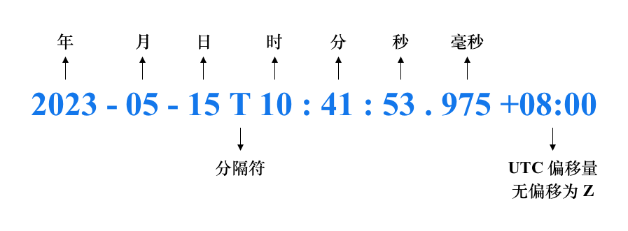

# Date 详解

在实际的应用开发中，我们经常会用到 Date 类型，尤其是 Date 类型与 String 类型互相转换。但是因为日期的表示形式多种多样，所以一不小心可能就会出错，尤其是浏览器兼容性问题。这篇文章将详细讲解 Date 类型，重点是 Date 类型与 String 类型之间的转换。

## UTC

**UTC** 即[协调世界时](https://zh.wikipedia.org/wiki/%E5%8D%8F%E8%B0%83%E4%B8%96%E7%95%8C%E6%97%B6)（Coordinated Universal Time），是基于原子钟的国际标准时间。UTC 使得不同的地区和系统能够统一地解读时间。

UTC 表示的是本初子午线（即 0 度经线）的时间， 而世界各地的时间是以本初子午线的时间为基准，再加上各自所在的时区。比如，北京处在东八区，比本初子午线的时间快 8 个小时，也就是 UTC + 8。

**Date** 其实就是封装了一个整数的对象，这个整数表示的是从 UTC 1970-01-01 00:00:00 开始的毫秒数。

## GMT

**GMT** 即[格林尼治标准时间](https://zh.wikipedia.org/zh-cn/%E6%A0%BC%E6%9E%97%E5%B0%BC%E6%B2%BB%E6%A8%99%E6%BA%96%E6%99%82%E9%96%93)（Greenwich Mean Time），又称格林尼治平均时间，是指位于英国伦敦郊区的皇家格林尼治天文台当地的平太阳时，因为本初子午线被定义为通过那里的经线。

由于地球每天的自转是有些不规则的，而且正在缓慢减速，因此 GMT 平时基于天文观测本身的缺陷，目前已经被 UTC 所取代。

GMT 和 UTC 时间很接近，可以通过这两个链接：[UTC](https://time.is/UTC)、[GMT](https://time.is/GMT)，看看 UTC 和 GMT 之间的差别

## ISO 8601 Extended Format

日期的表示方式有多种多样，而且每个国家的表示方式也各不相同，比如 2023 年 5 月 15 日，有的国家是这样表示的：May 15, 2023，而有的国家是这样表示的：2023/05/15，所以需要一个通用的日期格式。

ISO 8601 定义了国际通用的日期格式：**YYYY-MM-DDTHH:mm:ss.sssZ**

|      | 说明                                                         | 默认值   |
| ---- | ------------------------------------------------------------ | -------- |
| YYYY | 年，4位数字，0000~9999                                       | required |
| MM   | 月，2位数字，01~12                                           | 01       |
| DD   | 日，2位数字，01~31                                           | 01       |
| T    | 日期和时间的分隔符                                           | 01       |
| HH   | 时，2位数字，00~23，特殊的一个是 24:00:00 表示第二天的凌晨   | 00       |
| mm   | 分，2位数字，00~59                                           | 00       |
| ss   | 秒，2位数字，00~59                                           | 00       |
| sss  | 毫秒，3位数字，00~999                                        | 000      |
| Z    | 表示 UTC 时间（无偏移），偏移量的格式为：`+（-）HH:mm`，范围为 [-23:59 ~ +23:59] | -        |

示例如下：




UTC 偏移量表示本地时间早于或晚于 UTC 几小时几分钟，在实际的应用中基本上用来表示时区，比如北京在东八区，则表示为 `+08:00`。

## String 转 Date

在实际的应用开发中，最常用的就是 String 转 Date，比如从后台获取个人的出生日期，然后判断这个人现在是多少岁了，我们就需要把 String 转换成 Date。Date 对象提供两个方法将 String 转换成 Date。一个是 Date 构造函数，一个是 `Date.parse` 静态方法。它们接受字符串的格式是一致的。

那么什么样的字符串能成功转换成 Date 呢？答案是只有 **ISO 8601 Extended Format** 是明确支持的格式，其它格式的字符串不保证所有的浏览器都支持，比如 [RFC-2822](https://datatracker.ietf.org/doc/html/rfc2822#section-3.3)。

> 📢 MDN: Only the [date time string format](https://developer.mozilla.org/en-US/docs/Web/JavaScript/Reference/Global_Objects/Date#date_time_string_format) is explicitly specified to be supported. Other formats are implementation-defined and may not work across all browsers.

```js
const date = new Date("2023-05-15T10:41:43.975+08:00") // 2023-05-15T02:41:43.975Z
const timestamp = Date.parse("2023-05-15T10:41:43.975+08:00") //1684118503975
```

### ISO 8601 格式

ECMAScript 支持下面这些日期格式

- YYYY
- YYYY-MM
- YYYY-MM-DD

同时也支持上面的日期格式与下面的时间格式的组合

- THH:mm
- THH:mm:ss
- THH:mm:ss.sss

下面是有效的日期格式

```js
new Date("2023"); 
new Date("2023-05"); 
new Date("2023-05-15"); 
new Date("2023-05-15T10:10"); 
new Date("2023-05-15T10:10:10");
new Date("2023-05-15T10:10:10.100");
new Date("2023-05-15T10:10:10.100Z");
new Date("2023-05-15T10:10:10.100+08:00");
```

UTC 偏移量是可以省略的，但是如果省略了 UTC 偏移量，解析字符串时有所区别：

- 如果是带时分秒的 "date-time" 字符串，则被解析成本地时间，例如 "2023-05-15T10:41:53"（北京时间） 被解析成 "2023-05-15T02:41:53.000Z"
- 如果只有年月日的 date 字符串，则被解析成 UTC 时间，例如，"2023-05-15" 被解析成 "2023-05-15T00:00:00.000Z"。这种情况要小心，因为 `Date.getDate` 这类 API 返回的是本地时间，可能和你想要的结果不一致。所以如果你想要的是本地时间，要在后面添加 "T00:00:00" 再转换成 Date

```js
const date1 = new Date("2023-05-15")          // 2023-05-15T00:00:00.000Z
const date2 = new Date("2023-05-15T00:00:00") // 2023-05-14T16:00:00.000Z
```

ISO 8601 格式中具体哪些字符串能成功转换成 Date，请参考 [Demo](https://gitee.com/cp3hnu/web-demo/tree/master/date-demo)

我在测试（Safari 16.3 / Chrome 114 / Node 16.14.0 ）中还发现：

- 可以使用空格代替 "T"，AI 告诉我 **现代浏览器** 都支持这种方式
- UTC 偏移量中间的冒号（:）可以省略，即 `+0800` 也是可以的
- 毫秒不足 3 位的，后面补 0；超过 3 位的截断
- 只有年月日的字符串不能带有偏移量，即 "2023-05-15+08:00"/"2023-05-15+00:00" 不能转换成 Date

下面是 ISO 8601 非标准格式字符串在不同环境中的差异

|                                    | Chrome/Node                    | Safari |
| ---------------------------------- | ------------------------------ | ------ |
| 年超过 4 位，例如 20231            | 有效，但是输出本地时间的午夜   | 有效   |
| 年不足 4 位，例如 202              | 有效，但是输出本地时间的午夜   | 有效   |
| 月、日不足两位，2023-5/2023-05-1   | 有效，但是输出本地时间的午夜   | 无效   |
| 年超过 4 位或不足4位，后面带时分秒 | 无效                           | 有效   |
| 月、日不足两位，后面带时分秒       | 无效                           | 无效   |
| 2023-02-31                         | 有效，2023-03-03T00:00:00.000Z | 无效   |
| 2023-05-15Z                        | 有效，2023-05-15T00:00:00.000Z | 无效   |

更多详情请参考 [Demo](https://gitee.com/cp3hnu/web-demo/tree/master/date-demo)

### 其它格式

《Professional Javascript for Web Developers》上说 ECMA-262 第五版定义了 Date 还必须支持下面这些日期格式：

1. month/date/year (such as 5/23/2019)

2. month_name date, year (such as May 23, 2019)

3. [day_of_week] month_name date year (such as Tue May 23 2019)

上面这些后面都可以添加 time-format: `hours:minutes:seconds time_zone`

下面都是有效的日期格式（在 Safari 16.3 / Chrome 114 / Node 16.14.0 测试通过）

```js
new Date("2023/05/15");                  // 2023-05-14T16:00:00.000Z
new Date("2023/05/15 10:10:10 +08:00");

new Date("May 15, 2019");
new Date("May 15, 2019 10:10:10 GMT+0800");

new Date("May 15 2019");
new Date("May 15 2019 10:10:10 UTC+08:00");
new Date("Sun May 15 2019 10:10:10");
new Date("ABC May 15 2019 10:10:10");    // `day_of_week` 可选，且什么字符都可以
new Date("Sun MayABC 15 2019 10:10:10"); // `month_name` 前3位拼写正确即可，且大小写无关
```

有几点说明：

- 只有年月日的字符串，被解析为本地时间的午夜，这个与 ISO 8601 格式有所区别， ISO 8601 解析的是 UTC 时间的午夜
- Safari 不支持微秒，例如 `2023/05/05 10:10:10.123` 无效
- 时区的表示形式为：`[WS] +(-)HH[:]mm` 或者 `WS GMT(UTC)+(-)HH[:]mm` 或者 `Z`
- 在 Safari 中时区不支持 `Z`, 只有年月日的字符串不支持 `+(-)HH[:]mm` ，但是支持`WS +(-)HH[:]mm` 和 `WS GMT(UTC)+(-)HH[:]mm` 
- 在 Chrome 中，只有年月日的字符串不支持 `[WS] +(-)HH[:]mm`，但是支持 `WS GMT(UTC)+(-)HH[:]mm` 和 `Z`
- 第 3 种格式中的 `day_of_week` 无关紧要，随便什么字母组成的字符串都可以，可能与实现有关，不可依赖这种特性。
- 第2、 3 种格式中的 `month_name` 前 3 位拼写正确就行，且大小写无关，可能与实现有关，不可依赖这种特性。

> WS：空格，[]：可选

详情请看 [Demo](https://gitee.com/cp3hnu/web-demo/tree/master/date-demo)

## Date 转 String

在实际的应用开发中，也常常需要将 Date 类型转 String 类型。Date 转 String 有很多 API 可以使用，但是一般是要求转成本地时间 `YYYY-MM-DD HH:mm:ss.sss` 格式。

### ISO 8601 格式

我们知道 Date 提供了获取各个部分值 API，比如 `getMonth`。所以可以先获取 Date 各个部分的值，然后再拼接起来。

```js
const getLocalDateString = (date) => {
  if (!isValidDate(date)) {
    return "";
  }
  const year = date.getFullYear();
  const month = String(date.getMonth() + 1).padStart(2, "0");
  const day = String(date.getDate()).padStart(2, "0");
  const hours = String(date.getHours()).padStart(2, "0");
  const minutes = String(date.getMinutes()).padStart(2, "0");
  const seconds = String(date.getSeconds()).padStart(2, "0");
  const milliseconds = String(date.getMilliseconds()).padStart(3, "0");

  return `${year}-${month}-${day} ${hours}:${minutes}:${seconds}.${milliseconds}`;
};
```

这是转换成本地时间的字符串，如果你想转换成 UTC 时间的字符串，只需要将 `getXXX` 替换成 `getUTCXXX` 即可。同时，对于获取 UTC 时间的字符串，Date 还提供了 2 个方便的 API `toISOString` 和 `toJSON`，它们返回的字符串是一样的。

```js
const date = new Date("2023-05-15T10:10:10.100")
console.log(date.toISOString()); // "2023-05-15T02:10:10.100Z"
console.log(date.toJSON());      // "2023-05-15T02:10:10.100Z"
```

上面这个函数的缺点是不够灵活，如果我只想要其中的一部信息，比如我只想要年月日，我还需要获取里面的子字符串。

像 `moment` 之类的库，提供了灵活格式化 Date 的方式，比如 `moment().format("YYYY-MM-DD")`，因此我们也可以提供一个简化版：

```js
// YYYY 支持 1~4 位
// MM、DD、HH、mm、ss 支持 1~2 位
// S 毫秒，支持 1~3 位
// E 星期，1 位
// Q 季度，1 位
export const formatDate = (format, date) => {
  const o = {
    "Y+": date.getFullYear(), // 年
    "M+": date.getMonth() + 1, // 月份
    "D+": date.getDate(), // 日
    "H+": date.getHours(), // 小时
    "m+": date.getMinutes(), // 分
    "s+": date.getSeconds(), // 秒
    "S+": date.getMilliseconds(), // 毫秒
    E: dayOfWeekCodes[date.getDay()],
    Q: quarterCodes[parseInt(date.getMonth() / 3)], // 季度
  };
  let result = format;
  for (const k in o) {
    if (Object.prototype.hasOwnProperty.call(o, k)) {
      const match = new RegExp(`(${k})`).exec(result);
      if (match) {
        if (k === "Y+") {
          // 年
          result = result.replace(
            match[0],
            String(o[k]).substring(4 - match[0].length)
          );
        } else if (k === "S+") {
          // 毫秒
          result = result.replace(
            match[0],
            String(o[k]).padStart(3, "0").substring(0, match[0].length)
          );
        } else {
          result = result.replace(
            match[0],
            String(o[k]).padStart(match[0].length, "0")
          );
        }
      }
    }
  }

  return result;
};
```

注意对毫秒的处理方式，因为字符串转 Date 时，毫秒位是后边补 0，为了防止字符串转回 Date 时不一致，所以毫秒从高位开始取值。

```js
const date = new Date("2023-05-15T10:01:05.012")
const full = formatDate("YYYY-MM-DD HH:mm:ss.SSS", date) // "2023-05-15 10:01:05.012"
const ymd = formatDate("YYYY-MM-DD", date) // "2023-05-15"
const hms = formatDate("HH:mm:ss", date) // "10:01:05"
const ms = formatDate("S", date) // "0"，从高位开始取值
const quarter = formatDate("第Q季度", date) // "第二季度"
const dayOfWeek = formatDate("星期E", date) // "星期一"
// short
const fullShort = formatDate("YY-M-D H:m:s", date) // "23-5-15 10:1:5"
```

如果你想要更多的格式转换，可以使用 [`moment`](https://github.com/moment/moment)、[`date-fns`](https://github.com/date-fns/date-fns)、[`dayjs`](https://github.com/iamkun/dayjs) 等第三方库。

### 本地化

`toLocaleString`、`toLocaleDateString`、`toLocaleTimeString` 3 个 API 返回本地化日期字符串。在支持 [`Intl.DateTimeFormat`](https://developer.mozilla.org/en-US/docs/Web/JavaScript/Reference/Global_Objects/Intl/DateTimeFormat) 的实现中，该方法仅是调用了 `Intl.DateTimeFormat` 方法。

> 📢 MDN：大多数时候，`toLocaleString()` 返回的格式是一致的。但是，这可能在未来发生变化，且不能保证所有语言都能得到一致的格式。输出的变化因实现而异，而且这种变化是规范所允许的。你不应该将 `toLocaleString()` 的结果与静态值作比较。

所以这种方式得到的字符串格式是不稳定的。在实际的开发中也不常用，但是可以了解一下。API 如下：

```js
toLocaleString(locales, options)
```

`locales`, `options` 参数对应 `Intl.DateTimeFormat` 构造函数的参数，在不支持 `Intl.DateTimeFormat` 的浏览器中，这两个参数被忽略，返回的字符串的格式完全取决于实现。现代浏览器都支持 `Intl.DateTimeFormat`。

#### `locales`

`locales` 是一个字符串，由以下内容组成:

- 由 2-3 或 5-8 个字母组成的 language subtag（可选）

- 一个带有 4 个字母的 script subtag（可选）

- 2 个字母或 3 个数字的 region subtag（可选） 

- 一个或多个 variant subtag (必须是唯一的)，每个 variant subtag 带有 5-8 个字母数字或 1 个数字后面跟着 3 个字母数字（可选）

- 一个或多个BCP 47 扩展序列（可选）

- 私有扩展序列（可选）

更多详情请参考 [locales argument](https://developer.mozilla.org/en-US/docs/Web/JavaScript/Reference/Global_Objects/Intl#locales_argument)、[Intl.DateTimeFormat() Parameters](https://developer.mozilla.org/en-US/docs/Web/JavaScript/Reference/Global_Objects/Intl/DateTimeFormat/DateTimeFormat#parameters)

常用的有这些 [`rfc5646-language-tags.js`](https://gist.github.com/msikma/8912e62ed866778ff8cd#file-rfc5646-language-tags-js)，对于中国大陆一般使用 `zh-CN` 或者 `zh-Hans-CN`

#### `options`

确定 Date 字符串格式。有整体的，也有各个部分的

**整体的：**

- `dateStyle`
- `timeStyle`
- `calendar`
- `numberingSystem`
- `timeZone`
- `hour12`
- `hourCycle`
- `localeMatcher`
- `formatMatcher`

**各个部分的：**

- `year`
- `month`
- `day`
- `hour`
- `minute`
- `second`
- `fractionalSecondDigits`
- `weekday`
- `dayPeriod`
- `timeZoneName`
- `era`

更多详情请参考 [Intl.DateTimeFormat() Parameters](https://developer.mozilla.org/en-US/docs/Web/JavaScript/Reference/Global_Objects/Intl/DateTimeFormat/DateTimeFormat#parameters)

#### Demo（Chome 114）

```js
const date = new Date("2023-05-15T23:10:00.100");
// 默认为本地
date.toLocaleString();         // 2023/5/15 23:10:00
date.toLocaleString("zh-CN");  // 2023/5/15 23:10:00
date.toLocaleString("zh-CN", { // 2023年5月15日星期一 中国标准时间 23:10:00
	dateStyle: "full",
  timeStyle: "full",
}); 
date.toLocaleString("zh-CN", { // 2023年5月15日 GMT+8 23:10:00
  dateStyle: "long",
  timeStyle: "long",
}); 
date.toLocaleString("zh-CN", { // 2023年5月15日 23:10:00
  dateStyle: "medium",
  timeStyle: "medium",
}); 

date.toLocaleString("zh-CN", { // 2023/5/15 23:10:00
  dateStyle: "short",
  timeStyle: "short",
}); 

// 部分组合
date1.toLocaleString("zh-CN", { // 2023/05/15 23:10:00.100
    year: "numeric",
    month: "2-digit",
    day: "2-digit",
    hour: "2-digit",
    minute: "2-digit",
    second: "2-digit",
    fractionalSecondDigits: 3
  })
```

> 当使用不合法的 `locales` 和 `options` 时，则会抛出 [`RangeError`](https://developer.mozilla.org/zh-CN/docs/Web/JavaScript/Reference/Global_Objects/RangeError) 异常

### 其它转字符串 API

下面这 4 个API 基本上不会用到

`toString`、`toDateString`、`toTimeString` 返回一个用本地时区解释的字符串

`toUTCString` 方法返回一个以 [RFC 7231](https://datatracker.ietf.org/doc/html/rfc7231#section-7.1.1.1) 格式的字符串

```js
const date = new Date("2023-05-15T23:10:00.100");

console.log(date.toString());    // Mon May 15 2023 23:10:00 GMT+0800 (中国标准时间)
console.log(date1.toUTCString()); // 30 Mon, 15 May 2023 15:10:00 GMT
```

## 时间戳

**Date** 其实就是封装了一个整数的对象，这个整数表示从 UTC 1970-01-01 00:00:00 开始的毫秒数。可以通过 `getTime` 或者 `Date.now` 获取这个时间戳，也可以通过 `setTime` 设置时间戳。

```js
const date = new Date("2023-05-15T10:10:10.100Z");
date.getTime(); // 1684145410100 
// 等价于 new Date().getTime()
Date.now();
// 2023-05-16T10:10:10.100Z
date.setTime(date.getTime() + 24 * 3600 * 1000) 
```

当 date 无效时，`getTime` 返回 `NaN`，因此可以使用这种方式判断 date 是否有效。

```js
const isValidDate = (date) => {
  if (date instanceof Date) {
    return !isNaN(date);
  }
  if (typeof date === "string" || typeof date === "number") {
    const dateInstance = new Date(date);
    return !isNaN(dateInstance);
  }
  return false;
};
```

`valueOf` 方法等价于 `getTime`，返回时间戳。我们知道一个对象在转换成 `number` 时，会调用该对象的 `valueOf` 方法。所以我们可以很容易地比较两个 date。

```js
const date1 = new Date("2023-05-15T10:10:10");
const date2 = new Date("2023-05-16T10:10:10");

date2 > date1; // true
date2 >= date1; // true
date1 < date2; // true
date1 <= date2; // true
```

 注意比较相等不能使用 ==/!=，因为这是在比较两个 date 对象是否指向同一个内存地址，而应该这样

```js
const date1 = new Date("2023-05-15T10:10:10");
const date2 = new Date("2023-05-15T10:10:10");
date1 - date2 === 0; // ture
date1.getTime() === date2.getTime(); // true
date1.valueOf() === date2.valueOf(); // true
```

注意比较两个 date 时，时区要一致

```js
// 注意比较两个 date 时，时区要一致
const date1 = new Date("2023-05-15");              // UTC 时间
const date2 = new Date("2023-05-15T00:00:00.000"); // 本地时间
date1 - date2 === 0; // false
```

## 常用操作

常用的操作有计算多少天后的日期，多少天前的日期，过去了多长时间等等

#### 多少天后

```js
// 方法一：通过 `setTime` 设置时间戳
export const after = (days, date) => {
  if (!isValidDate(date)) {
    return new Date();
  }
  return new Date(date.getTime() + days * 24 * 60 * 60 * 1000);
};

// 方法二：通过 `setDate` 设置 days
export const after2 = (days, date) => {
  if (!isValidDate(date)) {
    return new Date();
  }
  const newDate = new Date(date);
  newDate.setDate(newDate.getDate() + days);
  return newDate;
};
```

#### 多少天前

```js
// 方法一：通过 `setTime` 设置时间戳
export const before = (days, date) => {
  if (!isValidDate(date)) {
    return new Date();
  }
  return new Date(date.getTime() - days * 24 * 60 * 60 * 1000);
};

// 方法二：通过 `setDate` 设置 days
export const before2 = (days, date) => {
  if (!isValidDate(date)) {
    return new Date();
  }
  const newDate = new Date(date);
  newDate.setDate(newDate.getDate() - days);
  return newDate;
};
```

#### 计算过去了多长时间

一个粗略的计算方法如下

```js
export const timeElapsed = (date, now = new Date()) => {
  if (!isValidDate(date) || date - now > 0) {
    return "";
  }
  
  const diff = now - date;
  const seconds = diff / 1000;
  if (seconds < 1) {
    return "刚刚";
  }
  if (seconds < 60) {
    return `${Math.floor(seconds)}秒前`;
  }
  const minutes = seconds / 60;
  if (minutes < 60) {
    return `${Math.floor(minutes)}分钟前`;
  }
  const hours = minutes / 60;
  if (hours < 24) {
    return `${Math.floor(hours)}小时前`;
  }
  const days = hours / 24;
  if (days <= 30) {
    return `${Math.floor(days)}天前`;
  }
  const years = days / 365;
  if (years >= 1) {
    return `${Math.floor(years)}年前`;
  }
  const months = days / 30;
  return `${Math.floor(months)}个月前`;
};
```

为什么说它是个粗略的计算方法呢？因为闰年有 366 天，一个月不都是 30 天。比如 "2022-03-17" 相对于 "2022-09-15" 是 5 个多月前，而 `timeElapsed` 返回 "6个月前"

```js
timeElapsed("2022-03-17T00:00:00", "2022-09-15T00:00:00") // 6个月前
```

一个修订后的版本请看 [Demo](https://gitee.com/cp3hnu/web-demo/tree/master/date-demo)（代码比较长就不贴上来了）。

## References

- [Date](https://developer.mozilla.org/en-US/docs/Web/JavaScript/Reference/Global_Objects/Date)
- [Date Time String Format](https://tc39.es/ecma262/multipage/numbers-and-dates.html#sec-date-time-string-format)
- [Time.is](https://time.is/UTC)
- [RFC-2822](https://datatracker.ietf.org/doc/html/rfc2822#section-3.3)
-  [RFC 7231](https://datatracker.ietf.org/doc/html/rfc7231#section-7.1.1.1)
-  [Intl.DateTimeFormat](https://developer.mozilla.org/en-US/docs/Web/JavaScript/Reference/Global_Objects/Intl/DateTimeFormat)
-  [BCP-47](https://www.rfc-editor.org/rfc/rfc5646)
-  [常用的 locales](https://gist.github.com/msikma/8912e62ed866778ff8cd#file-rfc5646-language-tags-js)
-  [List of tz database time zones](https://en.wikipedia.org/wiki/List_of_tz_database_time_zones)

## Demo

[date-demo](https://gitee.com/cp3hnu/web-demo/tree/master/date-demo)
