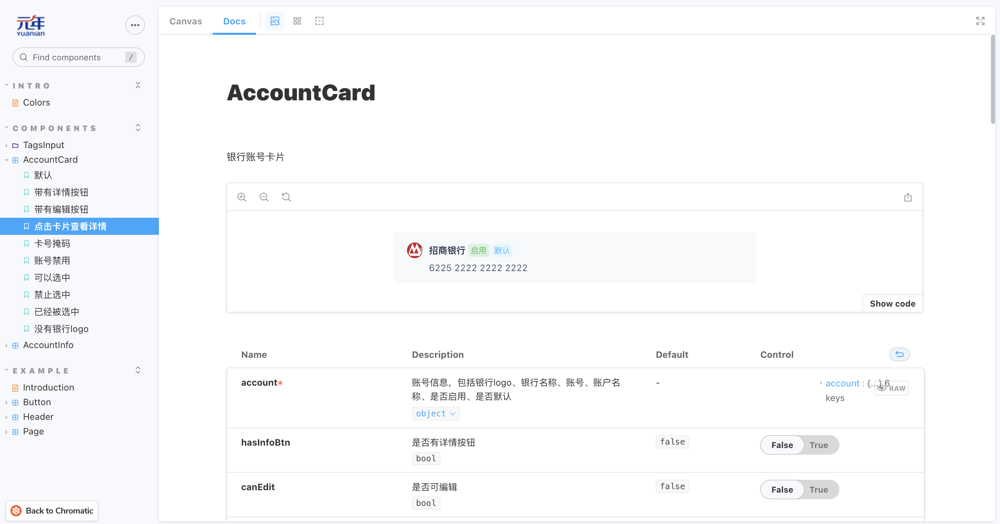
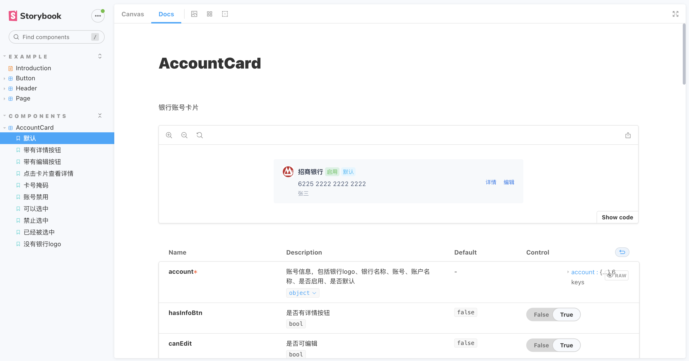
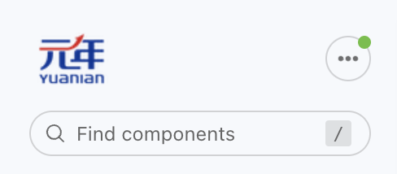
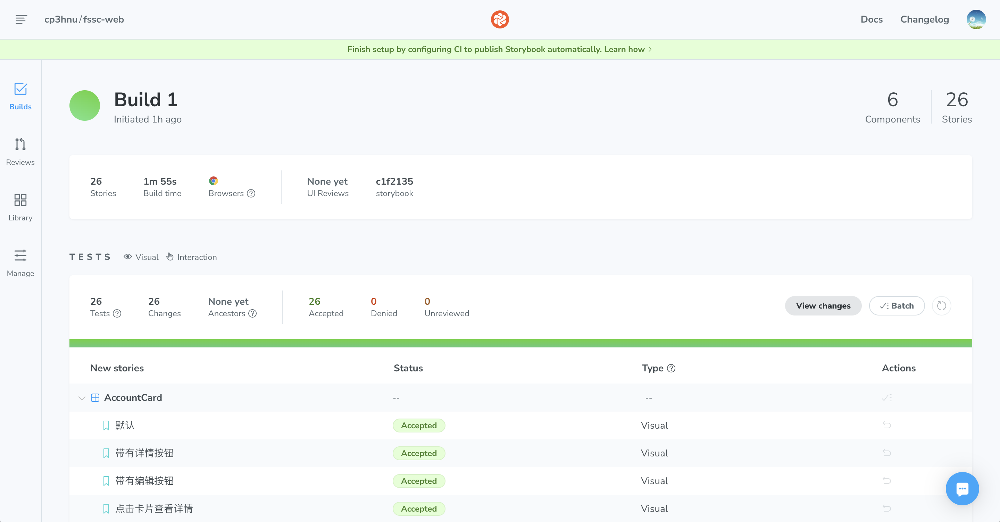

# Storybook 搭建组件库文档

[上一篇文章 ](./2023-01-04-storybook/)我们介绍了 Storybook，这篇文章我们将 Storybook 应用到我们的项目中，帮助我们生成组件文档。初级效果如下：

> 项目技术栈是：Webpack 4.47.0 +  React 16.9.0 + Less 3.5.0



## 安装

在工程里使用下面的命令安装 Storybook

```sh
$ npx storybook@latest init
```

> Storybook 最新版本 6.5.15 

这个命令主要做四件事：

- 安装依赖包和 addons，比如 `storybook`、 `@storybook/addon-essentials`
- 添加 script 命令，比如 `"storybook": "storybook dev -p 6006"`
- 创建配置文件，在 `.storybook` 目录下，有两个文件 `main.js` 和 `preview.js`
- 创建示例，在 `src/stories` 目录下

## 配置

每个项目都有其特殊性，我们项目也不例外，因此需要一些额外的配置

### 配置 Webpack

Storybook 提供了默认的 [Webpack 配置](https://storybook.js.org/docs/6.5/vue/builders/webpack)，同时也允许我们通过 `.storybook/main.js` 来扩展 Webpack 配置。

下面我们将添加 alias 和 less 规则

```js
// .storybook/main.js
const path = require('path');
const root = path.resolve(__dirname, '../');
const src = path.resolve(root, 'src');
const common = path.resolve(src, 'common');
const platform = path.resolve(src, 'platform');
const custom = path.resolve(src, 'custom');
const theme = require(path.resolve(src, 'config/theme'));

module.exports = {
  ..., // 其它配置
  webpackFinal: async (config) => {
    // 添加 alias
    config.resolve.alias['@'] = src;
    config.resolve.alias['@common'] = common;
    // 添加 webpack 规则
    const rules = [
      {
        test: /\.less$/,
        exclude: [platform, custom, common],
        use: [
          'style-loader',
          'css-loader',
          {
            loader: 'less-loader',
            options: {
              sourceMap: true,
              modifyVars: theme,
              javascriptEnabled: true,
            },
          },
        ],
      },
      {
        test: /\.less$/,
        include: [platform, custom, common],
        use: [
          {
            loader: 'style-loader',
          },
          {
            loader: 'css-loader',
            options: {
              modules: {
                localIdentName: '[path][name]__[local]--[hash:base64:8]',
                context: src,
              },
            },
          },
          {
            loader: 'postcss-loader',
          },
          {
            loader: 'less-loader',
          },
        ],
      },
    ];
    config.module.rules.push(...rules);
    return config;
  },
};
```

### 配置 Babel

Storybook 提供了默认的 [Babel 配置](https://storybook.js.org/docs/6.5/vue/configure/babel)，但是如果你的工程里存在 `.babelrc` 文件，Storybook 将使用这个文件来配置 Babel，同时你也可以在 `.storybook` 目录下创建一个 `.babelrc` 文件，表示只用于 Storybook 的 Babel 配置，还可以通过 `.storybook/main.js` 的 [babel 属性](https://storybook.js.org/docs/6.5/vue/configure/babel#custom-configuration)，修改 Storybook 的 Babel 配置。

可能是我们工程配置的原因，我们生成的 story 没有按我们定义的顺序排列，而是按字母排序的，查阅资料后得知需要安装 [babel-plugin-named-exports-order](https://github.com/storybookjs/babel-plugin-named-exports-order)，同时添加到 `.babelrc`

> 推测原因是使用了 `@babel/plugin-transform-modules-commonjs`，因为我删除这个之后也能满足 story 按定义的顺序排序。但是项目中使用了它，所以不能轻易删除，以免出现问题
>
> 解决方案：[Issue 18322](https://github.com/storybookjs/storybook/issues/18322)

```js
// .storybook/.babelrc

{
  "plugins": [
    "babel-plugin-named-exports-order"
  ]
}
```

### 添加全局样式

可以在 `.storybook/preview.js` 添加全局样式

```js
// .storybook/preview.js

import '@style/global.less';
import '@style/basic.less';
import '@style/theme.less';
import '@style/common.less';
import '@style/iconfont/iconfont.css';
import '@style/iconfont/iconfont.js';
import '@style/icon.less';
```

### 添加 Context

我们项目使用了 [Context](https://zh-hans.legacy.reactjs.org/docs/context.html) 从 app top 注入多言语相关的数据和方法，要模拟这种行为，我们可以使用 [Decorators](https://storybook.js.org/docs/6.5/vue/writing-stories/decorators)，提供 context

[ConfigProvider](https://ant.design/components/config-provider-cn) 是 Antd Design context，用于配置国际化、书写方向等

LangProvider 是我们设置多语言的 context

```jsx
// .storybook/preview.js
import React from 'react';
import {LangProvider} from '@/app/component/connect';
import {ConfigProvider} from 'antd';
import zhCN from 'antd/es/locale/zh_CN';

// mock 多语言方法
const getLanguageText = (key, value) => {
  return value;
};

export const decorators = [
  (Story) => (
    <ConfigProvider locale={zhCN}>
      <LangProvider
        value={{
          defaultLanguage: 'zh_CN',
          languages: [],
          languageData: {},
          getLanguageText: getLanguageText,
        }}
      >
        <Story />
      </LangProvider>
    </ConfigProvider>
  ),
];
```

### 配置静态资源

通过 `.storybook/main.js` 配置静态资源目录，详情请参考 [Images, fonts, and assets](https://storybook.js.org/docs/6.5/vue/configure/images-and-assets#serving-static-files-via-storybook-configuration)

```js
// .storybook/main.js

module.exports = {
  staticDirs: ['../public'],
};
```

### 配置 HTML Head

Storybook 允许通过 [`.storybook/preview-head.html`](https://storybook.js.org/docs/6.5/vue/configure/story-rendering) 配置渲染的 HTML head，比如给  HTML head 注入脚本、样式、以及外部资源等，还可以修改 Storybook 的样式，一般是 copy 工程里 `public/index.html` 的设置。

因为我们项目使用了响应式布局，需要添加一段脚本设置 `html` 的 `font-size`

```html
<!-- .storybook/preview-head.html -->
<script type="text/javascript">
  // 略
</script>
```

同时我们还可以在这里修改 Storybook 本身的样式

```html
<style>
  .sb-show-main.sb-main-padded {
    padding: 16px !important;
  }
  .sbdocs-wrapper {
    padding: 64px 40px !important;
  }
  .sb-show-main #root {
    height: auto;
  }
  .sb-show-main #root > *:first-child {
    height: auto;
  }
</style>
```

## 写 Story

完成上面的配置之后我们就可以写组件 story。

有两种方式写 story，CSF （[Component Story Format](https://storybook.js.org/docs/6.5/react/api/csf)） 和 MDX，一般推荐使用 CSF

### CSF

下面是账号卡片组件的 story

```jsx
import React from 'react';

// AccountCard 是组件
// AccountCardWrapper 是封装了 AccountCard 的 HOC，用于实现多语言
import AccountCardWrapper, {
  AccountCard,
} from '@platform/masterdata/common/accountCard.js';

export default {
  title: 'Components/AccountCard',
  component: AccountCard,
  parameters: {
    layout: 'centered', // 居中布局: padded 默认，放置在top，添加一些 padding; fullscreen 全屏， 
  },
  decorators: [(Story) => <div style={{width: 520}}>{Story()}</div>],
};

// Source 中显示组件的名称
AccountCardWrapper.displayName = 'AccountCard';

function Template(args) {
  return <AccountCardWrapper {...args} />;
}

export const DefaultCard = Template.bind({});
DefaultCard.args = {
  account: {
    image:
      'https://img2.baidu.com/it/u=2316535181,20323673&fm=253&fmt=auto&app=138&f=JPEG?w=500&h=500',
    bankName: '招商银行',
    accountNo: '6225222222222222',
    accountName: '张三',
    enable: true,
    default: true,
  },
};
DefaultCard.storyName = '默认';

export const CardWithEditBtn = Template.bind({});
CardWithEditBtn.args = {
  ...DefaultCard.args,
  hasInfoBtn: true,
  canEdit: true,
  showAccountName: true,
};
CardWithEditBtn.storyName = '带有编辑按钮';
```



### 全局配置 ArgTypes

可以在 `.storybook/preview.js` 全局配置 ArgTypes，更多详情请参考 [Global ArgTypes](https://storybook.js.org/docs/6.5/vue/api/argtypes#global-argtypes).

比如我要隐藏所有组件的 global 属性（这个属性是通过 context 传入的），可以这样做

```js
// .storybook/preview.js

export const argTypes = {
  global: {
    table: {
      disable: true,
    },
  },
};
```

### 组件配置

#### 不显示组件某些 args 的 control

> 更多详情请参考 [Controls](https://storybook.js.org/docs/react/essentials/controls#show-full-documentation-for-each-property)

```js
export default {
  component: AccountInfo,
  argTypes: {
    className: {
      control: false,
    },
  },
};
```

#### 将某些 args 设置为 action

> 更多详情请参考 [Actions](https://storybook.js.org/docs/react/essentials/actions)

```js
export default {
  component: AccountInfo,
  parameters: {
    actions: {argTypesRegex: '^handle[A-Z].*'},
  },
};
```

#### 添加 Story 描述

```js
CardWithInfoBtn.parameters = {
  docs: {
    description: {
      story: '使用 `hasInfoBtn` 显示详情按钮，`onView` 查看详情事件',
    },
  },
};
```

#### 把 Doc 放在第一列

```js
// .storybook/preview.js

export const parameters = {
  previewTabs: { 'storybook/docs/panel': { index: -1 } },
};
```

## 写文档

文档分为两种

- 替换 Storybook 自动生成的文档
- 组件或者项目的补充说明

### 替换 DocsPage

在极少数情况下，我们需要替换 Storybook 自动生成的文档。一般的做法是先创建一个 `mdx` 文件，在这个文件里面不能定义 `Meta` 元素

> Storybook 6.5 没有 Controls 组件

```markdown
// Button.mdx
import { Canvas, Story, ArgsTable } from "@storybook/addon-docs"

# This is Button documentation

<ArgsTable />

## Stories
### Primary
<Canvas>
  <Story id="example-button--primary" />
</Canvas>
```

然后在组件的 story 文件中引入改 `mdx` 文件，设置 `parameters.docs.page`

>  更多详情请参考 [CSF Stories with arbitrary MDX](https://github.com/storybookjs/storybook/blob/master/addons/docs/docs/recipes.md#csf-stories-with-arbitrary-mdx)

```js
// Button.stories.jsx

import mdx from './Button.mdx';
export default {
  title: 'Example/Button',
  component: Button,
  parameters: {
    docs: {
      page: mdx,
    },
  },
};
```

### 补充说明文档

项目中大部分情况都是保留 Storybook 自动生成的文档，如果需要特殊说明（比如使用指南），则可以添加额外的文档

下面是 TagsInput（带 tags 的输入框）的使用指南文档

> 空行作为分割

```markdown
import {Meta, Story, Source} from '@storybook/addon-docs';

import TagsInput from '@common/tagsInput/index.js';

<Meta title='Components/TagsInput/Intro' />

# TagsInput 使用指南

TagsInput 支持[受控组件](https://zh-hans.legacy.reactjs.org/docs/forms.html#controlled-components)和[非受控组件](https://zh-hans.legacy.reactjs.org/docs/uncontrolled-components.html)两种方式，同时支持字符串数组和对象数组

## 受控组件

传入 value 和 onChange

<Story id='components-tagsinput--controlled' />

<Source id='components-tagsinput--controlled' />

## 非受控组件

传入 defaultValue 作为默认值

<Story id='components-tagsinput--uncontrolled' />
                   
<Source id='components-tagsinput--uncontrolled' />

## 对象数组

TagsInput 除了支持字符串数组外，还支持对象数组，当是对象数组时，需要传入 `tagName` 表示对象中的哪个属性作为显示文本

<Story id='components-tagsinput--controlled-with-object' />

<Source id='components-tagsinput--controlled-with-object' />
                   
```

## 定制化

### 主题

现在生成的文档界面使用的是 Storybook 元素，比如 logo，我们需要定制一套属于我们的主题

> 定制主题，详情请参考 [Theming](https://storybook.js.org/docs/6.5/react/configure/theming)

首先安装 `@storybook/addons` 和 `@storybook/theming`

```sh
yarn add --dev @storybook/addons @storybook/theming
```

然后创建主题，包括标题，logo，点击 logo 的跳转URL

```js
// .storybook/yuanian.js

import {create} from '@storybook/theming';
import Logo from './yunian-logo.png';

export default create({
  base: 'light',
  brandTitle: '元年',
  brandUrl: 'https://www.yuanian.com/',
  brandImage: Logo,
  brandTarget: '_blank',
});

```

最后添加新创建的主题

```js
// .storybook/manager.js

import { addons } from "@storybook/addons";
import YuanianTheme from "./yuanian-theme";

addons.setConfig({
  theme: YuanianTheme
});
```



### Favicon

我们可以通过 `.storybook/manager-head.html` 来修改 Favicon

```html
<link
  rel="icon"
  href="https://www.yuanian.com/favicon.ico"
  type="image/x-icon"
/>
<link
  rel="shortcut icon"
  href="https://www.yuanian.com/favicon.ico"
  type="image/x-icon"
/>
```

### 背景颜色

Storybook 提供了两种背景样式：light 和 dark，因为我们项目主要有两种背景颜色，白色和浅灰色，所以我们需要定制我们的背景颜色

> 定制背景颜色，详情请参考 [Backgrounds](https://storybook.js.org/docs/6.5/react/essentials/backgrounds)

```js
// .storybook/preview.js

export const parameters = {
  backgrounds: {
    default: 'white',
    values: [
      {
        name: 'white',
        value: '#ffffff',
      },
      {
        name: 'gray',
        value: '#f5f7fa',
      },
    ],
  },
};
```

## 发布

最后就是发布文档，Storybook 推荐使用自己家的 [Chromatic](https://www.chromatic.com/)，这个是为 Storybook 量身定做的

### Chromatic

发布到 Chromatic 最简单的方式是从 GitHub 导入 repository，但是我们的代码是非开源的，所以不能使用这种方式。

我们使用第二种方式，首先安装 `chromatic`

```sh
$  yarn add --dev chromatic 
```

然后在登录 Chromatic，创建工程，记一下 `project-token`

```sh
$ npx chromatic --project-token=<your-project-token>
```

然后 Chromatic 运行 `build-storybook` 命令，然后将 `storybook-static` 文件上传到 Chromatic



Chromatic 提供了很多高级功能，比如 [Visual Tests](https://storybook.js.org/tutorials/intro-to-storybook/react/en/test/)

点击 "View Storybook"，可以查看文档


[文档链接地址](https://www.chromatic.com/builds?appId=6502b59ef30f68996d952bef)

### Vercel

我们也可以发布到 [Vercel](https://vercel.com/)，同样的原因我们不能从 GitHub 导入 repository，只能手动部署

首先安装 Vercel

```sh
$ npm i -g vercel
```

然后登录

```sh
$ vc login
```

选择 "Log in to Vercel email"，输入邮箱，Vercel 会给你的邮箱发送一封验证邮件，点击邮件就能成功登录

再接着运行 `build-storybook` 命令，编译 Storybook，最后部署到 Vercel

```sh
$ npm run build-storybook
$ cd storybook-static
$ vc
```

[文档链接地址](https://fssc-web-cp3hnu.vercel.app/?path=/docs/components-accountcard--default-card)

## References

- [Storybook](https://storybook.js.org/)
- [Component Story Format](https://www.componentdriven.org/)
- [JSDoc](https://jsdoc.app/)
- [MDX](https://mdxjs.com/)
- [Chromatic](https://www.chromatic.com/)
- [Storybook Docs Recipes](https://github.com/storybookjs/storybook/blob/master/addons/docs/docs/recipes.md#storybook-docs-recipes)
- [CSF Stories with arbitrary MDX](https://github.com/storybookjs/storybook/blob/master/addons/docs/docs/recipes.md#csf-stories-with-arbitrary-mdx)
- [Jest](https://jestjs.io/)
- [Test-Library](https://testing-library.com/)
- [Chromatic](https://www.chromatic.com/)
- [Vercel](https://vercel.com/)


