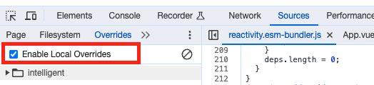
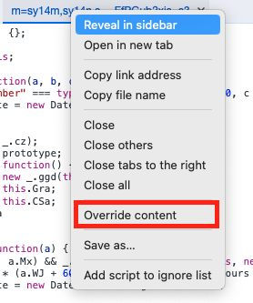
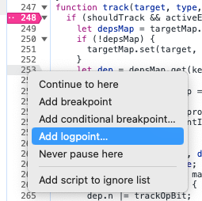
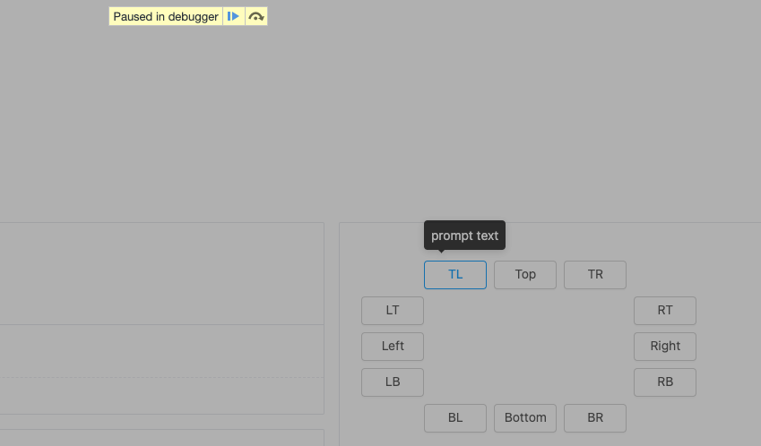

# Chrome 调试技巧

## 生产环境调试

首先开启 Sources -> Enable Local Overrides

然后保存文件到本地

这样就可以修改本地文件，然后进行调试了

# 条件断点

条件断点（Conditional Breakpoints）允许你定义表达式，表达式求值为 `true` 时中断。

## 日志断点

日志断点（Log Points）让你方便地输出日志到控制台

## Hover 状态检查元素

1. 进入 `Sources` 页签
2. 显示检查的元素
3. 使用快捷键 `comand + \` 或者 `F8`

## References

- [Chrome DevTools](https://developer.chrome.com/docs/devtools/javascript/breakpoints/)

- [Chrome Developer Tools](https://blittle.github.io/chrome-dev-tools/)
