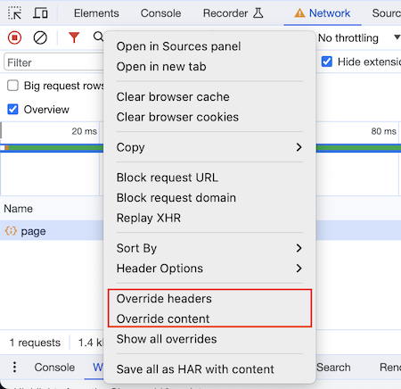
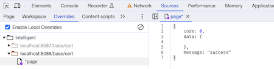

# Chrome 调试技巧

这篇文章总结一下我平时常用的一些 Chrome 调试技巧

## 重写代码

某些时候我们需要直接修改线上代码进行调试，这个时候我们可以利用 Chrome 的 Overrides 功能

首先开启 `Sources` -> `Enable Local Overrides`

然后保存文件到本地

这样就可以通过修改本地文件，进行线上调试了。顺便提一下，Chrome 也是一个很好的代码编辑器。

## 条件断点

我们希望断点在满足某个条件时才中断执行，这个时候我们可以使用条件断点（Conditional Breakpoints）。

条件断点允许你定义表达式，表达式求值为 `true` 时中断。

## 日志断点

日志断点（Log Points）让你方便地输出日志到控制台

## Hover 状态检查元素

1. 进入 `Sources` 页签
2. 显示检查的元素
3. 使用快捷键 `comand + \` 或者 `F8`

## Mock 请求

Chrome 117 支持 mock 请求了，如下图

在 `Network` 面板选择要 mock 的请求，右键选择 `Override content`，然后输入你想放回的数据，就能 mock 这个请求。

除了 mock 接口之外，还可以 mock 字体、图片等资源

> 📢 要使用 mock 版本，必须打开调试面板

持续更新中...

## References

- [Chrome Developer Tools](https://blittle.github.io/chrome-dev-tools/)
- [Pause your code with breakpoints](https://developer.chrome.com/docs/devtools/javascript/breakpoints/)
- [终于，用浏览器就能mock请求了](https://mp.weixin.qq.com/s/mLGoZmpeoscScnEYOgmB4g)
