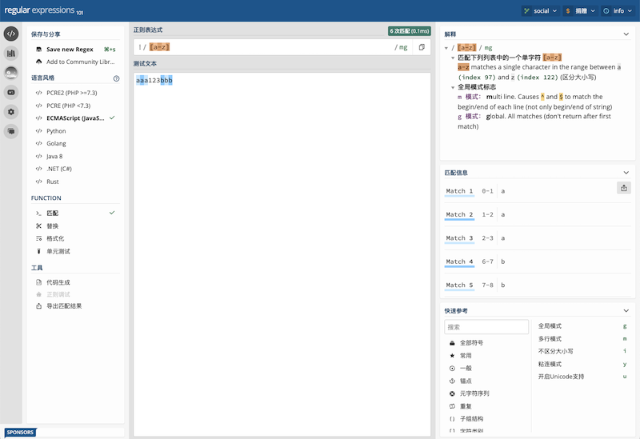
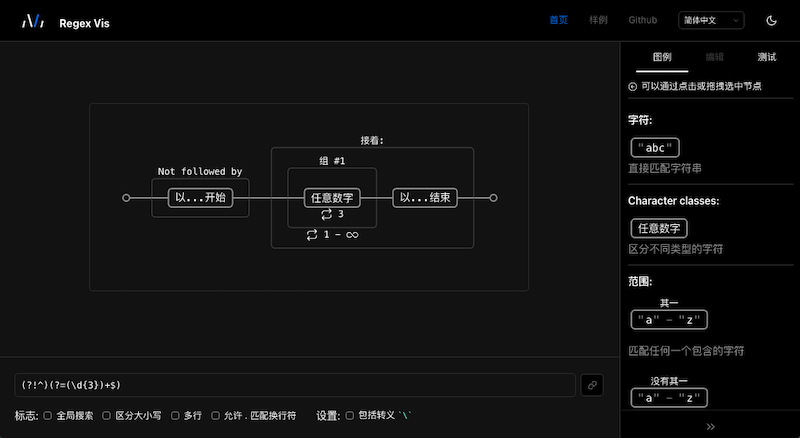
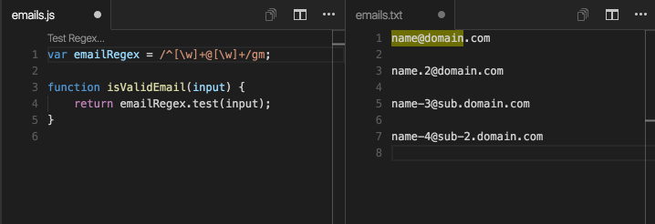
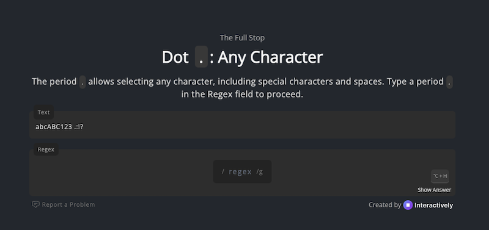

# 正则表达式 in Javascript

首先申明一下，这不是一篇讲怎么写正则表达式的文章，这方面的文章有很多，比如 [RegexLearn](https://regexlearn.com/)、[RegexOne](https://regexone.com/)、[正则表达式30分钟入门教程](https://www.jb51.net/tools/zhengze.html)等。

这篇文章将介绍怎么在 JavaScript 中使用正则表达式，同时介绍 String 与正则表达式相关的 API，最后推荐与正则表达式相关的一些工具或网站以及一些常用的正则表达式。

## RegExp

在 Javascript 中使用 [`RegExp`](https://developer.mozilla.org/en-US/docs/Web/JavaScript/Reference/Global_Objects/RegExp) 来表示正则表达式，有两种方式来创建 `RegExp`。

常用的是字面标记法 (literal notation)，例如

```js
const reg = /[a-z]/g
```

另一种是使用 `RegExp` 构造函数，主要是用于动态构建 `RegExp`，例如：

```js
const reg = new RegExp(isNumber ? "\d" : "[a-z]", "g")
```

`RegExp` 除了定义表达式之外，还定义了 flag，它将影响 `RegExp` 的匹配行为。

| Flag | 说明                                           | `RegExp` 中对应的属性                                        |
| :--- | :--------------------------------------------- | :----------------------------------------------------------- |
| `g`  | 全局搜索                                       | [`global`](https://developer.mozilla.org/en-US/docs/Web/JavaScript/Reference/Global_Objects/RegExp/global) |
| `i`  | 大小写不敏感                                   | [`ignoreCase`](https://developer.mozilla.org/en-US/docs/Web/JavaScript/Reference/Global_Objects/RegExp/ignoreCase) |
| `m`  | 允许 `^` 和 `$` 匹配换行符                     | [`multiline`](https://developer.mozilla.org/en-US/docs/Web/JavaScript/Reference/Global_Objects/RegExp/multiline) |
| `s`  | 允许 `.` 匹配换行符                            | [`dotAll`](https://developer.mozilla.org/en-US/docs/Web/JavaScript/Reference/Global_Objects/RegExp/dotAll) |
| `y`  | 执行从目标字符串中的当前位置开始匹配"粘性"搜索 | [`sticky`](https://developer.mozilla.org/en-US/docs/Web/JavaScript/Reference/Global_Objects/RegExp/sticky) |
| `d`  | 为子字符串匹配生成索引                         | [`hasIndices`](https://developer.mozilla.org/en-US/docs/Web/JavaScript/Reference/Global_Objects/RegExp/hasIndices) |
| `u`  | 将模式视为 Unicode 码位序列                    | [`Unicode`](https://developer.mozilla.org/en-US/docs/Web/JavaScript/Reference/Global_Objects/RegExp/Unicode) |
| `v`  | 升级到具有更多 Unicode 功能的 `u` 模式         | [`UnicodeSets`](https://developer.mozilla.org/en-US/docs/Web/JavaScript/Reference/Global_Objects/RegExp/UnicodeSets) |

### API

RegExp 主要有两个方法：[`test()`](https://developer.mozilla.org/en-US/docs/Web/JavaScript/Reference/Global_Objects/RegExp/test) 和 [`exec()`](https://developer.mozilla.org/en-US/docs/Web/JavaScript/Reference/Global_Objects/RegExp/exec)，一个属性 [`lastIndex`](https://developer.mozilla.org/en-US/docs/Web/JavaScript/Reference/Global_Objects/RegExp/lastindex)。

#### `test`

```ts
test(str: string): boolean
```

`test()` 用来检查正则表达式与指定的字符串是否匹配，匹配时返回 `true`，否则返回 `false`。

`test()` 参数必须是字符串，非字符串参数会被强制转换成字符串，比如 `undefined` 将被转换成 `"undefined"`。

```js
const str = 'football';
const regex = /foo/;
regex.test(str); // true
```

当带有 global (`g`) 或 sticky (`y`) flag 时，执行 `test()` 会修改 `lastIndex` 属性，再次执行时，会从 `lastIndex` 位置开始进行匹配，并且不管匹配的字符串是否发生了变化，这一点要注意。

```js
const str = 'football';
const regex = /foo/g;
regex.test(str); // true
regex.lastIndex; // 3

regex.test(str); // false
regex.lastIndex; // 0
```

当 `test()` 没有找到匹配项时，会重置 `lastIndex` 为 0。

#### `exec`

```ts
exec(str: string): string[] | null
```

和 `test()` 一样， `exec()` 的参数也必须是字符串，非字符串参数会被强制转换成字符串。

`exec()` 比 `test()` 的功能要强大的多。当找到匹配项时，它返回一个字符串数组，其中第一项是匹配的子字符串，后面跟着的是捕获组字符串，除此之外返回的字符串数组还有以下 4 个属性。

| 属性      | 说明                                                         |
| --------- | ------------------------------------------------------------ |
| `index`   | 匹配的子字符串在参数字符串的起始位置                         |
| `input`   | 参数字符串                                                   |
| `groups`  | 命名的捕获组对象，捕获组名称为对象的属性名                   |
| `indices` | 匹配的子字符串和捕获组字符串的位置信息，必须带有 hasIndices (`d` ) flag 才会返回 |

当没找到匹配项时，返回 `null`。

举个例子

```js
const re = /quick\s(?<color>brown).+?(jumps)/dgi;
const result = re.exec("The Quick Brown Fox Jumps Over The Lazy Dog");
```

返回结果：

| 属性      | 值                                                           |
| :-------- | :----------------------------------------------------------- |
| `[0]`     | `"Quick Brown Fox Jumps"`                                    |
| `[1]`     | `"Brown"`                                                    |
| `[2]`     | `"Jumps"`                                                    |
| `index`   | `4`                                                          |
| `input`   | `"The Quick Brown Fox Jumps Over The Lazy Dog"`              |
| `groups`  | `{ color: "brown" }`                                         |
| `indices` | `[[4, 25], [10, 15], [20, 25]]` <br/>`groups: { color: [10, 15 ]}` |

> `indices` 返回的前闭后开的位置信息，[4, 25)，开始位置是 4，结束位置 25（不包括）
>
> indices 也有一个属性 `groups`，保存命名捕获组字符串的位置信息

和 `test()` 一样，当带有 global (`g`) 或 sticky (`y`) flag 时，执行 `exec()` 会修改 `lastIndex` 属性，再次执行时，会从 `lastIndex` 位置进行查询。

事实上，`test()` 是对 `exec()` 的封装。

```js
RegExp.prototype.test = function(str) {
  return this.exec(str) !== null;
}
```

#### `lastIndex`

表示下一次从参数字符串的什么位置开始进行匹配，它只影响带有 global (`g`) 或 sticky (`y`) flag 的正则表达式，同时也被它们修改。

```javascript
const reg = /[a-z]/g;
reg.lastIndex = 6;
reg.exec("abc123abc"); // [ 'd', index: 6, input: 'abc123abc', groups: undefined ]
reg.lastIndex;         // 7
```

##### 对 String API 的影响

对 String API 的影响，有下面 3 种情况：

1. 当 `replace()`，`match()` 的参数是只带有 `y` flag（没有 `g` flag）的 `RegExp` 时，会受 `lastIndex` 的影响，并修改它。        
2. 当 `replaceAll()`，`matchAll()` 的参数是带有  `g`  和 `y`  flag 的 `RegExp` 时，或者 `matchAll()` 的参数是只带有 `g` flag  的 `RegExp` 时，会受 `lastIndex` 的影响，但是不会修改它。
3. 其它情形，不会受 `lastIndex` 的影响，也不修改它。

### Flags

接下来介绍不同的 flag 怎样影响正则表达式的匹配。`i`、`s` flag 很好理解，这里就不展开说了。

#### global (`g`) 和 sticky (`y`)

global (`g`) 和 sticky (`y`)，都将修改 `RegExp` 对象的 `lastIndex` 属性，使得匹配往下推进，当没有找到匹配项时，都会重置 `lastIndex` 为 0。不同的是 global (`g`) 会搜索 **`lastIndex` 及之后**位置的字符串，而 sticky (`y`) 必须在 **`lastIndex` 当前位置**进行匹配。

```js
const str ="abc123abc"
const globalReg = /abc/g;
const stickyReg = /abc/y
// 第一次
globalReg.test(str); // true
globalReg.lastIndex; // 3
stickyReg.test(str); // true
stickyReg.lastIndex; // 3
// 第二次
globalReg.test(str); // true
globalReg.lastIndex; // 9
stickyReg.test(str); // false，因为位置 3 上是 "1" 不是 "a"
stickyReg.lastIndex; // 0
```

如果同时有 `g` 和 `y` flag，对于 `exec()` 和 `test()` 方法，保留 `y` flag，而忽略 `g`。

而对于与正则表达式相关的 String  API，总结如下：

| API          | 说明                                                        |
| ------------ | ----------------------------------------------------------- |
| `search`     | `g` 本身会被忽略，所以只有 `y` flag 起作用                  |
| `replace`    | 匹配遵循 `y` flag，但是替换所有的匹配项                     |
| `replaceAll` | 匹配遵循 `y` flag，但是替换所有的匹配项                     |
| `match`      | 匹配遵循 `y` flag，但是返回所有的匹配项                     |
| `matchAll`   | 匹配遵循 `y` flag，返回一个迭代器，该迭代器生成所有的匹配项 |
| `split`      | 都被忽略                                                    |

总结一下：除 `search()` 和 `split()` 之外， 其它方法在正则表达式同时有 `g` 和 `y` flag 时，匹配遵循 `y` flag 的原则，但是会往下进行匹配，直到找不到匹配项为止。

更多详情请参考 [sticky](https://developer.mozilla.org/en-US/docs/Web/JavaScript/Reference/Global_Objects/RegExp/sticky)。

#### multiline (`m`)

多行模式下，允许 `^` 和 `$` 匹配换行符，所以 `m` 只影响带有 `^` 和 `$` 的正则表达式，允许它们匹配换行符，否则只匹配字符串的开始和结束。

```js
const str ="123\nabc"
const reg = /^abc/;
const multilineReg = /^abc/m;

reg.test(str); // false
multilineReg.test(str); // true
```

#### hasIndices (`d`)

>  `d` flag 是在 ES2022 成为标准的。

使用 `d` flag，执行 `exec()` 时返回匹配的子字符串和捕获组字符串的位置信息，如 `exec()` 的例子所示。 

> 详情请参考 [RegExp Match Indices](/2023/06/09/what-s-new-ecmascript-2/#regexp-match-indices)。

#### Unicode (`u`)

匹配 Unicode 码点转义（Unicode point code escape）`\u{xxxx}`。

> Unicode：统一码，是为了解决传统的字符编码方案的局限而产生的，它为每种语言中的每个字符设定了统一并且唯一的二进制编码，详情可以参考 [Unicode 官网](https://www.Unicode.org/versions/Unicode15.0.0/)、[Unicode 百度百科](https://baike.baidu.com/item/%E7%BB%9F%E4%B8%80%E7%A0%81/2985798?fromtitle=Unicode&fromid=750500&fr=aladdin)。

比如:

```javascript
/\u{8d75}/u.test("赵") // true
```

最重要的是，ES2018 引入 `\p{…}` 和  `\P{…}` Unicode 字符类转义（Unicode character class escape）。它的原理是每个 Unicode 字符都有一组描述它的属性。例如，字符 `a` 具有 `General_Category` 的 `Lowercase_Letter` 属性和 `Script` 的 `Latn` 属性。 `\p` 和 `\P` 转义序列允许我们根据字符的属性来匹配字符。

```javascript
/\p{General_Category=Letter}/u.test("a"); // true
/\p{Script=Latn}/u.test("a");             // true
```

`\P` 是 `\p` 的补集，表示不具备某个属性的字符。

再举一个中文正则表达式的例子，以前说到匹配中文的正则表达式基本上都是指下面这个：

```javascript
/[\u4e00-\u9fa5]/
```

但是这个正则表达式已经过时了，因为 Unicode 字符一直在更新，比如 Unicode 8.0 添加的 109 号化学元素【鿏】，其码点是 `9FCF`，就不在这个范围内，所以现代的表示中文字符的正则表达式是：

```javascript
/\p{Unified_Ideograph}/u
```

更多详情请参考 [JavaScript 正则表达式匹配汉字](https://zhuanlan.zhihu.com/p/33335629)。

关于 Unicode 正则表达式，更多详情请参考 [Unicode character class escape](https://developer.mozilla.org/en-US/docs/Web/JavaScript/Reference/Regular_expressions/Unicode_character_class_escape)。

#### UnicodeSet (`v`)

> UnicodeSet 只能在新版浏览器才能使用。

UnicodeSet (`v`) 是 Unicode (`u`) 的增强版，表示：

- `\p` 转义序列不仅仅匹配字符的属性，还可以用于匹配字符串的属性。
- 升级了 [character class](https://developer.mozilla.org/en-US/docs/Web/JavaScript/Reference/Regular_expressions/Character_class)，允许交集、并集和减集，以及匹配多个 Unicode 字符。
- `[^...]` 语法构造补码类，而不是否定匹配结果，比如 `[^\p{X}]` = `^\P{X}`,  `[^\P{X}]` = `^\p{X}`，避免了一些不区分大小写的匹配的混淆行为。更多详情请参考 [Complement classes and case-insensitive matching](https://developer.mozilla.org/en-US/docs/Web/JavaScript/Reference/Regular_expressions/Character_class#complement_classes_and_case-insensitive_matching)。

比如，匹配 "Script Extensions" 为 "Greek" 且 "Category Property" 为 "Letter" 的字符：

```javascript
/[\p{Script_Extensions=Greek}&&\p{Letter}]/v
```

### 捕获组和零宽断言

捕获组和零宽断言的语法如下：

| 分类     | 语法            | 说明                                             |
| -------- | --------------- | :----------------------------------------------- |
| 捕获     | (exp)           | 匹配 exp，并捕获文本到自动命名的组里             |
|          | (?&lt;name>exp) | 匹配 exp，并捕获文本到名称为 name 的组里         |
|          | (?:exp)         | 匹配 exp，不捕获匹配的文本，也不给此分组分配组号 |
| 零宽断言 | (?=exp)         | 匹配 exp 前面的位置(匹配后面是 exp 的数据)       |
|          | (?<=exp)        | 匹配 exp 后面的位置(匹配前面是 exp 的数据)       |
|          | (?!exp)         | 匹配后面跟的不是 exp 的位置                      |
|          | (?<!exp)        | 匹配前面不是 exp 的位置                          |

如何在 JavaScript 使用捕获组和零宽断言，请参考 [Named capture groups](/2022/04/09/what-s-new-ecmascript/#named-capture-groups)。

有一个有趣的例子，匹配不以 ing 结尾的单词。

```javascript
const text = "I am running, jumping, and singing.";
const regex = /\b\w+(?<!ing)\b/g;
const matches = text.match(regex);
console.log(matches); // [ 'I', 'am', 'and' ]
```

### 转义

因为有些字符在正则表达式里有特殊的含义（比如 `*` 表示匹配 0 个或者多个），当需要匹配字符本身时，就需要使用 `\` 进行转义（比如使用 `\*` 来匹配 `*` 字符）， 需要转义的字符有 15 个。

```
.*+?^$|\{}()[]/
```

> `/`  只在字面标记法中需要转义

因为 `\` 在字符串里也需要转义（`\\`），所以用字符串创建 Rexg 时，需要多次转义。

```js
const reg = new RegExp("\\*");
```

可以提供一个函数，来快速处理这些转义。

```js
function escapeRegExp(string) {
  return string.replace(/[.*+?^${}()|[\]\\]/g, "\\$&"); // $& 表示整个匹配的字符串
}
```

`[]` 里面需要转义的字符有 4 个。

```
^]\-
```

> 如果 `^` 不是放在第一个，则不需要转义。`-` 不放在中间，也不需要转义。

## String

String 与正则表达式相关的方法有：[`search()`](https://developer.mozilla.org/en-US/docs/Web/JavaScript/Reference/Global_Objects/String/search)、[`replace()`](https://developer.mozilla.org/en-US/docs/Web/JavaScript/Reference/Global_Objects/String/replace)、[`replaceAll()`](https://developer.mozilla.org/en-US/docs/Web/JavaScript/Reference/Global_Objects/String/replaceAll)、[`match()`](https://developer.mozilla.org/en-US/docs/Web/JavaScript/Reference/Global_Objects/String/match)、[`matchAll()`](https://developer.mozilla.org/en-US/docs/Web/JavaScript/Reference/Global_Objects/String/matchAll) 和 [`split()`](https://developer.mozilla.org/en-US/docs/Web/JavaScript/Reference/Global_Objects/String/split#using_split)。

### `search`

```ts
search(regexp: RegExp): number
```

搜索与正则表达式匹配的子字符串。如果找到了一个匹配项，则返回第一个匹配项的起始位置，否则则返回 -1。

参数必须是 `RegExp`，如果不是，则会被 `new RegExp()` 转换成 `RegExp`。

> global (`g`) flag 和 `lastIndex` 没有作用。

```javascript
const str = "hey JudE";
const capitalReg = /[A-Z]/;
const numberReg = /[0-9]/;
str.search(capitalReg);   // 4
str.search(numberReg);    // -1
```

当带有 sticky (`y`) flag 时，必须在字符串的开头匹配。

```javascript
const str = "hey JudE";
const capitalReg = /[A-Z]/y;
str.search(capitalReg);           // -1
"Hey JudE".search(capitalReg);    // 0
```

### `replace`

```typescript
replace(pattern: string | RegExp, replacement: string | Function): string
```

搜索与正则表达式匹配的子字符串，并用替换项进行替换，返回替换后的字符串，源字符串不变。

如果 `pattern` 是字符串，或者是没有 global (`g`) flag 的 `RegExp`，则只替换一次。

参数 `pattern` 可以是字符串，如果是字符串，则操作非常简单，用 `replacement` 替换 `pattern` 即可。

如果 `pattern` 是空字符串，则替换项将追加到字符串的开头。

```javascript
"xxx".replace("", "_"); // "_xxx"
```

参数 `replacement` 可以字符串或者一个函数

#### `replacement` 是字符串 

当 `replacement` 是字符串时，可以使用一些特殊标记

| 标记      | 说明                                 |
| :-------- | :----------------------------------- |
| `$$`      | `"$"` 字符                           |
| `$&`      | 匹配的子字符串                       |
| `` $` ``  | 字符串中匹配子字符串前面的部分       |
| `$'`      | 字符串中匹配子字符串后面的部分       |
| `$n`      | 捕获组，其中 `n` 为小于 100 的正整数 |
| `$<Name>` | 命名捕获组，其中 `Name` 捕获组名称   |

例如：

```javascript
const str = "123456789";
const newStr = str.replace(/(\d{3})/, "($1)"); // (123)456789
```

如果 `pattern` 是字符串，或者正则表达式中不存在相应的捕获组时，则替换为字符本身，即 `"$1"`。

如果捕获组存在但不匹配，则替换为空字符串。

#### `replacement` 是函数

当 `replacement` 是函数时，函数签名如下：

```javascript
function replacer(match, p1, p2, /* …, */ pN, offset, string, groups) {
  return replacement;
}
```

函数返回的值作为替换项，上面的特殊标记不能使用。

参数说明：

| 参数          | 说明                                       |
| ------------- | ------------------------------------------ |
| `match`       | 匹配的子字符串，相当于 `$&`                |
| `p1` ... `pN` | 捕获组，相当于 `$n`                        |
| `offset`      | 匹配的子字符串在源字符串中的索引           |
| `string`      | 源字符串                                   |
| `groups`      | 命名捕获组，这是一个对象，属性为捕获组名称 |

> 如果 `pattern` 是字符串，则没有捕获组相关的参数，只有 `match`、`offset`、`string`。

举个例子

```javascript
function replacer(match, p1, p2, p3, offset, string) {
  return [p1, p2, p3].join(" - ");
}
const newString = "abc12345#$*%".replace(/([^\d]*)(\d*)([^\w]*)/, replacer); 
// abc - 12345 - #$*%
```

#### 全局替换

`replace()` 只替换一次，如果想要全部替换，需要使用 global (`g`) flag。

```javascript
const str = "123456789";
const newStr = str.replace(/(\d{3})(?!$)/g, "$1-"); // 123-456-789
```

当全局替换时，如果 `replacement` 是个函数，它将被调用多次。

### `replaceAll`

```ts
replaceAll(pattern: string | RegExp, replacement: string | Function): string
```

> `replaceAll()` 是在 ES2021 成为标准

函数签名和 `replace()` 一致，全局搜索与正则表达式匹配的所有子字符串，并用替换项进行替换，返回替换后的字符串。

如果 `pattern` 是 `RegExp` 时，必须带有 global (`g`) flag，否则抛异常。

当 `pattern` 是 `RegExp` 时，功能和 `replace()` 一致。

这个函数主要用于 `pattern` 是字符串的情形。

```javascript
const str = "aabbcc".replaceAll("b", "."); // "aa..cc"
```

如果 `pattern` 是空字符串，则替换将插入到每个 UTF-16 代码单元之间，类似于 `split()` 行为

```javascript
const str = "xxx".replaceAll("", "_"); // "_x_x_x_"
```

### `match`

```ts
match(regexp: RegExp): string[] | null
```

返回与正则表达式匹配的子字符串信息，如果没有找到，则返回 `null`。

参数和 `search()` 一样必须是 `RegExp`，否则自动转换为 `RegExp`。

返回值因正则表达式是否带有 global (`g`) flag 而异，如果带有 global (`g`) flag，则返回匹配的字符串数组，如果没有 global (`g`) flag，则返回第一个匹配项及其相关的捕获组信息，等同于 `regexp.exec(str)`。

有 global (`g`) flag 的正则表达式的情形

```javascript
const str = "ABCDEFGHIJKLMNOPQRSTUVWXYZabcdefghijklmnopqrstuvwxyz";
const regexp = /[A-E]/gi;
const matches = str.match(regexp);

console.log(matches);
// ['A', 'B', 'C', 'D', 'E', 'a', 'b', 'c', 'd', 'e']
```

没有 global (`g`) flag 的正则表达式的情形

```javascript
const str = "For more information, see Chapter 3.4.5.1";
const re = /see (chapter \d+(\.\d)*)/i;
const found = str.match(re);

console.log(found);
// [
//   'see Chapter 3.4.5.1',
//   'Chapter 3.4.5.1',
//   '.1',
//   index: 22,
//   input: 'For more information, see Chapter 3.4.5.1',
//   groups: undefined
// ]
```

没有匹配项，返回 `null`

```javascript
const str = "ABCDEFGHIJKLMNOPQRSTUVWXYZabcdefghijklmnopqrstuvwxyz";
const regexp = /[0-9]/gi;
const matches = str.match(regexp); // null
```

没有参数时，相当于调用 `match(/(?:)/)`

```javascript
const str = "ABCDEFGHIJKLMNOPQRSTUVWXYZabcdefghijklmnopqrstuvwxyz";
const regexp = /[A-E]/gi;
const matches = str.match();

console.log(matches);
// [ 
//   '', 
//   index: 0, 
//   input: 'ABCDEFGHIJKLMNOPQRSTUVWXYZabcdefghijklmnopqrstuvwxyz', 
//   groups: undefined 
// ]
```

> 同理 `search()` 没有参数时，返回 0。 

### `matchAll`

```ts
matchAll(regexp: RegExp): Iterator
```

> `matchAll()` 是在 ES2020 成为标准的。

参数必须是 `RegExp`，如果不是，则使用 `new RegExp(regexp, 'g')` 进行转换。

`regexp` 必须带有 global (`g`) flag，否则抛出异常。

返回值是一个迭代器（也是一个可迭代对象），这个迭代器生成的数据类型和 `exec()` 返回值类型一致。

```javascript
const regexp = /foo[a-z]*/g;
const str = "table football, foosball";
const matches = str.matchAll(regexp);

for (const match of matches) {
  console.log(match);
}

// [ 'football', index: 6, input: 'table football, foosball', groups: undefined ]
// [ 'foosball', index: 16, input: 'table football, foosball', groups: undefined ]
```

等同于调用 `exec()`：

```javascript
const regexp = /foo[a-z]*/g;
const str = "table football, foosball";
let match;

while ((match = regexp.exec(str)) !== null) {
  console.log(match);
}
```

`matchAll()` 受 `lastIndex` 的影响，但是不会改变 `lastIndex` 的值。

```javascript
const regexp = /foo[a-z]*/g;
const str = "table football, foosball";
regexp.lastIndex = 10;
const matches = str.matchAll(regexp);

for (const match of matches) {
  console.log(match);
  console.log(regexp.lastIndex); // 10
}

// [ 'foosball', index: 16, input: 'table football, foosball', groups: undefined ]
```

### `split`

```ts
split(separator: string | RexExp, limit?: number): string[]
```

以匹配项分割字符串，参数 `separator` 可以是字符串或者 `RegExp`，参数 `limit` 可选，确定分割之后返回的数组元素个数。

```javascript
const str = 'The quick brown  fox jumps over the lazy dog.';
const words = str.split(/\s+/);
// [ 'The', 'quick', 'brown', 'fox', 'jumps', 'over', 'the', 'lazy', 'dog.' ]

const wordsLimit = str.split(/\s+/, 3);
// [ 'The', 'quick', 'brown' ]
```

一些特殊案例：

- 当 `limit` 是 `0` ，返回 `[]`
- `"".split("")`，也是返回 `[]`
- 如果没有找到匹配项或者 `separator` 是 `undefined` ，则返回包含源字符串的数组
- 如果匹配项在第一个或者最后一个，则返回数组中第一个或者最后一个是空字符串
- 如果 `separator` 是空字符串，则匹配项是按 UTF-16 代码单元还是 Unicode 代码点拆分取决于正则表达式是否可识别 Unicode

```javascript
"😄😄".split(/(?:)/); // [ "\ud83d", "\ude04", "\ud83d", "\ude04" ]
"😄😄".split(/(?:)/u); // [ "😄", "😄" ]
```

- 如果正则表达式里有捕获组，捕获的组会拼接到返回数组中

```javascript
const myString = "Hello 1 word. Sentence number 2.";
const splits = myString.split(/(\d)/);

console.log(splits);
// [ "Hello ", "1", " word. Sentence number ", "2", "." ]
```

## 工具集

### Regex101

[Regex101](https://regex101.com/) 是学习正则表达式最有效的工具网站之一。在 "正则表达式" 栏中可以输入正则表达式，在下面的 "测试文本" 栏中输入要测试的字符串，即可显示出匹配到的结果。在右侧的 "解释" 区域会显示出对输入的正则表达式的详细解释，"匹配信息" 显示匹配的结果，右下角的 "快速参考"  栏会显示正则表达式速查表。

还可以在上面练习编写正则表达式和搜索别人写的比较好的正则表达式。



类似的还有 [RegExr](https://regexr.com/)。

### Regex-Vis

[Regex-Vis](https://regex-vis.com/) 是一个辅助学习、编写和验证正则的工具。它不仅能对正则进行可视化展示，而且提供可视编辑正则的能力。在输入一个正则表达式后，会生成它的可视化图形。然后可以点选或框选图形中的单个或多个节点，再在右侧操作面板对其进行操作。



### Regex Previewer

[Regex Previewer](https://marketplace.visualstudio.com/items?itemName=chrmarti.regex) 是一个 VScode 插件。当我们在编写正则表达式时，可以直接使用快捷键 `Ctrl + Alt + M` (Windows) 或者 `⌥ + ⌘ + M` (Mac) 在编辑器右侧启动一个标签页，我们可以在这个标签页写一写测试用例，用来测试我们写的正则表达式。



### RegexLearn

[RegexLearn](https://regexlearn.com/) 是一个交互式地学习正则表达式的网站，一步一步教你如何写正则表达式。类似的还有 [RegexOne](https://regexone.com/)。



## 常用的正则表达式

下面列举一些平时常用的正则表达式。

### 金额千分位分割

```javascript
const formatMoney = (money) => {
  const reg = new RegExp(`(?!^)(?=(\\d{3})+${money.includes('.') ? '\\.' : '$'})`, 'g')
  return money.replace(reg, ',')  
}
```

### 密码强校验

必须有且只能由数字、大写字符、小写字符、特殊字符组成，长度 8~16 位

```javascript
/^(?=.*[a-z])(?=.*[A-Z])(?=.*\d)(?=.*[\p{P}\p{S}])[0-9A-Za-z\p{P}\p{S}]{8,16}$/u
```

如果不支持 Unicode 可以这样：

```javascript
/^(?=.*[a-z])(?=.*[A-Z])(?=.*\d)(?=.*[^a-zA-Z0-9\s])[^\s]{8,16}$/
```

上面正则表达式中的**特殊字符**是除数字、大写字符、小写字符、任意空白符之外的任意字符（比如中文等）

### 只支持英语字母、数字、英语符号

```js
/^[A-Za-z0-9 !"#$%&'()*+,-./:;<=>?@[\\\]^_`{|}~]*$/
```

### 手机号码

```js
/^1[3|4|5|6|7|8|9][0-9]\d{8}$/
```

### 数字

```js
/^-?((0(\.0*[1-9]\d*)?)|([1-9]\d*(\.\d+)?))$/
```

## References

- [RegexLearn](https://regexlearn.com/)
- [RegexOne](https://regexone.com/)
- [Learn-regex](https://github.com/ziishaned/learn-regex)
- [RegExp](https://developer.mozilla.org/en-US/docs/Web/JavaScript/Reference/Global_Objects/RegExp)
- [Regular expressions](https://developer.mozilla.org/en-US/docs/Web/JavaScript/Guide/Regular_expressions)
- [Regular expression syntax cheat sheet](https://developer.mozilla.org/en-US/docs/Web/JavaScript/Guide/Regular_expressions/Cheatsheet)
- [正则表达式30分钟入门教程](https://www.jb51.net/tools/zhengze.html)
- [正则表达式不用背](https://mp.weixin.qq.com/s/S27FTJyKoVJoY7tcEgLo8Q)
- [JavaScript 正则表达式匹配汉字](https://zhuanlan.zhihu.com/p/33335629)
- [Unicode character class escape](https://developer.mozilla.org/en-US/docs/Web/JavaScript/Reference/Regular_expressions/Unicode_character_class_escape)
- [Regex101](https://regex101.com/)
- [RegExr](https://regexr.com/)
- [Regex Tester](https://extendsclass.com/regex-tester.html#)
- [Regex-Vis](https://regex-vis.com/)
- [Regex Previewer](https://marketplace.visualstudio.com/items?itemName=chrmarti.regex)
- [RegExp `v` flag with set notation and properties of strings](https://v8.dev/features/regexp-v-flag)
- [Unicode Regular Expressions](https://www.unicode.org/reports/tr18/)
- [Unicode Character Database](https://unicode.org/reports/tr44/)
- [`Unified_Ideograph`](https://unicode.org/reports/tr44/#Unified_Ideograph)
- [Unicode](https://www.Unicode.org/versions/Unicode15.0.0/)
- [Text Processing](https://tc39.es/ecma262/multipage/text-processing.html#table-binary-Unicode-properties)
