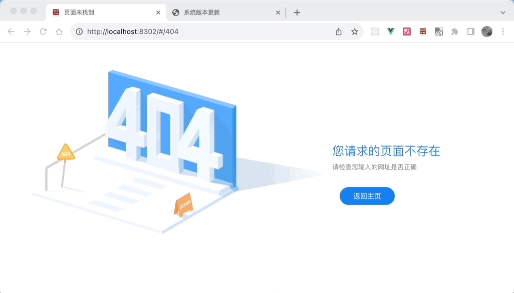
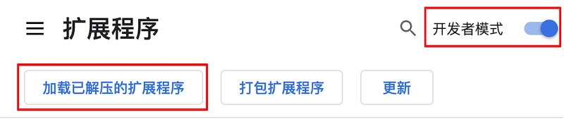
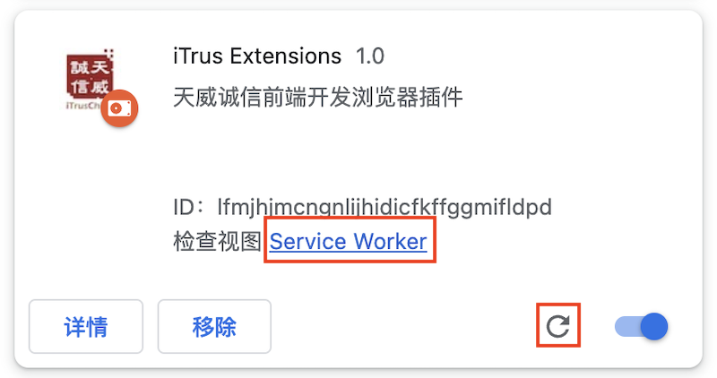
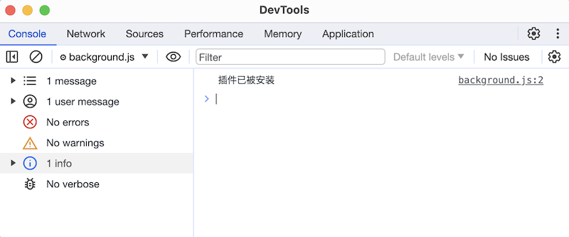
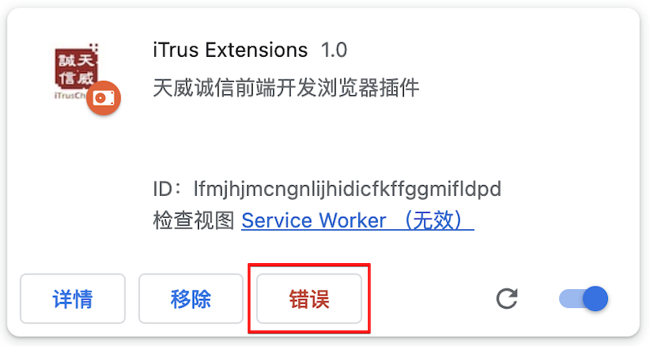

# 第一个 Chrome 扩展

## 背景

一直以来我就想学习怎样写 Chrome 扩展，然后做一个出来，但是一直没有好的想法，不知道做什么。最近入职了一家新公司，正道是每个公司都有每个公司的坑，哦，不对，应该是每个公司都有每个公司的开发流程，这家公司前端开发需要读取路由、按钮、后台接口的权限配置，生成一个 JSON 文件，然后把这个 JSON 文件上传到另一个系统里（简称权限系统），所以开发的时候我们经常这么做

1. 打开调试
2. 打开 `"console"` 页签
3. 输入`"window.getPermissions()"`，这个函数将生成权限 JSON 文件，并打印在控制台
4. 在控制台 copy 上一步打印的 log
5. 打开权限系统，把上一步 copy 的权限 JSON 上传

如果权限经常修改，我们就要不停地重复上面 5 个步骤，然后我就在想能不能写一个 Chrome 扩展，通过右键菜单直接 copy 权限 JSON 文件，并打开权限系统，这样就只需一个简单的动作就完成了上面 5 个步骤，大大提高了开发效率。于是乎我的第一个 Chrome 扩展就这样产生了。



## 基本结构

Chrome 扩展的基本结构是有一个 manifest 文件，现在是 v3 版本，现在网络上关于 Chrome 扩展的文章大部分还是 v2 版本，Chrome 计划将在 2024 年 6 月开始停用 Chrome 的不稳定版本中的 Manifest V2 扩展程序。所以我们使用 v3 版本的 Manifest。

Manifest 是一个 JSON 文件，描述了 Chrome 扩展的功能和配置，里面有很多的配置项，下面是这个扩展用到的一些配置，更多详情请参考 [Manifest file format](https://developer.chrome.com/docs/extensions/reference/manifest)。

```json
{
  "name": "iTrus Extensions",
  "description" : "浏览器插件",
  "version": "1.0",
  "manifest_version": 3,
  "background": {
    "service_worker": "background.js"
  },
  "permissions": ["contextMenus", "scripting"],
  "host_permissions": ["<all_urls>"],
  "icons": {
    "16": "images/icon16.png",
    "32": "images/icon32.png",
    "48": "images/icon48.png",
    "128": "images/icon128.png"
   }
}
```

### `name`

扩展程序的名称，最多 45 个字符。

### `description`

扩展程序的描述，最多 132 个字符。

### `manifest_version`

manifest 版本号，当前是 3。

### `background`

格式是 `{ "service_worker": "xxx.js", type: "module" }` 

`background.service_worker` 指定扩展程序的 Service Worker 的 JavaScript 文件，可以把它当做扩展程序的主应用，它接收消息，处理消息。更多详情请参考 [Extension Service Workers](https://developer.chrome.com/docs/extensions/develop/concepts/service-workers)。

`background.type: "module"` 表示我们可以将模块导入到 Service Worker 中，这里有一个[例子](https://developer.chrome.com/docs/extensions/get-started/tutorial/service-worker-events#step-2)。

### `permissions`

允许使用哪些扩展 API，各个 API 的参考页面列出了它们所需的权限，这里我们要使用 `contextMenus` 和 `scripting`，更多详情请参考 [Permissions](https://developer.chrome.com/docs/extensions/develop/concepts/declare-permissions#permissions)。

### `host_permissions`

允许扩展可以访问哪些网页内容，可以使用网址[匹配模式](https://developer.chrome.com/docs/extensions/develop/concepts/match-patterns)。

匹配模式使用以下结构指定一组网址：

```text
<scheme>://<host>/<path>
```

`scheme`：必须是以下内容之一，并使用双斜线 (`//`) 与格式的其余部分分隔开：

- `http`
- `https`
- `file`
- 通配符 `*`，仅与 `http` 或 `https` 匹配

`host`：主机名 (`www.example.com`)。支持通配符 `*`，比如 `*.example.com` 或者仅使用通配符 `*`。 如果您使用通配符 `*`，它必须是第一个或唯一的字符，并且后面必须跟一个句点 (`.`) 或正斜杠 (`/`)。

`path`：必须至少包含正斜杠。斜杠本身会匹配任何路径，就如同它后跟一个通配符 (`/*`) 一样。

使用 `"<all_urls>"` 表示匹配 `scheme` 允许的所有网址，`[https://*/* , http://*/* ]` 匹配 `http/https` 所有网址，更多详情请参考[匹配模式](https://developer.chrome.com/docs/extensions/develop/concepts/match-patterns)。

关于 `host_permissions` 的更多详情，请参考 [Host Permissions](https://developer.chrome.com/docs/extensions/develop/concepts/declare-permissions#host-permissions)。

### `icons`

一个或多个图标，不同大小的图标用在不同的地方，推荐使用 `.png` 格式的图标，虽然官方文档说支持别的格式，但是我开发的时候，发现我的 `.jpeg` 不起作用， 更多详情请参考 [Icons](https://developer.chrome.com/docs/extensions/reference/manifest/icons)。

## 加载和调试扩展程序

在开发的过程中我们想看看实现效果，我们需要先加载我们的扩展程序。打开 Chrome 扩展管理，然后打开 `"开发者模式"`，点击 `"加载已解压的扩展程序"`，选择我们的扩展程序



然后可以看到我们的扩展程序了，如果我们改了扩展程序的代码，需要手动刷新



如果要调试我们创建的 background service worker，点击上面的 `"Service Worker"`，将会打开浏览器调试工具



如果扩展程序运行有错误，在浏览器扩展上会出现 "错误" 按钮，点击这个按钮可以看到错误的详细信息



## 创建右键菜单

首先我们需要在插件安装的时候创建右键菜单，可以使用 [`chrome.runtime.onInstalled`](https://developer.chrome.com/docs/extensions/reference/api/runtime#event-onInstalled) 生命周期钩子，通过 [`chrome.contextMenus.create`](https://developer.chrome.com/docs/extensions/reference/api/contextMenus#method-create) 在 Service Worker 里创建右键菜单

> `chrome.contextMenus` 需要 `contextMenus` 权限

```js
// background.js
// chrome.runtime.onInstalled 插件安装是生命周期钩子
chrome.runtime.onInstalled.addListener(function () {
  // chrome.contextMenus.create 创建右键菜单
  chrome.contextMenus.create({
    id: "top",
    title: "iTrus",
    contexts: ["all"]
  });
  chrome.contextMenus.create({
    id: "permission",
    parentId: "top",
    title: "➹ Get Permission",
    contexts: ["all"]
  });
});
```

创建右键菜单时，需要指定菜单的 `id` 和 `title` ，右键菜单支持嵌套结构，通过 `parentId` 指向父菜单的 `id`。`contexts` 表示在什么样的上下文（context）中才显示菜单，默认是 `"page"` 表示页面，`all` 表示所有场景都显示菜单，详情请参考 [ContextType](https://developer.chrome.com/docs/extensions/reference/api/contextMenus#type-ContextType)。

然后通过 [`chrome.contextMenus.onClicked`](https://developer.chrome.com/docs/extensions/reference/api/contextMenus#event-onClicked) 添加右键菜单响应函数，响应函数有两个参数：`info` 和 `tab`。`info` 包含菜单和上下文（context）的信息， `tab` 包含浏览器 tab 页签信息。

```js
chrome.contextMenus.onClicked.addListener((info, tab) => {
  if (info.menuItemId === "permission") {
    chrome.scripting.executeScript({
      target: {
        tabId: tab.id, 
        allFrames: true,
      },
      world: "MAIN",
      files: ["itrus-permission.js"]
    }, result => {
      console.log("result", result);
    });
  }
});
```

在右键菜单响应函数里，通过 `chrome.scripting.executeScript` 注入执行脚本

## 注入脚本

因为我们要调用宿主的 `window.getPermission()` 函数，所以需要注入脚本。Chrome 扩展提供了三种注入脚本的方法

- 静态注入， 通过在 `manifest.json` 文件中声明 [`content_scripts`](https://developer.chrome.com/docs/extensions/develop/concepts/content-scripts)
- 动态注入，使用 [`chrome.scripting.registerContentScripts`](https://developer.chrome.com/docs/extensions/reference/api/scripting#method-registerContentScripts) 函数
- 编码注入，使用 [`chrome.scripting.executeScript`](https://developer.chrome.com/docs/extensions/reference/api/scripting#method-executeScript) 函数

因为我们需要响应右键菜单，所以采用 [`chrome.scripting.executeScript`](https://developer.chrome.com/docs/extensions/reference/api/scripting#method-executeScript) 函数

```js
chrome.scripting.executeScript({
  target: {
    tabId: tab.id, 
    allFrames: true,
  },
  files: ["itrus-permission.js"],
  world: "MAIN",
}, result => {
  console.log("result", result);
});
```

`target`：指定脚本注入的目标，`target.tabId` 指定具体的 tab 页签，`target.allFrames: true` 表示脚本被注入的页面的所有 iframe。

`files`：注入的 JS 文件的路径，相对于扩展的根目录。

`world`：这个配置很关键，它有两个值 `"ISOLATED"` 和 `"MAIN"`，默认值是 `"ISOLATED"`，表示隔离环境，这是扩展特有的执行环境，可以使用 Chrome 扩展 API，但是不能访问宿主环境特有数据，比如不能访问我们在宿主环境里给 window 添加的 `getPermission` 函数；`"MAIN"` 表示与宿主页面的 JavaScript 共享的执行环境，因此它可以宿主环境特有数据，但是不能使用 Chrome 扩展 API。更多详情请参考 [Work in isolated worlds](https://developer.chrome.com/docs/extensions/develop/concepts/content-scripts#isolated_world)。

## 获取和复制数据

接下来我们就要在 `itrus-permission.js` 里获取和复制数据

### 获取数据

```js
// itrus-permission.js
if (window.getPermissions) {
  const data = window.getPermissions();
  if (data) {
    copyTextToClipboard(data);
  } else {
    console.log("error: no permission data");
  }
} else {
  console.log("error: no getPermissions function");
}
```

### 复制数据到 clipboard

复制文本到 clipboard，有两种方式:

- [Clipboard API](https://developer.mozilla.org/en-US/docs/Web/API/Clipboard_API)，但是它只支持 `https` 和 `localhost`，并且需要用户授权
- [`document.execCommand()`](https://developer.mozilla.org/en-US/docs/Web/API/Document/execCommand)，这个 API 已经 deprecated 了，不建议使用

因为本地开发有时候使用 `http://ip:port` 的方式，所以我们使用 Clipboard API + `document.execCommand()` 回退的方式，经测试  `document.execCommand()` 在 Chrome 118 还可以使用

> 如果使用 http 协议，同时浏览器不支持 `document.execCommand()`，改怎么实现复制数据到 clipboard 呢？目前没找到解决方案

```js
// 使用 Clipboard API
function copyTextToClipboard(text) {
  if (!navigator.clipboard) {
    fallbackCopyTextToClipboard(text);
    return;
  }
  navigator.clipboard
    .writeText(text)
    .then(() => {
      window.open("http://192.168.100.230:1889", "_blank");
    })
    .catch(err => {
      console.log("navigator.clipboard failed", err);
      fallbackCopyTextToClipboard(text);
    });
}

// 使用 document.execCommand("copy")
function fallbackCopyTextToClipboard(text) {
  const input = document.createElement("input");
  input.value = text;
  document.body.appendChild(input);
  input.select();
  try {
    const successful = document.execCommand("copy");
    if (successful) {
      window.open("http://192.168.100.230:1889", "_blank");
    } else {
      console.log("execCommand call failed");
    }
  } catch (err) {
    console.error("execCommand failed", err);
  }
  document.body.removeChild(input);
}
```

至此，我的第一个 Chrome 扩展完成了，实现效果如下：


## References

- [Chrome Extensions](https://developer.chrome.com/docs/extensions)
- [Chrome Extensions Manifest File Format](https://developer.chrome.com/docs/extensions/reference/manifest)
- [Chrome Extensions API Reference](https://developer.chrome.com/docs/extensions/reference/api)
- [`chrome-extensions-samples`](https://github.com/GoogleChrome/chrome-extensions-samples)
- [Chrome V3 插件开发](https://juejin.cn/post/7229238405406294074)
- [Chrome 扩展开发全攻略](https://www.bookstack.cn/books/chrome-plugin-develop)
- [从零深入 Chrome 插件开发](https://xieyufei.com/2021/11/09/Chrome-Plugin.html)
- [How do I copy to the clipboard in JavaScript?](https://stackoverflow.com/questions/400212/how-do-i-copy-to-the-clipboard-in-javascript#answer-30810322)
- [Clipboard API](https://developer.mozilla.org/en-US/docs/Web/API/Clipboard_API)
- [`document.execCommand()`](https://developer.mozilla.org/en-US/docs/Web/API/Document/execCommand)


