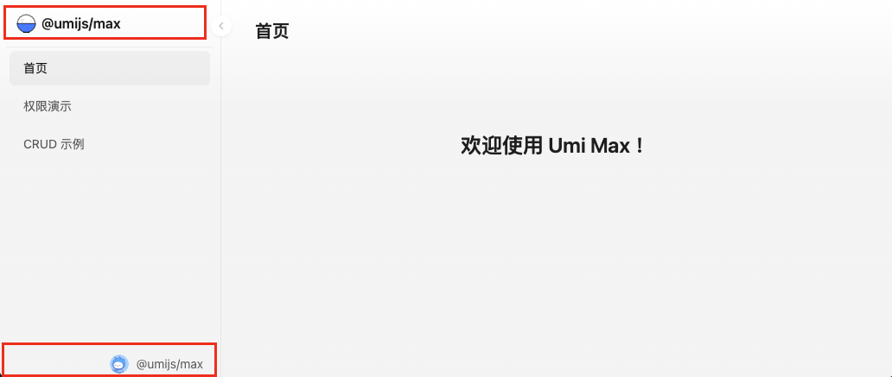
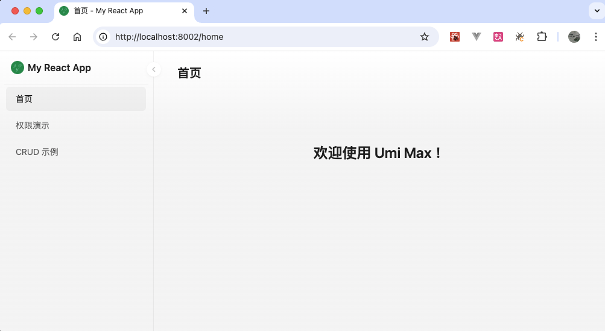

# UmiJS 实用配置

最近发现一个前端脚手架或者说前端应用框架 [UmiJS](https://umijs.org)，它是阿里开发的可扩展的企业级前端应用框架，可以帮助我们快速开发 React、Vue、SSR 应用。当然主要还是 React 应用，因为它很好的集成 [Ant Design](https://ant-design.antgroup.com/index-cn)、[ProComponents](https://procomponents.ant.design/) 组件库。

## 安装

```sh
$ pnpm dlx create-umi@latest
```

它会提示您选择哪个应用模板（Pick Umi App Template），有 4 个选项：

- `Simple App`，只集成了 [Ant Design](https://ant-design.antgroup.com/index-cn) 组件库。
- `Ant Design Pro`，集成了 [Ant Design](https://ant-design.antgroup.com/index-cn)、[ProComponents](https://procomponents.ant.design/) 组件库和 [@umijs/max](https://umijs.org/docs/max/introduce)，并且使用 ProComponents 的 ProLayout  组件实现分栏式布局，如果想要快速开发，就选择这个选项。
- `Vue Simple App`，创建 Vue 应用。
- `Umi Plugin`，用于创建 Umi 插件。

如果想要快速开发，就选择 `Ant Design Pro`。

## 替换 UmiJS 元素

创建完成之后，运行项目，效果如下：



我们需要替换 logo，title，favicon，删除侧边栏底部

### 替换 Logo

首先把 logo 文件放在 `/src/assets` 目录下，然后打开 `src/app.ts`，替换 logo 的配置

```js
import logo from './assets/logo.png';

export const layout = () => {
  return {
    logo: logo,
    // 其它配置
  };
};
```

### 修改 Title

打开 `.umirc.ts`，替换 title

```js
export default defineConfig({
  layout: {
    title: 'My React App',
  },
  // 其它配置
}
```

也可以在 `src/app.ts` 里修改

### 删除侧边栏底部

打开 `src/app.ts`，设置 `rightContentRender: false`

```js
export const layout = () => {
  return {
    rightContentRender: false,
    // 其它配置
  };
};
```

### 替换 `favicon`

在 `src` 目录下放在一个 `favicon.(ico|gif|png|jpg|jpeg|svg|avif|webp)` 文件，将会自动在产物中添加站点 `favicon` ：

```html
<link rel="shortcut icon" href="/favicon.png">
```

可以使用 [favicons](https://umijs.org/docs/api/config#favicons) 手动配置站点图标，配置值优先于约定

修改之后，效果如下：



## 定义颜色变量

### 内置颜色变量

UmiJS 内置了一组 Less 颜色变量值，比如 `@primary-color`

> 文件位置 `node_modules/@umijs/max/node_modules/antd/es/style/themes/default.less`，此外同一个目录下还有一个定义颜色变量值的文件，在 `node_modules/@umijs/max/node_modules/antd/es/style/themes/variable.less` 个人猜测是 Ant Design 5.x 组件使用的。

```less
@primary-color: @blue-6;
```

因此可以在项目里的 Less 文件里直接使用

```less
.container {
  padding-top: 80px;
  background-color: @primary-color;
}
```

### `theme` 配置项

UmiJS 可以通过 `theme` 配置项，修改内置的颜色变量或者添加新的颜色变量

```js
// .umirc.ts
export default defineConfig({
  theme: {
    '@custom-text-color': '#0000ff',
    '@primary-color': '#ff0000',
	},
})
```

自定义颜色值时，建议添加一个前缀，可以避免与内置的颜色变量冲突

### 魔法

上面两个方法都有各自的缺点：

- 内置的颜色变量，不方便查看有哪些颜色变量以及对应的颜色值，同时颜色值可能并不符合自己的应用
- `theme` 配置项，需要在 TS 文件定义颜色变量，不方便

我们还是习惯使用 Less 文件定义颜色变量，比如在 `src/styles/theme.less` 文件里定义颜色变量，同时还可以导出供 JS/TS 文件使用的颜色变量。结合下面说的 Ant Desgin Token，这统一了  Ant Desgin 组件和系统的颜色。

```less
// src/styles/theme.less

@primary-color: #1664ff; // 主色调
@text-color: #1d1d20;
@success-color: #6ac21d;
@error-color: #c73131;
@warning-color: #f98e1b;

// 导出变量供 JS/TS 文件使用
:export {
  primaryColor: @primary-color;
  textColor: @text-color;
  successColor: @success-color;
  errorColor: @error-color;
  warningColor: @warning-color;
}
```

但是别的 Less 文件使用这个 Less 文件时，需要手动导入

```less
@import "@/styles/theme.less"
  
.page {
  color: @text-color
}
```

一个系统可能有成百上千个 Less 文件，每个都手动导入太麻烦了，幸好有人发现了一个魔法：

```js
// .umirc.ts
export default defineConfig({
  lessLoader: {
    modifyVars: {
      hack: 'true; @import "@/styles/theme.less";',
    },
    javascriptEnabled: true,
  },
})
```

这样就不需要一个一个手动导入了。

> [!CAUTION]
>
> 使用这个方法之后前面两个方法就无效了，这样也有效地避免了颜色冲突

## 定制 Ant Design 组件样式

 Ant Design 5.x 使用  **Design Token** 配置组件样式，详情请参考 [Ant Design 定制主题](https://ant.design/docs/react/customize-theme-cn)

UmiJS 提供了两种方法定制 Ant Design 组件样式

- 构建时配置，在 `.umirc.ts` 文件里配置
- 运行时配置，在 `app.{ts|tsx}` 文件里配置

运行时配置的优先级大于构建时配置

### 构建时配置

构建时配置，有两个选项 `antd.theme` 和 `antd.configProvider.theme`，前者的优先级大于后者

```js
// .umirc.ts
export default defineConfig({
  antd: {
    theme: {
      token: {
        colorPrimary: '#00ff00',
      },
    },
  },
})

// 或者
// .umirc.ts
export default defineConfig({
  antd: {
    configProvider: {
      theme: {
        token: {
          colorPrimary: '#00ffff',
        },
      },
    }
  },
})
```

### 运行时配置

```ts
// app.ts
import { RuntimeAntdConfig } from '@umijs/max';
export const antd: RuntimeAntdConfig = (memo) => {
  memo.theme ??= {};
  memo.theme.token = {
    colorPrimary: '#ff0000', // 主题色
  };
  
  memo.appConfig = {
    message: {
      maxCount: 3,  // 配置 message 最大显示数，超过限制时，最早的消息会被自动关闭
    }
  }

  return memo;
};
```

## Iconfont

应用使用的 SVG 小图标一般使用 [iconfont](https://www.iconfont.cn/) 来管理。UmiJS 怎么使用 iconfont 呢？可以使用 Ant Design [`createFromIconfontCN()`](https://ant-design.antgroup.com/components/icon-cn#%E8%87%AA%E5%AE%9A%E4%B9%89-font-%E5%9B%BE%E6%A0%87) 方法封装组件

```jsx
import React from 'react';
import { createFromIconfontCN } from '@ant-design/icons';

const MyIcon = createFromIconfontCN({
  scriptUrl: '//at.alicdn.com/t/font_8d5l8fzk5b87iudi.js', // 在 iconfont.cn 上生成
});
```

如果不想用 iconfont 的托管地址，而是下载图标文件呢？可以这样使用

```tsx
import '@/iconfont/iconfont.js';
import { createFromIconfontCN } from '@ant-design/icons';

const Icon = createFromIconfontCN({
  scriptUrl: '',
});

type IconFontProps = Parameters<typeof Icon>[0];

interface MyIconProps extends IconFontProps {
  type: string;
  style?: React.CSSProperties;
  className?: string;
}

function MyIcon({ type, style, className, ...rest }: MyIconProps) {
  return <Icon {...rest} type={type} className={className} style={style} />;
}

export default MyIcon;
```

其实 `createFromIconfontCN()` 方法就行下载 `scriptUrl` 文件

## SVG

如果 SVG 图标没有使用 iconfont 托管，直接放在工程目录下，该怎么使用呢？UmiJS 有很多方法展示 SVG 图标，比如使用 Ant Design 的 Icon 组件（详情请参考 [自定义 Icon](https://ant-design.antgroup.com/components/icon-cn#%E8%87%AA%E5%AE%9A%E4%B9%89-icon)）或者 [`svgr` 配置项](https://umijs.org/docs/api/config#svgr)。但是最简单的方式是把 SVG 文件放在 `src/icons` 目录下，然后通过 UmiJS 的 Icon 组件，使用 `local:文件名` 的方式访问。

```js
// src/icons/umi.svg
import { Icon } from 'umi';
<Icon icon="local:umi" />
```

Umi JS 还可以使用 icon集，更多详情请参考 [ icon 集使用](https://umijs.org/docs/api/config#icon-%E9%9B%86%E4%BD%BF%E7%94%A8)

## PublicPath

如果要将前端应用部署在子路径上，比如 `www.example.com/app/`，在 `Vue-CLI` 上只需设置 [`publicpath` 配置项](https://cli.vuejs.org/zh/config/#publicpath)，在 `Vite` 上只需要设置 [`base` 配置项](https://cn.vitejs.dev/config/shared-options#base)。而在 UmiJS 中我们需要同时设置 [`base` 配置项](https://umijs.org/docs/api/config#base) 和 [`publicPath` 配置项](https://umijs.org/docs/api/config#publicpath)。

打开 `.umirc.ts`，添加下面的配置。

```js
const base =
  process.env.NODE_ENV === 'production' ? '/app/' : '/';

export default defineConfig({
  base: base,
  publicPath: base,
})
```

在 UmiJS 中 `base` 配置项，添加路由前缀，比如有路由 `/` 和 `/users`，设置 `base` 为 `/app/` 后就可通过 `/app/` 和 `/app/users` 访问到之前的路由。`publicPath` 配置项等同于 webpack 的 [`publicPath`](https://webpack.js.org/guides/public-path/)，指定应用程序所有资源（js, css, assets）的基本路径。

另外，如果要添加 [`headScripts`](https://umijs.org/docs/api/config#headscripts)，并且脚本 `src`  指向 `public` 目录下的 js 文件，UmiJS 并不会自动帮我们添加 `base` 前缀，所以我们需要手动添加

```js
export default defineConfig({
  headScripts: [{
    src: `${base}/js/my.js`
  }]
})
```

## 其它

### App.message 报错

当我们使用

```js
import { App } from 'antd';
const { message } = App;
message.error("错误")
```

报错，说没有 `error` 函数，这需要添加 `antd` 的 `appConfig`，配置 `antd` 的 App 包裹组件。

打开 `.umirc.ts`，添加下面的配置。

```js
export default defineConfig({
  antd: {
    configProvider: {},
    appConfig: {},
  }
}
```

更多详情请参考 [Umi Max 之 antd 配置](https://umijs.org/docs/max/antd)

## References

- [UmiJS](https://umijs.org)
- [Umi Max](https://umijs.org/docs/max/introduce)
- [Umi Max 之 antd 配置](https://umijs.org/docs/max/antd)
- [Ant Design](https://ant-design.antgroup.com/index-cn)
- [Ant Design 定制主题](https://ant.design/docs/react/customize-theme-cn)
- [ProComponents](https://procomponents.ant.design/) 
-  [`gregberge/svgr`](https://github.com/gregberge/svgr)

