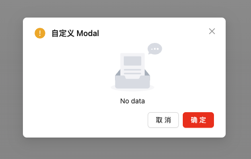

# Ant Design 以函数的方式打开 Modal

[Ant Design](https://ant.design/index-cn/) 的 [Modal](https://ant.design/components/modal-cn) 提供了一系列静态方法（如 [`Modal.confirm`](https://ant.design/components/modal-cn#modalmethod) ）打开一个 Modal，但是在实际的应用中，我们都需要自定义 Modal，不过很可惜，Ant Design 没有提供方法并以函数的方式打开自定义的 Modal，这篇文章我们来研究一下 Ant Design 怎样以函数的方式打开自定义的 Modal。

>  如果你使用 ElementUI 并且想要以函数的方式打开 Dialog，可以参考我的另一篇文章 [ElementUI 以函数的方式打开 Dialog](./2022-03-02-elementui-dialog.md)。

## 现状

一般我们都是这样使用 Modal：首先自定义 Modal，然后在页面代码里引入这个自定义 Modal，通过 `open` 属性控制打开或者关闭 Modal，最后处理 Modal 的 `onOk` 或者 `onCancel` 的回调方法。

### 自定义 Modal

```jsx
// custom.tsx
import { Modal } from 'antd';
import styles from './index.less';

function CustomModal(
	otherData,
  onOk,
  ...rest
}: AddExperimentModalProps) {
  const handleOk = () => {
    // 处理逻辑
    onOk();
  }
  return (
    <KFModal
      {...rest}
      className={styles.modal}
			onOk={handleOk}
      destroyOnClose={true}
      width={825}
    >
      // 自定义内容
    </KFModal>
  );
}

export default CustomModal;
```

### 使用 Modal

```jsx
// page.tsx
import CustomModal from './CustomModal';

function Page() {
  // 控制显示
  const [isModalOpen, setIsModalOpen] = useState(false);
  // Modal 需要的数据
  const [otherData, setOtherData] = useState({});
  
  // 打开 Modal
  const openModal = (data) => {
    setIsModalOpen(true)
    setOtherData(data)
  }
  
  // 关闭 Modal
  const handleCancel = () => {
    setIsModalOpen(false)
  }
  
  // 处理业务逻辑
  const handleOk = () => {
    // 处理业务逻辑...
    setIsModalOpen(false)
  }
  
  return (<div>
    <CustomModal
      open={isModalOpen}
      onCancel={handleCancel}
      onOk={handleOk}
      otherData={otherData}
    />
  </div>);
}
```

### 问题

上面的这种方式存在下面几个问题：

- 要定义控制 Modal 是否显示的 state，如果一个页面存在很多个不同的 Modal，就需要定义多份 state，有时候会为怎么命名这些 state 感到头痛。
-  打开 Modal 和处理 Modal 的业务逻辑分离，不利于阅读代码和理解业务。
- 可能需要临时存储 Modal 需要的一些数据。

## 以函数的方式打开 Modal

通过以函数的方式打开 Modal，就可以完全避免上述问题。

### 定义打开 Modal 的函数

主要原理是通过 [`createRoot`](https://react.docschina.org/reference/react-dom/client/createRoot) 创建根节点，然后通过 [`root.render()`](https://react.docschina.org/reference/react-dom/client/createRoot#root-render) 渲染自定义的 Modal，然后通过 [`root.unmount()`](https://react.docschina.org/reference/react-dom/client/createRoot#root-unmount) 关闭 Modal。

```tsx
import { ConfigProvider, type ModalProps } from 'antd';
import { globalConfig } from 'antd/es/config-provider';
import zhCN from 'antd/locale/zh_CN';
import React, { useState } from 'react';
import { createRoot } from 'react-dom/client';
// 保存打开 Modal 的 close 方法
const destroyFns: (() => void)[] = [];

export const openAntdModal = <T extends Omit<ModalProps, 'onOk'>>(
  modal: (props: T) => React.ReactNode,
  modalProps: T,
) => {
  const CustomModel = modal;
  const container = document.createDocumentFragment();
  const root = createRoot(container);
  const { afterClose, onCancel } = modalProps;
  const global = globalConfig();
  let timeoutId: ReturnType<typeof setTimeout>;

  function destroy() {
    const index = destroyFns.indexOf(close);
    if (index !== -1) {
      destroyFns.splice(index, 1);
    }
    root.unmount();
  }

  function handleAfterClose() {
    afterClose?.();
    // Warning: Attempted to synchronously unmount a root while React was already rendering.
    // React cannot finish unmounting the root until the current render has completed, which may lead to a race condition.
    setTimeout(() => {
      destroy();
    }, 0);
  }

  function handleCancel(e: React.MouseEvent<HTMLButtonElement, MouseEvent>) {
    if (onCancel) {
      onCancel(e);
    } else {
      close();
    }
  }

  function render(props: T) {
    clearTimeout(timeoutId);
    timeoutId = setTimeout(() => {
      const rootPrefixCls = global.getPrefixCls();
      const iconPrefixCls = global.getIconPrefixCls();
      const theme = global.getTheme();
      const dom = (
        <CustomModel {...props} onCancel={handleCancel} afterClose={handleAfterClose}></CustomModel>
      );

      root.render(
        <ConfigProvider
          prefixCls={rootPrefixCls}
          iconPrefixCls={iconPrefixCls}
          theme={theme}
          locale={zhCN}
        >
          {global.holderRender ? global.holderRender(dom) : dom}
        </ConfigProvider>,
      );
    });
  }

  function close() {
    render({ ...modalProps, open: false });
  }
  render({ ...modalProps, open: true });
  destroyFns.push(close);
  return {
    close,
  };
};
```

### 使用函数打开 Modal

```tsx
// page.tsx
import CustomModal from './CustomModal';

function Page() {
  // 打开 Modal
  const openModal = (data) => {
    const { close } = openAntdModal(CustomModal, {
    otherData: data,
    onOk: (res) => {
			// 处理业务逻辑...
      close();
  	});
  }
  
  return (<div onClick={openModal}>打开 Modal </div>);
}
```

无需多余的 state，无需临时存储 Modal 所需的数据，打开 Modal 、关闭 Modal 和处理 Modal 的业务逻辑在一起，Nice。

### 遇到的问题

#### 全局配置的主题没有生效

因为通过函数的方式打开 Modal，是通过 `ReactDOM.render` 动态创建新的 React 实例。其 context 与当前代码所在 context 并不相同，因而无法获取全局配置的主题。

但是我发现 [Modal.method()](https://ant.design/components/modal-cn#modalmethod) 能正确地显示全局配置的主题，比如主题色。通过研究 [Modal.method()](https://ant.design/components/modal-cn#modalmethod) 的源代码 [`confirm`](https://github.com/ant-design/ant-design/blob/master/components/modal/confirm.tsx)，我找到了解决这个问题的办法：通过 [`globalConfig()`](https://github.com/ant-design/ant-design/blob/master/components/config-provider/index.tsx#L274) 获取全局配置，然后通过 [`ConfigProvider`](https://ant.design/components/config-provider-cn) 组件进行设置

```tsx {15-19}
import { ConfigProvider } from 'antd';
import { globalConfig } from 'antd/es/config-provider';

function render(props: T) {
  clearTimeout(timeoutId);

  timeoutId = setTimeout(() => {
    const rootPrefixCls = global.getPrefixCls();
    const iconPrefixCls = global.getIconPrefixCls();
    const theme = global.getTheme();
    const dom = (
      <CustomModel {...props} onCancel={handleCancel} afterClose={handleAfterClose}></CustomModel>
    );

    root.render(
      <ConfigProvider
        prefixCls={rootPrefixCls}
        iconPrefixCls={iconPrefixCls}
        theme={theme}
      >
        {global.holderRender ? global.holderRender(dom) : dom}
      </ConfigProvider>,
    );
  });
}
```

这样自定义 Modal 就能正确显示全局配置的主题了。自定义 Modal 还能通过 `holderRender` 配置主题，使用方法和[这里](https://ant.design/components/config-provider-cn#config-provider-demo-holderrender)一样。

#### Token 失效，跳转到登录页面，而 Modal 没有关闭

因为通过函数的方式打开 Modal，是通过 `ReactDOM.render` 动态创建新的 React 实例，所以除了手动关闭外之外是不会随着页面注销而关闭的，所以需要一个方法在跳转到登录页面，关闭未手动关闭的 Modal。

同样通过研究 [Modal.method()](https://ant.design/components/modal-cn#modalmethod) 的源代码 [`confirm`](https://github.com/ant-design/ant-design/blob/master/components/modal/confirm.tsx)，找到了解决这个问题的办法：那就是定义一个数组，打开 Modal 时，往数组里添加 相关的 `close` 方法，手动关闭的时候，移除这个 `close` 方法，最后提供一个方法 `closeAllModals`，在路由切换或者跳转到登录页面时，调用这个方法，关闭没有手动关闭的 Modal。

```tsx
export const closeAllModals = () => {
  let close = destroyFns.pop();
  while (close) {
    close();
    close = destroyFns.pop();
  }
};
```

#### Modal 里面国际化有问题

自定义 Modal 的的"确定"、"取消"按钮能正确显示，但是 Modal 使用的其它组件，显示的英文的，比如 `Empty` 组件，显示的是 `No data`，而不是中文的 `暂无数据`。这个问题在 [Modal.method()](https://ant.design/components/modal-cn#modalmethod)  静态方法也存在。



解决办法是引入 Ant Design 语言包

```tsx
import zhCN from 'antd/locale/zh_CN';

root.render(
  <ConfigProvider
    prefixCls={rootPrefixCls}
    iconPrefixCls={iconPrefixCls}
    theme={theme}
    locale={zhCN}
  >
    {global.holderRender ? global.holderRender(dom) : dom}
  </ConfigProvider>
);
```

如果项目支持多语言，可以使用一个映射，然后通过获取当前使用的语言，找到语言包，比如下面使用 [umijs/max](https://umijs.org/docs/max/i18n)

```js
import { getLocale } from 'umijs/max';
import zh_CN from 'antd/locale/zh_CN';
import en_US from 'antd/locale/en_US';

const locales = {
  zh_CN,
  en_US
};

const localeKey = getLocale();
const locale = locales(localeKey);
```

## 以函数的方式打开 Modal 并挂载

上面定义的 `openAntdModal` 方法和  [Modal.method()](https://ant.design/components/modal-cn#modalmethod) 静态方法一样，[无法获取 Context 的内容](https://ant.design/components/modal-cn#%E4%B8%BA%E4%BB%80%E4%B9%88-modal-%E6%96%B9%E6%B3%95%E4%B8%8D%E8%83%BD%E8%8E%B7%E5%8F%96-contextredux%E7%9A%84%E5%86%85%E5%AE%B9%E5%92%8C-configprovider-localeprefixclstheme-%E7%AD%89%E9%85%8D%E7%BD%AE)，因此 Ant Design 推荐使用  [`Modal.useModal()`](https://ant.design/components/modal-cn#modalusemodal) 或者 [`App.useApp()`](https://ant.design/components/app-cn)。而且有些时候我们需要在 Modal 关闭之后访问 Modal 的内容。以上两种情况，我们需要以函数的方式打开 Modal 并挂载到当前页面上。

### 定义 Hook

我这里定义了一个 hook，返回 Modal、打开函数、关闭函数

```tsx
export const useModal = <T extends ModalProps>(
  modal: (props: T) => React.ReactNode,
  name: React.Key,
  defaultProps?: T,
) => {
  const [visible, setVisible] = useState(false);
  const [props, setProps] = useState<T>(defaultProps || ({} as T));
  const CustomModel = modal;

  const open = (props: T) => {
    setProps((prev) => ({
      ...prev,
      ...props,
    }));
    setVisible(true);
  };

  const close = () => {
    setVisible(false);
  };

  return [
    <CustomModel key={name} open={visible} {...props} />,
    open,
    close,
  ] as const;
};
```

### 使用 Hook

```tsx
import CustomModal from '@/components/Modal';
import { useModal } from '@/utils';
import { createContext } from 'react';

export const ReachableContext = createContext<string | null>(null);

function Page() {
  const [modal, openModal, closeModel] = useModal(CustomModal, 'Modal');
  const handleClick = () => {
    const config = {
      title: '自定义 Modal',
      centered: true,
      onCancel: () => {
        console.log('onCancel');
        closeModel();
      },
      onOk: (values: any) => {
        console.log('onOk', values);
        closeModel();
      },
    };
    openModal(config);
  };

  return (
    <div className={styles.container}>
      <Button onClick={handleClick}>
        打开 Modal
      </Button>
      {modal}
    </div>
  );
};
```

## 使用 `App.useApp()` 获取 Context 的内容

 [`App.useApp()`](https://ant.design/components/app-cn) 可以访问 context 的内容，但是使用比 [`Modal.useModal()`](https://ant.design/components/modal-cn#modalusemodal) 复杂，需要多一层的封装。

```tsx
export const ReachableContext = createContext<string | null>(null);

// Context.Provider 包含 App 
export const Page = () => {
  return (
    <ReachableContext.Provider value="Light">
      <App></App>
    </ReachableContext.Provider>);
}

// 子组件使用 App.useApp() 时，才能访问的 Context 的内容
export const SubPage = () => {
  const { modal } = App.useApp();
  const handleOpen = () => {
    modal.confirm({
      title: '自定义 Modal',
      content: (
        <>
          <ReachableContext.Consumer>
            {(name) => `context value: ${name}!`}
          </ReachableContext.Consumer>
        </>
      ),
    });
  };
}
```

### 原理

 [`App.useApp()`](https://ant.design/components/app-cn) 其实内部使用了 [`Modal.useModal()`](https://ant.design/components/modal-cn#modalusemodal) 并将 `ModalContextHolder` 插入到上下文中，所以 `App` 必须在 Context 之下，同时要获取 `const { modal } = App.useApp();` 必须要在 App 的子组件里。

```tsx
const App = () => {
  const [ModalApi, ModalContextHolder] = useModal();
  return (
    <AppContext.Provider value={memoizedContextValue}>
      <AppConfigContext.Provider value={mergedAppConfig}>
        <Component {...(component === false ? undefined : rootProps)}>
          {ModalContextHolder}
          {messageContextHolder}
          {notificationContextHolder}
          {children}
        </Component>
      </AppConfigContext.Provider>
    </AppContext.Provider>,
  );
}

const useApp = () => React.useContext<useAppProps>(AppContext);
```

## References

- [`confirm`](https://github.com/ant-design/ant-design/blob/master/components/modal/confirm.tsx)
- [Ant Design](https://ant.design/index-cn)


