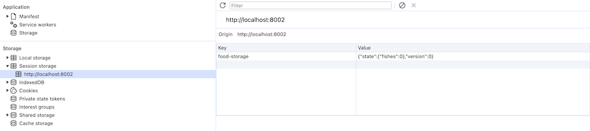
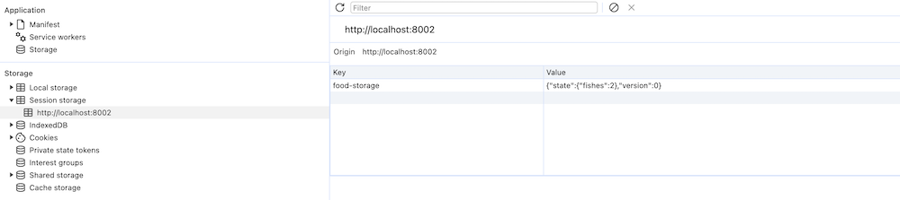
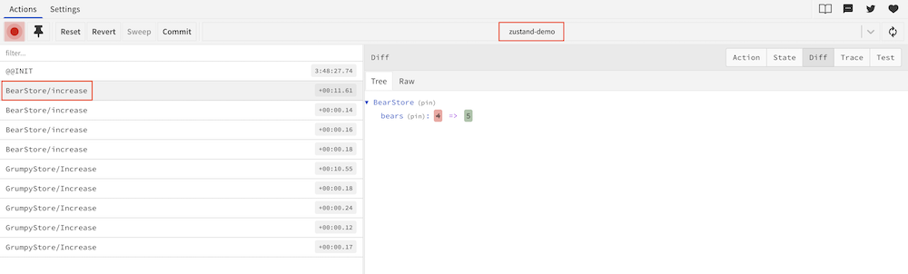

# Zustand

[Zustand](https://github.com/pmndrs/zustand) 是一个 React 状态管理的库，它比 Redux 更简单、更轻便、更灵活，使用起来就像在用 React hook 一样，没有 Redux 那么多的样板代码。

## 安装

```sh
$ pnpm i zustand
```

## 基本用法

```ts
// useBearStore.ts
import { create } from 'zustand';

type BearStore = {
  bears: number;
  increase: () => void;
  reset: () => void;
};

const useBearStore = create<BearStore>()((set) => ({
  bears: 0,
  increase: () => set((state) => ({ bears: state.bears + 1 })),
  reset: () => set({ bears: 0 }),
}));

export default useBearStore;
```

> 📢  在 Typescript 中，`create` 方法需要定义 store 的类型和使用 curry 函数，详情请参考 [TypeScript Guide](https://docs.pmnd.rs/zustand/guides/typescript)。

在 React 组件中使用

```react
import useBearStore from '@/store/useBearStore';

function BasicPage() {
  // 推荐使用 selector，避免不必要的渲染
  const bears = useBearStore((state) => state.bears);
  const increase = useBearStore((state) => state.increase);
  const reset = useBearStore((state) => state.reset);
  // 如果确定不会引起不必要的渲染，也可以直接这么使用
  // const { bears, increase, reset } = useBearStore();
  return (
    <div>
      <div>{bears}</div>
      <div>
        <Button onClick={increase}>增加</Button>
        <Button onClick={reset}>重置</Button>
      </div>
    </div>
  );
}

export default BasicPage;
```

就是这么简单，就像在使用 React Hook 一样。

## Selector

如上面的例子所示，使用 store 的时候，zustand 推荐使用 selector，这样可以避免不必要的渲染。

```ts
const bears = useBearStore((state) => state.bears);
const increase = useBearStore((state) => state.increase);
```

如果有很多的状态值，不想重复这些样板代码，可以定义一个自动生成 selector 的函数: `createSelectors`

```ts
import { StoreApi, UseBoundStore } from 'zustand'

type WithSelectors<S> = S extends { getState: () => infer T }
  ? S & { use: { [K in keyof T]: () => T[K] } }
  : never

const createSelectors = <S extends UseBoundStore<StoreApi<object>>>(
  _store: S,
) => {
  let store = _store as WithSelectors<typeof _store>
  store.use = {}
  for (let k of Object.keys(store.getState())) {
    (store.use as any)[k] = () => store((s) => s[k as keyof typeof s])
  }

  return store
}
```

然后就使用这个函数来简化代码， 更多详情请参考 [Auto Generating Selectors](https://docs.pmnd.rs/zustand/guides/auto-generating-selectors).

```ts
const useBearStoreSelector = createSelectors(useBearStore);

const bears = useBearStore.use.bears()
const increment = useBearStore.use.increment()
```

> 很好奇为什么 zustand 把这种解决方案写在文档了，而不直接写成 API 呢？

#### useShallow

Zustand 使用 [Object.is](https://developer.mozilla.org/en-US/docs/Web/JavaScript/Reference/Global_Objects/Object/is?retiredLocale=it) 判断 selector 返回的状态值是否发现了变化，对于 primitive 类型的值是没有问题的，但是如果 selector 返回的对象类型，可能会导致不必要的渲染，这个时候可以使用  [`useShallow`](https://github.com/pmndrs/zustand/blob/main/docs/guides/prevent-rerenders-with-use-shallow.md) 来比较值是否真的发生了变化。

```ts
// useMeals.ts
import { create } from 'zustand';

type MealsStore = {
  papaBear: string;
  mamaBear: string;
  littleBear: string;
};

const useMeals = create<MealsStore>()(() => ({
  papaBear: 'large porridge-pot',
  mamaBear: 'middle-size porridge pot',
  littleBear: 'A little, small, wee pot',
}));

export default useMeals;
```
组件使用
```react
import useMeals from '@/store/useMeals';
import { useShallow } from 'zustand/react/shallow';

const SelectorPage = () => {
  const names = useMeals(useShallow((state) => Object.keys(state)));

  const changePapaBear = () => {
    useMeals.setState({
      papaBear: 'a large pizza',
    });
  };

  return (
    <div className={styles.container}>
      <div style={{ marginBottom: 30, fontSize: 30 }}>{names.join(', ')}</div>
      <Button onClick={changePapaBear}></Button>
    </div>
  );
};

export default SelectorPage;
```

修改 `papaBear` 的值并不影响 `Object.keys(state)` 的值，但是如果不使用 `useShallow` 会导致 `Object.keys(state)` 每次返回一个新数组，[Object.is](https://developer.mozilla.org/en-US/docs/Web/JavaScript/Reference/Global_Objects/Object/is?retiredLocale=it) 判断 `false`，从而导致组件重新渲染。

需要注意的是，[`useShallow`](https://github.com/pmndrs/zustand/blob/main/docs/guides/prevent-rerenders-with-use-shallow.md) 和 React PureComponent 一样是浅层次的比较，如果需要进行深层次的比较可以自定义相等函数，比如使用 lodash 的 [`isEqual`](https://lodash.com/docs/4.17.15#isEqual) 函数。

```ts
const treats = useBearStore(
  (state) => state.treats,
  (oldTreats, newTreats) => _.isEqual(oldTreats, newTreats)
)
```

## 异步

Zustand 使用异步也非常简单，直接定义异步函数即可，无需额外的配置。组件使用也没有区别。

```ts
// useUserStore.ts
import { getCurrentUserReq } from '@/services/user';
import { create } from 'zustand';

type UserStore = {
  user?: API.UserInfo;
  getUser: () => void;
};

const useUserStore = create<UserStore>()((set) => ({
  user: undefined,
  getUser: async () => {
    const { data, success } = await getCurrentUserReq();
    if (success) {
      set({ user: data });
    }
  },
}));

export default useUserStore;
```

## 非响应式

`useBearStore()` 作为 React Hook 只能用于 React 组件，怎么在 React 组件外面使用 zustand 呢？Zustand 提供了下面的 API 来处理这个问题：

- `getInitialState` - 获取状态值
- `getState` - 获取状态值
- `setState` - 设置状态值
- `subscribe` - 订阅状态的变化

```tsx
const increase = () => {
  const preBears = useBearStore.getState().bears;
  useBearStore.setState({ bears: preBears + 1 });
};

const reset = () => {
  useBearStore.setState({ bears: 0 });
};

const unsub = useBearStore.subscribe((cur, pre) => {
  console.log(cur, pre);
});

// 取消订阅
unsub();
```

> 📢 上面的例子中是 `useBearStore` 而不是 `useBearStore()`

此外 Zustand 提供了 `createStore` API 专用于非响应式的情形

```js
import { createStore } from 'zustand/vanilla'

const store = createStore((set) => ...)
const { getState, setState, subscribe, getInitialState } = store

export default store
```

这种情况如果想转换为响应式，使用 `useStore` hook

```js
import { useStore } from 'zustand'
import { vanillaStore } from './vanillaStore'

const useBoundStore = (selector) => useStore(vanillaStore, selector)
```

## Slices 模式

随着功能越来多，store 会变得越来越大，越来越难维护。这个时候你可以把 store 分成更小的 slices，然后将 slices 组合起来

```ts
import { create, StateCreator } from 'zustand';

interface BearSlice {
  bears: number;
  addBear: () => void;
  eatFish: () => void;
}

interface FishSlice {
  fishes: number;
  addFish: () => void;
}

interface SharedSlice {
  addBoth: () => void;
  getBoth: () => void;
}

const createBearSlice: StateCreator<
  BearSlice & FishSlice,
  [],
  [],
  BearSlice
> = (set) => ({
  bears: 0,
  addBear: () => set((state) => ({ bears: state.bears + 1 })),
  eatFish: () => set((state) => ({ fishes: state.fishes - 1 })),
});

const createFishSlice: StateCreator<
  BearSlice & FishSlice,
  [],
  [],
  FishSlice
> = (set) => ({
  fishes: 0,
  addFish: () => set((state) => ({ fishes: state.fishes + 1 })),
});

const createSharedSlice: StateCreator<
  BearSlice & FishSlice,
  [],
  [],
  SharedSlice
> = (set, get) => ({
  addBoth: () => {
    // you can reuse previous methods
    get().addBear();
    get().addFish();
    // or do them from scratch
    // set((state) => ({ bears: state.bears + 1, fishes: state.fishes + 1 })
  },
  getBoth: () => get().bears + get().fishes,
});

const useBoundStore = create<BearSlice & FishSlice & SharedSlice>()((...a) => ({
  ...createBearSlice(...a),
  ...createFishSlice(...a),
  ...createSharedSlice(...a),
}));

export default useBoundStore;
```

## Store 混用

Slices 模式只是将一个复杂的 store 先拆分再合并，我更喜欢 [Pinia](https://pinia.vuejs.org/) 的模式：直接在 store 里使用另外的 stores。

上面的 Slices 模式可以这样使用 `useFishStore` 和 `useMixStore` 是独立的 store.

```ts
// useFishStore.ts
import { create } from 'zustand';

type FishStore = {
  fishes: number;
  addAFish: () => void;
  substractAFish: () => void;
};

const useFishStore = create<FishStore>()(
  (set, get) => ({
      fishes: 0,
      addFish: () => set({ fishes: get().fishes + 1 }),
      substractFish: () => set({ fishes: get().fishes - 1 }),
    })
);

export default useFishStore;
```
在其它的 store 里使用 `useFishStore`
```ts
// useMixStore.ts
import { create } from 'zustand';
import useFishStore from './useFishStore';

type BearStore = {
  bears: number;
  addBear: () => void;
  eatFish: () => void;
};
const useMixStore = create<BearStore>()((set) => ({
  bears: 0,
  addBear: () => set((state) => ({ bears: state.bears + 1 })),
  eatFish: () => {
    const fishes = useFishStore.getState().fishes;
    useFishStore.setState({ fishes: fishes - 1 });
    // 或者
    // useFishStore.getState().substractFish();
  },
}));

export default useMixStore;
```

## 中间件

Zustand 提供了多个中间件，来增强功能、简化代码

### Combine

前面提到在 Typescript 中，zustand 的 `create` 方法需要定义 store 的类型和使用 curry 函数，但是通过 `combine` 中间件就免去了这些操作

```ts
import { create } from 'zustand'
import { combine } from 'zustand/middleware'

const useBearStore = create(
  combine({ bears: 0 }, (set) => ({
    increase: (by: number) => set((state) => ({ bears: state.bears + by })),
  })),
)
```

`useBearStore` 能被正确推导出类型。

### Immer

Zustand 和 Redux 一样都是合并 state，要求不能直接修改 state，这对应修改嵌套对象不是很方便，所以 Zustand 和 Redux 一样使用 [`Immer`](https://github.com/mweststrate/immer)，来简化修改嵌套对象的值

**使用 `Immer` 库**

```ts
import { produce } from 'immer';
import { create } from 'zustand';

type BeeStore = {
  lush: { forest: { bees: number } };
  addBees: (by: number) => void;
};

const useBeeStore = create<BeeStore>()((set) => ({
  lush: { forest: { bees: 0 } },
  addBees: (by) =>
    set(
      produce((state) => {
        state.lush.forest.bees += by;
      }),
    ),
}));

export default useBeeStore;
```

**使用 `Immer` 中间件**

```ts
import { create } from 'zustand'
import { immer } from 'zustand/middleware/immer'

type BeeStore = {
  lush: { forest: { bees: number } };
  addBees: (by: number) => void;
};

const useBeeStore = create<BeeStore>()(
  immer((set) => ({
    lush: { forest: { bees: 0 } },
    addBees: (by) =>
      set((state) => {
        state.lush.forest.bees += by;
      }),
  })),
);
```

### SubscribeWithSelector

Zustand 的 `subscribe` 方法有一个缺陷，store 的任何改变都会触发 `subscribe` 回调，如果你只想某个值变化时才触发 `subscribe` 回调，可以使用 `subscribeWithSelector` 中间件

```ts
type BearStore = {
  bears: number;
  bees: number;
};

const useBearStoreWithSelector = create<BearStore>()(
  subscribeWithSelector(() => ({
    bears: 0,
    bees: 0,
  })),
);

const unsub = useBearStoreWithSelector.subscribe(
  (state) => state.bears,
  (curBears, preBears) => {
    console.log(curBears, preBears);
  },
);

// 取消订阅
unsub()
```

使用 `subscribeWithSelector` 中间件也支持订阅整个 state

```ts
const unsub = useBearStoreWithSelector.subscribe(
  (curState, preState) => {
    console.log(curState, preState);
  },
);
```

### Persist

使用 `persist` 中间件持久化 store 数据，你可以使用任意的储存库，比如 [`localStorage`](https://developer.mozilla.org/en-US/docs/Web/API/Window/localStorage) (默认)、[`sessionStorage`](https://developer.mozilla.org/en-US/docs/Web/API/Window/sessionStorage)、[`async-storage`](https://github.com/react-native-async-storage/async-storage)。

持久化数据的好处就是刷新浏览器时，store 能保持之前的状态。

```ts
import { create } from 'zustand';
import { createJSONStorage, persist } from 'zustand/middleware';

type FishStore = {
  fishes: number;
  addAFish: () => void;
};

const useFishStore = create<FishStore>()(
  persist(
    (set, get) => ({
      fishes: 0,
      addAFish: () => set({ fishes: get().fishes + 1 }),
    }),
    {
      name: 'food-storage', // name of the item in the storage (must be unique)
      storage: createJSONStorage(() => sessionStorage), // (optional) by default, 'localStorage' is used
    },
  ),
);

export default useFishStore;
```

使用时或者状态变化时会同步数据到 `sessionStorage`

初始值



变化后



Persist 中间件还有很多配置选项，详情请参考 [Persist middleware](https://github.com/pmndrs/zustand/blob/main/docs/integrations/persisting-store-data.md)

### Redux

如果你想要 Redux 风格，可以这样定义 store

```ts
// useGrumpyStore.ts
import { create } from 'zustand';

export enum GrumpyType {
  Increase = 'Increase',
  Decrease = 'Decrease',
}

type Action = {
  type: GrumpyType;
  by: number;
};

type GrumpyStore = {
  grumpiness: number;
  dispatch: (args: Action) => void;
};

const reducer = (
  state: GrumpyStore,
  { type, by = 1 }: Action,
) => {
  switch (type) {
    case GrumpyType.Increase:
      return { grumpiness: state.grumpiness + by };
    case GrumpyType.Decrease:
      return { grumpiness: state.grumpiness - by };
  }
};

const useGrumpyStore = create<GrumpyStore>()((set) => ({
  grumpiness: 0,
  dispatch: (args) => set((state) => reducer(state, args)),
}));

export default useGrumpyStore;
```

Zustand 提供了 `redux` 中间件来简化代码

```ts
// useGrumpyStore.ts
import { create } from 'zustand';
import { redux } from 'zustand/middleware';

export enum GrumpyType {
  Increase = 'Increase',
  Decrease = 'Decrease',
}
type Action = {
  type: GrumpyType;
  by: number;
};

type GrumpyState = {
  grumpiness: number;
};

const reducer = (state: GrumpyState, { type, by = 1 }: Action): GrumpyState => {
  switch (type) {
    case GrumpyType.Increase:
      return { grumpiness: state.grumpiness + by };
    case GrumpyType.Decrease:
      return { grumpiness: state.grumpiness - by };
  }
};

const initialState: GrumpyState = {
  grumpiness: 0,
};

// 不需要标注 create 函数，也不需要使用 curry 版本
const useGrumpyStore = create(redux(reducer, initialState));

export default useGrumpyStore;
```

> 当使用 `redux` 中间件时不需要标注类型，也不需要使用 `create` curry 版本，详情请参考 [TypeScript Guide](https://docs.pmnd.rs/zustand/guides/typescript#basic-usage).

组件使用

```tsx
const dispath = useGrumpyStore((state) => state.dispatch);
dispath({ type: GrumpyType.Increase, by: 1 }
```

### Redux Devtools

Zustand 提供了 `devtools` 中间件，通过它可以使用 [`redux-devtools`](https://github.com/reduxjs/redux-devtools) 工具进行状态监控、调试

```ts
import { create } from 'zustand';
import { devtools } from 'zustand/middleware';

type BearStore = {
  bears: number;
  increase: () => void;
  reset: () => void;
};

const useBearStore = create<BearStore>()(
  devtools(
    (set) => ({
      bears: 0,
      increase: () =>
        set((state) => ({ bears: state.bears + 1 }), false, 'increase'),
      reset: () => set({ bears: 0 }, false, 'reset'),
    }),
    { name: 'zustand-demo', store: 'BearStore' },
  ),
);

export default useBearStore;
```

有两点需要注意：

- 需要设置 name 和 store，`name: 'zustand-demo'` 表示在 devtools 中创建一个名为 "zustand-demo" 的单独实例。store 作为 action 前缀。

- 如果没有使用 `redux` 中间件，action 需要提供 action name，比如上面 `increase` 操作的 action name 为 "increase"，如果没有提供，默认是 "anonymous"



建议每一个 zustand store 都使用  `devtools` 中间件，方便调试。

## Demo

[zustand-demo](https://gitee.com/cp3hnu/web-demo/tree/master/zustand-demo)

## References

- [`Zustand`](https://github.com/pmndrs/zustand)
- [Zustand Doc](https://docs.pmnd.rs/zustand/getting-started/introduction)
- [Zustand vs Others State Libraries](https://docs.pmnd.rs/zustand/getting-started/comparison)
- [Auto Generating Selectors](https://docs.pmnd.rs/zustand/guides/auto-generating-selectors)
- [Slices Pattern](https://docs.pmnd.rs/zustand/guides/slices-pattern#slicing-the-store-into-smaller-stores)
- [Persist middleware](https://github.com/pmndrs/zustand/blob/main/docs/integrations/persisting-store-data.md)
- [Zustand Third-party Libraries](https://docs.pmnd.rs/zustand/integrations/third-party-libraries)
- [`Immer`](https://github.com/mweststrate/immer)
- [`Redux-devtools`](https://github.com/reduxjs/redux-devtools)