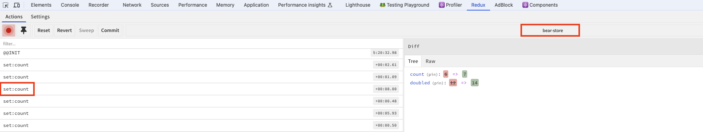

# Valtio

[Valtio](https://valtio.pmnd.rs/) 是另一个 React 状态管理的库，和 [Zustand](https://github.com/pmndrs/zustand) 一样出自 [Poimandres](https://github.com/pmndrs) 团队。 虽然 Zustand 比 [Redux](https://redux.js.org/) 更简单，减少了样板代码，但是 Zustand 的设计理念和 Redux 还是很相似的，都不能直接修改 state 值而是通过 action 来修改。而 Valtio 的设计理念完全不同，通过 [Proxy](https://developer.mozilla.org/en-US/docs/Web/JavaScript/Reference/Global_Objects/Proxy) 可以直接修改 state 并且在更新时进行细粒度的订阅和响应，这一点 Valtio 有点类似于 [Pinia](https://pinia.vuejs.org/zh/core-concepts/getters.html)。

## 安装

```sh
$ pnpm add valtio
```

## 基础用法

通过  `proxy()` 函数定义 state。`proxy()` 创建一个代理对象来检测变化，属于 valtio 的  "Proxy for write"。更多详情请参考 [proxy](https://valtio.pmnd.rs/docs/api/basic/proxy).

```ts
// src/store/bearStore.ts
import { proxy, useSnapshot } from 'valtio';
const bearState = proxy({ count: 0, text: 'hello' });
```

通过 `useSnapshot()` 函数使用 state， `useSnapshot()` 创建捕获了 state 的本地快照，属于 valtio 的  "Proxy for read"。更多详情请参考 [useSnapshot](https://valtio.pmnd.rs/docs/api/basic/useSnapshot).

```tsx
import bearState from '@store/bearStore';
import { useSnapshot } from 'valtio';

function Component() {
  const snap = useSnapshot(bearState);

  const increase = () => {
    bearState.count++;
  };

  const reset = () => {
    bearState.count = 0;
  };

  return (
    <div>
      <div>Bears: {snap.count}</div>
      <div>
        <Button onClick={increase}>增加</Button>
        <Button onClick={reset}>重置</Button>
      </div>
    </div>
  );
}
```

`useSnapshot()` 能自动收集访问了哪些 state 属性，只有当这些属性改变了，才会更新组件，避免无效的渲染。比如上面的例子，组件只访问了 `state.count`，如果 `state.text` 改变了，是不会重新渲染组件的。

> 📢  组件直接使用 state，不能更新组件

Valtio 默认是批量更新的，意思是同时多次修改 state，组件只会更新一次，如果想要每次都更新（比如受控 input），可以设置 `useSnapshot` 第二个参数为 `true`。

## 订阅

Valtio 提供了 3 个 API 支持订阅：

- `subscribe`
- `subscribeKey`
- `watch`

### `subscribe`

`subscribe` 支持订阅整个 state 或者部分属性（对象）。

```ts
import { subscribe } from 'valtio'

// Subscribe to all state changes
const unsubscribe = subscribe(state, () =>
  console.log('state has changed to', state),
)
// Unsubscribe by calling the result
unsubscribe()
```

订阅部分属性（对象）

```ts
const state = proxy({ obj: { foo: 'bar' }, arr: ['hello'] })

subscribe(state.obj, () => console.log('state.obj has changed to', state.obj))
state.obj.foo = 'baz'

subscribe(state.arr, () => console.log('state.arr has changed to', state.arr))
state.arr.push('world')
```

### `subscribeKey`

`subscribe` 订阅部分属性只能是对象，如果想订阅 primitive 类型，需要使用 `subscribeKey`。

```ts
import { subscribeKey } from 'valtio/utils'

const state = proxy({ count: 0, text: 'hello' })
subscribeKey(state, 'count', (newCount) =>
  console.log('state.count has changed to', newCount),
)
```

### `watch`

`watch` 可以订阅多个 state，一旦这些 state 发生改变，就会调用回调方法。调用 `watch` 会立即调用回调方法，这个有别于 `subscribe` 和  `subscribeKey`。更多详情请参考 [watch](https://valtio.pmnd.rs/docs/api/utils/watch)。

> `watch` 不能监听 state 的某一个属性，这个有别于 Vue 3 的 `watch` 方法

```ts
import { proxy } from 'valtio'
import { watch } from 'valtio/utils'

const userState = proxy({ user: { name: 'Juuso' } })
const sessionState = proxy({ expired: false })

const unwatch = watch((get) => {
  // `get` adds `sessionState` to this callback's watched proxies
  get(sessionState)
  const expired = sessionState.expired
  // Or call it inline
  const name = get(userState).user.name
  console.log(`${name}'s session is ${expired ? 'expired' : 'valid'}`)
  
  // call before each re-invocation of the callback or after `unwatch` called
  return () => {
    if (expired) {
      console.log('Cleaning up')
    }
  }
})
// 'Juuso's session is valid'
sessionState.expired = true
// 'Juuso's session is expired'
```

### 同步

Valtio 默认是批量更新的，即同时多次修改 state，默认只会通知订阅者一次。`subscribe`、`subscribeKey` 和 `watch` 提供了第二个参数 `notifyInSync` 或者 `{ sync }` ( `watch` ) 表示禁止批量更新，修改一次通知一次。

## 计算属性

不像 Zustand，Valtio 天然支持计算属性。Valtio 计算属性的语法和 JavaScript 一样。更多详情请参考 [Computed Properties](https://valtio.pmnd.rs/docs/guides/computed-properties)。

```ts
const state = proxy({
  count: 1,
  get doubled() {
    // 也可以使用 this
    return state.count * 2
  },
  set doubled(newValue) {
    state.count = newValue / 2
  },
})

console.log(state.doubled) // 2

state.count = 10

console.log(state.doubled) // 20

state.doubled = 4

console.log(state.count) // 2
```

## Actions

Valtio 支持直接修改 state，但是直接修改 state 不利于管理。Valtio 支持两种方式定义 actions。更多详情请参考 [How to organize actions](https://valtio.pmnd.rs/docs/how-tos/how-to-organize-actions)。

Valtio 推荐在模块里定义 action 函数，有利于代码分割

```ts 
const state = proxy({
  count: 0,
});

export const increase = () => {
  state.count++;
};

export const reset = () => {
  state.count = 0;
};

export default state;
```

也可以将 action 定义在 state 里

```ts
export const state = proxy({
  count: 0,
  inc: () => {
    ++state.count;
  },
  // 使用 this 时， 不能使用箭头函数
  reset() {
    this.count = 0;
  },
})
```

## 异步

Valtio 异步和同步没有区别，定义一个异步 action，然后在 action 里直接修改 state 即可。

```ts
// src/store/userStore.ts
import { getCurrentUserReq } from '@/services/user';
import { proxy } from 'valtio';

type UserStore = {
  user?: API.UserInfo;
  getUser: () => void;
};

const state = proxy<UserStore>({
  user: undefined,
  getUser: async () => {
    const { data, success } = await getCurrentUserReq();
    if (success) {
      state.user = data;
    }
  },
});

export default state;
```

组件使用 state

```tsx
import userStore from '@store/userStore';
import { useSnapshot } from 'valtio';

const AsyncPage = () => {
  const snap = useSnapshot(userStore);
  return (
    <PageContainer ghost>
      <div>
        <div>
          当前用户：{snap.user?.name || '未登录'}
        </div>
        <Button onClick={userStore.getUser}>获取用户</Button>
      </div>
    </PageContainer>
  );
};

export default AsyncPage;
```

### Promise

Valtio state 支持 Promise  属性，当调用 `snapshot()` 方法时，它会被 resolve 或者 reject。当 React 组件访问时， 组件会被挂起，此时父组件负责回退状态和错误处理。

```ts
// src/store/promiseStore.ts
import { getCurrentUserReq } from '@/services/user';
import { proxy } from 'valtio';

type UserStore = {
  user: Promise<API.UserInfo>;
};

const fetchUser = async (): Promise<API.UserInfo> => {
  const { data, success } = await getCurrentUserReq();
  if (success) {
    return data;
  }
  return Promise.reject(new Error('获取用户失败'));
};

const state = proxy<UserStore>({
  user: fetchUser(),
});

export default state;
```

定义组件，访问 `user.name`

```tsx
import userState from '@store/promiseStore';
import { useSnapshot } from 'valtio';

function UserComponent() {
  const snap = useSnapshot(userState);

  return (
    <div style={{ marginBottom: 30, fontSize: 30 }}>
      用户名: {snap.user.name}
    </div>
  );
}

export default UserComponent;
```

父组件负责回退状态和错误处理

```tsx
const PromisePage = () => {
  return (
    <PageContainer ghost>
      <div>
        <Suspense fallback="Loading...">
          <UserComponent />
        </Suspense>
      </div>
    </PageContainer>
  );
};

export default PromisePage;
```

个人觉得这个方式不是很好，考虑到 Promise 可能会失败，还需要添加 ErrorBoundary，增加了程序的复杂性，还不如直接使用异步函数。

## 持久化

Valtio 没直接有提供持久化的功能，但是可以自己实现

```js
const state = proxy(
  JSON.parse(localStorage.getItem('foo')) || {
    count: 0,
    text: 'hello',
  },
)

subscribe(state, () => {
  localStorage.setItem('foo', JSON.stringify(state))
})
```

Valtio 提到了一个持久化的非官方的库 [`valtio-persist`](https://github.com/Noitidart/valtio-persist)，但是很久没有更新了，谨慎使用。

## 工具

### Devtools

Valtio 也可以使用 [`redux-devtools`](https://github.com/reduxjs/redux-devtools) 工具进行状态监控、调试。

```ts
import { devtools } from 'valtio/utils'

const state = proxy({ count: 0, text: 'hello' })
devtools(state, { name: 'instance name', enabled: true })
```



但是相比 Zustand，Valtio 提供的 `devtools` 功能要弱很多，它只能定义 instance name，不能定义 store name，也不能定义 action name.

关于 Zustand 的  `devtools` 功能，请参考上一篇 [Zustand](/2024/05/20/zustand/#redux-devtools)

### `derive`

创建从其他代理派生的新代理，比如生成一个计算属性

```ts
import { derive } from 'derive-valtio'

// create a base proxy
const state = proxy({
  count: 1,
})

// create a derived proxy
const derived = derive({
  doubled: (get) => get(state).count * 2,
})
```

我觉得更有用的是组合多个代理，比如下面计算 bear 和 fish 的总数

```ts
import bearStore from '@store/bearStore';
import fishStore from '@store/fishStore';
import { derive } from 'derive-valtio';

const derived = derive({
  total: (get) => get(bearStore).count + get(fishStore).count,
});

export default derived;
```

### `proxyWithHistory`

用于创建具有快照历史记录的代理

```ts
// src/store/historyStore.ts
import { proxyWithHistory } from 'valtio-history';
const state = proxyWithHistory({ count: 0 });
export default state;

export const increase = () => {
  state.value.count += 1;
};
```

`proxyWithHistory` 返回的一个对象，真实的数据封装在属性 `value` 对象中，例如上面的例子，使用 `state.value.count` 访问 `count` 值。

`useSnapshot` 返回值也发生了改变，详情请参考 [valtio-history API](https://github.com/valtiojs/valtio-history/blob/main/packages/history-utility/docs/modules.md)

```tsx
import historyState, { increase } from '@store/historyStore';
const HistoryPage = () => {
  const { value, undo, redo, isRedoEnabled, isUndoEnabled } =
    useSnapshot(historyState);

  return (
    <PageContainer ghost>
      <div>
        <div>
          Bears: {value.count}
        </div>
        <div>
          <Button onClick={increase}>增加</Button>
          <Button disabled={!isUndoEnabled} onClick={undo}>
            Undo
          </Button>
          <Button disabled={!isRedoEnabled} onClick={redo}>
            Redo
          </Button>
        </div>
      </div>
    </PageContainer>
  );
};
```

> 📢 `valtio-history@0.3.5` deprecated `canUndo()` 方法，提供了 `isUndoEnabled` 属性，但是 `isUndoEnabled` 会慢一拍。比如上面的例子，当我增加 count 从 0 到 1 时，`isUndoEnabled`  为 false，我再在从 1 增加到 2 时， `isUndoEnabled`  才变成 true.

### `proxySet` 和 `proxyMap`

Javascript 里的 Set 类型不能代理，Valtio 提供了相同功能的类型 `proxySet`。

```ts
import { proxySet } from 'valtio/utils'

const state = proxySet([1, 2, 3])
//can be used inside a proxy as well
//const state = proxy({
//    count: 1,
//    set: proxySet()
//})

state.add(4)
state.delete(1)
state.forEach((v) => console.log(v)) // 2,3,4
```

相同的还有 `proxyMap`

```ts
import { proxyMap } from 'valtio/utils'

const state = proxyMap([
  ['key', 'value'],
  ['key2', 'value2'],
])
state.set('key', 'value')
state.delete('key')
state.get('key') // ---> value
state.forEach((value, key) => console.log(key, value)) // ---> "key", "value", "key2", "value2"
```

## 其它

### `ref`

Valtio 使用 `ref` 来封装不需要代理的 state。例如下面的 `uploads` 不需要代理，也就不需要响应性。

```ts
import { ref } from 'valtio'
const store = proxy({
  users: [
    { id: 1, name: 'Juho', uploads: ref([]) },
  ]
})
```

### `snapshot`

从代理对象创建不可变对象，`useSnapshot` 就是用另一个代理（使用 [`proxy-compare`](https://github.com/dai-shi/proxy-compare)）包装 `snapshot` 创建的快照对象以检测属性访问的。更多详情请参考 [snapshot](https://valtio.pmnd.rs/docs/api/advanced/snapshot)。

```ts
import { proxy, snapshot } from 'valtio'

const store = proxy({ name: 'Mika' })
const snap1 = snapshot(store)
console.log(snap1) // {name: 'Mika'}

store.name = 'Hanna'
const snap3 = snapshot(store)
console.log(snap3) // {name: 'Hanna'}
console.log(snap1) // {name: 'Mika'}
```

## Demo

[valtio-demo](https://gitee.com/cp3hnu/web-demo/tree/master/valtio-demo)

## References

- [Valtio](https://valtio.pmnd.rs/)
- [proxy](https://valtio.pmnd.rs/docs/api/basic/proxy)
- [snapshot](https://valtio.pmnd.rs/docs/api/advanced/snapshot)
-  [useSnapshot](https://valtio.pmnd.rs/docs/api/basic/useSnapshot)
- [watch](https://valtio.pmnd.rs/docs/api/utils/watch)
- [derive](https://github.com/valtiojs/derive-valtio)
- [Computed Properties](https://valtio.pmnd.rs/docs/guides/computed-properties)
-  [How to organize actions](https://valtio.pmnd.rs/docs/how-tos/how-to-organize-actions)
- [`proxy-compare`](https://github.com/dai-shi/proxy-compare)
- [`proxy-memoize`](https://github.com/dai-shi/proxy-memoize)
- [`valtio-history`](https://github.com/valtiojs/valtio-history)
- [`valtio-persist`](https://github.com/Noitidart/valtio-persist)
- [eslint-plugin-valtio](https://github.com/pmndrs/eslint-plugin-valtio)
- [Pinia](https://pinia.vuejs.org/zh/core-concepts/getters.html)
- [When I Use Valtio and When I Use Jotai](https://blog.axlight.com/posts/when-i-use-valtio-and-when-i-use-jotai/)
- [Can valtio replace jotai completely?](https://github.com/pmndrs/valtio/issues/141)
- [How Valtio Proxy State Works (Vanilla Part)](https://blog.axlight.com/posts/how-valtio-proxy-state-works-vanilla-part/)
- [How Valtio Proxy State Works (React Part)](https://blog.axlight.com/posts/how-valtio-proxy-state-works-react-part/)