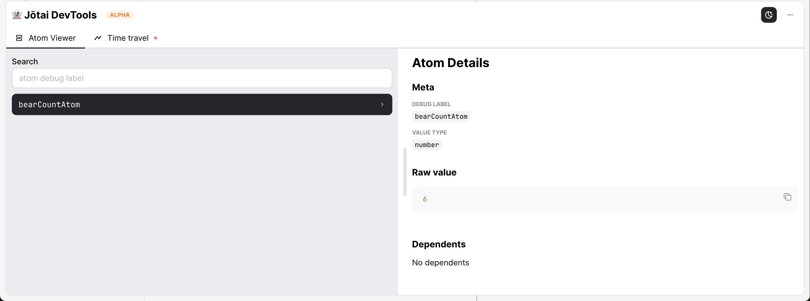
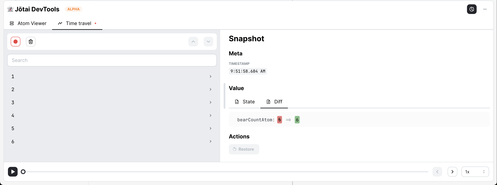
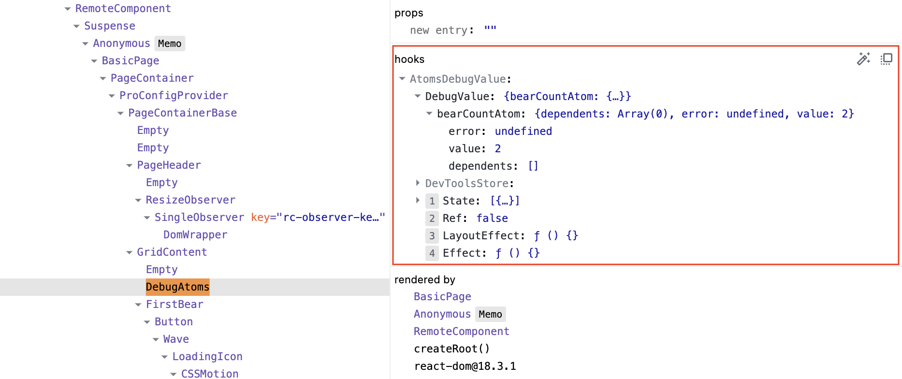
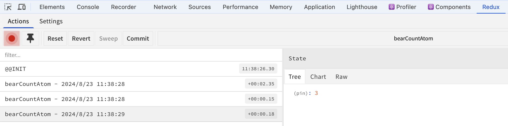

# Jotai

[Jotai](https://github.com/pmndrs/jotai) 是 [Poimandres](https://github.com/pmndrs) 团队开发的第三个状态管理库。[Zustand](https://github.com/pmndrs/zustand) 和 [Valtio](https://github.com/pmndrs/valtio) 以数据为中心，而 Jotai 以 React 组件为中心。React 通过很多小组件构建大的应用程序，同样 Jotai 通过很多小的原子状态构建整个应用状态。Jotai 的核心 API 很简单，就像在使用 `useState` 一样，但是 Jotai 提供了大量的工具和扩展来增强 Jotai 的能力。

> Zustand、Valtio 和 Jotai 我们该使用哪个呢？请参考作者的文章 [When I Use Valtio and When I Use Jotai](https://blog.axlight.com/posts/when-i-use-valtio-and-when-i-use-jotai/) 和 [Can valtio replace jotai completely?](https://github.com/pmndrs/valtio/issues/141)

## 安装

```sh
$ pnpm add jotai
```

## 基础用法

Jotai 的核心 API 很简单，首先通过 `atom` 函数定义一个原子 atom。

Jotai 建议使用 Primitive 类型的数据，如果使用对象类型的数据，需要注意，避免多余的渲染。

```ts
// countAtom.ts
const countAtom = atom(0);
export default countAtom;
```

然后通过 `useAtom` hook 使用这个 atom

```tsx
// BearComponent.tsx
import countAtom from '@store/countAtom';
import { useAtom } from 'jotai';

function BearComponent() {
  const [count, setCount] = useAtom(countAtom);
	const increase = () => setCount((s) => s + 1);
  const reset = () => setCount(0);

  return (
    <div>
      <div>Bears: {count}</div>
      <div>
        <Button onClick={increase}>增加</Button>
        <Button onClick={reset}>重置</Button>
      </div>
    </div>
  );
}
```

`useAtom` 就像 `useState` 一样，返回了一个值和更新函数。

除了使用 `useAtom` 之外，Jotai 还提供了两个 API：`useAtomValue` 和 `useSetAtom`

```ts
// 只读取 atom 的值
const count = useAtomValue(countAtom)

// 只获取更新函数。
// 如果组件不需要获取值，通过这个 API 可以避免因 atom 变化而导致的无意义的更新。
const setCount = useSetAtom(countAtom)
```

## `Store` 和 `Provider`

在 Jotai 里 `atom` 函数只是创建了一个原子配置，并没有保存一个值，真实的值其实是存在 store 里的。我们可以通过 `createStore` 函数创建一个 store。通过 store 可以获取、设置 atom 的值，而且能订阅 atom 的变化。

```ts
const countAtom = atom(0);

// 创建 store
const myStore = createStore();

// 设置 atom 的值
myStore.set(countAtom, 1)

// 订阅 atom 的变化
// 调用 `unsub()` 取消订阅
const unsub = myStore.sub(countAtom, () => {
  // 获取 atom 的值
  const value = myStore.get(countAtom)
  console.log('countAtom value is changed to', value)
})
```

`Provider` 组件会创建一个 store（或者通过 `store` prop 参数传入）， 从而为不同的 React 子树提供不同的 atom 值，它们可以嵌套使用，像 React Context 一样。当 `Provider` 组件卸载时，它将清除 store 里面所有的 atom 值。

```tsx {8,31,36-39}
import { useAtom, useStore } from 'jotai';
import countAtom from '@store/countAtom';

function BearComponent() {
  const [count, setCount] = useAtom(countAtom);
  const increase = () => setCount((s) => s + 1);
  const reset = () => setCount(0);
  const myStore = useStore();

  useEffect(() => {
    const unsub = myStore.sub(countAtom, () => {
      console.log(
        'countAtom value is changed to',
        myStore.get(countAtom),
      );
    });
    return () => unsub();
  }, []);

  return (
    <div>
      <div>Bears: {count}</div>
      <div>
        <Button onClick={increase}>增加</Button>
        <Button onClick={reset}>重置</Button>
      </div>
    </div>
  );
}

const store = createStore();

const StorePage = () => {
  return (
    <div>
      <Provider store={store}>
        <BearComponent />
      </Provider>
      <Provider>
        <BearComponent />
      </Provider>
    </div>
  );
};
```

上面例子中，两个 `BearComponent` 在不同的 Provider React 子树下，所以它们的 `countAtom` 状态值是不同的，而且相互独立。

在组件里可以通过 `useStore` hook 获取当前 React 子树的 store。

如果 React 子树没有提供 `Provider`，这种模式称为 "provider-less"，它会提供一个默认的 store，可以通过 `getDefaultStore` 函数获取这个默认的 store

```js
const defaultStore = getDefaultStore();
```

## 派生

 `atom`  除了定义一个原子 atom 之外，还可以创建派生 atom

```ts
// deriveStore.ts
import { atom } from 'jotai';

export const textState = atom('hello');

export const uppercaseTextState = atom(
  (get) => get(textState).toUpperCase(),
  (get, set, update: string) => set(textState, update.toLowerCase()),
);
```

Jotai 也可以定义只读或者只写的 atom，只要相应的 `read` 或者 `write` 参数传入 `null` 或者不写即可。

```tsx
import { textState, uppercaseTextState } from '@store/deriveStore';
import { useAtom, useAtomValue } from 'jotai';

const DerivePage = () => {
  const [text, setText] = useAtom(textState);
  const uppercaseText = useAtomValue(uppercaseTextState);

  return (
    <div className={styles.container}>
      <Input
        value={text}
        onChange={(e) => setText(e.target.value)}
      />
      <div>{uppercaseText}</div>
      </div>
  );
};
```

通过派生可以很容易实现 atom 的计算属性。

## Actions

Jotai 不支持在 atom 里定义 action，但是可以通过自定义 hook 来定义 actions.

```ts
export const useFishState = () => {
  const [count, setCount] = useAtom(fishCountAtom);

  const increase = () => {
    setCount((s) => s + 1);
  };

  const reset = () => {
    setCount(0);
  };

  return [count, increase, reset] as const;
};
```

## 异步

Jotai 异步和同步没有区别，定义一个异步 action，然后在 action 里直接调用 `setState` 即可。Jotai 也支持在派生里定义异步操作，但是使用异步派生 atom 时需要搭配 `Suspense`、`ErrorBoundary` 组件使用，这个类似于 Valtio 的 [Promise](/2024/06/09/valtio/#promise).

```ts
// promiseStore.ts
import { atom } from 'jotai'

export const userIdAtom = atom(1)
export const userAtom = atom(async (get, { signal }) => {
  const userId = get(userIdAtom)
  const response = await fetch(
    `https://jsonplaceholder.typicode.com/users/${userId}?_delay=2000`,
    { signal },
  )
  return response.json()
})
```

Jotai 的 `read` 函数支持 `signal` 参数，它使用了 [`AbortController`](https://developer.mozilla.org/en-US/docs/Web/API/AbortController)，这样你就可以中止异步函数。Jotai 会在在重新计算（即调用 `read` 函数）时中止异步函数。

```tsx
import { userAtom, userIdAtom } from '@store/promiseStore';
import { useAtom } from 'jotai';
import { Suspense } from 'react';
import { ErrorBoundary } from 'react-error-boundary';

const Controls = () => {
  const [userId, setUserId] = useAtom(userIdAtom);
  return (
    <div>
      <span>User Id: {userId}</span>
      <Button onClick={() => setUserId((c) => c - 1)}>Prev</Button>
      <Button onClick={() => setUserId((c) => c + 1)}>Next</Button>
    </div>
  );
};

const UserName = () => {
  const [user] = useAtom(userAtom);
  return <div>User name: {user.name}</div>;
};

const AsyncPage = () => {
  return (
    <div className={styles.container}>
      <Controls />
      <ErrorBoundary fallback={<div>出错了</div>}>
        <Suspense fallback="Loading...">
          <UserName />
        </Suspense>
      </ErrorBoundary>
    </div>
  );
};
```

### `loadable`

如果不想 React 处理回退状态和错误，可以使用 `loadable` 工具函数。`loadable` 处理异步状态，返回下面的数据结构：

```js
{
  // 3 种状态
  state: 'loading' | 'hasData' | 'hasError', 
  data?: any,
  error?: unknown
}
```

```tsx
import { loadable } from "jotai/utils"

const loadableAtom = loadable(userAtom)

const UserName = () => {
  const [value] = useAtom(loadableAtom);
  if (value.state === 'hasError') return <div>出错了</div>;
  if (value.state === 'loading') return <div>Loading...</div>;
  return <div> User name: {value.data.name}</div>;
};

const LoadablePage = () => {
  return (
    <div>
      <UserName />
      <Controls />
    </div>
  );
};
```

## 持久化

Jotai 提供 `atomWithStorage` 工具函数来实现 Storage.

`atomWithStorage` 创建一个 atom，其值保存在 `localStorage`/`sessionStorage` 或者 React Native 的 `AsyncStorage` 中。

```ts
import { useAtom } from 'jotai';
import { atomWithStorage } from 'jotai/utils';
const fishCountAtom = atomWithStorage('fish-count', 0);

export default fishCountAtom;
```

`atomWithStorage` 有四个参数

- `key`：Storage key
- `initialValue`: 初始值
- `storage`：`localStorage`（默认值）、`sessionStorage`、`AsyncStorage`，也可以自定义 storage
- `options`：
  - `getOnInit`：一个布尔值，指示是否在初始化时从存储器中获取项，默认是 `false`

### 删除存储

通过 `set(RESET)` 可以删除存储

```tsx
import { useAtom } from 'jotai'
import { atomWithStorage, RESET } from 'jotai/utils'

const textAtom = atomWithStorage('text', 'hello')

const TextBox = () => {
  const [text, setText] = useAtom(textAtom)

  return (
    <div>
      <Input value={text} onChange={(e) => setText(e.target.value)} />
      <Button onClick={() => setText(RESET)}>Reset (to 'hello')</Button>
    </div>
  )
}
```

## 重置

如果想要把 atom 重置到初始值，可以使用 `atomWithReset` 工具函数

```ts
import { atomWithReset } from 'jotai/utils'
const dollarsAtom = atomWithReset(0)
```

通过 `set(RESET)` 或者 `useResetAtom` 函数重置值到初始值

```tsx
import { useSetAtom } from 'jotai'
import { RESET, useResetAtom } from 'jotai/utils'

const ResettablePage = () => {
  const setDollars = useSetAtom(dollarsAtom)
  const resetDollars = useResetAtom(dollarsAtom)

  return (
    <div>
      <Button onClick={() => setDollars(RESET)}>Reset dollars</Button>
      <Button onClick={resetCents}>Reset cents</Button>
    </div>
  )
}
```

除了 `atomWithReset` 工具函数，还有 `atomWithDefault` 工具函数，它的初始值通过一个 `read` 函数来指定，而不是一个静态的初始值

```ts
import { atomWithDefault } from 'jotai/utils'

const count1Atom = atom(1)
const count2Atom = atomWithDefault((get) => get(count1Atom) * 2)
```

当 `atomWithDefault` 的 atom 通过 `set` 函数修改之后，它与原来依赖的 atom 之间的联系就被切断了，修改原来依赖的 atom 不会再改变 `atomWithDefault` 的 atom，通过 `useResetAtom` 重置，将重新建立彼此之间依赖。

此外还有一个 `atomWithRefresh` 工具函数，用来重新获取数据

```tsx
import { atomWithRefresh } from 'jotai/utils'

const postsAtom = atomWithRefresh((get) =>
  fetch('https://jsonplaceholder.typicode.com/posts').then((r) => r.json()),
)

const PostsList = () => {
  const [posts, refreshPosts] = useAtom(postsAtom)

  return (
    <div>
      <ul>
        {posts.map((post) => (<li key={post.id}>{post.title}</li>))}
      </ul>
      <Button onClick={refreshPosts}>Refresh posts</Button>
    </div>
  )
}
```

## 选择

前面提到过 Jotai 建议使用 Primitive 类型的数据，如果使用对象类型的数据，需要注意，避免多余的渲染。比如下面的例子

```tsx
import { atom, useAtom, useSetAtom } from 'jotai';

const userAtom = atom({
  id: 3,
  name: 'jotai',
  age: 18,
});

const UserNameComponent = () => {
  const [name, setName] = useSetAtom(userAtom);
  const changeName = () => {
    setName((prev) => ({
      ...prev,
      name: 'jotai',
    }));
  };

  return (
    <div>
      <div>Name: {name}</div>
      <div>
        <Button onClick={changeName}>修改 Name</Button>
      </div>
    </div>
  );
};
```

即使 `name` 没有变化，但是因为整个对象变了，也会导致组件重新渲染。

对于这种情况，可以使用 `selectAtom` 工具函数

```tsx {3,6}
import { selectAtom } from 'jotai/utils';

const selectNameAtom = selectAtom(userAtom, (s) => s.name);

const UserNameComponent = () => {
  const [name] = useAtom(selectNameAtom);
  const setName = useSetAtom(userAtom);
  const changeName = () => {
    setName((prev) => ({
      ...prev,
      name: 'jotai' + '#' + Math.floor(Math.random() * 100),
    }));
  };

  return (
    <div>
      <div>Name: {name}</div>
      <div>
        <Button onClick={changeName}>修改 Name</Button>
      </div>
    </div>
  );
};
```

需要注意的是 `selectAtom` 返回的是只读 atom，修改还是需要使用原来的 atom。

修改对象 atom 可以使用下面提到的 `jotai-immer` 扩展。

## 扩展

下面是 Jotai 提供的扩展，每一个都需要安装相应的依赖包。 

> Jotai 提供了很多扩展，这里只列举几个我平常用到的。更多扩展请参考 [Jotai Extensions](https://jotai.org/docs/extensions/trpc).

### Immer

`jotai-immer` 扩展简化修改对象 atom，就像 Immer 修改 JS 对象一样。

首先需要安装 `immer` 和 `jotai-immer` 

```sh
$ pnpm add immer jotai-immer
```

`jotai-immer` 扩展提供了 4 个 API：`atomWithImmer`、`withImmer`、`useImmerAtom` 和 `useSetImmerAtom` 。个人觉得 `useSetImmerAtom` 最实用，不需要定义额外的 atom，也不会导致组件多余的。

比如上面的例子可以通过 `useImmerAtom` 进行简化

 ```tsx {1,7-9}
 import { useSetImmerAtom } from 'jotai-immer';
 
 const UserNameComponent = () => {
   const [name] = useAtom(selectNameAtom);
   const setName = useSetImmerAtom(userAtom);
   const changeName = () => {
     setName((draft) => {
       draft.name = 'jotai' + '#' + Math.floor(Math.random() * 100);
     });
   };
 
   return (
     <div>
       <div>Name: {name}</div>
       <div>
         <Button onClick={changeName}>修改 Name</Button>
       </div>
     </div>
   );
 };
 ```

### Cache

`jotai-cache` 扩展用于缓存一起的 atom 值，对于网络请求的数据非常有用

首先安装 `jotai-cache` 

```sh
$ pnpm add jotai-cache
```

`atomWithCache` 创建一个带缓存的只读 atom

```ts
import { atom, useAtom } from 'jotai'
import { atomWithCache } from 'jotai-cache'

const idAtom = atom(1)
const cachedAtom = atomWithCache(async (get) => {
  const id = get(idAtom)
  const response = await fetch(`https://reqres.in/api/users/${id}?delay=1`)
  return response.json()
})
```

`cachedAtom` 会缓存请求的网络数据，使得切换 `id` 时，直接使用缓存数据，而不需要再次请求数据。

## 调试

Jotai 提供了 `Devtools` 工具和 Babel 插件来调试 Jotai

首先安装 `Devtools` 工具

```sh
$ pnpm add jotai-devtools
```

然后配置 Babel 预设

```js
{
  "presets": ["jotai/babel/preset"]
}
```

`jotai/babel/preset` 包含了两个插件

- `jotai/babel/plugin-react-refresh`： 为 atom 添加 React Refresh 支持，确保在使用 React Refresh 开发时状态不会重置。React Refresh 类似于热重载（Hot Reloading），但刷新更可靠，并且得到了 React 的官方支持。
- `jotai/babel/plugin-debug-label`： 自动给 atom 添加 `debugLabel` 属性值，用于调试时标识 atom。

最后添加 DevTools 到 Layout 里

```tsx
// app.tsx
import { DevTools } from 'jotai-devtools'
import 'jotai-devtools/styles.css';

const App = () => {
  return (
    <>
      <DevTools />
      {/* your app */}
    </>
  )
}
```

或者在 `Provider` 里添加

```tsx
import { createStore } from 'jotai'
import { DevTools } from 'jotai-devtools'
import 'jotai-devtools/styles.css'

const customStore = createStore()

const App = () => {
  return (
    <Provider store={customStore}>
      <DevTools store={customStore} />
      {/* your app */}
    </Provider>
  )
}
```

DevTools 的参数请参考 [Available Props](https://jotai.org/docs/tools/devtools#available-props)

DevTools 支持两个功能：

- Atom Viewer: 查看 atom 当前值

- Time travel：浏览 atom 的变化历史


### Hooks

Jotai 除了提供了 `Devtools` 工具之外，还提供了几个 hooks 用于调试

#### `useAtomsDebugValue`

`useAtomsDebugValue` 在 React Devtools 中显示所有的 atom 值

```tsx
import { useAtomsDebugValue } from 'jotai-devtools/utils'
const DebugAtoms = () => {
  useAtomsDebugValue()
  return null
}
const App = () => (
  <Provider>
    <DebugAtoms />
    <TextBox />
  </Provider>
)
```



下面的 hooks 需要搭配 [`ReduxDevTools`](https://chromewebstore.google.com/detail/redux-devtools/lmhkpmbekcpmknklioeibfkpmmfibljd) 使用

#### `useAtomDevtools`

`useAtomDevtools` 用于管理特定 atom 的 `ReduxDevTools` 扩展。

```tsx
import bearCountAtom from '@store/bearStore';
import { useAtomDevtools } from 'jotai-devtools/utils';
function FirstBear() {
  const [count, setCount] = useAtom(bearCountAtom);
  useAtomDevtools(bearCountAtom, { name: 'FirstBear' });
}
```



####  `useAtomsDevtools`

`useAtomsDevtools` 管理所有 atom 的 `ReduxDevTools` 扩展。

> `useAtomsDevtools`  目前还在实验阶段

```tsx
import { useAtomsDevtools } from 'jotai-devtools/utils';

const AtomsDevtools = ({ children }) => {
  useAtomsDevtools('demo')
  return children
}

function App()  {
  return (
    <AtomsDevtools>
      <Counter />
    </AtomsDevtools>
  )
 }
```


## Demo

[jotai-demo](https://gitee.com/cp3hnu/web-demo/tree/master/jotai-demo)

## References

- [Jotai Docs](https://jotai.org/docs)
- [`Jotai`](https://github.com/pmndrs/jotai)
- [`Zustand`](https://github.com/pmndrs/zustand)
- [`Valtio`](https://github.com/pmndrs/valtio)
- [Jotai Devtools](https://jotai.org/docs/tools/devtools)
- [When I Use Valtio and When I Use Jotai](https://blog.axlight.com/posts/when-i-use-valtio-and-when-i-use-jotai/)
- [Can valtio replace jotai completely?](https://github.com/pmndrs/valtio/issues/141)