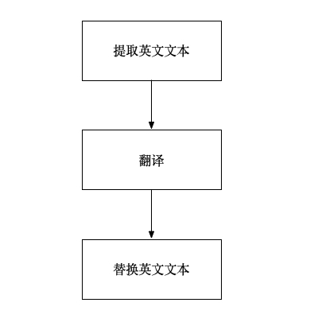

# React 项目汉化

最近接到一个需求：汉化一个英文 React 项目。本来打算逐行逐字翻译的，但是发现项目太庞大了，逐行逐字翻译太费时了，所以想找找有没有现成的工具能将英文文本翻译成中文文本或者多语言。阿里有个工具 [`kiwi`](https://github.com/alibaba/kiwi) 能将中文文本转换成多语言，但是它没有提供将英文文本转换成多语言的功能。i18next 有个 [`i18next-parser`](https://github.com/i18next/i18next-parser) 工具，但是它只是提取代码里的多语言 `key/value`。

没有现成的工具，就只能自己开发了。[`jscodeshift`](https://github.com/facebook/jscodeshift) 是一个转换 JavaScript/TypeScript 代码的工具，一般用来重构代码，用它来汉化 React 项目最合适不过了。

## `jscodeshift`

[`jscodeshift`](https://github.com/facebook/jscodeshift) 是一个能在多个 JavaScript/TypeScript 文件上运行代码的工具，它提供了:

- 一个运行器，它为传递给它的每个文件执行转换。

- 一个 [`recast`](https://github.com/benjamn/recast) 包装器，但是提供不同的 API。Recast 是一种 AST 到 AST 的转换工具，它也试图尽可能地保留原始代码的风格。

`jscodeshift` 首先将 JS/TS 代码转换 AST，然后遍历 AST，并根据你提供的转换函数进行转换，最后将转换后的 AST 转换回 JS/TS 代码。

### 安装

```sh
$ npm install -g jscodeshift
```

### 转换器

转换器只是一个导出一个函数的模块，`jscodeshift` 对每个传入的代码文件运行这个转换器。 

```js
module.exports = function(fileInfo, api, options) {
  // transform `fileInfo.source` here
  // ...
  // return changed source
  return source;
};
```

它有三个参数：

- `fileInfo`： 当前处理的文件的相关信息。
	- `path`： 文件路径
	- `source`： 文件代码
- `api`：jscodesshift 库和 helper 函数。
  - `jscodesshift`： jscodesshift 库
  - `stats`：当运行 `--dry` 时，收集统计信息的函数
  - `report`：打印到标准输出
- `options`：运行时传入的选项

### API

`jscodeshift` 提供了 25 个 API 帮助我们检测和转换 JS/TS 代码，这里列举我们后面会用的 API，更多详情请参考 [API Reference](https://jscodeshift.com/build/api-reference/)

#### `jscodeshift()`

返回 `jscodesshift` 实例

```js
const jscodeshift = require('jscodeshift');
const sourceCode = `const a = 1;`;
const j = jscodeshift(sourceCode);
```

#### `find()`

查找与所提供类型匹配的所有节点，返回的是集合类型 `Collection`，里面的元素类型是 [`ast-types`](https://github.com/benjamn/ast-types) 的 [`NodePath`](https://github.com/benjamn/ast-types?tab=readme-ov-file#nodepath) 类型，它包含 AST 节点信息（`Node` 类型），并且提供了处理 AST 节点的辅助方法。

 AST 节点是一个纯 JavaScript 对象，具有一组特定的字段，通过它们的 type 属性来识别节点。

```js
// "foo"
{
  type: 'Literal',
  value: 'foo',
  raw: '"foo"'
}
```

关于 AST 节点有哪些属性，可以参考 [Mozilla Parser API](https://udn.realityripple.com/docs/Mozilla/Projects/SpiderMonkey/Parser_API).

```js
const variableDeclarations = j.find(j.VariableDeclaration);
```

#### `replaceWith()`

用新节点替换当前节点

```js
j.find(j.Identifier)
  .replaceWith(path => j.identifier(path.node.name.toUpperCase()));
```

#### `toSource(options)`

将转换后的 AST 转换回源代码，它接收一个对象参数 [options](https://github.com/benjamn/recast/blob/master/lib/options.ts)，表示怎样格式化输出代码。

除此之外，为了使创建 AST 节点更简单、更安全，`jscodeshift` 支持 `ast-types` 的 *builder* 方法。比如 `jsxText("text")` 构建 JSX Text 节点 

### 节点类型

`jscodesshift` 提供 278 个节点类型，它们映射到 `ast-types` 相应的节点类型。这里同样列举我们后面会用的节点类型，更多详情请参考 [AST Grammar](https://jscodeshift.com/build/ast-grammar/)

> 不知道代码的节点类型？可以通过 [AST Explorer](http://astexplorer.net/) 在线工具查看

#### `JSXText`

表示 JSX 中的文本

#### `StringLiteral`

表示字符串字面值

#### `JSXElement`

表示一个 JSX 元素，包含整个 JSX 结构，包括开头标签、闭合标签和子内容

#### `JSXOpeningElement`

表示 JSX 中的开始元素，只表示开头的标签部分，不包含子内容和闭合标签

#### `JSXExpressionContainer`

表示 JSX 中的表达式容器

#### `ConditionalExpression`

表示条件表达式（`?:`）

#### `LogicalExpression`

逻辑表达式（`||`、`&&` 和 `??`）

### 使用

`jscodeshift` 有两种使用方式：`CLI` 和 `Module`

#### CLI

```sh
jscodeshift src/ -t ./extract.js --extensions=ts,tsx --ignore-pattern 'src/tests/**'
```

更多详情请参考  [Jscodeshift Usage (CLI)](https://github.com/facebook/jscodeshift?tab=readme-ov-file#usage-cli)

#### Module

```js
const {run: jscodeshift} = require('jscodeshift/src/Runner')
const path = require('node:path');

const transformPath = path.resolve('transform.js')
const paths = ['foo.js', 'bar']
const options = {
  dry: true,
  print: true,
  verbose: 1,
  // ...
}

const res = await jscodeshift(transformPath, paths, options)
```

> jscodeshift 好像不支持 ES Module 

## 整体流程

了解了`jscodeshift` 之后，我们现在用它汉化一个英文的 React 项目。 它的整体流程分三步：

- 扫描代码，从代码里提取英文文本
- 接入翻译 API，将英文文本翻译成中文文本
- 再次扫描代码，将英文文本替换成中文文本



接下来我们详细介绍这三步，最终实现我们的目标。

## 提取

### 提取 `Text` 节点文本

首先需要提取 Text 节点的静态英文文本，比如这样的

```html
<span>Tags</span>
<button>Save</button>
```

提取出来，保存到一个 txt 文件

```txt
Tags，Save
```

> 📢 中文逗号分割，或者其它不会在英文文档里出现的符号

这样的文本在 `jscodeshift` 解析出来的 AST 中类型为 `JSXText`，可以使用下面的转换函数，提取这样的英文文本

```js
// extract.js
module.exports = function transformer(fileInfo, api) {
  // 设定解析器
  const j = api.jscodeshift.withParser(
    fileInfo.path.endsWith('.tsx') ? 'tsx' : 'ts',
  );
  const texts = [];

  // 查找英文静态文本
  j(fileInfo.source)
    .find(j.JSXText)
    .forEach((path) => {
      const value = path.node.value.trim().toLowerCase();
      if (value) {
        texts.push(value);
      }
    });

  // 将收集到的英文静态文本写入 txt 文件
  if (texts.length > 0) {
    // 中文逗号分割
    const str = texts.join('，') + '，';
    fs.appendFileSync('jscodeshift/texts-to-translate.txt', str);
  }

  return fileInfo.source;
};
```

首先，我们需要确定解析器，`jscodeshift` 提供了 5 个解析器供你选择

- `babel`，默认
- `babylon`
- `flow`
- `ts`
- `tsx`

因为这个 React 项目使用的是 tx/tsx 开发的，而且没有使用 babel，所以我一开始运行的时候报错

```
Transformation error (Unexpected token, expected "(" (5:17)) SyntaxError: Unexpected token, expected "("
```

其实就是不识别 Typescript 的类型标注，这个时候需要设置解析器，设置解析器有三种方式：

- 和上面代码一样使用 `withParser` 函数
- 添加命令行选项 `--parser tsx`  
- 在转换文件里导出 `parser` 属性，像这样：

```js
// extract.js
module.exports.parser = 'tsx';
```

### 提取 `title` 属性值

元素或者组件的 `title` 属性一般是用于展示（当然这取决于编写的代码质量），比如

```tsx
<Tooltip title='Completed'></Tooltip>
```

这样的属性值也可以提取出来

```js
// extract.js
module.exports = function transformer(fileInfo, api) {
  // 省略之前的 ...
  
  // 查找 title 属性值为英文静态文本
  j(fileInfo.source)
      .find(j.JSXOpeningElement)
      .forEach((path) => {
        path.node.attributes.forEach((attr) => {
          if (
            attr.name &&
            attr.name.name === 'title'
          ) {
            // StringLiteral 表示是纯文本
            if (attr.value.type === 'StringLiteral') {
              addText(attr.value, texts);
            }
          }
        });
      });
}

// 添加提取的英文文本
function addText(node, texts) {
  const value = node.value;
  if (node.type !== 'StringLiteral' || !value) {
    return;
  }
  const trimValue = value.trim().toLowerCase();
  if (trimValue) {
    texts.push(trimValue);
  }
}
```

当然，你还可以根据项目的编码情况，添加 `placeholder`、`label`、`text` 等属性的处理。

### 提取条件表达式和逻辑表达式中的文本

不管是 `Text` 节点还是元素的 `title` 的属性值，都存在条件表达式和逻辑表达式的英文文本，比如

```html
<span>{isDone ? "Finished" : "In Progress"}</span>
<button>{props.title ?? "Confirm"}</button>
<Tooltip title={copied ? 'Copied' : 'Copy to clipboard'}></Tooltip>
<Tooltip title={props.title || "default"}></Tooltip>
```

这样的英文文本也可以提取出来，这样的节点在 `jscodeshift` 解析出来的 AST 中类型为 `JSXExpressionContainer`，这种类型的节点有一个 `expression` 属性。

下面是提取 `Text` 中的条件表达式和逻辑表达式的英文文本

```js
// extract.js
module.exports = function transformer(fileInfo, api) {
  // 省略之前的 ...
  
  // 查找条件表达式和逻辑表达式的英文文本
  j(fileInfo.source)
    .find(j.JSXElement)
    .forEach((path) => {
      path.node.children.forEach((child) => {
        if (child.type === 'JSXExpressionContainer') {
          const expression = child.expression;
          findConditionalExpressions(expression, texts);
        }
      });
    });
}


// 查找条件表达式和逻辑表达式中的文本
function findConditionalExpressions(expression, texts) {
  if (!expression) {
    return;
  }
  
  // ConditionalExpression 表示条件表达式
  // LogicalExpression 表示逻辑表达式
  if (expression.type === 'ConditionalExpression') {
    // consequent 是符号 ? 后面的节点
    // alternate 是符号 : 后面的节点
    addText(expression.consequent, texts);
    addText(expression.alternate, texts);
  } else if (expression.type === 'LogicalExpression') {
    // right 是符号 ?? 或者 || 或者 && 后面的节点
    addText(expression.right, texts);
  }
}
```

提取  `title` 的属性的条件表达式和逻辑表达式的英文文本

```js
// extract.js
module.exports = function transformer(fileInfo, api) {
  // 省略之前的 ...
  
  // 查找 title 属性值为英文静态文本
  j(fileInfo.source)
      .find(j.JSXOpeningElement)
      .forEach((path) => {
        path.node.attributes.forEach((attr) => {
          if (
            attr.name &&
            attr.name.name === 'title'
          ) {
            if (attr.value.type === 'StringLiteral') {
              addText(attr.value, texts);
            } else if (attr.value.type === 'JSXExpressionContainer') {
              // 处理表达式的情况
              const expression = attr.value.expression;
              findConditionalExpressions(expression, texts);
            }
          }
        });
      });
}
```

上面两个 `find` 函数分别查询了 `JSXElement` 和 `JSXOpeningElement`，它们有什么区别呢？

- `JSXElement` 包含整个 JSX 结构，包括开头标签、闭合标签和子内容。
- `JSXOpeningElement` 只表示开头的标签部分，不包含子内容和闭合标签。

举个例子：

```html
<div className="example">Hello World</div>
```

`JSXElement` 表示整个元素，而 `JSXOpeningElement` 只表示 `<div className="example">` 这个部分，更多详情请参考 [jscodeshift API](https://jscodeshift.com/)

## 翻译

提取了英文文本后，接下来就是翻译成中文。我们接入翻译 API 进行翻译。翻译 API 有以下几个平台：

- [Google Translate API](https://cloud.google.com/translate)

- [Microsoft Translator Text API](https://azure.microsoft.com/en-us/services/cognitive-services/translator-text-api/)
- [DeepL API](https://www.deepl.com/docs-api/translating-text/request/)
- [百度翻译开发平台](https://api.fanyi.baidu.com/)
- [有道智云开发平台](https://ai.youdao.com/gw.s)
- 其它

这些翻译平台都是收费的，但是提供了一些免费额度，但是国外的翻译平台都需要绑定信用卡，所以我没有试用。我们以有道智云开发平台为例

### 封装翻译 API

```js
const CryptoJS = require('crypto-js');
const axios = require('axios');

const appKey = ''; // 应用 Id
const key = ''; // 应用秘钥

function truncate(q) {
  var len = q.length;
  if (len <= 20) return q;
  return q.substring(0, 10) + len + q.substring(len - 10, len);
}

async function translate(text) {
  try {
    const salt = new Date().getTime();
    const curtime = Math.round(salt / 1000) + '';
    const from = 'en';
    const to = 'zh-CHS';
    const str1 = appKey + truncate(text) + salt + curtime + key;
    const sign = CryptoJS.SHA256(str1).toString(CryptoJS.enc.Hex);
    const data = {
      q: text,
      appKey: appKey,
      salt: salt + '',
      from: from,
      to: to,
      sign: sign,
      signType: 'v3',
      curtime: curtime,
    };
    const response = await axios({
      method: 'post',
      url: 'https://openapi.youdao.com/api',
      data: data,
      headers: {
        'Content-Type': 'application/x-www-form-urlencoded',
      },
    });
    if (
      response.data.errorCode === '0' &&
      Array.isArray(response.data.translation) &&
      response.data.translation.length > 0
    ) {
      return response.data.translation[0];
    }
    return undefined;
  } catch (error) {
    return undefined;
  }
}
```

### 翻译英文文本

```js
async function translateTexts() {
  const str = fs.readFileSync('jscodeshift/texts-to-translate.txt', 'utf8');
  const texts = str.split('，').filter((text) => text.trim().length > 0);
  const translatedTexts = {};

  for (const text of texts) {
    const translation = await translate(text);
    if (translation) {
      translatedTexts[text] = translation;
    } else {
      translatedTexts[text] = text;
    }
  }

  fs.writeFileSync(
    'jscodeshift/translated-texts.json',
    JSON.stringify(translatedTexts, null, 2),
  );
}

translateTexts();
```

翻译后的文件是这样的：

```json
{
  "keep server running": "保持服务器运行",
  "for a better experience": "以获得更好的体验",
  "select line:": "选择线条:",
  "mean": "平均值",
  "median": "中位数",
  "min": "最小值",
  "max": "最大值",
  ...
}
```

当然你也可以使用一些 AI 工具来翻译

## 替换

再次扫描代码文件，将英文文本替换成中文文本

```js
const fs = require('fs');
// 读取英文/中文对照 Json 文件
const translations = JSON.parse(
  fs.readFileSync('jscodeshift/translated-texts.json', 'utf8'),
);

module.exports = function transformer(fileInfo, api) {
  const j = api.jscodeshift.withParser(
    fileInfo.path.endsWith('.tsx') ? 'tsx' : 'ts',
  );

  const root = j(fileInfo.source);
  // 替换 Text 节点的静态英文文本
  root.find(j.JSXText).replaceWith((path) => {
    const value = path.node.value.trim().toLowerCase();
    if (value && translations[value]) {
      return j.jsxText(translations[value]);
    }
    return path.node;
  });

  // 替换 Text 节点的条件表达式、逻辑表达式中的英文文本
  root.find(j.JSXElement).forEach((path) => {
    const jsxElement = path.node;
    jsxElement.children.forEach((child) => {
      if (child.type === 'JSXExpressionContainer') {
        const expression = child.expression;
        replaceConditionalExpressions(expression, translations);
      }
    });
    return path.node;
  });

  // 替换 title 属性中的静态英文文本，条件表达式、逻辑表达式中的英文文本
  root.find(j.JSXOpeningElement).replaceWith((path) => {
    path.node.attributes.forEach((attr) => {
      if (
        attr.name &&
        attr.name.name === 'title'
      ) {
        if (attr.value.type === 'StringLiteral') {
          replaceValue(attr.value, translations);
        } else if (attr.value.type === 'JSXExpressionContainer') {
          const expression = attr.value.expression;
          replaceConditionalExpressions(expression, translations);
        }
      }
    });
    return path.node;
  });

  return root.toSource();
};

// 替换条件表达式和逻辑表达式中的英文文本
function replaceConditionalExpressions(expression, translations) {
  if (!expression) {
    return;
  }
  if (expression.type === 'ConditionalExpression') {
    replaceValue(expression.consequent, translations);
    replaceValue(expression.alternate, translations);
  } else if (expression.type === 'LogicalExpression') {
    replaceValue(expression.right, translations);
  }
}

// 替换节点英文文本
function replaceValue(node, translations) {
  // 类型为静态文本
  if (node.type !== 'StringLiteral') {
    return;
  }

  const value = node.value.trim().toLowerCase();
  if (value && translations[value]) {
    // 将英文文本替换成中文文本
    node.value = translations[value];
  }
}
```

完成替换后，汉化工作完成了80%，剩下的 20% 是一些变量的汉化，这部分的工作只能手动修改，因为变量不仅用于展示，也可能用于代码的逻辑处理，必要时需要在显示的时候添加英文到中文的映射，这部分需要小心处理。

## 完整代码

[chinesize-demo](https://gitee.com/cp3hnu/web-demo/tree/master/chinesize-demo)

## References

- [`jscodeshift`](https://github.com/facebook/jscodeshift)
- [Jscodeshift API](https://jscodeshift.com/)
- [`recast`](https://github.com/benjamn/recast)
- [`ast-types`](https://github.com/benjamn/ast-types)
- [babel/types](https://babeljs.io/docs/babel-types)
- [Mozilla Parser API](https://udn.realityripple.com/docs/Mozilla/Projects/SpiderMonkey/Parser_API)
- [AST Explorer](http://astexplorer.net/)
- [`react-codemod`](https://github.com/reactjs/react-codemod)
- [`js-codemod`](https://github.com/cpojer/js-codemod/)
- [`js-transforms`](https://github.com/jhgg/js-transforms)
- [`fix-js`](https://github.com/anshckr/fix-js)
- [`kiwi`](https://github.com/alibaba/kiwi)
- [`i18next-parser`](https://github.com/i18next/i18next-parser)