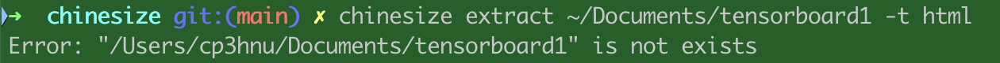
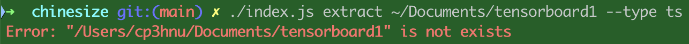
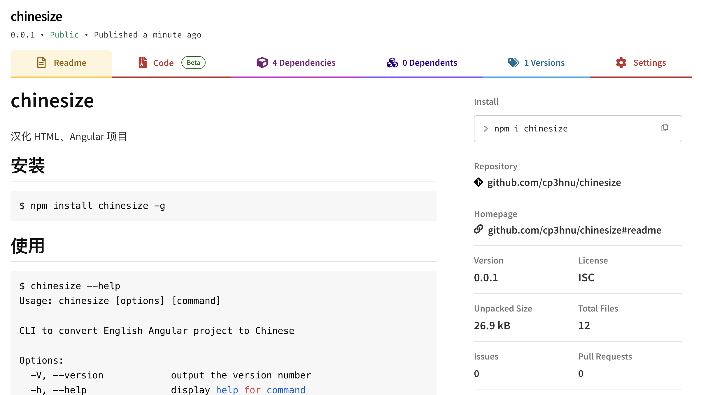
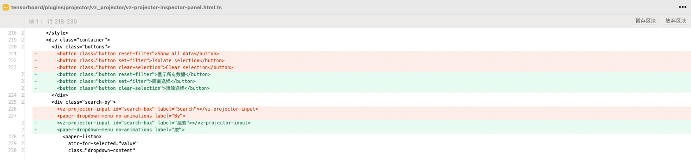

# 创建 Node.js 命令行工具

最近又接到一个需求：汉化一个英文 Angular 项目。Angular 不是使用 JSX/TSX 来构建 UI 的，而是使用 HTML 模版来构建的，所以不能使用我上一篇文章提到的 `jscodeshift` 工具。这次我使用了 [`posthtml`](https://github.com/posthtml/posthtml)（[`cheerio`](https://github.com/cheeriojs/cheerio) 也是一个不错的选项），并且我打算创建一个 Node.js 命令行工具 **chinesize**，它将使用 [`posthtml`](https://github.com/posthtml/posthtml) 来汉化 Angular 项目。

## 汉化 Angular 项目

汉化 Angular 项目和上一篇[汉化 React 项目](./2024-08-08-jscodeshift)的整体思路是一样的，提取代码里的英文文本 -> 翻译英文文本 -> 替换代码里的英文文本，只是操作对象不一样，汉化 React 项目需要解析 JSX/TSX 文件，而汉化 Angular 项目需要解析 HTML 文件以及 Angular 模版（其本质还是 HTML），所以汉化 React 项目使用 `jscodeshift` 工具，而汉化 Angular 项目使用 `posthtml` 工具。

汉化 Angular 项目分两种情况：

- HTML 文件，直接使用 `posthtml` 工具进行汉化

- Angular 模版，需要提取模版字符串，然后汉化模版字符串，最后将汉化后的模版字符串替换原来的模版字符串，比如

```html
@Component({
  selector: 'metrics-pinned-view-component',
  template: `
    <div class="group-toolbar">
      <div
        class="right-items"
        *ngIf="cardIdsWithMetadata.length > 0 && globalPinsEnabled"
      >
        <button
          mat-stroked-button
          aria-label="Clear all pinned cards"
          (click)="onClearAllPinsClicked.emit()"
        >
          Clear all pins
        </button>
      </div>
    </div>
    <ng-template #emptyPinnedView>
      <div class="empty-message">Pin cards for a quick view and comparison</div>
    </ng-template>
  `
})
```

## `posthtml`

[`posthtml`](https://github.com/posthtml/posthtml) 是一个转换 HTML/XML 的工具，主要由两部分组成：

- [`posthtml-parser`](https://github.com/posthtml/posthtml-parser)： 一个 HTML 解析器，解析 HTML/XML 到 HTML 节点树
- [`posthtml-render`](https://github.com/posthtml/posthtml-render)： 一个 HTML 渲染器，渲染 HTML 节点树到 HTML/XML

所有的 HTML 转换都是通过 `posthtml` 插件来完成的。这些插件只是简单的 JS 函数，它们接收 HTML节点树，对其进行转换，并返回修改后的树。我们可以使用 `posthtml`  提供的[插件](https://posthtml.org/#/packages?id=plugins)，也可以自己定义插件。

```js
// myPlugin.js
export default function myPlugin() {
  return (tree) => {
    // tree 是 HTML Node Tree
    // 通过 tree 去遍历所有的树节点
    tree.match({ tag: 'img' }, (node) => {
      // 遍历所有的  元素
      // 可以修改  元素
    })
  }
}
```

[HTML Node Tree](https://posthtml.org/#/api) 提供了两个 API 来遍历树节点

- `walk(cb)`：遍历树中的所有节点
- `match(expression, cb)`：匹配表达式，搜索对应的树节点

然后就可以使用自定义的插件转换 HTML/XML 了

```js
import myPlugin from "./myPlugin.js"
import posthtml from "posthtml";

const html = `
  <html>
    <body>
      <p class="wow">OMG</p>
    </body>
  </html>
`;

posthtml([myPlugin()])
  .process(html /*, options */)
  .then(result => console.log(result.html));
```

`process` 默认使用 `posthtml-parser` 解析 HTML/XML，生成 HTML 节点树，然后通过插件遍历或修改 HTML 树节点，最后通过 `posthtml-render` 转换回  HTML/XML。

`process` 函数支持这些[选项参数](https://posthtml.org/#/core?id=posthtml-options)，如果你使用默认的 `posthtml-parser` 解析器，它也支持 [`posthtml-parser`](https://github.com/posthtml/posthtml-parser) 的[选项](https://github.com/posthtml/posthtml-parser#options)。

## 创建 chinesize 项目

言归正传，接下来我们将创建 node.js 命令行工具：**chinesize**，它将使用 `posthtml` 来汉化我们的 Angular 项目。

首先我们创建 chinesize 项目

> 也可以使用 yarn 或者 pnpm

```sh
$ npm init
```

它会引导你一步一步创建 node.js 项目，你也可以添加 `--yes` 参数，直接使用默认值创建，更多详情请参考 [npm init](https://docs.npmjs.com/cli/v10/commands/npm-init)。

最后会在当前目录下创建一个 `package.json` 文件

```json
{
  "name": "chinesize",
  "version": "1.0.0",
  "description": "Convert English React/Angular project to Chinese",
  "main": "index.js",
  "scripts": {
    "test": "echo \"Error: no test specified\" && exit 1"
  },
  "keywords": [],
  "author": "cp3hnu",
  "license": "ISC"
}
```

Node.js 支持两种模块规范: CommonJS（CJS）和 ECMAScript（ESM），默认是 CommonJS，可以通过在  `package.json` 文件里通过 `type` 改为 ESM。

```json
{
  type: module
}
```

> CJS 和 ESM 的区别，可以参考 [What the heck are CJS, AMD, UMD, and ESM in Javascript?](https://dev.to/iggredible/what-the-heck-are-cjs-amd-umd-and-esm-ikm)

## 添加命令

接下来我们添加 `chinesize` 命令

首先在项目里创建 `bin` 文件夹，然后创建 `chinesize.js` 文件（文件名无所谓，这里只是为了统一）。为了让 `chinesize.js` 能在命令行工具里运行，我们需要在文件开头添加 [shebang](https://nodejs.org/zh-cn/learn/command-line/run-nodejs-scripts-from-the-command-line)

```js
#!/usr/bin/env node
```

同时还需要添加执行权限

```sh
$ chmod 755 bin/chinesize.js
```

最后在 `package.json` 里添加 `bin` 属性

```json
{
  "bin": "bin/chinesize.js"
}
```

如果支持多个命令需要使用对象

```js
{
  "bin": {
    "chinesize": "bin/chinesize.js"
  }
}
```

完成上面的操作之后，如果全局安装我们的包，在 Mac 电脑上 `bin/chinesize.js` 文件将会被链接到 `/usr/local/bin/chinesize`，这个路径已经添加到我们的 `$PATH` 环境变量里，所以就可以执行命令 `chinesize`。在 Windows 电脑将创建一个 cmd 命令文件来执行`bin/chinesize.js` 文件

### `npm link`

在发布之前，我们无法通过 `npm install -g` 安装我们的程序包，那我们要怎么测试呢？这个时候我们可以使用 [`npm link`](https://docs.npmjs.com/cli/v10/commands/npm-link) 命令。

在项目根目录下运行 

```sh
$ npm link
```

它会将我们的程序包 `chinesize` 链接到 `{prefix}/lib/node_modules/chinesize`。同时还会将包中的 `bin/chinesize.js` 链接到 `{prefix}/bin/chinesize`。因为都是符号链接，所以项目的任何改动直接影响 `chinesize` 命令，不需要重新运行 `npm link`。

`prefix` 是 npm global prefix，可以通过 `npm config get prefix` 查看

我们现在可以在 `chinesize.js` 写代码，然后通过 `chinesize` 命令直接运行了。

```js 
#!/usr/bin/env node

console.log('Hello, Chinesize!');
```

```sh
$ chinesize
Hello, Chinesize!
```

## 参数解析

在实现汉化功能之前，我们先看看怎么解析命令行参数。一般的 Node.js 命令行工具都会有参数，比如：

```sh
$ jscodeshift fileA --transform myTransforms --dry
```

可以通过 `process.argv` 访问 Node.js 命令行工具的参数

```js
// chinesize.js
console.log(process.argv);
```

运行下面的命令

```sh
$ chinesize file name=path --type=html --log output.txt --silent
```

输出：

```json
[
  '/Users/cp3hnu/.nvm/versions/node/v16.14.0/bin/node',
  '/Users/cp3hnu/Documents/mine/chinesize/index.js',
  'file',
  'name=path',
  '--type=html',
  '--log',
  'output.txt',
  '--silent'
]
```

从输出中可以看出 `process.argv` 是个数组，参数以空格分隔，第一个参数 `argv[0]` 表示 `node` 的路径（我使用 nvm），第二个参数  `argv[1]` 表示运行程序的文件路径，后面是以空格分隔的参数列表。

从上面的输出我们可以看出，解析 `process.argv` 会比较麻烦。比如，哪些是参数，哪些是选项？选项名称前面要不要 `"--"`？选项名与选项值之间要不要 `"="` 连接？布尔值的选项要怎么表示？等等...

所以我们使用第三方库来解析参数。我们这里使用了 [`commander`](https://github.com/tj/commander.js)，[`yargs`](https://github.com/yargs/yargs) 是另一个不错的选择。

### `commander`

#### 安装

```sh
$ npm install commander
```

#### 教程

`commander` 支持选项参数和普通参数，选项参数支持长名称（ `--` ）和短标记（ `-` ），以空格分隔。

```js
// index.js
import { program } from 'commander';

program
  .option('--first')
  .option('-s, --separator <char>');

program.parse();

const options = program.opts();
const limit = options.first ? 1 : undefined;
console.log(program.args[0].split(options.separator, limit));
```

`commander` 使用 `program.parse()` 方法解析命令行参数。

- `program.opts()` 返回解析后的选项参数，它是一个对象（ `{选项名: 选项值}` ）
- `program.args` 返回没有被解析成选项的剩余参数，它是一个数组。

`commander` 支持下面选项参数的写法

```sh
serve -p 80
serve -p80
serve --port 80
serve --port=80
```

`commander` 还自带了帮助文档和错误提示。

```sh
$ node index -s / --fits a/b/c
error: unknown option '--fits'
(Did you mean --first?)

$ node index -s / --first a/b/c
[ 'a' ]

$ node index --help
Usage: index [options]

Options:
  --first
  -s, --separator <char>
  -h, --help              display help for command
```

`commander` 也支持子命令，像 `git clone` 一样。比如，下面定义了一个 `string-util split` 的子命令

```js {15-18}
// string-util.js
import { Command } from 'commander';
const program = new Command();

program
  .name('string-util')
  .description('CLI to some JavaScript string utilities')
  .version('1.0.0');

program
  .command('split')
  .description('Split a string into substrings and display as an array')
  .argument('<string>', 'string to split')
  .option('--first', 'display just the first substring')
  .option('-s, --separator <char>', 'separator character', ',')
  .action((str, options) => {
    const limit = options.first ? 1 : undefined;
    console.log(str.split(options.separator, limit));
  });

program.parse();
```

`commander` 的每个子命令都要求有一个操作处理程序，可以是 `action` 函数，也可以是单独的可执行文件

```bash
$ node string-util.js help split
Usage: string-util split [options] <string>

Split a string into substrings and display as an array.

Arguments:
  string                  string to split

Options:
  --first                 display just the first substring
  -s, --separator <char>  separator character (default: ",")
  -h, --help              display help for command

$ node string-util.js split --separator=/ a/b/c
[ 'a', 'b', 'c' ]
```

`commander` 的详细教程，请参考 `commander` 的[官方文档](https://github.com/tj/commander.js?tab=readme-ov-file#commanderjs)

#### 使用

回到我们的命令行工具 **chinesize**。Angular 的汉化分为两步：提取和替换，所以我们定义了两个子命令：`extract` 和 `repalce`。

```js
// bin/chinesize.js
#!/usr/bin/env node

import { Command, Option } from 'commander';
const program = new Command();
import { extract  } from './src/extract.js';

program
  .name('chinesize')
  .description('CLI to convert English Angular project to Chinese')
  .version('1.0.0');

program
  .command('extract')
  .description('Extract English texts of Angular project')
  .argument('<dir>', 'directory of Angular project')
  .addOption(
    new Option('-t, --type <type>', 'file type')
      .choices(['html', 'js'])
      .makeOptionMandatory(false)
  )
  .option('-o, --output <filePath>', 'file path for writing the extracted English text')
  .action((dir, options) => {
    extract(dir, options.type, options.output);
  });

program
  .command('replace')
  .description('Replace English texts of Angular project to Chinese')
  .usage('<dir> [options]')
  .argument('<dir>', 'directory of Angular project')
  .addOption(
    new Option('-t, --type <type>', 'file type')
      .choices(['html', 'js'])
      .makeOptionMandatory(false)
  )
  .option('-i, --input <filePath>', 'path of file for reading the Chinese text')
  .option('-p, --prettier-config <configFilePath>', 'path of config file for prettier')
  .action((dir, options) => {
    replace(dir, options.type, options.input, options.prettierConfig);
  });

program.parse();
```

`extract` 有 1 个参数和 2 个选项：

- `dir`：汉化的 Angular 项目目录
- ` --type <type>`：要转换的文件类型，是 `html` 文件还是 `js/ts` 文件。如果没有提供，则同时转换两者
- `--output <filePath>`：输出文件路径，提取的英文文本将写入这个文件。如果没有提供，默认是 Angular 项目目录下的 `chinesize/texts-to-translate-{html|ts}.json` 文件

`replace` 有 1 个参数和 3 个选项：

- `dir`：汉化的 Angular 项目目录
- ` --type <type>`：要转换的文件类型，是 `html` 文件还是 `js/ts` 文件。如果没有提供，则同时转换两者
- `--input <filePath>`：中英文翻译的文件路径。如果没有提供，默认是 `extract` 生成的文件路径
- `--prettier-config <configFilePath>`：`prettier` 配置文件路径。如果没有提供，则不使用 `prettier` 格式化代码

## 优化输出

Node.js 提供了 [`console`](https://nodejs.org/api/console.html) 模块输出日志或者错误信息到控制台，但是错误信息和日志是一样的样式，用户不好发现，比如提示用户给的项目目录不存在，输出错误如下：



希望显示红色的字体，这样比较醒目。Node.js 支持 [escape sequences](https://gist.github.com/iamnewton/8754917) 来设置字体颜色

```js
console.log('\x1b[31m%s\x1b[0m',`Error: "${dir}" is not exists`);
```

> **ansi escape code** 以 `\x1b` 或者 `\033` 开头，它们表示 `ESC`（27），所以叫做 **ansi escape code**。

但是这种写法比较丑陋，所以 [`chalk`](https://github.com/chalk/chalk) 应运而生

> [`yoctocolors`](https://github.com/sindresorhus/yoctocolors) 是一个轻量级的选择

### `chalk`

给控制台输出添加样式

#### 安装

```sh
$ npm install chalk
```

#### 使用

`chalk` API：

```js
chalk.<style>[.<style>...](string, [string...])
```

`chalk` 提供了多个设置样式的函数，比如 `red`、`bold`、`bgRed` 等等，它们可以级联使用，更多详情请参考 [`chalk` 官方文档](https://github.com/chalk/chalk)

现在我们使用 `chalk` 来设置我们的错误信息，比如：

```js
console.log(chalk.red.bold(`Error: "${dir}" is not exists`));
```



还可以使用

- [`chalk-animation`](https://github.com/bokub/chalk-animation) 添加动画
- [`gradient-string`](https://github.com/bokub/gradient-string) 添加渐变色
- [`terminal-link`](https://github.com/sindresorhus/terminal-link) 添加可点击的链接

## 发布

在测试、验证功能完全正确之后，就可以发布到 npm 上了。

首先做一些准备工作：

- 在 [npm 官网](https://www.npmjs.com/)上创建 npm 账号
- 在 github 上创建 repo，并将代码上传到 github
- 修改 `package.json` 文件，填写 `repository`、`homepage`、`bugs` 等字段

```json
{
  "name": "chinesize",
  "version": "0.0.1",
  "description": "Convert English React/Angular/HTML project to Chinese",
  "repository": {
    "type": "git",
    "url": "https://github.com/cp3hnu/chinesize"
  },
  "homepage": "https://github.com/cp3hnu/chinesize#readme",
  "bugs": "https://github.com/cp3hnu/chinesize/issues",
  "main": "index.js",
  "type": "module",
  "scripts": {
    "test": "echo \"Error: no test specified\" && exit 1"
  },
  "bin": {
    "chinesize": "bin/chinesize.js"
  },
  "keywords": [
    "chinesize",
    "angular",
    "react",
    "html",
    "posthtml"
  ],
  "author": "cp3hnu",
  "license": "ISC",
  "dependencies": {
    "chalk": "^5.3.0",
    "commander": "^12.1.0",
    "posthtml": "^0.16.6",
    "prettier": "^3.3.3"
  },
  "engines": {
    "node": ">=16"
  }
}

```

完成上面的准备工作之后，就可以发布了

1. 首先检查 npm 源，如果是淘宝源，则需要改回 npm 源

```sh
# 查看npm 镜像源地址
$ npm config get registry

# 设置 npm 默认源
$ npm config set registry https://registry.npmjs.org/
```

> 也可以使用 [`nrm`](https://github.com/Pana/nrm) 工具

2. 查看哪些文件被打包上传

```sh
$ npm pack --dry-run
```

可以通过 `.gitignore` 或者 `.npmignore` 排除不需要上传的文件，也可以通过设置 `package.json` 的 `files` 指定需要打包哪些文件

3. 查询是否已经存在重名的包

```sh
$ npm search chinesize
No matches found for "chinesize"
```

4. 登录 npm

```sh
$ npm login
```

> 如果是 npm v9，需要使用 `npm login --auth-type legacy`

5. 发布

```sh
$ npm publish

Publishing to https://registry.npmjs.org/ with tag latest and default access
Authenticate your account at:
https://www.npmjs.com/auth/cli/6fa1a0c8-4fd1-4cf3-9895-6b00fa83e384
Press ENTER to open in the browser...

+ chinesize@0.0.1
```

6. 去 [npm 官网](https://www.npmjs.com/)上查看



7. 测试

```sh
$ npm unlink chinesize
$ chinesize --help
$ npm install chinesize -g
$ chinesize --help
```

8. 更新

完成代码修改之后，打开 `package.json` 文件，修改 `version` 字段，比如从 `0.0.1` 更新到 `0.0.2`，然后通过 `npm publish`。

也可以通过 [`npm version`](https://docs.npmjs.com/cli/v10/commands/npm-version) 自动增加版本号，并且 `commit` 修改。

```sh
// 增加补丁号
$ npm version patch

// 增加次版本号
$ npm version minor

// 增加主版本号
$ npm version major
```

关于版本管理，请参考 [Semantic Versioning 2.0.0](https://semver.org/#spec-item-9)

## 实现效果

通过 sourcetree 查看英文文本是否被替换成了中文。



## 完整代码

github 地址：[chinesize](https://github.com/cp3hnu/chinesize)

npm 地址：[chinesize](https://www.npmjs.com/package/chinesize)

## References

- [`posthtml`](https://github.com/posthtml/posthtml)
- [`cheerio`](https://github.com/cheeriojs/cheerio)
- [`htmlparser2`](https://github.com/fb55/htmlparser2)
- [`parse5`](https://github.com/inikulin/parse5)
- [AST Explorer](http://astexplorer.net/)
- [How to build a CLI with Node.js](https://www.twilio.com/en-us/blog/how-to-build-a-cli-with-node-js)
- [如何使用 Node.js 构建一个命令行应用（CLI）](https://juejin.cn/post/6844903857865097229)
- [What the heck are CJS, AMD, UMD, and ESM in Javascript?](https://dev.to/iggredible/what-the-heck-are-cjs-amd-umd-and-esm-ikm)
- [CommonJs、AMD、UMD、ESM 模块化的区别](https://segmentfault.com/a/1190000039346572)
- [npm](https://docs.npmjs.com/)
- [`nrm`](https://github.com/Pana/nrm)
- [`commander.js`](https://github.com/tj/commander.js)
- [`yargs`](https://github.com/yargs/yargs)
- [`chalk`](https://github.com/chalk/chalk)
- [`yoctocolors`](https://github.com/sindresorhus/yoctocolors)
- [`picocolors`](https://github.com/alexeyraspopov/picocolors)
- [`micromatch`](https://github.com/micromatch/micromatch)
- [`inquirer`](https://github.com/SBoudrias/Inquirer.js)
- [`enquirer`](https://github.com/enquirer/enquirer) 
- [`prompts`](https://github.com/terkelg/prompts)
- [`isomorphic-git`](https://github.com/isomorphic-git/isomorphic-git)
- [`git-js`](https://github.com/steveukx/git-js)
-  [`nodegit`](https://github.com/nodegit/nodegit)
-  [`fs-extra`](https://github.com/jprichardson/node-fs-extra)
-  [`awesome-nodejs`](https://github.com/sindresorhus/awesome-nodejs)
-  [Semantic Versioning 2.0.0](https://semver.org/#spec-item-9)

