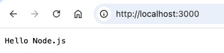
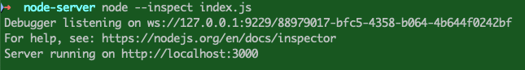
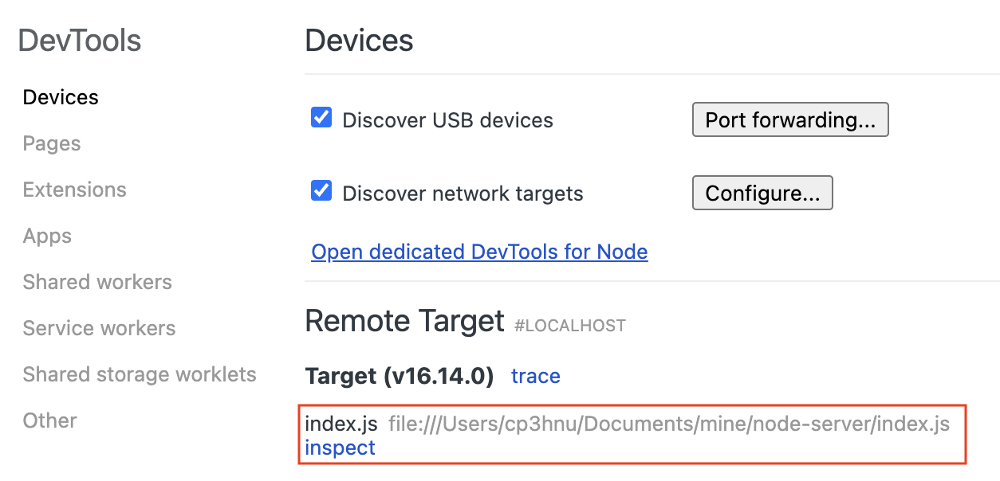
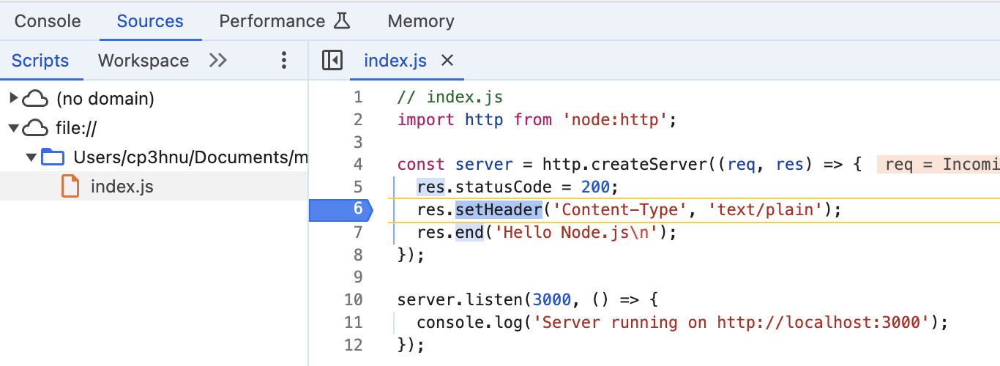
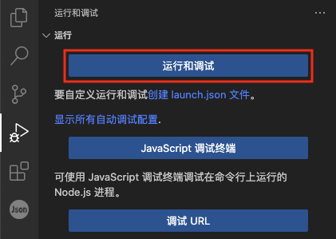
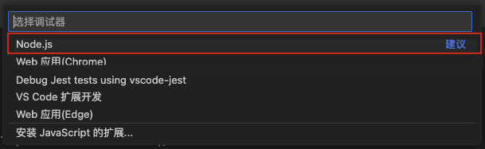
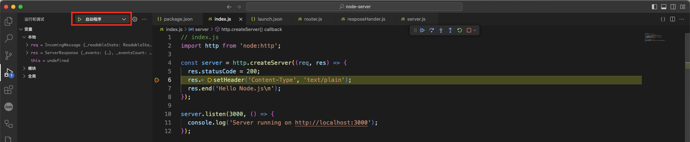

# 创建 Node.js 后台服务

上一篇文章 [创建 Node.js 命令行工具](./2024-08-23-node-cli.md)，我们使用 Node.js 创建了命令行工具 **chinesize**，这篇文章我们使用 Node.js 创建后台服务，这是一篇简单的入门教程，我们将实现最简单的增删改查服务，希望借此通往后端开发。

## 简单的 HTTP 服务

首先我们创建项目 **node-server**

```sh
$ mkdir node-server
$ cd node-server
$ npm init --yes
```

然后使用 `http` 模块创建一个简单的 HTTP 服务

```js
// index.js
import http from 'node:http';

const server = http.createServer((req, res) => {
  res.statusCode = 200;
  res.setHeader('Content-Type', 'text/plain');
  res.end('Hello Node.js\n');
});

server.listen(3000, () => {
  console.log('Server running on http://localhost:3000');
});
```

运行

```sh
$ node index.js
```

在浏览器里输入 `http://localhost:3000/` 就能看到



这样一个简单的 HTTP 服务就完成了，接下来我们实现常用的增删改查功能

## Node.js 调试

正所谓"工欲善其事，必先利其器"，在实现具体功能之前，我们先来学习一下怎么调试 Node.js。

本文介将绍调试 Node.js 的两种方式：

- Node.js 启用 [Inspector](https://nodejs.org/zh-cn/learn/getting-started/debugging#enable-inspector)
- VSCode 调试 Node.js

### Node.js 启用 Inspector

Node.js 通过开启 `--inspect` 选项进行调试，启用 `--inspect` 选项后，Node.js 进程将会侦听调试客户端（默认情况下监听 `127.0.0.1:9229`，可以通过其它选项修改主机地址和端口），每个进程还分配有一个唯一的 UUID。Inspector 客户端必须知道并指定要连接的主机地址、端口和 UUID。完整的 URL 将类似于 `ws://127.0.0.1:9229/0f2c936f-b1cd-4ac9-aab3-f63b0f33d55e`。



然后我们就可以利用 Chrome 浏览器进行调试了

在 Chrome 浏览器中打开 `chrome://inspect`，可以看到我们的 Node.js 服务



点击 `inspect`



就可以像调试前端代码一样调试 Node.js 了。

### VS Code 调试 Node.js

因为我是用 VS Code 开发的，VS Code 提供了四种方法调试 Node.js

- 使用 [自动附加 ](https://code.visualstudio.com/docs/nodejs/nodejs-debugging#_auto-attach)调试您在 VS Code 的集成终端中运行的进程。
- 使用 [JavaScript 调试终端](https://code.visualstudio.com/docs/nodejs/nodejs-debugging#_javascript-debug-terminal)，类似于使用集成终端。
- 附加到在 VS Code 外部启动的 [进程](https://code.visualstudio.com/docs/nodejs/nodejs-debugging#_attaching-to-nodejs)。
- 使用 [启动配置 ](https://code.visualstudio.com/docs/nodejs/nodejs-debugging#_launch-configuration)启动程序。

这里我们使用最后一种方式：使用 [启动配置 ](https://code.visualstudio.com/docs/nodejs/nodejs-debugging#_launch-configuration)启动程序。因为这种方式最简洁、最方便

首先我们创建启动配置文件，侧边栏选择 "运行和调试"，在点击下图的 "运行和调试" 按钮



选择 "Node.js"



在本地目录下会创建了一个 `.vscode/launch.json` 文件

```json
{
  // 使用 IntelliSense 了解相关属性。 
  // 悬停以查看现有属性的描述。
  // 欲了解更多信息，请访问: https://go.microsoft.com/fwlink/?linkid=830387
  "version": "0.2.0",
  "configurations": [
    {
      "type": "node",
      "request": "launch",
      "name": "启动程序",
      "skipFiles": [
        "<node_internals>/**"
      ],
      "program": "${workspaceFolder}/index.js"
    }
  ]
}
```

然后我们就可以运行 "启动程序" 进行调试了



我们可以设置断点，查看变量值、单步执行等。关于调试的更多详情，请参考 [Node.js debugging in VS Code](https://code.visualstudio.com/docs/nodejs/nodejs-debugging) 和 [Debugging](https://code.visualstudio.com/docs/editor/debugging)

## 用户管理系统

接下来我们实现一个用户管理系统，主要功能就是实现用户的增删改查（CURD）。

我们将实现下面这些功能：

```
GET    /users     // 列表
GET    /users/1   // 详情
POST   /users     // 新增
PUT    /users/1   // 全量替换
PATCH  /users/1   // 局部更新
DELETE /users/1   // 删除
```

用户的结构如下：

```json
{ "id": 1, "name": "cp3hnu", age: 18 }
```

首先我们修改之前的服务，获取 `method`、`pathname` 和 `id` 参数。

```js
const server = http.createServer((req, res) => {
  // 获取 method
  const { method, url: reqUrl } = req;
  const url = new URL(reqUrl, 'http://localhost:3000');
  const { pathname } = url;
  const paths = pathname.split('/').filter(Boolean);
  // 获取 pathname 和 id
  const path = paths[0];
  const id = paths[1];
  
  if (path !== "users") {
    res.statusCode = 404;
    res.end('Not Found');
    return;
  }
  
  switch (method) {
    case 'GET':
      return getUsers(response, request, id);
    case 'POST':
      return postUsers(response, request);
    case 'PATCH':
      return patchUsers(response, request, id);
    case 'PUT':
      return putUsers(response, request, id);
    case 'DELETE:
      return deleteUsers(response, request, id);
    default:
      response.statusCode = 405;
      response.end('Method Not Allowed');
  }
});
```

后面会介绍 Express 框架，帮我们处理请求路由。

### 获取列表或详情

当路径中存在 id 时，`getUsers` 返回用户详情，否则返回列表。一般返回列表的接口支持 query 筛选数据，我们可以使用 [URLSearchParams](https://developer.mozilla.org/en-US/docs/Web/API/URLSearchParams) 获取查询参数，也可以使用 [`qs`](https://github.com/ljharb/qs) 或者 [`query-string`](https://github.com/sindresorhus/query-string) 第三方库。

```js
const getUsers = (response, request, id) => {
  // 获取详情
  if (id && !isNaN(id)) {
    const idNum = Number(id);
    const user = users.find(user => user.id === idNum);
    if (!user) {
      response.statusCode = 404;
      response.end('Not Found');
      return;
    } else {
      response.statusCode = 200;
      response.setHeader('Content-Type', 'application/json');
      response.end(JSON.stringify(user));
    }
  } else {
    // 获取列表
    const url = new URL(request.url, 'http://localhost:3000');
    const query = url.searchParams;
    const name = query.get('name');
    let filteredUsers = users;
    if (name) {
      filteredUsers = users.filter(user => user.name === name);
    }
    response.statusCode = 200;
    response.setHeader('Content-Type', 'application/json');
    response.end(JSON.stringify(filteredUsers));
  }
}
```

### 新增

新增时，需要处理 post 请求发生的数据，Node.js 通过 `data` 事件传递数据，`end` 事件表示数据传递完成

Post 常用的请求数据格式有四种，通过请求头的 `Content-Type` 属性指定：

- `application/json`

  现在常用的 JSON 格式，比如：

  ```json
  {
    name: "cp3hnu",
    age: 18
  }
  ```

- `application/x-www-form-urlencoded`

  表单编码格式

- `multipart/form-data`

  这个多用于文件批次上传

- `text/*`

  文本，比如 `text/plain` 表示纯文本，`text/html` 表示 HTML 格式

新增用户基本上是用 `application/json` 或者 `application/x-www-form-urlencoded`。

#### `application/json` 

如果是 `application/json`，接收完数据，使用 `JSON.parse` 转换成对象

```js
const postUsers = (response, request) => {
  // 设置接收数据的编码格式为 UTF-8
  request.setEncoding('utf8');
  let body = '';
  // data 事件，接收请求数据
  request.on('data', (data) => {
    body += data;
  });
  // end 事件，表示数据传递完成
  request.on('end', () => {
    const newUser = JSON.parse(body);
    newUser.id = findMaxId(users) + 1;
    users.push(newUser);
    response.statusCode = 201;
    response.setHeader('Content-Type', 'application/json');
    response.end(JSON.stringify(newUser));
  });
}
```

#### `application/x-www-form-urlencoded`

如果是 `application/x-www-form-urlencoded`，接收完数据，可以使用 Node.js 的内置 [querystring](https://nodejs.org/docs/latest/api/querystring.html) 模块解析

```js
const postUsers = (response, request) => {
  // 设置接收数据的编码格式为 UTF-8
  request.setEncoding('utf8');
  let body = '';
  // data 事件，接收请求数据
  request.on('data', (data) => {
    body += data;
  });
  // end 事件，表示数据传递完成
  request.on('end', () => {
    const newUser = querystring.parse(body);
    newUser.id = findMaxId(users) + 1;
    users.push(newUser);
    response.statusCode = 201;
    response.setHeader('Content-Type', 'application/json');
    response.end(JSON.stringify(newUser));
  });
}
```

除了手动自己处理 body 数据之外，还可以使用一些第三库，比如 [`body-parser`](https://github.com/expressjs/body-parser) 和 [`raw-body`](https://github.com/stream-utils/raw-body)，以及处理 `multipart/form-data` 的 [`multer`](https://github.com/expressjs/multer) 和 [`formidable`](https://github.com/node-formidable/formidable)

### 修改

有两种方式支持修改，`PUT` 和 `PATCH`，它们的区别是:

- `PUT`，全量替换，如果某个字段没有确定值，那替换后该字段的值就被清除了

- `PATCH`，局部更新，如果某个字段没有确定值，那更新后该字段的值保持不变

一般开发中基本是都是使用 `PATCH`，局部更新

```js
const patchUsers = (response, request, id) => {
  request.setEncoding('utf8');
  let body = '';
  request.on('data', (data) => {
    body += data;
  });
  request.on('end', () => {
    const updatedUser = JSON.parse(body);
    const index = users.findIndex(user => user.id === Number(id));
    if (index === -1) {
      response.statusCode = 404;
      response.end('Not Found');
      return;
    }
    users[index] = { ...users[index], ...updatedUser };
    response.statusCode = 200;
    response.setHeader('Content-Type', 'application/json');
    response.end(JSON.stringify(users[index]));
  });
}
```

### 删除

删除很简单，找到对应的用户，删除即可

```js
const deleteUsers = (response, request, id) => {
  const index = users.findIndex(user => user.id === Number(id));
  if (index === -1) {
    response.statusCode = 404;
    response.end('Not Found');
    return;
  }
  users.splice(index, 1);
  response.statusCode = 204;
  response.end();
}
```

## 连接数据库

上面我们实现了用户的增删改查功能，但是没有实现数据持久化，服务重启之后，数据就丢失了。接下来我们实现数据持久化，一般的后台服务都是通过数据库实现持久化的，所以接下来我们在我们用户管理系统里连接数据库。

### 有哪些数据库？

在 Node.js 开发中，我们可以使用多种数据库，具体选择取决于项目的需求和数据结构。

那在 Node.js 开发中有哪些数据库？该怎么选择呢？

#### 关系型数据库 (SQL)

关系型数据库使用结构化表格存储数据，适合需要事务支持或复杂查询的应用。

Node.js 中与 SQL 数据库配合常用的库是 [Sequelize](https://sequelize.org/)、[TypeORM](https://typeorm.io/)、[Knex.js](http://knexjs.org/)、[Prisma](https://www.prisma.io/) 等。

- **MySQL / MariaDB**
  - 优势：高性能、开源、跨平台，MySQL 在 Web 应用中非常流行。
  - 配合使用的 Node.js 驱动：[mysql2](https://github.com/sidorares/node-mysql2)（比原生 mysql 库性能更高，支持 Promise 和 async/await）

- **PostgreSQL**
  - 优势：支持复杂查询、ACID 事务、扩展性好，适合需要更高级 SQL 功能的应用。
  - 配合使用的 Node.js 驱动：[pg](https://node-postgres.com/)（官方驱动）

- **SQLite**
  - 优势：轻量级，无需单独服务器，适合小型应用或嵌入式应用。
  - 配合使用的 Node.js 驱动：[sqlite3](https://github.com/TryGhost/node-sqlite3)

#### NoSQL 数据库

NoSQL 数据库适合处理非结构化或半结构化数据。它们更灵活，支持水平扩展，适合快速开发和大规模数据处理。

- **MongoDB**
  - 优势：灵活的文档模型（JSON-like），易于扩展，适合处理多变的非结构化数据。
  - 配合使用的 Node.js 驱动：[Mongoose](https://mongoosejs.com/) 和 [node-mongodb-native](https://github.com/mongodb/node-mongodb-native)（MongoDB 官方驱动）
- **Redis**
  - 优势：内存型数据库，支持数据持久化，速度极快，适合缓存、会话管理或需要快速数据访问的应用。
  - 配合使用的 Node.js 驱动：[ioredis](https://github.com/luin/ioredis)（高性能 Redis 客户端）或 [redis](https://www.npmjs.com/package/redis)（官方驱动）
- **Cassandra**
  - 优势：分布式设计，适合大规模数据写入和多数据中心部署的应用。
  - 配合使用的 Node.js 驱动：[cassandra-driver](https://www.npmjs.com/package/cassandra-driver)

#### 时序数据库

适合处理时间序列数据，比如日志、监控数据、物联网数据。

- **InfluxDB**
  - 优势：专为时间序列数据设计，支持高效的读写操作和时间序列分析。
  - 配合使用的 Node.js 驱动：[influx](https://www.npmjs.com/package/influx)

#### 图数据库

图数据库可以方便地管理节点和边的关系，用于社交网络、推荐系统等应用。

- **Neo4j**
  - 优势：擅长处理关系密集型数据，适合图结构的数据。
  - 配合使用的 Node.js 驱动：[neo4j-driver](https://www.npmjs.com/package/neo4j-driver)（Neo4j 官方驱动）

#### 全文搜索引擎

用于快速检索和查询大量文本数据。

- **Elasticsearch**
  - 优势：强大的全文搜索和分析功能，适合大规模文本检索和日志分析。
  - 配合使用的 Node.js 驱动：[@elastic/elasticsearch](https://www.npmjs.com/package/@elastic/elasticsearch)（官方驱动）

**怎么选择？**

- **数据模型**：如果数据是结构化的，SQL 数据库是不错的选择；如果数据是非结构化的或频繁变化，MongoDB 可能更合适。
- **性能和扩展性**：Redis 和 Cassandra 适合高并发、低延迟的场景。
- **事务和一致性**：需要事务支持的可以选择 PostgreSQL 或 MySQL。
- **复杂查询**：如果需要复杂的查询，PostgreSQL 比较灵活，Elasticsearch 适合全文搜索需求。

### 选择

我们这里只是一个 demo，没有复杂的结构，所以我们选择 [`Sequelize`](https://sequelize.org/) + [`sqlite3`](https://github.com/TryGhost/node-sqlite3)，以后有时间可以都研究一下。

#### 安装

```sh
$ npm i sequelize sqlite3
```

#### 创建

```js
import { Sequelize, DataTypes } from "sequelize";
import path, { dirname} from 'node:path';
import { fileURLToPath } from 'node:url';

const __filename = fileURLToPath(import.meta.url);
const __dirname = dirname(__filename);
const filePath = path.join(__dirname, 'database.sqlite');

export const sequelize = new Sequelize({
  dialect: 'sqlite',
  storage: filePath
});

// Model
export const User = sequelize.define('User', {
  id: { type: DataTypes.INTEGER, primaryKey: true, allowNull: false, autoIncrement: true },
  name: DataTypes.STRING,
  age: DataTypes.INTEGER
});
```

#### 验证连接

```js
try {
  await sequelize.authenticate();
  console.log('Connection has been established successfully.');
} catch (error) {
  console.error('Unable to connect to the database:', error);
}
```

#### 同步

```js
await sequelize.sync();
```

#### 搜索

```js
// 通过名称过滤
const users = await User.findAll({
  where: {
    name: {
      [Op.substring]: name, 
    }
  }
})

// 获取 id 对应的用户
const users = await User.findAll({
  where: {
    id: id
  }
});
const user = users[0];
```

#### 创建

```js
const user = await User.create(userData);
```

#### 更新

```js
// 直接更新，返回值是更新的数量
const result = await User.update(
  userData
  {
    where: {
      id: id,
    },
  },
);
const nums = result[0] // 更新的个数

// 最好是先获取，再更新，因为接口还要返回数据
const user = ... // 查询出来的用户
const userData = ... // form 表单数据
const newUser = await user.update(userData);
// 返回 newUser 给 response
```

#### 删除

```js
// 搜索之后删除
const user = ... // 查询出来的用户
await user.destroy();

// 或者直接删除
// num 是删除的个数
cosnt num = await User.destroy({
  where: {
    id: id,
  },
});
```

#### 关闭

```js
// 关闭程序时，需要关闭数据库的连接
process.on('exit', (code) => {
  console.log(`Node.js 进程退出，退出码：${code}`);
  sequelize.close();
});

process.on('SIGINT', () => {
  console.log('接收到 SIGINT 信号，进程即将终止');
  sequelize.close();
  process.exit();
});

process.on('SIGTERM', () => {
  console.log('接收到 SIGTERM 信号，进程即将终止');
  sequelize.close();
  process.exit();
});
```

现在我们的服务实现了数据持久化，服务重启后数据依然存在。这里只是介绍了 `Sequelize` 的一些基本操作，更多详情请参考 [Sequelize](https://sequelize.org/)。

## Express 框架

在上面用户管理系统的例子中，我们需要自己处理请求路由。开发 Node.js 服务更快的方式是使用框架，它们会帮我们处理好这些细节，我们只管实现具体功能。[**Express**](https://expressjs.com/) 框架是开发 Node.js 服务成熟的框架，除此之外还有：

- [**Koa**](https://koa.bootcss.com/)
  - **简介**: 由 Express 团队开发，Koa 是一个更轻量、模块化的框架，专注于中间件的使用。它没有内置的路由或模板引擎，适合需要高自由度的开发者。
  - **特点**: 支持 async/await 语法，使得异步代码更简洁；非常适合需要高度定制化的 API 开发。
- [**NestJS**](https://nestjs.com/)
  - **简介**: NestJS 是一个受 Angular 启发的全栈框架，使用 TypeScript 编写，结构清晰，适合构建复杂的企业应用。
  - **特点**: 基于模块化架构，支持依赖注入，拥有丰富的功能和生态。它内置支持 GraphQL、WebSocket、gRPC 等，适合需要良好架构的项目。
- [**Fastify**](https://fastify.dev/)
  - **简介**: Fastify 是一个专注于性能的框架，与 Express 类似但更快，且在设计上提供更好的开发体验。
  - **特点**: 支持 JSON Schema 验证，插件系统强大，针对性能优化，适合需要高并发的场景。
- [**Hapi**](https://hapi.dev/)
  - **简介**: Hapi 是一个用于构建强大应用和 API 的企业级框架，广泛用于构建大型项目。
  - **特点**: 提供一套丰富的插件系统，可以很方便地进行身份验证、输入验证、缓存等操作。Hapi 的配置性很强，非常适合需要严格控制的项目。

- [**Sails.js**](https://sailsjs.com/)
  - **简介**: Sails.js 是一个 MVC 框架，灵感来自 Ruby on Rails。它基于 Express 构建，但提供更丰富的功能，尤其适合实时应用。
  - **特点**: 提供水手式蓝图（Blueprint），让 API 开发更加快捷。支持实时功能，内置与 WebSocket 集成。
- [**Feathers.js**](https://feathersjs.com/)
  - **简介**: Feathers.js 是一个轻量级框架，适合构建实时应用和 RESTful API，具有很强的可扩展性。
  - **特点**: 提供服务的概念，可以轻松添加、删除服务，同时支持与数据库（MongoDB、MySQL 等）无缝集成。

**框架选择建议：**

- 如果你需要一个简单、快速的应用，可以考虑 **Express**、 **Koa** 或 **Fastify**。
- 对于大型项目或有企业级需求，**Hapi** 和 **NestJS** 是不错的选择。
- 如果你习惯于 MVC 架构，**Sails.js** 是一个理想的选择。
- **Feathers.js** 是构建实时应用和 RESTful API 的好选择。

从 [npm trends](https://npmtrends.com/@feathersjs/feathers-vs-@nestjs/core-vs-express-vs-fastify-vs-hapi-vs-koa-vs-sails) 来看，下载量方面 **Express** 遥遥领先，多出一个数量级，然后依次是 **NestJS**、 **Koa** 和 **Fastify**。GitHub Star 方面 **NestJS** 最多，**Express** 紧随其后。根据 [npm trends](https://npmtrends.com/@feathersjs/feathers-vs-@nestjs/core-vs-express-vs-fastify-vs-hapi-vs-koa-vs-sails)，推荐 **Express** 和 **NestJS**。

### 重构用户管理系统

#### 安装

```sh
$ npm i express
```

#### 实现

Express 提供了[路由功能](http://expressjs.com/en/starter/basic-routing.html)，确定应用程序如何响应客户端请求，路由采用以下结构：

```js
app.METHOD(PATH, HANDLER)
```

- `app`: 是 `Express` 的一个实例。
- `METHOD`: 是小写的 [HTTP 请求方法](https://en.wikipedia.org/wiki/Hypertext_Transfer_Protocol#Request_methods)。
- `PATH`: 是服务器上的路径。
- `HANDLER`: 是路由匹配时执行的函数。

此外，Express 使用 [`path-to-regexp`](https://github.com/pillarjs/path-to-regexp) 匹配路由路径，比如 `/users/:id(\\d+)`，匹配 `/users/1`，不匹配  `/users/info`，并且匹配的路径参数值可以通过 `request.params` 获取，比如通过  `request.params.id` 获取用户 ID。关于路由的更多详情，请参考 [Routing](http://expressjs.com/en/guide/routing.html)。

下面通过 Express 实现用户管理系统：

```js
import express from 'express'
import { getUsers, postUsers, patchUsers, putUsers, deleteUsers } from './users.js'

const app = express()
const port = 3000

app.get('/users', async (req, res) => {
  await getUsers(res, req)
})

app.get('/users/:id(\\d+)', async (req, res) => {
  await getUsers(res, req, req.params.id)
})

app.post('/users', async (req, res) => {
  await postUsers(res, req)
})

app.patch('/users/:id(\\d+)', async (req, res) => {
  await patchUsers(res, req, req.params.id)
})

app.put('/users/:id(\\d+)', async (req, res) => {
  await putUsers(res, req, req.params.id)
})

app.delete('/users/:id(\\d+)', async (req, res) => {
  await deleteUsers(res, req, req.params.id)
})

app.listen(port, async () => {
  console.log(`Example app listening on port ${port}`)
})
```

关于 Express 的更详细的介绍，请参考我的下一篇文章 [使用 Express 创建 Web 服务](./2024-12-12-express).

## 完整代码

GitHub: [`cp3hnu/node-server`](https://github.com/cp3hnu/node-server) 

## References

- [Node.js 官网](https://nodejs.org/zh-cn/learn/getting-started/introduction-to-nodejs)
- [Debugging Node.js](https://nodejs.org/zh-cn/learn/getting-started/debugging#debugging-nodejs)
- [Node.js debugging in VS Code](https://code.visualstudio.com/docs/nodejs/nodejs-debugging)
- [VS Code Debugging](https://code.visualstudio.com/docs/editor/debugging)
- [【Node.js】如何调试你的 Node.js 代码？](https://juejin.cn/post/7035954397012033566)
- [`ChromeDevTools/devtools-frontend`](https://github.com/ChromeDevTools/devtools-frontend)
- [Chrome DevTools](https://developer.chrome.com/docs/devtools)

- [Node入门](https://www.nodebeginner.org/index-zh-cn.html)
-  [`ljharb/qs`](https://github.com/ljharb/qs) 
- [`sindresorhus/query-string`](https://github.com/sindresorhus/query-string)
- [`expressjs/body-parser`](https://github.com/expressjs/body-parser)
- [`stream-utils/raw-body`](https://github.com/stream-utils/raw-body)
- [`expressjs/multer`](https://github.com/expressjs/multer)
- [`node-formidable/formidable`](https://github.com/node-formidable/formidable)
-  [Sequelize](https://sequelize.org/)
-  [`TryGhost/sqlite3`](https://github.com/TryGhost/node-sqlite3)
- [Express](https://expressjs.com/)
- [sequelize vs typeorm vs knex vs prisma](https://npmtrends.com/knex-vs-prisma-vs-sequelize-vs-typeorm)
- [feathers vs nestjs vs express vs fastify vs hapi vs koa vs sails](https://npmtrends.com/@feathersjs/feathers-vs-@nestjs/core-vs-express-vs-fastify-vs-hapi-vs-koa-vs-sails)

