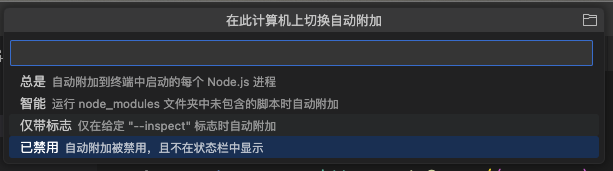
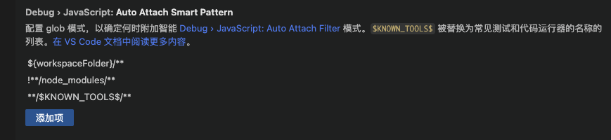
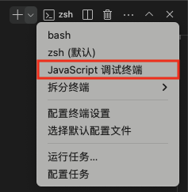
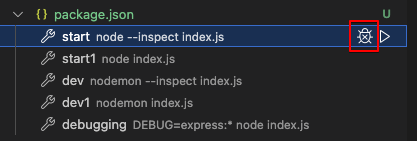
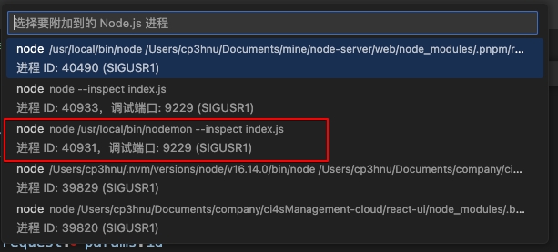
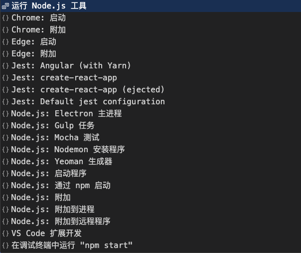
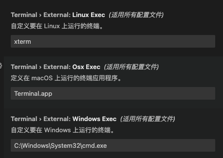
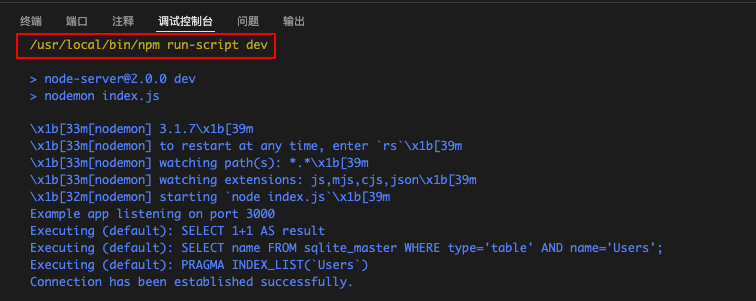

# VS Code 调试 Node.js

在上一篇文章  [创建 Node.js 服务](/2024/09/17/nodejs-web/#vs-code-%E8%B0%83%E8%AF%95-node-js) 中，我们简单介绍了 VS Code 调试 Node.js。但是有一个问题，如果在调试过程中发现了问题，随即修改代码，但是服务没有自动重启，而是需要我们手动刷新。如果我们一时忘记了刷新，调试时发现问题依然存在，而我们觉得已经改了代码，问题不应该存在，给我们带来了困惑。这篇文章我们将详细介绍 VS Code 调试 Node.js 的四种方法，并且解决修改代码没有重启服务的问题。

正如上一篇文章 [创建 Node.js 服务](/2024/09/17/nodejs-web/#vs-code-%E8%B0%83%E8%AF%95-node-js) 中说的，VS Code 调试 Node.js 有四种方法：

- 使用 [自动附加 ](https://code.visualstudio.com/docs/nodejs/nodejs-debugging#_auto-attach)调试您在 VS Code 的集成终端中运行的进程。
- 使用 [JavaScript 调试终端](https://code.visualstudio.com/docs/nodejs/nodejs-debugging#_javascript-debug-terminal) 调试程序。
- 附加到在 VS Code 外部启动的 [进程](https://code.visualstudio.com/docs/nodejs/nodejs-debugging#_attaching-to-nodejs)。
- 使用 [启动配置 ](https://code.visualstudio.com/docs/nodejs/nodejs-debugging#_launch-configuration)启动程序。

同时我们知道，使用 [`nodemon`](https://github.com/remy/nodemon) 命令行工具，可以在修改代码之后自动重启服务。

```sh
$ nodemon index.js
```

接下来我们研究怎么将 [`nodemon`](https://github.com/remy/nodemon) 工具与 VS Code 调试方式结合起来，实现既能使用 VS Code 调试，又能修改代码之后重启服务，并且可以继续调试。

## 自动附加

自动附加功能让 Node 调试器自动附加到从 VS Code 集成终端启动的 Node.js 进程。通过在命令面板（⇧⌘P）中的 `Debug: Toggle Auto Attach` 命令，启动自动附加功能。

自动附加有三种模式:

- `always`：将调试在 VS Code 集成终端中启动的所有 Node.js 进程
- `onlyWithFlag`：将仅调试使用 `--inspect` 或 `--inspect-brk` 标志启动的进程。
- `smart`：将调试 `node_modules` 文件夹未包含的脚本或使用常见的 “运行程序” 脚本（如 `mocha` 或 `ts-node`）



开启自动附加功能之后，可以通过 VS Code 窗口底部的 `Auto Attach` 状态栏切换模式。**启动自动附加功能或者切换模式之后，需要重新创建一个新终端，然后运行程序**。

### `always`

首先我们来看看 `always`，当选择这个选项时，只要我们在 VS Code 集成终端运行 Node.js 程序（无论是在终端命令行里运行还是通过 `NPM Script` 运行，但是不能在别的终端应用运行），VS Code 就打开了调试。

所以我们可以在 VS Code 集成终端运行 `nodemon` 命令

```sh
$ nodemon index.js
```

或者在 `package.json` 里添加脚本命令，然后运行

```json
"scripts": {
  "dev": "nodemon index.js",
}
```

这样就实现了既打开了 VS Code 调试，又在修改代码之后重启服务。但是 `always` 模式有个缺陷：因为自动附加功能作用于全局，开启 `always` 模式之后，所有的项目只要通过 VS Code 集成终端运行，都会打开调试，这对于一些 web 前端项目是没有必要的。

### `onlyWithFlag`

`onlyWithFlag` 仅调试使用 `--inspect` 或 `--inspect-brk` 标志启动的进程，所以我们可以使用 `--inspect` 选项在 VS Code 集成终端运行 Node.js 程序。

```sh
$ node --inspect index.js
# 或者
$ nodemon --inspect index.js
```

通过 `nodemon --inspect index.js`，实现了既使用了 VS Code 调试，又在修改代码之后重启服务，同时避免 web 前端项目自动开启调试。

注意，`onlyWithFlag` 模式同样要求在 VS Code 集成终端运行，在别的终端应用运行无效。

### `smart`

`smart`：将调试 `node_modules` 文件夹未包含的脚本或使用常见的 “运行程序” 脚本（如 `mocha` 或 `ts-node`），可以通过 `Auto Attach Smart Pattern` （`debug.javascript.autoAttachSmartPattern`） 配置 “运行程序” 脚本允许列表



因为 `node` 和 `nodemon` 命令都不在 `node_modules` 文件夹里，所以也能实现打开 VS Code 调试，同时修改代码之后重启服务。对于 web 前端项目，如果使用了 `node_modules` 文件夹里的脚本，比如 `umijs` 的 `max` 命令，`CRA` 的 `react-scripts` 命令，就不会开启调试，如果没有使用，比如 `CRA` `eject` 之后的 `node scripts/start.js` 就会打开调试。

注意，`smart` 模式同样要求在 VS Code 集成终端运行，在别的终端应用运行无效。

## JavaScript 调试终端

JavaScript 调试终端将自动调试您在其中运行的任何 Node.js 进程，无论是否使用了 `--inspect` 或 `--inspect-brk` 选项。

创建 JavaScript 调试终端有下面两个方法：

- 命令面板（⇧⌘P）中的 `Debug: JavaScript Debug Terminal` 命令

- 在 VS Code 终端界面创建一个 JavaScript 调试终端

  

然后，我们在 JavaScript 调试终端里运行 `nodemon`，实现 VS Code 调试，同时修改代码之后重启服务

```sh
$ nodemon index.js
```

除此之外，通过 NPM Script 面板，也能创建 JavaScript 调试终端，并调试 Node.js 程序



因此我们可以在 `package.json` 里创建 `nodemon` 脚本命令

```json
"scripts": {
  "dev": "nodemon index.js",
}
```

通过 NPM Script 面板，调试 `dev` 命令，实现 VS Code 调试，同时修改代码之后重启服务

## 附加到 Node.js

如果您在别的终端应用（比如 iTerm）里运行 Node.js 程序

```sh
$ node --inspect index.js
# 或者
$ nodemon --inspect index.js
```

然后想通过 VS Code 进行调试，这个时候就需要使用附加到 Node.js。通过命令面板 （⇧⌘P） 中的 `Debug: Attach to Node Process` 命令将打开一个 Quick Pick  的菜单，其中列出了所有的 Node.js 进程。



> 没有使用 `--inspect` 选项的 Node.js 进程也显示在这里，但是选择之后不能进行断点调试。

我们选择通过 `--inspect` 选项运行 Node.js 程序，比如上面的 PID 为 40931 进程，然后就可以调试了。

**但是修改代码保存之后，nodemon 重启进程，本身的 PID 没有变化，但是 nodemon 内部使用的 Node 进程发生了变化，导致 VS Code 调试被关闭。因此这个方案不可取。**

## 启动配置

启动配置是在 VS Code 中设置调试的传统方式，可以为您提供运行复杂应用程序的配置选项。

在上一篇文章 [创建 Node.js 服务](/2024/09/17/nodejs-web/#vs-code-%E8%B0%83%E8%AF%95-node-js) 中，我们介绍了怎么创建启动配置，但是只配置了 `Node.js: 启动程序`，其实 VS Code 还有很多的配置选项。



这里我们只关注 `Node.js` 调试器

### `Node.js: 启动程序`

在调试模式下启动 Node.js 程序。默认配置如下：

```json
{
  "name": "Launch Program",
  "program": "${workspaceFolder}/index.js",
  "request": "launch",
  "skipFiles": ["<node_internals>/**"],
  "type": "node"
}
```

配置项参数：

- `request`：`launch` 或者 `attach`，`launch` 表示从 VS Code 启动程序，`attach` 表示附加已经从别的应用启动的程序，例如上面介绍的 “[附加到 Node.js](#%E9%99%84%E5%8A%A0%E5%88%B0-node-js)”
- `type`：调试器，VC Code 内置了 Node.js 的调试器 `node`，别的语言的调试器可能需要安装相应的扩展
- `name`：配置项的名称
- `program`：启动调试器时要运行的文件，`${workspaceFolder}` 表示项目根目录，关于变量的更多详情，请参考 [Variables Reference](https://code.visualstudio.com/docs/editor/variables-reference)
- `skipFiles`：表示调试要跳过哪些文件，`<node_internals>` 表示 Node.js 的内置核心模块

此外我们还可以添加其它配置选项，如：

- `runtimeExecutable`：运行时可执行文件的绝对路径，默认是 `node`

- `runtimeArgs`：运行时可执行文件的可选参数，比如要运行 `node --inspect`，`runtimeArgs` 设置为 `["--inspect"]`
- `args`：运行程序的参数，就是我们自己写的程序需要的参数
- `restart`：终止时是否重新启动连接，默认为 `false`
- `cwd`：启动程序所在的目录

关于配置项的完整列表，请参考 [VS Code 启动配置参数](https://github.com/microsoft/vscode-js-debug)

**我们可以将 `runtimeExecutable` 设置为 `nodemon`，从而实现开启 VS Code 调试，同时修改代码之后重启服务**

```diff
{
  "name": "Launch Program",
  "program": "${workspaceFolder}/index.js",
  "request": "launch",
  "skipFiles": ["<node_internals>/**"],
  "type": "node",
+ "runtimeExecutable": "nodemon"
}
```

### `Node.js: Nodemon 安装程序`

使用 `nodemon` 在代码发生更改时自动重新启动调试会话，默认配置如下：

```json
{
  "console": "integratedTerminal",
  "internalConsoleOptions": "neverOpen",
  "name": "nodemon",
  "program": "${workspaceFolder}/index.js",
  "request": "launch",
  "restart": true,
  "runtimeExecutable": "nodemon",
  "skipFiles": ["<node_internals>/**"],
  "type": "node"
}
```

这里新增了几个选项参数：

- `console`：启动程序的控制台，默认是 `internalConsole` - VS Code 默认的调试控制台。`integratedTerminal` - VS Code 的集成控制台。`externalTerminal` - 外部控制台，当选择 `externalTerminal` 可以配置要选择的外部终端

​	

- `internalConsoleOptions`：VS Code 默认的调试控制台是否打开，因为启动程序的控制台选择的是 VS Code 的集成控制台，所以这里不需要打开 `neverOpen`

这个跟我们前面修改的 `Node.js: 启动程序` 类似，只是添加了`console`、`internalConsoleOptions` 和 `restart`，所以它也实现了开启 VS Code 调试，同时修改代码之后重启服务。

### `Node.js: 通过 npm 启动`

通过 NPM Script 启动 Node.js 程序。默认配置如下：

```json
{
  "name": "Launch via NPM",
  "request": "launch",
  "runtimeArgs": ["run-script", "debug"],
  "runtimeExecutable": "npm",
  "skipFiles": ["<node_internals>/**"],
  "type": "node"
}
```

调试时，我们可以通过调试控制台查看调试信息



我们可以看到，其实就是执行了 `npm run-script dev`。

我们通过在 `package.json` 里配置

```json
"scripts": {
  "dev": "nodemon index.js",
}
```

可以实现开启 VS Code 调试，同时修改代码之后重启服务

### `Node.js: 附加`

附加到本地运行的 Node.js 程序的调试端口。

确保 Node.js 要调试的程序已在调试模式下启动，并且使用的调试端口与代码段中指定的端口相同，即使用 `--inspect` 选项运行 Node.js

默认配置如下：

```json
{
  "name": "Attach",
  "port": 9229,
  "request": "attach",
  "skipFiles": ["<node_internals>/**"],
  "type": "node"
}
```

- `port`: 要使用的调试端口，`node --inspect index.js` 默认端口号是 `9229`

首先运行 `nodemon --inspect index.js`，然后启动 `Attach`，VS Code 就会自动连接上启动的进程，并打开调试。

和 “[附加到 Node.js](#%E9%99%84%E5%8A%A0%E5%88%B0-node-js)” 一样，修改代码保存之后，nodemon 重启进程，本身的 PID 没有变化，但是 nodemon 内部使用的 Node 进程发生了变化，导致 VS Code 调试被关闭。

**但是通过设置 `restart` 为 `true`，可以重新启动连接，从而实现开启 VS Code 调试，同时修改代码之后重启服务**

```json
{
  "name": "Attach",
  "port": 9229,
  "request": "attach",
  "skipFiles": ["<node_internals>/**"],
  "type": "node",
  "restart": true,
}
```

### `Node.js: 附加到进程`

和 `Node.js: 附加` 功能一样，不同的是 `Node.js: 附加` 通过端口，而 `Node.js: 附加到进程` 通过进程 ID。默认配置如下：

```json
{
  "name": "Attach by Process ID",
  "processId": "${command:PickProcess}",
  "request": "attach",
  "skipFiles": ["<node_internals>/**"],
  "type": "node"
}
```

- `processId`: Node.js 运行进程 ID。`${command:PickProcess}` 让你选择一个进程

和 “[附加到 Node.js](#%E9%99%84%E5%8A%A0%E5%88%B0-node-js)” 一样，修改代码保存之后，nodemon 重启进程，本身的 PID 没有变化，但是 nodemon 内部使用的 Node 进程发生了变化，导致 VS Code 调试被关闭。

**但是同样通过设置 `restart` 为 `true`，可以重新启动连接，从而实现开启 VS Code 调试，同时修改代码之后重启服务**

```json
{
  "name": "Attach by Process ID",
  "processId": "${command:PickProcess}",
  "request": "attach",
  "skipFiles": ["<node_internals>/**"],
  "type": "node",
  "restart": true,
}
```

## 总结

这篇文章讲解了 VS Code 调试 Node.js 有四种方法，同时搭配 `nodemon` 工具，实现既能打开调试，又能修改代码重启服务。现在总结一下：

| <span style="display: inline-block; width:140px">方法</span> | <span style="display: inline-block; width:70px">能否实现</span> | 是否推荐                                                     |
| ------------------------------------------------------------ | ------------------------------------------------------------ | ------------------------------------------------------------ |
| 自动附加                                                     | 能                                                           | `always` 和 `smart` 可能会影响别的项目， `onlyWithFlag` 需要添加 `--inspect` 选项，不是很推荐 |
| JavaScript 调试终端                                          | 能                                                           | 推荐，很方便                                                 |
| 附加到 Node.js                                               | 不能                                                         | 重启服务之后不能继续调试，因此不推荐                         |
| 启动配置                                                     | 能                                                           | 推荐使用 `Node.js: Nodemon 安装程序` 配置                    |

## References

- [Node.js debugging in VS Code](https://code.visualstudio.com/docs/nodejs/nodejs-debugging)
- [Debugging](https://code.visualstudio.com/docs/editor/debugging)
- [VS Code 启动配置参数](https://github.com/microsoft/vscode-js-debug)
- [Variables Reference](https://code.visualstudio.com/docs/editor/variables-reference)
- [Glob Patterns Reference](https://code.visualstudio.com/docs/editor/glob-patterns)
- [`remy/nodemon`](https://github.com/remy/nodemon)
