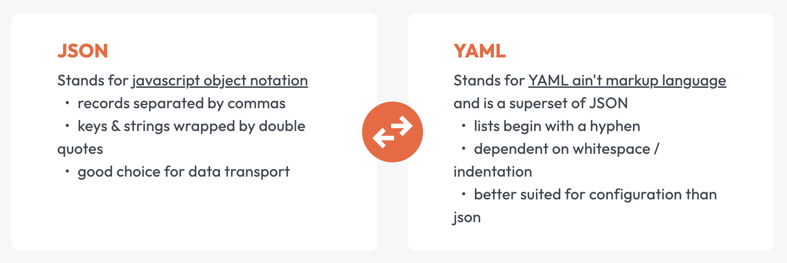

# GitHub 自动化部署

最近我的女儿迷恋上玩数独游戏，有一天她问我：“这一关你会不会啊?”。 我一看盘面上只有 17 个数字，这太难了吧，但是作为父亲不能说不会，于是我去 [Sudoku.com](https://sudoku.com/zh/shu-du-gui-ze/) 网站上学习了一下数独，并且开发了一个 [Sudoku](https://github.com/cp3hnu/Sudoku) 数独推算应用。但是我没有服务器怎么部署我的应用呢？于是我想到了 Github 可以部署，也正好可以学习一下怎么在 Github 上部署前端应用。

## GitHub Pages

GitHub Pages 是一项静态站点托管服务，它直接从 GitHub 上的代码仓库获取 HTML、CSS 和 JavaScript 文件，通过构建过程运行文件，然后发布网站。所以我们可以使用 GitHub Pages 来展示博客、开源项目、获取分享简历，比如我的这个博客就是用 [VuePress](https://vuepress.vuejs.org/zh/guide/deploy.html#github-pages) 开发，然后部署在我的 GitHub 主页上。

创建 GitHub Pages 有两种方式

- `Deploy from a branch`，从固定分支上部署，当 push 代码到这个分支时，Github 会自动从这个分支拉取代码进行部署
- `Github Actions`，自定义 GitHub action 进行部署，完全由您编写的工作流文件决定怎么部署。

我们先讲一下 `Deploy from a branch`，从分支部署，后面再讲 Github Actions.

### 创建 GitHub 代码仓库

在 GitHub 创建一个 Sudoku 代码仓库，在本地创建一个 Sudoku 项目，然后设置 GitHub 代码仓库的地址，然后提交代码并推送到 GitHub 代码仓库。

### 配置 GitHub Pages

配置 GitHub Pages：

1. 点击 "Settings" > "Pages"
2. "Source" 选择 "Deploy from a branch"
3. "Branch" 我们先选择 "main"，点击 "Save"。


GitHub 将会自动创建一个叫 `pages-build-deployment` 的 GitHub action，并且运行一次。


这个 GitHub action 由三个 job 组成

- `build`，拉取分支代码，使用 [Jekyll](https://jekyllrb.com/) 构建出静态页面，将静态页面，上传到 GitHub 服务器
- `report-build-status`，报告构建结果
- `deploy`，部署 GitHub Pages

> 后面讲 Github Actions 再来详细解析析这个 GitHub action.


因为我的 `github.io` 配置了域名，所以我的代码仓库 pages 自动添加了域名。因为我们刚才选的是 `main` 分支，[Jekyll](https://jekyllrb.com/) 将使用项目里的 `index.html` 或者 `README.md` 文件构建静态页面，然后部署到 GitHub Pages. 

而且以后我们只要推送更新到 `main` 分支，`pages-build-deployment` 将会重新运行，从而重新部署。

> 关于怎么配置 Jekyll，请参考 [Jekyll 官方文档](https://jekyllrb.com/) 

### 手动部署

有些项目生成 `README.md` 静态页面就行了，但是这不是我们这个项目的目的。我们需要编译前端工程，然后使用编译后的文件来部署 GitHub Pages。

首先我们创建 `gh-pages` 分支，然后在 Pages 的配置页面选择 `gh-pages` 分支并保存。

然后去到工程目录，运行

```sh
$ npm run build
```

然后将编译后的文件提交到这个分支

```sh
$ cd dist
$ git init 
$ git add -A
$ git commit -m "deploy"
$ git push -f git@github.com:cp3hnu/Sudoku.git main:gh-pages
```

> 也可以使用 [`gh-pages`](https://github.com/tschaub/gh-pages) 命令行工具

当 `gh-pages` 分支代码更新后，`pages-build-deployment` 会自动运行，然后部署。使用这种方式就不再需要 [Jekyll](https://jekyllrb.com/) 了，可以在 `gh-pages` 分支里添加一个空文件 `.nojekyll` 来取消 Jekyll 构建。

因为经常需要部署，因此可以写一个脚本：`deploy.sh`

```sh
#!/usr/bin/env sh

# 确保脚本抛出遇到的错误
set -e

# 生成静态文件
npm run build

# 进入生成的文件夹
cd dist

git init
git add -A
git commit -m 'deploy'

# 如果发布到 https://<USERNAME>.github.io
git push -f git@github.com:cp3hnu/Sudoku.git main:gh-pages

cd -
```

给 `deploy.sh` 文件添加执行权限

```sh
$ chmod 755 deploy.sh
```

在 `package.json` 里添加脚本命令

```json
{
   "scripts": {
     "deploy": "./deploy.sh"
  }
}
```

这样只要运行 `deploy` 命令，就能成功部署了您的 Web 应用

```sh
$ npm run deploy
```


## YAML

学习 GitHub Actions 之前，我们先来学习一下 [YAML](https://yaml.org/)，因为 GitHub Actions 是用 YAML 编写的。

YAML 是一种数据序列化语言，它是 JSON 的严格超集，在语法上添加了缩进和换行，但是不允许使用制表符进行缩进。YAML 多用于配置文件中。

### YAML vs JSON

YAML 与 JSON 显著的不同之处：

- YAML 使用空格缩进（一般是 2 个空格，不允许使用 tab）表示层级关系，JSON 使用 `{}`
- YAML 中的 key 不需要双引号
- YAML 中数组元素是用带缩进的破折号（-）表示，JSON 使用 `[]`
- YAML 使用 `#` 表示注释，而 JSON 不允许注释
- YAML  适合配置文件，JSON 适合数据传输



### 教程

YAML 文件可以支持多个文档。YAML 文档以三个破折号（-）开始，以三个点（.）结束（可选）。

下面是一个简单的 YAML 文件

```yaml
---
 doe: "a deer, a female deer"
 ray: "a drop of golden sun"
 pi: 3.14159
 xmas: true
 french-hens: 3
 # This is a list
 calling-birds:
   - huey
   - dewey
   - louie
   - fred
 xmas-fifth-day:
   calling-birds: four
   french-hens: 3
   golden-rings: 5
   partridges:
     count: 1
     location: "a pear tree"
   turtle-doves: two
...
```

对应的 JSON 文件是

```json
{
  "doe": "a deer, a female deer",
  "ray": "a drop of golden sun",
  "pi": 3.14159,
  "xmas": true,
  "french-hens": 3,
  "calling-birds": [
     "huey",
     "dewey",
     "louie",
     "fred"
  ],
  "xmas-fifth-day": {
  "calling-birds": "four",
  "french-hens": 3,
  "golden-rings": 5,
  "partridges": {
    "count": 1,
    "location": "a pear tree"
  },
  "turtle-doves": "two"
  }
}
```

YAML 的详细教程请参考 [Learn X in Y minutes](https://learnxinyminutes.com/) 和 [YAML Tutorial: Everything You Need to Get Started in Minutes](https://www.cloudbees.com/blog/yaml-tutorial-everything-you-need-get-started)

## Github Actions

上面我们实现了手动部署我们的 Web 应用，但是还是比较麻烦。我们每次修改完代码、提交代码，还要运行部署命令。那有没有可能我们提交代码到 `main` 分支后，Github 自动从 `main` 分支编译，把编译后的文件自动推送到 `gh-pages` 分支，然后依靠 `pages-build-deployment` action，实现部署呢？答案是可以的，那就是通过 Github Actions。 

实现上面的方案之前，我们先来学习一下 Github Actions。

GitHub Actions 是一个持续集成和持续部署（CI/CD）平台，允许您自动化构建、测试和部署。

一个 GitHub Action 由一个工作流（**workflow**）定义，工作流由多个作业（**job**）组成，而作业又是由多个步骤（**step**）组成的，一个步骤可以是一个命令、自定义脚本或操作（**action**，即 GitHub Actions 自定义应用程序）。当存储库中发生事件（**event**）时（比如提交代码到仓库），就会在虚拟机运行器（**runner**）或容器内运行工作流的作业。


工作流是由 [YAML](https://yaml.org/) 文件定义，存储在代码仓库的 `.github/workflows` 目录里。一个代码仓库可以有多个工作流，每个工作流可以执行一组不同的任务。

GitHub 提供了很多的[工作流模板](https://github.com/actions/starter-workflows)，当您在 GitHub 上创建新的工作流时，GitHub 会提示您选择工作流模板，以此来帮助您快速创建工作流。


### 事件 Event

GitHub 的工作流由事件触发的，比如推送提交时触发工作流使用 `push` 事件

```yaml
on:
  push
```

还可以限定推送到哪个分支才触发工作流，比如下面是当推送到 `main` 或以 `releases/` 开头的分支时，触发工作流

```yaml
on:
  push:
    branches:
      - 'main'
      - 'releases/**'
```

GitHub Actions 定义了多个事件，详情请参考[触发工作流程](https://docs.github.com/zh/actions/writing-workflows/choosing-when-your-workflow-runs/triggering-a-workflow#using-filters)和[触发工作流的事件](https://docs.github.com/zh/actions/writing-workflows/choosing-when-your-workflow-runs/events-that-trigger-workflows)。

### 作业 Job

工作流由一个或多个作业组成。默认情况下这些作业并行运行的，若要按顺序运行作业，可以使用 `needs` 选项定义作业之间的依赖关系。

每个作业必须有一个唯一标识符 `job_id`，`job_id` 是一个字符串，必须以字母或 `_` 开头，并且只能包含字母数字、`-` 或 `_`。

每个作业通过 `name` 设置名称，`runs-on` 指定运行器，`steps` 设置步骤/任务。

下面创建了一个 `build` 的作业，名称是 "My Job"，运行在 `ubuntu-latest` 上，只有一个任务就是安装 npm 依赖：

```yaml
jobs:
  build:
  	name: My Job
    runs-on: ubuntu-latest

    steps:
    	- name: Install dependencies
        run: npm install
```

关于作业的详细介绍请参考在[工作流程中使用作业 ](https://docs.github.com/zh/actions/writing-workflows/choosing-what-your-workflow-does/using-jobs-in-a-workflow)和 [Jobs 语法](https://docs.github.com/zh/actions/writing-workflows/workflow-syntax-for-github-actions#jobs)

### 步骤 Step

步骤就是作业的一个任务，一个作业可以包含一系列任务。步骤可以是一个简单命令、一段自定义脚本或者 GitHub Actions 自定义应用程序。

```yaml
jobs:
  my-job:
    name: My Job
    runs-on: ubuntu-latest
    steps:
      - name: Run a command
        run: npm install
      - name: Run a script
        run: ./scripts/my.sh
      - name: Run a GitHub action
        uses: actions/checkout@v2
```

关于步骤的详细介绍请参考在 [GitHub Actions 的工作流命令](https://docs.github.com/zh/actions/writing-workflows/choosing-what-your-workflow-does/workflow-commands-for-github-actions)、[添加脚本到工作流程](https://docs.github.com/zh/actions/writing-workflows/choosing-what-your-workflow-does/adding-scripts-to-your-workflow)和 [Steps 语法](https://docs.github.com/zh/actions/writing-workflows/workflow-syntax-for-github-actions#jobsjob_idsteps)

### 操作 Action

这里的操作是指 GitHub Actions 自定义应用程序，是一组预先创建的可重用作业或代码，用于在工作流中执行特定任务。

操作可以是 GitHub Actions 官方的，比如 [`actions/checkout`](https://github.com/actions/checkout)、[`actions/setup-node`](actions/setup-node) 等，也可以是社区的，比如 [`peaceiris/actions-gh-pages`](https://github.com/peaceiris/actions-gh-pages)，同时我们也可以创建自己的操作。

可以通过 [GitHub Marketplace](https://github.com/marketplace/actions/) 来查找 GitHub 社区创建的操作。

1. 在代码仓库中，打开要编辑的工作流程文件
2. 打开工作流编辑器
3. 在编辑器右侧，使用 GitHub Marketplace 边栏浏览操作。 其中带有徽章的操作是 GitHub 已验证其创建者是合作伙伴组织


4. 找到要使用的操作
5. 单击操作，查看操作详情
6. 在"安装"下，复制工作流语法，添加到您的工作流文件中

关于操作的详细介绍请参考[工作流中使用预编写的构建基块](https://docs.github.com/zh/actions/writing-workflows/choosing-what-your-workflow-does/using-pre-written-building-blocks-in-your-workflow)。

#### 常用的 Action

##### `actions/checkout`

[`actions/checkout`](https://github.com/actions/checkout) 在 `$GITHUB_WORKSPACE` 下 checkout 您的仓库代码，以便您的工作流程可以访问它。

##### `actions/setup-node`

[`actions/setup-node`](https://github.com/actions/setup-node) 设置 Node 环境，提供以下功能：

- 下载和缓存 Node.js，并将其添加到 PATH
- 缓存 npm/yarn/pnpm 依赖项
- 为错误输出注册问题匹配器
- 为 GPR 或 npm 配置身份验证

`actions/setup-node` 使用 [`actions/cache`](https://github.com/actions/cache) 缓存全局包数据，注意这个缓存不是缓存 `node_modules` 里的依赖包，具体是什么数据还需要进一步研究。

##### `actions/upload-artifact`

[`actions/upload-artifact`](https://github.com/actions/upload-artifact) 从工作流程运行中上传[操作构件](https://docs.github.com/en/actions/using-workflows/storing-workflow-data-as-artifacts)。

##### `actions/download-artifact`

[`actions/download-artifact`](https://github.com/actions/download-artifact) 从工作流程运行中下载[操作构件](https://docs.github.com/en/actions/using-workflows/storing-workflow-data-as-artifacts)。

##### `actions/upload-pages-artifact`

[`actions/upload-pages-artifact`](https://github.com/actions/upload-pages-artifact) 打包和上传可部署到 [GitHub Pages](https://pages.github.com/) 的构件，内部使用 `actions/upload-artifact` 上传构件。

##### `actions/configure-pages`

[`actions/configure-pages`](https://github.com/actions/configure-pages) 启用 [GitHub Pages](https://pages.github.com/) 并提取有关站点的各种元数据。它还可用于配置 GitHub 支持的作为[入门工作流程](https://github.com/actions/starter-workflows/tree/main/pages)的各种静态站点生成器。

##### `actions/deploy-pages`

[`actions/deploy-pages`](https://www.github.com/actions/deploy-pages) 部署 [操作构建](https://docs.github.com/en/actions/using-workflows/storing-workflow-data-as-artifacts) 到 [GitHub Pages](https://pages.github.com/).

##### `peaceiris/actions-gh-pages`

[`peaceiris/actions-gh-pages`](https://github.com/peaceiris/actions-gh-pages) 操作用于将静态文件上传的 `gh-pages` 分支。此操作通常用于[静态站点生成器](https://jamstack.org/generators/)来进行部署。

### 运行器 Runner

在作业中通过 `runs-on` 指定运行器，GitHub Actions 支持 GitHub 托管的运行器、大型运行器 或自托管运行器。

用于公共代码库的 GitHub 托管的运行器包括下面这些

| **虚拟机** | **处理器 (CPU)** | **内存 (RAM)** | **存储 (SSD)** | **工作流标签**                                               |
| ---------- | ---------------- | -------------- | -------------- | ------------------------------------------------------------ |
| Linux      | 4                | 16 GB          | 14 GB          | `ubuntu-latest`，`ubuntu-24.04`，`ubuntu-22.04`，`ubuntu-20.04` |
| Windows    | 4                | 16 GB          | 14 GB          | `windows-latest`，`windows-2022`，`windows-2019`             |
| macOS      | 3                | 14 GB          | 14 GB          | `macos-12`                                                   |
| macOS      | 4                | 14 GB          | 14 GB          | `macos-13`                                                   |
| macOS      | 3 (M1)           | 7 GB           | 14 GB          | `macos-latest`、`macos-14`、`macos-15`                       |

> [!NOTE] 
>
>  `-latest` 运行器是 GitHub 提供的最新稳定映像，但可能不是操作系统供应商提供的最新版本的操作系统。

关于运行器的详细介绍请参考[选择作业的运行器](https://docs.github.com/zh/actions/writing-workflows/choosing-where-your-workflow-runs/choosing-the-runner-for-a-job#choosing-github-hosted-runners)、[在容器中运行作业](https://docs.github.com/zh/actions/writing-workflows/choosing-where-your-workflow-runs/running-jobs-in-a-container)和[在工作流中运行作业的变体](https://docs.github.com/zh/actions/writing-workflows/choosing-what-your-workflow-does/running-variations-of-jobs-in-a-workflow)

### 更多配置

上面只是介绍了工作流的重要组成部分，其实工作流还有很多内容，比如变量、环境、上下文、并发、权限、工作流命令、安全性等等，更多详情请参考 [GitHub Actions 文档](https://docs.github.com/en/actions)。

## 自动部署

学会了 GitHub Actions 和 YAML 之后，我们来创建一个自动部署的 GitHub action，实现这些功能：当我们提交代码并推送到 `main` 分支时，GitHub 自动编译我们的应用，并将编译后的文件提交并推送到 `gh-pages` 分支，这个时候 GitHub 的  `pages-build-deployment` 的 action 就会运行，部署我们的应用。

首先在项目里创建 `.github/workflows` 目录，然后创建 `deploy.yml` 文件或者 `deploy.yaml` （文件名可以随便取），输入下面的代码。

```yaml
# deploy.yml
name: Deploy to GitHub Pages

on:
  push:
    branches:
      - main # 当推送到 main 分支时触发

jobs:
  build:
    runs-on: ubuntu-latest

    steps:
      - name: Checkout code
        uses: actions/checkout@v4

      - name: Set up Node.js
        uses: actions/setup-node@v4
        with:
          node-version: "16" # 你可以根据项目需要调整 Node.js 版本

      - name: Install dependencies
        run: yarn install # 如果使用的是其他包管理工具，调整命令

      - name: Build the project
        run: npm run build # 构建项目，确保构建输出到指定目录（如 ./dist）

      - name: Deploy to GitHub Pages
        uses: peaceiris/actions-gh-pages@v4 # 用于将构建产物推送到 gh-pages 分支
        with:
          github_token: ${{ secrets.GITHUB_TOKEN }} # 内置 GitHub Token，用于授权操作
          publish_branch: gh-pages # 部署的分支
          publish_dir: ./dist # 构建后的输出目录，根据项目调整（如 ./dist）
```

提交代码并推送的 GitHub 仓库，这个时候在仓库的 `Actions` 页签下就能看到我们刚才创建的 GitHub action了，并且会自动运行一次，而且以后只要推送代码到 `main` 分支，该  GitHub action 都会自动运行，从而更新我们的应用。


## 更进一步

上面的自动部署的 GitHub action 是将编译后的文件推送到 `gh-pages` 分支，然后再依靠 GitHub 的  `pages-build-deployment` 实现部署，其实我们可以跳过 `pages-build-deployment`，直接部署。我们需要创建一个 GitHub action，实现以下功能：当我们修改代码并推送到 `main` 分支时，Github action 自动编译我们的应用，并且直接部署到 GitHub Pages。

首先修改 Pages 配置：

1. 点击 "Settings" > "Pages"
2. "Source" 选择 "GitHub Actions"

然后修改 `deploy.yml` 文件。

```yaml
# 构建并将其部署到 GitHub Pages
name: Deploy to GitHub Pages

on:
  # 在针对 `main` 分支的推送上运行。如果你
  # 使用 `master` 分支作为默认分支，请将其更改为 `master`
  push:
    branches: [main]

  # 允许你从 Actions 选项卡手动运行此工作流程
  workflow_dispatch:

# 设置 GITHUB_TOKEN 的权限，以允许部署到 GitHub Pages
permissions:
  contents: read
  pages: write
  id-token: write

# 只允许同时进行一次部署，跳过正在运行和最新队列之间的运行队列
# 但是，不要取消正在进行的运行，因为我们希望允许这些生产部署完成
concurrency:
  group: pages
  cancel-in-progress: false

jobs:
  # 构建作业
  build:
    runs-on: ubuntu-latest
    steps:
      - name: Checkout
        uses: actions/checkout@v4
      - name: Setup Node
        uses: actions/setup-node@v4
        with:
          node-version: 20
          cache: npm # 或 pnpm / yarn
      - name: Setup Pages
        uses: actions/configure-pages@v4
      - name: Install dependencies
        run: npm ci # 或 pnpm install / yarn install / bun install
      - name: Build
        run: npm run build
      - name: Upload artifact
        uses: actions/upload-pages-artifact@v3
        with:
          path: dist

  # 部署作业
  deploy:
    environment:
      name: github-pages
      url: ${{ steps.deployment.outputs.page_url }}
    needs: build
    runs-on: ubuntu-latest
    name: deploy
    steps:
      - name: Deploy to GitHub Pages
        id: deployment
        uses: actions/deploy-pages@v4
```

这个工作流文件有两个作业，`build` 和 `deploy`。

`build` 是构建作业，负责：

1. `actions/checkout` 拉取代码

2. `actions/setup-node` 设置 Node 环境，版本是 `v20.x`，并且进行缓存（注意缓存的依赖不是 `node_modules`）
3. `actions/configure-pages` 启用 GitHub Pages
4. `npm ci` 安装依赖
5. `actions/upload-pages-artifact` 打包和上传构件

`deploy` 是部署作业，它依赖 `build` 作业，只有一个任务，使用 `actions/deploy-pages` 将 `build` 上传的构件部署到 GitHub Pages.

最后提交代码并推送到 GitHub 仓库，然后 GitHub 就运行这个 GitHub action，直接编译并部署我们的应用到 GitHub Pages，不再需要 `pages-build-deployment` GitHub action 了。

## 解析 `pages-build-deployment`

前面讲到选择从分支部署 GitHub Pages 时，GitHub 会自动创建一个 GitHub Action `pages-build-deployment`，现在我们来分析一下这个 GitHub action

`pages-build-deployment` GitHub action 由三个 job 组成

- `build`，拉取分支代码，使用 [Jekyll](https://jekyllrb.com/) 构建出静态页面，将静态页面，上传到 GitHub 服务器
- `report-build-status`，报告构建结果
- `deploy`，部署 GitHub Pages

其中最重要的就是 `build` 和 `deploy` 作业。

其中 `build` 的任务如下图所示：


`build` 上面我们创建的工作流 `build` 类似:

- `Set up job`：建立作业，主要是设置作业的运行器、权限、下载后面要用到的 action
- 下载 `ghcr.io/actions/jekyll-build-pages:v1.0.13` 镜像
- `Checkout`，使用 `actions/checkout` action 拉取代码
- `Build with JekyII`，使用 [`actions/jekyll-build-pages`](https://github.com/actions/jekyll-build-pages) 编译构件
- `Upload artifact`，使用`actions/upload-pages-artifact` 打包和上传构件

而 `deploy` 和我们创建的工作流一模一样，使用 `actions/deploy-pages` 将 `build` 上传的构件部署到 GitHub Pages.

## 总结

今天我们学习了 [GitHub Pages](https://docs.github.com/en/pages) 和 [GitHub Actions](https://docs.github.com/en/actions)，知道了怎么手动部署和自动部署我们的 Web 前端应用。GitHub Actions 功能非常强大，我们只用了其中一小部分的功能，可谓是冰山一角，更多的功能值得我们继续学习、研究、探索。

## 代码仓库

[Sudoku](https://github.com/cp3hnu/Sudoku)

# References

- [GitHub Docs](https://docs.github.com)
- [GitHub Pages](https://docs.github.com/en/pages)
- [GitHub Actions](https://docs.github.com/en/actions)
- [Jekyll](https://jekyllrb.com/)
- [`gh-pages`](https://github.com/tschaub/gh-pages)
- [GitHub Marketplace](https://github.com/marketplace?type=actions)
- [`actions/starter-workflows`](https://github.com/actions/starter-workflows)
-  [`actions/checkout`](https://github.com/actions/checkout)
- [`actions/setup-node`](https://github.com/actions/setup-node)
- [`actions/upload-artifact`](https://github.com/actions/upload-artifact)
-  [`actions/download-artifact`](https://github.com/actions/download-artifact)
- [`actions/configure-pages`](https://github.com/actions/configure-pages)
- [`actions/deploy-pages`](https://www.github.com/actions/deploy-pages)
- [`peaceiris/actions-gh-pages`](https://github.com/peaceiris/actions-gh-pages)
- [YAML](https://yaml.org/)
- [Learn X in Y minutes](https://learnxinyminutes.com/)
- [YAML Tutorial: Everything You Need to Get Started in Minutes](https://www.cloudbees.com/blog/yaml-tutorial-everything-you-need-get-started)
- [YAML Lint](http://www.yamllint.com/)
- [JSON ⇆ YAML](https://www.bairesdev.com/tools/json2yaml/)