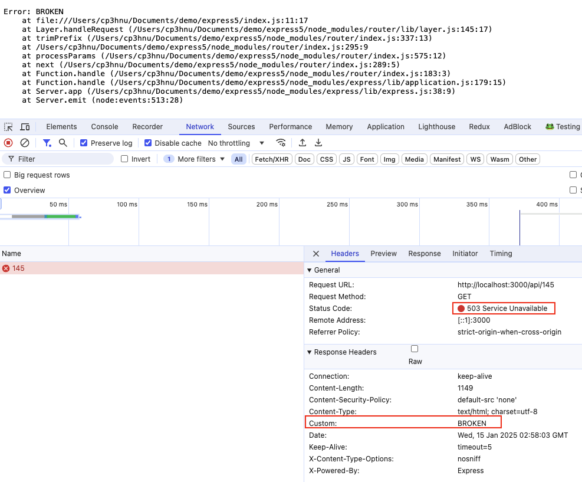
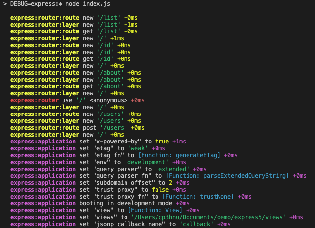
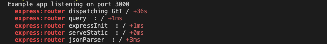

# Learn Express

上一篇文章 [创建 Node.js 后台服务](/2024/09/17/nodejs-api/)，我们使用 Express 创建了一个用户管理系统的后台服务，并用 React + Ant Design 创建了一个 Web 前端系统来使用和验证创建的后台服务。其实正如 [Express 官网 ](https://expressjs.com/)说的，Express 是 Node.js 的一个快速的，独立的，极简的 web 框架（"Fast, unopinionated, minimalist web framework for Node.js"），非常适用于创建 web 服务。这篇文章我们将使用 Express 创建 web 服务。

因为篇幅原因，我们将分成两部分，这部分主要介绍 Express 框架。

Express 框架主要由 3 大核心组成：路由、中间件以及错误处理，下面我们将一一介绍。

## 安装

```sh
$ npm init --yes
$ npm install express
```

> express 当前版本是 5.x，要求 node 18+

##  从 Hello World 开始

使用 express 创建一个 web 服务，创建 `app.js`

```js
// app.js
import express from "express"
const app = express()
const port = 3000

app.get('/', (req, res) => {
  res.send('Hello World!')
})

app.listen(port, () => {
  console.log(`Example app listening on port ${port}`)
})
```

开启服务

```sh
$ node app.js
```

在浏览器地址栏里输入 `http://localhost:3000/` ，就能看到浏览器上显示 "Hello World!"

## 生成器

Express 提供了一个快速创建 Express 应用的工具 [`express-generator`](https://github.com/expressjs/generator)

> `express-generator` 最新版本 4.16.1 发布于 6 年前，里面用到的一些技术已经过时了，比如 `hogan.js`、`compass`

### 安装

```sh
$ npm install -g express-generator
```

### CLI

```sh
express -h

  Usage: express [options] [dir]

    Options:

          --version        output the version number
      -e, --ejs            add ejs engine support
          --pug            add pug engine support
          --hbs            add handlebars engine support
      -H, --hogan          add hogan.js engine support
      -v, --view <engine>  add view <engine> support (dust|ejs|hbs|hjs|jade|pug|twig|vash) (defaults to jade)
          --no-view        use static html instead of view engine
      -c, --css <engine>   add stylesheet <engine> support (less|stylus|compass|sass) (defaults to plain css)
          --git            add .gitignore
      -f, --force          force on non-empty directory
      -h, --help           output usage information
```

`express` CLI 有三个有意思的选项，`engine`、`view <engine>` 和 `css <engine>`

#### `engine`

模版引擎，之前支持 `ejs`、`pug`、`hbs`、`hogan`，从代码分析，现在推荐使用选项 `view <engine>`

```js
if (options.view === true) {
  if (options.ejs) {
    options.view = 'ejs'
    warning("option `--ejs' has been renamed to `--view=ejs'")
  }

  if (options.hbs) {
    options.view = 'hbs'
    warning("option `--hbs' has been renamed to `--view=hbs'")
  }

  if (options.hogan) {
    options.view = 'hjs'
    warning("option `--hogan' has been renamed to `--view=hjs'")
  }

  if (options.pug) {
    options.view = 'pug'
    warning("option `--pug' has been renamed to `--view=pug'")
  }
}
```

#### `view <engine>`

模版引擎，取代之前分散的 `ejs`、`pug`、`hbs`、`hogan` 4 个选项，支持 8 个模版引擎库 `jade`、`dust`、`ejs`、`hbs`、`hjs`、`pug`、[`twig`](https://github.com/twigjs/twig.js)、`vash`，默认是 `jade`。但是因为 `express-generator` 最新版本 4.16.1 发布于 6 年前，`jade`、`dust`、`hjs`、`vash` 以及用于 [`handlebars.js`](https://github.com/handlebars-lang/handlebars.js) 的 `hbs` 都很久没有更新了。推荐使用 [`pugjs/pug`](https://github.com/pugjs/pug)、[`mde/ejs`](https://github.com/mde/ejs)、[`handlebars-lang/handlebars.js`](https://github.com/handlebars-lang/handlebars.js)。另外还有 [`marko-js/marko`](https://github.com/marko-js/marko)、[`mozilla/nunjucks`](https://github.com/mozilla/nunjucks) 以及 [`janl/mustache.js`](https://github.com/janl/mustache.js)。在下篇文章 [使用 Express 创建 Web 服务](/2025/01/17/express-web/) 中将详细介绍模版引擎。

#### `css <engine>`

默认是 `css`，支持 `less`、`styleus`、`sass` 和 `compass`（已过时）

### 创建应用

下面使用 `pug` 模版引擎创建 `myapp` 应用

```sh
 express --view=pug myapp
```

将在当前目录下创建 `myapp` 应用，该应用的目录结构如下：

```console
├── app.js
├── bin
|  └── www
├── package.json
├── public
|  ├── images
|  ├── javascripts
|  └── stylesheets
|     └── style.css
├── routes
|  ├── index.js
|  └── users.js
└── views
   ├── error.pug
   ├── index.pug
   └── layout.pug

directory: 7 file: 9
```

## 路由

路由是 Express 框架的核心组成部分，它表示服务器如何响应客户端的请求。其结构如下：

```
app.METHOD(PATH, HANDLER)
```

- `app`，Express 应用实例
- `METHOD`，表示 [HTTP 请求方法](https://en.wikipedia.org/wiki/Hypertext_Transfer_Protocol#Request_methods)，以小写字母表示，比如 `get`、`post` 等
- `PATH`，路径，可以是字符串、字符串路径模式、正则表达式或者数组
- `HANDLER`，处理函数，可以有多个。每个处理函数都有三个参数，分别是请求（request），响应（response）以及链式控制函数（`next`）

比如之前 Hello World 的例子：

```js
app.get('/', (req, res) => {
  res.send('Hello World!')
})
```

当外界发起一个根路径（"/"）的 `get` 请求时，响应其 "Hello World!"

### HTTP 请求方法

Express 支持大部分 HTTP 请求方法，比如 `get`、`post`、`delete` 等，完整列表请查看 [`app.METHOD`](https://expressjs.com/en/5x/api.html#app.METHOD)。

```js
app.get('/user', (req, res) => {
  res.send('cp3hnu')
})
```

如果服务器的响应与 HTTP 请求方法无关，也可以使用 [`app.all()`](https://expressjs.com/en/5x/api.html#app.all)，这适用于统一处理各种请求方法。

```js
app.all('/secret', (req, res, next) => {
  console.log('Accessing the secret section ...')
  next() // pass control to the next handler
})
```

[`app.route()`](https://expressjs.com/en/5x/api.html#app.route) 可以为路由路径创建可链接的路由处理函数，避免路径冗余和拼写错误。

> [`app.route()`](https://expressjs.com/en/5x/api.html#app.route) 其实返回一个 Express 的 [`Router` 实例](https://expressjs.com/en/5x/api.html#router)，后面会讲到

```js
app.route('/book')
  .get((req, res) => {
    res.send('Get a random book')
  })
  .post((req, res) => {
    res.send('Add a book')
  })
  .put((req, res) => {
    res.send('Update the book')
  })
```

### 路径

路由路径支持字符串、正则表达式以及两者的组合数组

> Express 使用 [`path-to-regexp`](https://www.npmjs.com/package/path-to-regexp) 匹配路由路径，以前 Vue-Router 也是使用这个库匹配路由路径，直到 Vue-Router 4.x 实现了自己的路由路径解析系统。 
>
> [Express Playground Router](https://bjohansebas.github.io/playground-router/) 是一个测试 Express 怎么匹配路由路径的工具。

```js
// 字符串，/about
app.get('/about', (req, res) => {
  res.send('about')
})

// 正则表达式，匹配 /butterfly、/dragonfly 等
app.get(/.*fly$/, (req, res) => {
  res.send('/.*fly$/')
})

// 组合数组，匹配 /abcd、/xyza、/lmn 和 /pqr
app.use(['/abcd', '/xyza', /\/lmn|\/pqr/], (req, res, next) => {
  next()
})
```

Express 5.x 不再支持字符串路径模式

- 特殊符号 `+`、`?` 不再支持，使用时报错。

```js
// TypeError: Unexpected + at 3, expected END: https://git.new/pathToRegexpError
app.get('/ab+cd', (req, res) => {
  res.send('ab+cd')
})

// TypeError: Unexpected + at 3, expected END: https://git.new/pathToRegexpError
app.get('/ab?cd', (req, res) => {
  res.send('ab?cd')
})
```

- `?` 可以使用 `{}` 代替

```js
app.get('/a{b}cd', (req, res) => {
  res.send('ab?cd')
})
```

- 特殊符号 `*` 后面必须有一个名称，比如 `/*name`，其作用等同于 `/:name`

```js
// 等同于 /^(?:\/api\/([\s\S]+))(?:\/$)?$/i
app.get('/api/*name', (req, res) => {
  res.send(req.params)
})

// 对于地址 http://localhost:3000/api/cp3hnu
// 输出：
// { "name": "cp3hnu" }
```

更多详情请参考 [Migration Guide](https://expressjs.com/en/guide/migrating-5.html#path-syntax) 

#### 参数

Express 和 Vue-Router 一样也支持路径参数，路径参数名只支持 `[A-Za-z0-9_]`

```js
app.get('/users/:userId/books/:bookId', (req, res) => {
  res.send(res.params)
})

// 对于地址 http://localhost:3000/users/34/books/8989
// 输出：
// { "userId": "34", "bookId": "8989" }
```

连字符（`-`）和点（`.`）是按字面意思解释的，因此它们可以与路由参数一起使用

```js
app.get('/flights/:from-:to', (req, res) => {
  res.send(res.params)
})

// 对于地址 http://localhost:3000/plantae/:genus.:species
// 输出：
// { "from": "LAX", "to": "SFO" }

app.get('/plantae/:genus.:species', (req, res) => {
  res.send(res.params)
})

// 对于地址 http://localhost:3000/plantae/:genus.:species
// 输出：
// { "genus": "Prunus", "species": "persica" }
```

Express 4.x 限制变量的方式，比如 `/:id(\\\d+)`，可以用正则表达式代替

```js
// 索引
app.get(/\/users\/([0-9]+)/, (req, res, next) => {
  res.send(req.params.0);
})

// 对于地址 http://localhost:3000/users/34
// 输出：
// { "0": "34" }

// 更好的方法是使用命名捕获组
app.get(/\/users\/(?<id>[0-9]+)/, (req, res, next) => {
  res.send(req.params.id);
})

// 对于地址 http://localhost:3000/users/34
// 输出：
// { "id": "34" }
```

### 处理函数

一个路由地址可以提供单个处理函数、多个处理函数和处理函数数组以及前面三者的组合。

当提供多个处理函数或者数组时，**必须**手动调用 `next()` 函数，才会执行下一个处理函数。

> 注意，这个时候调用 `next()` 函数不能带有任何参数

```js
// 单个
app.get('/example/a', (req, res) => {
  res.send('Hello from A!')
})

// 多个
app.get('/example/b', (req, res, next) => {
  console.log('the response will be sent by the next function ...')
  next()  // 必须手动调用 next() 函数
}, (req, res) => {
  res.send('Hello from B!')
})

// 数组
const cb0 = function (req, res, next) {
  console.log('CB0')
  next() // 必须手动调用 next() 函数
}

const cb1 = function (req, res, next) {
  console.log('CB1')
  next() // 必须手动调用 next() 函数
}

const cb2 = function (req, res) {
  res.send('Hello from C!')
}

app.get('/example/c', [cb0, cb1, cb2])

// 组合
app.get('/example/d', [cb0, cb1], (req, res, next) => {
  console.log('the response will be sent by the next function ...')
  next() // 必须手动调用 next() 函数
}, (req, res) => {
  res.send('Hello from D!')
})
```

如果要跳过后续的处理函数，可以调用 `next("route")`。

`next("route")` 只能跳过同一个方法里添加的处理函数，两个 `app.METHOD` 之间没有影响，即使它们的 path 相同，比如两个 `get("/api")`，它们的处理函数不会相互影响。

同一个 `app.METHOD()` 添加的处理函数，Express 称为 sub-stack。

> 如果当前处理函数响应了请求，比如调用 `res.send()`，请求也就结束了，即使没有调用 `next("route")` 后续的处理函数也不会调用了。

```js
app.get('/api', (req, res, next) => {
  console.log("1");
 	next("route")
})

app.get('/api', (req, res) => {
  console.log("2");
  res.send("Hello World!")
})

// 输出:
// 1
// 2
```

### 路由模块

[`express.Router()`](https://expressjs.com/en/5x/api.html#express.router) 可以创建模块化的路由，它返回一个 [`Router`](https://expressjs.com/en/5x/api.html#router) 对象，是一个完整的中间件（下面会讲到）和路由系统，因此被称为 "mini-app"。 

比如，我们创建一个用户的子系统

```js
// users.js
import express from "express"
const router = express.Router()

router.get('/list', (req, res) => {
  res.send('User list')
})

router.get('/id', (req, res) => {
  res.send('An user ')
})

router.get('/about', (req, res) => {
  res.send('About users')
})

export default router
```

然后加载这个模块

```js
import users from './users'
app.use("/users", users)
```

现在这个服务能处理 `/users/list`、`/users/123`、`/users/about` 的请求。

通过 [`express.Router()`](https://expressjs.com/en/5x/api.html#express.router)，简化了路由路径，同时对子系统进行了封装，便于移植。

[`Router`](https://expressjs.com/en/5x/api.html#router) 使用路由的方式和 Express 应用一致，除了处理函数可以使用 `next("router")` 跳过这个 Router 路由

```js
router.get('/list', (req, res, next) => {
  // 如果身份不是管理员，跳过这个 users 路由
  // 如果 app 没有定义 /users/list 的路由, 则报错，错误码 404
  if (!isAdmin()) {
     next("router")
  } else {
    next()
  }
})
```

[`app.router()`](https://expressjs.com/en/5x/api.html#app.router) 返回 Express 应用程序内建的 `Router` 实例。猜测 `app.get()` 其实就是内建的 `app.router().get()`

## 中间件

中间件是 Express 框架的核心中的核心。

那什么是 Express 的中间件呢？中间件就是可以访问请求对象（[`Request`](https://expressjs.com/en/4x/api.html#req)）、响应对象（[`Response`](https://expressjs.com/en/4x/api.html#res)）以及 `next()` 的函数。

从这个定义可以看出，上文提到的处理函数其实就是一个中间件，称为路由中间件。

Express 中间件主要的工作：

- 完成某些功能
- 修改 `Request` 和 `Response` 对象
- 完成请求-响应
- 调用下一个中间件

比如下面定义一个 `requestTime` 的中间件：给每一个请求添加一个 `requestTime` 属性

```js
const requestTime = function (req, res, next) {
  req.requestTime = Date.now()
  next()
}
```

Express 使用 [`app.use()`](https://expressjs.com/en/5x/api.html#app.use) 或者上文介绍的 [`app.METHOD()`](https://expressjs.com/en/5x/api.html#app.METHOD) 加载中间件。

与 `app.METHOD()` 不同的是 `app.use()` 路由路径可以为空，当路由路径为空时，中间件应用于所有的请求，比如下面这个 `requestTime` 中间件作用于所有的请求。

```js
app.use(requestTime)

app.get('/', (req, res) => {
  let responseText = 'Hello World!<br>'
  responseText += `<small>Requested at: ${req.requestTime}</small>`
  res.send(responseText)
})

app.listen(3000)
```

**但是需要主要的是**，中间件的加载顺序很重要，首先加载的中间件也会首先执行。如果上面的例子调换顺序，则请求 `http://localhost:3000/` 时无法访问 `requestTime` 属性

```js
app.get('/', (req, res) => {
  let responseText = 'Hello World!<br>'
  responseText += `<small>Requested at: ${req.requestTime}</small>` // 无法访问 requestTime 
  res.send(responseText)
})

app.use(requestTime)

app.listen(3000)
```

带有路径时，`app.use()` 也和 `app.METHOD()` 有所不同，`app.use()` 匹配子路径

```js
// 匹配 /api 和 /api 下的子路径，比如 /api/abc, /api/abc/abc 等等
app.use('/api', (req, res) => {
  res.send("Hello World!")
})

// 只匹配 /api，不匹配 /api 下的子路径
app.get('/api', (req, res) => {
  res.send("Hello World!")
})
```

所以一般使用 `app.use()` 执行功能操作，而 `app.METHOD()` 响应请求。 

`app.use()` 与 `app.METHOD()` 的第三个不同之处是，`app.use()` 加载的中间件，不能通过调用 `next("route")` 跳过后续的中间件。

同一个 `app.use()` 和 `app.METHOD()` 加载的中间件，Express 称为中间件 sub-stack.

中间件也支持异步函数

```js
async function validateCookies (req, res, next) {
  await cookieValidator(req.cookies)
  next()
}

app.use(validateCookies)
```

当中间件返回一个 reject 的 promise 或者抛异常（throw）时，将主动调用 `next(err)`，这将执行 Express 错误处理中间件，这个后面会讲到。

### Router 中间件

正如上文说的，`Router` 是一个完整的中间件和路由系统，因此 `Router` 也可以加载中间件，称之为 Router 中间件。上面 `app.use()` 加载的中间件称为应用中间件。

```js
// users.js
const express = require('express')
const router = express.Router()

router.use((req, res, next) => {
  console.log('Time:', Date.now())
  next()
})

export default router
```

`Router` 加载中间件的方式和 Express 应用一致，除了可以使用 `next("router")` 跳过这个 Router 路由。

### 内置中间件

Express 提供了三个内置中间件:

- `express.json([options])`
- `express.urlencoded([options])`
- `express.static(root, [options])`

#### `express.json()`

[`express.json()`](https://expressjs.com/en/5x/api.html#express.json) 基于 [`body-parser`](https://expressjs.com/resources/middleware/body-parser.html) 中间件解析请求中的 JSON 负载。解析后 `request` 对象有一个 `body` 属性，包含解析后的 JSON 对象。

在上一篇文章 [创建 Node.js 后台服务](/2024/09/17/nodejs-api/) 中我们是这么处理带 JSON 负载的 POST 请求的：通过 `request` 对象的 `data` 事件收集数据，`end` 事件解析收集到的数据。

```js
const postUsers = (response, request) => {
  // 设置接收数据的编码格式为 UTF-8
  request.setEncoding('utf8');
  let body = '';
  // data 事件，接收请求数据
  request.on('data', (data) => {
    body += data;
  });
  // end 事件，表示数据传递完成
  request.on('end', () => {
    const newUser = JSON.parse(body);
    newUser.id = findMaxId(users) + 1;
    users.push(newUser);
    response.statusCode = 201;
    response.setHeader('Content-Type', 'application/json');
    response.end(JSON.stringify(newUser));
  });
}
```

使用 `express.json()` 中间件，将大大简化上面的代码

```js
const postUsers = (response, request) => {
  const newUser = request.body;
  newUser.id = findMaxId(users) + 1;
  users.push(newUser);
  response.sendStatus(201);
  response.set('Content-Type', 'application/json');
  response.end(JSON.stringify(newUser));
}

app.use(express.json("application/json"))
app.post('/users', postUsers)
```

#### `express.urlencoded()`

[`express.urlencoded()`](https://expressjs.com/en/5x/api.html#express.urlencoded) 与 `express.json()` 类似，也是基于 [`body-parser`](https://expressjs.com/resources/middleware/body-parser.html) 中间件，但是是解析 URL 编码负载，即 `application/x-www-form-urlencoded` 编码。

#### `express.static()`

[`express.static(root, [options])`](https://expressjs.com/en/5x/api.html#express.static) 基于 [`serve-static`](https://expressjs.com/resources/middleware/serve-static.html)，服务于静态资源，比如图片、字体、JS、CSS 等文件。参数 `root` 指定静态资源的所在的目录。比如下面是加载 `public` 目录下的所有静态资源。

```js
import path from 'node:path'

// get the resolved path to the file
const __filename = fileURLToPath(import.meta.url); 
const __dirname = path.dirname(__filename);

app.use(express.static(path.join(__dirname, 'public')))
```

然后就可以加载 public 目录下的资源了

```
http://localhost:3000/images/bg.png
```

可以给静态资源指定一个路由前缀

```js
app.use("/static", express.static(path.join(__dirname, 'public')))
```

还可以加载多个目录下的静态资源，调用多次

```js
app.use(express.static(path.join(__dirname, 'public')))
app.use(express.static(path.join(__dirname, 'files')))
```

### 第三方中间件

使用第三方中间件很简单，安装相应的 npm 包，加载中间件就 ok 了。比如下面使用 [`cookie-parser`](https://expressjs.com/id/resources/middleware/cookie-parser.html) 中间件

```js
$ npm install cookie-parser
```

```js
import express from 'express'
import cookieParser from 'cookie-parser'
const app = express()

// 加载中间件
app.use(cookieParser())
```

查看有哪些第三中间件，请查看 [Third-party middleware](https://expressjs.com/en/resources/middleware.html)

## 错误处理

Express 的错误处理机制帮助我们捕获和处理错误。

Express 提供了默认的错误处理程序，当中间件抛出异常或者调用 `next(error)` 表明出错时，Express 捕获错误并且处理错误

```js
app.get('/', (req, res) => {
  throw new Error('BROKEN')
})

app.use((req, res, next) => {
  const error = new Error('BROKEN')
  error.status = 503
  error.headers = {
    custom: "BROKEN"
  }
  next(error)
})
```

默认的错误处理程序主要完成：

- 根据 `error.status` 或者 `error.statusCode` 设置响应的 `statusCode`，如果值不在 `4xx ~ 5xx` 区间，或者没有设置，则设置为 `500`
- 根据响应的 `statusCode`，设置响应的 `statusMessage`
- 设置响应 body，在开发环境下是 `error.stack`，在生产环境下是 `statusMessage` 组成的 HTML
- 根据 `error.headers` 设置响应 `header`

上面第二个例子，设置了错误对象的 `status` 和 `headers`，其响应如下：



如果中间件调用了异步函数，为了捕获异步函数的错误，需要手动调用 `next()` 函数，例如

```js
const { readFile } = require('node:fs');
app.get('/', (req, res, next) => {
  fs.readFile('/file-does-not-exist', (err, data) => {
    if (err) {
      next(err) // Pass errors to Express.
    } else {
      res.send(data)
    }
  })
})
```

因为从 Express 5.x 开始，如果中间件返回 promise，当 promise 被 reject 时，会自动调用 `next(error)`，所以最好的方式是使用异步函数

```js
const { readFile } = require('node:fs/promises');

app.get('/', async (req, res, next) => {
  const contents = await fs.readFile('/file-does-not-exist')
})
```

### 自定义错误处理程序

错误处理程序也是一个中间件，但是与上文介绍的中间件不同，它有四个参数，第一个参数是错误对象。错误处理程序必须带有 4 个参数，否则 Express 不认为它是一个错误处理程序。

```js
app.use((err, req, res, next) => {
  console.error(err.stack)
  res.status(500).send('Something broke!')
})
```

错误处理程序**必须**定义在其它中间件后面。Express 服务可以定义多个错误处理程序，如果当前处理程序不出来该类型的错误，可以通过 `next(error)` 将错误往后传递，最后是 Express 的默认错误处理程序。

```js
// 打印错误信息
function logErrors (err, req, res, next) {
  console.error(err.stack)
  next(err)
}

// 除了 XHR 错误
function clientErrorHandler (err, req, res, next) {
  if (req.xhr) {
    res.status(500).send({ error: 'Something failed!' })
  } else {
    next(err)
  }
}

// 处理所有错误
function errorHandler (err, req, res, next) {
  res.status(500)
  res.render('error', { error: err })
}

// 其它中间件
app.use(logErrors)
app.use(clientErrorHandler)
app.use(errorHandler)
```

当自定义错误处理程序时，如果 header 已经发送到客户端，您必须将错误传递给默认的错误处理程序

> 这一点还不是很明白

```js
function errorHandler (err, req, res, next) {
  if (res.headersSent) {
    return next(err)
  }
  res.status(500)
  res.render('error', { error: err })
}
```

`Router` 也可以自定义错误处理程序，除了自定义路由模块的错误。

## `next()` 总结

中间件调用 `next()` 有四种方式：

- 无参数
- 带有 `"route"` 参数
- 带有 `"router"` 参数
- 其它参数

而根据上文介绍，有四个 API 加载中间件

- `app.METHOD()`
- `app.use()`
- `router.METHOD()`
- `router.use()`

我们现在来总结一下。首先我们假设一个前提，中间件没有结束请求-响应周期。

| `next()`          | 无参数                                      | `"route"` 参数                                            | `"router"` 参数                                              | 其它参数               |
| ----------------- | ------------------------------------------- | --------------------------------------------------------- | ------------------------------------------------------------ | ---------------------- |
| `app.METHOD()`    | **必须调用**，否则请求一直是 `pending` 状态 | 跳过同一个 `app.METHOD()` 加载的中间件，其它的不受影响    | 报错，错误码是 404                                           | 报错，错误码默认是 500 |
| `app.use()`       | **必须调用**，否则请求一直是 `pending` 状态 | 没有作用                                                  | 报错，错误码是 404                                           | 报错，错误码默认是 500 |
| `router.METHOD()` | **必须调用**，否则请求一直是 `pending` 状态 | 跳过同一个 `router.METHOD()` 加载的中间件，其它的不受影响 | 跳过整个 router，如果 app 没有这个地址的其它路由，则报错，错误码是 404 | 报错，错误码默认是 500 |
| `router.use()`    | **必须调用**，否则请求一直是 `pending` 状态 | 没有作用                                                  | 跳过整个 router，如果 app 没有这个地址的其它路由，则报错，错误码是 404 | 报错，错误码默认是 500 |

## 调试

要查看 Express 使用的所有内部日志，在启动时将 `DEBUG` 环境变量设置为 `express:*`。

```js
DEBUG=express:* node index.js
```

控制台将输出：



当应用程序发出请求时，输出：



但是很遗憾，在 Express 5.x 这个方法不管用，因此我提了一个 [issue](https://github.com/expressjs/express/issues/6280)，期待他们的回答。

> 从他们的回答中，我们得知 Express 5.x 内部移除了调试库 [`debug-js/debug`](https://github.com/debug-js/debug) 

从 [`express-generator`](https://github.com/expressjs/generator) 的生成的代码中，我们找到有两个解决办法：

1. 使用 [`expressjs/morgan`](https://github.com/expressjs/morgan) 中间件

安装 `morgan`

```sh
$ npm i morgan
```
在应用程序入口文件使用 `morgan`

```js
// index.js
import logger from 'morgan';
app.use(logger('dev'));
```

它将打印每一个请求

```
GET /users 200 32.586 ms - 171
```

2. 使用 [`debug-js/debug`](https://github.com/debug-js/debug) 手动输出。

Express 4.x 内部就是使用的这个库实现调试功能，也因为 Express 5.x 将这个库移除了，所以 Express 5.x 目前无法实现自动调试。

```sh
$ npm install debug
```

`debug` 导出的是一个函数，需要指定一个调试命名空间（`namespace`）。然后通过设置 `DEBUG=namespace` 运行应用，就可以打印 `debug` 的输出了。

```js
import debugModule from "debug"
const debug = debugModule('express:server')

app.use((req, res, next) => {
  debug(`express:server ${req.method} ${req.url}`);
  next();
})
```

```sh
$ DEBUG=express:server node index.js
```

期待 Express 5.x 重新添加调试功能。

## 最后

这篇文章我们详细介绍了 Express 框架以及 Express 框架三大核心技术。下篇文章 [使用 Express 创建 Web 服务](/2025/01/17/express-web/) 我们将使用 Express 框架来创建 Web 服务。

## References

- [Express](https://expressjs.com/)
- [Express API](https://expressjs.com/en/5x/api.html)
- [Express middleware](http://expressjs.com/en/resources/middleware.html)
- [Express examples](https://expressjs.com/en/starter/examples.html)
- [Database integration](https://expressjs.com/en/guide/database-integration.html)
- [Express Playground Router](https://bjohansebas.github.io/playground-router/)
- [HTTP response status codes](https://developer.mozilla.org/en-US/docs/Web/HTTP/Status)
- [`expressjs/express`](https://github.com/expressjs/express)
- [`expressjs/express-generator`](https://github.com/expressjs/generator)
- [`pillarjs/path-to-regexp`](https://github.com/pillarjs/path-to-regexp)
-  [`pugjs/pug`](https://github.com/pugjs/pug)
- [`mde/ejs`](https://github.com/mde/ejs)
- [`handlebars-lang/handlebars.js`](https://github.com/handlebars-lang/handlebars.js)
-  [`marko-js/marko`](https://github.com/marko-js/marko)
- [`mozilla/nunjucks `](https://github.com/mozilla/nunjucks)
- [`janl/mustache.js`](https://github.com/janl/mustache.js)
-  [`@ladjs/consolidate`](https://www.npmjs.com/package/@ladjs/consolidate)
-   [`expressjs/morgan`](https://github.com/expressjs/morgan)
-  [`debug-js/debug`](https://github.com/debug-js/debug)
