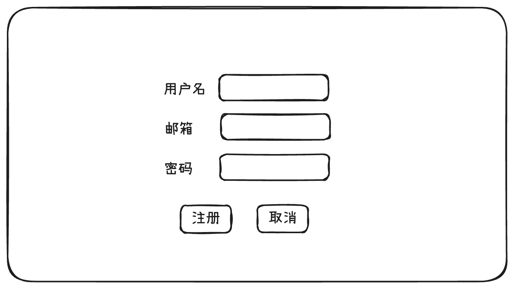
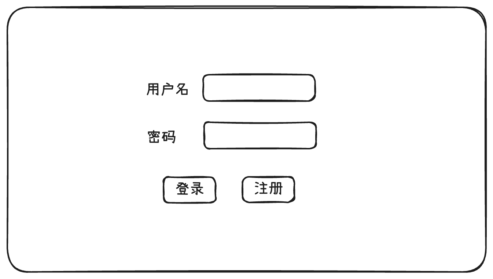
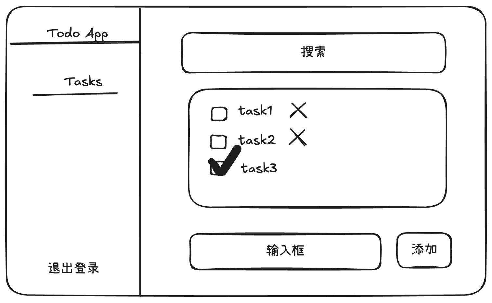
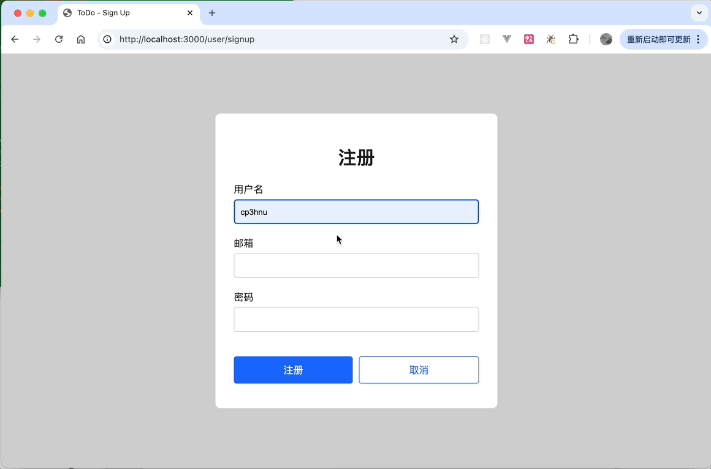

# 使用 Express 创建 Web 服务

上一篇文章 [Learn Express](/2024/12/12/express) 详细介绍了 Express 框架，这篇文章我们使用 Express 创建 Web 服务。

首先我们先介绍一下模版引擎。

## 模版引擎

既然是创建 web 服务，就需要返回 HTML 字符串，比如下面返回一个用户列表

```js
router.get('/', (req, res, next) => {
  const emptyHtml = `
  <div>There are no users</div>
  `
  const usersHtml = `
  <table>
  <tr>
    <th>ID</th>
    <th>Name</th>
  </tr>
  ${users.map(user => `<tr><td>${user.id}</td><td>${user.name}</td></tr>`).join("")}
  </table>
  `
  const html = users.length > 0 ? usersHtml : emptyHtml
  res.send(html)
})
```

从上面的代码我们可以看出，使用字符串插值的方式既麻烦又不好理解。而且随着业务逻辑越来越复杂，插值字符串也会越来越复杂，维护插值字符串的成本就会越来越高。

Vue 的开发者都知道，Vue 使用了 `template` 模板语法来简化字符串插值

```vue 
<template>
  <table v-if="users.length > 0">
    <tr>
      <th>ID</th>
      <th>Name</th>
    </tr>
    <tr v-for="user in users">
      <td>{{ user.id }}</td>
      <td>{{ user.name }}</td>
    </tr>
    </table>
	<div v-else>
  	There are no users
  </div>
</template>
```

Vue 模板语法还带来了语法高亮、错误提示、代码格式化、模块复用等优点。

那 Express 可以使用模板语法呢？  正如上文 [Learn Express](./2024-12-12-express.md) 介绍的，Express 可以使用 [`pugjs/pug`](https://github.com/pugjs/pug)、[`mde/ejs`](https://github.com/mde/ejs)、[`handlebars-lang/handlebars.js`](https://github.com/handlebars-lang/handlebars.js)、[`marko-js/marko`](https://github.com/marko-js/marko)、[`mozilla/nunjucks`](https://github.com/mozilla/nunjucks) 以及 [`janl/mustache.js`](https://github.com/janl/mustache.js) 等模板引擎。

从 [npm trends](https://npmtrends.com/ejs-vs-handlebars-vs-marko-vs-mustache-vs-nunjucks-vs-pug) 中我可以看出，`pug` 有最多的 star，`ejs` 和 `handlebars.js` 有最多的下载量。`nunjucks` 类似于 Python 的模板引擎  [`jinja2`](http://jinja.pocoo.org/)

接下来我们以 `pug` 为例讲解 Express 怎么使用模板引擎。

### Pug

#### 安装

```sh
$ npm i pug
```

#### 配置

Express 默认模板文件夹是 `views`，在 `views` 里创建 `pug` 文件，比如

```pug
if users.length > 0
  table
    tr
      th ID
      th Name
    each user in users
      tr
        td #{user.id}
        td #{user.name}
else
  div There are no users
```

然后设置 Express 默认模板引擎

```sh
app.set('view engine', 'pug')
```

使用 `res.render()` 渲染模板，并将 HTML 字符串发送给客户端

```js
app.get('/', (req, res) => {
  res.render('index', { users })
})
```

#### 语法

Pug 语法的最大特点是采用缩进表示 DOM 的层级关系，Pug 支持继承、组合、插值、条件判断、列表迭代等功能。详细介绍请参考 [Pug 官方文档](https://pugjs.org/language/attributes.html)。

## 样式

现在 HTML 有了，那样式怎么处理呢？Pug 支持 style 和 class。

Pug 的 style 支持 JS 对象，但是与 JSX、Vue 不同的是属性名使用 kebab-case (短横线连字符) 形式。

```pug
div.root-index(style={"font-size": "16px"}) Hello #{title}
```

```html
<div class="root-index" style="font-size:26px;">Hello Express</div>
```

处理 class 有几种方法：

- 添加 `link` stylesheet。首先在 `public` 文件夹里创建 css 文件，然后在模板文件里引入这个 CSS 文件。

```css
/* /public/css/style.css */
.root-index {
  color: red;
}
```

创建模版文件

```pug
//- 模板
doctype html
html
  head
    title= title
    link(rel='stylesheet', href='/css/style.css')
  body
    block content
```

- 内联 `<style>` 样式代码

```pug
doctype html
head
  style.
    .root-index {
      color: red;
    }
body
  div.root-index(style={"font-size": "26px"}) Hello #{title}
```

- 使用 `include` 导入样式文件的代码

```pug
doctype html
html
  head
    style
      include style.css
```

那怎么使用 Sass（SCSS）、Less、Stylus 这种 CSS 扩展？

### Sass

[`express-generator`](https://github.com/expressjs/generator) 使用 `node-sass-middleware` 中间件，在开发阶段自动编译 Sass/SCSS 文件，但是这个中间件和 `node-sass` 一起 **deprecated** 了。NPM 里也有 `dart-sass` 相关的 Express 中间件，但是都很久没有更新了。因此我决定自己实现将 Sass/SCSS 文件编译成 CSS 文件。

首先安装 `sass` 和 `chokidar`。[`sass`](https://github.com/sass/dart-sass) 将 Sass/SCSS 文件编译成 CSS 文件，[`chokidar`](https://github.com/paulmillr/chokidar) 监听 Sass/SCSS 文件的变化，只要修改 Sass/SCSS 文件，就重新编译。

```sh
$ npm i sass chokidar -D
```

假如 CSS 代码位于 `/public/css/style.css`，Sass/SCSS 代码位于 `/sass/style.{sass|scss}`

```js
import * as sass from 'sass'
import path from 'node:path';
import fs from 'node:fs';
import chokidar from 'chokidar';

// get the resolved path to the file
const __filename = fileURLToPath(import.meta.url); 
// get the directory name of the current module
const __dirname = path.dirname(__filename);

// in v20.11.0
// const __dirname = import.meta.dirname

export const dirJoin = (...args) => {
  return path.join(__dirname, ...args)
}

// sass/scss 文件所在位置
const sassSrcPath = dirJoin('sass');
// css 文件所在位置
const cssDestPath = dirJoin('public/css');

// 编译所有 SCSS 文件
export const compileSass = () => {
  fs.readdir(sassSrcPath, (err, files) => {
    if (err) {
      console.error(err);
      return;
    }

    files.forEach((file) =>  {
      console.log(file)
      compileFile(path.join(sassSrcPath, file));
    })
  })
}

// 编译单个文件
function compileFile(filePath) {
  const fileName = path.basename(filePath);
  const cssPath = path.join(cssDestPath, fileName.replace('.scss', '.css'));

  try {
    const result = sass.compile(filePath, {
      style: 'compressed',
    });
    fs.writeFileSync(cssPath, result.css);
    console.log(`Compiled: ${filePath} -> ${cssPath}`);
  } catch (err) {
    console.error(`Error compiling ${filePath}:`, err);
  }
}

// 监听 SCSS 文件变化
chokidar.watch(sassSrcPath).on('change', (filePath) => {
  console.log(`File changed: ${filePath}`);
  compileFile(filePath);
});
```

在生产环境需要先手动编译 Sass/SCSS 文件，生成 CSS 文件，然后部署。

```sh
{
 "scripts": {
    "buid:sass": "sass sass/:public/css/ --style compressed"
  }
}
```

## 脚本

现在 HTML、CSS 都有了，那 JavaScript 怎么处理呢？有以下几种方法:

- HTMLElement 内联方法

```pug
body
	button#login(onclick="console.log('登录')") 登录
```

- `<script>` 内联脚本代码

```pug
body
  button#login 登录
  script.
    const btn = document.getElementById("login")
    if (btn) {
      btn.addEventListener("click", () => {
        console.log("登录")
      })
    }
```

- 使用 `include` 导入 JavaScript 文件的代码

```pug
doctype html
  body
    h1 My Site
    p Welcome to my super lame site.
    script
      include script.js
```

- `<script>` 脚本文件

假设脚本文件在 `public/js` 文件夹

```js
// public/js/index.js
const btn = document.getElementById("login")
if (btn) {
  btn.addEventListener("click", () => {
    console.log("登录")
  })
}
```

 模板添加脚本文件

```js
body
	button#login 登录
  script(src="/js/index.js")
```

## Web 应用 - ToDo App

现在 HTML、CSS、JavaScript 都齐活了，我们来创建 Web 应用 - ToDo。我们将实现以下功能:

- 注册
- 登录
- 任务

### 设计稿

ToDo 应用的主要功能如下：

#### 注册



#### 登录



#### Todo 列表



### 功能实现

#### 注册

注册功能比较简单

- Get `/user/signup`，渲染注册表单
- Post `/user/signup`，获取和验证表单数据，然后创建用户，插入数据库

##### 渲染注册表单

渲染注册表单页面，使用 Pug 模版、Scss 语法并使用 [BEM](https://getbem.com/introduction/) 规范

首先定义一个基础模板，其使用一些公共的 CSS 和 JS

```pug
//- 基础模板 - base.pug
doctype html
html
  head
    title ToDo - #{title}
    block stylesheet
      link(rel='stylesheet', href='/css/index.css')
  body
    div#root
      block root
    block script
      script(src="/js/index.js")
```

注册模板继承基础模版，并添加自己的 CSS 和 JS

```pug
//- 注册模板
extends base

block title
  title ToDo - Sign Up

block append stylesheet
   link(rel='stylesheet', href='/css/sign-in-up.css')
   
block append script
  script(src="/js/sign-in-up.js")
 
block root
  div.sign-in-up
    form.sign-in-up__form(action="" method="post")
      div.sign-in-up__form__title 注册
      div.sign-in-up__form__item
        label(for="username" class='sign-in-up__form__item__label') 用户名
        input#username(type="text" name="username" class='sign-in-up__form__item__input' value=username required)
      div.sign-in-up__form__item
        label(for="email" class='sign-in-up__form__item__label') 邮箱
        input#email(type="email" name="email" class='sign-in-up__form__item__input' value=email required)
      div.sign-in-up__form__row
        label(for="password" class='sign-in-up__form__item__label') 密码
        input#password(type="password" name="password" class='sign-in-up__form__item__input' value=password required)
      div.sign-in-up__form__button
        button#sign-up-submit(type="submit" class='sign-in-up__form__button__submit') 注册
        button#sign-up-cancel(type="button" class='sign-in-up__form__button__cancel') 取消
      div.sign-in-up__form__error= error
```

模板定义了 `username`、`email`、`password` 以及 `error` 插值变量。

通过 `res.render` 函数渲染注册表单

```js
router.get('/signup', (req, res) => {
  res.render('sign-up')
})
```

##### 注册用户

完成以下功能:

1. 首先使用内置中间件 [`express.urlencoded()`](https://expressjs.com/en/5x/api.html#express.urlencoded) 处理 request body，处理后的数据存储在 `req.body` 属性
1. 验证用户名、邮箱、密码必填，密码长度必须大于等于 6 位（可以自行扩展更复杂的密码校验）以及用户名/邮箱不能重复
1. 创建用户，插入数据库。数据库仍然使用 [创建 Node.js 后台服务](./2024-09-17-nodejs-api) 介绍的 [Sequelize](https://sequelize.org/) + [sqlite3](https://github.com/TryGhost/node-sqlite3)

```js
router.post('/signup', async (req, res) => {
  const { username, email, password } = req.body;
  if (!username || !email || !password) {
    const error = !username ? "请填写用户名" : (!email ? "请填写邮箱" : "请填写密码");
    res.status(400).render('sign-up', { error: error, ...req.body });
    return;
  }
  if (password.length < 6) {
    res.status(400).render('sign-up', { error: "密码至少6位", ...req.body });
    return;
  }
  let user = await User.findOne({
    where: {
      username
    }
  });
  if (user) {
    res.status(400).render('sign-up', { error: "用户名已存在", ...req.body });
    return;
  } else {
    user = await User.findOne({
      where: {
        email
      }
    });
    if (user) {
      res.status(400).render('sign-up', { error: "邮箱已存在", ...req.body });
      return;
    } else {
      const newUser = await User.create({
        username,
        email,
        password
      });
      res.redirect('/user/signin');
      return;
    } 
  }
})
```

#### 认证与授权

我们采用 session + cookie 的方式实现登录与验证，具有以下特点：

1. Session：将用户信息存储在服务器端（内存、数据库或缓存），用一个唯一的 Session ID 关联用户状态。
2. Cookie：客户端只存储 Session ID，用于标识用户的会话。

Express 可以使用 [`expressjs/session`](https://github.com/expressjs/session) 中间件处理 session 和 cookie。

```sh
$ npm i express-session
```

##### 登录

**渲染登录表单**

登录表单和注册表单类似，通过 `res.render` 函数渲染登录表单

```js
router.get('/signin', (req, res) => {
  res.render('sign-in')
})
```

**配置 `express-session` 中间件**

```js
import session from 'express-session';

// 配置 express-session 中间件
app.use(
  session({
    secret: 'my_session_secret_key', // 用于加密 Session ID 的密钥
    resave: false,                  // 是否每次请求都重新保存 Session
    saveUninitialized: false,       // 是否为未初始化的 Session 分配存储
    cookie: {
      httpOnly: true,               // 防止 XSS 攻击
      secure: false,                // 本地开发时关闭，生产环境启用 HTTPS 时设置为 true
      maxAge: 60 * 60 * 1000,       // 设置 Session 有效期 (1 小时)
    },
  })
);
```

**处理登录请求**

```js
router.post('/signin', async (req, res) => {
  const { username, password } = req.body;
  if (!username || !password) {
    const error = !username ? "请填写用户名" : "请填写密码";
    res.status(500).render('sign-in', { error: error, ...req.body });
    return;
  }
  const user = await User.findOne({
    where: {
      username,
      password
    }
  });
  if (user) {
    req.session.user = user;
    res.redirect('/');
    return;
  } else {
    res.status(500).render('sign-in', { error: "用户名或密码错误", ...req.body });
    return;
  }
})
```

##### 验证

定义验证中间件，如果用户没有登录或者 cookie 失效，跳转至登录页面

```js
// 验证中间件
app.use((req, res, next) => {
  if (req.session.user) {
    // 已登录时，登录和注册都重定向到 todo 页面
    if (req.url === '/user/signin' || req.url === '/user/signup') {
      return res.redirect('/todo');
    }

    return next();
  }

  // 没有登录，跳转至登录页面
  res.redirect('/user/signin');
});
```

##### 退出登录

在 HTML 中 `<form>` 是唯一直接发送 POST 请求的方式，如果不想使用 form，只能使用 JavaScript。

退出登录使用 [Fetch_API](https://developer.mozilla.org/en-US/docs/Web/API/Fetch_API) 发送 POST 请求

```js
const logoutBtn = document.getElementById("logout")
if (logoutBtn) {
  logoutBtn.addEventListener("click", () => {
    fetch("/user/logout", {
      method: "POST"
    }).then((res) => {
      if (res.ok) {
        location.href = "/user/signin"
      }
    })
  })
}
```

处理"退出登录"请求

```js
router.post('/logout', (req, res) => {
  req.session.destroy((err) => {
    if (err) {
      return res.status(500).send({ message: '退出失败' });
    }

    res.clearCookie('connect.sid'); // 清除 Session Cookie
    res.status(200).send({ message: '退出成功' });
  });
})
```

##### Redis

[`expressjs/session`](https://github.com/expressjs/session) 默认使用 MemoryStore，在大多数情况下，它会导致内存泄漏，一般用于开发。生产环境可以使用 [Redis](https://redis.io/)，它是一个高性能的内存数据库，非常适用于 Session 存储。首先安装 [`node-redis`](https://github.com/redis/node-redis)/[`ioredis`](https://github.com/redis/ioredis) 和 [`connect-redis`](https://github.com/tj/connect-redis)

```sh
$ npm i ioredis connect-redis
```

配置 [`expressjs/session`](https://github.com/expressjs/session)

```js
import Redis from 'ioredis';
import { RedisStore } from 'connect-redis';

const redisClient = new Redis();
const redisStore = new RedisStore({
  client: redisClient,
  prefix: "todo:",
})

app.use(
  session({
    store: redisStore,
    secret: "my_session_secret_key", // 用于加密 Session ID 的密钥
    resave: false,                  // 是否每次请求都重新保存 Session
    saveUninitialized: false,       // 是否为未初始化的 Session 分配存储
    cookie: {
      httpOnly: true,               // 防止 XSS 攻击
      secure: false,                // 本地开发时关闭，生产环境启用 HTTPS 时设置为 true
      maxAge: 60 * 60 * 1000,       // 设置 Session 有效期 (1 小时)
    },
  })
);
```

Redis 是一个单独的服务，需要安装并单独启动

```sh
$ brew install redis
$ redis-server
```

然后启动 NodeJS 服务即可

#### 任务列表

##### 建立数据库表

```js
export const User = sequelize.define('User', {
  id: { type: DataTypes.INTEGER, primaryKey: true, allowNull: false, autoIncrement: true },
  username: { type: DataTypes.STRING, allowNull: false, unique: true },
  email: { type: DataTypes.STRING, allowNull: false, unique: true },
  password: { type: DataTypes.STRING, allowNull: false },
  createdAt: { type: DataTypes.DATE, allowNull: false, defaultValue: DataTypes.NOW },
  updatedAt: { type: DataTypes.DATE, allowNull: false, defaultValue: DataTypes.NOW },
});

export const Task = sequelize.define('Task', {
  id: { type: DataTypes.INTEGER, primaryKey: true, allowNull: false, autoIncrement: true },
  title: { type: DataTypes.STRING, allowNull: false },
  description: DataTypes.STRING,
  completed: { type: DataTypes.BOOLEAN, allowNull: false, defaultValue: false },
  createdAt: { type: DataTypes.DATE, allowNull: false, defaultValue: DataTypes.NOW },
  updatedAt: { type: DataTypes.DATE, allowNull: false, defaultValue: DataTypes.NOW }
});

// 一个用户可以创建多个任务
User.hasMany(Task);
```

##### UI 界面

**Layout 模板**

左边菜单栏，右边内容页的布局方式

```pug
//- 布局模板
extends base
 
block root
  div.layout
    div.layout__sidebar
      a(href="/" class='layout__sidebar__header') 
        img(src="/images/logo.png" alt="logo" class='layout__sidebar__header__logo')
        span.layout__sidebar__header__title ToDo App  
      div.layout__sidebar__menu
        a(href="/todo" class='layout-sider__menu__item') Tasks
      div.layout__sidebar__footer
        button#logout.layout__sidebar__footer__logout 退出登录
    div.layout__content
      block content
      
```

**任务列表**

```pug
extends layout

block title
  title ToDo - Tasks

block append stylesheet
   link(rel='stylesheet', href='/css/tasks.css')

block content
  div.tasks
    div.tasks__search
      form(action="" method="get")
        input(type="search" class='tasks__search__input' name="search" placeholder="搜索" value=search)
    div(class={ 'tasks__list': true, 'tasks__list--empty': tasks.length === 0 })
      each task in tasks
        div(class={ 'tasks__list__item': true, 'tasks__list__item--completed': task.completed })
          form(action=`/tasks/${task.id}?_method=PUT` method="post")
            input(type="checkbox" name="completed" class="tasks__list__item__checkbox" checked=task.completed onchange="this.form.submit()")
          span.tasks__list__item__title= task.title
          if !task.completed
            form(action=`/tasks/${task.id}?_method=DELETE` method="post" style="display:inline;")
              button(type="submit" class="tasks__list__item__delete") X
      if tasks.length === 0
        div 无任务
    div.tasks__error= error
    div.tasks__add
      form(action="" method="post")
        input(type="text" class='tasks__add__input' name="name" placeholder="任务" required)
        button(type="submit" class='tasks__add__button') 添加
```

这里有 4 个 form 表单，对应 4 个操作

- 查询，GET 方法
- 新增，POST 方法
- 删除任务，DELETE 方法
- 标记任务完成，PUT 方法

因为 form 只支持 GET 和 POST 方法，所以删除任务和标记任务完成，需要借助 [`method-override`](https://github.com/expressjs/method-override)

**安装 `method-override`**

```sh
$ npm i method-override
```
**配置 `method-override` 中间件**

```js
import methodOverride from "method-override";
app.use(methodOverride("_method")); // 解析 `_method` search 参数
```

**使用**

```pug
form(action=`/tasks/${task.id}?_method=PUT` method="post")
```

##### 处理任务操作

主要是数据库的增删改查操作

```js
// 查询
router.get('/',async (req, res) => {
  const { search = '' } = req.query || {};
  const user = req.session.user;
  if (!user) {
    res.redirect('/user/signin');
    return;
  }
  const tasks = await Task.findAll({
    where: {
      UserId: user.id,
      title: {
        [Op.like]: `%${search}%`
      }
    },
    order: [
      ['updatedAt', 'DESC']
    ]
  });
  res.render('tasks', { tasks, search });
})

// 新增
router.post('/', async (req, res) => {
  const { name } = req.body;
  if (!name) {
    res.status(500).send({ message: '名称不能为空' });
    return;
  }
  const user = req.session.user;
  if (!user) {
    res.redirect('/user/signin');
    return;
  }

  const task = await Task.create({ 
    title: name,
    UserId: user.id
  });
  
  res.redirect('/tasks');
})

// 更新任务完成状态
router.put("/:id", async (req, res) => {
  const { id } = req.params;
  const completed = req.body.completed === "on"; // checkbox 选中时值为 'on'

  const task = await Task.findByPk(id);
  if (!task) return res.status(404).send({ message: "任务不存在" });

  task.completed = completed;
  await task.save();
  res.redirect("/tasks");
});

// 删除任务
router.delete("/:id", async (req, res) => {
  const { id } = req.params;
  const task = await Task.findByPk(id);
  if (!task) return res.status(404).send({ message: "任务不存在" });

  await task.destroy();
  res.redirect("/tasks");
});
```

## 实现效果



## 完整代码

[express-todo](https://github.com/cp3hnu/express-todo)

## References

- [Express](https://expressjs.com/)
- [Express API](https://expressjs.com/en/5x/api.html)
- [Database integration](https://expressjs.com/en/guide/database-integration.html)
- [HTTP response status codes](https://developer.mozilla.org/en-US/docs/Web/HTTP/Status)
- [`expressjs/express`](https://github.com/expressjs/express)
-  [`pugjs/pug`](https://github.com/pugjs/pug)
- [`mde/ejs`](https://github.com/mde/ejs)
- [`handlebars-lang/handlebars.js`](https://github.com/handlebars-lang/handlebars.js)
-  [`marko-js/marko`](https://github.com/marko-js/marko)
- [`mozilla/nunjucks `](https://github.com/mozilla/nunjucks)
- [`janl/mustache.js`](https://github.com/janl/mustache.js)
- [`expressjs/session`](https://github.com/expressjs/session)
- [`crypto-utils/uid-safe`](https://github.com/crypto-utils/uid-safe)
- [`expressjs/method-override`](https://github.com/expressjs/method-override)
- [`redis/node-redis`](https://github.com/redis/node-redis)
- [`redis/ioredis`](https://github.com/redis/ioredis)
- [`connect-redis`](https://github.com/tj/connect-redis)
- [`motdotla/dotenv`](https://github.com/motdotla/dotenv)
- [`auth0/node-jsonwebtoken`](https://github.com/auth0/node-jsonwebtoken)
- [BEM](https://getbem.com/introduction/)

