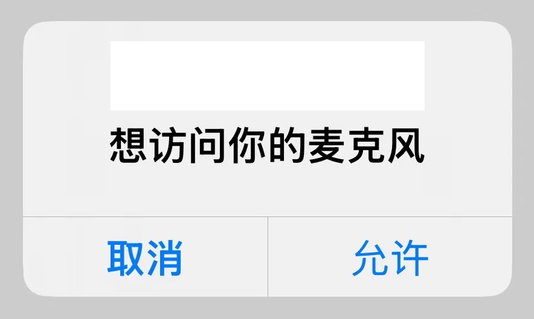
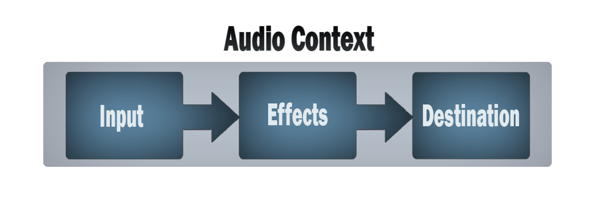

# 手机浏览器录音

今天我们来实现手机浏览器的录音功能，记录用户通过麦克风输入的语音，转存为音频文件，然后进行语言播放、语言聊天或者语言识别等。

## 获取麦克风权限

通过 [`navigator.mediaDevices`](https://developer.mozilla.org/en-US/docs/Web/API/Navigator/mediaDevices) 属性的 [`getUserMedia()`](https://developer.mozilla.org/en-US/docs/Web/API/MediaDevices/getUserMedia) 方法，请求获取麦克风权限。如果用户同意，将返回一个 [`MediaStream`](https://developer.mozilla.org/en-US/docs/Web/API/MediaStream) 对象 resolve promise，如果用户拒绝将返回 `NotAllowedError` 的 reject promise。

```js
const stream = await navigator.mediaDevices.getUserMedia({
  audio: true,
});
```



## 开启 HTTPS

如果你在 HTTP 服务里运行上面的代码，程序将报错，因为在 HTTP 服务里 `navigator.mediaDevices` 为 `undefined`。从 MDN 文档得知，[`MediaDevices`](https://developer.mozilla.org/en-US/docs/Web/API/MediaDevices/getUserMedia) 只能用于 HTTPS 服务

> [!NOTE]
>
> **Secure context:** This feature is available only in [secure contexts](https://developer.mozilla.org/en-US/docs/Web/Security/Secure_Contexts) (HTTPS), in some or all [supporting browsers](https://developer.mozilla.org/en-US/docs/Web/API/MediaDevices/getUserMedia#browser_compatibility).

所以我们首先需要开启 HTTPS 服务。我这个 demo 是使用 [`http-server`](https://github.com/http-party/http-server) 开启一个 HTTP 服务，[`http-server`](https://github.com/http-party/http-server) 也可以开启一个 [HTTPS 服务](https://github.com/http-party/http-server?tab=readme-ov-file#tlsssl)，只需要一个 SSL 证书即可。申请 SSL 证书有很多种方法

- 去证书颁发机构申请证书，[Let’s Encrypt](https://letsencrypt.org/)、[ZeroSSL](https://zerossl.com) 和 [Cloudflare](https://www.cloudflare.com/) 是免费的证书颁发机构，适用于开发环境和生产环境，但是需要域名
- 使用工具生成本地证书，这样的工具有 [`mkcert`](https://github.com/FiloSottile/mkcert)、[`openssl`](https://github.com/openssl/openssl) 和 [`caddy`](https://github.com/caddyserver/caddy)

因为我是本地开启 HTTPS 服务，没有域名，同时需要手机端也正常访问，所以我使用 `mkcert` 生成 SSL 证书

### `mkcert`

#### 安装

```sh
$ brew install mkcert
```

#### 在系统中安装本地证书颁发机构

```sh
$ mkcert -install
```

#### 生成证书

```sh
$ mkcert -cert-file cert.pem -key-file key.pem 192.168.0.102

# Created a new certificate valid for the following names 📜
#  - "192.168.0.102"
# The certificate is at "cert.pem" and the key at "key.pem" ✅
```

#### 手机安装根证书

##### 获取 mkcert 的根证书

```sh
$ mkcert -CAROOT

# ~/Library/Application Support/mkcert
```

该命令会输出一个路径，例如 `~/Library/Application Support/mkcert`

在这个路径下，你可以找到根证书文件，通常是 `rootCA.pem`。

##### 将根证书导入到 iPhone

将根证书 `rootCA.pem` 导入到 iPhone

##### 安装证书

在 iPhone 上点击 `rootCA.pem`  文件，并完成安装步骤。

##### 信任根证书

安装证书后，还需要将其标记为信任：

1. 打开 iPhone 的 **设置**
2.  进入 **通用 > 关于本机 > 证书信任设置**
3. 找到刚安装的证书，启用对该证书的完全信任

### `http-server`

生成并安装证书之后就可以开启 HTTPS 服务了

```sh
$ http-server -S -C cert.pem

# https://192.168.0.102:8080
```

在手机端输入 https://192.168.0.102:8080，就可以访问 HTTPS 服务了

其它开启 http 服务的工具，也是一样的，添加 SSL 证书就可以开启 HTTPS 服务。有些工具甚至带有自动生成证书的能力，比如 [`webpack-dev-server`](https://webpack.js.org/configuration/dev-server/#devserverserver)、 [UmiJS](https://umijs.org/docs/api/config#https)，详细配置请参他们的官方文档。

## 录音

使用 [`MediaRecorder`](https://developer.mozilla.org/en-US/docs/Web/API/MediaRecorder) 实现录音功能，[`MediaRecorder`](https://developer.mozilla.org/en-US/docs/Web/API/MediaRecorder) 的构造函数需要一个  [`MediaStream`](https://developer.mozilla.org/en-US/docs/Web/API/MediaStream) 对象，这个对象可以是上面通过 `navigator.mediaDevices.getUserMedia()` 方法获取的，也可以通过 [`HTMLCanvasElement.captureStream()`](https://developer.mozilla.org/en-US/docs/Web/API/HTMLCanvasElement/captureStream) 方法和 [`HTMLMediaElement.captureStream()`](https://developer.mozilla.org/en-US/docs/Web/API/HTMLMediaElement/captureStream) 方法获取。[`MediaRecorder`](https://developer.mozilla.org/en-US/docs/Web/API/MediaRecorder) 的构造函数还有一个可选的 `options` 对象，提供一些配置选项，比如媒体格式的 MIME 类型（`mimeType`）或者比特率（`bitsPerSecond`）。

```js
new MediaRecorder(stream, options)
```

调用 `MediaRecorder` 的 `start()` 方法开始录音，当 MediaRecorder 将媒体数据传递给应用程序时，MediaRecorder 的 `dataavailable` 事件就被触发。这是一个 [`BlobEvent`](https://developer.mozilla.org/en-US/docs/Web/API/BlobEvent) 类型的事件，它的 data 属性一个 [`Blob`](https://developer.mozilla.org/zh-CN/docs/Web/API/Blob) 对象，表示录制的媒体资源数据

调用 `MediaRecorder` 的 `stop()` 方法停止录音。调用 `pause()` 方法和 `resume()` 方法暂停和恢复录音。

静态方法 `isTypeSupported()` 判断浏览器是否支持某种 MIME 格式。

下面是录制音频的一个列子

```js
let audioChunks = [];
let mediaRecorder
// 开始录音
function startRecording() {
  try {
    
    // 判断浏览器是否支持录音
    if (!navigator.mediaDevices) {
      alert('浏览器不支持录音！');
      return;
    }
    
    // 请求麦克风权限
    const stream = await navigator.mediaDevices.getUserMedia({
      audio: true,
    });

    // 动态检测支持的音频格式
    let audioType = '';
    if (MediaRecorder.isTypeSupported('audio/webm')) {
      audioType = 'audio/webm';
    } else if (MediaRecorder.isTypeSupported('audio/mp4')) {
      audioType = 'audio/mp4';
    } else {
      alert('浏览器不支持录音！');
      return;
    }
    
    // 清空 chunk
    audioChunks = []

    // 初始化 MediaRecorder
    mediaRecorder = new MediaRecorder(stream, { mimeType: audioType });
    mediaRecorder.start();
    
    // 收集录音数据
    mediaRecorder.addEventListener("dataavailable", (event) => {
      audioChunks.push(event.data);
    });
    
    // 录音结束时，生成 Blob
    mediaRecorder.addEventListener("stop", () => {
      // 将音频数据块转换为 Blob
      const audioBlob = new Blob(audioChunks, { type: audioType });
      // 生成音频 URL
      const audioUrl = URL.createObjectURL(audioBlob);
      // 设置音频 URL 为 <audio> 的播放源
      // audioElement.src = audioUrl;
    });
  } catch (error) {
    console.error("无法访问麦克风:", error);
  }
}

// 停止录音
function stopRecording() {
  if (mediaRecorder && mediaRecorder.state === "recording") {
    mediaRecorder.stop();
  }
}
```

## 设置采样率和单通道

录音之后进行语音识别，讯飞的语言识别功能要求采样率 16000 Hz 和单通道

### 比特率  VS 采样率

创建 `MediaRecorder` 时，有一个 [`audiobitspersecond`](https://developer.mozilla.org/en-US/docs/Web/API/MediaRecorder/MediaRecorder#audiobitspersecond) 和 [`bitspersecond`](https://developer.mozilla.org/en-US/docs/Web/API/MediaRecorder/MediaRecorder#bitspersecond) 选项，表示媒体组件的比特率（bitrate）。那比特率和采样率的区别是什么呢？它们是同一个东西吗？答案是否定的，它们不是同一个东西

- 比特率，表示每秒钟传输的比特数（bit），是衡量数据传输速度的指标，通常以每秒比特数（bps）、千比特每秒（kbps）来衡量。**音频文件的比特率决定了其音质和文件大小**，例如，一个 128 kbps 的 MP3 文件每秒包含 128,000 比特的音频数据。
- 采样率，这是每秒从模拟信号中捕获的样本数量，通常以千赫兹（kHz）为单位。音频采样率是指录音设备在一秒钟内对声音信号的采样次数，采样频率越高声音的还原就越真实越自然。换句话说：**采样率越高，次数就越多，存的数据就越精细。**

那要怎么修改采样率呢？`MediaRecorder` 并没有提供设置采样率的 API，这里就需要使用 [Web Audio API](https://developer.mozilla.org/en-US/docs/Web/API/Web_Audio_API) 和 [`AudioContext`](https://developer.mozilla.org/en-US/docs/Web/API/AudioContext) 处理 `MediaStream`

### Web Audio API

[Web Audio API](https://developer.mozilla.org/en-US/docs/Web/API/Web_Audio_API) 的一般工作流程如下：

1. 创建一个 [`AudioContext`](https://developer.mozilla.org/en-US/docs/Web/API/AudioContext) 音频上下文
2. 在音频上下文里，创建音频源（Sources），比如 [`createMediaStreamSource()`](https://developer.mozilla.org/en-US/docs/Web/API/AudioContext/createMediaStreamSource) 方法
3. 创建音效节点（Effects），如混响，过滤器、音道合并等，比如 [`createChannelMerger()`](https://developer.mozilla.org/en-US/docs/Web/API/BaseAudioContext/createChannelMerger) 方法
4. 选择音频输出的目的地（Destination），比如设备扬声器
5. 将音频源连接到音效节点，再将音效节点连接到目的地。



### `AudioContext`

`AudioContext` 代表了一个由音频模块链接而成的音频处理图，其中每个音频模块由 [`AudioNode`](https://developer.mozilla.org/zh-CN/docs/Web/API/AudioNode) 表示

```js
new AudioContext(options)
```

`AudioContext` 的构造函数有一个可选的 `options` 对象，其中 [`samplerate`](https://developer.mozilla.org/en-US/docs/Web/API/AudioContext/AudioContext#samplerate) 可以设置采样率

[`createMediaStreamSource()`](https://developer.mozilla.org/en-US/docs/Web/API/AudioContext/createMediaStreamSource) 方法从 `MediaStream` 创建一个 [`MediaStreamAudioSourceNode`](https://developer.mozilla.org/en-US/docs/Web/API/MediaStreamAudioSourceNode) 对象，是一个从 stream 中获得其媒体的音频节点。

[`createMediaStreamDestination()`](https://developer.mozilla.org/en-US/docs/Web/API/AudioContext/createMediaStreamDestination) 方法从创建一个 [`MediaStreamAudioDestinationNode`](https://developer.mozilla.org/en-US/docs/Web/API/MediaStreamAudioDestinationNode) 对象，代表音频目的地，它的 [`stream`](https://developer.mozilla.org/en-US/docs/Web/API/MediaStreamAudioDestinationNode/stream) 属性是一个包含单个音频[`MediaStreamTrack`](https://developer.mozilla.org/en-US/docs/Web/API/MediaStreamTrack) 的 `MediaStream`，您可以使用此属性从音频图形中获取流。

[`BaseAudioContext`](https://developer.mozilla.org/en-US/docs/Web/API/BaseAudioContext)（`AudioContext` 继承 `BaseAudioContext`）的 [`createChannelMerger()`](https://developer.mozilla.org/en-US/docs/Web/API/BaseAudioContext/createChannelMerger) 方法创建了一个[`ChannelMergerNode`](https://developer.mozilla.org/en-US/docs/Web/API/ChannelMergerNode)，它将多个音频流中的通道合并为单个音频流。

[`AudioNode`](https://developer.mozilla.org/en-US/docs/Web/API/AudioNode) 接口的 [`connect()`](https://developer.mozilla.org/en-US/docs/Web/API/AudioNode/connect) 方法将节点的输出连接到另一个目标上。

实现采样率 16000 Hz 和单通道

```js
function startRecording() {
  try {
    // 获取麦克风输入流
    const stream = await navigator.mediaDevices.getUserMedia({ audio: true });

    // 创建 AudioContext
    audioContext = new AudioContext({ sampleRate: 16000 }); // 设置目标采样率
    const source = audioContext.createMediaStreamSource(stream);

    // 创建单声道处理器
    const channelMerger = audioContext.createChannelMerger(1);

    // 连接音频流到单声道处理器
    source.connect(channelMerger);

    // 创建目标音频流
    mediaStreamDestination = audioContext.createMediaStreamDestination();
    channelMerger.connect(mediaStreamDestination);

    // 初始化 MediaRecorder
    mediaRecorder = new MediaRecorder(mediaStreamDestination.stream);
    mediaRecorder.start();
  } catch(error) {
    console.error("无法访问麦克风:", error);
  }
}
```

## References

- [MediaStream Recording API](https://developer.mozilla.org/en-US/docs/Web/API/MediaStream_Recording_API)
- [Web Audio API](https://developer.mozilla.org/en-US/docs/Web/API/Web_Audio_API)
- [Using the MediaStream Recording API](https://developer.mozilla.org/en-US/docs/Web/API/MediaStream_Recording_API/Using_the_MediaStream_Recording_API)
- [Recording a media element](https://developer.mozilla.org/en-US/docs/Web/API/MediaStream_Recording_API/Recording_a_media_element)
- [Media Capture and Streams API](https://developer.mozilla.org/en-US/docs/Web/API/Media_Capture_and_Streams_API)
- [`MediaDevices`](https://developer.mozilla.org/en-US/docs/Web/API/MediaDevices/getUserMedia)
- [`MediaRecorder`](https://developer.mozilla.org/en-US/docs/Web/API/MediaRecorder)
- [`MediaStream`](https://developer.mozilla.org/en-US/docs/Web/API/MediaStream)
- [`BaseAudioContext`](https://developer.mozilla.org/en-US/docs/Web/API/BaseAudioContext)
- [`AudioContext`](https://developer.mozilla.org/en-US/docs/Web/API/AudioContext)
- [`AudioNode`](https://developer.mozilla.org/en-US/docs/Web/API/AudioNode)
- [`http-party/http-server`](https://github.com/http-party/http-server)
- [`FiloSottile/mkcert`](https://github.com/FiloSottile/mkcert)
- [`mdn/dom-examples`](https://github.com/mdn/dom-examples/blob/main/media/web-dictaphone/scripts/app.js)