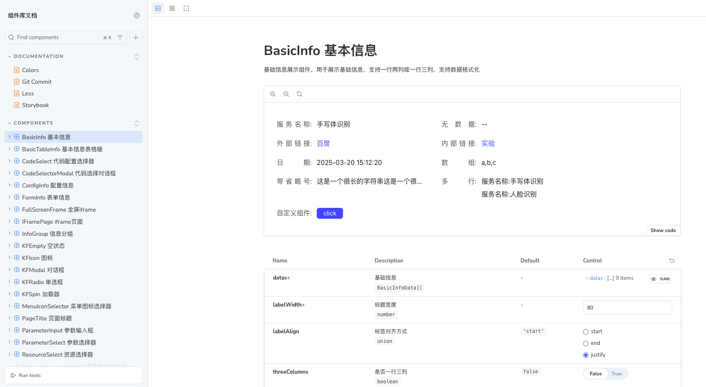
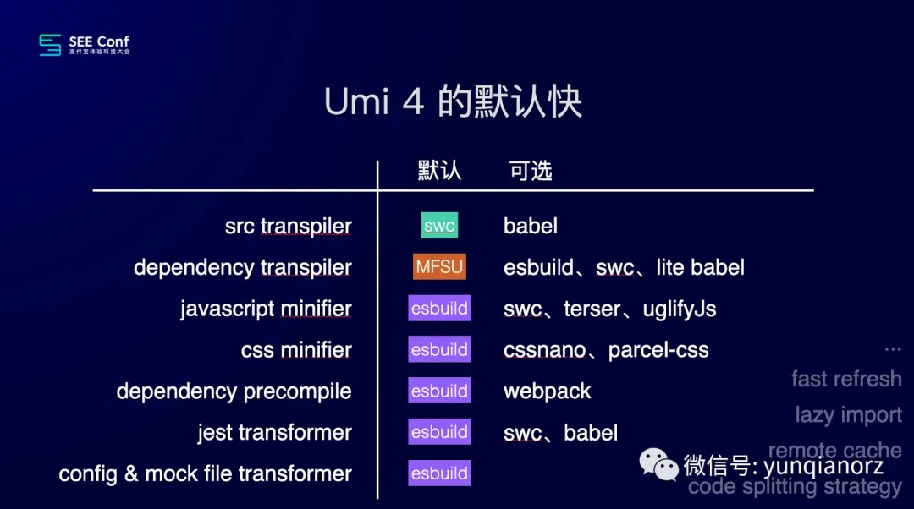
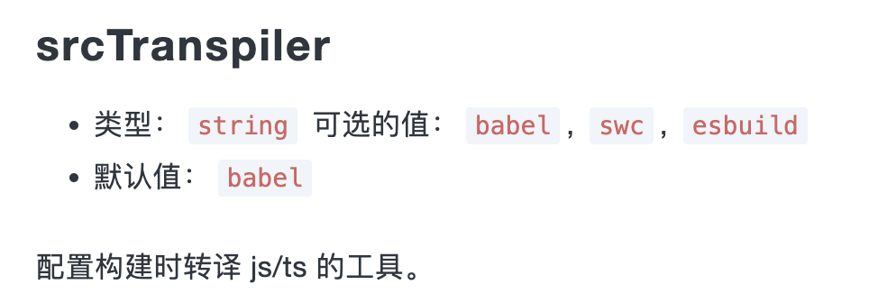
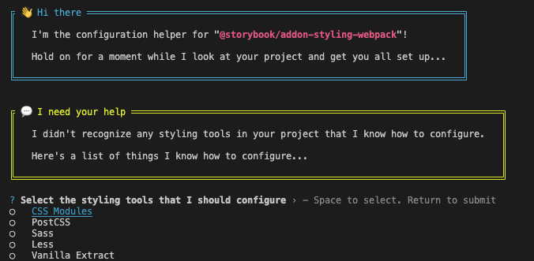
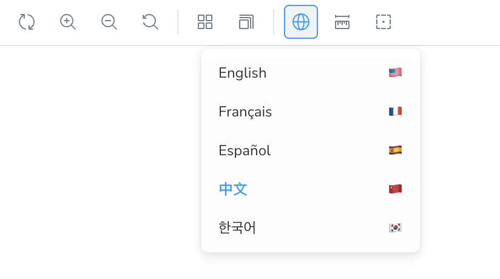
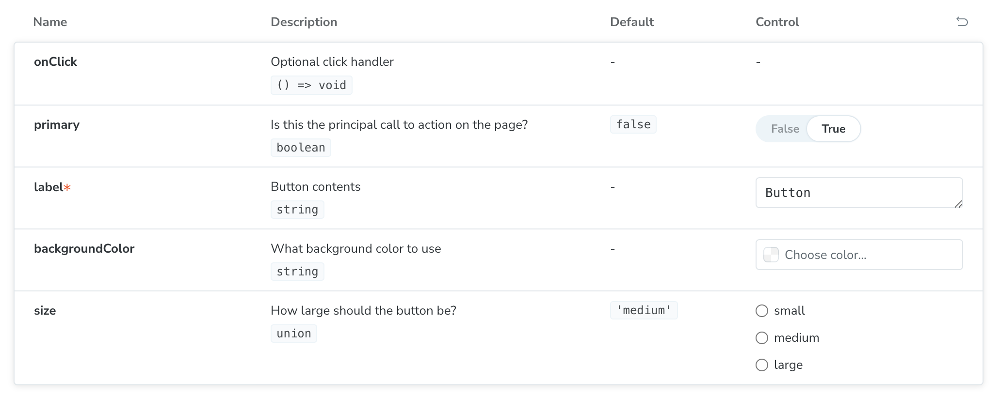
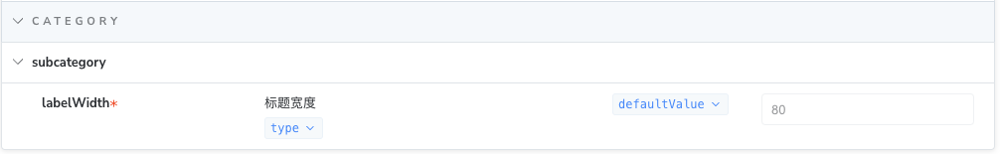

# UmiJS + Storybook 搭建组件库文档

我从 Storybook 6 开始关注 [Storybook](https://storybook.js.org/)，它是一个很好的撰写组件库文档和测试组件的工具。Storybook 号称是零配置，适用于任何现代前端框架。但是外面的世界还是太复杂了，有各种不同技术的组合，比如我最近一直在使用的 [UmiJS 4](https://umijs.org/)，它对各项技术进行了自己的封装。这篇文章我们实现在 UmiJS 工程里使用 Storybook 搭建组件库文档。

> 这是我写的关于 Storybook 的第三篇文章，前两篇分别是
>
> - [Storybook](/2023/01/04/storybook/)，介绍 Storybook
> - [Storybook 搭建组件库文档](/2023/09/02/storybook-in-action)，搭建自己的组件库文档，当时使用是 Webpack 4 + Storybook 6.5
>
> 在我学习 Storybook 的过程中，Storybook 从 6.5 升级到 7.4，再升级到目前最新的 8.5，Storybook 的功能越来越强大，越来越好用。

## 实现效果



## 安装

```sh
$ npx storybook@latest init
```

> 当前版本  8.5.3

Storybook 将根据您的项目依赖，为您提供最佳配置，主要完成：

- 安装依赖包，比如 `@storybook/addon-essentials`
- 添加 script 命令，比如 `"storybook": "storybook dev 6006"`
- 创建配置文件，在 `.storybook` 目录下，有两个文件 `main.(js|ts)` 和 `preview.(js|ts)`
- 创建示例，在 `src/stories` 目录下

Storybook 默认生成的 `main.ts` 如下：

```ts
// .storybook/main.ts
import type { StorybookConfig } from '@storybook/react-webpack5';

const config: StorybookConfig = {
  stories: ['../src/**/*.mdx', '../src/**/*.stories.@(js|jsx|mjs|ts|tsx)'],
  addons: [
    '@storybook/addon-webpack5-compiler-swc',
    '@storybook/addon-onboarding',
    '@storybook/addon-essentials',
    '@chromatic-com/storybook',
    '@storybook/addon-interactions'
  ],
  framework: {
    name: '@storybook/react-webpack5',
    options: {},
  }
};
export default config;
```

- `stories`，定义哪些文件是 story
- `addons`，使用哪些插件，Storybook 是基于插件工作的。这里注意一下 `@storybook/addon-webpack5-compiler-swc` addon，后面有讲到。
- `framework`，Storybook 使用的构建工具，因为我们使用的是 React + Webpack 5，所以这里使用的是 `@storybook/react-webpack5`

后面我们可以添加更多的 `addons` 以及添加 Webpack 等配置。

Storybook 默认生成的 `preview.ts` 如下：

```ts
// .storybook/preview.ts
import type { Preview } from '@storybook/react';

const preview: Preview = {
  parameters: {
    controls: {
      matchers: {
        color: /(background|color)$/i,
        date: /Date$/i,
      },
    },
  },
};

export default preview;
```

这里定义了一个全局的参数配置，参数名带有 `background` 或 `color` 的使用颜色选择器控件，参数名带有 `date` 的使用日期选择器控件，后面我们还可以参加更多的参数配置，以及全局 Args、Decorators、Loaders 等 

## JavaScript 编译器

UmiJS 的技术栈是 React + Webpack 5 + TS + Less，但是不确定 JavaScript 编译器用的 Babel 还是 SWC？

这篇文章 [SEE Conf: Umi 4 设计思路文字稿](https://mp.weixin.qq.com/s?__biz=MjM5NDgyODI4MQ==&mid=2247484533&idx=1&sn=9b15a67b88ebc95476fce1798eb49146&chksm=a6809ee391f717f5e2c2242ed313ecccc49897b101602e3358085c6a6b2393d54424fc52eb46&scene=21#wechat_redirect) 说 JavaScript 编译器用的是 SWC



但是 [UmiJS 的文档](https://umijs.org/docs/api/config#srctranspiler) 上写的是 Babel。



 JavaScript 编译器关系到 [Storybook 使用哪个编译器](https://storybook.js.org/docs/builders/webpack#compiler-support)。如果您的项目使用的是 SWC，则使用 [`@storybook/addon-webpack5-compiler-swc`](https://storybook.js.org/addons/@storybook/addon-webpack5-compiler-swc) 插件，如果使用的是 Babel，则使用 [`@storybook/addon-webpack5-compiler-babel`](https://storybook.js.org/addons/@storybook/addon-webpack5-compiler-babel) 插件

从上面 Storybook 默认生成的 `main.ts` 中我们可以看到，Storybook 以为 UmiJS 使用的是 SWC。其实根据我的研究，UmiJS 应该使用的是 Babel。

> 我也不能确定，因此我在 Umi 的 GitHub 的代码库里提了一个问题：[请问 UMI 默认使用的 JavaScript 编译器是 Babel 还是 SWC](https://github.com/umijs/umi/discussions/12918)，期待他们的回复。

因此需要安装 [`@storybook/addon-webpack5-compiler-babel`](https://storybook.js.org/addons/@storybook/addon-webpack5-compiler-babel) 插件，卸载 [`@storybook/addon-webpack5-compiler-swc`](https://storybook.js.org/addons/@storybook/addon-webpack5-compiler-swc) 插件

```sh
$ npx storybook@latest add @storybook/addon-webpack5-compiler-babel
$ npx storybook@latest remove @storybook/addon-webpack5-compiler-swc
```

修改配置

```diff
// .storybook/main.ts
const config: StorybookConfig = {
  addons: [
-    '@storybook/addon-webpack5-compiler-swc',
+    '@storybook/addon-webpack5-compiler-babel',
  ],
};
```

## Typescript

不知道是不是 UmiJS 隐藏了对 Typescript 文件的处理，Storybook 无法编译 Typescript 文件，所以我们只能修改 Webpack 配置，添加 TS 文件的处理 rule。

```sh
$ npm i typescript ts-loader -D 
```

```ts
import type { StorybookConfig } from '@storybook/react-webpack5';
import path from 'path';
import webpack from 'webpack';

const config: StorybookConfig = {
  webpackFinal: async (config) => {
    if (config.module && config.module.rules) {
      config.module.rules.push(
        {
          test: /\.(tsx?|jsx?)$/,
          loader: 'ts-loader',
          options: {
            transpileOnly: true,
          },
          include: [
            // 限制范围，避免处理 node_modules
            path.resolve(__dirname, '../src'), 
            path.resolve(__dirname, './'),
          ],
        },
      );
    }
    return config;
  },
};
export default config;
```

## 样式

前端处理样式的工具有很多，比如 Sass、Less、Tailwind、Styled Components 等。对于大部分工具 Storybook 都提供了相应插件来处理，详情请查看 [Render Component styles](https://storybook.js.org/docs/get-started/setup#render-component-styles)。

UmiJS 使用的 [`Less`](https://lesscss.org/) + [`CSS Modules`](https://github.com/css-modules/css-modules)。Storybook 提供了[`@storybook/addon-styling-webpack`](https://storybook.js.org/addons/@storybook/addon-styling-webpack) 插件。

### `@storybook/addon-styling-webpack`

**安装**

```sh
$ npx storybook@latest add @storybook/addon-styling-webpack
```

它将在 `main.ts` 的 `addons` 中添加 `@storybook/addon-styling-webpack`，并且自动运行 `npx @storybook/auto-config styling`，这是一个 codemod 包，它将尝试检测项目中的样式工具并进行相应地配置。

安装完成之后，运行 Storybook 还是失败（我就是这种情况），可以手动运行

```sh
$ npx @storybook/auto-config styling
```
它会引导我们选择哪个工具、安装相应的依赖



**安装依赖（如果项目中没有）**

```sh
$ npm i less less-loader style-loader css-loader -D
```

**配置**

```ts
// main.ts
import type { StorybookConfig } from '@storybook/react-webpack5';

const config: StorybookConfig = { 
  addons: [
    // 其它 addons
    '@storybook/addon-styling-webpack',
    {
      name: '@storybook/addon-styling-webpack',
      options: {
        rules: [
          {
            test: /\.less$/,
            use: [
              'style-loader',
              {
                loader: 'css-loader',
                options: {
                  modules: { // CSS Modules
                    localIdentName: '[name]__[local]--[hash:base64:5]',
                  },
                },
              },
              {
                loader: 'less-loader',
                options: {
                  lessOptions: {
                    javascriptEnabled: true, // 如果需要支持 Ant Design 的 Less 变量，开启此项
                    modifyVars: {
                      hack: 'true; @import "@/styles/theme.less";',  // 添加主题变量文件
                    },
                  },
                },
              },
            ],
            include: path.resolve(__dirname, '../src'), // 限制范围，避免处理 node_modules
          },
        ],
      },
    },
  ]
}
```

### 修改 Webpack 配置

除了使用 `@storybook/addon-styling-webpack` 之外，也可以直接修改 [Webpack](https://storybook.js.org/docs/builders/webpack#override-the-default-configuration)。

**安装依赖（如果项目中没有）**

```sh
$ npm i less less-loader style-loader css-loader -D
```
**配置**

```ts
// main.ts
import type { StorybookConfig } from '@storybook/react-webpack5';

const config: StorybookConfig = {
  webpackFinal: async (config) => {
    if (config.module && config.module.rules) {
      config.module.rules.push({
        test: /\.less$/,
        use: [
          'style-loader',
          {
            loader: 'css-loader',
            options: {
              modules: {
                localIdentName: '[name]__[local]--[hash:base64:5]',
              },
            },
          },
          {
            loader: 'less-loader',
            options: {
              lessOptions: {
                javascriptEnabled: true, // 如果需要支持 Ant Design 的 Less 变量，开启此项
                modifyVars: {
                  hack: 'true; @import "@/styles/theme.less";',
                },
              },
            },
          },
        ],
        include: path.resolve(__dirname, '../src'), // 限制范围，避免处理 node_modules
      });
    }
    if (config.plugins) {
      config.plugins.push(
        new webpack.ProvidePlugin({
          React: 'react', // 全局注入 React
        }),
      );
    }

    return config;
  },
}
```

### CSS Modules

在配置 CSS Modules 时，我踩了一下坑，不管问 ChatGPT 还是网上的很多答案都是

```js {9}
config.module.rules.push({
  test: /\.less$/,
  use: [
    'style-loader',
    {
      loader: 'css-loader',
      options: {
        modules: {
          auto: true, // 启用 CSS Modules
          localIdentName: '[local]--[hash:base64:5]', // 自定义类名生成规则
        },
      },
    },
    'less-loader',
  ],
});
```

但是没有实现 CSS Modules，问题出在 **`auto: true`**。在 [`css-loader`](https://github.com/webpack-contrib/css-loader?tab=readme-ov-file#auto)（目前最新版本是 v7.1.2）中，`auto: true` 表示只有 `xxx.module.less` 或者 `xxx..icss.less` 才开启 CSS Modules。导致 `import styles from "./index.less"` 时 `styles` 为 `undefined`。而在我们的项目中，没有使用 `xxx.module.less` 这种命名规则，因此正确做法应该是设置 `auto: undefined`，或者使用 `RegExp` / `function`。

> - `undefined` - enable CSS modules for all files.
> - `true` - enable CSS modules for all files matching `/\.module\.\w+$/i.test(filename)` and `/\.icss\.\w+$/i.test(filename)` regexp.
> - `false` - disables CSS Modules.
> - `RegExp` - enable CSS modules for all files matching `/RegExp/i.test(filename)` regexp.
> - `function` - enable CSS Modules for files based on the filename satisfying your filter function check.

但是设置 `auto: undefined` 也有问题，从上面的参数说明就知道，它会把所有的 less 文件都转换成 CSS Modules。但是我们项目中的一些公共样式、组件样式是不需要装换成 CSS Modules。比如：

```js
import "@/styles/global.less"
```

只有这种情况下才需要转换成 CSS Modules

```js
import styles from "./index.less"
```

因此在不改动原项目配置的情况下，最好的做法是使用 `RegExp` / `function`，比如

```js
{
  loader: 'css-loader',
  options: {
    modules: {
      auto: (resourcePath: string) => {
        if (resourcePath.includes('/src/pages/')) {
          return true;
        } else {
          return false;
        }
      },
      localIdentName: '[local]___[hash:base64:5]',
    },
  },
},
```

但是我们在使用 UmiJS 的开发过程中，是不需要关系这个的，比如：

```js
import styles from "./index.less" // 转换成 CSS Modules
import "./index.less"             // 不转换成 CSS Modules
```

它是怎么做到的呢？

其实 UmiJS 帮我们完成了一些功能：

- 首先，通过 [`autoCssModulesHandler`](https://github.com/umijs/umi/blob/master/packages/mfsu/src/esbuildHandlers/autoCssModules.ts) 函数将 `import styles from "./index.less"` 转换成 `import styles from "./index.less?modules"`。
- 然后，通过 Webpack 的 [`resourceQuery`](https://webpack.js.org/configuration/module/#ruleresourcequery) 功能，添加一个 [`css-modules`](https://github.com/umijs/umi/blob/master/packages/bundler-webpack/src/config/cssRules.ts) 的 rule。类似于下面的配置：

```js
rules: [
  {
    test: /\.less$/,
    oneOf: [
      {
        resourceQuery: /modules/, // 只有 `?modules` 时才启用 CSS Modules
        use: [
          'style-loader',
          {
            loader: 'css-loader',
            options: {
              modules: {
                localIdentName: '[local]___[hash:base64:5]',
              },
            },
          },
          'less-loader',
        ],
      },
      {
        use: ['style-loader', 'css-loader', 'less-loader'], // 默认不使用 CSS Modules
      },
    ],
  },
],
```

我们也可以仿照这个，在 Storybook 里实现相同的功能，首先定义一个 Babel 插件

```js
// babel-plugin-auto-css-modules
export default function(babel) {
  const { types: t } = babel;
  return {
    visitor: {
      ImportDeclaration(path) {
        const source = path.node.source.value;
        if (source.endsWith('.less')) {
          if (path.node.specifiers.length > 0) {
            path.node.source.value += "?modules";
          }
        }
      },
    },
  };
};
```

再配置 Babel

```json
// .babelrc
{
  "plugins": ["./babel-plugin-auto-css-modules.js"]
}
```

需要注意的是 `.babelrc` 必须放在项目根目录下，放在 `.storybook` 目录下处理只处理 `.storybook` 目录下文件。如果不想影响原项目，可以在 `main.ts` 添加 `babel` 选项。

```ts
// main.ts
import type { StorybookConfig } from '@storybook/react-webpack5';

const config: StorybookConfig = {	
	babel: async (config: any) => {
    if (!config.plugins) {
      config.plugins = [];
    }

    config.plugins.push(path.resolve(__dirname, './babel-plugin-auto-css-modules.js'));
    return config;
  },
}
```

最后修改 Storybook 的 webpack 配置

```ts
config.module.rules.push(
  {
    test: /\.less$/,
    oneOf: [
      {
        resourceQuery: /modules/,
        use: [
          'style-loader',
          {
            loader: 'css-loader',
            options: {
              importLoaders: 1,
              import: true,
              esModule: true,
              modules: {
                localIdentName: '[local]___[hash:base64:5]',
              },
            },
          },
          {
            loader: 'less-loader',
            options: {
              lessOptions: {
                javascriptEnabled: true, // 如果需要支持 Ant Design 的 Less 变量，开启此项
                modifyVars: {
                  hack: 'true; @import "@/styles/theme.less";',
                },
              },
            },
          },
        ],
        include: path.resolve(__dirname, '../src'), // 限制范围，避免处理 node_modules
      },
      {
        use: [
          'style-loader',
          'css-loader',
          {
            loader: 'less-loader',
            options: {
              lessOptions: {
                javascriptEnabled: true, // 如果需要支持 Ant Design 的 Less 变量，开启此项
                modifyVars: {
                  hack: 'true; @import "@/styles/theme.less";',
                },
              },
            },
          },
        ],
        include: path.resolve(__dirname, '../src'), // 限制范围，避免处理 node_modules
      },
    ],
  },
);
```

## Mock Modules

当我的组件使用 `umi` 或者 `@umijs/max` 时，比如 `import { Link  } from "@umijs/max"`，Storybook 编译报错，推测原因是 **UmiJS 的某些模块依赖了 Node.js 环境**，而 Storybook 运行在浏览器中，无法解析这些模块。咨询了 ChatGPT 和 deepseek，未能解决。这个问题困扰了我很久，突然我想到一个方法，Mock 这些模块不就好了吗？

> 要想解决 Storybook 引入 `@umijs/max` 编译报错的问题，需要研究一下 `@umijs/max` 的内部实现，以后有时间再研究

[Mock 外部模块](https://storybook.js.org/docs/writing-stories/mocking-data-and-modules/mocking-modules#mock-files-for-external-modules)，Storybook 推荐的方法是创建一个本地文件，引入外部模块，

```js
// src/lib/umijs.ts
import { Link } from '@umijs/max'

export const umiLink = Link
```

再创建一个 mock 文件

```js
// src/lib/umijs.mock.ts
import { fn } from '@storybook/test';
import * as actual from './uuid';
export const umiLink = fn(actual.umiLink).mockName('umiLink');
```

然后添加 [aliase](https://storybook.js.org/docs/writing-stories/mocking-data-and-modules/mocking-modules#builder-aliases)

```ts
// .storybook/main.ts
webpackFinal: async (config) => {
  if (config.resolve) {
    config.resolve.alias = {
      ...config.resolve.alias,
      '@': path.resolve(__dirname, '../src'),
      '@lib/umijs': path.resolve(__dirname, '../src/lib./umijs.mock.ts'),
    };
  }
  
  return config
}
```

最后在 story 文件里，实现 mock 模块功能

```tsx
// Replace your-renderer with the name of your renderer (e.g. react, vue3)
import type { Meta, StoryObj } from '@storybook/your-renderer';
 
// 👇 Must include the `.mock` portion of filename to have mocks typed correctly
import { Link } from '@lib/umijs.mock';
 
import BasicInfo from './BasicInfo';
 
const meta: Meta<typeof Page> = {
  component: BasicInfo,
};
export default meta;
 
type Story = StoryObj<typeof BasicInfo>;
 
export const Default: Story = {
  async beforeEach() {
    Link.mockImplementation(({ to, children, ...props }: any) => (
      <a href={typeof to === 'string' ? to : '#'} {...props}>
        {children}
      </a>
    );
  },
};
```

但是这个方法需要修改原项目代码，修改原项目的 webpack 配置。

```diff
- import { Link } from '@umijs/max'
+ import { Link } from '@lib/umijs'
```

我们使用 Storybook 的原则是尽量不动原项目的代码和配置，因此可以这么做：

1. 首先在 `.storybook` 的目录下创建一个 `mock` 目录，里面再创建各种 `mock` 文件，比如 `umijs.tsx`

```tsx
// .storybook/mock/umijs.tsx

export const Link = ({ to, children, ...props }: any) => (
  <a href={typeof to === 'string' ? to : '#'} {...props}>
    {children}
  </a>
);
```

2. 添加一个 webpack 别名，将 `@umijs/max` 指向创建的 mock 文件

```ts
// .storybook/main.ts
webpackFinal: async (config) => {
  if (config.resolve) {
      config.resolve.alias = {
        ...config.resolve.alias,
        '@': path.resolve(__dirname, '../src'),
        '@umijs/max': path.resolve(__dirname, './mock/umijs.tsx'),
      };
    }
  
  return config
}
```

这样 `import { Link } from '@umijs/max'` 访问的 `Link` 组件，就是 `.storybook/mock/umijs.tsx` 创建的 Link 组件。无需改动原项目代码和配置。同理还有 `import { request } from '@umijs/max'` 等。

## Mock Request

为了模拟各种网络场景，最好的方式 mock request，可以生成不同的数据。Storybook 使用 MSW （我非常喜欢的一个 Mock 工具）来 

[Mocking network requests](https://storybook.js.org/docs/writing-stories/mocking-data-and-modules/mocking-network-requests)。

配置也非常简单：

1. 安装 `MSW` 和 `MSW addon`

```sh
$ npm install msw msw-storybook-addon -D
```

2. 生成 service worker file 

```sh
$ npx msw init public/
```

3. 配置 [`staticDirs`](https://storybook.js.org/docs/api/main-config/main-config-static-dirs) 属性，添加 `public/` 目录

```ts
// .storybook/main.ts
import type { StorybookConfig } from '@storybook/react-webpack5';
 
const config: StorybookConfig = {
  staticDirs: ['../public', '../static'],
};
 
export default config;
```

4. 初始化 `msw-storybook-addon`，添加 `mswLoader`

```ts
// .storybook/preivew.tsx
import { Preview } from '@storybook/your-renderer';
 
import { initialize, mswLoader } from 'msw-storybook-addon';
 
/*
 * Initializes MSW
 * See https://github.com/mswjs/msw-storybook-addon#configuring-msw
 * to learn how to customize it
 */
initialize();
 
const preview: Preview = {
  // ... rest of preview configuration
  loaders: [mswLoader], // 👈 Add the MSW loader to all stories
};
 
export default preview;
```

5. Mock request

可以在 global、component 或者 story 层 mock request

```tsx
import type { Meta, StoryObj } from '@storybook/react-webpack5';
import { http, HttpResponse, delay } from 'msw';
import { MyComponent } from './MyComponent';

const TestData = {
  code: 200,
  message: '操作成功',
  data: {}
}
 
const meta: Meta<typeof MyComponent> = {
  component: MyComponent,
};
                 
export default meta;
type Story = StoryObj<typeof MyComponent>;                

export const MockedSuccess: Story = {
  parameters: {
    msw: {
      handlers: [
        http.get('https://your-restful-endpoint/', () => {
          return HttpResponse.json(TestData);
        }),
      ],
    },
  },
};

export const MockedError: Story = {
  parameters: {
    msw: {
      handlers: [
        http.get('https://your-restful-endpoint', async () => {
          await delay(800);
          return new HttpResponse(null, {
            status: 403,
          });
        }),
      ],
    },
  },
};
```

## 文档

自此，我完成了组件 stories 的编写，接下来我们添加一些文档

### 默认文档

Storybook 会[自动生成组件文档](https://storybook.js.org/docs/writing-docs/autodocs)，Storybook 8.5 通过 [`tags: ['autodocs']`](https://storybook.js.org/docs/writing-stories/tags) 开启这项功能。

```ts
// .storybook/preview.ts
import type { Preview } from '@storybook/your-renderer';
 
const preview: Preview = {
  // ...rest of preview
  //👇 Enables auto-generated documentation for all stories
  tags: ['autodocs'],
};
 
export default preview;
```

如果全局开启了这项功能，但是要取消的单个组件自动生成默认文档，可以配置组件的 `tags: ['!autodocs']` 

```ts
const meta = {
  title: 'Components/Example',
  component: Example,
  tags: ['!autodocs'],
} satisfies Meta<typeof Example>;

export default meta;
```

Storybook 通过 `docs.defaultName` 设置文档在侧边栏导航菜单的名称，默认是 `Docs`

```ts
// .storybook/main.ts
import type { StorybookConfig } from '@storybook/react-webpack5';
 
const config: StorybookConfig = {
  docs: {
    defaultName: 'Documentation',
  },
};
 
export default config;
```

 Storybook 使用一套默认模版生成组件文档，可以通过 `parameters.docs.page` 修改，**只能在 `.storybook/preview.ts` 里设置**

```tsx
// .storybook/preview.ts
import type { Preview } from '@storybook/react';
 
import { Title, Subtitle, Description, Primary, Controls, Stories } from '@storybook/blocks';
 
const preview: Preview = {
  parameters: {
    docs: {
      page: () => (
        <>
          <Title />
          <Subtitle />
          <Description />
          <Primary />
          <Controls />
          <Stories />
        </>
      ),
    },
  },
};
 
export default preview;
```

Storybook 的默认模板差不多就是这样的。

也可以通过 `MDX` 设置文档模板，为了表明 `MDX` 文件是一个文档模板，必须提供带有 `isTemplate` 属性的 `Meta Doc Block`

```markdown
import { Meta, Title, Subtitle, Description, Primary, Controls, Stories } from '@storybook/blocks';

{/*
  * 👇 The isTemplate property is required to tell Storybook that this is a template
  * See https://storybook.js.org/docs/api/doc-blocks/doc-block-meta
  * to learn how to use
*/}

<Meta isTemplate />

# Header
<Title />
<Subtitle />
<Description />

# Default implementation

<Primary />

## Inputs

The component accepts the following inputs (props):

<Controls />

## Additional variations

Listed below are additional variations of the component.

<Stories />
```

然后通过 `parameters.docs.page` 进行配置，**只能在 `.storybook/preview.ts` 里设置**

```tsx
// .storybook/preview.ts
import DocumentationTemplate from './DocumentationTemplate.mdx';
 
export default {
  parameters: {
    docs: {
      page: DocumentationTemplate,
    },
  },
};
```

如果文档内容很多，可以通过 `parameters.docs.toc` 添加内容导航

```tsx
// .storybook/preview.ts
import type { Preview } from '@storybook/react';
 
const preview: Preview = {
  parameters: {
    docs: {
      toc: true, // 👈 Enables the table of contents
    },
  },
};
 
export default preview;
```

### 补充文档

可以通过 [`MDX`](https://storybook.js.org/docs/writing-docs/mdx) 和 [`Meta Doc Block`](https://storybook.js.org/docs/api/doc-blocks/doc-block-meta)，添加组件补充文档，比如组件的使用说明文档

下面是 Modal 组件的使用说明文档 

````markdown
{/* ModalStories.mdx */}
import { Meta, Canvas } from '@storybook/blocks';
import * as ModalStories from "./ModalStories.stories"
 
<Meta of={ModalStories} name="Usage" />
 
# Usage
 
推荐通过 `openAntdModal` 函数打开 `Modal`，打开 -> 处理 -> 关闭，整套代码在同一个地方

```ts
const handleClick = () => {
  const { close } = openAntdModal(Modal, {
  type: ResourceSelectorType.Dataset,
  onOk: (res) => {
    // 处理逻辑
    close();
  },
});
```

 
<Canvas of={ModalStories.OpenByFunction} />
````

注意，如上例所示，必须设置 `Meta Doc Block` 的 [`of`](https://storybook.js.org/docs/api/doc-blocks/doc-block-meta#of) 属性为 CSF 文件的完整导出，才是组件的补充文档。[`name`](https://storybook.js.org/docs/api/doc-blocks/doc-block-meta#name) 属性表示文档在侧边栏导航菜单中的名称。

组件补充文档才能使用 StoryBook 提供的 [`Doc blocks`](https://storybook.js.org/docs/writing-docs/doc-blocks)，比如 [`Stories`](https://storybook.js.org/docs/api/doc-blocks/doc-block-stories)

**我发现一个隐藏规则**，当 MDX 的文件名和 Story 的文件名相同时，如果没有设置 `name` 属性，这个 MDX 文件会被当作组件的默认文档，如果组件自动生成了默认文档（ `tags: ['autodocs']` ），则会出现冲突，导致 Storybook 报错。

如果 MDX 的文件名和 Story 的文件名不同，而 `name` 属性没有设置，这相当于 `name` 被设置为 MDX 的文件名

### 单独文档

除了组件的补充文档之外，我们可能还会添加一些项目文档，比如项目规范，这种成为单独文档，不能使用 StoryBook 提供的 [`Doc blocks`](https://storybook.js.org/docs/writing-docs/doc-blocks)。

单独文档不要设置 `Meta Doc Block` 的 `of` 属性，可以设置 [`title`](https://storybook.js.org/docs/api/doc-blocks/doc-block-meta#title) 属性，这个属性和 Story 的 title 属性一样，指示文档在菜单栏中的位置。也可以不使用 `Meta Doc Block` ，通过文件的目录结构表示文档在菜单栏中的位置

举个例子，下面是我写的 CSS 规范，使用 `Meta Doc Block` 的 `title` 属性，指示其在菜单栏中的位置

```markdown
import { Meta, Controls } from '@storybook/blocks';

<Meta title="Documentation/CSS" />

# CSS 规范

## BEM

类名遵循 [BEM - Block, Element, Modifier](https://getbem.com/) 规范

### Block

有意义的独立实体，Block 的类名由小写字母、数字和横线组成，比如 `model`、`form`、`paramneter-input`

### Element

块的一部分，Element 的类名由 `Block 的类名` + `双下划线（__）` + `Element 的名称` 组成，比如 `model__title`、`form__input`、`paramneter-input__content`

### Modifier

块或元素的变种，Modifier 的类名由 `Block 的类名` 或者 `Element 的类名` + `双横线（--）` + `Modifier 的名称` 组成，比如 `button--active`、`form--large`
```

## 自定义主题

Storybook 8.5 的[自定义主题](https://storybook.js.org/docs/configure/user-interface/theming)与[之前的](/2023/09/02/storybook-in-action/#主题)有些许改变，使用 `@storybook/manager-api` 代替 `@storybook/addons`

1. 首先安装 `@storybook/manager-api` 和 `@storybook/theming`

```sh
yarn add --dev @storybook/addons @storybook/theming
```

2. 然后创建主题，包括标题，logo，点击 logo 的跳转URL

```js
// .storybook/theme.ts

import { create } from '@storybook/theming';
import Logo from './logo.png';

export default create({
  base: 'light',
  brandTitle: '组件库文档',
  brandImage: Logo,
  brandUrl: 'https://storybook.js.org/docs',
  brandTarget: '_blank',
});
```

3. 最后添加新创建的主题

```js
// .storybook/manager.ts

import { addons } from '@storybook/manager-api';
import theme from './theme';

addons.setConfig({
  theme: theme,
});
```

## Addons 配置详解

### Essential Addons

[Essential addons](https://storybook.js.org/docs/essentials) 包括 10 个 Storybook 核心插件

- [Actions](https://storybook.js.org/docs/essentials/actions)
- [Backgrounds](https://storybook.js.org/docs/essentials/backgrounds)
- [Controls](https://storybook.js.org/docs/essentials/controls)
- [Docs](https://storybook.js.org/docs/writing-docs)
- [Highlight](https://storybook.js.org/docs/essentials/highlight)
- [Measure & Outline](https://storybook.js.org/docs/essentials/measure-and-outline)
- [Toolbars & Globals](https://storybook.js.org/docs/essentials/toolbars-and-globals)
- [Viewport](https://storybook.js.org/docs/essentials/viewport)

#### Actions

Actions 插件用于显示 stories 中事件处理程序（回调函数）接收的数据。

通过 `@storybook/test` 的 `fn` 函数 mock 组件方法，将日志打印在 `Actions` 面板上

```ts
import type { Meta } from '@storybook/react-webpack5';
import { fn } from '@storybook/test';
 
import { Button } from './Button';
 
const meta: Meta<typeof Button> = {
  component: Button,
  // 👇 Use `fn` to spy on the onClick arg, which will appear in the actions panel once invoked
  args: { onClick: fn() },
};
 
export default meta;
```

但是这个方法只对 `args` 有用，手动调用需要使用 [`action`](https://storybook.js.org/docs/essentials/actions#action)

```tsx
import { action } from '@storybook/addon-actions';
export const InForm: Story = {
  render: () => {
    return (
      <Form onFinish={action('onFinish')}>
        <Button htmlType="submit" type="primary">
          提交
        </Button>
      </Form>
    );
  },
};
```

Actions 通过 `parameters.actions` 进行配置

```ts
// .storybook/preview.ts
import type { Preview } from '@storybook/react';
 
const preview: Preview = {
  parameters: {
    actions: {
      // 模式匹配，自动使用 `fn` 函数 mock 匹配的组件方法，这个 Storybook 已经不推荐了
      actions: { argTypesRegex: '^on.*' } 
      // 检测是否发出某些 HTML 事件，格式是 `<eventname> <selector>`
      handles: ['mouseover', 'click .btn'],
    	// 禁止 actions 插件 
    	disable: true
    },
  },
};
 
export default preview;
```

#### Backgrounds

Backgrounds 插件通过工具栏，设置背景色和网格。

Backgrounds 通过 `parameters.backgrounds` 进行配置

```ts
// .storybook/preview.ts
import type { Preview } from '@storybook/react';
 
const preview: Preview = {
  parameters: {
    backgrounds: {
      // backgrounds 工具栏有哪些背景颜色可选
      values: [
        { name: 'Dark', value: '#000' },
        { name: 'Gray', value: '#f9fafb' },
        { name: 'Light', value: '#FFF' },
      ],
      // 默认的背景颜色
      default: 'Light',
      // 网格
      grid: {
        cellAmount: 5,
        cellSize: 20,
        opacity: 0.5,
        offsetX: 16, // Default is 0 if story has 'fullscreen' layout, 16 if layout is 'padded'
        offsetY: 16, // Default is 0 if story has 'fullscreen' layout, 16 if layout is 'padded'
      },
      // 禁止 Backgrounds 插件 
      disable: true
    },
  },
};
 
export default preview;
```

#### Controls

Controls 插件提供了一个图形 UI，无需编码即可动态地与组件的参数交互

Controls 通过 `parameters.controls` 进行配置

```ts
// .storybook/preview.ts
import type { Preview } from '@storybook/react';
 
const preview: Preview = {
  parameters: {
    controls: {
      // 使用模式推断参数应该使用哪种控件，目前只有颜色选择器和日期选择器控件
      matchers: {
        color: /(background|color)$/i,
        date: /Date$/,
      },
      // 在 Story 里的 Control 面板是否和 `Controls doc block` 一样有 `Description`	和 `Default` 信息
      expanded: true,
      // 预设颜色选择器的颜色
      presetColors: [{ color: '#ff4785', title: 'Coral' }, 'rgba(0, 159, 183, 1)', '#fe4a49'],
      // `include` 和 `exclude` 显示和排除哪些参数，也支持正则表达式 `include: /^hello*/`
      include: ['foo', 'bar'],
      exclude: ['foo', 'bar'],
      // 参数排序，'requiredFirst': 必填优先，'alpha': 按参数名称排序，默认是 'none'
      sort: 'requiredFirst',
      // 禁止新建、修改 story，这是 Storybook 8 的新功能
      disableSaveFromUI: true,
      // 禁止 Controls 插件
      disable: true
    },
  },
};
 
export default preview;
```

除了通过 `parameters.controls` 配置 Controls 插件整体功能之外，还可以通过 [ArgTypes](https://storybook.js.org/docs/api/arg-types) 配置单个参数的控件类型和功能。

#### Highlight

Highlight 插件用于直观地调试你的组件，突出显示 story 中的特定 DOM 节点。这个插件只有一个 `disable` 配置选项

#### Docs

参考 [Docs configuration summary](https://www.joylearn123.com/2023/01/04/storybook/#docs-configuration-summary)

#### Measure & Outline

Measure 和 Outline 插件用于检查和直观地调试 story 中的 CSS 布局和对齐问题。这两个插件也只有一个 `disable` 配置选项

#### Toolbars & Globals

Toolbars 插件用于渲染 Storybook 工具栏 UI，通过它可以选择背景颜色和显示网格（Backgrounds 插件）、改变预览画布的大小（ViewPort 插件）以及测量 DOM 元素的大小和显示 DOM 元素的轮廓。


除了 Storybook 默认的工具栏菜单，Toolbars 插件可以添加新的工具栏菜单。因为它们适用于所有的 story，因此被称为 [`Globals`](https://storybook.js.org/docs/essentials/toolbars-and-globals#globals)（全局参数）。

下面添加一个国际化语言的菜单

> 注意 `globalTypes` 和 `initialGlobals` 配置项不在 `parameters` 选项里

```tsx
// .storybook/preview.ts
import type { Preview } from '@storybook/react';
 
const preview: Preview = {
  globalTypes: {
    locale: {
      description: '国际化语言',
      toolbar: {
        // 有哪些图标可以使用？👇
        // https://storybook.js.org/docs/faq#what-icons-are-available-for-my-toolbar-or-my-addon
        icon: 'globe',
        title: 'Locale',
        dynamicTitle: true,
        items: [
          { value: 'en', right: '🇺🇸', title: 'English' },
          { value: 'fr', right: '🇫🇷', title: 'Français' },
          { value: 'es', right: '🇪🇸', title: 'Español' },
           { value: 'zh', right: '🇨🇳', title: '中文' },
          { value: 'kr', right: '🇰🇷', title: '한국어' },
        ], 
      },
    },
  },
  // 默认值
  initialGlobals: {
    locale: 'zh',
  },
};
 
export default preview;
```



通过 [Decorators](https://storybook.js.org/docs/writing-stories/decorators) 可以访问全局参数，下面我通过 Decorators 设置 [Ant Design 的国际化](https://ant-design.antgroup.com/docs/react/i18n-cn)

```tsx
// .storybook/preview.ts
import type { Preview } from '@storybook/react';
import { App, ConfigProvider } from 'antd';
import zh from 'antd/locale/zh_CN';
import en from 'antd/locale/en';
import fr from 'antd/locale/fr_FR';
import es from 'antd/locale/es_ES';
import kr from 'antd/locale/ko_KR';

const locales = {
  zh,
  es,
  fr, 
  es, 
  kr
}

const preview: Preview = {
  decorators: [
    (story, context) => {
      const selectedLocale= context.globals.locale || 'zh';
      return (
        <ConfigProvider
        	locale={locales[selectedLocale]}
          >
       			<Story />
      	</ConfigProvider>
      );
    },
  ],
};
 
export default preview;
```


#### Viewport

Viewport 插件可以修改预览画布的大小，适用于响应式或者手机端开发

Viewport 通过 `parameters.viewport` 进行配置

默认 Storybook 使用 [`MINIMAL_VIEWPORTS`](https://storybook.js.org/docs/essentials/viewport#minimal_viewports)，它只有三个尺寸，我们可以设置为 [`INITIAL_VIEWPORTS`](https://storybook.js.org/docs/essentials/viewport#initial_viewports)（预设的全部尺寸），甚至还可以添加新的尺寸

```tsx
// .storybook/preview.ts
import type { Preview } from '@storybook/react';
import { INITIAL_VIEWPORTS } from '@storybook/addon-viewport'

const kindleViewports = {
  kindleFire2: {
    name: 'Kindle Fire 2',
    styles: {
      width: '600px',
      height: '963px',
    },
  },
  kindleFireHD: {
    name: 'Kindle Fire HD',
    styles: {
      width: '533px',
      height: '801px',
    },
  },
};

const preview: Preview = {
  parameters: {
    viewport: {
      viewports: {
        ...MINIMAL_VIEWPORTS,
        ...kindleViewports,
      },
      defaultViewport: 'ipad',
    },
  },
};
 
export default preview;
```

## ArgTypes 详解

一般情况下，Storybook 根据组件的参数注释，自动生成 Story 组件参数文档，根据组件参数类型自动推断出 Story 组件参数的控件类型



但是一些特殊情况下，我们可以修改 Storybook 自动生成的参数文档和控件类型

> 更多详情请参考 [Storybook ArgTypes](https://storybook.js.org/docs/api/arg-types)

```ts
{
  // 组件参数名称
  [key: string]: {
    // 修改参数的名称，一般没有必要
    name?: string;
    /* 
    	修改 argType 的语义类型，这个选项用于推断其它属性，如 `control` 和 `table.type`
    	SBType 的类型比较复杂，详见 https://storybook.js.org/docs/api/arg-types#type
    */
    type?: SBType | SBScalarType['name'];
    // 修改参数描述，上图中的 `Description` 列
    description?: string;
    // 根据另一个参数或 global 的值，有条件地显示当前参数
    if?: Conditional;
    // 选项数组，一般用于 `select`、`radio`、`checkbox` 等控件类型.
    // 当该属性有值时，`control` 默认是 `select`
    options?: string[];
    // 将 `options` 映射到别的值
    mapping?: { [key: string]: { [option: string]: any } };
    // 控件类型，看下面的注释
  	// 为 `false` 时，隐藏参数的控件
  	control?: ControlType | ControlTypeObject | false;
    // 参数的文档表格，用于 `ArgTypes doc block`、`Controls doc block` 和 Controls 面板
    table?: {
      // 指定参数的类型，`summary` 通常用于值本身，而 `detail` 用于其他信息，实现效果看下文
      type?: { summary?: string; detail?: string };
  		// 指定参数的默认值，`summary` 通常用于值本身，而 `detail` 用于其他信息，实现效果看下文
      defaultValue?: { summary: string; detail?: string };
  		// 将参数分类，这个是分类名称
      category?: string;
      // 将参数分类，这个是子分类名称
      subcategory?: string;
  		// 该参数只读
  		readonly?: boolean;
      // 不显示该参数
      disable?: boolean;
    },
  }
}

type ControlTypeObject = {
  // 控件类型，见下文
  type: ControlType,
  // 将 `options` 的值映射为 `label`，其实就是修改 `options` 的显示文本
  labels?: { [option: string]: string };
  // type 为 `file` 时有用，表示文件的 MIME types
  accept?: string;
  // type 为 `color` 时有用，表示预设颜色
  presetColors?: string[];
  // 下面三个，当 type 为 `number` 或 `range` 时有用，表示最大值、最小值、步进值
  max?: number;
  min?: number;
  step?: number;
}

type Conditional = {
  // 别的参数或者 `global` 参数，默认是 { truthy: true }
  [predicateType: 'arg' | 'global']: string;
  // 相等
  eq?: any;
  // 不相等
  neq?: any;
  // 定义了（非 undefined 或 null 值）
  exists?: boolean;
 	// truthy，
  truthy?: boolean;
}
```

### Control Type

| **array**   | `'object'`       | Provides a JSON-based editor to handle the values of the array. Also allows editing in raw mode. `{ control: 'object' }` |
| ----------- | ---------------- | ------------------------------------------------------------ |
| **boolean** | `'boolean'`      | Provides a toggle for switching between possible states. `{ control: 'boolean' }` |
| **enum**    | `'check'`        | Provides a set of stacked checkboxes for selecting multiple options. `{ control: 'check', options: ['email', 'phone', 'mail'] }` |
|             | `'inline-check'` | Provides a set of inlined checkboxes for selecting multiple options. `{ control: 'inline-check', options: ['email', 'phone', 'mail'] }` |
|             | `'radio'`        | Provides a set of stacked radio buttons based on the available options. `{ control: 'radio', options: ['email', 'phone', 'mail'] }` |
|             | `'inline-radio'` | Provides a set of inlined radio buttons based on the available options. `{ control: 'inline-radio', options: ['email', 'phone', 'mail'] }` |
|             | `'select'`       | Provides a select to choose a single value from the options. `{ control: 'select', options: [20, 30, 40, 50] }` |
|             | `'multi-select'` | Provides a select to choose multiple values from the options. `{ control: 'multi-select', options: ['USA', 'Canada', 'Mexico'] }` |
| **number**  | `'number'`       | Provides a numeric input to include the range of all possible values. `{ control: { type: 'number', min:1, max:30, step: 2 } }` |
|             | `'range'`        | Provides a range slider to include all possible values. `{ control: { type: 'range', min: 1, max: 30, step: 3 } }` |
| **object**  | `'file'`         | Provides a file input that returns an array of URLs. Can be further customized to accept specific file types. `{ control: { type: 'file', accept: '.png' } }` |
|             | `'object'`       | Provides a JSON-based editor to handle the object's values. Also allows editing in raw mode. `{ control: 'object' }` |
| **string**  | `'color'`        | Provides a color picker to choose color values. Can be additionally configured to include a set of color presets. `{ control: { type: 'color', presetColors: ['red', 'green']} }` |
|             | `'date'`         | Provides a datepicker to choose a date. `{ control: 'date' }`。The `date` control will convert the date into a UNIX timestamp |
|             | `'text'`         | Provides a freeform text input. `{ control: 'text' }`        |

### 举例

一般情况下使用 Storybook 的自动推断就可以了，但是有些场景还是需要使用 ArgTypes 进行手动修改，下面将列举几个常见的场景

#### 枚举

Storybook 能自动推断 `small | middle | large`  这种字符串常量组成的 `Union Types` 为 `radio` 控件，但是无法推断 Typescript 的枚举类型，因此我们就需要手动修改 Typescript 的枚举类型的控件类型，可以是 `radio` 或者 `select` 等

```ts
// Storybook 推断这种类型为 text 控件
export enum EmptyType {
  NoData = 'NoData',
  NotFound = 'NotFound',
  Developing = 'Developing',
}

// 设置控件类型为 `radio`
const meta = {
  component: Example,
  argTypes: {
  	type: { control: 'radio', options: Object.values(EmptyType) },
  }
} satisfies Meta<typeof Example>;
 
export default meta;
```

#### 映射

Storybook 只支持能 JSON 序列化的类型，如果是 JSX 或者 DOM 元素，Storybook 无法提供正确的控件，这个时候我们进行映射

```tsx
const meta = {
  component: Example,
  argTypes: {
    label: {
      options: ['Normal', 'Bold', 'Italic'],
      mapping: {
        Bold: <b>Bold</b>,
        Italic: <i>Italic</i>,
      },
      control: {
        type: "select"
        // 还可以将 `options` 的值映射为 `label`，我觉得没太大的必要
        labels: {
        	Normal: "正常",
        	Bold: "粗体",
        	Italic: "斜体",
      	}
      }
    },
  },
} satisfies Meta<typeof Example>;
 
export default meta;
```

#### 有条件的显示

有时候需要根据另一个参数的值来判断是否现在该参数，可以使用 `if`

```ts
const meta = {
  argTypes: {
    advanced: { control: 'boolean' },
    // Only enabled if advanced is true
    margin: { control: 'number', if: { arg: 'advanced' } },
    padding: { control: 'number', if: { arg: 'advanced' } },
    cornerRadius: { control: 'number', if: { arg: 'advanced' } },
  },
} satisfies Meta<typeof Example>;
 
export default meta;
```

#### 不显示控件

设置 `control` 为 `false`，可以去掉参数的控件

```ts
const meta = {
  component: Example,
  argTypes: {
    label: {
      control: false
    },
  },
} satisfies Meta<typeof Example>;
 
export default meta;
```

#### 隐藏

设置 `table.disable` 为 `true`，可以去掉参数的控件

```ts
const meta = {
  component: Example,
  argTypes: {
    label: {
      table: {
      	disable: true
      },
    },
  },
} satisfies Meta<typeof Example>;
 
export default meta;
```

#### 自定义 Table 属性

```ts
const meta = {
  component: Example,
  argTypes: {
    labelWidth: {
      table: {
        type: { summary: 'type', detail: 'This is type' },
        category: 'category',
        subcategory: 'subcategory',
        defaultValue: { summary: 'defaultValue', detail: 'This is defaultValue' },
        readonly: true,
      },
    },
  },
} satisfies Meta<typeof Example>;
 
export default meta;
```

效果如下



## References

- [Storybook](https://storybook.js.org/)

- [UmiJS 4](https://umijs.org/)

-  [`@storybook/addon-webpack5-compiler-swc`](https://storybook.js.org/addons/@storybook/addon-webpack5-compiler-swc)

- [`@storybook/addon-webpack5-compiler-babel`](https://storybook.js.org/addons/@storybook/addon-webpack5-compiler-babel)

- [`@storybook/addon-styling-webpack`](https://storybook.js.org/addons/@storybook/addon-styling-webpack)

- [umi项目接入storybook](https://juejin.cn/post/7252889628376694841)

  
