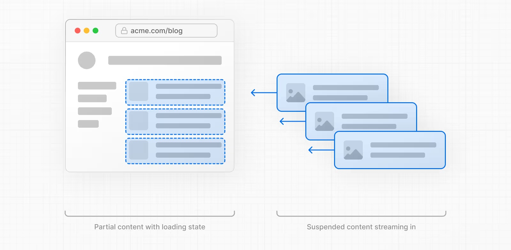
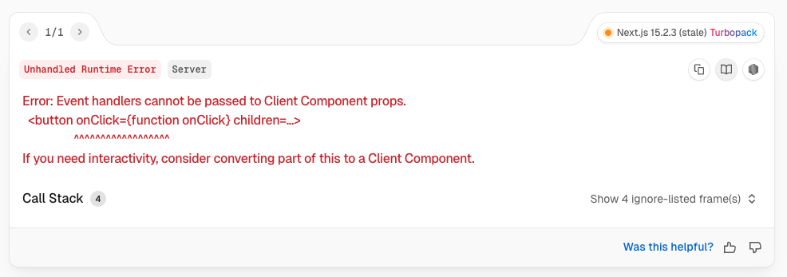
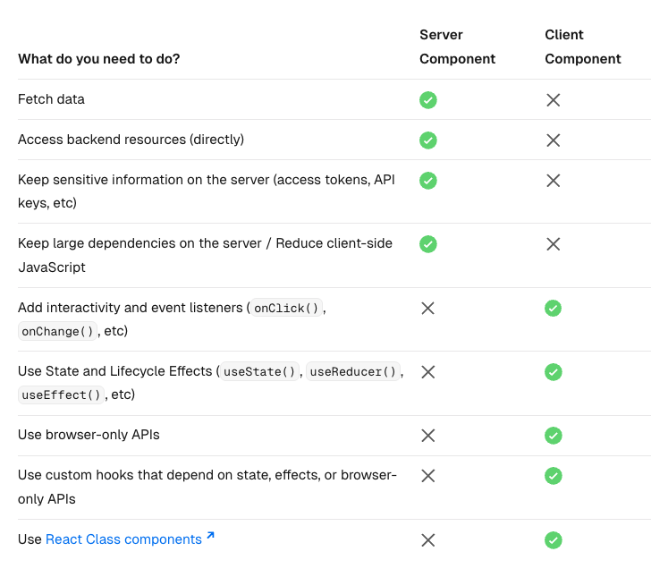
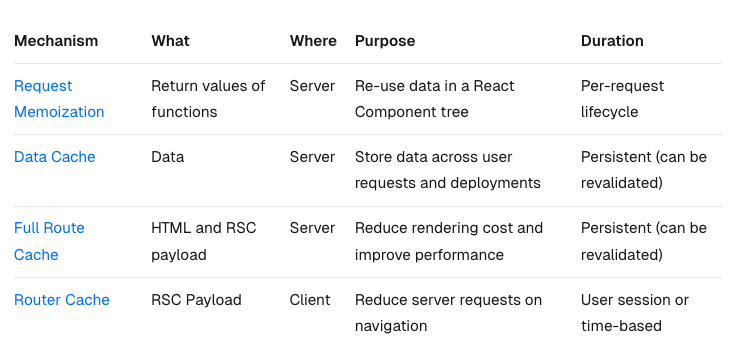
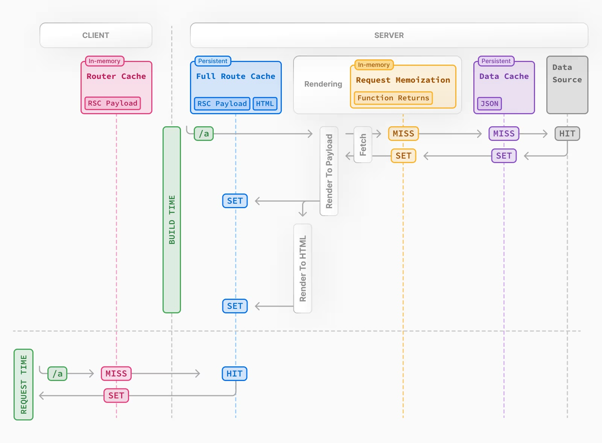
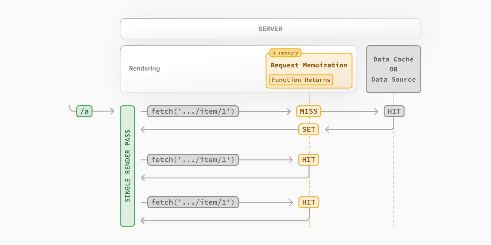
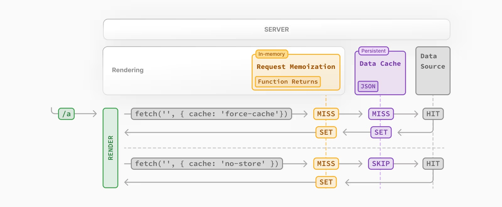
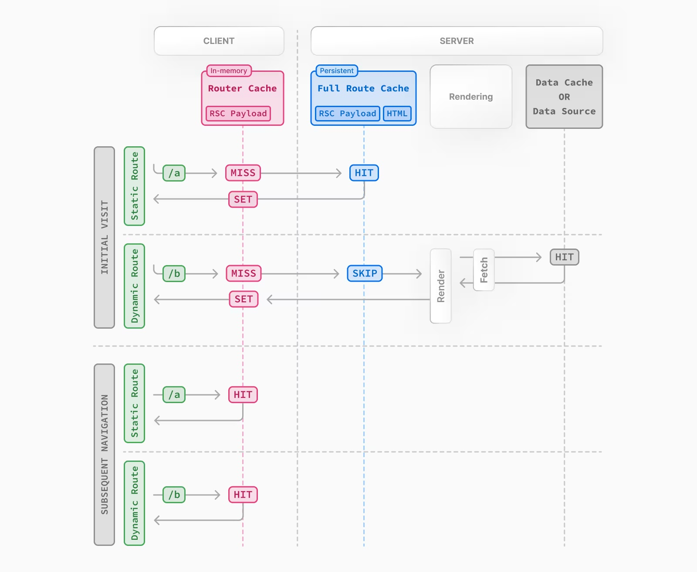

# Learn Next.js 

我之前 [使用 Express 创建了一个 ToDo 的 Web 应用](/2025/01/17/express-web)。[Express](https://expressjs.com/) 就像一张空白的画布，任你挥洒创意。你可以用水彩勾勒一幅童趣盎然的插画，也可以用毛笔描绘一卷意境深远的山水长卷。如果技艺精湛，甚至能创作出堪比《清明上河图》的传世之作。这正是 Express 所谓的 **"unopinionated"**——它不设限，你的作品由你定义。

然而， [Express](https://expressjs.com/)  仅仅是一张空白的画布，所有的工具和材料都需要我们自行准备。我们要处理模板（HTML）、样式（CSS）、脚本（JavaScript）、用户验证、数据库、组件等方方面面。而以我们的能力，尚无法企及张择端的造诣。

因此，我们需要一个框架来为我们打好基础，就像一位绘画老师，提前选好铅笔、调好色板，让我们能够专注于挥洒创意，将脑海中的构想变为现实。

[Next.js](https://nextjs.org/) 正是这样一个出色的框架。接下来，我们来学习一下 [Next.js](https://nextjs.org/)。

## 安装

```sh
$ npx create-next-app@latest
```

> 当前版本 15.3.0
>
> 要求 Node.js 18.18+

安装的过程中，Next.js 会提供以下选项供您选择

```
What is your project named? my-app
Would you like to use TypeScript? No / Yes
Would you like to use ESLint? No / Yes
Would you like to use Tailwind CSS? No / Yes
Would you like your code inside a `src/` directory? No / Yes
Would you like to use App Router? (recommended) No / Yes
Would you like to use Turbopack for `next dev`?  No / Yes
Would you like to customize the import alias (`@/*` by default)? No / Yes
What import alias would you like configured? @/*
```

以上选项，我都选择 "Yes"，因此 Next.js 自动为我配置了 Typescript、ESLint、Tailwind CSS、Turbopack、Alias 和路由机制，并且代码放入 `src` 目录。

## 调试

调试纯前端项目，我们知道使用浏览器（我使用 Chrome）就可以了。但是 Next.js 是前后端一体的项目，所以除了浏览器我们还需要使用 VS Code（我使用VS Code）

> 关于怎么使用 VS Code 调试 Node.js，可以参考我的 [VS Code 调试 Node.js ](/2024/09/26/vscode-debug/) 这篇文章

在项目的根目录创建 `.vscode/launch.json` 文件

```json
{
  "version": "0.2.0",
  "configurations": [
    {
      "name": "Next.js: debug server-side",
      "type": "node-terminal",
      "request": "launch",
      "command": "npm run dev"
    },
    {
      "name": "Next.js: debug client-side",
      "type": "chrome",
      "request": "launch",
      "url": "http://localhost:3000"
    },
    {
      "name": "Next.js: debug full stack",
      "type": "node",
      "request": "launch",
      "program": "${workspaceFolder}/node_modules/next/dist/bin/next",
      "runtimeArgs": ["--inspect"],
      "skipFiles": ["<node_internals>/**"],
      "serverReadyAction": {
        "action": "debugWithChrome",
        "killOnServerStop": true,
        "pattern": "- Local:.+(https?://.+)",
        "uriFormat": "%s",
        "webRoot": "${workspaceFolder}"
      }
    }
  ]
}
```

如果要从根目录以外的目录运行 Next.js，则需要添加 `cwd` 选项（表示启动程序所在的目录），例如：`"cwd"： "${workspaceFolder}/apps/web"`。

## 路由

Next.js 提供了两种路由机制：

- App Router：基于 `app/` 目录中的文件结构，引入了 布局（Layout）和嵌套路由的概念。
- Pages Router：基于 `pages/` 目录中的文件结构，每个 `.js/.tsx` 文件自动成为一个路由。

App Router 自 Next.js 13 引入的，是目前 Next.js 推荐的路由机制。所以对于新应用，我们使用 App Router 即可。

App Router 以  `app/` 下的文件结构形成路由，并支持路由嵌套。当然不是 `app/` 下的所有的文件都可以用作路由，只有 `page.{js,jsx,ts,tsx}` 文件才可以当做路由，比如：

```
└── app
   ├── content
   |  ├── layout.tsx
   |  └── task
   |     └── page.tsx         🌐 /content/task/
   ├── components
   |     └── button.tsx       不是路由
   ├── layout.tss
   ├── lib
         └── actions.ts       不是路由
   ├── page.tsx               🌐 /
   └── user
         ├── layout.tsx
         ├── page.tsx         🌐 /user/
      ├── login
      |  └── page.tsx         🌐 /user/login/
      └── register
         └── page.tsx         🌐 /user/register/
```

并且以 `page.{js,jsx,ts,tsx}` 文件返回的组件作为路由渲染的页面。比如

```tsx
// app/user/page.tsx
export default function User() {
  return (
    <div>
      I'm cp3hnu
    </div>
  );
}
```

访问 http://localhost:3000/user 时，页面显示 `I'm cp3hnu`。

此外 App Router 支持布局共享和嵌套。一个目录下的所有路由共享当前目录的布局，这个布局由 `layout.{js,jsx,ts,tsx}` 文件定义。比如上面的 `/user/login/` 和 `/user/register/` 共享 user 的布局，即 `user/layout.tsx` 定义的布局。

> 布局共享可以用于性能优化，比如从 `/user/login/`  跳转到 `/user/register/`， `user/layout.tsx` 不需要重新渲染。

每一个 Next.js 项目都应该有一个根布局，由 `app/layout.tsx` 定义，里面应该包含 `html` 和 `body` 标签，例如：

```tsx
export default function RootLayout({
  children,
}: Readonly<{
  children: React.ReactNode;
}>) {
  return (
    <html lang="zh-CN">
      <body
      >
        {children}
      </body>
    </html>
  );
}
```

同时布局支持嵌套，因此对应路由地址 `/user/login/` ，渲染的页面应该是这样的：

```jsx
<RootLayout>
  <UserLayout>
    <LoginPage />
  </UserLayout>
</RootLayout>
```

### 目录约定

一般情况下  `app/` 下的目录用于构建路由段 (route segment)，但也存在以下几种特殊情形

#### `[folder]`

这种是动态 route segment，比如：

```
└── app
   └── user   
      └── [id]
         └── page.tsx    🌐 /user/1/、/user/2/ 等
```

这种类似于 [React-Router 的动态路由](https://reactrouter.com/start/framework/routing#dynamic-segments)，`route("user/:id", "./user.tsx"),`

这个动态参数通过 `params` props 传递给 page。

```js
// app/user/[id]/page.tsx

export default async function UserDetail({
  params
}: {
  params: Promise<{ id: string }>;
}) {
  const { id } = await params;
  return <div>{id}</div>;
}
```

> 📢 `params` 是一个 Promise

如果是 **Client Component**，也可以通过 [`useParams`](https://nextjs.org/docs/app/api-reference/functions/use-params) 获取。

当导航到 `/user/5/` 时，`params.id` 为 `5`

#### `[...folder]`

除了匹配单个 route segment，Next.js 还能匹配多个  route segment，即使用 `[...folder]`，比如

```
└── app
   └── user    
      └── [...slug]
         └── page.tsx    🌐 /user/1/、/user/1/info、/user/1/info/avatar 等
```

此时 `params.slug` 是一个数组，对应路由地址 `/user/1/info/edit`，值为 `["1", "info", "avatar"]`

#### `[[...folder]]`

这个相对于上面的 `[...folder]`， route segment 可以为空，比如上面的例子，它能匹配 `/user/`

#### `(folder)`

根据业务逻辑进行分组，但是不会生成 route segment，比如

```
└── app
   ├── (main)
   	  ├── layout.tsx
     	└── task
        	└── page.tsx    🌐 /task/
```

一般是用于根据业务逻辑进行分组，比如 `（admin）`、`（marketing`）等。

虽然 `(folder)` 不会产生 route segment，但是目录下的路由可以共享 Layout。

有一点需要注意，不要产生路由冲突，比如：``(marketing)/about/page.js` 和 `(shop)/about/page.js` 都会生成 `/about` 路由。

#### `_folder`

私有文件夹。私有文件夹及其子文件夹都不会生成布局和路由，即使目录下存在 `page` 文件

#### `@folder`

插槽，用于并行路由，可以同时渲染多个页面，比如下面的结构

```
└── app
   ├── layout.tsx	 
   ├── page.tsx
   ├── @team
   		└── page.tsx
   ├── @intro
   		└── page.tsx
```

可以这么定义  `app/layout.tsx`

```tsx
export default function Layout({
  children,
  team,
  analytics,
}: {
  children: React.ReactNode
  intro: React.ReactNode
  team: React.ReactNode
}) {
  return (
    <>
      {children}
      {team}
      {intro}
    </>
  )
}
```

这样就可以同时渲染 `@team/page.tsx`、`@intro/page.tsx`、`app/page.tsx` 三个页面的内容

> `children` 其实就是一个默认的插槽

### 文件约定

除了 `page` 文件用于路由，`layout` 文件用于布局之外，Next.js 还定义了一些特殊用途的文件

> 下面文件的后缀跟 `page` 文件一样，支持 `.js`、`.jsx`、`.ts`、`.tsx`

#### `page`

定义路由，它有两个参数 `params` 和 `searchParams`

```tsx
export default function Page({
  params,
  searchParams,
}: {
  params: Promise<{ slug: string }>
  searchParams: Promise<{ [key: string]: string | string[] | undefined }>
}) {
  return <h1>My Page</h1>
}
```

#### `layout`

定义布局，它有两个参数 `children` 和 `params` 。根 `layout` 文件在 app 目录下，必须包含 `html` 和 `body`

```ts
export default function RootLayout({
  children,
}: {
  children: React.ReactNode
}) {
  return (
    <html lang="en">
      <body>{children}</body>
    </html>
  )
}
```

#### `loading`

显示页面的加载状态。其实就是作为 [Suspense](https://react.dev/reference/react/Suspense) 组件的 `fallback`

```tsx
<Layout>
  <Suspense fallback={<Loading />}>
  	<Page />
	</Suspense>
</Layout>
```

主要是用于异步组件，更多详情请参考 [Loading UI and Streaming](https://nextjs.org/docs/app/building-your-application/routing/loading-ui-and-streaming)

#### `error`

显示页面的错误状态。其实就是作为 [ErrorBoundary](https://react.dev/reference/react/Component#catching-rendering-errors-with-an-error-boundary) 组件的 `fallback`。必须是 Client Component

```tsx
<Layout>
  <ErrorBoundary fallback={<Error />}>
  	<Page />
	</ErrorBoundary>
</Layout>
```

它接收两个 `props` 

- `error`: 错误信息，包含 `message` 和 `digest`

-  `reset`: 刷新函数

```tsx
'use client' // 必须是 Client Component
 
export default function Error({
  error,
  reset,
}: {
  error: Error & { message?: string; digest?: string }
  reset: () => void
}) {
  return (
    <div>
      <h2>Something went wrong!</h2>
      <button onClick={() => reset()}>Try again</button>
    </div>
  )
}
```

#### `global-error`

处理根布局错误，必须在 `/app` 目录下，必须包含 `html` 和 `body` 标签，因为它会取代根 Layout 的内容，即

```tsx
<ErrorBoundary fallback={<GlobalError />}>
  <RootLayout>
		<RootPage />
  </RootLayout>
</ErrorBoundary>
```

其它的和 `error` 一样

```tsx 
'use client' // 必须是 Client Component
 
export default function GlobalError({
  error,
  reset,
}: {
  error: Error & { digest?: string }
  reset: () => void
}) {
  return (
    // global-error must include html and body tags
    <html>
      <body>
        <h2>Something went wrong!</h2>
        <button onClick={() => reset()}>Try again</button>
      </body>
    </html>
  )
}
```

#### `not-found`

显示 404 错误。但是需要搭配 [`notFound`](https://nextjs.org/docs/app/api-reference/functions/not-found) 函数使用，比如对于路由 `/user/:id`，如果通过 `id` 没有找到用户，可以使用这个文件显示错误信息。

返回的状态码为 `404 Not Found`.

```tsx
// app/user/[id]/page.tsx
import { notFound } from "next/navigation";

export default async function UserD({
  params
}: {
  params: Promise<{ id: string }>;
}) {
  const { id } = await params;
  const user = await getUserById(id);
  if (!user) {
    notFound();
  }
  return <div>{id}</div>;
}
```

```tsx
// app/user/[id]/not-found.tsx

export default function UserNotFound() {
  return <div>该用户不存在</div>;
}
```

`not-found` 文件还有一个特殊用途，根目录下的 `not-found` 文件（`app/not-found`） 处理应用程序不匹配的 URL。即访问应用程序中不存在的路由时，显示这个文件的内容，以提示用户。

#### `route`

类似于 Express 的路由处理程序。在 Next.js 中一般用于后台接口。同一目录下不要同时存在 `route` 文件和 `page` 文件

```ts
// app/api/user
export async function GET(request: Request) {
  return Response.json({ 
    id: 1,
    name: 'John Doe',
    age: 30,
    email: '5Ml0D@example.com'
  })
}
```

GET [http://localhost:3000/api/user](http://localhost:3000/api/user) 返回

```json
{ 
    id: 1,
    name: 'John Doe',
    age: 30,
    email: '5Ml0D@example.com'
  }
```

除了`GET` 方法，Next.js 还支持 `POST`、`PUT`、`PATCH`、`DELETE`、`HEAD` 和 `OPTIONS`。对于不支持的方法，返回 `405 Method Not Allowed`。

Next.js 接收 [`NextRequest`](https://nextjs.org/docs/app/api-reference/functions/next-request) 参数，返回 [`NextResponse`](https://nextjs.org/docs/app/api-reference/functions/next-response)，它们分别扩展了原生的 [Request](https://developer.mozilla.org/docs/Web/API/Request) 和 [Response](https://developer.mozilla.org/docs/Web/API/Response) ，以提供更多功能。

#### `default`

用于并行路由。例如

```
└── app
  ├── @intro
  |  ├── default.tsx
  |  └── page.tsx
  ├── @user
  |  ├── info
  |  |  └── page.tsx
  |  └── page.tsx
  ├── default.tsx
  ├── layout.tsx
  └── page.tsx
```

当访问 `/` 路由时，同时展示 `app/page.tsx`、`@intro/page.tsx`、`@user/page.tsx` 的内容，但是通过[软导航（Soft Navigation）](https://nextjs.org/docs/app/building-your-application/routing/parallel-routes#active-state-and-navigation)到 `/user/info` 时，展示 `@user/info/page.tsx` 的内容，同时保持 `app/page.tsx`、`@intro/page.tsx` 的内容不变，这个在 Next.js 里称为 [Partial Render](https://nextjs.org/docs/app/building-your-application/routing/linking-and-navigating#4-partial-rendering)。

但是如果进行[硬导航（Hard Navigation）](https://nextjs.org/docs/app/building-your-application/routing/parallel-routes#active-state-and-navigation) ，比如浏览器刷新，`@intro` 目录无法匹配路由 `/user/info`，这个时候就会显示 `@intro/default.tsx` 的内容，因为 `children` 是隐式插槽 `@children`，因此也显示 `app/default.tsx`。如果没有 `default` 文件，则整个页面将显示 404 错误，即 `app/not-found` 的内容。

#### `middleware`

中间件文件。中间件在路由呈现之前执行，可以实现如身份验证、日志记录或重定向等功能。一个项目只能有一个中间件文件，且和 `app` 文件夹在同一个层级中。更多详情请参考下文的[中间件](#中间件)

#### `template`

模板文件。类似于`layout`，但是与跨路由持久化和状态保持的 `layout` 不同，模板文件被赋予了一个唯一的 key，这意味着子客户端组件在导航时将重置它们的状态。

> 这个文件不经常使用。

## 渲染

Next.js 将组件分为服务器组件（Server Components）和客户端组件（Client Components）

为了加速初始页面的加载，Next.js 在服务器上为客户端和服务器组件生成静态 HTML，当用户第一次访问时，将立即看到页面的内容，而不必等待客户端下载、解析和执行 JavaScript 包。

Next.js 的渲染步骤如下：

在服务器端：

1. React 将服务器组件渲染为一种称为 [**React Server Component Payload (RSC Payload)**](https://nextjs.org/docs/app/building-your-application/rendering/server-components#what-is-the-react-server-component-payload-rsc) 的特殊数据格式，其中包括对客户端组件的引用。
2. Next.js 使用 RSC Payload 和客户端组件 JavaScript 指令在服务器上生成 HTML。

然后，在客户端：

3. 生成的 HTML 快速地生成非交互式初始预览。
4. 然后 RSC Payload 协调客户端和服务器组件树，并更新 DOM。
5. JavaScript 指令 **Hydrate** 客户端组件并使其具有交互性。

> RSC Payload 是渲染的服务器组件树的紧凑二进制表示，它包含：
>
> - 服务器组件的渲染结果；
> - 客户端组件应该渲染的位置以及对其 JavaScript 文件的引用;
> - 任何从服务器组件传递给客户端组件的 Props;

> Hydration 是给 DOM 添加事件侦听器的过程，使得静态 HTML 具有交互性。在幕后，Hydration 是通过 [`hydrateRoot`](https://react.dev/reference/react-dom/client/hydrateRoot) React API 完成的。

### 服务器组件

Next.js 默认组件都是服务器组件，服务器组件有以下几个优势：

- **获取数据更快**：服务器组件和数据源都在服务器上，因此获取数据更快。
- **更安全**：服务器组件将敏感数据保存在服务器上，不会暴露给客户端，因此更安全。
- **缓存**：服务器组件渲染的内容能被缓存，可以提高性能。
- **减少客户端 JavaScript 包大小**：服务器组件在服务器上运行，因此客户端需要下载、解析和执行的 JavaScript 减少。
- **初始页面加载和第一次内容绘制（FCP）速度更快**：服务器组件在服务器上生成 HTML 以允许用户立即查看页面，而无需等待客户端下载、解析和执行渲染页面所需的 JavaScript，因此初始页面加载和第一次内容绘制（FCP）速度更快。
- **搜索引擎优化和社交网络可共享性**：服务器组件生成的 HTML 可以被搜索引擎机器人访问、被社交网络机器人用于生成社交卡。
- **流式**：服务器组件可以将渲染分割成块，然后将它们流式传输到客户端，这可以使用户更早地看到页面的部分内容。

服务器组件有三种渲染方式：

- 静态
- 动态
- 流式

#### 静态渲染

静态渲染，静态渲染的内容在编译的时候生成。静态渲染的内容可以被缓存，因此有好的性能优势。适用于非个性化的场景，比如静态博客文章或产品页面等。

```tsx
export default function Component() {
  return (
    <div>
      <h1>服务器组件有三种渲染方式：</h1>
      <ul>
        <li>静态</li>
        <li>动态</li>
        <li>流式</li>
      </ul>
    </div>
  );
}
```

#### 动态渲染

与静态相反，动态渲染的内容在请求的时候生成。适用于个性化的场景，比如显示用户的购物清单。

服务器组件默认是静态渲染，但是在渲染的过程中，如果 Next.js 发现服务器组件使用了 [动态 API](https://nextjs.org/docs/app/building-your-application/rendering/server-components#dynamic-apis)  或带有选项 `{cache: 'no-store'}` 的[`fetch` 函数](https://nextjs.org/docs/app/api-reference/functions/fetch)时，Next.js 将使用动态渲染。

>  `{cache: 'no-store'}` 表示不缓存，讲缓存的时候会介绍

动态 API 包括：

- [`cookies`](https://nextjs.org/docs/app/api-reference/functions/cookies)
- [`headers`](https://nextjs.org/docs/app/api-reference/functions/headers)
- [`connection`](https://nextjs.org/docs/app/api-reference/functions/connection)
- [`draftMode`](https://nextjs.org/docs/app/api-reference/functions/draft-mode)
- [`searchParams` prop](https://nextjs.org/docs/app/api-reference/file-conventions/page#searchparams-optional)
- [`unstable_noStore`](https://nextjs.org/docs/app/api-reference/functions/unstable_noStore)

#### 流式渲染

流式渲染是指将 UI 分割成块，然后流式传输给客户端，这使得用户能立即看到页面的部分内容。

流式渲染有两种方式：

- 使用 `loading.js`
- 使用 `suspense` 

##### 使用 `loading.js`

整个页面作为一个流式块，它的好处是不会阻止 Layout 的展示，同时用户可以看到页面的加载状态

 

##### 使用 `Suspense` 

[`Suspense`](https://react.dev/reference/react/Suspense) 可以更细粒度地控制页面的哪些部分进行流式传输。



更多关于 Stream 更多内容，请参考 [Loading UI and Streaming](https://nextjs.org/docs/app/building-your-application/routing/loading-ui-and-streaming)、[How to fetch data and stream](https://nextjs.org/docs/app/getting-started/fetching-data#streaming)、[Server Components](https://nextjs.org/docs/app/building-your-application/rendering/server-components#streaming)

### 客户端组件

但是服务器组件也有限制。服务器组件不能有事件处理函数、不能使用 `useState`、`useEffect` 等 React Hook、不能使用 Web 专有的 API，比如 [geolocation](https://developer.mozilla.org/docs/Web/API/Geolocation_API)、[localStorage](https://developer.mozilla.org/docs/Web/API/Window/localStorage) 等。比如下面组件使用了事件处理函数

```tsx
export default function Component() {
  return (
    <div>
      <button onClick={() => console.log("clicked")}>Click Me</button>
    </div>
  );
}
```

运行时报错



这些都必须使用客户端组件。客户端组件使用 [`"use client"`](https://react.dev/reference/react/use-client) 来标识。

```tsx
'use client'
import { useState } from 'react'
 
export default function Counter() {
  const [count, setCount] = useState(0)
  return (
    <div>
      <p>You clicked {count} times</p>
      <button onClick={() => setCount(count + 1)}>Click me</button>
    </div>
  )
}
```

### 服务器组件 VS 客户端组件

我应该什么时候使用服务器组件，什么时候使用客户端组件呢？一张图胜过千言万语。



## 获取数据

Next.js 中获取数据分为服务器组件获取数据和客户端组件获取数据

### 服务器组件获取数据

#### 数据库

服务器组件一般都会获取数据库的数据。用法很简单，只需要将服务器组件改为异步即可。

```tsx
import { db, posts } from '@/lib/db'
 
export default async function Page() {
  const allPosts = await db.select().from(posts)
  return (
    <ul>
      {allPosts.map((post) => (
        <li key={post.id}>{post.title}</li>
      ))}
    </ul>
  )
}
```

#### 第三方服务

服务器组件有可能需要获取第三方服务的数据。这个时候可以使用 Next.js 的 [`fetch` 方法](https://nextjs.org/docs/app/api-reference/functions/fetch)。Next.js 的 `fetch` 方法扩展了 Web 的 [`fetch()` 方法](https://developer.mozilla.org/docs/Web/API/Fetch_API)，并添加了服务器缓存。

```tsx
export default async function Page() {
  const data = await fetch('https://api.vercel.app/blog')
  const posts = await data.json()
  return (
    <ul>
      {posts.map((post) => (
        <li key={post.id}>{post.title}</li>
      ))}
    </ul>
  )
}
```

### 客户端组件获取数据

#### `use` 方法

客户端组件获取数据推荐使用 React 19+ 的 [`use` 方法](https://react.dev/reference/react/use)。

首先参考上一节的内容，在服务器组件里获取数据，然后传递数据 Promise 给客户端组件。这种方式能阻止 Promise 阻塞服务器组件的渲染。

```tsx
import Posts from '@/app/ui/posts
import { Suspense } from 'react'
 
export default function Page() {
  // Don't await the data fetching function
  const posts = getPosts()
 
  return (
    <Suspense fallback={<div>Loading...</div>}>
      <Posts posts={posts} />
    </Suspense>
  )
}
```

然后客户端组件使用  [`use` 方法](https://react.dev/reference/react/use) 接收数据 Promise

```tsx
'use client'
import { use } from 'react'
 
export default function Posts({
  posts,
}: {
  posts: Promise<{ id: string; title: string }[]>
}) {
  const allPosts = use(posts)
 
  return (
    <ul>
      {allPosts.map((post) => (
        <li key={post.id}>{post.title}</li>
      ))}
    </ul>
  )
}
```

注意，客户端组件需要使用 [`Suspense`](https://react.dev/reference/react/Suspense) 进行包裹，因为获取数据是一个异步操作。Promise 有可能会失败，因此还应该添加 ErrorBoundary，更多详情请参考 [`use` - Dealing with rejected Promises](https://react.dev/reference/react/use#dealing-with-rejected-promises)。

#### 第三方库

推荐使用 [SWR](https://swr.vercel.app/) 和 [React Query](https://tanstack.com/query/latest)，也可以使用 [`axios`](https://github.com/axios/axios)。

```tsx
'use client'
import useSWR from 'swr'
 
const fetcher = (url) => fetch(url).then((r) => r.json())
 
export default function BlogPage() {
  const { data, error, isLoading } = useSWR(
    'https://api.vercel.app/blog',
    fetcher
  )
 
  if (isLoading) return <div>Loading...</div>
  if (error) return <div>Error: {error.message}</div>
 
  return (
    <ul>
      {data.map((post: { id: string; title: string }) => (
        <li key={post.id}>{post.title}</li>
      ))}
    </ul>
  )
}
```

## 导航

Next.js 支持 4 种导航方式：

- [`Link`](https://nextjs.org/docs/app/api-reference/components/link) 组件
- 客户端组件使用 [`useRouter` hook](https://nextjs.org/docs/app/api-reference/functions/use-router)
- 服务器组件使用 [`redirect` 函数](https://nextjs.org/docs/app/api-reference/functions/redirect)
- 原生 [History API](https://developer.mozilla.org/en-US/docs/Web/API/History_API)

### `Link` 组件

`<Link>` 是一个 Next.js 内置组件，它扩展了HTML `<a>` 标签，提供路由预取功能。这是 Next.js 推荐的导航方式。

```ts
import Link from 'next/link'
 
export default function Page() {
  return <Link href="/dashboard">Dashboard</Link>
}
```

### `useRouter` hook

`useRouter` hook，用于客户端组件，以编程的方式进行导航。

```ts
'use client'
 
import { useRouter } from 'next/navigation'
 
export default function Page() {
  const router = useRouter()
 
  return (
    <button type="button" onClick={() => router.push('/dashboard')}>
      Dashboard
    </button>
  )
}
```

### `redirect` 函数

`redirect` 函数，用于服务器组件或者 Server Action，以编程的方式进行导航。

```ts
import { redirect } from 'next/navigation'
 
export default async function Profile({
  params,
}: {
  params: Promise<{ id: string }>
}) {
  const { id } = await params
  if (!id) {
    redirect('/login')
  }
 
  // ...
}
```

### 原生 History API

Next.js 也允许使用原生 [`window.history.pushState`](https://developer.mozilla.org/en-US/docs/Web/API/History/pushState) 和 [`window.history.replaceState`](https://developer.mozilla.org/en-US/docs/Web/API/History/replaceState) 方法进行导航，这个导航方式因为使用了Web API，因此只能用于客户端组件。

```ts
'use client'
 
import { useSearchParams } from 'next/navigation'
 
export default function SortProducts() {
  const searchParams = useSearchParams()
 
  function updateSorting(sortOrder: string) {
    const params = new URLSearchParams(searchParams.toString())
    params.set('sort', sortOrder)
    window.history.pushState(null, '', `?${params.toString()}`)
  }
 
  return (
    <>
      <button onClick={() => updateSorting('asc')}>Sort Ascending</button>
      <button onClick={() => updateSorting('desc')}>Sort Descending</button>
    </>
  )
}
```

更多详情请参考 [Linking and Navigating](https://nextjs.org/docs/app/building-your-application/routing/linking-and-navigating)

## 错误处理

Next.js 将错误处理分为：

- 可以预见的错误
- 不可预知的异常

### 可以预见的错误

1. 对于服务器函数可以使用 [`useActionState`](https://react.dev/reference/react/useActionState) hook，返回错误信息

```ts
'use server'
 
export async function createPost(prevState: any, formData: FormData) {
  const title = formData.get('title')
  const content = formData.get('content')
 
  const res = await fetch('https://api.vercel.app/posts', {
    method: 'POST',
    body: { title, content },
  })
  const json = await res.json()
 
  if (!res.ok) {
    return { message: 'Failed to create post' }
  }
}
```

```tsx
'use client'
 
import { useActionState } from 'react'
import { createPost } from '@/app/actions'
 
const initialState = {
  message: '',
}
 
export function Form() {
  const [state, formAction, pending] = useActionState(createPost, initialState)
 
  return (
    <form action={formAction}>
      <label htmlFor="title">Title</label>
      <input type="text" id="title" name="title" required />
      <label htmlFor="content">Content</label>
      <textarea id="content" name="content" required />
      {state?.message && <p aria-live="polite">{state.message}</p>}
      <button disabled={pending}>Create Post</button>
    </form>
  )
}
```

2. 对于服务器组件，可以返回带有错误信息的 response

```tsx
export default async function Page() {
  const res = await fetch(`https://...`)
  const data = await res.json()
 
  if (!res.ok) {
    return 'There was an error.'
  }
 
  return '...'
}
```

或者使用  [`redirect`](https://nextjs.org/docs/app/api-reference/functions/redirect) 进行重定向，比如用户没有登录时，重定向到用户登录界面

```tsx
export default async function Page() {
  if (!isLogin) {
    redirect("/login")
  }
  
  return '...'
}
```

对于 404 错误，可以使用 [`notFound`](https://nextjs.org/docs/app/api-reference/functions/not-found) 函数和 [`not-found.js`](https://nextjs.org/docs/app/api-reference/file-conventions/not-found)

```tsx
export default async function Page({ params }: { params: { slug: string } }) {
  const { slug } = await params
  const post = getPostBySlug(slug)
 
  if (!post) {
    notFound()
  }
 
  return <div>{post.title}</div>
}
```

```tsx
export default function NotFound() {
  return <div>404 - Page Not Found</div>
}
```

### 不可预知的异常

对于不可预知的异常，使用 [`error.js`](https://nextjs.org/docs/app/api-reference/file-conventions/error) 文件和 [`global-error.js`](https://nextjs.org/docs/app/api-reference/file-conventions/error#global-error) 文件

```tsx
'use client' // Error boundaries must be Client Components
 
import { useEffect } from 'react'
 
export default function Error({
  error,
  reset,
}: {
  error: Error & { digest?: string }
  reset: () => void
}) {
  useEffect(() => {
    // Log the error to an error reporting service
    console.error(error)
  }, [error])
 
  return (
    <div>
      <h2>Something went wrong!</h2>
      <button
        onClick={
          // Attempt to recover by trying to re-render the segment
          () => reset()
        }
      >
        Try again
      </button>
    </div>
  )
}
```

## 中间件

Next.js 允许在请求完成之前运行中间件。它根据传入的请求，通过重写、重定向、修改请求或响应头、甚至直接返回响应来修改原请求的响应。

正如前面介绍的，通过项目根目录下的 `middleware.ts` 文件定义中间件，一般格式如下

```ts
import { NextResponse } from 'next/server'
import type { NextRequest } from 'next/server'
 
// This function can be marked `async` if using `await` inside
export function middleware(request: NextRequest) {
  return NextResponse.redirect(new URL('/home', request.url))
}
 
// 匹配请求路由
export const config = {
  matcher: '/about/:path*',
}
```

默认 Next.js 中间件处理每一个请求路由，但是可以通过 `config.matcher` 进行配置，只有匹配的路由才使用中间件，支持字符串、正则表达式、对象以及以上三种类型组成的数组。

 `config.matcher` 支持的对象格式如下：

- source：匹配请求路由的路径或模式。可以是字符串和正则表达式
- regexp（可选）：正则表达式字符串，根据 `source` 对匹配进行微调
- locale（可选）：一个布尔值，当设置为 `false` 时，忽略路径匹配中基于地区的路由
- has（可选）：指定路由请求中必须存在特定请求元素（如 headers、查询参数或 cookie）
- missing（可选）：指定路由请求中**不**存在特定请求元素（如 headers、查询参数或 cookie）

一个复杂的例子如下：

```ts
export const config = {
  matcher: [
    /*
     * Match all request paths except for the ones starting with:
     * - api (API routes)
     * - _next/static (static files)
     * - _next/image (image optimization files)
     * - favicon.ico, sitemap.xml, robots.txt (metadata files)
     */
    {
      source:
        '/((?!api|_next/static|_next/image|favicon.ico|sitemap.xml|robots.txt).*)',
      missing: [
        { type: 'header', key: 'next-router-prefetch' },
        { type: 'header', key: 'purpose', value: 'prefetch' },
      ],
    },
 
    {
      source:
        '/((?!api|_next/static|_next/image|favicon.ico|sitemap.xml|robots.txt).*)',
      has: [
        { type: 'header', key: 'next-router-prefetch' },
        { type: 'header', key: 'purpose', value: 'prefetch' },
      ],
    },
 
    {
      source:
        '/((?!api|_next/static|_next/image|favicon.ico|sitemap.xml|robots.txt).*)',
      has: [{ type: 'header', key: 'x-present' }],
      missing: [{ type: 'header', key: 'x-missing', value: 'prefetch' }],
    },
  ],
}
```

中间件的应用场景有很多，比如设置响应头、登录验证与授权、CORS 等，下面以 CORS  举例说明

```ts
import { NextRequest, NextResponse } from 'next/server'
 
// 允许的 origin
const allowedOrigins = ['https://acme.com', 'https://my-app.org']
 
// Cors Headers
const corsOptions = {
  'Access-Control-Allow-Methods': 'GET, POST, PUT, DELETE, OPTIONS',
  'Access-Control-Allow-Headers': 'Content-Type, Authorization',
}
 
export function middleware(request: NextRequest) {
  // Check the origin from the request
  const origin = request.headers.get('origin') ?? ''
  const isAllowedOrigin = allowedOrigins.includes(origin)
 
  // Handle preflighted requests
  const isPreflight = request.method === 'OPTIONS'
 
  if (isPreflight) {
    const preflightHeaders = {
      ...(isAllowedOrigin && { 'Access-Control-Allow-Origin': origin }),
      ...corsOptions,
    }
    return NextResponse.json({}, { headers: preflightHeaders })
  }
 
  // Handle simple requests
  // `next()` 表示继续路由
  const response = NextResponse.next()
 
  if (isAllowedOrigin) {
    response.headers.set('Access-Control-Allow-Origin', origin)
  }
 
  Object.entries(corsOptions).forEach(([key, value]) => {
    response.headers.set(key, value)
  })
 
  return response
}
 
export const config = {
  matcher: '/api/:path*',
}
```

## 缓存

Next.js 支持四种缓存机制



它们的运行机制如下



### Request Memoization

上面讲服务器组件获取数据时，介绍了 Next.js 的 `fetch` 方法。它扩展了 Web 的 [`fetch()` 方法](https://developer.mozilla.org/docs/Web/API/Fetch_API)，并且对相同的请求（URL 和请求参数相同），缓存其结果。但是它只应用于 React 组件树（Layout、Page、服务器组件、`generateMetadata`, `generateStaticParams`），在组件树的渲染过程中，多次调用同一个请求，后续的请求使用缓存。这种缓存是自动开启的，只适用于 `GET` 请求，在 React 组件树渲染完成之后，缓存失效。



### Data Cache

Data Cache 也是通过 `fetch` 方法进行缓存的，与 Request Memoization 不同的是，Request Memoization 是自动开启的，而 Data Cache 需要进行配置，Request Memoization 的缓存只能在同一 React 组件树里有效，而 Data Cache 可以跨服务器请求和部署。

当 Next.js 发出带有 `{cache: 'force-cache'}` 选项的 `fetch` 请求时，其结果缓存到 Data Cache。如果 `fetch` 请求没有 `cache`  选项，或者带有 `{cache: 'no-cache'}` 选项，则请求结果不缓存。



默认 Data Cache 的缓存一直有效，但是有两种方式可以使其失效：

- 设置过期时间（**Time-based Revalidation**）：使用  `next.revalidate` 选项设置过期时间

```js
// Revalidate at most every hour
fetch('https://...', { next: { revalidate: 3600 } })
```

- 手动设置失效（**On-demand Revalidation**）

使用  [`revalidatePath`](https://nextjs.org/docs/app/building-your-application/caching#revalidatepath) 或 [`revalidateTag`](https://nextjs.org/docs/app/building-your-application/caching#fetch-optionsnexttags-and-revalidatetag) 设置缓存失效

```js
// Path
import { revalidatePath } from 'next/cache'
 
export default async function submit() {
  await addPost()
  revalidatePath('posts')
}

// Tag
// fetch(`https://...`, { next: { tags: ['a', 'b', 'c'] } })
import { revalidateTag } from 'next/cache'
 
export default async function submit() {
  await addPost()
  revalidateTag('a')
}
```

### Full Route Cache

上面介绍服务器组件时，曾说到服务器组件静态渲染的内容可以被缓存，因此有好的性能优势。这里的缓存就是指 Full Route Cache。它缓存 RSC Payload 和 生成的 HTML。



默认 Full Route Cache 的缓存一直有效，但是有两种方式可以使其无效：

- 使 Data Cache 失效，然后会在服务器上重新渲染组件并缓存新的渲染结果，从而使 Full Route Cache  缓存失效
- 重新部署

Full Route Cache 只能应用于服务器组件静态渲染。以下四种操作将不能利用 Full Route Cache：

- 使用 [动态 API](https://nextjs.org/docs/app/deep-dive/caching#dynamic-apis)，Next.js 将使用动态渲染
- 使用 `dynamic = 'force-dynamic'` 选项配置路由段，强制动态渲染
- 使用 `revalidate = 0` 选项配置路由端
- 带有 `{cache: 'no-cache'}` 选项（ `fetch` 请求的默认值）的 `fetch` 请求

### Client-side Router Cache

Next.js js 有一个内存的 Client-side Router Cache，它缓存路由段的 RSC Payload。当用户在路由之间导航时，Next.js 会缓存访问过的路由段，并预取用户可能导航到的路由。这导致了即时的后退/前进导航，在导航之间不需要重新加载整个页面，并且保留了 React 状态和浏览器状态。

Client-side Router Cache 将

- 缓存 Layout 和 Loading，在导航上的时候可以复用。
- 默认情况下，Page 不缓存，但可以在浏览器向后和向前导航时复用。

## References

- [Next.js](https://nextjs.org/)
- [Route Segment Config](https://nextjs.org/docs/app/api-reference/file-conventions/route-segment-config)
- [Middle](https://nextjs.org/docs/app/building-your-application/routing/middleware)
- [Caching](https://nextjs.org/docs/app/deep-dive/caching)
- [Linking and Navigating](https://nextjs.org/docs/app/building-your-application/routing/linking-and-navigating)
- [React](https://react.dev)
- [React-Router](https://reactrouter.com/)
- [SWR](https://swr.vercel.app/)
- [React Query](https://tanstack.com/query/latest)
- [`axios/axios`](https://github.com/axios/axios)
