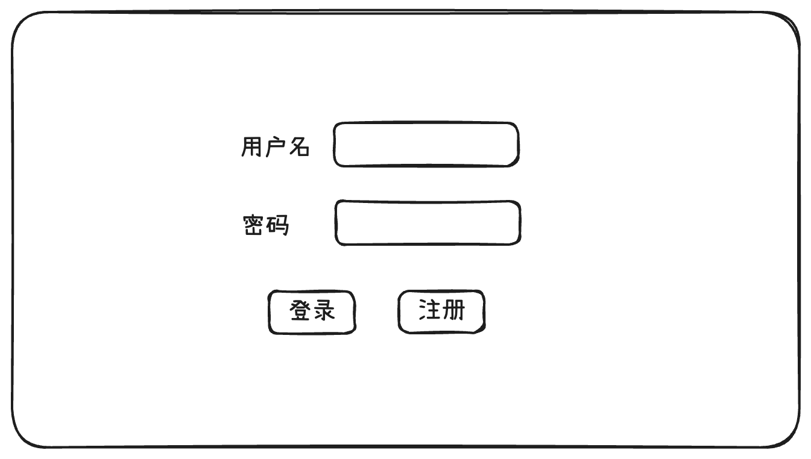

# 使用 Next.js 创建 Web 应用

在 [使用 Express 创建 Web 服务](/2025/01/17/express-web/) 中，我们使用 Express 创建了一个 ToDo 的 Web 服务。使用 Express 时，我们需要自己处理模板（HTML）、样式（CSS）、脚本（JavaScript）、路由、错误处理等等。而 Next.js 框架已经提供了上面的这些功能，我们只要专注于业务实现。这篇文章我们将使用 Next.js 创建 Web 应用，看看它能否帮助我们实现快速开发。

## 需求

和 [使用 Express 创建 Web 服务](/2025/01/17/express-web/) 一样，我们实现一个 Todo Web 应用

### 设计稿

ToDo 应用的主要功能如下：

#### 注册


#### 登录



#### 任务列表


## 创建项目

```sh
$ npx create-next-app@latest
```

> 当前版本 15.3.0
>
> 要求 Node.js 18.18+

安装的过程中，Next.js 会提供以下选项供您选择

```
What is your project named? nextjs-todo
Would you like to use TypeScript? Yes
Would you like to use ESLint? Yes
Would you like to use Tailwind CSS? Yes
Would you like your code inside a `src/` directory? Yes
Would you like to use App Router? (recommended) Yes
Would you like to use Turbopack for `next dev`?  Yes
Would you like to customize the import alias (`@/*` by default)? No
```

Next.js 自动为我配置了 Typescript、ESLint、Tailwind CSS、Turbopack、Alias 和路由机制，并且代码放入 `src` 目录。

## 项目结构

`src` 目录下的文件结构如下：

```
├── app
|  ├── (pages) 
|  |  ├── (main)
|  |  |  ├── layout.tsx  // 左菜单右内容的布局 
|  |  |  ├── sider.tsx   // 左侧菜单
|  |  |  └── tasks
|  |  |     ├── components
|  |  |     |  └── TaskList.tsx
|  |  |     ├── error.tsx  // 任务错误页
|  |  |     └── page.tsx   // 任务页面
|  |  ├── login
|  |  |  └── page.tsx // 登录页面
|  |  └── register
|  |     └── page.tsx // 注册页面
|  ├── action
|  |  └── index.ts // server action
|  ├── api
|  |  └── tasks
|  |     └── route.ts // get tasks api
|  ├── db
|  |  └── index.ts  // 数据库操作
|  ├── globals.css  // 全局样式
|  ├── layout.tsx   // 根布局
|  ├── route.ts     // 根页面
|  ├── types
|  |  └── index.ts  // ts 类型
|  └── utils
|     ├── dal.ts      //  Data Access Layer
|     ├── index.ts    // 工具类
|     └── session.ts  // session 管理
└── middleware.ts       // 授权中间件
```

## 注册

### 数据库

注册用户，需要使用数据库。为了后面部署到 [Vercel](https://vercel.com/)，这次我们使用 [PostgreSQL](https://www.postgresql.org/)

#### 安装

首先安装 [`postgres`](https://github.com/porsager/postgres)。

> 也可以使用 [node-postgres](https://github.com/brianc/node-postgres)

```sh
$ npm i postgres
```

#### 创建数据库

首先安装 PostgreSQL。安装 PostgreSQL 有多种方式：

> 更多详情请参考 [macOS packages](https://www.postgresql.org/download/macosx/)

- Interactive installer by EDB
- Postgres.app
- Homebrew

我使用的是第一种方式 Interactive installer by EDB，功能更强大。

> PostgreSQL 当前版本  17.2

安装好之后就可以创建 PostgreSQL 数据库了

```sh
$ createdb mydb
```

#### 创建数据库表

首先创建环境变量文件 `.env`，定义连接 PostgreSQL 数据库的选项

```
DB_HOST="localhost"
DB_PORT="5432"
DB_USER="cp3hnu"
DB_PASSWORD="123456"
DB_NAME="mydb"
```

然后连接数据库并创建表

```js
// src/app/db/index.ts
import postgres from "postgres";

const sql = postgres({
  host: process.env.DB_HOST,
  port: Number(process.env.DB_PORT),
  database: process.env.DB_NAME,
  username: process.env.DB_USER,
  password: process.env.DB_PASSWORD
});

export default sql;

// create user table
export async function createUserTable() {
  await sql`
    CREATE TABLE IF NOT EXISTS users (
      id SERIAL PRIMARY KEY,
      username VARCHAR(50) UNIQUE NOT NULL,
      email VARCHAR(255) UNIQUE NOT NULL,
      password VARCHAR(255) NOT NULL,
      created_at TIMESTAMP DEFAULT CURRENT_TIMESTAMP,
      updated_at TIMESTAMP DEFAULT CURRENT_TIMESTAMP
    )
  `;
}

// create task table
export async function createTaskTable() {
  await sql`
    CREATE TABLE IF NOT EXISTS tasks (
      id SERIAL PRIMARY KEY,
      user_id INTEGER REFERENCES users(id) ON DELETE CASCADE,
      title VARCHAR(255) NOT NULL,
      description TEXT,
      completed BOOLEAN DEFAULT FALSE,
      created_at TIMESTAMP DEFAULT CURRENT_TIMESTAMP,
      updated_at TIMESTAMP DEFAULT CURRENT_TIMESTAMP
    )
  `;
}
```

创建数据库表不是 Web 应用程序的一部分，我们应该先创建好。可以使用专门的数据库管理工具创建，也可以像我这样使用 ts 代码创建

```sh
$ tsx src/app/db/index.ts
```

### 注册用户

#### 创建 Server Action

1. 验证用户名、邮箱、密码字段
2. 判断用户名、邮箱是否已被注册
3. 使用 [`bcrypt.js`](https://github.com/dcodeIO/bcrypt.js) 或者 [`bcrypt-ts`](https://github.com/Mister-Hope/bcrypt-ts) 加密密码
4. 插入一条用户记录到数据库

```ts
// src/app/action/index.ts
export async function register(
  _prevState: RegisterFormState | undefined,
  formData: FormData
): Promise<RegisterFormState> {
  const username = formData.get("username") as string;
  const email = formData.get("email") as string;
  const password = formData.get("password") as string;
  // 1. 验证用户名、邮箱、密码字段
  if (!username || !email || !password) {
    return {
      success: false,
      user: null,
      message: "所有字段都是必填的"
    };
  }
  if (password.length < 6) {
    return {
      success: false,
      user: null,
      message: "密码长度不能少于6位"
    };
  }
  // 2. 判断用户名、邮箱是否已被注册
  const existingUsername = (await dbGetUserByUsername(
    username
  )) as DBUser | null;
  if (existingUsername) {
    return {
      success: false,
      user: null,
      message: "用户名已存在"
    };
  }
  const existingEmail = (await dbGetUserByEmail(email)) as DBUser | null;
  if (existingEmail) {
    return {
      success: false,
      user: null,
      message: "邮箱已被注册"
    };
  }
  try {
    // 3. 加密密码
    const hashedPassword = bcrypt.hashSync(password, 10);
    // 4. 插入一条用户记录到数据库
    const user = (await dbInsertUser(
      username,
      email,
      hashedPassword
    )) as DBUser;
    return {
      success: true,
      message: "注册成功，即将跳转到登录页",
      user
    };
  } catch (error) {
    console.error("Error registering user:", error);
    return {
      success: false,
      user: null,
      message: "注册失败"
    };
  }
}
```

#### 页面

使用 `useActionState` 注册用户

```tsx
'use client';

import { register } from "@/app/action";
import { useActionState } from "react";

export default function RegisterPage() {
  const [state, formAction, isPending] = useActionState(register, undefined);
  return (
     <form className="space-y-6" action={formAction}>
     </form>
  );
}
```

页面源代码，请参考 [register source code](https://github.com/cp3hnu/nextjs-todo/blob/main/src/app/(pages)/register/page.tsx) 

## 登录

登录功能主要包括验证用户、创建 Session 以及授权，整体流程如下：


### 用户验证

#### 创建 Server Action

1. 验证用户名、密码字段
2. 判断用户是否存在
3. 验证密码是否正确
4. 创建 session

```ts
// src/app/action/index.ts
import { createSession } from "@app/utils/session";

export async function login(
  _prevState: RegisterFormState | undefined,
  formData: FormData
) {
  const username = formData.get("username") as string;
  const password = formData.get("password") as string;
  
  // 1. 验证用户名、密码字段
  if (!username || !password) {
    return {
      success: false,
      user: null,
      message: "用户名和密码都是必填的"
    };
  }
  
  // 2. 判断用户是否存在
  const user = (await dbGetUserByUsername(username)) as DBUser;
  if (!user) {
    return {
      success: false,
      user: null,
      message: "用户不存在"
    };
  }
  
  // 3. 验证密码是否正确
  if (!bcrypt.compareSync(password, user.password)) {
    return {
      success: false,
      user: null,
      message: "密码错误"
    };
  }

  // 4. 创建 Session
  await createSession(user.id);

  // 登录成功，返回用户信息
  return {
    success: true,
    user,
    message: "登录成功，即将跳转到任务列表页"
  };
}
```

#### 页面

使用 `useActionState` 登录用户

```tsx
'use client';

import { login } from "@/app/action";
import { useActionState } from "react";

export default function RegisterPage() {
  const [state, formAction, isPending] = useActionState(login, undefined);
  return (
     <form className="space-y-6" action={formAction}>
     </form>
  );
}
```

页面源代码，请参考 [login source code](https://github.com/cp3hnu/nextjs-todo/blob/main/src/app/(pages)/login/page.tsx) 

### Session 管理

我们通过 session 来验证用户，Next.js 文档说 Session 有[两种类型](https://nextjs.org/docs/app/guides/authentication#session-management)：

- **Stateless**: session 存储在浏览器的 cookie 中。cookie 随每个请求一起发送给服务器，然后服务器验证 session。这种方法简单，但是安全性低一点。
- **Database**: session 存储在数据库中，只是把加密的 session ID 存储在浏览器的 cookie 中。这种方法更安全，但比较复杂，会使用更多的服务器资源。

这里我们使用 Stateless 类型，并且使用 [`Jose`](https://github.com/panva/jose) 来创建和管理 session

#### 安装 Jose

```sh
$ npm i jose
```

#### 创建 Session

1. 首先用 openSSL 生成一个 secret key

```sh
$ openssl rand -base64 32
```

2. 然后将 secret key 存放到 `.env` 

```
SESSION_SECRET="..."
```

3. 使用 [`Jose`](https://github.com/panva/jose) 来生成与验证 JWT

```js
// src/app/utils/session.ts
import { SignJWT, type JWTPayload } from "jose";

const secretKey = process.env.SESSION_SECRET;
const encodedKey = new TextEncoder().encode(secretKey);

export async function encrypt(payload: JWTPayload) {
  return new SignJWT(payload)
    .setProtectedHeader({ alg: "HS256" })
    .setIssuedAt()
    .setExpirationTime("7d")
    .sign(encodedKey);
}

export async function decrypt(session: string | undefined = "") {
  try {
    const { payload } = await jwtVerify(session, encodedKey, {
      algorithms: ["HS256"]
    });
    return payload;
  } catch (error) {
    console.log("Failed to verify session", error);
  }
}
```

4. 用 `userId` 创建 session，并存储到 cookie

```js
// src/app/utils/session.ts
const Expires = 7 * 24 * 60 * 60 * 1000; // 7 days in milliseconds

export async function createSession(userId: number) {
  const expiresAt = new Date(Date.now() + Expires);
  const session = await encrypt({ userId, expiresAt });
  const cookieStore = await cookies();

  cookieStore.set("session", session, {
    httpOnly: true,
    secure: true,
    expires: expiresAt,
    sameSite: "lax",
    path: "/"
  });
}
```

### 授权

在用户登录之后，可以根据用户权限或角色显示不同的内容。

我们使用中间件来进行授权。

1. 检查当前路由是否为保护路由或公共路由
2. 获取 cookie，如果没有找到 cookie，则将其视为未通过身份验证
3. 从 cookie 中解密 session
4. 如果用户未经过身份验证，则重定向到 `/login`
5. 如果用户通过身份验证，则重定向到 `/tasks`

```ts
// src/middleware.ts
import { NextRequest, NextResponse } from "next/server";
import { decrypt } from "@/app/utils/session";
import { cookies } from "next/headers";

const publicRoutes = ["/login", "/register"];

export default async function middleware(req: NextRequest) {
  // 1. 检查当前路由是否为保护路由或公共路由
  const path = req.nextUrl.pathname;
  const isPublicRoute = publicRoutes.includes(path);
  const isProtectedRoute = !isPublicRoute;

  // 2. 获取 cookie
  const cookie = (await cookies()).get("session")?.value;
  if (!cookie) {
    // 如果没有找到 cookie，则将其视为未通过身份验证
    if (isProtectedRoute) {
      return NextResponse.redirect(new URL("/login", req.nextUrl));
    }
    return NextResponse.next();
  }

  // 3. 从 cookie 中解密 session
  const session = await decrypt(cookie);

  // 4. 如果用户未经过身份验证，则重定向到 `/login`
  if (isProtectedRoute && !session?.userId) {
    return NextResponse.redirect(new URL("/login", req.nextUrl));
  }

  // 5. 如果用户通过身份验证，则重定向到 `/tasks`
  if (isPublicRoute && session?.userId) {
    return NextResponse.redirect(new URL("/tasks", req.nextUrl));
  }

  return NextResponse.next();
}

// Routes Middleware should not run on
export const config = {
  matcher: ["/((?!api|_next/static|_next/image|.*\\.png$).*)"]
};
```

### Data Access Layer (DAL)

Next.js 推荐创建一个 [DAL](https://nextjs.org/docs/app/guides/authentication#creating-a-data-access-layer-dal) 处理用户与应用程序交互时验证用户的 session。

```ts
import "server-only";

import { cookies } from "next/headers";
import { decrypt } from "@/app/utils/session";
import { cache } from "react";
import { redirect } from "next/navigation";

export const verifySession = cache(async () => {
  const cookie = (await cookies()).get("session")?.value;
  if (!cookie) {
    redirect("/login");
  }

  const session = await decrypt(cookie);
  if (!session?.userId) {
    redirect("/login");
  }

  return { isAuth: true, userId: Number(session.userId) };
});
```

## 任务

任务模块是最常见，也最具代表性的增删改查操作。

### 数据库表操作

首先用 [`postgres`](https://github.com/porsager/postgres) 实现数据库表的增删改查操作

```ts
// src/app/db/index.ts

export async function dbGetTasks(
  userId: number,
  title?: string
): Promise<DBTask[]> {
  try {
    const titleQuery = title ? sql`AND title ILIKE ${`%${title}%`}` : sql``;
    const orderBy = sql`ORDER BY completed DESC, 
      CASE WHEN completed THEN updated_at END DESC, 
      CASE WHEN NOT completed THEN created_at END ASC;`;
    const result = await sql`
      SELECT * FROM tasks WHERE user_id = ${userId} ${titleQuery} ${orderBy}
    `;
    console.log("Fetched tasks:", title, result);

    return result as unknown as DBTask[];
  } catch (error) {
    console.error("Error fetching tasks by user ID:", error);
    throw error;
  }
}

export async function dbInsertTask(
  userId: number,
  title: string
): Promise<DBTask> {
  try {
    const result = await sql`
      INSERT INTO tasks (user_id, title)
      VALUES (${userId}, ${title})
      RETURNING *
    `;
    return result[0] as DBTask;
  } catch (error) {
    console.error("Error inserting task:", error);
    throw error;
  }
}

export async function dbUpdateTask(
  taskId: number,
  updates: { title?: string; completed?: boolean }
): Promise<DBTask> {
  const dbUpdates = {
    ...updates,
    updated_at: new Date().toISOString() // Ensure updated_at is always set
  };
  try {
    const result = await sql`
      UPDATE tasks
      SET ${sql(dbUpdates)}
      WHERE id = ${taskId}
      RETURNING *
    `;
    return result[0] as DBTask;
  } catch (error) {
    console.error("Error updating task:", error);
    throw error;
  }
}

export async function dbDeleteTask(taskId: number): Promise<number> {
  try {
    await sql`
      DELETE FROM tasks WHERE id = ${taskId}
    `;
    return taskId;
  } catch (error) {
    console.error("Error deleting task:", error);
    throw error;
  }
}
```

### Server Actions

接下来创建 server action 

```ts
// 获取任务列表
export async function getTasks(title: string | undefined): Promise<DBTask[]> {
  const { userId } = (await verifySession()) || {};
  if (!userId) {
    return Promise.reject(new Error("用户未登录"));
  }
  try {
    const tasks = await dbGetTasks(Number(userId), title);
    return tasks;
  } catch (error) {
    console.error("Error fetching tasks:", error);
    return Promise.reject(new Error("获取任务列表失败"));
  }
}

// 插入、更新、删除类似，都是首先验证 session，然后调用数据库表操作
export async function addTask(title?: string): Promise<DBTask | null>  {}
export async function updateTask(
  taskId: number,
  content: { completed?: boolean; title?: string }
): Promise<DBTask> {}
export async function deleteTask(taskId: number): Promise<number> {}
```

### 页面

最后实现具体的功能页面

#### 服务器组件 vs 客户端组件

使用 Next.js 时，我们应该优先考虑服务器组件，因为服务器组件具有以下优势：

- **获取数据更快**：服务器组件和数据源都在服务器上，因此获取数据更快。
- **更安全**：服务器组件将敏感数据保存在服务器上，不会暴露给客户端，因此更安全。
- **缓存**：服务器组件渲染的内容能被缓存，可以提高性能。
- **减少客户端 JavaScript 包大小**：服务器组件在服务器上运行，因此客户端需要下载、解析和执行的 JavaScript 减少。
- **初始页面加载和第一次内容绘制（FCP）速度更快**：服务器组件在服务器上生成 HTML 以允许用户立即查看页面，而无需等待客户端下载、解析和执行渲染页面所需的 JavaScript，因此初始页面加载和第一次内容绘制（FCP）速度更快。
- **搜索引擎优化和社交网络可共享性**：服务器组件生成的 HTML 可以被搜索引擎机器人访问、被社交网络机器人用于生成社交卡。
- **流式**：服务器组件可以将渲染分割成块，然后将它们流式传输到客户端，这可以使用户更早地看到页面的部分内容。

但是服务器组件也不是万能的，服务器组件不能有事件处理函数，而且交互体验不如客户端组件。

因为任务页面涉及增删改查操作，必然需要事件处理函数（也可以使用 form + action 的方式，这样就可以使用服务器组件，但是体验不是很好），因此需要使用客户端组件。但是我们可以拆解，使用事件处理函数的部分使用客户端组件，其它的使用服务器组件。

查询任务列表我们使用服务器组件，新增、修改和删除使用客户端组件。

```tsx 
// src/app/(pages)/(main)/tasks/page.tsx
import TaskList from "./components/TaskList";
import { getTasks } from "@/app/action";
import { PageProps } from "@/app/types";

export default async function TasksPage({ searchParams }: PageProps) {
  const _searchParams = await searchParams;
  const title = _searchParams?.title;
  const tasks = await getTasks(title as string | undefined).catch(() => {
    return [];
  });

  return (<TaskList initialTasks={tasks}></TaskList>)
}
```

```tsx
// src/app/(pages)/(main)/tasks/components/TaskList.tsx
"use client";
import { addTask, updateTask, deleteTask } from "@/app/action";
import { useState } from "react";
import { DBTask } from "@/app/types";
import { useRouter } from 'next/navigation'
import { useSearchParams } from "next/navigation";

interface TaskListProps {
  initialTasks?: DBTask[];
}

export default function TaskList({ initialTasks: tasks = [] }: TaskListProps) {
  const [editingId, setEditingId] = useState<number | null>(null);
  const [editTitle, setEditTitle] = useState<string>("");
  const router = useRouter()
  const searchParams = useSearchParams();
  const title = searchParams.get("title") || "";

  // 处理新增
  const handleAdd = async (formData: FormData) => {
    const title = formData.get("title")?.toString().trim();
    if (title) {
      await addTask(title);
      router.refresh();
    }
  }
  
  // 处理删除
  const handleDelete = async (taskId: number) => {
    await deleteTask(taskId);
    router.refresh();
  };

  // 处理完成状态切换
  const handleToggle = async (task: DBTask) => {
    await updateTask(task.id, { completed: !task.completed });
    router.refresh();
  };

  // 处理标题修改
  const handleEditSave = async (task: DBTask) => {
    if (editTitle.trim() && editTitle !== task.title) {
      await updateTask(task.id, { title: editTitle });
    }
    setEditingId(null);
    setEditTitle("");
    router.refresh();
  };

  // 文档树结构请参考 
  // https://github.com/cp3hnu/nextjs-todo/blob/main/src/app/(pages)/(main)/tasks/components/TaskList.tsx
  return ...;
}
```

## 部署

我们的 Todo 应用已经构建完成，接下来我们将它部署的 [Vercel](https://vercel.com/)。

1. 创建 GitHub 代码仓库


2. 以 GitHub 代码仓库创建 Vercel Project


3. 在 "Storage"  页签创建数据库，Vercel 提供了多种数据库可供选择，我这里选择 "Neon"


4. 拷贝 `.env.local` 里的环境变量到项目的 `.env` 文件


这里还提供了各种库使用数据库的示例代码。

5. 在 Vercel Project 里添加环境变量。选择 "Setting"  -> "Environment Variables" 里添加环境变量，甚至可以通过 "Import .env" 导入环境变量

   

6. 修改连接数据库的代码，我使用的是 `postgres.js`

```diff
import postgres from "postgres";

-const sql = postgres({
-  host: process.env.DB_HOST,
-  port: Number(process.env.DB_PORT),
-  database: process.env.DB_NAME,
-  username: process.env.DB_USER,
-  password: process.env.DB_PASSWORD
-});

+const sql = postgres(process.env.DATABASE_URL!, { ssl: "verify-full" });

export default sql;
```

7. 提交代码到 GitHub 仓库，然后 Vercel 将自动构建。


至此，成功部署到 Vercel


### 其它事项

在部署的过程中，我发现每次提交代码到 GitHub，不管是不是 `main` 分支的提交，Vercel 都会进行部署，因为 Vercel 的部署分为两种 `Preview` 和 `Production`。

提交代码到 GitHub，Vercel 都会进行 Preview 构建，它的作用是在代码合并前进行测试、验收。如果你不想进行 Preview 构建，可以在 "Settings" -> "Git" -> "Ignored Build Step" 选择 "Only build production"。


更多详情，请参考 [Vercel - Ignored Build Step](https://vercel.com/docs/project-configuration/git-settings#ignored-build-step) 和 [How do I use the "Ignored Build Step" field on Vercel?](https://vercel.com/guides/how-do-i-use-the-ignored-build-step-field-on-vercel)

如果想控制具体哪个分支的提交才触发 Vercel 部署，还可以使用 [`git.deploymentEnabled`](https://vercel.com/docs/project-configuration/git-configuration#git.deploymentenabled) 配置选项。

比如设置 `dev` 分支上的提交不触发 Vercel 部署，设置 `dev: false`

> 默认任意分支都是 `true`

```json
// vercel.json 
{
  "$schema": "https://openapi.vercel.sh/vercel.json",
  "git": {
    "deploymentEnabled": {
      "dev": false,
    }
  }
}
```

## Source Code

[nextjs-todo](https://github.com/cp3hnu/nextjs-todo)

## 应用地址

[nextjs-todo](https://nextjs-todo-liard-one.vercel.app/)

## References

- [Next.js](https://nextjs.org/)
- [Next.js Authentication](https://nextjs.org/docs/app/guides/authentication)
- [Learn: Chapter 15 Adding Authentication](https://nextjs.org/learn/dashboard-app/adding-authentication)
- [Auth Libraries](https://nextjs.org/docs/app/guides/authentication#auth-libraries)
- [Using HTTP cookies](https://developer.mozilla.org/en-US/docs/Web/HTTP/Guides/Cookies)
- [NPM Trends: NextAuth.js vs Auth0 vs Clerk vs Better Auth](https://npmtrends.com/@auth0/nextjs-auth0-vs-@clerk/nextjs-vs-better-auth-vs-next-auth)
- [Vercel](https://vercel.com/)
- [Vercel - Ignored Build Step](https://vercel.com/docs/project-configuration/git-settings#ignored-build-step)
- [How do I use the "Ignored Build Step" field on Vercel?](https://vercel.com/guides/how-do-i-use-the-ignored-build-step-field-on-vercel)
- [Git Configuration](https://vercel.com/docs/project-configuration/git-configuration)
- [How to use Prisma ORM with Next.js](https://www.prisma.io/docs/guides/nextjs)
- [PostgreSQL](https://www.postgresql.org/)
-  [`drizzle-orm`](https://github.com/drizzle-team/drizzle-orm)
- [`postgres.js`](https://github.com/porsager/postgres)
- [node-postgres](https://github.com/brianc/node-postgres)
- [`bcrypt.js`](https://github.com/dcodeIO/bcrypt.js)
- [`bcrypt-ts`](https://github.com/Mister-Hope/bcrypt-ts)
- [`Jose`](https://github.com/panva/jose)
- [`iron-session`](https://github.com/vvo/iron-session)
- [`use-debounce`](https://www.npmjs.com/package/use-debounce)
- [`server-only`](https://www.npmjs.com/package/server-only)
