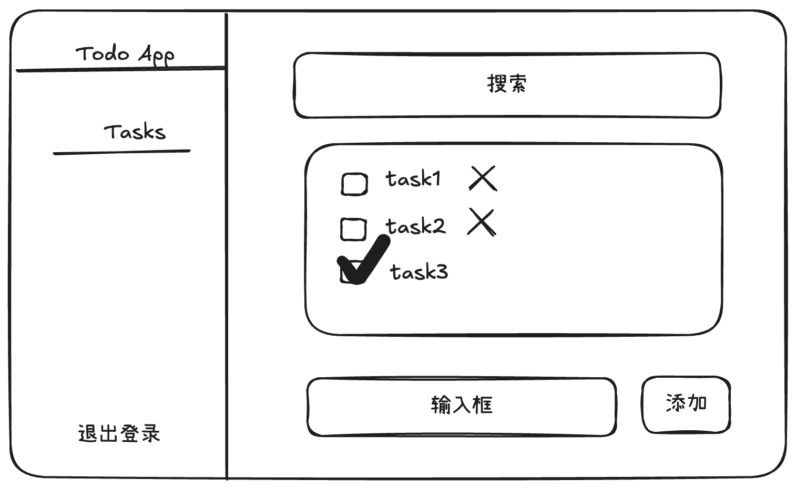

# 使用 Next.js 创建 Web 应用

在 [使用 Express 创建 Web 服务](/2024/12/12/express-web) 中，我们使用 Express 创建了一个 ToDo 的 Web 服务。使用 Express 时，我们需要自己处理模板（HTML）、样式（CSS）、脚本（JavaScript）、路由、错误处理等等。而 Next.js 框架已经提供了上面的这些功能，我们只要专注于业务实现。这篇文章我们将使用 Next.js 创建 Web 应用，看看它能否帮助我们实现快速开发。

## 需求

和 [使用 Express 创建 Web 服务](/2024/12/12/express-web) 一样，我们实现一个 Todo Web 应用

- 注册
- 登录
- 任务

### 设计稿

ToDo 应用的主要功能如下：

#### 注册


#### 登录


#### Todo 列表



## 注册

### 数据库

注册用户，需要使用数据库，往数据库插入用户信息。为了后面部署到 [Vercel](https://vercel.com/)，这次我们使用 [PostgreSQL](https://www.postgresql.org/)

首先安装  [`drizzle-orm`](https://github.com/drizzle-team/drizzle-orm) 和 [`postgres`](https://github.com/porsager/postgres)

```sh
$ npm i drizzle-orm postgres
```

创建数据库


## 登录


## 验证


## References

- [Next.js](https://nextjs.org/)
- [Next.js Authentication](https://nextjs.org/docs/app/guides/authentication)
- [Learn: Chapter 15 Adding Authentication](https://nextjs.org/learn/dashboard-app/adding-authentication)
- [Auth Libraries](https://nextjs.org/docs/app/guides/authentication#auth-libraries)
- [Session Management Libraries](https://nextjs.org/docs/app/guides/authentication#session-management-libraries)
- [Using HTTP cookies](https://developer.mozilla.org/en-US/docs/Web/HTTP/Guides/Cookies)
- [NPM Trends: NextAuth.js vs Auth0 vs Clerk vs Better Auth](https://npmtrends.com/@auth0/nextjs-auth0-vs-@clerk/nextjs-vs-better-auth-vs-next-auth)
- [`use-debounce`](https://www.npmjs.com/package/use-debounce)
- [`server-only`](https://www.npmjs.com/package/server-only)
- [How to use Prisma ORM with Next.js](https://www.prisma.io/docs/guides/nextjs)
- [PostgreSQL](https://www.postgresql.org/)
-  [`drizzle-orm`](https://github.com/drizzle-team/drizzle-orm)
- [`postgres`](https://github.com/porsager/postgres)
-  [Vercel](https://vercel.com/)
- [`bcrypt.js`](https://github.com/dcodeIO/bcrypt.js)
- [`bcrypt-ts`](https://github.com/Mister-Hope/bcrypt-ts)
