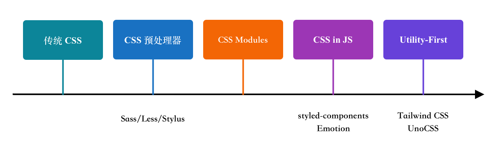

# Learn Tailwind CSS

在现代前端开发中，Tailwind CSS 正迅速成为最受欢迎的 CSS 框架之一。与传统框架不同，Tailwind CSS 采用了一种“功能类优先（Utility-First）”的设计思路，它通过提供大量小而精的原子类（如 `text-center`、`bg-blue-500`、`p-4` 等），让开发者可以在 HTML 中直接组合这些类快速构建出灵活且美观的用户界面。Tailwind CSS 避免了重复命名和层层嵌套的样式文件问题，大大提高了开发效率，也使得样式更易于维护和复用。

## 前端样式的发展历程

在前端技术不断演进的过程中，样式管理方式也经历了几次重要的变革。从最初的纯 CSS 到如今流行的 Utility-First 原子类框架，每一次变革都为开发者解决了当时的核心痛点。下面我们按照时间线，简要梳理这四个关键阶段：



### 传统 CSS（Cascading Style Sheets）

最原始的方式，直接编写 `.css` 文件，通过类名或标签选择器控制样式。

```css
.button {
  background-color: blue;
  color: white;
  padding: 10px 20px;
}
```

**优点：**

- 简单直观，浏览器原生支持。
- 易学，适合入门。

**缺点：**

- 初始时 CSS 不支持定义变量、层级嵌套。
- 无模块化机制，难以复用。
- 命名冲突频繁，样式难以维护。
- 全局污染严重。

### CSS 预处理器（如 Sass / Less / Stylus）

CSS 预处理器引入了变量、层级嵌套、函数、mixins 等编程概念，提升了 CSS 的可维护性。

```scss
$primary-color: blue;

.button {
  background-color: $primary-color;
  color: white;
  padding: 10px 20px;
}
```

**优点：**

- 支持变量、层级嵌套、自定义函数、mixins、扩展。
- 支持模块化与重用，也内置了很多模块和函数。
- 写法更灵活，逻辑性更强。

**缺点：**

- 仍然存在全局作用域问题。
- 样式与结构分离，理解上下文较困难。

### CSS Modules（模块化 CSS）

[CSS Modules](https://github.com/css-modules/css-modules) 是一种组件级别作用域化样式的方法，使用 `.module.css` 文件名。它会自动生成的唯一类名，确保样式只作用于当前组件，从而避免全局污染。

> CSS 预处理通过插件，也支持 CSS Modules

```css
/* Button.module.css */
.button {
  background-color: blue;
  color: white;
}
```

```jsx
// Button.jsx
import styles from './Button.module.css';

function Button() {
  return <button className={styles.button}>点击我</button>;
}
```

**优点：**

- 样式作用于当前组件，避免全局命名冲突。
- 写法与传统 CSS 接近，易于迁移。
- 适用于 React、Vue 等现代框架，尤其在不想引入 CSS-in-JS 的项目中非常流行。

**缺点：**

- 与结构分离，仍需维护独立的 CSS 文件。
- 动态样式能力有限。
- 类名通过编译生成，调试时不够直观。

### CSS-in-JS（如 styled-components/Emotion）

CSS-in-JS 让我们在 JavaScript/React 组件中直接写样式，支持完整的 JS 逻辑、变量、主题等。

```js
const Button = styled.button`
  background: blue;
  color: white;
  padding: 10px 20px;
`;
```

**优点：**

- 样式与组件强绑定，真正模块化。
- 动态样式与主题切换更容易。
- 不再担心类名冲突。

**缺点：**

- 首屏性能差（运行时样式注入）。
- 构建体积偏大。
- 脱离标准 CSS 写法，学习曲线稍陡。

### Utility-First（如 Tailwind CSS/UnoCSS）

这是目前最受欢迎的一种方式。它把所有常见样式拆分为极小的功能类（utility class），组件通过组合这些类来实现样式。

```jsx
<button class="bg-blue-500 text-white px-4 py-2 rounded">
  按钮
</button>
```

**优点：**

- 不写 CSS，也能快速实现复杂界面。
- 强一致性，样式来源于统一的设计系统。
- 样式写在结构中，可读性和上下文更好。
- 极致优化构建后文件大小。

**缺点：**

- 初看类名繁杂，HTML 结构显得“冗长”。
- 对传统 CSS 思维需要一定转换。

从“分离结构和样式”的传统 CSS，到“样式即逻辑”的 CSS-in-JS，再到“类即组件原子单元”的 Utility-First，每一次演进都在追求 **更高的效率、更低的耦合、更强的可维护性**。而 Tailwind CSS 正是当前这一发展链上的重要成果。

## 安装与使用

Tailwind CSS 对应不同的构建工具和框架，有不同的使用方式。比如通过 PostCSS 

1. 安装

```sh
$ npm install tailwindcss @tailwindcss/postcss postcss
```

> Tailwind CSS  当前版本是 4.1.5

2. 将 `@tailwindcss/postcss`  添加到 PostCSS 的配置文件

```js
// postcss.config.js
export default {
  plugins: {
    "@tailwindcss/postcss": {},
  }
}
```

3. 引入 Tailwind CSS

```js
@import "tailwindcss";
```

4. 使用 Tailwind CSS 工具类

```html
<div class="mx-auto flex max-w-sm items-center gap-x-4 rounded-xl bg-white p-6 shadow-lg outline outline-black/5">
  
  <div>
    <div class="text-xl font-medium text-black">ChitChat</div>
    <p class="text-gray-500">You have a new message!</p>
  </div>
</div>
```

更多构建工具和框架的安装和使用方式请查看 [Tailwind CSS Installation](https://tailwindcss.com/docs/installation/using-vite)

Tailwind CSS 推荐安装 [Tailwind CSS IntelliSense](https://marketplace.visualstudio.com/items?itemName=bradlc.vscode-tailwindcss) 扩展，提供自动完成、语法高亮和检查等高级功能，以及 [Tailwind CSS Prettier plugin](https://github.com/tailwindlabs/prettier-plugin-tailwindcss) 按照 [Tailwind CSS 推荐的类名顺序](https://tailwindcss.com/blog/automatic-class-sorting-with-prettier#how-classes-are-sorted) 对 classname 进行排序。

## 工作原理

Tailwind CSS 的核心是提供了成千上万个小而独立的功能类（utility classes），也称为原子类，每个类只做一件事，比如：`flex` 只是设置 `display: flex`

```css
.flex {
  display: flex;
}
```

在开发过程中，我们只需要在 HTML 或模板中直接写类名即可，比如：

```html
<div class="text-center text-lg text-blue-500 p-4">
  Tailwind CSS
</div>
```

Tailwind CSS 自动帮我们生成样式表

```css
.p-4 {
  padding: calc(var(--spacing) * 4);
}
.text-center {
  text-align: center;
}
.text-lg {
  font-size: var(--text-lg);
  line-height: var(--tw-leading, var(--text-lg--line-height));
}
.text-blue-500 {
  color: var(--color-blue-500);
}
```

> 生成的样式表使用了主题变量，这个我们后面再介绍

那是不是所有的功能类（utility classes）最终都会在我们的样式表里呢？答案是 **NO**。

在构建阶段，Tailwind CSS 会扫描项目中所有的 HTML、JSX、Vue 模板等文件，**找出你用到的类名**。只有这些类会被保留下来，其它没用到的完全不生成。

在开发阶段，Tailwind CSS 还会开启 JIT（Just-in-Time）模式，这意味着我们写一个新类名，它立即生效，不需要重新构建。

总而言之，Tailwind 的工作原理：

**写类名 → Tailwind CSS 按需扫描并生成对应的 CSS → 最终输出小而精准的 CSS 文件。**

这种机制让样式更模块化、维护更轻松、性能更优秀，特别适合现代组件化开发方式。

## Tailwind CSS vs 内联样式

你可能会问：这和直接使用内联样式有什么区别呢？

Tailwind CSS 比内联样式有着很多优势，例如：

- 内联样式无法使用层级关系，而 Tailwind CSS 通过 `group` 变体轻松实现了层级关系。
- 内联样式无法使用 `hover`、`focus` 等状态，而 Tailwind CSS 使用功能类变体很容易对这些状态进行样式化。
- 内联样式不能使用媒体查询，而 Tailwind CSS 的响应式变体可以轻松构建响应式界面。
- 内联样式一般都是“写死的”，而 Tailwind CSS 可以自定义一套设计系统，可以更容易地构建视觉一致的界面。
- 内联样式一般无法复用，而 Tailwind CSS 可通过功能类组合快速复用。

## 功能类

正如 [工作原理](#工作原理) 中所说的 Tailwind CSS 的核心是提供了成千上万个小而独立的功能类（utility classes），每一个类只做一件事，比如：`flex` 只是设置 `display: flex`。

```css
.flex {
  display: flex;
}
```

在开发过程中，我们只需要在 HTML 或模板中直接写类名即可，比如：

```html
<div class="text-center text-lg text-blue-500 p-4">
  Tailwind CSS
</div>
```

Tailwind CSS 自动帮我们生成样式表

```css
.p-4 {
  padding: calc(var(--spacing) * 4);
}
.text-center {
  text-align: center;
}
.text-lg {
  font-size: var(--text-lg);
  line-height: var(--tw-leading, var(--text-lg--line-height));
}
.text-blue-500 {
  color: var(--color-blue-500);
}
```

Tailwind CSS 的功能类分为两种：静态功能类和动态功能类。静态功能类是指 CSS 的属性值是写死的，比如上面的 `text-center`。动态功能类是指 CSS 的属性值依赖与主题变量（后面介绍），比如上面的 `p-4`、`text-lg` 以及 `text-blue-500`。

完整的功能类列表，请参考 [Tailwind CSS 文档](https://tailwindcss.com/docs/)。

### 任意值 Arbitrary Values

Tailwind CSS 的功能类不可能覆盖所有的 CSS 属性值，比如颜色值，以 RGB 颜色空间为例，不算透明度，就有 255 * 255 *255 种。而 Tailwind CSS 只提供了 22 * 11 种（参考 [Tailwind CSS Colors](https://tailwindcss.com/docs/colors)），对于没有覆盖到的 CSS 的属性值，可以使用 `功能类命名空间-[属性值]`，比如想要设置字体颜色为 `#1664ff`。

```html
<div class="text-[#1664ff] ">
  <!-- ... -->
</div>
```

也支持 CSS 变量

```html
<div class="text-(--my-brand-color) ...">
  <!-- ... -->
</div>
```

`text-(--my-brand-color)` 是 `text-[var(--my-brand-color)]` 的简写

Tailwind CSS 还支持任意的 CSS 属性，用法：`[属性：属性值]`

```html
<div class="[mask-type:luminance]">
  <!-- ... -->
</div>
```

还可以设置 CSS 变量

```html
<div class="[--scroll-offset:56px] lg:[--scroll-offset:44px]">
  <!-- ... -->
</div>
```

### 自定义功能类

如果发现在重复使用相同的 arbitrary values，我们也可以使用 `@utility` 指令自定义功能类

#### 简单功能类

比如设置 `color` 为  `#1664ff`：

```css
@utility primary-color {
  color: #1664ff;
}
```

然后我们就可以使用 `primary-color` 功能类了

```html
<div class="primary-color">
  <!-- ... -->
</div>
```

> 设置颜色功能类最好的方式是使用主题变量，后面会介绍

也支持一些复杂的样式，比如嵌套：

```css
@utility scrollbar-hidden {
  &::-webkit-scrollbar {
    display: none;
  }
}
```

#### 命名空间功能类

如果想和 Tailwind CSS 的功能类一样，有多种写法，使用 `--value()` 函数

```css
@theme {
  --tab-size-github: 8;
}
@utility tab-* {
  tab-size: --value(--tab-size-*); /* tab-github */
  tab-size: --value(integer); /* tab-任意数字 */
  tab-size: --value('inherit', 'initial', 'unset'); /* tab-inherit、tab-initial、tab-unset */
  tab-size: --value([integer]); /* tab-[任意数字] */
}
```

同时使用这四种方式时，要求名称不能冲突。比如不要设置 `--tab-size-2` 的主题变量，不然方式 1 和方式 2 冲突了，导致 `tab-2` 有两个 `tab-size` 属性。

```css
.tab-2 {
  tab-size: var(--tab-size-2);
  tab-size: 2;
}
```

`--value()` 函数也可以接受多个参数，并从左到右依次解析它们，同样要求功能类的名称不冲突。

```css
@theme {
  --tab-size-github: 8;
}
@utility tab-* {
  tab-size: --value(--tab-size-*, 'inherit', 'initial', 'unset', integer, [integer]);
}
```

自定义功能类也支持负值，但是必须和正值分开定义

```css
@utility inset-* {
  inset: calc(var(--spacing) * --value([percentage], [length]));
}

@utility -inset-* {
  inset: calc(var(--spacing) * --value([percentage], [length]) * -1);
}
```

## 变体 Variant

针对伪类、伪元素、媒体查询等 CSS 特性，Tailwind CSS 提供了功能类变体。

> 完整变体请参考 [Variant Reference](https://tailwindcss.com/docs/hover-focus-and-other-states#quick-reference)。

### 伪类 Pseudo Classes

不管是使用传统 CSS 还是 CSS 预处理器，都支持伪类，例如：

```html
<button class="bg-sky-500">Save changes</button>
```

```css
.bg-sky-500 {
  background-color: #0ea5e9;
}

.bg-sky-500:hover {
  background-color: #0369a1;
}
```

针对这种场景，Tailwind CSS 提供了相应的变体，比如：`hover:`

```html
<button class="bg-sky-500 hover:bg-sky-700">Save changes</button>
```

```css
.bg-sky-500 {
  background-color: #0ea5e9;
}

.hover\:bg-sky-700:hover {
  background-color: #0369a1;
}
```

与传统 CSS 不同的是，变体（variant）功能类只用于 `hover` 等状态，正常态不做任何事情。

除了 `hover:` 之外，Tailwind CSS 还支持其它的伪类，完整列表请参考 [Pseudo-class reference](https://tailwindcss.com/docs/hover-focus-and-other-states#pseudo-class-reference)。

关于伪类变体的更多详情，请参考 [Pseudo-classes variant](https://tailwindcss.com/docs/hover-focus-and-other-states#pseudo-classes)。

### 伪元素 Pseudo Elements

伪元素也是一样的，比如 `::before`，Tailwind CSS 提供了相应的变体，比如：`before:`

```html
<label>
  <span class="text-gray-700 before:ml-0.5 before:text-red-500">Email</span>
  <input type="email" name="email" placeholder="you@example.com" />
</label>
```

当使用伪元素变体时，Tailwind CSS 自动添加了 `content: ""`。

关于伪元素变体的更多详情，请参考 [Pseudo-elements variant](https://tailwindcss.com/docs/hover-focus-and-other-states#pseudo-elements)。

### 媒体查询 & 特征查询

 Tailwind CSS 支持媒体查询（`@media`），例如 [`prefers-color-scheme`](https://developer.mozilla.org/en-US/docs/Web/CSS/@media/prefers-color-scheme) 媒体查询：

```css
.theme-a {
  background: #dca;
  color: #731;
}

@media (prefers-color-scheme: dark) {
  .theme-a {
    background: #753;
    color: #dcb;
  }
}
```

Tailwind CSS 提供了 `dark:` 变体

```html
<div class="bg-white dark:bg-gray-900 ...">
 <!-- ... -->
</div>
```

```css
.bg-white {
  background-color: var(--color-white);
}
.dark\:bg-gray-900 {
  @media (prefers-color-scheme: dark) {
    background-color: var(--color-gray-900);
  }
}
```

关于 dark mode 的更多详情，请参考 [Tailwind CSS  Dark Mode](https://tailwindcss.com/docs/dark-mode) 

除了媒体查询（`@media`），Tailwind CSS 也支持特性查询（`@supports`）用于测试浏览器是否支持某个 CSS 特性

```html
<div class="supports-[display:grid]:grid">
  <!-- ... -->
</div>
```

```css
.supports-\[display\:grid\]\:grid {
  @supports (display:grid) {
    display: grid;
  }
}
```

如果只判断浏览器是否支持某个属性（而不是一个特定的值），可以只指定属性名，不需要中括号 `[]`

```html
<div class="supports-backdrop-filter:bg-black">
  <!-- ... -->
</div>
```

```css
.supports-backdrop-filter\:bg-black {
  @supports (backdrop-filter: var(--tw)) {
    background-color: var(--color-black);
  }
}
```

使用 `not-supports-[...]` 变体，测试浏览器不支持某个属性。

关于媒体查询和特征查询变体的更多详情，请参考 [Media and feature queries variant](https://tailwindcss.com/docs/hover-focus-and-other-states#media-and-feature-queries)。

### 响应式设计 Responsive design

Tailwind CSS 提供了 5 个视口（viewport）的断点变体，来支持响应式设计

```html

```

| Variant | Minimum width    | CSS                               |
| ------- | ---------------- | --------------------------------- |
| `sm`    | 40rem *(640px)*  | `@media (width >= 40rem) { ... }` |
| `md`    | 48rem *(768px)*  | `@media (width >= 48rem) { ... }` |
| `lg`    | 64rem *(1024px)* | `@media (width >= 64rem) { ... }` |
| `xl`    | 80rem *(1280px)* | `@media (width >= 80rem) { ... }` |
| `2xl`   | 96rem *(1536px)* | `@media (width >= 96rem) { ... }` |

为了支持断点范围，Tailwind CSS 也提供了相应的 maximum width 的变体

```html
<div class="md:max-xl:flex">
  <!-- ... -->
</div>
```

当 width 满足 `@media (width >= 48rem and width < 80rem)` 时，使用 flex 布局

| Variant   | Maximum width    | CSS                              |
| --------- | ---------------- | -------------------------------- |
| `max-sm`  | 40rem *(640px)*  | `@media (width < 40rem) { ... }` |
| `max-md`  | 48rem *(768px)*  | `@media (width < 48rem) { ... }` |
| `max-lg`  | 64rem *(1024px)* | `@media (width < 64rem) { ... }` |
| `max-xl`  | 80rem *(1280px)* | `@media (width < 80rem) { ... }` |
| `max-2xl` | 96rem *(1536px)* | `@media (width < 96rem) { ... }` |

除了支持视口（viewport）断点之外，Tailwind CSS 使用 [Container size queries](https://developer.mozilla.org/en-US/docs/Web/CSS/CSS_containment/Container_queries) 支持基于父容器的断点

```html
<div class="@container">
  <div class="flex flex-col @md:flex-row">
    <!-- ... -->
  </div>
</div>
```

```css
.\@container {
  container-type: inline-size;
}
.flex {
  display: flex;
}
.flex-col {
  flex-direction: column;
}
.\@md\:flex-row {
  @container (width >= 28rem) {
    flex-direction: row;
  }
}
```

用法与视口（viewport）断点类似，除了需要使用 `@container` 确定基于哪个父容器。当要基于多个父容器时，可以使用 `@container/{name}` 进行命名。

```css
<div class="@container/main">
  <!-- ... -->
  <div class="flex flex-row @sm/main:flex-col">
    <!-- ... -->
  </div>
</div>
```

```css
.\@container\/main {
  container-type: inline-size;
  container-name: main;
}
.flex {
  display: flex;
}
.flex-row {
  flex-direction: row;
}
.\@sm\/main\:flex-col {
  @container main (width >= 24rem) {
    flex-direction: column;
  }
}

```

关于 container 断点的更多详情，请参考 [Tailwind CSS Container queries](https://tailwindcss.com/docs/responsive-design#container-queries) 

### Data 属性

Tailwind CSS 使用 `data-*` 变体表示 data 属性

```html
<div data-active class="data-active:border-purple-500">
  <!-- ... -->
</div>
```

```css
.data-active\:border-purple-500 {
  &[data-active] {
    border-color: var(--color-purple-500);
  }
}
```

关于Data 属性变体的更多详情，请参考 [Data attributes variant](https://tailwindcss.com/docs/hover-focus-and-other-states#data-attributes)

### 任意变体 Arbitrary Variants

与 [任意值 Arbitrary Values](#任意值-arbitrary-values) 一样，Tailwind CSS 也支持使用 `[]` 定义任意变体 

当元素有 `is-dragging` 类时，这个任意的变体将光标更改为 `grabbing`

```html
<ul role="list">
  {#each items as item}
    <li class="[&.is-dragging]:cursor-grabbing">{item}</li>
  {/each}
</ul>
```

```css
.\[\&\.is-dragging\]\:cursor-grabbing {
  &.is-dragging {
    cursor: grabbing;
  }
}
```

### 自定义变体

我们还可以通过 `@custom-variant` 指令自定义变体，比如创建常用的 `@supports` 快捷方式

```css
@import "tailwindcss";
@custom-variant supports-grid {
  @supports (display: grid) {
    @slot;
  }
}
```

```html
<div class="supports-grid:grid">
  <!-- ... -->
</div>
```

```css
.supports-grid\:grid {
  @supports (display: grid) {
    display: grid;
  }
}
```

再比如，创建常用的 data 属性快捷方式

```css
@import "tailwindcss";
@custom-variant data-checked (&[data-ui~="checked"]);
```

```html
<div data-ui="checked active" class="data-checked:underline">
  <!-- ... -->
</div>
```

```css
.data-checked\:underline {
  &[data-ui~="checked"] {
    text-decoration-line: underline;
  }
}
```

## 层级关系

### 父元素直接设置子元素

相信您肯定经常使用过层级关系来定义元素样式，比如我想设置某个父元素下的所有段落字体大小为 `16px`：

```html
<div class="my-class">
  <p>This is a paragraph</p>
</div>
```

```css
.my-class > p {
  font-size: 16px;
}
```

Tailwind CSS  使用 `*` 变体，表示直接子元素

```html
<div class="*:text-[16px]">
  <p>This is a paragraph</p>
</div>
```

```css
.\*\:text-\[16px\] {
  :is(& > *) {
    font-size: 16px;
  }
}
```

Tailwind CSS 使用 `**` 变体表示任意层级的子元素

```html
<div class="**:text-[16px]">
  <p>This is a paragraph</p>
</div>
```

```css
.\*\:text-\[16px\] {
  :is(& *) {
    font-size: 16px;
  }
}
```

还有一种实现方式，动态变体（[arbitrary variants](https://tailwindcss.com/docs/hover-focus-and-other-states#using-arbitrary-variants)）

> `[&_p]` 中的 `_` 表示空格，如果要表示直接子类，可以使用 `[&>p]`

```html
<div class="[&_p]:text-[16px]">
  <p>This is a paragraph</p>
</div>
```

```css
.\[\&_p\]\:text-\[16px\] {
  & p {
    font-size: 16px;
  }
}
```

### 根据父元素的状态，设置子元素

如果我需要根据父元素的状态，设置子元素的样式呢？

```html
<div class="card">
  <div class="name">中国工商银行</div>
</div>
```

```scss
.card {
  background-color: white;
  
  .name {
    font-size: 12px;
    color: black
  }
  
  &:hover {
    background-color: green;
    .name {
      color: yellow;
    }
  }
}
```

Tailwind CSS  可以通过在父元素添加 `group` class，然后在子元素使用 `group-*` 变体（比如：`group-hover:` ）实现这个功能

```html
<div class="group bg-white hover:bg-green-500">
  <div class="text-black group-hover:text-yellow-500">中国工商银行</div>
</div>
```

```css
.bg-white {
  background-color: var(--color-white);
}

.text-black {
  color: var(--color-black);
}

.hover\:bg-green-500 {
  &:hover {
    @media (hover: hover) {
      background-color: var(--color-green-500);
    }
  }
}
.group-hover\:text-yellow-500 {
  &:is(:where(.group):hover *) {
    @media (hover: hover) {
      color: var(--color-yellow-500);
    }
  }
}
```

当多层嵌套时，可以给父元素一个唯一的类名 `group/{name}`，然后使用 `group-hover/{name}` 变体

如果不关心是哪一层的父元素的状态，可以使用 `in-*` 变体

```html
<div class="group bg-white hover:bg-green-500">
  <div class="text-black in-hover:text-yellow-500">中国工商银行</div>
</div>
```

```css
.in-hover\:text-yellow-500 {
  &:is(:where(*):hover *) {
    @media (hover: hover) {
      color: var(--color-yellow-500);
    }
  }
}
```

### 根据父元素的逻辑，设置子元素

如果我需要根据父元素的逻辑，设置子元素的样式呢？比如卡片被选中。

```jsx
<div className={classNames("card", {"card--select": isSelected})}>
  <div className="name">中国工商银行</div>
</div>
```

```scss
.card {
  background-color: white;
  
  .name {
    font-size: 12px;
    color: black
  }
  
  $--select {
    background-color: blue;

    .name {
      color: white
    }
  }
}
```

这个时候，我们可以使用任意 group（[Arbitrary groups](https://tailwindcss.com/docs/hover-focus-and-other-states#arbitrary-groups)）

```jsx
<div className={classNames("group bg-white", {"is-select [&.is-select]:bg-black": isSelected})}>
  <div className="text-black group-[.is-select]:text-white">中国工商银行</div>
</div>
```

```css
.group-\[\.is-select\]\:text-white {
  &:is(:where(.group):is(.is-select) *) {
    color: var(--color-white);
  }
}
```

### 兄弟元素

如果要基于前面兄弟元素（previous siblings） 的状态，设置元素的样式，使用 `peer` class 和 `peer-*` 变体，用法和 `group` 一致。

## 主题变量

以前我们不得不使用 CSS 预处理器（比如：Sass、Less）来创建变量，而现代浏览器都已经支持 [原生的 CSS 变量](https://developer.mozilla.org/en-US/docs/Web/CSS/CSS_cascading_variables/Using_CSS_custom_properties)，这也是 Tailwind CSS 得以实现的一个基本前提。但是 Tailwind CSS 不只能创建变量，它还提供了一套主题（类似于 [Ant Design Theme](https://ant-design.antgroup.com/docs/react/customize-theme-cn)），在实际项目中可以通过定制主题来制定整个系统的 UI 风格。

Tailwind CSS  通过 `@theme` 指令，创建主题变量

```css
@import "tailwindcss";
@theme {
  --color-red-500: oklch(63.7% 0.237 25.331);
}
```

### 主题变量与功能类

在介绍 [工作原理](#工作原理) 的时候，我们已经看到 Tailwind CSS 生成的 CSS 文件是这样的：

```css
.p-4 {
  padding: calc(var(--spacing) * 4);
}
.text-center {
  text-align: center;
}
.text-lg {
  font-size: var(--text-lg);
  line-height: var(--tw-leading, var(--text-lg--line-height));
}
.text-blue-500 {
  color: var(--color-blue-500);
}
```

Tailwind CSS 中很多的功能类是动态的（比如：`p-4`），它的样式值依赖主题变量。这使得我们可以通过修改 Tailwind CSS 的主题变量，轻松定制功能类的样式。

```css
@import "tailwindcss";
@theme {
  --spacing: 4px; // 默认是 0.25rem;
}
```

现在 `.p-4` 的 `padding` 是 `16px`。

主题变量和功能类是一对多的关系，多个功能类可以使用同一个主题变量，比如 `bg-mint-500`、`text-mint-500` 以及 `fill-mint-500` 都是使用同一个主题变量  `--color-mint-500`。因此主题变量被 Tailwind CSS 称作为 **design tokens**（类似于 [Ant Design Theme Token](https://ant-design.antgroup.com/docs/react/customize-theme-cn#%E5%9F%BA%E7%A1%80%E5%8F%98%E9%87%8Fseed-token)）。

Tailwind CSS 提供了一套 [默认的主题变量](https://tailwindcss.com/docs/theme#default-theme-variable-reference) 供功能类使用。

### 添加主题变量

除了修改 Tailwind CSS 默认的主题变量之外，我们可以添加主题变量，并且在添加主题变量的同时，Tailwind CSS  会生成新的功能类，比如我添加一个新的颜色主题变量

```css
@import "tailwindcss";
@theme {
  --color-primary: #1677ff;
}
```

对应的会生成 `text-primary`、`bg-primary`、`fill-primary` 等功能类

```html
<div class="text-primary">Tailwind CSS</div>
```

但是这样的主题变量命名是有要求的，并不是任意添加的主题变量都会生成功能类，它们必须遵守 [Theme variable namespaces](https://tailwindcss.com/docs/theme#theme-variable-namespaces)。

### 主题变量与 CSS 变量

通过 `@theme` 创建的主题变量，不管是 Tailwind CSS 默认的还是新添加的，Tailwind CSS 都会生成对应的 CSS 变量

```css
:root {
  --font-sans: ui-sans-serif, system-ui, sans-serif, 'Apple Color Emoji', 'Segoe UI Emoji', 'Segoe UI Symbol',
    'Noto Color Emoji';
  --font-mono: ui-monospace, SFMono-Regular, Menlo, Monaco, Consolas, 'Liberation Mono', 'Courier New',
    monospace;
  --spacing: 0.25rem;
  --default-font-family: var(--font-sans);
  --default-mono-font-family: var(--font-mono);
  --color-primary: #1677ff;
}
```

因此我们可以在自定义的 class 或者内联样式中使用这些 CSS 变量

```html
<div style="color: var(--color-primary); padding: var(--spacing)">Tailwind CSS</div>
```

**但是需要注意的是**，正如 [工作原理](#工作原理) 所介绍的，Tailwind CSS 的功能类是动态生成的，相应的主题变量也是动态生成的，如果项目中没有使用响应的功能类，主题变量也就不存在。

因此，自定义的 class 或者内联样式使用 CSS 变量要非常小心，可能对应的 CSS 变量并不存在（即使一开始存在，保不齐后面因删除了对应的功能类，导致 CSS 变量不存在）。

解决办法有两个：

1. 直接定义 CSS 变量

```css
:root {
  --color-primary: #1677ff;
}
```

2. 使用 `@theme static` 选项

```css
@import "tailwindcss";

@theme static {
  --my-color: #888888;
  --color-primary: #1677ff;
}
```

`static` 选项将总是生成 CSS  变量。

### JS 使用主题变量

如果想要在 JS 中访问主题变量，可以使用 [`getComputedStyle`](https://developer.mozilla.org/en-US/docs/Web/API/Window/getComputedStyle) 在文档根目录下获取 CSS 变量

```js
let styles = getComputedStyle(document.documentElement);
let shadow = styles.getPropertyValue("--color-primary");
```

和上一节一样，需要注意 CSS 变量是否存在。

## 自定义 CSS 类

Tailwind CSS 也支持你自定义 CSS 类

```css
@import "tailwindcss";

.my-custom-style {
  color： #1664ff;
}
```

### 优先级

但是如果想要 Tailwind CSS 能覆盖你的自定义 CSS 类的样式，使用 `@layer components`

```css
@layer components {
  .my-custom-style {
    background-color: var(--color-white);
    border-radius: var(--rounded-lg);
    padding: var(--spacing-6);
    box-shadow: var(--shadow-xl);
  }
}
```

Tailwind CSS 通过 [`@layer`](https://developer.mozilla.org/en-US/docs/Web/CSS/@layer) 确定样式的优先级。

```css
@layer theme, base, components, utilities;
```

因此 Tailwind CSS 中优先级依次是：没有使用 `@layer`、`utilities`、`components`、`base`、`theme`。

- `utilities`：功能类
- `components`：自定义的 CSS 类
- `base`：基础样式
- `theme`：CSS 变量

### 基础样式

`base` layer 是基础样式。Tailwind CSS 定义了一套 [基础样式](https://tailwindcss.com/docs/preflight)。我们也可以添加自己的基础样式：

```css
@layer base {
  h1 {
    font-size: var(--text-2xl);
  }
  h2 {
    font-size: var(--text-xl);
  }
}
```

### 组合

如果发现自己重复地写同样的一套  Tailwind CSS 的功能类，可以使用 `@apply` 指令，组合使用 Tailwind CSS 的功能类。比如下面的表单样式

```css
@layer components {
  .input-base {
    @apply mt-1 block w-full px-3 py-2 bg-white border border-gray-300 rounded-md shadow-sm 
            focus:outline-none focus:ring-indigo-500 focus:border-indigo-500;
  }
}
```

## 其它问题

##### Tailwind CSS 中自定义的 `@rules`，比如 `@apply`，VSCode 不能识别 `Unknown at rule @themecss(unknownAtRules)`。

目前有两种解决方案：

1. 在 VSCode 的配置文件 `settings.json` 文件里添加下面的配置项

   ```json
   "files.associations": {
     "*.css": "tailwindcss"
   }
   ```

2. 建立新的语言模式。`cmd` + `shift` + `p` (Mac)，输入 `Change Language Mode`，然后在下拉列表中选择 "Tailwind CSS"


## References

- [Tailwind CSS](https://tailwindcss.com/)
- [Tailwind CSS  Playground](https://play.tailwindcss.com/)
- [Tailwind CSS IntelliSense](https://marketplace.visualstudio.com/items?itemName=bradlc.vscode-tailwindcss)
- [Tailwind CSS Prettier plugin](https://github.com/tailwindlabs/prettier-plugin-tailwindcss)
- [Tailwind CSS  Variant Reference](https://tailwindcss.com/docs/hover-focus-and-other-states#quick-reference)
- [Tailwind CSS Theme variable namespaces](https://tailwindcss.com/docs/theme#theme-variable-namespaces)
- [Tailwind CSS Default theme variable reference](https://tailwindcss.com/docs/theme#default-theme-variable-reference)
- [PurgeCSS](https://purgecss.com/)
- [Lightning CSS](https://lightningcss.dev/)
- [CSS-in-JS Libraries 📚for Styling 🪡React Components: A Comprehensive 📝 Comparison](https://medium.com/design-bootcamp/css-in-js-libraries-for-styling-react-components-a-comprehensive-comparison-56600605a5a1)
- [CSS-in-JS Libraries](https://bestofjs.org/projects?tags=css-in-js)
- [CSS nesting](https://developer.mozilla.org/en-US/docs/Web/CSS/CSS_nesting)
- [Using CSS custom properties (variables)](https://developer.mozilla.org/en-US/docs/Web/CSS/CSS_cascading_variables/Using_CSS_custom_properties)
- [CSS container queries](https://developer.mozilla.org/en-US/docs/Web/CSS/CSS_containment/Container_queries)
- [Ant Design](https://ant-design.antgroup.com/docs/react/customize-theme-cn)

