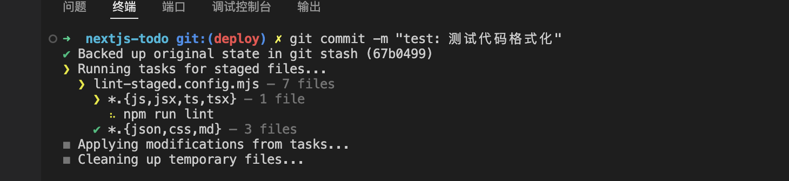

# Next.js 项目代码格式化配置指南

这篇文章将详细介绍 Next.js 项目的代码格式化配置，需要使用 [`ESLint`](https://eslint.org/)、[`Prettier`](https://prettier.io/)、[`Husky`](https://typicode.github.io/husky/)、[`lint-staged`](https://github.com/lint-staged/lint-staged) 等工具。

## 创建 Next.js 项目

首先我们使用 `create-next-app` 工具创建的 Next.js 项目，并且在询问是否使用 ESLint  时，选择 `YES`

```
Would you like to use ESLint? No / Yes
```

`create-next-app` 帮我们安装了 [`@eslint/eslintrc`](https://github.com/eslint/eslintrc)、[`eslint`](https://github.com/eslint/eslint) 和 `eslint-config-next` 三个 eslint 相关的库

```json
{
  "devDependencies": {
    "@eslint/eslintrc": "^3",
    "eslint": "^9",
    "eslint-config-next": "15.3.2",
  },
}
```

和生成一个配置文件 `eslint.config.mjs`

```js
import { dirname } from "path";
import { fileURLToPath } from "url";
import { FlatCompat } from "@eslint/eslintrc";

const __filename = fileURLToPath(import.meta.url);
const __dirname = dirname(__filename);

const compat = new FlatCompat({
  baseDirectory: __dirname,
});

const eslintConfig = [
  ...compat.extends("next/core-web-vitals", "next/typescript"),
];

export default eslintConfig;
```

### `eslint-config-next`

`eslint-config-next` 是 Next.js 使用 ESLint 的工具集，从 `eslint-config-next` 的 `package.json` 文件，可以看出它包含了各种插件和规则库，比如我们经常在 React 项目里使用的 [`eslint-plugin-react`](https://github.com/jsx-eslint/eslint-plugin-react)。

> `@typescript-eslint/parser` 和 `@typescript-eslint/eslint-plugin` 是 ESLint 解析 Typescript 的两个插件。`eslint-config-next` 也自动帮我们设置好了

```json
{
  "name": "eslint-config-next",
  "version": "15.3.2",
  "dependencies": {
    "@next/eslint-plugin-next": "15.3.2",
    "@rushstack/eslint-patch": "^1.10.3",
    "@typescript-eslint/eslint-plugin": "^5.4.2 || ^6.0.0 || ^7.0.0 || ^8.0.0",
    "@typescript-eslint/parser": "^5.4.2 || ^6.0.0 || ^7.0.0 || ^8.0.0",
    "eslint-import-resolver-node": "^0.3.6",
    "eslint-import-resolver-typescript": "^3.5.2",
    "eslint-plugin-import": "^2.31.0",
    "eslint-plugin-jsx-a11y": "^6.10.0",
    "eslint-plugin-react": "^7.37.0",
    "eslint-plugin-react-hooks": "^5.0.0"
  },
  "peerDependencies": {
    "eslint": "^7.23.0 || ^8.0.0 || ^9.0.0",
    "typescript": ">=3.3.1"
  },
  "peerDependenciesMeta": {
    "typescript": {
      "optional": true
    }
  }
}
```

### `@eslint/eslintrc`

[`@eslint/eslintrc`](https://github.com/eslint/eslintrc) 是 ESLint 用来将以前 ESLintRC 风格的配置文件（`.eslintrc.js`） 转换为扁平（Flat）配置文件（`eslint.config.js`）的工具。`ESLint 9` 之后，`ESLint` 要求使用扁平的配置文件，`eslint.config.js/mjs/cjs`。而 `eslint-config-next` 使用的还是以前的 ESLintRC 风格的 ESLint 配置文件，所以 Next.js 也使用这个库进行转换。用法见上面的  `eslint.config.mjs` 文件。

#### ESLintRC Config vs Flat Config

ESLintRC 是基于“继承和字符串配置”的老式风格，Flat Config 是基于“模块导入和显式结构”的现代配置方式。

它们的区别如下：

| **特性**             | **ESLintRC Config（旧）**           | **Flat Config（新，ESLint 9 默认）**   |
| -------------------- | ----------------------------------- | -------------------------------------- |
| 配置文件名           | `.eslintrc.js/json/yml`             | `eslint.config.js/mjs/cjs`             |
| 导出方式             | `module.exports = {}`               | `export default [ ... ]` (数组)        |
| 配置结构             | 嵌套对象（基于继承）                | 扁平数组（逐层合并）                   |
| 插件机制             | 使用 `plugins` 和 `extends` 字符串  | 显式导入插件模块、函数                 |
| 文件匹配             | 使用 `overrides.files` 等 glob 模式 | 使用 `files: ["**/*.ts"]` 字段直接匹配 |
| 支持范围限定（root） | 有 `root: true` 来终止查找          | 自动停止，无需设置                     |
| 执行性能             | 配置动态解析，有一定开销            | 编译期结构明确，更快                   |

示例对比如下：

**ESLintRC Config 示例**

```js
// .eslintrc.js
module.exports = {
  root: true,
  parser: "@typescript-eslint/parser",
  plugins: ["@typescript-eslint"],
  extends: [
    "eslint:recommended",
    "plugin:@typescript-eslint/recommended",
  ],
  rules: {
    semi: ["error", "always"],
  },
  overrides: [
    {
      files: ["*.ts", "*.tsx"],
      rules: {
        "@typescript-eslint/no-unused-vars": "error",
      },
    },
  ],
};
```

**Flat Config 示例**  

```js
// eslint.config.mjs
import js from "@eslint/js";
import tseslint from "typescript-eslint";

export default [
  js.configs.recommended,
  ...tseslint.configs.recommended,
  {
    files: ["**/*.ts", "**/*.tsx"],
    rules: {
      semi: ["error", "always"],
      "@typescript-eslint/no-unused-vars": "error",
    },
  },
];
```

## 安装 `Prettier`

接下来我们需要安装 [`Prettier`](https://prettier.io/) 及相关库

```sh
$ npm install -D prettier eslint-config-prettier eslint-plugin-prettier
```

[**`eslint-config-prettier`**](https://github.com/prettier/eslint-config-prettier)

关闭 ESLint 中与 Prettier 冲突的规则。配置如下：

```js
// eslint.config.mjs
import eslintConfigPrettier from "eslint-config-prettier/flat";

export default [
  // others
  eslintConfigPrettier,
];
```

**[`eslint-plugin-prettier`](https://github.com/prettier/eslint-plugin-prettier)**

让 ESLint 运行 Prettier 并将其作为 ESLint 规则（用于 `eslint --fix`）。配置如下：

```js
// eslint.config.mjs
import eslintPluginPrettierRecommended from 'eslint-plugin-prettier/recommended';

export default [
  // others
  eslintPluginPrettierRecommended,
];
```

### 添加 `Prettier` 配置

根据自己的喜好，[配置 `Prettier`](https://prettier.io/docs/options) 

```js
// prettier.config.mjs
const config = {
  singleQuote: false,
  tabWidth: 2,
  trailingComma: "all",
  printWidth: 120,
  semi: true,
  arrowParens: "avoid",
  bracketSameLine: true,
  plugins: ["prettier-plugin-tailwindcss"],
};

export default config;
```

### 修改 `ESLint` 的配置

修改 ESLint 的配置文件 `eslint.config.mjs`，添加 Prettier 相关的规则

```js
import { dirname } from "path";
import { fileURLToPath } from "url";
import { FlatCompat } from "@eslint/eslintrc";
import eslintConfigPrettier from "eslint-config-prettier/flat";
import eslintPluginPrettierRecommended from "eslint-plugin-prettier/recommended";

const __filename = fileURLToPath(import.meta.url);
const __dirname = dirname(__filename);

const compat = new FlatCompat({
  baseDirectory: __dirname,
});

const eslintConfig = [
  ...compat.extends("next/core-web-vitals", "next/typescript"),
  eslintConfigPrettier,
  eslintPluginPrettierRecommended,
];

export default eslintConfig;
```

## VSCode 设置

### 安装 VSCode 插件

为了能在 VSCode 保存代码时，自动使用 ESLint + Prettier 格式化代码，需要安装  VSCode 三个插件

- [VSCode Plugin: Prettier - Code formatter](https://marketplace.visualstudio.com/items?itemName=esbenp.prettier-vscode)
- [VSCode Plugin: ESLint](https://marketplace.visualstudio.com/items?itemName=dbaeumer.vscode-eslint)
- [VSCode Plugin: Prettier ESLint](https://marketplace.visualstudio.com/items?itemName=rvest.vs-code-prettier-eslint)

### 配置 VSCode

安装上面的插件后，我们还需要设置 VSCode

```json
// .vscode/settings.json
{
  "editor.defaultFormatter": "esbenp.prettier-vscode",
  "[javascript]": {
    "editor.defaultFormatter": "rvest.vs-code-prettier-eslint"
  },
  "[typescript]": {
    "editor.defaultFormatter": "rvest.vs-code-prettier-eslint"
  },
  "[javascriptreact]": {
    "editor.defaultFormatter": "rvest.vs-code-prettier-eslint"
  },
  "[typescriptreact]": {
    "editor.defaultFormatter": "rvest.vs-code-prettier-eslint"
  },
  "editor.formatOnSave": true,
  "eslint.validate": ["javascript", "typescript", "javascriptreact", "typescriptreact"],
  "files.associations": {
    "*.css": "tailwindcss"
  }
}
```

完成上面的配置后，我们保存代码时，VSCode 就会自动校验代码并格式化代码。

## 安装 `Lint-Staged` 和 `Husky`

但是这只能保证我自己写的代码没有格式化问题，但是对于团队的其他人，并不能保证他们提交的代码没有格式化问题。因此我们还需要设置在他们提交代码的时候校验代码并格式化代码。这就需要使用 [`lint-staged`](https://github.com/lint-staged/lint-staged) 和 [`Husky`](https://typicode.github.io/husky/)。

**`lint-staged`**

只对 git staged 的文件进行一些操作，比如校验代码、格式化代码等。使用 **`lint-staged`** 可以避免对项目的所有代码进行代码校验与格式化。

**`Husky`**

可以让我们在提交代码（commit/push）时进行一些操作，比如运行 `lint-staged` 

### 安装

```sh
$ npm i -D husky lint-staged
```

### **`lint-staged`** 配置

`lint-staged` 配置有[多种方式](https://github.com/lint-staged/lint-staged?tab=readme-ov-file#configuration)，为了保持项目风格的统一，我们使用 `lint-staged.config.mjs` 配置文件

```js
// lint-staged.config.mjs
export default lintStagedConfig = {
  "lint-staged": {
    "*.{js,jsx,ts,tsx}": ["npm run lint-fix"],
    "*.{json,css,md}": ["npm run format-fix"],
  },
};
```

添加 `NPM Scripts`

```json
// package.json
{
  "name": "nextjs-todo",
  "version": "0.1.0",
  "private": true,
  "type": "module",
  "scripts": {
    "lint-fix": "next lint --fix --ext .js,.ts,.jsx,.tsx",
    "format-fix": "prettier --write ."
  }
}
```

### **`Husky`** 配置

配置 `Husky` 很简单，安装 `Husky` 之后，运行

```sh
$ npx husky init
```

他将创建 `.husky/pre-commit` 文件并且在 `package.json` 里添加 `"prepare": "husky"` NPM Scripts。

我们只要修改 `pre-commit` 文件，让他运行 `lint-staged` 命令

```sh
#!/usr/bin/env sh
npx lint-staged
```

当我们提交代码时， `Lint-Staged` 和 `Husky` 将帮助我们进行代码校验与格式化，保障提交的代码没有格式问题。



## 其他

至此，我们完成了 Next.js 项目代码格式化配置。

但是我们还可以根据自己的需求，添加更多的代码校验与格式化的功能。比如 `import` 语句排序

### `eslint-plugin-simple-import-sort`

#### 安装

```sh
$ npm i -D eslint-plugin-simple-import-sort
```

#### 配置

```js
import simpleImportSort from "eslint-plugin-simple-import-sort";

export default [
  {
    name: "import-sort",
    plugins: {
      "simple-import-sort": simpleImportSort,
    },
    rules: {
      "simple-import-sort/imports": "error",  // 对 import 进行排序
      "simple-import-sort/exports": "error"   // 对 export 进行排序（可选）
    }
  }
];
```

### 更多

.......

## References

- [ESLint](https://eslint.org/)
- [Prettier](https://prettier.io/)
- [Husky](https://typicode.github.io/husky/)
- [`lint-staged`](https://github.com/lint-staged/lint-staged)
- [Stylelint](https://stylelint.io/)
- [`@eslint/eslintrc`](https://github.com/eslint/eslintrc)
- [`eslint-config-prettier`](https://github.com/prettier/eslint-config-prettier)
- [`eslint-plugin-prettier`](https://github.com/prettier/eslint-plugin-prettier)
- [`prettier-eslint`](https://github.com/prettier/prettier-eslint)
- [`eslint-plugin-simple-import-sort`](https://github.com/lydell/eslint-plugin-simple-import-sort)
- [VSCode Plugin: Prettier - Code formatter](https://marketplace.visualstudio.com/items?itemName=esbenp.prettier-vscode)
- [VSCode Plugin: ESLint](https://marketplace.visualstudio.com/items?itemName=dbaeumer.vscode-eslint)
- [VSCode Plugin: Prettier ESLint](https://marketplace.visualstudio.com/items?itemName=rvest.vs-code-prettier-eslint)