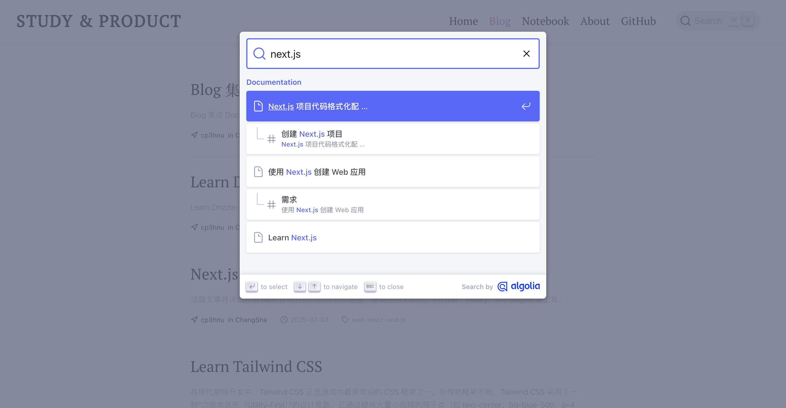
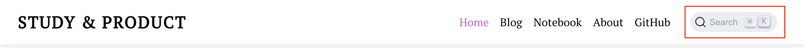
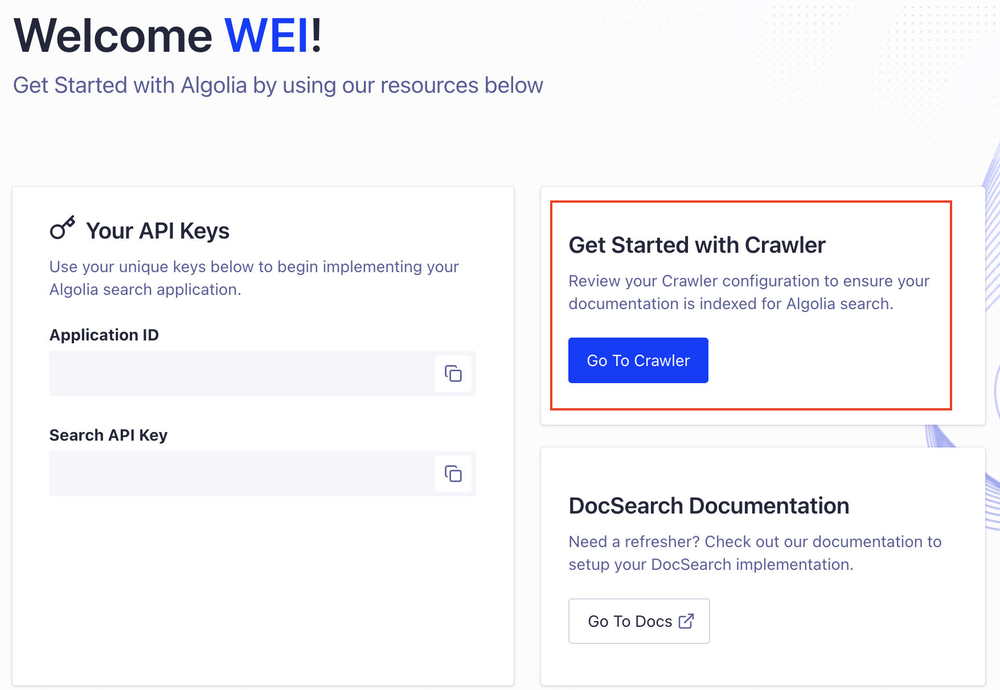
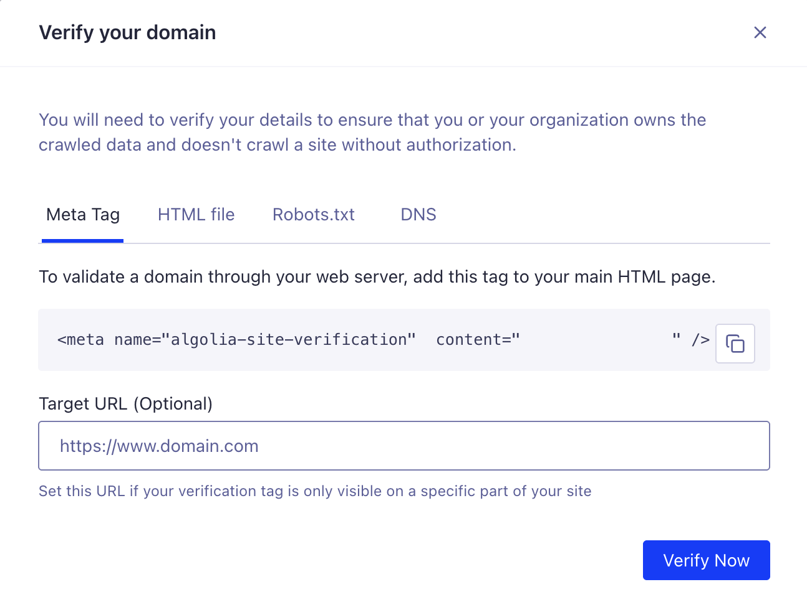
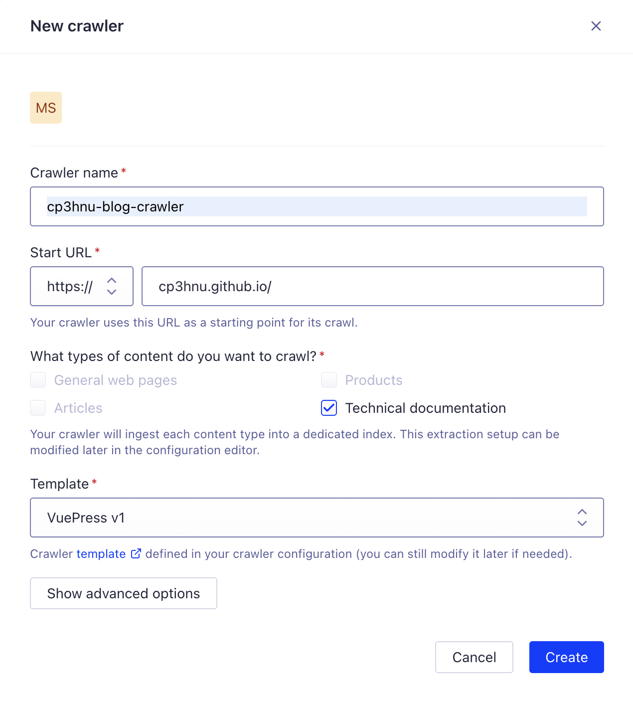
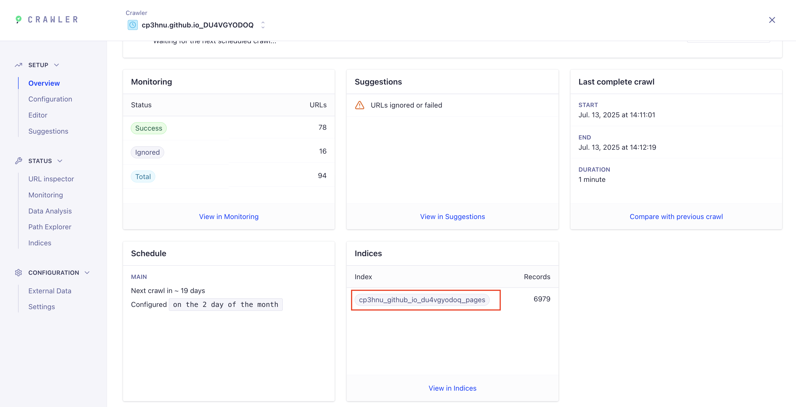

# Blog 集成 Algolia DocSearch

我们在浏览技术网站的时候，发现现在很多的技术网站（比如：Vue、React、Vite）都使用了 [Algolia DocSearch](https://github.com/algolia/docsearch) 对他们提供的内容进行搜索。今天我打算在本博客网站上也集成 Algolia DocSearch，以便对博客内容进行更好的搜索（以前只能搜索文章标题）。

本博客于 2019年使用 [VuePress v1](https://v1.vuepress.vuejs.org/zh/) + [博客主题](https://v1.vuepress.vuejs.org/zh/theme/blog-theme.html) 搭建的。因为该 [博客主题](https://github.com/vuepress/vuepress-theme-blog) 一直没有升级以支持 VuePress v2 以及之后的 [VitePress](https://vitepress.dev/)，而我也非常喜欢该主题的风格，因此也没有升级到 VuePress v2。以后打算改用 [VitePress](https://vitepress.dev/) 或者 [Astro](https://astro.build/)。

通过查看 [Algolia DocSearch](https://github.com/algolia/docsearch) 的 GitHub 文档，我原以为只需 1~2 个小时就能集成 Algolia DocSearch，结果花了我一整个周末才搞定。实现的过程中也踩了不少的坑，因此想通过这篇文章记录下来。

实现的最终效果如下：



## 接入 DocSearch

>  [VuePress v1 的默认主题](https://v1.vuepress.vuejs.org/zh/theme/default-theme-config.html#algolia-%E6%90%9C%E7%B4%A2) 已经集成了 Algolia DocSearch，但是 [博客主题](https://github.com/vuepress/vuepress-theme-blog) 不支持，需要自己手动配置。

根据 [Algolia DocSearch](https://github.com/algolia/docsearch) 的 GitHub 文档，接入 DocSearch 很简单

1. 安装 DocSearch

```sh
$ npm install @docsearch/js@3
```

2. 创建 [Algolia DocSearch 项目](https://docsearch.algolia.com/apply)
3. 添加 DocSearch 挂载的容器

```html
<div id="docsearch"></div>
```

4. 在项目入口添加一段脚本

```js
import docsearch from '@docsearch/js';

import '@docsearch/css';

docsearch({
  container: '#docsearch',
  appId: 'YOUR_APP_ID',
  indexName: 'YOUR_INDEX_NAME',
  apiKey: 'YOUR_SEARCH_API_KEY',
});
```

`appId` 和 `apiKey` 在刚才创建的 Algolia DocSearch 项目中可以找到

`container` 就是 DocSearch 挂载的容器，支持 CSS 选择器或者Element 元素。

`indexName` 是什么？文档中没有说明，即便是 [DocSearch 官方文档 ](https://docsearch.algolia.com/docs/api#indexname)也只有简单的描述

```
Your Algolia index name.
```

先不管了，空着。

回到我们的博客，界面上已经有了 DocSearch。但是搜索没有数据。



## Crawler

### `indexName`

没有查询到数据的根源就在于没有设置 `indexName` 参数。那 `indexName` 参数究竟代表什么？

其实 `indexName` 就是你的网站内容索引数据库。就像后台 API 需要从数据库里获取数据一样，DocSearch 也是需要从索引数据库里检索数据。那这个数据库从何而来？DocSearch 通过 Crawler 抓取您的网页内容，生成索引数据库。

### 创建 Crawler

去到项目的[工作台](https://dashboard.algolia.com/)，点击 "Go To Crawler"，创建一个 Crawler



首先添加您网站的域名，并进行认证（需要证明是您的网站），Algolia 提供了四种认证方式：

- `Meta Tag`
- `HTML file`
- `Robots.txt`
- `DNS`

如果我们能控制源代码，最简单的方式是使用 `Meta Tag`。



添加上面的代码到 HMTL Head 标签下，点击 "Verify Now"。当认证通过后，就可以创建 Crawler。



输入 `Crawler name` 和 `Start URL`，然后选择网页内容类型，这里我选择 "Technical documentation"。对于这个类型，DocSearch 提供了几种 [模版](https://docsearch.algolia.com/docs/templates) 可供选择，我选择 "VuePress v1" 。如果选错了，也没有关系，后面还可以手动修改 Crawler 的配置。

创建好了之后，他会运行测试 crawl，测试 crawl 最多访问 100 个 URL。运行成功后您可以看到一个统计页面（访问了多少了页面，生成了多少个记录），并且生成了一个 `index`。



这个就是要填写的 `indexName` 参数。

将这个值填写到 JS 代码里，运行程序，开始搜索。没有搜索到结果，并且控制台报错：

```
Uncaught (in promise) TypeError: Cannot read properties of undefined (reading 'lvl0')
```

出错原因是索引（Index）数据库里的数据没有返回 **hierarchy** 字段，导致读取 **hierarchy.lvl0** 时报错。根本原因可能是我在创建 Crawrler 时，网页内容类型（What types of content do you want to crawl?）选择了 "General web pages"。如果您和我一样也选错了类型，不要慌，我们还可以手动修改 Crawler 配置。

## 手动配置 Crawler

进入 Crawler 页面，选择 "Configuration" 进行可视化配置，选择 "Editor" 进行代码配置。我们直接选择代码配置，他的功能更全。复制 [Vuepress v1 Template](https://docsearch.algolia.com/docs/templates#vuepress-v1-template) 的配置到 Editor。

```js
new Crawler({
  appId: 'YOUR_APP_ID',
  apiKey: 'YOUR_API_KEY',
  rateLimit: 8,
  maxDepth: 10,
  schedule: "on the 2 day of the month",
  startUrls: ['https://cp3hnu.github.io/'],
  sitemaps: ['https://YOUR_WEBSITE_URL/sitemap.xml'],
  discoveryPatterns: ['https://YOUR_WEBSITE_URL/**'],
  actions: [
    {
      indexName: 'cp3hnu_github_io_du4vgyodoq_pages',
      pathsToMatch: ['https://cp3hnu.github.io/**'],
      recordExtractor: ({ $, helpers }) => {
        return helpers.docsearch({
          recordProps: {
            lvl0: {
              selectors: 'p.sidebar-heading.open',
              defaultValue: 'Documentation',
            },
            lvl1: '.content__default h1',
            lvl2: '.content__default h2',
            lvl3: '.content__default h3',
            lvl4: '.content__default h4',
            lvl5: '.content__default h5',
            content: '.content__default p, .content__default li',
          },
          indexHeadings: true,
          aggregateContent: true,
        });
      },
    },
  ],
  initialIndexSettings: {
    cp3hnu_github_io_du4vgyodoq_pages: {
      attributesForFaceting: ['type', 'lang'],
      attributesToRetrieve: ['hierarchy', 'content', 'anchor', 'url'],
      attributesToHighlight: ['hierarchy', 'hierarchy_camel', 'content'],
      attributesToSnippet: ['content:10'],
      camelCaseAttributes: ['hierarchy', 'hierarchy_radio', 'content'],
      searchableAttributes: [
        'unordered(hierarchy_radio_camel.lvl0)',
        'unordered(hierarchy_radio.lvl0)',
        'unordered(hierarchy_radio_camel.lvl1)',
        'unordered(hierarchy_radio.lvl1)',
        'unordered(hierarchy_radio_camel.lvl2)',
        'unordered(hierarchy_radio.lvl2)',
        'unordered(hierarchy_radio_camel.lvl3)',
        'unordered(hierarchy_radio.lvl3)',
        'unordered(hierarchy_radio_camel.lvl4)',
        'unordered(hierarchy_radio.lvl4)',
        'unordered(hierarchy_radio_camel.lvl5)',
        'unordered(hierarchy_radio.lvl5)',
        'unordered(hierarchy_radio_camel.lvl6)',
        'unordered(hierarchy_radio.lvl6)',
        'unordered(hierarchy_camel.lvl0)',
        'unordered(hierarchy.lvl0)',
        'unordered(hierarchy_camel.lvl1)',
        'unordered(hierarchy.lvl1)',
        'unordered(hierarchy_camel.lvl2)',
        'unordered(hierarchy.lvl2)',
        'unordered(hierarchy_camel.lvl3)',
        'unordered(hierarchy.lvl3)',
        'unordered(hierarchy_camel.lvl4)',
        'unordered(hierarchy.lvl4)',
        'unordered(hierarchy_camel.lvl5)',
        'unordered(hierarchy.lvl5)',
        'unordered(hierarchy_camel.lvl6)',
        'unordered(hierarchy.lvl6)',
        'content',
      ],
      distinct: true,
      attributeForDistinct: 'url',
      customRanking: [
        'desc(weight.pageRank)',
        'desc(weight.level)',
        'asc(weight.position)',
      ],
      ranking: [
        'words',
        'filters',
        'typo',
        'attribute',
        'proximity',
        'exact',
        'custom',
      ],
      highlightPreTag: '<span class="algolia-docsearch-suggestion--highlight">',
      highlightPostTag: '</span>',
      minWordSizefor1Typo: 3,
      minWordSizefor2Typos: 7,
      allowTyposOnNumericTokens: false,
      minProximity: 1,
      ignorePlurals: true,
      advancedSyntax: true,
      attributeCriteriaComputedByMinProximity: true,
      removeWordsIfNoResults: 'allOptional',
    },
  },
});
```

### Crawler 的配置项

Crawler 的配置项比较多，完整列表请参考 [Crawler Configuration](https://www.algolia.com/doc/tools/crawler/apis/configuration/)。这里讲解几个比较重要的。

#### `startUrls`

Crawler 的入口 URLs，一般设置为您网站的域名。

#### `discoveryPatterns`

指示 Crawler 应该访问哪些网页，支持 [`micromatch`](https://github.com/micromatch/micromatch)。Crawler 会提取这些页面链接的页面，但不会从这些中间页面提取记录时。比如博客列表页面：`https://cp3hnu.github.io/blog/page/xx`。

#### `exclusionPatterns`

告诉 Crawler 要忽略或排除哪些 URL。支持 [`micromatch`](https://github.com/micromatch/micromatch)。后面有用到。

#### `sitemaps`

在 `sitemaps` 中找到的 URL 被视为 Crawler 的起始点。后面有用到。

#### `actions`

确定哪些网页以何种方式转换成 Algolia 记录。这是一个对象数组，也包含很多[参数](https://www.algolia.com/doc/tools/crawler/apis/configuration/actions/)，常用的有下面三个参数：

##### `indexName`

操作对应的 Index（索引数据库）的名称

##### `pathsToMatch`

操作应该处理哪些网页。支持 [`micromatch`](https://github.com/micromatch/micromatch)。

##### `recordExtractor`

一个自定义 Javascript 函数，他从页面中提取所需的内容，生成 Algolia 记录，存于索引数据库里。这个函数返回 JSON 对象数组或空数组，如果是一个空数组，表示跳过该页。

Algolia  提供了多个内置的函数帮助我们快速集成，可以通过 `recordExtractor` 的 `helpers` 参数访问 。`helpers.docsearch` 内置函数用于 DocSearch 集成，他提取文档的 H0~H5 标题以及文档内容，生成  Algolia 记录。

**这里的关键就是，为了让 `helpers.docsearch` 知道哪些是 H0~H5 标题以及文档内容，需要指定 `lvl0 ~ lvl5` 以及 `content` 对应的 CSS 选择器**。对于 VuePress v1，他的配置应该是这样的：

```
{
  lvl0: {
    selectors: 'p.sidebar-heading.open',
    defaultValue: 'Documentation',
  },
  lvl1: '.content__default h1',
  lvl2: '.content__default h2',
  lvl3: '.content__default h3',
  lvl4: '.content__default h4',
  lvl5: '.content__default h5',
  content: '.content__default p, .content__default li',
}
```

关于 `helpers.docsearch` 函数的更多详情，请参考 [Record Extractor](https://docsearch.algolia.com/docs/record-extractor/#recordprops-api-reference)。

#### `initialIndexSettings`

Crawler 索引数据库的配置，参数更多，完整列表请参考 [Crawler Index Settings Parameters](https://www.algolia.com/doc/api-reference/settings-api-parameters/)。

##### `attributesToRetrieve`

[`attributesToRetrieve`](https://www.algolia.com/doc/api-reference/api-parameters/attributesToRetrieve/) 参数控制抓取哪些属性，不抓取哪些属性。

```js
{
  attributesToRetrieve: ['hierarchy', 'content', 'anchor', 'url']
}
```

`hierarchy` 关键，之前的错误

```
Uncaught (in promise) TypeError: Cannot read properties of undefined (reading 'lvl0')
```

就是因为没有抓取到 `hierarchy` 值，导致读取 `hierarchy.lv10` 值时报错。

##### `searchableAttributes`

[`searchableAttributes`](https://www.algolia.com/doc/api-reference/api-parameters/searchableAttributes/) 参数控制搜索时匹配哪些属性。数量越少，检索速度越快。越排在前面的属性优先级越高。DocSearch 提供的 VuePress v1 的模板有很多的属性，`hierarchy_radio`、`hierarchy_radio_camel`、`hierarchy_camel` 好像没什么用，文档里也找不到它们的定义，因此我简化为

```js 
{
   searchableAttributes: [
    "unordered(hierarchy.lvl0)",
    "unordered(hierarchy.lvl1)",
    "unordered(hierarchy.lvl2)",
    "unordered(hierarchy.lvl3)",
    "unordered(hierarchy.lvl4)",
    "unordered(hierarchy.lvl5)",
    "unordered(hierarchy.lvl6)",
    "content",
  ],
}
```

`unordered` 是一个 [Modifiers](https://www.algolia.com/doc/api-reference/api-parameters/searchableAttributes/#modifiers)。忽略属性中匹配的位置。默认情况，从属性开头的匹配优先级更高。设置 `unordered` 使所有匹配优先级相等，不管匹配的位置。

##### `attributesToHighlight`

[`attributesToHighlight`](https://www.algolia.com/doc/api-reference/api-parameters/attributesToHighlight/) 控制哪些属性要高亮显示。使用 `highlightPreTag` 和 `highlightPostTag` 元素进行包裹。

```js
{
  attributesToHighlight: ["hierarchy", "content"],
}
```

##### `camelCaseAttributes`

[`camelCaseAttributes`](https://www.algolia.com/doc/api-reference/api-parameters/camelCaseAttributes/) 参数控制拆分哪些驼峰格式属性为多个单词，比如 `camelCaseAttributes` 可以分成 3 个单词，`camel`、`case`、`attributes`， 这个一般用于英语环境中。

```js
camelCaseAttributes: ["hierarchy", "content"],
```

##### `attributeForDistinct` 和 `distinct`

[`attributeForDistinct`](https://www.algolia.com/doc/api-reference/api-parameters/attributeForDistinct/) 和 [`distinct`](https://www.algolia.com/doc/api-reference/api-parameters/distinct/) 两个参数控制分组的属性名称。

所有具有相同 `attributeForDistinct` 值的记录都被视为一个组。一般设置为 `url`

`distinct` 确定搜索结果中每组可以包含多少个变体（variant）。

```js
{
   attributeForDistinct: "url",
   distinct: true,
}
```

##### `ranking`

[`ranking`](https://www.algolia.com/doc/api-reference/api-parameters/ranking/) 参数确定排序方式。一般保留默认的排序即可。

排序策略请参考 [Ranking criteria](https://www.algolia.com/doc/api-reference/api-parameters/ranking/#ranking-criteria) 和 [The eight ranking criteria](https://www.algolia.com/doc/guides/managing-results/relevance-overview/in-depth/ranking-criteria/#attribute-and-proximity-combinations)。

```js
{
  ranking: [
    "words",
    "filters",
    "typo",
    "attribute",
    "proximity",
    "exact",
    "custom",
 ],
}
```

##### `customRanking`

[`customRanking`](https://www.algolia.com/doc/api-reference/api-parameters/customRanking/) 参数确定自定义排名属性。

```js
{
  customRanking: [
    "desc(weight.pageRank)",
    "desc(weight.level)",
    "asc(weight.position)",
  ]
}
```

##### `typoTolerance`

[`typoTolerance`](https://www.algolia.com/doc/api-reference/api-parameters/typoTolerance/) 参数控制是否允许错别字。

## 创建 Sitemaps

通过上一步配置 Crawler，现在搜索时不会报错了，而且可以搜索到内容了，但是在我使用的过程中发现，有些页面的内容搜索不到，通过查看 Crawler 的 `Monitoring tool` 或者 `URL inspector` 发现有些页面并没有被抓取。

原因是 VuePress 是根据 Markdown 文件自动生成 URL，Algolia Crawler 可能不知道（或者会漏掉）某些 URL。

一个解决办法是，手动将漏掉的 URL 添加到 [`extraUrls`](https://www.algolia.com/doc/tools/crawler/apis/configuration/extra-urls/)。

```js
{
  extraUrls: ['https://cp3hnu.github.io/2024/08/23/node-cli/'],
}
```

如果漏掉的 URL 很多，一个一个添加太麻烦了。更好的方式是使用 Sitemaps。Sitemaps 是网站管理员告知搜索引擎，网站有哪些页面可以抓取。Crawler 也使用 Sitemaps 抓取页面内容。

VuePress v1 可以使用 [`vuepress-plugin-sitemap`](https://github.com/ekoeryanto/vuepress-plugin-sitemap) 插件帮我们创建 Sitemaps。

首先安装 `vuepress-plugin-sitemap` 

```sh
$ npm i -D vuepress-plugin-sitemap 
```

然后添加配置

```js
plugins: [
  [
    'sitemap',
    {
      hostname: 'https://cp3hnu.github.io', // ✅ 你的站点地址
    }
  ],
]
```

编译就会生成 `sitemap.xml` 文件，然后我们修改 Crawler 配置。

```js
new Crawler({
  sitemaps: ['https://cp3hnu.github.io/sitemap.xml'],
}
```

点击 "Start Crawling" 重新抓取，此时网站上所有的页面内容都被抓取到了。

## 排除 URL

如果网站上有些内容不想被抓取，有哪些方法呢？我通过熟读 [Algolia Crawler](https://www.algolia.com/doc/tools/crawler/getting-started/overview/) 文档，总结出三种方法，由粗到细：

### `exclusionPatterns`

最简单的方式是使用 [`exclusionPatterns`](https://www.algolia.com/doc/tools/crawler/apis/configuration/exclusion-patterns/) 配置，全局排除 URL，支持 [`micromatch`](https://github.com/micromatch/micromatch)。比如我不想 `https://cp3hnu.github.io/tag/` 下的网页内容被抓取，可以这么设置：

```js
exclusionPatterns: [
  'https://cp3hnu.github.io/tag/**'
]
```

### `actions.pathsToMatch`

如果只是想排除某个 Action 抓取某些页面的内容，可以使用 `actions.pathsToMatch`，也支持 [`micromatch`](https://github.com/micromatch/micromatch)，但是需要是使用 negation 标识（`!`）。比如某些页面的数据格式跟您的 blog 页面的数据格式不同，就可以把这些页面排除出 blog 索引数据库。

```js
actions: [
  {
    indexName: 'cp3hnu_github_io_du4vgyodoq_pages',
    pathsToMatch: ['https://cp3hnu.github.io/**', '!https://cp3hnu.github.io/product/**']
  },
]
```

### `actions.recordExtractor`

如果 `actions.recordExtractor` 返回一个空数组，表示忽略该页面的内容，可以更加细粒度的控制是否抓取某些页面的内容，比如可以根据查询字符串忽略页面的内容。

```js
recordExtractor: ({ url, $, contentLength, fileType }) => {
  // 排除包含特定查询字符串的 URL
  if (url.search && (url.search.includes("Itemid=")) {
    return []; // 返回空数组，表示跳过
  }
}
```


## References

- [Algolia](https://www.algolia.com/)
- [Algolia Document](https://www.algolia.com/doc/)
- [Algolia DocSearch Document](https://docsearch.algolia.com/)
- [`algolia/docsearch`](https://github.com/algolia/docsearch)
- [Algolia Crawler](https://www.algolia.com/doc/tools/crawler/getting-started/overview/)
- [DocSearch 模版](https://docsearch.algolia.com/docs/templates)
- [Crawler Configuration](https://www.algolia.com/doc/tools/crawler/apis/configuration/)
- [Crawler Action Parameters](https://www.algolia.com/doc/tools/crawler/apis/configuration/actions/)
- [Crawler Record Extractor](https://docsearch.algolia.com/docs/record-extractor/#recordprops-api-reference)
- [Crawler Index Settings Parameters](https://www.algolia.com/doc/api-reference/settings-api-parameters/)
- [VuePress v1](https://v1.vuepress.vuejs.org/zh/)
- [VuePress v1 默认主题](https://v1.vuepress.vuejs.org/zh/theme/default-theme-config.html#algolia-%E6%90%9C%E7%B4%A2)
- [VuePress v1 博客主题](https://v1.vuepress.vuejs.org/zh/theme/blog-theme.html)
- [VitePress](https://vitepress.dev/)
- [Astro](https://astro.build/)
- [`ekoeryanto/vuepress-plugin-sitemap`](https://github.com/ekoeryanto/vuepress-plugin-sitemap) 
