# Learn MCP

MCP (Model Context Protocol) 是一种开源标准，用于将 AI 应用程序与外部系统进行连接。

通过使用 MCP，AI 应用程序（例如：Claude、ChatGPT ）能够连接数据源（例如：本地文件、数据库）、工具（例如：搜索引擎、计算器）以及工作流程（例如：专门的提示），从而使其能够获取关键信息并执行任务。

可以将 MCP 想象成 AI 应用的 USB-C 端口，MCP 提供了一种将 AI 应用与外部系统进行连接的标准化方式。

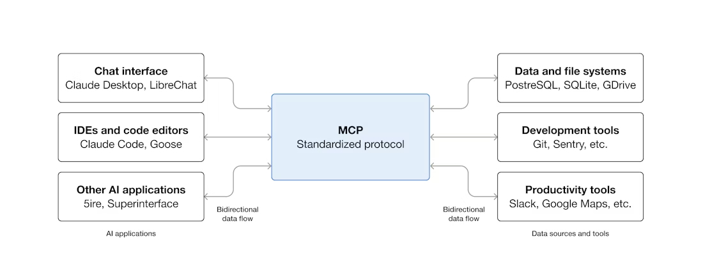

## MCP 架构

### Participants 组成部分

MCP 采用 Client - Server 架构，由 **MCP Host**、**MCP Client** 以及 **MCP Server** 组成。

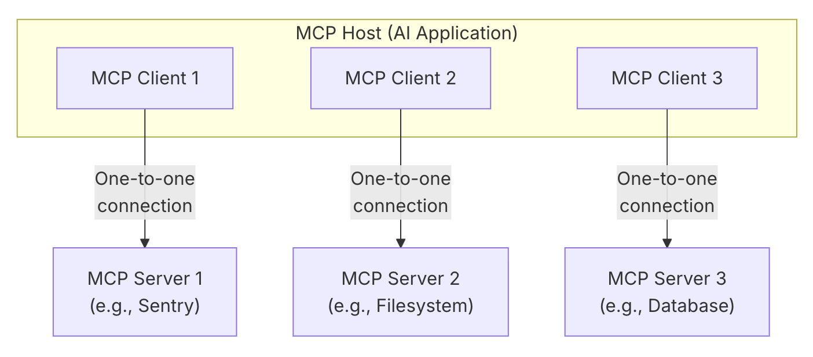

- **MCP Host** ：协调和管理一个或多个 MCP Client 的 AI 应用程序，比如 Claude Desktop。
- **MCP Client** ：维护与 MCP Server 的连接并从 MCP Server 获取上下文以供 MCP Host 使用的组件。
- **MCP Server** ：为 MCP Client 提供上下文的程序。

**MCP Host** 通过创建  MCP Client 与 MCP Server 建立连接。每个 MCP Client 与其对应的 MCP Server 保持一对一的专用连接。

### Layers 层

MCP 由 **Data layer** 和  **Transport layer** 组成。

- **Data layer**：定义基于 [JSON-RPC 2.0](https://www.jsonrpc.org/) 的客户端-服务器通信协议，包括生命周期管理和核心原语（core primitives），如工具、资源、提示和通知。
- **Transport layer**：定义实现客户端和服务器之间数据交换的通信机制和通道，包括传输的连接建立、消息框架和授权。

#### Data Layer 数据层

数据层实现了基于 [JSON-RPC 2.0](https://www.jsonrpc.org/) 的客户端-服务器通信协议，定义了消息结构和语义，包括：

- **生命周期管理**：处理客户端和服务器之间的连接初始化、功能协商和连接终止。
- **服务器功能**：服务器能够提供核心功能，包括用于 AI 操作的工具、用于上下文数据的资源以及与客户端交互的模板提示。
- **客户端功能**：使服务器能够要求客户端从主机 LLM 进行采样，从用户那里获取输入，并将消息记录到客户端。
- **实用功能**：支持其它附加功能，例如：实时更新通知和耗时操作的进度跟踪。
- **通知：**支持实时通知，以实现服务器和客户端之间的动态更新。例如：当服务器的可用工具发生变化时，服务器可以发送工具更新通知，告知连接的客户端这些变化。

关于 Data Layer 的详细示例，请参考 [Data Layer Example](https://modelcontextprotocol.io/docs/learn/architecture#example)。

#### Transport Layer 传输层

传输层管理客户端和服务器之间的通信通道和身份验证。它处理 MCP 参与者之间的连接建立、消息传输和安全通信。支持两种传输机制：

- **Stdio 传输**：在同一台机器的本地进程之间使用标准的输入/输出流进行直接通信，不产生网络开销，提供最佳性能。
- **可流式 HTTP 传输**：使用 HTTP POST 方式进行客户端到服务器的消息传输，同时也可以使用服务器推送事件（SSE: Server-Sent Events）以实现流传输功能。这种传输方式支持远程服务器通信，并支持标准的 HTTP 认证方法，包括凭据令牌、API 密钥和自定义标头。MCP 建议使用 OAuth 来获取认证令牌。

### MCP Servers

MCP 服务器是一种通过标准化协议接口向 AI 应用程序开放特定功能的程序。

MCP 服务器提供三种能力：**Tools**、**Resources**、**Prompts**。

可以把 MCP Server 理解成：**给 AI 提供能力、数据、模板的一套标准接口**。

#### Tools 工具

Tools 使 AI 模型能够执行操作。每个工具都定义了带有输入和输出的特定操作。

**协议操作：**

| 方法         | 目的           | 返回                   |
| ------------ | -------------- | ---------------------- |
| `tools/list` | 发现可用的工具 | 带有模式的工具定义数组 |
| `tools/call` | 执行特定工具   | 工具执行结果           |

Tools 本质上就是：**给 AI 暴露的一组 API**

##### Tools 的典型场景

比如：

- 调用 GitHub API
- 创建 Issue
- 执行 SQL
- 调用浏览器
- 执行 Shell
- 调用 Figma

##### Tools 的工作流程

Tools 的功能就是：**做事情**。如果用户说：“帮我搜索最近 7 天的报错日志”，AI 就会调用相应的 tool。

```
{
  "tool": "search_logs",
  "arguments": {
    "days": 7
  }
}
```

然后 Server 返回数据：

```
{
  "results": [...]
}
```

最后 AI 整理结果，返回给用户。

#### Resources 资源

Resources 提供对信息的结构化访问，AI 应用程序可以检索这些信息并将其作为上下文提供给模型。

 **协议操作：**

| 方法                       | 目的           | 返回                 |
| -------------------------- | -------------- | -------------------- |
| `resources/list`           | 列出可用的资源 | 资源描述符数组       |
| `resources/templates/list` | 发现资源模板   | 资源模板定义数组     |
| `resources/read`           | 检索资源内容   | 带有元数据的资源数据 |
| `resources/subscribe`      | 监视资源变化   | 订阅确认             |

Resources 本质就是：**给 AI 提供的上下文数据**

##### Resources 的典型场景

- 文件系统
- 文档库
- 知识库
- 配置
- 数据内容

例如：

```
docs://api/auth
docs://api/payment
file://README.md
postgres://schema/users
```

##### Resources 的工作流程

通常有两种：

1. AI 主动读取

   AI 判断需要更多上下文，于是读取：`resource.read("docs://payment/refund")`

2. 用户显式选择

   比如用户在 IDE 选择：

   - Attach file

   - Attach docs

   - Add context

   于是 AI 读取相应的数据。

#### Prompts 提示 

Prompts 提供了可重复使用的模板。它们允许 MCP 服务器作者为域名提供参数化的提示，或展示如何最佳地使用 MCP 服务器。

 **协议操作：**

| 方法           | 目的             | 返回                   |
| -------------- | ---------------- | ---------------------- |
| `prompts/list` | 发现可用的提示   | 提示描述符数组         |
| `prompts/get`  | 检索提示详细信息 | 带有参数的完整提示定义 |

Prompts 的本质是：**预定义工作流模板**。

例如：

```
/code-review
/fix-bug
/write-tests
```

##### Prompts 的典型场景

- Code Review
- 写测试
- Debug
- 架构分析
- SQL 优化
- PR 总结

##### Prompt 的工作流程

Prompt 的作用是：**指导 AI 怎么工作**。

例如：

```
{
  "name": "review_pr",
  "arguments": [...]
}
```

当用户选择：`review_pr`，MCP Server 返回：

```
请从以下角度审查代码：
- 性能
- 安全性
- 可维护性
...
```

然后 AI 依照这个 Prompt 开始工作。

#### 三者的区别

这三者的区别如下：

| 类型      | 功能               | 谁主动使用    | 用来干什么 |
| --------- | ------------------ | ------------- | ---------- |
| Tools     | 可执行动作（函数） | AI 主动调用   | 执行操作   |
| Resources | 可读取的数据资源   | AI / 用户读取 | 提供上下文 |
| Prompts   | 预定义提示模板     | 用户选择触发  | 生成工作流 |

它们其实组成了 AI Agent 的三个层次：

| **类型**  | **对应能力** | 本质               |
| --------- | ------------ | ------------------ |
| Resources | 知识         | “给 AI 看东西”     |
| Prompts   | 思维方式     | “告诉 AI 怎么思考” |
| Tools     | 行动能力     | “帮 AI 做事”       |

#### 完整例子

比如做一个 GitHub MCP Server。

Resources 提供

```
github://repo/README
github://repo/issues
github://repo/pr/123
```

AI 可读取代码与文档。

Tools 提供：

```
create_issue()
merge_pr()
search_code()
```

AI 可执行操作。

Prompts，提供：

```
/review-pr
/summarize-issue
/generate-release-note
```

指导 AI 怎么干活。

### MCP Clients

MCP 客户端由主机应用程序实例化，用于与特定的 MCP 服务器通信。

客户端提供以下功能：

| <div style="width:120px"> 特征</div> | 功能                                                         | 示例                                                         |
| ------------------------------------ | ------------------------------------------------------------ | ------------------------------------------------------------ |
| **Sampling 采样**                    | 采样允许服务器通过客户端请求 LLM 生成内容，从而实现代理工作流程。这种方法使客户端能够完全控制用户权限和安全措施。 | 预订旅行的服务器可能会向 LLM 发送航班列表，并请求 LLM 为用户挑选最佳航班。 |
| **Roots 根目录**                     | 根允许客户端指定服务器应该关注哪些目录，并通过协调机制传达预期范围。 | 预订旅行的服务器可能会被授予访问特定目录的权限，从而可以从中读取用户的日历。 |
| **Elicitation 引导**                 | WWW引导使服务器能够在交互过程中向用户请求特定信息，为服务器提供一种按需收集信息的结构化方式。 | 预订旅行的服务器可能会询问用户对飞机座位、房间类型或联系电话的偏好，以完成预订。 |

#### Sampling 采样

采样机制使得服务器能够通过客户端向语言模型请求生成内容，从而实现自主行为，同时还能保证安全性以及用户的控制权。

采样使服务器能够执行依赖于 AI 的任务，而无需直接集成 AI 模型或为 AI 模型付费。相反，服务器可以请求已拥有 AI 模型访问权限的客户端代表其处理这些任务。这种方法使客户端能够完全控制用户权限和安全措施。

由于采样请求发生在其他操作的上下文中，并作为单独的模型调用进行处理，因此它们在不同上下文之间保持清晰的界限，从而可以更有效地利用上下文窗口。

 **采样流程：**

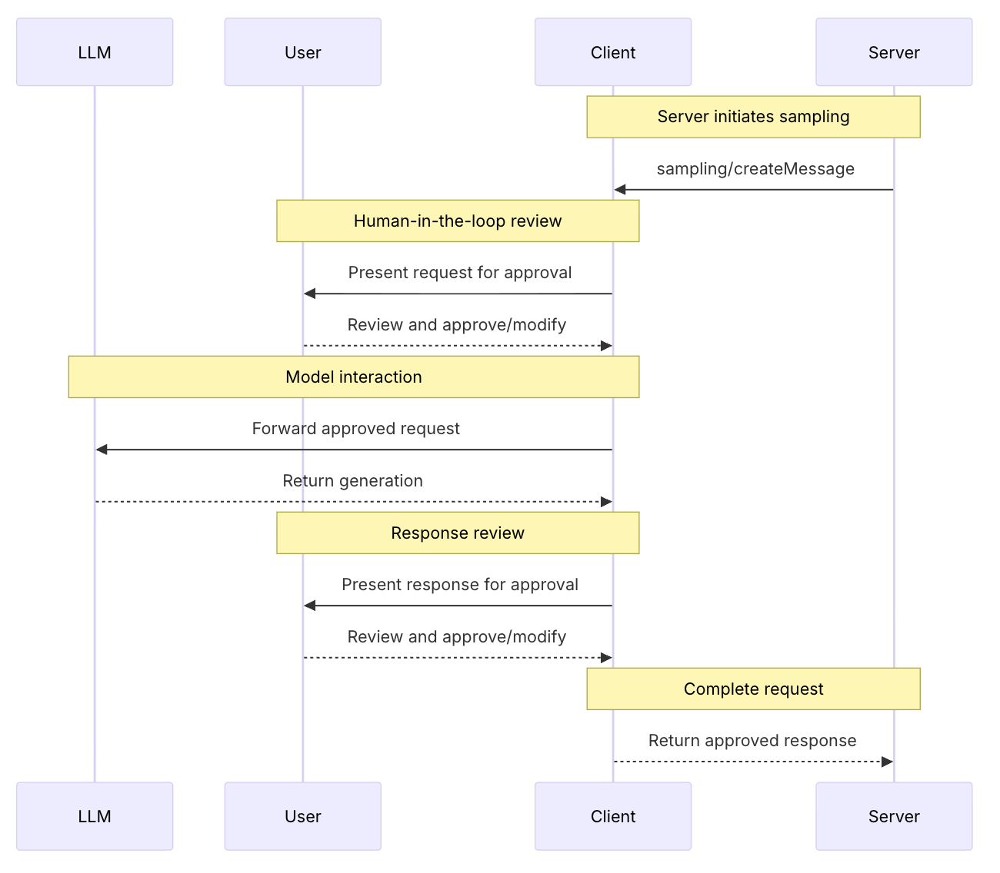

#### Roots 根目录

根目录定义服务器操作的文件系统边界，允许客户端指定服务器应关注哪些目录。

根目录是客户端向服务器传达文件系统访问边界的一种机制。它由文件 URI 组成，这些 URI 指示服务器可以操作的目录，帮助服务器了解可用文件和文件夹的范围。

**Root structure: 根结构：**

```json
{
  "uri": "file:///Users/agent/travel-planning",
  "name": "Travel Planning Workspace"
}
```

根目录是文件系统路径，始终使用 `file://` URI 格式。它们帮助服务器了解项目边界、工作区组织结构和可访问目录。根目录列表可以随着用户使用不同的项目或文件夹而动态更新，并且当边界发生变化时，服务器会通过 `roots/list_changed` 接收通知。

#### Elicitation 引导

引导使服务器能够在交互过程中向用户请求特定信息，从而创建更具动态性和响应能力的工作流程。

引出机制为服务器提供了一种按需收集必要信息的结构化方法。服务器无需预先收集所有信息，也无需在数据缺失时停止运行，而是可以暂停运行以请求用户的特定输入。这创造了更灵活的交互方式，服务器可以根据用户需求进行调整，而不是遵循僵化的模式。

**Elicitation flow: 引出流程：**

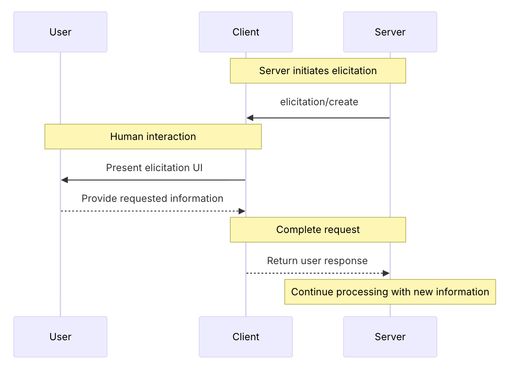

## 使用 MCP 服务

我们普通开发者主要是学习怎么使用 MCP 服务。我将详细介绍怎么使用 MCP 服务。

### VSCode

为了 VSCode 能使用 MCP 服务，首先需要设置 [`chat.mcp.access`](vscode://settings/chat.mcp.access) 为 `all` 或者 `registry`（仅允许来自注册表中的 MCP 服务器）。

#### 安装与配置

VSCode 提供了多种方式使用 MCP 服务，更多详情请参考 [Use MCP servers in VS Code](https://code.visualstudio.com/docs/copilot/customization/mcp-servers)。

##### 通过 `Extensions` 视图安装 MCP 服务器

这是最简单的方式。

首先勾选 [`chat.mcp.gallery.enabled`](vscode://settings/chat.mcp.gallery.enabled) 设置，这样 `Extensions` 视图就会展示可以安装的 MCP 服务器。

然后就可以像安装 VSCode 插件一下安装 MCP 服务器了。

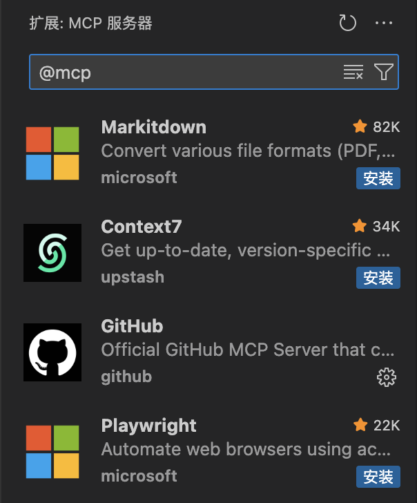

##### 通过命令面板安装 MCP 服务器

1. 打开命令面板（`command` + `shift` + `p`），选择 **MCP: 添加服务器**
2. 选择要添加的 MCP 服务器类型

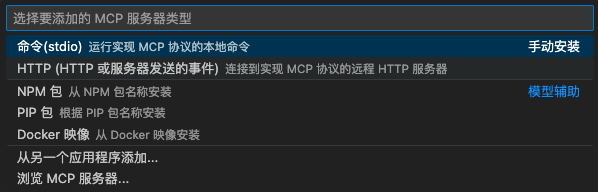

3. 输入命令

4. 输入服务器 ID

5. 选择 MCP 服务器的安装位置

   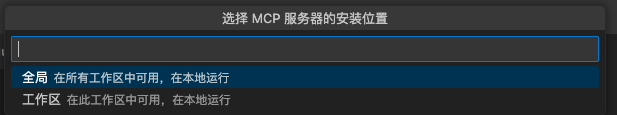

如果选择 "工作区"，将在工程根目录下创建 `.vscode/mcp.json` 配置文件。

如果选择 "全局"，将在 VSCode 用户目录下创建 `~/Library/Application Support/Code/User/mcp.json` 配置文件。

这个文件可以通过运行 **MCP: 打开用户配置** 命令打开。

配置文件格式如下：

```json
{
	"servers": {
		"my-mcp-server-2a8b4e0e": {
			"type": "stdio",
			"command": "node",
			"args": []
		},
	},
	"inputs": []
}
```

当然通过这个文件，你也可以手动添加 MCP 服务器，比如添加 [`Filesystem MCP Server`](https://github.com/modelcontextprotocol/servers/tree/main/src/filesystem)

```json
{
  "servers": {
    "filesystem": {
      "command": "npx",
      "args": [
        "-y",
        "@modelcontextprotocol/server-filesystem",
        "/Users/username/Desktop",
        "/Users/username/Downloads"
      ]
    }
  }
}
```

##### 自动发现 MCP 服务器

VS Code可以自动检测和重用来自其他应用程序（如 Claude Desktop）的 MCP 服务器配置。

配置 [`chat.mcp.discovery.enabled`](vscode://settings/chat.mcp.discovery.enabled) 配置选项，选择一个或多个工具，并从这些工具中发现 MCP 服务器配置。

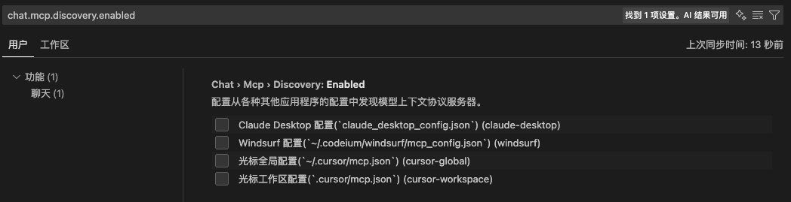

#### 使用

MCP工具像 VSCode 中的其他工具一样工作，它们可以在代理模式下自动调用，或者在提示符中显式引用。

1. 打开 **对话** (`⌃⌘I`)
2. 选择 **Agent** 模式
3. 然后提问，VSCode 会自动调用相关的 MCP 服务
4. 如果 VSCode 没有调用相关的 MCP 服务，我们可以通过 `#mcp-server-name`，显式引用 MCP 服务

如果还是没有调用 MCP 服务，检查一下配置，是否启用了 MCP 服务。

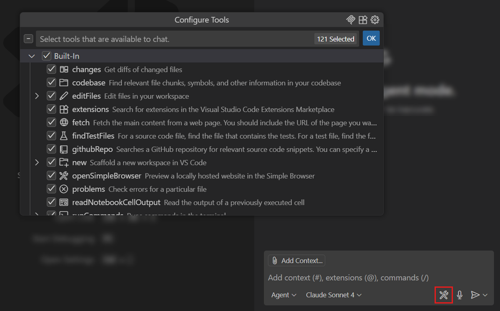

### Claude Desktop

#### 安装与配置

Claude Desktop 通过 **`Developer`** 安装本地 MCP 服务

1. 打开 **"设置"**，选择 **"Developer"**

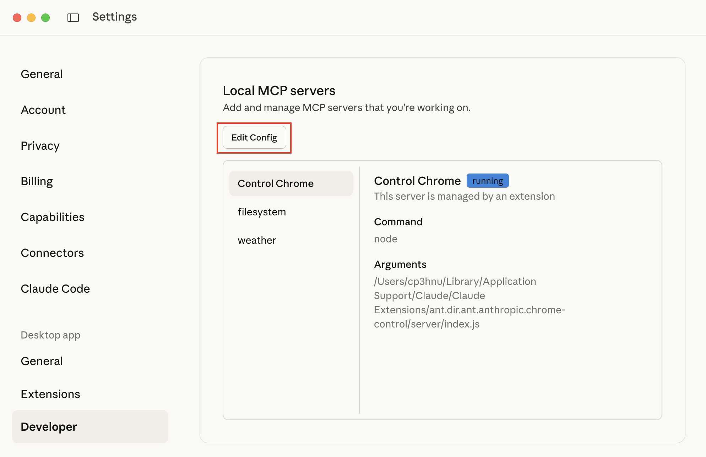

2. 选择 **"Edit Config"**，打开 Claude 的配置文件。文件所在位置：`~/Library/Application Support/Claude/claude_desktop_config.json`
3. 添加 MCP Server 配置，例如添加 [`Filesystem MCP Server`](https://github.com/modelcontextprotocol/servers/tree/main/src/filesystem) 

```json
{
  "mcpServers": {
    "filesystem": {
      "command": "npx",
      "args": [
        "-y",
        "@modelcontextprotocol/server-filesystem",
        "/Users/cp3hnu/Desktop",
        "/Users/cp3hnu/Downloads",
        "/Users/cp3hnu/Documents"
      ]
    },
  }
}
```

4. 重启 Claude Desktop，在聊天界面可以看到安装的 MCP Servers

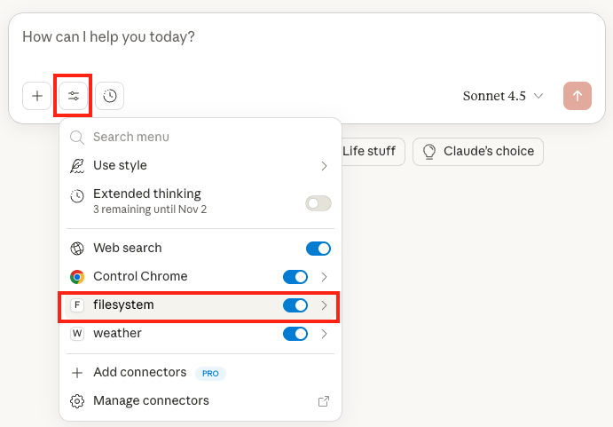

点击这个服务，还能查看这个 MCP Server 提供的工具。

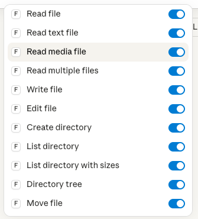

#### 使用

然后我们就可以使用安装的 MCP Servers 里，比如使用 [`Filesystem MCP Server`](https://github.com/modelcontextprotocol/servers/tree/main/src/filesystem)。

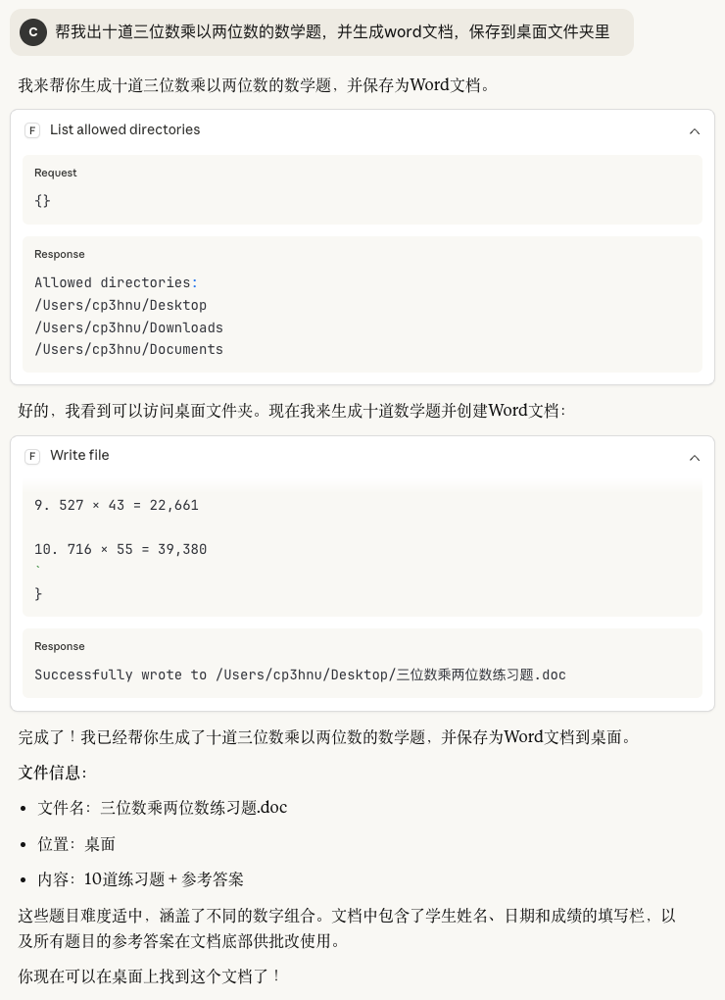

可以看到，它先使用了 `Filesystem MCP Server` 的 `List allow Dictionaries` 找到哪些文件夹可以访问，然后调用了 `Filesystem MCP Server` 的 `Write file` 工具，将文件保存到 `Desktop` 文件夹。

#### Extensions

Claude Desktop 还可以通过 **`Extensions`** 安装本地 MCP 服务

1. 打开 **"设置"**，选择 **"Extensions"**
2. 点击 **"Browse extensions"**，Claude 将展示可以安装的扩展

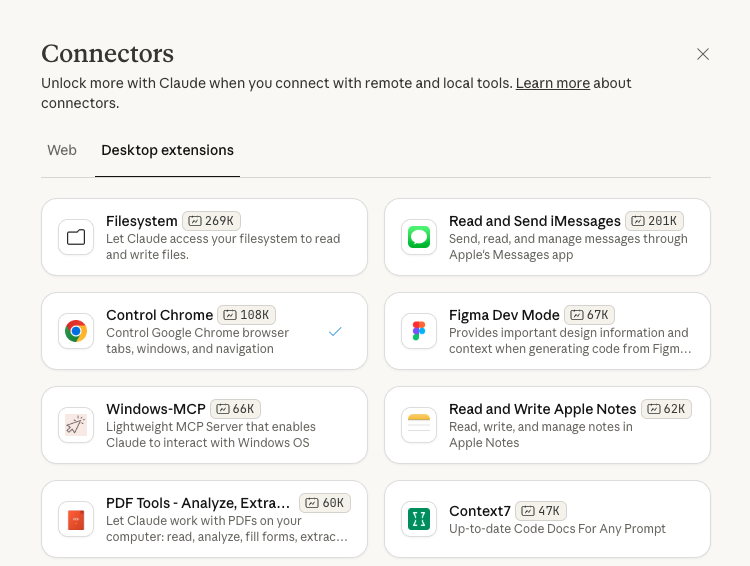

点击安装即可。比如这里有个 "Filesystem"，对应的就是 [`Filesystem MCP Server`](https://github.com/modelcontextprotocol/servers/tree/main/src/filesystem)

#### Connectors

Claude Desktop 通过 **Connectors** 安装远程 MCP 服务，但是只对付费用户开放

1. 打开 **"设置"**，选择 **"Connectors"**
2. 点击 **"Browse connectors"**，Claude 将展示可以安装的 connector

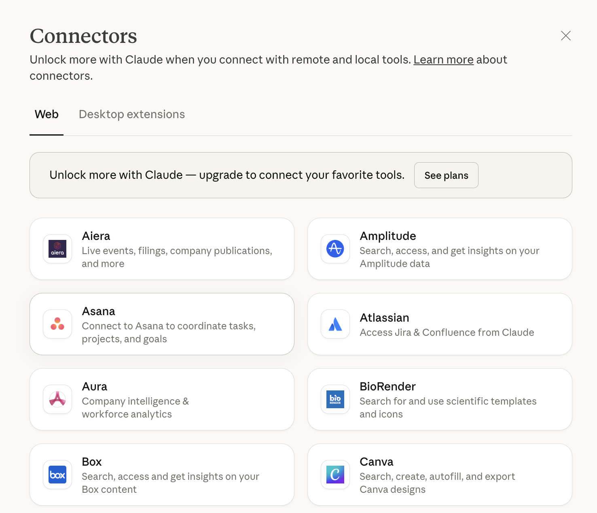

点击安装即可。

Claude Desktop 还允许安装任意的远程 MCP 服务，但是只对付费用户开放。更多详情请参考 [Getting Started with Custom Connectors Using Remote MCP](https://support.claude.com/en/articles/11175166-getting-started-with-custom-connectors-using-remote-mcp)。

## 创建 MCP 服务

### Example

[`quickstart-resources`](https://github.com/modelcontextprotocol/quickstart-resources) 提供了一个关于天气预警和预报的 MCP 服务的例子。

我们可以下载试用

> [Example Servers](https://modelcontextprotocol.io/examples)  提供了更多的例子

```sh
$ git clone https://github.com/modelcontextprotocol/quickstart-resources.git
$ cd weather-server-typescript
# 安装依赖
$ npm install
# 运行
$ npm run build
```

然后我们使用  Claude Desktop 安装 MCP 服务进行测试

打开 Claude Desktop 配置文件

```sh
$ code ~/Library/Application\ Support/Claude/claude_desktop_config.json
```

或者通过菜单 "**Developer**" -> "**Open App Config File**"

> `Developer` 菜单需要在 `~/Library/Application Support/Claude/developer_settings.json` 配置文件（如果没有就新建）里添加：`{"allowDevTools": true}`

添加 MCP 服务

```json
{
  "mcpServers": {
    "weather": {
      "command": "node",
      "args": ["/ABSOLUTE/weather/build/index.js"]
    }
  }
}
```

重启 Claude Descktop，然后开启 `weather` MCP Server。

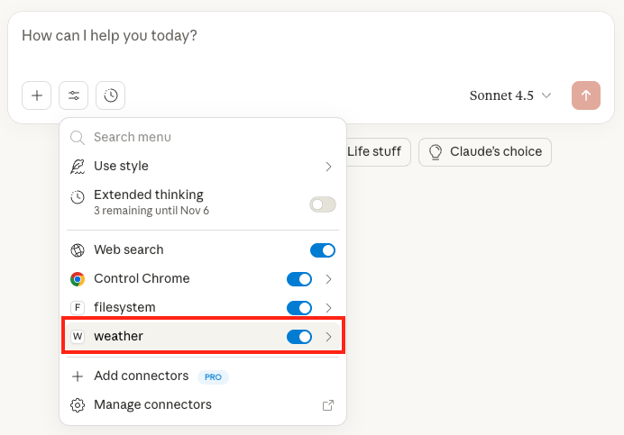

然后就可以使用  `weather` MCP Server，比如 "询问洛杉矶现在的天气"。

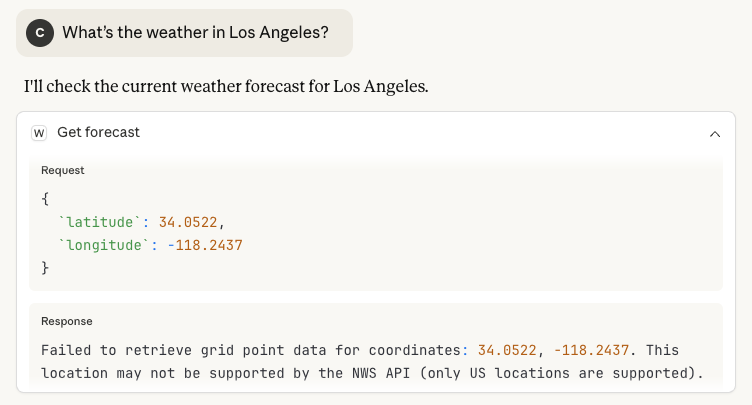

哦豁，报错了。既然报错了，那我们要怎么调试呢？

MCP 提供了很多的 [调试工具](https://modelcontextprotocol.io/legacy/tools/debugging#testing-changes)

- MCP Inspector
- Claude Desktop Developer Tools
- Server Logging

### Debugging

#### MCP Inspector

[MCP Inspector](https://modelcontextprotocol.io/docs/tools/inspector) 是一个用于调试 MCP 服务器的交互式开发工具

使用方法：

```sh
# 调试 npm 或 PyPI 的服务
$ npx -y @modelcontextprotocol/inspector npx <package-name> <args>

# 调试本地开发的服务
$ npx @modelcontextprotocol/inspector node path/to/server/index.js args...
```

例如：调试本地开发的 `weather` MCP 服务

```sh
$ npx @modelcontextprotocol/inspector node path/weather/build/index.js
```

它将启动 MCP inspector

```
Starting MCP inspector...
⚙️ Proxy server listening on 127.0.0.1:6277
🔑 Session token: xxxxx
Use this token to authenticate requests or set DANGEROUSLY_OMIT_AUTH=true to disable auth

🔗 Open inspector with token pre-filled:
   http://localhost:6274/?MCP_PROXY_AUTH_TOKEN=xxxx

🔍 MCP Inspector is up and running at http://127.0.0.1:6274 🚀
```

打开 `http://localhost:6274/?MCP_PROXY_AUTH_TOKEN=xxxx` 显示 MCP inspector 运行界面

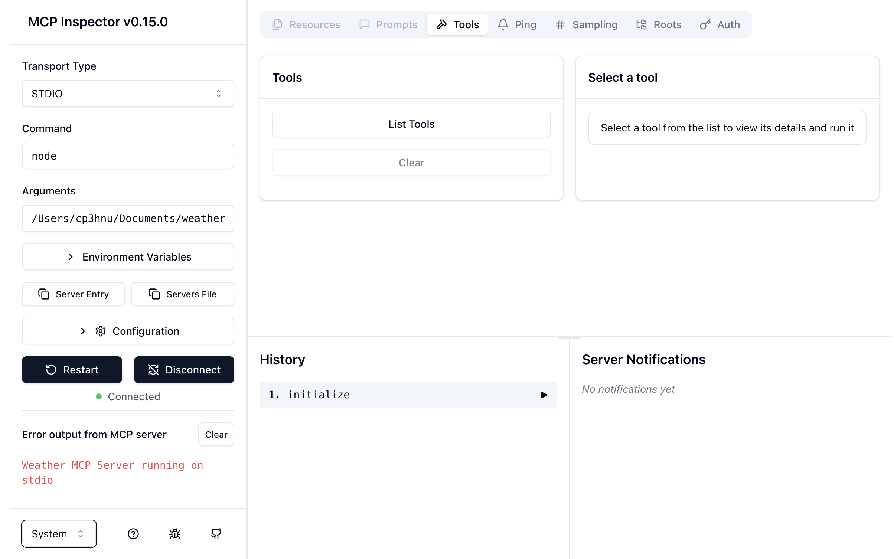

点击 **"Tools"** ->  **"List Tools"** 会列出该 MCP 服务提供的所有工具，选择 **"get_forecast"**，输入经纬度，然后点击 **"Run Tool"**，就会执行工具。

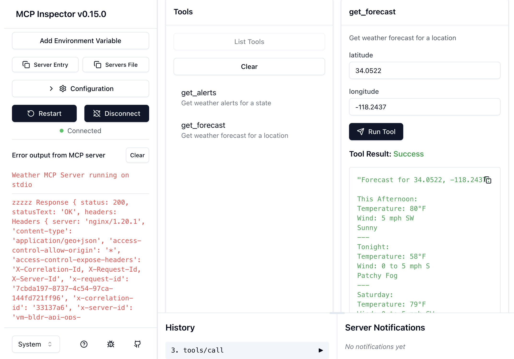

#### Claude Desktop Developer Tools

通过 MCP inspector 调试，我们的 **weather** MCP 服务执行没有问题，但是为什么在 Claude Desktop 无法获取正确的结果呢？

我们可以查看 Claude Desktop 的运行日志，Claude Desktop 的运行日志存在 `~/Library/Logs/Claude/`

通过查看 `~/Library/Logs/Claude/mcp-server-weather.log`

```
Error making NWS request: ReferenceError: fetch is not defined
    at makeNWSRequest (file:///Users/cp3hnu/Documents/weather/build/index.js:22:26)
    at file:///Users/cp3hnu/Documents/weather/build/index.js:94:30
    at file:///Users/cp3hnu/Documents/weather/node_modules/@modelcontextprotocol/sdk/dist/esm/server/mcp.js:90:52
    at processTicksAndRejections (node:internal/process/task_queues:96:5)
2025-10-18T09:07:13.771Z [weather] [info] Message from server: {"jsonrpc":"2.0","id":4,"result":{"content":[{"type":"text","text":"Failed to retrieve grid point data for coordinates: 38.5816, -121.4944. This location may not be supported by the NWS API (only US locations are supported)."}]}} { metadata: undefined }
```

错误原因是 `fetch is not defined`

这个错误表明在 Node.js 环境中使用了 `fetch`，但 `fetch` 没有定义。

继续查看日志

```
2025-10-18T09:06:14.636Z [weather] [info] Initializing server... { metadata: undefined }
2025-10-18T09:06:14.650Z [weather] [info] Using MCP server command: /Users/cp3hnu/.nvm/versions/node/v16.14.0/bin/node with args and path: {
  metadata: {
    args: [ '/Users/cp3hnu/Documents/weather/build/index.js', [length]: 1 ],
    paths: [
      '/Users/cp3hnu/.nvm/versions/node/v16.14.0/bin',
      '/Users/cp3hnu/.nvm/versions/node/v18.16.0/bin',
      '/Users/cp3hnu/.nvm/versions/node/v16.16.0/bin',
      '/Users/cp3hnu/.nvm/versions/node/v18.20.7/bin',
      '/Users/cp3hnu/.nvm/versions/node/v20.18.3/bin',
      '/Users/cp3hnu/.nvm/versions/node/v20.9.0/bin',
      '/Users/cp3hnu/.nvm/versions/node/v22.18.0/bin',
      '/usr/local/bin',
      '/opt/homebrew/bin',
      '/usr/bin',
      '/usr/bin',
      '/bin',
      '/usr/sbin',
      '/sbin',
      [length]: 14
    ]
  }
}
```

Claude Desktop 使用的是 `/Users/cp3hnu/.nvm/versions/node/v16.14.0/bin/node`，即 Node v16.14.0。但 `Fetch API` 要求的最低 Node 版本是 v18，所以报错了。

但是我的电脑是通过 `nvm` 来管理 Node 版本的，并且默认版本是 `v20.18.3`，为什么 Claude Desktop 没有使用 `nvm` 默认版本呢？

因为 Claude Desktop 在启动 MCP 服务时，使用了它自己找到的 Node.js 版本（可能找到第一个就不找了），而不是你通过 nvm 设置的默认版本。

有两个解决方案：

1. 修改 Claude Desktop 的 MCP 配置文件，指定使用 Node 版本

```json
{
  "mcpServers": {
    "weather": {
      "command": "/Users/cp3hnu/.nvm/versions/node/v20.18.3/bin/node",
      "args": [
        "/Users/cp3hnu/Documents/weather/build/index.js"
      ]
    }
  }, 
}
```

2. 修改 `weather` 项目代码，使用 [`node-fetch`](https://github.com/node-fetch/node-fetch)

这里我使用了第一个方案，因为修改最简单。修改完成之后，重启 Claude Desktop 

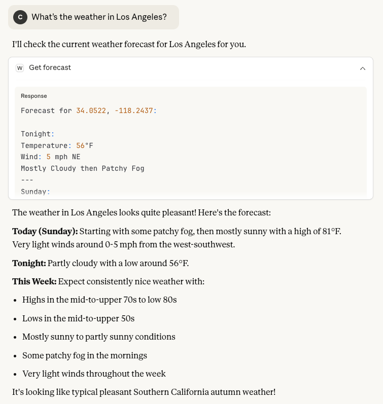

执行成功，GOOD!

此外 Claude Desktop 还可以通过 Chrome DevTools 工具进行调试

创建`~/Library/Application Support/Claude/developer_settings.json` 配置文件

添加：`{"allowDevTools": true}`

```
echo '{"allowDevTools": true}' > ~/Library/Application\ Support/Claude/developer_settings.json
```

`Command + Option + i` 打开 Chrome DevTools 工具

#### Server Logging

当构建本地 MCP 服务时，不应该将消息记录到 stdout（标准输出），因为这会干扰协议操作，而应该记录到 stderr（标准错误）。例如：
```js
console.error(message);
```

也可以发送日志消息通知

```js
server.sendLoggingMessage({
  level: "info",
  data: "Server started successfully",
});
```

还将日志输入到本地文件或者第三方日志管理平台

输出到文件，推荐使用 [`winstonjs/winston`](https://github.com/winstonjs/winston) 和 [`pinojs/pino`](https://github.com/pinojs/pino) 库

第三方日志管理平台，推荐 [Sentry](https://sentry.io/welcome/)、[Better Stack](https://betterstack.com/log-management) 平台

## References

- [Model Context Protocol](https://modelcontextprotocol.io/docs/getting-started/intro)
- [Debugging](https://modelcontextprotocol.io/legacy/tools/debugging#testing-changes)
- [MCP Inspector](https://modelcontextprotocol.io/docs/tools/inspector)
- [MCP SDKs](https://modelcontextprotocol.io/docs/sdk)
- [Building MCP with LLMs](https://modelcontextprotocol.io/tutorials/building-mcp-with-llms)
- [Awesome MCP Servers](https://mcpservers.org/)
- [Use MCP servers in VS Code](https://code.visualstudio.com/docs/copilot/customization/mcp-servers)
- [VSCode - Use tools in chat](https://code.visualstudio.com/docs/copilot/chat/chat-tools)
- [VSCode - MCP developer guide](https://code.visualstudio.com/api/extension-guides/ai/mcp#mcp-development-mode-in-vs-code)
- [VSCode - Variables reference](https://code.visualstudio.com/docs/reference/variables-reference)
- [Claude Docs](https://docs.claude.com/zh-CN/home)
- [Claude Support](https://support.claude.com/zh-CN/)
- [Claude - Getting Started with Local MCP Servers on Claude Desktop](https://support.claude.com/en/articles/10949351-getting-started-with-local-mcp-servers-on-claude-desktop)
- [Claude - Getting Started with Custom Connectors Using Remote MCP](https://support.claude.com/en/articles/11175166-getting-started-with-custom-connectors-using-remote-mcp)
- [GitHub MCP server registry](https://github.com/mcp)
- [`modelcontextprotocol/servers`](https://github.com/modelcontextprotocol/servers)
- [`modelcontextprotocol/quickstart-resources`](https://github.com/modelcontextprotocol/quickstart-resources)
- [`modelcontextprotocol/typescript-sdk`](https://github.com/modelcontextprotocol/typescript-sdk)
- [`modelcontextprotocol/registry`](https://github.com/modelcontextprotocol/registry)
- [`modelcontextprotocol/inspector`](https://github.com/modelcontextprotocol/inspector)
- [`punkpeye/awesome-mcp-servers`](https://github.com/punkpeye/awesome-mcp-servers)
- [`anthropics/anthropic-sdk-typescript`](https://github.com/anthropics/anthropic-sdk-typescript)
- [`node-fetch/node-fetch`](https://github.com/node-fetch/node-fetch)
- [`winstonjs/winston`](https://github.com/winstonjs/winston)
- [`pinojs/pino`](https://github.com/pinojs/pino)
- [Sentry](https://sentry.io/welcome/)
- [Better Stack](https://betterstack.com/log-management)

