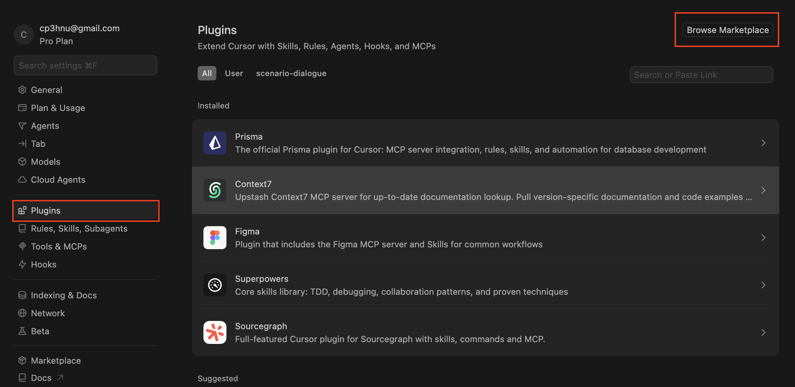
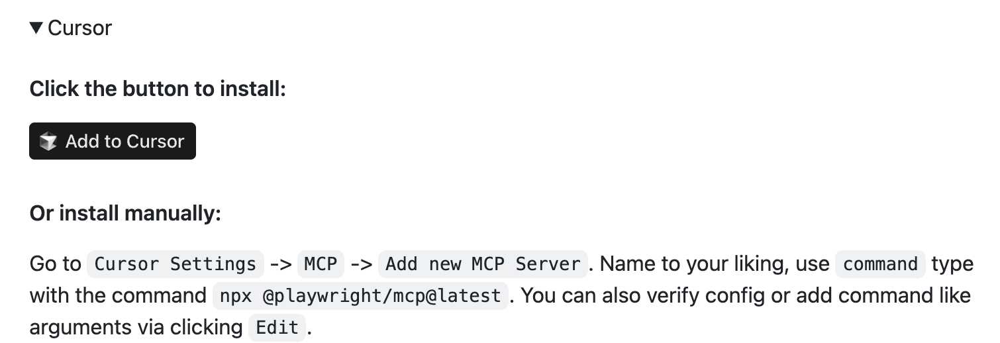
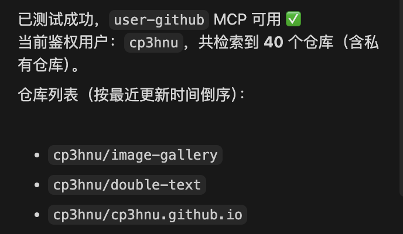
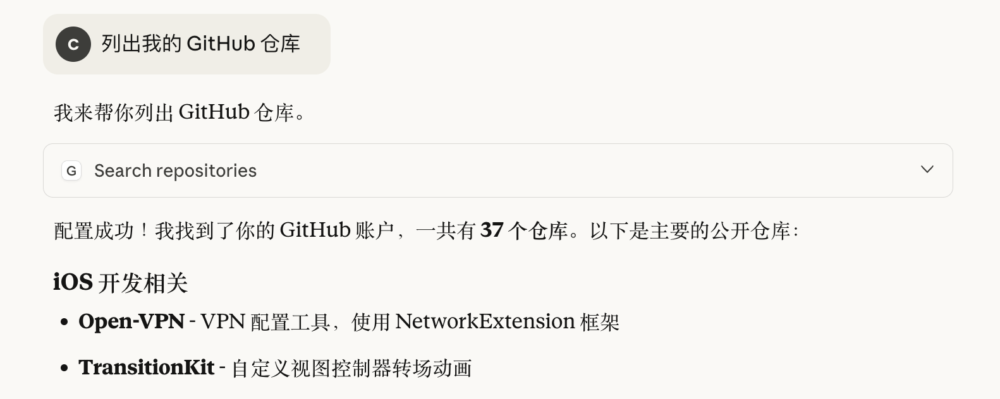
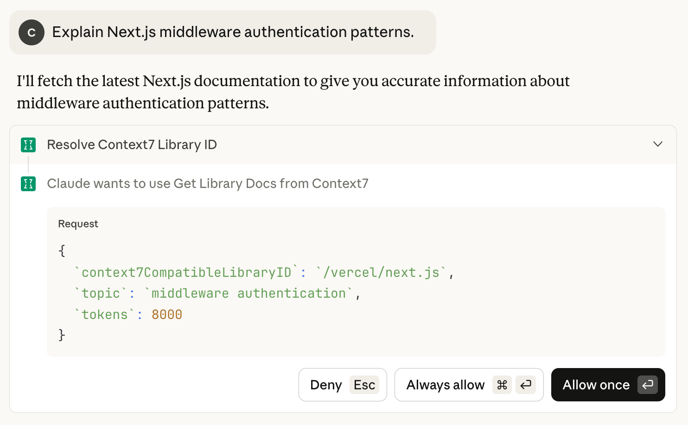

# MCP 服务推荐

[上篇文章](/2025/09/11/nextjs-web/) 我们介绍了 MCP 协议、连接 MCP 服务以及构建自己的 MCP 服务，这篇文章我将推荐一些常用的 MCP 服务，以及怎么安装和使用这些 MCP 服务。平台包括 Cursor、Claude Desktop、Windsurf、VS Code 等。ChatGPT 目前还不支持 MCP 服务。

可以通过下列网站查看有哪些MCP 服务：

- [GitHub MCP server registry](https://github.com/mcp)
- [MCP Servers](https://github.com/modelcontextprotocol/servers)
- [Awesome MCP Servers](https://mcpservers.org/)
- [punkpeye/awesome-mcp-servers](https://github.com/punkpeye/awesome-mcp-servers)

## 平台

### Cursor

Cursor 有多种方式安装 MCP 服务，这里推荐三种

#### 通过插件

[Cursor 插件](https://cursor.com/cn/docs/plugins) 将规则、技能、agents、命令、MCP 服务器和钩子打包成可分发的捆绑包。

我们可以在 [插件市场](https://cursor.com/marketplace) 或者 Cursor IDE 里浏览并安装官方插件。



**推荐通过这种方式安装 MCP 服务**

#### 通过 Cursor Universal Link

一些 MCP 服务提供了 Cursor Universal Link，比如 [Playwright MCP](https://github.com/mcp/microsoft/playwright-mcp)。点击 "Add to Cursor" 即可完成安装。



#### 手动安装

最后就是手动安装，打开 `Cursor Setttings` -> `Tools & MCPs` -> `New MCP Server`，打开了 `~/.cursor/mcp.json` 文件，然后根据 MCP Server 的安装指南进行配置，比如安装 [GitHub MCP Server](https://github.com/github/github-mcp-server) 

```json
{
  "mcpServers": {
    "github": {
      "url": "https://api.githubcopilot.com/mcp/",
      "headers": {
        "Authorization": "Bearer YOUR_GITHUB_PAT"
      }
    }
  }
}
```

### Claude Desktop


## MCP 服务

### GitHub MCP Server

[`GitHub MCP Server`](https://github.com/github/github-mcp-server) 将 AI 工具直接连接到 GitHub 的平台，使 AI 工具能够读取存储库和代码文件、管理 issues 和 pull requests、分析代码以及自动化工作流。所有这些操作都可以通过自然语言交互实现。

接下来我们看看怎么在 VSCode 和 Claude Desktop（下面简称 Claude） 里使用 [`GitHub MCP Server`](https://github.com/github/github-mcp-server)。

#### Cursor

在 Cursor 安装 `GitHub MCP Server` 简单。

**首先创建 GitHub `Personal access tokens（PAT）`。**

[GitHub.com](https://github.com/) -> `"Settings"` -> `"Developer Settings"` -> `"Personal access tokens"`

GitHub 有两种 `Personal access tokens`：

- classic token
- Fine-grained token

Fine-grained token 具有更细的权限控制，推荐使用，下面是他们的区别：

| <div style="width:80px">**对比项**</div> | **Classic Token**                  | **Fine-grained Token**                                       |
| ---------------------------------------- | ---------------------------------- | ------------------------------------------------------------ |
| **推出时间**                             | 较早（旧版）                       | 新版（GitHub 2022 推出）                                     |
| **安全性**                               | 较低                               | 更高（推荐使用）                                             |
| **权限粒度**                             | 粗（对整个账户或所有仓库）         | 细（对特定仓库、组织、操作）                                 |
| **作用范围**                             | 可访问所有仓库（如选了 repo 权限） | 仅限指定仓库或组织                                           |
| **权限配置**                             | 通过 scopes（如 repo, admin:org）  | 通过具体资源 + 操作（如 “在 repo X 上有 read/write issues 权限”） |
| **可见范围**                             | 任何你账号下的 repo 都可能受影响   | 仅限你手动指定的 repo/organization                           |
| **过期时间**                             | 可永久                             | 强制要求设置过期时间（提高安全性）                           |
| **适合场景**                             | 老旧工具、CI/CD 老配置             | 新项目、组织内项目、最小权限访问                             |
| **推荐程度**                             | ⚠️ 不推荐（逐步弃用）               | ✅ 官方推荐使用                                               |

创建好 PAT 之后，记得要立马记下，否则后面无法查看，只能再次生成。

**然后通过 Cursor Universal Link 安装**

打开 [Install GitHub MCP Server in Cursor](https://github.com/github/github-mcp-server/blob/main/docs/installation-guides/install-cursor.md)，点击 "Add to Cursor"，填写 Token



#### Claude Desktop

在 Claude 安装 `GitHub MCP Server` 也很简单。

**然后打开 Claude 的配置文件**：`~/Library/Application Support/Claude/claude_desktop_config.json`。添加下面的配置

```json
{
  "mcpServers": {
    "github": {
      "command": "npx",
      "args": ["-y", "@modelcontextprotocol/server-github"],
      "env": {
        "GITHUB_PERSONAL_ACCESS_TOKEN": "Your Token"
      }
    }
  },
}
```

然后就可以使用 `GitHub MCP Server` 了。



注意：Claude 的 GitHub Connector 与 `GitHub MCP Server` 不是同一个东西。GitHub Connector 是 Anthropic 为 Claude 桌面端提供的一种 “集成连接” 功能，让 Claude 直接访问您的 GitHub 账号中的资源（仓库、Issue、PR、文件等）。

GitHub Connector 不在本文的讨论中，要想了解 GitHub Connector 的详情，请参考 [使用 GitHub 集成](https://support.claude.com/zh-CN/articles/10167454-%E4%BD%BF%E7%94%A8-github-%E9%9B%86%E6%88%90)。

### Context7

[`Context7`](https://github.com/upstash/context7) 从库或框架中获取最新的、特定于版本的文档和代码示例。

如果没有使用 `Context 7`，你可能得到:

- ❌ 已经过时的代码示例 

- ❌ 不存在的 API 

- ❌ 旧版本的答案 

而使用  `Context 7`，你会得到最新的、特定于版本的文档和代码示例。

#### Cursor

Cursor 可以通过插件安装 `Context7`。在 [插件市场](https://cursor.com/marketplace) 搜索 `Context7`，然后点击安装即可。

#### Claude Desktop

Claude Desktop 安装 `Context 7` 也有多种方式，最简单的方式通过 `Extensions` 安装

1. 打开 **"设置"**，选择 **"Extensions"**
2. 点击 **"Browse extensions"**，搜索 `Context 7`
3. 点击安装

重启 Claude Desktop 就可以使用 `Context 7` MCP server。也可以通过在 prompt 添加 `use context7`，强制使用 `Context 7` MCP server。



### Figma

Cursor 可以通过插件安装 `Figma`。在 [插件市场](https://cursor.com/marketplace) 搜索 `Figma`，点击安装。然后在 `Cursor Setttings` -> `Tools & MCPs`，找到安装的 `figma`，点击旁边的 `Connect`，进行授权


## References

- [Awesome MCP Servers](https://mcpservers.org/)

- [GitHub MCP server registry](https://github.com/mcp)

- [`modelcontextprotocol/servers`](https://github.com/modelcontextprotocol/servers)

- [`punkpeye/awesome-mcp-servers`](https://github.com/punkpeye/awesome-mcp-servers)

- [GitHub MCP Server](https://github.com/github/github-mcp-server)

- [GitHub MCP Server Installation Guides](https://github.com/github/github-mcp-server/tree/main/docs/installation-guides)

- [GitHub MCP Server Toolsets](https://github.com/github/github-mcp-server/blob/main/docs/remote-server.md)

- [使用 GitHub 集成](https://support.claude.com/zh-CN/articles/10167454-%E4%BD%BF%E7%94%A8-github-%E9%9B%86%E6%88%90)

- [Context7 MCP Server](https://github.com/upstash/context7)

- [Context7 官网](https://context7.com/docs)

- [`modelcontextprotocol/registry`](https://github.com/modelcontextprotocol/registry)

- [Smithery](https://smithery.ai/docs)

  

